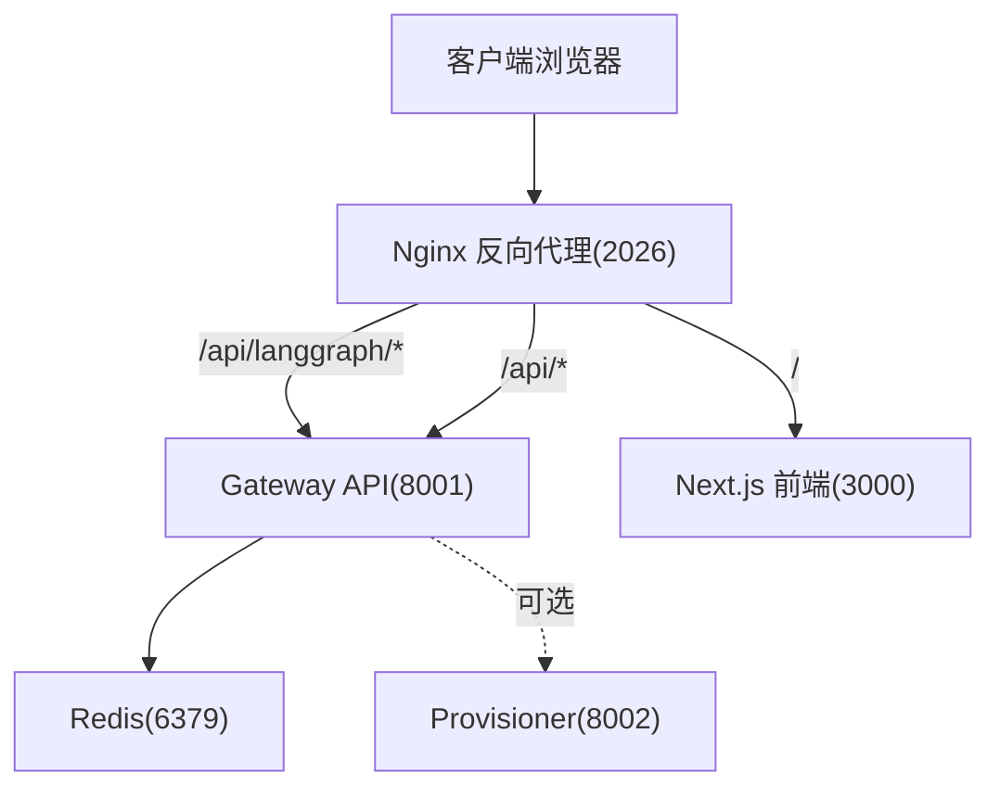
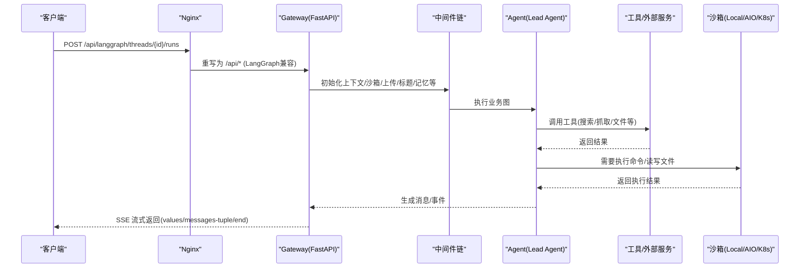
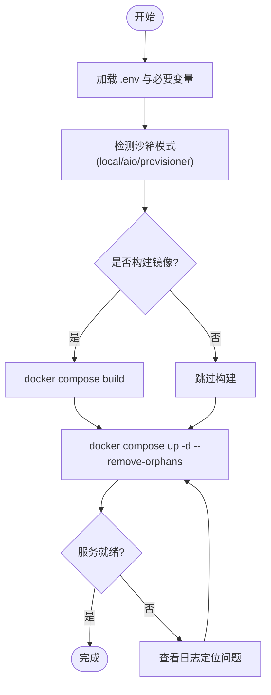
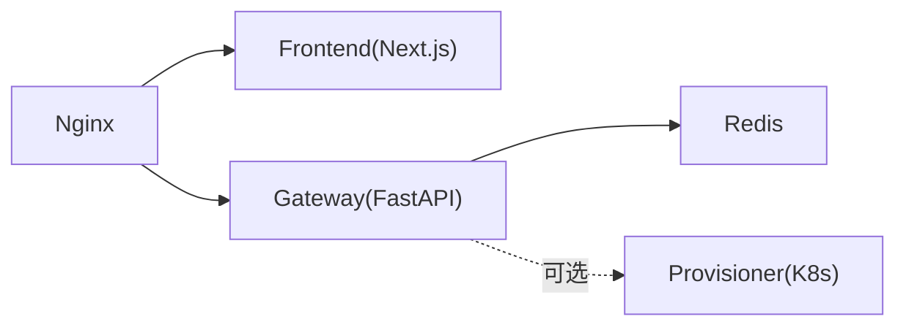

# 部署与运维

<cite>
**本文引用的文件**   
- [README.md](file://README.md)
- [backend/README.md](file://backend/README.md)
- [frontend/README.md](file://frontend/README.md)
- [docker/docker-compose.yaml](file://docker/docker-compose.yaml)
- [docker/docker-compose-dev.yaml](file://docker/docker-compose-dev.yaml)
- [backend/Dockerfile](file://backend/Dockerfile)
- [frontend/Dockerfile](file://frontend/Dockerfile)
- [scripts/deploy.sh](file://scripts/deploy.sh)
- [scripts/docker.sh](file://scripts/docker.sh)
- [config.example.yaml](file://config.example.yaml)
- [backend/docs/CONFIGURATION.md](file://backend/docs/CONFIGURATION.md)
- [backend/docs/ARCHITECTURE.md](file://backend/docs/ARCHITECTURE.md)
- [backend/docs/API.md](file://backend/docs/API.md)
- [backend/docs/SETUP.md](file://backend/docs/SETUP.md)
</cite>

## 目录
1. [简介](#简介)
2. [项目结构](#项目结构)
3. [核心组件](#核心组件)
4. [架构总览](#架构总览)
5. [详细组件分析](#详细组件分析)
6. [依赖关系分析](#依赖关系分析)
7. [性能考量](#性能考量)
8. [故障排查指南](#故障排查指南)
9. [结论](#结论)
10. [附录](#附录)

## 简介
本文件面向 DeerFlow 的部署与运维，覆盖本地开发、Docker 开发与生产环境的不同配置方式；提供完整的容器化部署指南（镜像构建、服务编排、资源配置）；总结生产最佳实践（负载均衡、数据库、缓存、监控）；对比单机、集群与云原生部署模式优缺点与适用场景；给出运维监控（日志收集、性能监控、健康检查、故障排查）、备份恢复策略、容量规划与扩容方案。

## 项目结构
DeerFlow 采用前后端分离与统一反向代理入口：
- Nginx 作为统一入口（默认端口 2026），将 /api/langgraph/* 重写至 Gateway 的 LangGraph 兼容路径，其余 /api/* 路由到 Gateway REST API，静态资源指向前端 Next.js 服务。
- Gateway 内嵌 Agent 运行时（FastAPI + Uvicorn），负责线程、运行、流式响应、模型、MCP、技能、上传、工件等能力。
- 前端为 Next.js 应用，开发时热重载，生产时预构建并启动。
- Redis 用于跨 Worker 的 SSE 流桥接（可选）。
- Provisioner 为可选服务，用于 Kubernetes 模式的沙箱编排。

图示来源
- [backend/docs/ARCHITECTURE.md:1-120](file://backend/docs/ARCHITECTURE.md#L1-L120)
- [docker/docker-compose.yaml:1-120](file://docker/docker-compose.yaml#L1-L120)

章节来源
- [backend/README.md:1-120](file://backend/README.md#L1-L120)
- [backend/docs/ARCHITECTURE.md:1-120](file://backend/docs/ARCHITECTURE.md#L1-L120)
- [docker/docker-compose.yaml:1-120](file://docker/docker-compose.yaml#L1-L120)

## 核心组件
- 网关与运行时
  - FastAPI 网关暴露 REST 与 LangGraph 兼容接口，内嵌 Agent 运行时，支持 SSE 流式输出、检查点、持久化。
- 前端
  - Next.js 应用，开发模式使用 pnpm dev，生产模式使用预构建产物。
- 反向代理
  - Nginx 统一入口，处理路由、CORS、CSRF 同源策略、静态资源转发。
- 数据与缓存
  - Redis 用作跨 Worker 的 SSE 流桥接与 Last-Event-ID 回放缓冲。
- 沙箱与执行
  - 支持本地、Docker、Kubernetes（Provisioner）三种模式；AioSandboxProvider 通过 agent-sandbox SDK 与沙箱容器通信。
- 配置与扩展
  - config.yaml 管理模型、工具、沙箱、技能等；extensions_config.json 管理 MCP 服务器与技能状态。

章节来源
- [backend/README.md:1-120](file://backend/README.md#L1-L120)
- [backend/docs/CONFIGURATION.md:1-120](file://backend/docs/CONFIGURATION.md#L1-L120)
- [backend/docs/ARCHITECTURE.md:120-220](file://backend/docs/ARCHITECTURE.md#L120-L220)

## 架构总览
下图展示从请求进入 Nginx 到 Gateway 内部中间件链、Agent 执行、工具调用与沙箱隔离的整体流程。

图示来源
- [backend/docs/ARCHITECTURE.md:340-420](file://backend/docs/ARCHITECTURE.md#L340-L420)
- [backend/docs/API.md:1-120](file://backend/docs/API.md#L1-L120)

## 详细组件分析

### 开发环境搭建
- 前置条件
  - Node.js 22+、pnpm、Python 3.12+、uv、nginx（本地开发）或 Docker（推荐）。
- 交互式引导
  - 在项目根目录执行 make setup，生成最小 config.yaml 并将密钥写入 .env。
- 本地开发
  - 安装依赖后执行 make dev，启动 Gateway + 前端 + Nginx，访问 http://localhost:2026。
- Docker 开发
  - 拉取沙箱镜像（按需）：make docker-init
  - 启动服务：make docker-start（自动根据 config.yaml 检测沙箱模式）
  - 日志查看：make docker-logs，停止：make docker-stop

章节来源
- [README.md:95-130](file://README.md#L95-L130)
- [README.md:231-270](file://README.md#L231-L270)
- [README.md:270-320](file://README.md#L270-L320)
- [backend/docs/SETUP.md:1-99](file://backend/docs/SETUP.md#L1-L99)
- [scripts/docker.sh:176-280](file://scripts/docker.sh#L176-L280)

### Docker 容器化部署指南
- 镜像构建
  - 后端多阶段构建：builder（编译原生扩展）、dev（保留工具链）、runtime（精简生产镜像）。
  - 前端多阶段构建：dev（仅安装依赖）、builder（预构建产物）、prod（最小运行时）。
- 服务编排
  - 生产 compose：redis、nginx、frontend、gateway（默认单 worker）、provisioner（可选）。
  - 开发 compose：增加源码挂载、热重载、独立网络段。
- 关键环境变量
  - DEER_FLOW_HOME、DEER_FLOW_CONFIG_PATH、DEER_EXTENSIONS_CONFIG_PATH、DEER_FLOW_STREAM_BRIDGE_REDIS_URL、BETTER_AUTH_SECRET、DEER_FLOW_INTERNAL_AUTH_TOKEN、UV_EXTRAS、PORT 等。
- 一键部署脚本
  - deploy.sh 支持 build/start/down；自动检测沙箱模式并在 aio 模式下追加 DooD overlay（挂载宿主机 Docker socket）。

图示来源
- [scripts/deploy.sh:240-385](file://scripts/deploy.sh#L240-L385)
- [docker/docker-compose.yaml:1-182](file://docker/docker-compose.yaml#L1-L182)
- [backend/Dockerfile:1-117](file://backend/Dockerfile#L1-L117)
- [frontend/Dockerfile:1-51](file://frontend/Dockerfile#L1-L51)

章节来源
- [backend/Dockerfile:1-117](file://backend/Dockerfile#L1-L117)
- [frontend/Dockerfile:1-51](file://frontend/Dockerfile#L1-L51)
- [docker/docker-compose.yaml:1-182](file://docker/docker-compose.yaml#L1-L182)
- [docker/docker-compose-dev.yaml:1-221](file://docker/docker-compose-dev.yaml#L1-L221)
- [scripts/deploy.sh:1-120](file://scripts/deploy.sh#L1-L120)

### 生产环境部署最佳实践
- 负载均衡与入口
  - 使用 Nginx 作为统一入口，可结合上游负载均衡器进行水平扩展；注意 CORS 与 CSRF 同源策略设置。
- 数据库配置
  - 选择 sqlite 或 postgres；Postgres 更适合多 Worker 与高可用；Gateway 启动时自动迁移 schema（alembic）。
- 缓存策略
  - Redis 作为 SSE 流桥接与 Last-Event-ID 回放缓冲；合理设置 stream_ttl_seconds 清理策略。
- 监控与追踪
  - 启用 LangSmith/Langfuse 追踪；开启请求级 trace correlation（X-Trace-Id）以便关联日志与链路。
- 安全加固
  - 生产建议禁用文档端点（GATEWAY_ENABLE_DOCS=false）；严格限制 CORS；避免在公网暴露调试接口。

章节来源
- [README.md:258-268](file://README.md#L258-L268)
- [backend/docs/CONFIGURATION.md:570-610](file://backend/docs/CONFIGURATION.md#L570-L610)
- [backend/docs/ARCHITECTURE.md:445-485](file://backend/docs/ARCHITECTURE.md#L445-L485)
- [backend/docs/API.md:595-610](file://backend/docs/API.md#L595-L610)

### 部署模式对比与适用场景
- 单机部署
  - 适合个人开发者或小团队评估；使用 sqlite 与单 worker Gateway；成本低、运维简单。
- 集群部署
  - 适合多用户共享与高并发；使用 Postgres、Redis、多 worker Gateway；需考虑会话粘性与任务归属。
- 云原生部署
  - 使用 K8s 编排，Provisioner 创建 Pod 作为沙箱；具备弹性伸缩、自愈与更强的隔离性。

章节来源
- [README.md:218-230](file://README.md#L218-L230)
- [backend/docs/CONFIGURATION.md:370-420](file://backend/docs/CONFIGURATION.md#L370-L420)
- [docker/docker-compose.yaml:145-176](file://docker/docker-compose.yaml#L145-L176)

### 运维监控指南
- 日志收集
  - 统一入口 Nginx 日志；Gateway 进程日志；前端构建与运行日志；沙箱容器日志（按模式）。
- 性能监控
  - 关注 CPU/内存占用、并发运行数、模型调用延迟与失败率；结合 LangSmith/Langfuse 观测 token 用量与耗时。
- 健康检查
  - Redis ping、Provisioner /health、Gateway 进程存活；Compose healthcheck 已内置。
- 故障排查
  - 使用 make doctor 与 support-bundle 收集诊断信息；查看各服务 logs；核对环境变量与配置文件。

章节来源
- [README.md:118-130](file://README.md#L118-L130)
- [docker/docker-compose.yaml:28-43](file://docker/docker-compose.yaml#L28-L43)
- [docker/docker-compose.yaml:171-176](file://docker/docker-compose.yaml#L171-L176)

### 备份恢复策略
- 数据范围
  - 应用数据：.deer-flow（含 threads、memory、uploads、outputs 等）；数据库文件（sqlite）或 Postgres 实例。
- 备份建议
  - 定期快照 .deer-flow 目录；对 Postgres 使用逻辑备份（pg_dump）或云厂商托管备份。
- 恢复步骤
  - 停止服务；替换数据目录或导入数据库；重启服务；校验功能与数据一致性。

章节来源
- [docker/docker-compose.yaml:99-108](file://docker/docker-compose.yaml#L99-L108)
- [backend/docs/SETUP.md:40-56](file://backend/docs/SETUP.md#L40-L56)

### 容量规划与扩容方案
- 容量规划
  - 参考 README 中的起步与推荐规格；根据并发运行数、沙箱负载与模型调用量调整 vCPU/内存/磁盘。
- 扩容方案
  - 水平扩展 Gateway workers（需启用 Redis 流桥接并接受跨 worker 限制）；垂直扩容节点资源；引入外部负载均衡。
- 限流与保护
  - 在 Nginx 层配置 rate limiting；在 Gateway 层设置 recursion_limit 上限与 token budget。

章节来源
- [README.md:218-230](file://README.md#L218-L230)
- [backend/docs/API.md:100-120](file://backend/docs/API.md#L100-L120)
- [backend/docs/CONFIGURATION.md:44-66](file://backend/docs/CONFIGURATION.md#L44-L66)
- [backend/docs/API.md:595-610](file://backend/docs/API.md#L595-L610)

## 依赖关系分析
- 服务间依赖
  - nginx → frontend/gateway；gateway → redis（可选）；gateway → provisioner（可选）。
- 构建依赖
  - 后端依赖 uv 与 Python 包；前端依赖 pnpm 与 Node 22。
- 外部依赖
  - LLM 提供商、MCP 服务器、沙箱镜像、搜索引擎/抓取服务等。

图示来源
- [docker/docker-compose.yaml:1-120](file://docker/docker-compose.yaml#L1-L120)
- [backend/Dockerfile:1-117](file://backend/Dockerfile#L1-L117)
- [frontend/Dockerfile:1-51](file://frontend/Dockerfile#L1-L51)

章节来源
- [docker/docker-compose.yaml:1-120](file://docker/docker-compose.yaml#L1-L120)
- [backend/Dockerfile:1-117](file://backend/Dockerfile#L1-L117)
- [frontend/Dockerfile:1-51](file://frontend/Dockerfile#L1-L51)

## 性能考量
- 流式传输
  - 使用 SSE 降低首字延迟，提升长任务可见性。
- 上下文管理
  - 摘要中间件在接近 token 限制时压缩历史上下文，保持对话质量与成本平衡。
- 缓存机制
  - MCP 工具缓存基于文件 mtime 失效；配置变更触发重新加载；技能解析一次缓存。
- 资源隔离
  - 沙箱隔离确保执行安全；Docker/K8s 模式提供更强的边界。

章节来源
- [backend/docs/ARCHITECTURE.md:466-485](file://backend/docs/ARCHITECTURE.md#L466-L485)

## 故障排查指南
- 常见问题
  - 配置文件未找到：确认 config.yaml 位置与 DEER_FLOW_PROJECT_ROOT/DEER_FLOW_CONFIG_PATH。
  - 无效 API Key：检查环境变量与前缀 $ 引用。
  - 技能未加载：确认 skills 目录与 SKILL.md 有效性。
  - Docker 沙箱启动失败：检查 Docker 运行状态、端口占用与镜像可达性。
- 诊断工具
  - make doctor 自检；make support-bundle 生成诊断包；查看各服务日志定位问题。

章节来源
- [backend/docs/CONFIGURATION.md:689-713](file://backend/docs/CONFIGURATION.md#L689-L713)
- [backend/docs/SETUP.md:74-99](file://backend/docs/SETUP.md#L74-L99)
- [README.md:118-130](file://README.md#L118-L130)

## 结论
DeerFlow 提供了完善的开发、测试与生产部署路径，借助 Docker 与 Compose 实现快速交付，并通过 Nginx 统一入口简化运维。生产环境建议采用 Postgres、Redis、多 worker Gateway 与 K8s 沙箱编排，配合监控与限流策略保障稳定性与可扩展性。遵循本文档的配置与最佳实践，可有效降低部署复杂度并提升系统可靠性。

## 附录
- 常用命令
  - 本地开发：make dev
  - Docker 开发：make docker-init、make docker-start、make docker-logs、make docker-stop
  - 生产部署：deploy.sh build/start/down 或 make up/down
- 参考文档
  - 配置指南、架构说明、API 参考、安装与设置

章节来源
- [README.md:231-337](file://README.md#L231-L337)
- [backend/docs/CONFIGURATION.md:1-120](file://backend/docs/CONFIGURATION.md#L1-L120)
- [backend/docs/ARCHITECTURE.md:1-120](file://backend/docs/ARCHITECTURE.md#L1-L120)
- [backend/docs/API.md:1-120](file://backend/docs/API.md#L1-L120)
- [backend/docs/SETUP.md:1-99](file://backend/docs/SETUP.md#L1-L99)