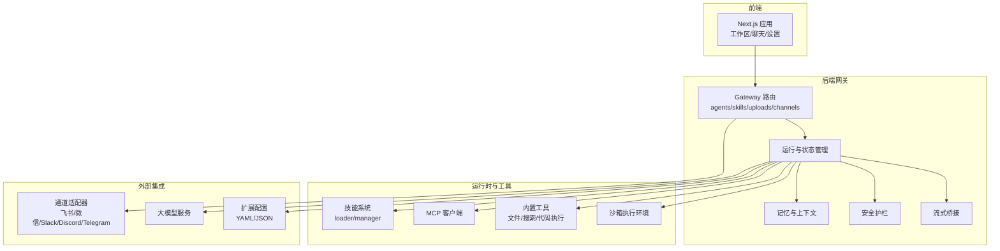
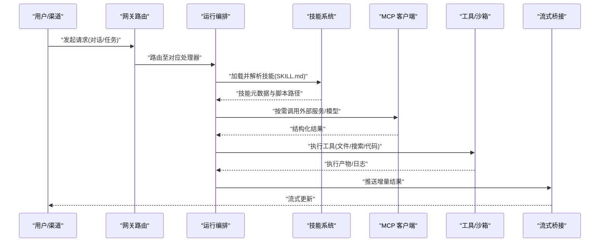
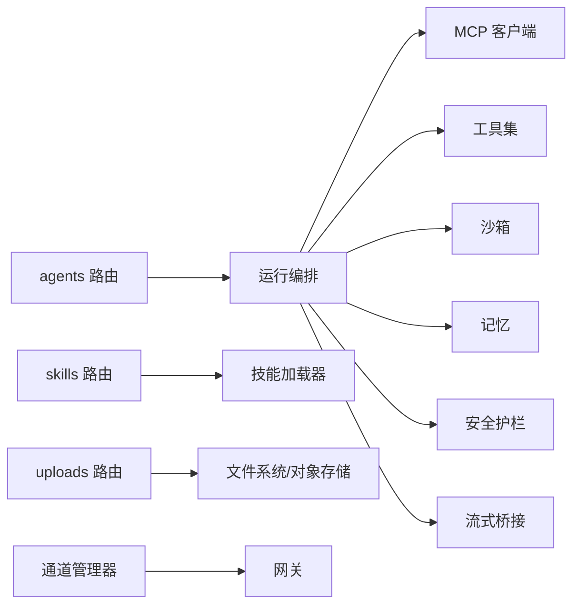

# 应用场景

<cite>
**本文引用的文件**   
- [README.md](file://README.md)
- [backend/README.md](file://backend/README.md)
- [backend/docs/ARCHITECTURE.md](file://backend/docs/ARCHITECTURE.md)
- [backend/docs/CONFIGURATION.md](file://backend/docs/CONFIGURATION.md)
- [backend/docs/MCP_SERVER.md](file://backend/docs/MCP_SERVER.md)
- [backend/docs/GUARDRAILS.md](file://backend/docs/GUARDRAILS.md)
- [backend/docs/STREAMING.md](file://backend/docs/STREAMING.md)
- [backend/docs/FILE_UPLOAD.md](file://backend/docs/FILE_UPLOAD.md)
- [backend/app/gateway/routers/agents.py](file://backend/app/gateway/routers/agents.py)
- [backend/app/gateway/routers/skills.py](file://backend/app/gateway/routers/skills.py)
- [backend/app/gateway/routers/uploads.py](file://backend/app/gateway/routers/uploads.py)
- [backend/app/channels/manager.py](file://backend/app/channels/manager.py)
- [backend/packages/harness/deerflow/skills/loader.py](file://backend/packages/harness/deerflow/skills/loader.py)
- [backend/packages/harness/deerflow/skills/manager.py](file://backend/packages/harness/deerflow/skills/manager.py)
- [backend/packages/harness/deerflow/mcp/client.py](file://backend/packages/harness/deerflow/mcp/client.py)
- [backend/packages/harness/deerflow/tools/builtins/file_operations.py](file://backend/packages/harness/deerflow/tools/builtins/file_operations.py)
- [backend/packages/harness/deerflow/tools/builtins/web_search.py](file://backend/packages/harness/deerflow/tools/builtins/web_search.py)
- [backend/packages/harness/deerflow/tools/builtins/code_execution.py](file://backend/packages/harness/deerflow/tools/builtins/code_execution.py)
- [skills/public/data-analysis/SKILL.md](file://skills/public/data-analysis/SKILL.md)
- [skills/public/chart-visualization/SKILL.md](file://skills/public/chart-visualization/SKILL.md)
- [skills/public/podcast-generation/SKILL.md](file://skills/public/podcast-generation/SKILL.md)
- [skills/public/newsletter-generation/SKILL.md](file://skills/public/newsletter-generation/SKILL.md)
- [skills/public/systematic-literature-review/SKILL.md](file://skills/public/systematic-literature-review/SKILL.md)
- [config.example.yaml](file://config.example.yaml)
- [extensions_config.example.json](file://extensions_config.example.json)
</cite>

## 目录
1. [简介](#简介)
2. [项目结构](#项目结构)
3. [核心组件](#核心组件)
4. [架构总览](#架构总览)
5. [详细场景分析](#详细场景分析)
6. [依赖关系分析](#依赖关系分析)
7. [性能与扩展建议](#性能与扩展建议)
8. [故障排查指南](#故障排查指南)
9. [结论](#结论)
10. [附录：配置与最佳实践](#附录配置与最佳实践)

## 简介
本章节面向业务与技术读者，系统性阐述 DeerFlow 在智能客服、代码助手、数据分析平台、内容创作工具与企业知识管理等典型场景中的应用方案。文档基于仓库现有能力（多通道接入、技能生态、MCP 工具集成、流式输出、上传处理、安全护栏等）给出可落地的架构设计、实施步骤、预期效果与优化建议，帮助快速构建高可用、可扩展的 AI 应用。

## 项目结构
DeerFlow 采用前后端分离与插件化架构：
- 后端提供网关路由、会话与运行管理、技能加载与执行、MCP 客户端、沙箱与工具集、通道适配器等核心能力
- 前端提供工作区、聊天界面、模型与技能选择、结果可视化等交互能力
- 技能生态位于 skills/public 下，以 SKILL.md + scripts/templates/references 形式组织，支持安装、解析、校验与安全扫描
- 配置通过 YAML/JSON 示例驱动，便于在不同环境快速切换

图表来源
- [backend/app/gateway/routers/agents.py](file://backend/app/gateway/routers/agents.py)
- [backend/app/gateway/routers/skills.py](file://backend/app/gateway/routers/skills.py)
- [backend/app/gateway/routers/uploads.py](file://backend/app/gateway/routers/uploads.py)
- [backend/app/channels/manager.py](file://backend/app/channels/manager.py)
- [backend/packages/harness/deerflow/skills/loader.py](file://backend/packages/harness/deerflow/skills/loader.py)
- [backend/packages/harness/deerflow/skills/manager.py](file://backend/packages/harness/deerflow/skills/manager.py)
- [backend/packages/harness/deerflow/mcp/client.py](file://backend/packages/harness/deerflow/mcp/client.py)
- [backend/packages/harness/deerflow/tools/builtins/file_operations.py](file://backend/packages/harness/deerflow/tools/builtins/file_operations.py)
- [backend/packages/harness/deerflow/tools/builtins/web_search.py](file://backend/packages/harness/deerflow/tools/builtins/web_search.py)
- [backend/packages/harness/deerflow/tools/builtins/code_execution.py](file://backend/packages/harness/deerflow/tools/builtins/code_execution.py)

章节来源
- [README.md](file://README.md)
- [backend/README.md](file://backend/README.md)
- [backend/docs/ARCHITECTURE.md](file://backend/docs/ARCHITECTURE.md)

## 核心组件
- 网关路由层：统一暴露 agents、skills、uploads、channels 等接口，承载请求分发与协议适配
- 运行与编排：负责会话生命周期、任务调度、中间件链（如标题生成、澄清、限流、审计等）
- 技能系统：SKILL.md 描述+脚本/模板/参考文档，支持安装、解析、校验与安全扫描
- MCP 客户端：对接外部模型或工具服务，统一调用契约
- 工具集：文件操作、网络搜索、代码执行等内置能力，配合沙箱保障安全
- 通道适配器：飞书、企业微信、微信、Slack、Discord、Telegram 等消息通道
- 安全护栏：对输入输出进行合规检查与降级策略
- 流式桥接：实现 SSE/WS 等流式响应，提升交互体验

章节来源
- [backend/app/gateway/routers/agents.py](file://backend/app/gateway/routers/agents.py)
- [backend/app/gateway/routers/skills.py](file://backend/app/gateway/routers/skills.py)
- [backend/app/gateway/routers/uploads.py](file://backend/app/gateway/routers/uploads.py)
- [backend/app/channels/manager.py](file://backend/app/channels/manager.py)
- [backend/packages/harness/deerflow/skills/loader.py](file://backend/packages/harness/deerflow/skills/loader.py)
- [backend/packages/harness/deerflow/skills/manager.py](file://backend/packages/harness/deerflow/skills/manager.py)
- [backend/packages/harness/deerflow/mcp/client.py](file://backend/packages/harness/deerflow/mcp/client.py)
- [backend/packages/harness/deerflow/tools/builtins/file_operations.py](file://backend/packages/harness/deerflow/tools/builtins/file_operations.py)
- [backend/packages/harness/deerflow/tools/builtins/web_search.py](file://backend/packages/harness/deerflow/tools/builtins/web_search.py)
- [backend/packages/harness/deerflow/tools/builtins/code_execution.py](file://backend/packages/harness/deerflow/tools/builtins/code_execution.py)
- [backend/docs/GUARDRAILS.md](file://backend/docs/GUARDRAILS.md)
- [backend/docs/STREAMING.md](file://backend/docs/STREAMING.md)

## 架构总览
下图展示从用户到技能执行的端到端流程，涵盖网关、运行编排、技能加载、MCP 工具调用、沙箱执行与流式返回。

图表来源
- [backend/app/gateway/routers/agents.py](file://backend/app/gateway/routers/agents.py)
- [backend/packages/harness/deerflow/skills/loader.py](file://backend/packages/harness/deerflow/skills/loader.py)
- [backend/packages/harness/deerflow/mcp/client.py](file://backend/packages/harness/deerflow/mcp/client.py)
- [backend/packages/harness/deerflow/tools/builtins/file_operations.py](file://backend/packages/harness/deerflow/tools/builtins/file_operations.py)
- [backend/packages/harness/deerflow/tools/builtins/web_search.py](file://backend/packages/harness/deerflow/tools/builtins/web_search.py)
- [backend/packages/harness/deerflow/tools/builtins/code_execution.py](file://backend/packages/harness/deerflow/tools/builtins/code_execution.py)
- [backend/docs/STREAMING.md](file://backend/docs/STREAMING.md)

## 详细场景分析

### 场景一：智能客服系统
- 业务需求
  - 多渠道接入（企微/飞书/微信/Slack/Discord/Telegram），统一工单与知识库问答
  - 意图识别与澄清，复杂问题转人工或专家技能
  - 安全合规与敏感信息过滤
- DeerFlow 解决方案
  - 通道管理器统一接入；网关路由将消息转发至运行编排
  - 使用“咨询分析”“深度研究”等技能作为专家能力
  - 安全护栏对输入输出进行审查与降级
  - 流式输出提升实时性
- 实施步骤
  - 配置通道与认证（见附录）
  - 引入咨询分析与深度研究技能，绑定到客服 Agent
  - 启用安全护栏与审计中间件
  - 接入流式桥接，前端展示逐步回答
- 预期效果
  - 首响时间降低，重复问题自动化率提升
  - 合规风险可控，审计可追溯
- 配置要点
  - 通道鉴权、速率限制、超时与重试
  - 技能版本管理与灰度发布
- 最佳实践
  - 常见问题优先命中知识库；复杂问题走“深度研究”技能
  - 关键节点增加澄清中间件，减少误判
- 与传统方案差异
  - 以技能为单元的可插拔能力，无需硬编码即可扩展新领域
  - 统一的安全护栏与审计贯穿全链路

章节来源
- [backend/app/channels/manager.py](file://backend/app/channels/manager.py)
- [backend/app/gateway/routers/agents.py](file://backend/app/gateway/routers/agents.py)
- [backend/docs/GUARDRAILS.md](file://backend/docs/GUARDRAILS.md)
- [backend/docs/STREAMING.md](file://backend/docs/STREAMING.md)
- [skills/public/consulting-analysis/SKILL.md](file://skills/public/consulting-analysis/SKILL.md)
- [skills/public/deep-research/SKILL.md](file://skills/public/deep-research/SKILL.md)

### 场景二：代码助手
- 业务需求
  - 代码理解、重构建议、单元测试生成、错误诊断
  - 安全地执行片段代码与查看依赖
- DeerFlow 解决方案
  - 内置代码执行工具与沙箱隔离
  - 结合“代码文档”“前端设计”等技能增强产出质量
  - 文件操作工具辅助读取/写入工程文件
- 实施步骤
  - 开启沙箱与文件访问白名单
  - 挂载仓库根目录，限定只读/写权限
  - 配置代码相关技能与提示模板
  - 接入 IDE 或 Web 编辑器作为前端入口
- 预期效果
  - 开发效率提升，重复性工作自动化
  - 代码变更可追踪、可回滚
- 配置要点
  - 沙箱资源配额、超时、网络访问控制
  - 工具调用失败降级策略
- 最佳实践
  - 先静态分析再执行代码；小步快跑、分步验证
  - 对高风险命令进行二次确认
- 与传统方案差异
  - 统一的工具与沙箱治理，避免越权与污染
  - 技能化封装使不同语言/框架能力可复用

章节来源
- [backend/packages/harness/deerflow/tools/builtins/code_execution.py](file://backend/packages/harness/deerflow/tools/builtins/code_execution.py)
- [backend/packages/harness/deerflow/tools/builtins/file_operations.py](file://backend/packages/harness/deerflow/tools/builtins/file_operations.py)
- [skills/public/code-documentation/SKILL.md](file://skills/public/code-documentation/SKILL.md)
- [skills/public/frontend-design/SKILL.md](file://skills/public/frontend-design/SKILL.md)

### 场景三：数据分析平台
- 业务需求
  - 数据清洗、探索性分析、可视化报表、报告自动生成
- DeerFlow 解决方案
  - “数据分析”技能 + “图表可视化”技能组合
  - 代码执行工具用于数据处理与绘图
  - 文件上传与下载，支持 CSV/Excel/图片等
- 实施步骤
  - 上传数据集，选择“数据分析”技能
  - 指定图表类型与维度，生成可视化
  - 导出报告与图表，归档到制品库
- 预期效果
  - 分析师聚焦洞察而非重复劳动
  - 报告标准化、可复现
- 配置要点
  - 内存与计算资源上限
  - 第三方绘图库镜像与缓存
- 最佳实践
  - 预置常用分析模板与指标口径
  - 对异常值与缺失值建立规则
- 与传统方案差异
  - 以自然语言驱动的分析流程，降低门槛
  - 可视化与报告一体化，减少工具切换

章节来源
- [skills/public/data-analysis/SKILL.md](file://skills/public/data-analysis/SKILL.md)
- [skills/public/chart-visualization/SKILL.md](file://skills/public/chart-visualization/SKILL.md)
- [backend/app/gateway/routers/uploads.py](file://backend/app/gateway/routers/uploads.py)
- [backend/packages/harness/deerflow/tools/builtins/code_execution.py](file://backend/packages/harness/deerflow/tools/builtins/code_execution.py)

### 场景四：内容创作工具
- 业务需求
  - 播客脚本、新闻通讯、长文/短文案批量生产
  - 多模态素材（文本/音频/视频）流水线
- DeerFlow 解决方案
  - “播客生成”“新闻通讯生成”“图像生成”“视频生成”等技能串联
  - 模板与参考文档保证风格一致
  - 流式输出提升创作反馈速度
- 实施步骤
  - 选择目标内容与风格模板
  - 按流水线依次调用各技能，生成初稿
  - 人工审阅后批量导出
- 预期效果
  - 内容产能显著提升，风格稳定
  - 素材与版本集中管理
- 配置要点
  - 媒体生成服务的密钥与配额
  - 输出格式与命名规范
- 最佳实践
  - 建立风格库与术语表
  - 对敏感词与版权内容进行前置过滤
- 与传统方案差异
  - 技能即工作流，灵活拼装，快速迭代

章节来源
- [skills/public/podcast-generation/SKILL.md](file://skills/public/podcast-generation/SKILL.md)
- [skills/public/newsletter-generation/SKILL.md](file://skills/public/newsletter-generation/SKILL.md)
- [backend/docs/STREAMING.md](file://backend/docs/STREAMING.md)

### 场景五：企业知识管理
- 业务需求
  - 内部文档检索、论文综述、竞品调研、决策支持
- DeerFlow 解决方案
  - “系统化文献综述”“深度研究”“GitHub 深度研究”等技能
  - 网络搜索与 MCP 工具获取外部资料
  - 上传企业内部文档，形成私有知识基座
- 实施步骤
  - 导入文档与索引配置
  - 选择研究主题，触发“系统化文献综述”或“深度研究”
  - 汇总报告、引用来源与证据链
- 预期效果
  - 知识沉淀与复用，缩短调研周期
  - 决策依据可追溯
- 配置要点
  - 搜索引擎与学术数据库接入
  - 权限与访问控制
- 最佳实践
  - 建立知识分类与标签体系
  - 定期更新索引与去重
- 与传统方案差异
  - 以技能为中心的研究工作流，自动收集、筛选与整合

章节来源
- [skills/public/systematic-literature-review/SKILL.md](file://skills/public/systematic-literature-review/SKILL.md)
- [skills/public/github-deep-research/SKILL.md](file://skills/public/github-deep-research/SKILL.md)
- [backend/packages/harness/deerflow/tools/builtins/web_search.py](file://backend/packages/harness/deerflow/tools/builtins/web_search.py)
- [backend/docs/MCP_SERVER.md](file://backend/docs/MCP_SERVER.md)

## 依赖关系分析
- 组件耦合
  - 网关路由依赖运行编排与技能系统
  - 运行编排依赖 MCP 客户端、工具集、沙箱、记忆与安全护栏
  - 通道适配器独立于运行逻辑，通过网关解耦
- 外部依赖
  - 大模型服务、搜索引擎、媒体生成服务、消息平台
- 潜在循环
  - 通过分层与接口抽象避免循环依赖
- 扩展点
  - 新增技能、工具、通道与中间件均可热插拔

图表来源
- [backend/app/gateway/routers/agents.py](file://backend/app/gateway/routers/agents.py)
- [backend/app/gateway/routers/skills.py](file://backend/app/gateway/routers/skills.py)
- [backend/app/gateway/routers/uploads.py](file://backend/app/gateway/routers/uploads.py)
- [backend/packages/harness/deerflow/skills/loader.py](file://backend/packages/harness/deerflow/skills/loader.py)
- [backend/packages/harness/deerflow/mcp/client.py](file://backend/packages/harness/deerflow/mcp/client.py)
- [backend/app/channels/manager.py](file://backend/app/channels/manager.py)

章节来源
- [backend/docs/ARCHITECTURE.md](file://backend/docs/ARCHITECTURE.md)

## 性能与扩展建议
- 性能优化
  - 启用流式输出，降低首屏延迟
  - 对高频技能与工具结果做缓存
  - 合理设置超时、重试与熔断
  - 沙箱资源配额与并发控制
- 扩展开发
  - 新增技能：遵循 SKILL.md 约定，提供脚本与模板
  - 新增工具：注册到工具集，完善错误码与日志
  - 新增通道：实现通道适配器并注册到管理器
  - 新增中间件：在运行编排中插入钩子
- 监控与可观测性
  - 记录关键指标（时延、成功率、Token 用量）
  - 链路追踪与审计日志

[本节为通用指导，不直接分析具体文件]

## 故障排查指南
- 常见问题
  - 通道连接失败：检查鉴权与网络连通性
  - 技能加载失败：核对 SKILL.md 语法与依赖
  - 工具执行超时：调整沙箱资源与超时参数
  - 流式中断：检查网关与前端事件处理
- 定位方法
  - 查看网关与运行日志
  - 启用调试模式与更详细的中间件日志
  - 使用最小复现用例隔离问题
- 恢复策略
  - 降级到非流式模式
  - 切换备用模型或服务
  - 重启受影响的通道或沙箱实例

章节来源
- [backend/docs/STREAMING.md](file://backend/docs/STREAMING.md)
- [backend/docs/GUARDRAILS.md](file://backend/docs/GUARDRAILS.md)

## 结论
DeerFlow 以“技能生态 + 工具与沙箱 + 通道与流式”为核心，能够高效支撑客服、研发、数据、内容与知识管理等多元场景。通过模块化与可插拔设计，团队可以快速拼装出贴合业务的 AI 应用，并在安全、性能与可观测性方面获得企业级保障。

[本节为总结性内容，不直接分析具体文件]

## 附录：配置与最佳实践
- 基础配置
  - 全局配置示例：参见配置文件
  - 扩展配置示例：参见扩展配置
- 关键配置项建议
  - 模型与服务：选择稳定可用的模型提供方，配置重试与降级
  - 通道：为每个通道单独配置鉴权与速率限制
  - 沙箱：限制 CPU/内存/磁盘/网络，启用审计
  - 技能：锁定版本，灰度发布，A/B 测试
- 部署建议
  - 容器化部署，水平扩展网关与运行节点
  - 使用反向代理与负载均衡
  - 持久化会话与制品，定期备份

章节来源
- [config.example.yaml](file://config.example.yaml)
- [extensions_config.example.json](file://extensions_config.example.json)
- [backend/docs/CONFIGURATION.md](file://backend/docs/CONFIGURATION.md)
- [backend/docs/FILE_UPLOAD.md](file://backend/docs/FILE_UPLOAD.md)