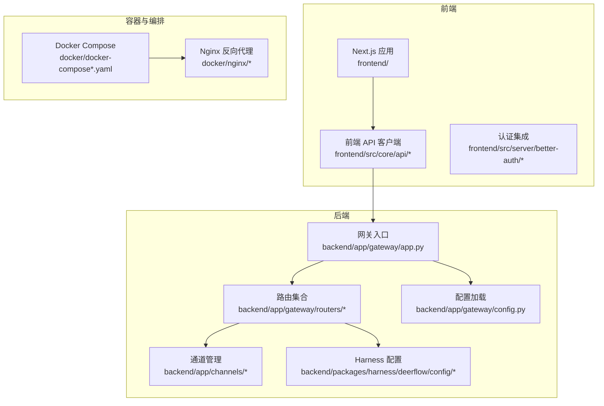
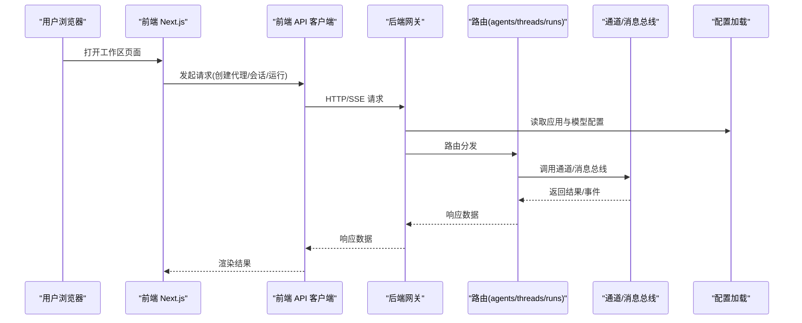
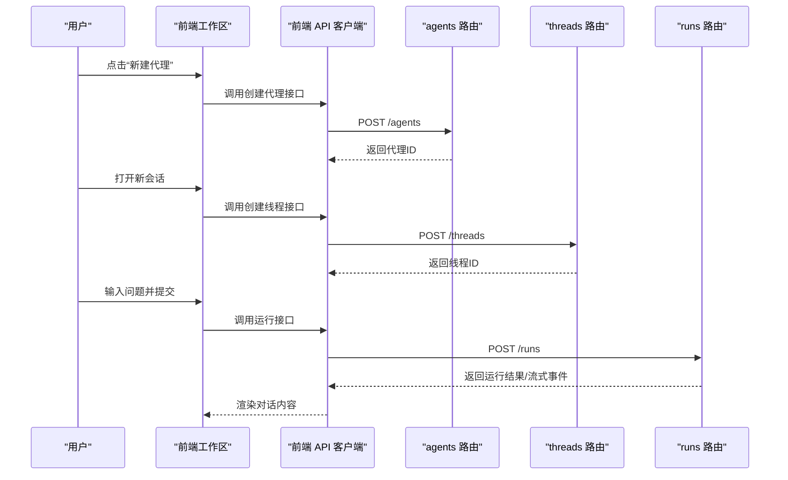
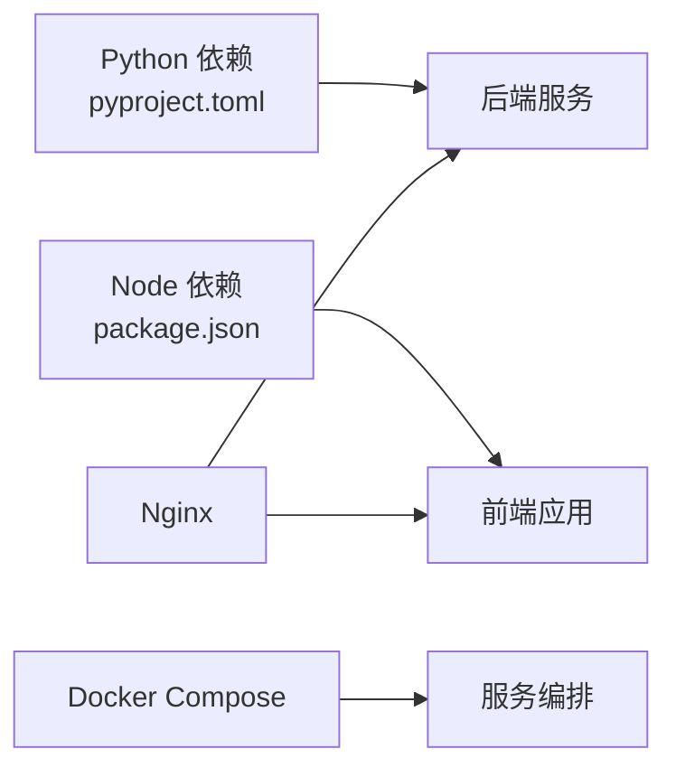

# 快速开始

<cite>
**本文引用的文件**   
- [README_zh.md](file://README_zh.md)
- [Install.md](file://Install.md)
- [config.example.yaml](file://config.example.yaml)
- [extensions_config.example.json](file://extensions_config.example.json)
- [docker/docker-compose.yaml](file://docker/docker-compose.yaml)
- [docker/docker-compose-dev.yaml](file://docker/docker-compose-dev.yaml)
- [backend/Makefile](file://backend/Makefile)
- [frontend/Makefile](file://frontend/Makefile)
- [scripts/setup_wizard.py](file://scripts/setup_wizard.py)
- [scripts/configure.py](file://scripts/configure.py)
- [scripts/deploy.sh](file://scripts/deploy.sh)
- [scripts/docker.sh](file://scripts/docker.sh)
- [scripts/start-daemon.sh](file://scripts/start-daemon.sh)
- [scripts/wait-for-port.sh](file://scripts/wait-for-port.sh)
- [scripts/check.sh](file://scripts/check.sh)
- [.agent/skills/smoke-test/scripts/deploy_local.sh](file://.agent/skills/smoke-test/scripts/deploy_local.sh)
- [.agent/skills/smoke-test/scripts/deploy_docker.sh](file://.agent/skills/smoke-test/scripts/deploy_docker.sh)
- [.agent/skills/smoke-test/scripts/health_check.sh](file://.agent/skills/smoke-test/scripts/health_check.sh)
- [backend/app/gateway/routers/agents.py](file://backend/app/gateway/routers/agents.py)
- [backend/app/gateway/routers/threads.py](file://backend/app/gateway/routers/threads.py)
- [backend/app/gateway/routers/runs.py](file://backend/app/gateway/routers/runs.py)
- [backend/app/gateway/routers/models.py](file://backend/app/gateway/routers/models.py)
- [backend/app/gateway/config.py](file://backend/app/gateway/config.py)
- [backend/app/gateway/app.py](file://backend/app/gateway/app.py)
- [backend/app/channels/manager.py](file://backend/app/channels/manager.py)
- [backend/app/channels/service.py](file://backend/app/channels/service.py)
- [backend/app/channels/store.py](file://backend/app/channels/store.py)
- [backend/app/channels/message_bus.py](file://backend/app/channels/message_bus.py)
- [backend/packages/harness/deerflow/config/app_config.py](file://backend/packages/harness/deerflow/config/app_config.py)
- [backend/packages/harness/deerflow/config/model_config.py](file://backend/packages/harness/deerflow/config/model_config.py)
- [backend/packages/harness/deerflow/config/memory_config.py](file://backend/packages/harness/deerflow/config/memory_config.py)
- [backend/packages/harness/deerflow/config/tool_config.py](file://backend/packages/harness/deerflow/config/tool_config.py)
- [backend/packages/harness/deerflow/config/stream_bridge_config.py](file://backend/packages/harness/deerflow/config/stream_bridge_config.py)
- [backend/packages/harness/deerflow/config/tracing_config.py](file://backend/packages/harness/deerflow/config/tracing_config.py)
- [backend/packages/harness/deerflow/config/sandbox_config.py](file://backend/packages/harness/deerflow/config/sandbox_config.py)
- [backend/packages/harness/deerflow/config/guardrails_config.py](file://backend/packages/harness/deerflow/config/guardrails_config.py)
- [backend/packages/harness/deerflow/config/title_config.py](file://backend/packages/harness/deerflow/config/title_config.py)
- [backend/packages/harness/deerflow/config/token_usage_config.py](file://backend/packages/harness/deerflow/config/token_usage_config.py)
- [backend/packages/harness/deerflow/config/acp_config.py](file://backend/packages/harness/deerflow/config/acp_config.py)
- [backend/packages/harness/deerflow/config/teams_config.py](file://backend/packages/harness/deerflow/config/teams_config.py)
- [backend/packages/harness/deerflow/config/subagents_config.py](file://backend/packages/harness/deerflow/config/subagents_config.py)
- [backend/packages/harness/deerflow/config/skills_config.py](file://backend/packages/harness/deerflow/config/skills_config.py)
- [backend/packages/harness/deerflow/config/tool_search_config.py](file://backend/packages/harness/deerflow/config/tool_search_config.py)
- [backend/packages/harness/deerflow/config/checkpointer_config.py](file://backend/packages/harness/deerflow/config/checkpointer_config.py)
- [backend/packages/harness/deerflow/config/extensions_config.py](file://backend/packages/harness/deerflow/config/extensions_config.py)
- [backend/packages/harness/deerflow/config/summarization_config.py](file://backend/packages/harness/deerflow/config/summarization_config.py)
- [backend/packages/harness/deerflow/config/paths.py](file://backend/packages/harness/deerflow/config/paths.py)
- [backend/docs/SETUP.md](file://backend/docs/SETUP.md)
- [backend/docs/CONFIGURATION.md](file://backend/docs/CONFIGURATION.md)
- [backend/docs/API.md](file://backend/docs/API.md)
- [backend/docs/MCP_SERVER.md](file://backend/docs/MCP_SERVER.md)
- [backend/docs/GUARDRAILS.md](file://backend/docs/GUARDRAILS.md)
- [backend/docs/STREAMING.md](file://backend/docs/STREAMING.md)
- [backend/docs/FILE_UPLOAD.md](file://backend/docs/FILE_UPLOAD.md)
- [backend/docs/AUTO_TITLE_GENERATION.md](file://backend/docs/AUTO_TITLE_GENERATION.md)
- [backend/docs/plan_mode_usage.md](file://backend/docs/plan_mode_usage.md)
- [backend/docs/middleware-execution-flow.md](file://backend/docs/middleware-execution-flow.md)
- [backend/docs/rfc-create-deerflow-agent.md](file://backend/docs/rfc-create-deerflow-agent.md)
- [backend/docs/rfc-extract-shared-modules.md](file://backend/docs/rfc-extract-shared-modules.md)
- [backend/docs/rfc-grep-glob-tools.md](file://backend/docs/rfc-grep-glob-tools.md)
- [backend/docs/summarization.md](file://backend/docs/summarization.md)
- [backend/docs/task_tool_improvements.md](file://backend/docs/task_tool_improvements.md)
- [backend/docs/memory-settings-sample.json](file://backend/docs/memory-settings-sample.json)
- [backend/docs/ARCHITECTURE.md](file://backend/docs/ARCHITECTURE.md)
- [backend/docs/APPLE_CONTAINER.md](file://backend/docs/APPLE_CONTAINER.md)
- [backend/docs/HARNESS_APP_SPLIT.md](file://backend/docs/HARNESS_APP_SPLIT.md)
- [backend/docs/TITLE_GENERATION_IMPLEMENTATION.md](file://backend/docs/TITLE_GENERATION_IMPLEMENTATION.md)
- [backend/docs/TODO.md](file://backend/docs/TODO.md)
- [backend/AGENTS.md](file://backend/AGENTS.md)
- [backend/CLAUDE.md](file://backend/CLAUDE.md)
- [backend/CONTRIBUTING.md](file://backend/CONTRIBUTING.md)
- [backend/debug.py](file://backend/debug.py)
- [backend/langgraph.json](file://backend/langgraph.json)
- [backend/pyproject.toml](file://backend/pyproject.toml)
- [backend/ruff.toml](file://backend/ruff.toml)
- [backend/Dockerfile](file://backend/Dockerfile)
- [frontend/package.json](file://frontend/package.json)
- [frontend/Makefile](file://frontend/Makefile)
- [frontend/Dockerfile](file://frontend/Dockerfile)
- [frontend/src/env.js](file://frontend/src/env.js)
- [frontend/src/server/better-auth/config.ts](file://frontend/src/server/better-auth/config.ts)
- [frontend/src/server/better-auth/client.ts](file://frontend/src/server/better-auth/client.ts)
- [frontend/src/server/better-auth/index.ts](file://frontend/src/server/better-auth/index.ts)
- [frontend/src/server/better-auth/server.ts](file://frontend/src/server/better-auth/server.ts)
- [frontend/src/app/api/auth/[...all]/route.ts](file://frontend/src/app/api/auth/[...all]/route.ts)
- [frontend/src/app/workspace/layout.tsx](file://frontend/src/app/workspace/layout.tsx)
- [frontend/src/app/workspace/page.tsx](file://frontend/src/app/workspace/page.tsx)
- [frontend/src/components/workspace/workspace-container.tsx](file://frontend/src/components/workspace/workspace-container.tsx)
- [frontend/src/components/workspace/workspace-header.tsx](file://frontend/src/components/workspace/workspace-header.tsx)
- [frontend/src/components/workspace/workspace-nav-menu.tsx](file://frontend/src/components/workspace/workspace-nav-menu.tsx)
- [frontend/src/components/workspace/workspace-sidebar.tsx](file://frontend/src/components/workspace/workspace-sidebar.tsx)
- [frontend/src/components/workspace/welcome.tsx](file://frontend/src/components/workspace/welcome.tsx)
- [frontend/src/components/workspace/agent-welcome.tsx](file://frontend/src/components/workspace/agent-welcome.tsx)
- [frontend/src/core/agents/api.ts](file://frontend/src/core/agents/api.ts)
- [frontend/src/core/agents/hooks.ts](file://frontend/src/core/agents/hooks.ts)
- [frontend/src/core/agents/index.ts](file://frontend/src/core/agents/index.ts)
- [frontend/src/core/agents/types.ts](file://frontend/src/core/agents/types.ts)
- [frontend/src/core/api/api-client.ts](file://frontend/src/core/api/api-client.ts)
- [frontend/src/core/api/index.ts](file://frontend/src/core/api/index.ts)
- [frontend/src/core/api/stream-mode.ts](file://frontend/src/core/api/stream-mode.ts)
- [frontend/src/core/config/index.ts](file://frontend/src/core/config/index.ts)
- [frontend/src/core/i18n/context.tsx](file://frontend/src/core/i18n/context.tsx)
- [frontend/src/core/i18n/cookies.ts](file://frontend/src/core/i18n/cookies.ts)
- [frontend/src/core/i18n/hooks.ts](file://frontend/src/core/i18n/hooks.ts)
- [frontend/src/core/i18n/index.ts](file://frontend/src/core/i18n/index.ts)
- [frontend/src/core/i18n/locale.ts](file://frontend/src/core/i18n/locale.ts)
- [frontend/src/core/i18n/server.ts](file://frontend/src/core/i18n/server.ts)
- [frontend/src/core/i18n/translations.ts](file://frontend/src/core/i18n/translations.ts)
- [frontend/src/core/mcp/api.ts](file://frontend/src/core/mcp/api.ts)
- [frontend/src/core/mcp/hooks.ts](file://frontend/src/core/mcp/hooks.ts)
- [frontend/src/core/mcp/index.ts](file://frontend/src/core/mcp/index.ts)
- [frontend/src/core/mcp/types.ts](file://frontend/src/core/mcp/types.ts)
- [frontend/src/core/memory/index.ts](file://frontend/src/core/memory/index.ts)
- [frontend/src/core/messages/index.ts](file://frontend/src/core/messages/index.ts)
- [frontend/src/core/models/index.ts](file://frontend/src/core/models/index.ts)
- [frontend/src/core/notification/index.ts](file://frontend/src/core/notification/index.ts)
- [frontend/src/core/rehype/index.ts](file://frontend/src/core/rehype/index.ts)
- [frontend/src/core/settings/index.ts](file://frontend/src/core/settings/index.ts)
- [frontend/src/core/skills/index.ts](file://frontend/src/core/skills/index.ts)
- [frontend/src/core/streamdown/index.ts](file://frontend/src/core/streamdown/index.ts)
- [frontend/src/core/tasks/index.ts](file://frontend/src/core/tasks/index.ts)
- [frontend/src/core/threads/index.ts](file://frontend/src/core/threads/index.ts)
- [frontend/src/core/todos/index.ts](file://frontend/src/core/todos/index.ts)
- [frontend/src/core/tools/index.ts](file://frontend/src/core/tools/index.ts)
- [frontend/src/core/uploads/index.ts](file://frontend/src/core/uploads/index.ts)
- [frontend/src/core/utils/index.ts](file://frontend/src/core/utils/index.ts)
- [frontend/src/lib/ime.ts](file://frontend/src/lib/ime.ts)
- [frontend/src/lib/utils.ts](file://frontend/src/lib/utils.ts)
- [frontend/public/demo/threads/21cfea46-34bd-4aa6-9e1f-3009452fbeb9/thread.json](file://frontend/public/demo/threads/21cfea46-34bd-4aa6-9e1f-3009452fbeb9/thread.json)
- [frontend/public/demo/threads/3823e443-e2b-4679-b496-a9506eae6b2b/thread.json](file://frontend/public/demo/threads/3823e443-e2b-4679-b496-a9506eae6b2b/thread.json)
- [frontend/public/demo/threads/4f3e55ee-f853-43db-bfb3-7d1a411f03cb/thread.json](file://frontend/public/demo/threads/4f3e55ee-f853-43db-bfb3-7d1a411f03cb/thread.json)
- [frontend/public/demo/threads/5aa47db1-d0cb-4eb9-aea9-3dac1b371c5a/thread.json](file://frontend/public/demo/threads/5aa47db1-d0cb-4eb9-aea9-3dac1b371c5a/thread.json)
- [frontend/public/demo/threads/7cfa5f8f-a2f8-47ad-acbd-da7137baf990/thread.json](file://frontend/public/demo/threads/7cfa5f8f-a2f8-47ad-acbd-da7137baf990/thread.json)
- [frontend/public/demo/threads/7f9dc56c-e49c-4671-a3d2-c492ff4dce990/thread.json](file://frontend/public/demo/threads/7f9dc56c-e49c-4671-a3d2-c492ff4dce990/thread.json)
- [frontend/public/demo/threads/90040b36-7eba-4b97-ba89-02c3ad47a8b9/thread.json](file://frontend/public/demo/threads/90040b36-7eba-4b97-ba89-02c3ad47a8b9/thread.json)
- [frontend/public/demo/threads/ad76c455-5bf9-4335-8517-fc13834ab828/thread.json](file://frontend/public/demo/threads/ad76c455-5bf9-4335-8517-fc13834ab828/thread.json)
- [frontend/public/demo/threads/b83fbb2a-e36-4d82-9de0-7b2a02c2092a/thread.json](file://frontend/public/demo/threads/b83fbb2a-e36-4d82-9de0-7b2a02c2092a/thread.json)
- [frontend/public/demo/threads/c02bb2d42-02-490e-ae8f-ff4864fc0d2e/thread.json](file://frontend/public/demo/threads/c02bb2d42-02-490e-ae8f-ff4864fc0d2e/thread.json)
- [frontend/public/demo/threads/d3e5adaf-08c-4dd5-9d29-94f1d6bccd98/thread.json](file://frontend/public/demo/threads/d3e5adaf-08c-4dd5-9d29-94f1d6bccd98/thread.json)
- [frontend/public/demo/threads/f4125791-0128-402a-8ca9-50e0947557e4/thread.json](file://frontend/public/demo/threads/f4125791-0128-402a-8ca9-50e0947557e4/thread.json)
- [frontend/public/demo/threads/fe3f7974-1bcb-4a01-a950-79673baafefd/thread.json](file://frontend/public/demo/threads/fe3f7974-1bcb-4a01-a950-79673baafefd/thread.json)
</cite>

## 目录
1. [简介](#简介)
2. [项目结构](#项目结构)
3. [核心组件](#核心组件)
4. [架构总览](#架构总览)
5. [详细组件分析](#详细组件分析)
6. [依赖分析](#依赖分析)
7. [性能考虑](#性能考虑)
8. [故障排查指南](#故障排查指南)
9. [结论](#结论)
10. [附录](#附录)

## 简介
本快速开始指南面向首次接触 DeerFlow 的用户，目标是在 30 分钟内完成环境准备、安装部署、基础配置与第一个对话的创建和验证。内容覆盖：
- 系统要求与依赖版本
- 本地开发环境搭建
- Docker 容器化部署
- Kubernetes 集群部署（概念性指引）
- 环境变量与配置文件说明
- 初始化管理员账户（如启用认证）
- 创建并测试第一个代理
- 常见问题排查
- 在线演示访问方式与基本操作

## 项目结构
DeerFlow 采用前后端分离的多模块仓库结构：
- backend：后端服务、网关路由、配置、运行时、工具与技能等
- frontend：前端应用、工作区、API 客户端、国际化与主题等
- docker：Docker Compose 编排与 Nginx 反向代理配置
- scripts：一键脚本与向导（setup_wizard、configure、deploy、docker 等）
- skills：内置技能包与示例
- docs：后端文档与使用说明

图表来源
- [backend/app/gateway/app.py](file://backend/app/gateway/app.py)
- [backend/app/gateway/config.py](file://backend/app/gateway/config.py)
- [backend/app/gateway/routers/agents.py](file://backend/app/gateway/routers/agents.py)
- [backend/app/gateway/routers/threads.py](file://backend/app/gateway/routers/threads.py)
- [backend/app/gateway/routers/runs.py](file://backend/app/gateway/routers/runs.py)
- [backend/app/channels/manager.py](file://backend/app/channels/manager.py)
- [backend/packages/harness/deerflow/config/app_config.py](file://backend/packages/harness/deerflow/config/app_config.py)
- [docker/docker-compose.yaml](file://docker/docker-compose.yaml)
- [docker/nginx/nginx.conf](file://docker/nginx/nginx.conf)

章节来源
- [README_zh.md](file://README_zh.md)
- [backend/docs/ARCHITECTURE.md](file://backend/docs/ARCHITECTURE.md)

## 核心组件
- 网关与服务启动
  - 网关入口负责初始化应用、挂载路由、加载配置与中间件
  - 参考路径：[backend/app/gateway/app.py](file://backend/app/gateway/app.py)、[backend/app/gateway/config.py](file://backend/app/gateway/config.py)
- 路由层
  - agents：代理生命周期与实例管理
  - threads：会话线程与上下文
  - runs：运行任务与执行状态
  - models：模型选择与能力查询
  - 参考路径：
    - [backend/app/gateway/routers/agents.py](file://backend/app/gateway/routers/agents.py)
    - [backend/app/gateway/routers/threads.py](file://backend/app/gateway/routers/threads.py)
    - [backend/app/gateway/routers/runs.py](file://backend/app/gateway/routers/runs.py)
    - [backend/app/gateway/routers/models.py](file://backend/app/gateway/routers/models.py)
- 通道与消息总线
  - 统一通道抽象、消息分发与持久化
  - 参考路径：
    - [backend/app/channels/manager.py](file://backend/app/channels/manager.py)
    - [backend/app/channels/service.py](file://backend/app/channels/service.py)
    - [backend/app/channels/store.py](file://backend/app/channels/store.py)
    - [backend/app/channels/message_bus.py](file://backend/app/channels/message_bus.py)
- Harness 配置体系
  - 应用、模型、记忆、工具、流式桥接、追踪、沙箱、护栏、标题生成、Token 用量、ACP、团队、子代理、技能、工具搜索、检查点、扩展、摘要、路径等
  - 参考路径：
    - [backend/packages/harness/deerflow/config/app_config.py](file://backend/packages/harness/deerflow/config/app_config.py)
    - [backend/packages/harness/deerflow/config/model_config.py](file://backend/packages/harness/deerflow/config/model_config.py)
    - [backend/packages/harness/deerflow/config/memory_config.py](file://backend/packages/harness/deerflow/config/memory_config.py)
    - [backend/packages/harness/deerflow/config/tool_config.py](file://backend/packages/harness/deerflow/config/tool_config.py)
    - [backend/packages/harness/deerflow/config/stream_bridge_config.py](file://backend/packages/harness/deerflow/config/stream_bridge_config.py)
    - [backend/packages/harness/deerflow/config/tracing_config.py](file://backend/packages/harness/deerflow/config/tracing_config.py)
    - [backend/packages/harness/deerflow/config/sandbox_config.py](file://backend/packages/harness/deerflow/config/sandbox_config.py)
    - [backend/packages/harness/deerflow/config/guardrails_config.py](file://backend/packages/harness/deerflow/config/guardrails_config.py)
    - [backend/packages/harness/deerflow/config/title_config.py](file://backend/packages/harness/deerflow/config/title_config.py)
    - [backend/packages/harness/deerflow/config/token_usage_config.py](file://backend/packages/harness/deerflow/config/token_usage_config.py)
    - [backend/packages/harness/deerflow/config/acp_config.py](file://backend/packages/harness/deerflow/config/acp_config.py)
    - [backend/packages/harness/deerflow/config/teams_config.py](file://backend/packages/harness/deerflow/config/teams_config.py)
    - [backend/packages/harness/deerflow/config/subagents_config.py](file://backend/packages/harness/deerflow/config/subagents_config.py)
    - [backend/packages/harness/deerflow/config/skills_config.py](file://backend/packages/harness/deerflow/config/skills_config.py)
    - [backend/packages/harness/deerflow/config/tool_search_config.py](file://backend/packages/harness/deerflow/config/tool_search_config.py)
    - [backend/packages/harness/deerflow/config/checkpointer_config.py](file://backend/packages/harness/deerflow/config/checkpointer_config.py)
    - [backend/packages/harness/deerflow/config/extensions_config.py](file://backend/packages/harness/deerflow/config/extensions_config.py)
    - [backend/packages/harness/deerflow/config/summarization_config.py](file://backend/packages/harness/deerflow/config/summarization_config.py)
    - [backend/packages/harness/deerflow/config/paths.py](file://backend/packages/harness/deerflow/config/paths.py)

章节来源
- [backend/app/gateway/app.py](file://backend/app/gateway/app.py)
- [backend/app/gateway/config.py](file://backend/app/gateway/config.py)
- [backend/app/gateway/routers/agents.py](file://backend/app/gateway/routers/agents.py)
- [backend/app/gateway/routers/threads.py](file://backend/app/gateway/routers/threads.py)
- [backend/app/gateway/routers/runs.py](file://backend/app/gateway/routers/runs.py)
- [backend/app/gateway/routers/models.py](file://backend/app/gateway/routers/models.py)
- [backend/app/channels/manager.py](file://backend/app/channels/manager.py)
- [backend/app/channels/service.py](file://backend/app/channels/service.py)
- [backend/app/channels/store.py](file://backend/app/channels/store.py)
- [backend/app/channels/message_bus.py](file://backend/app/channels/message_bus.py)
- [backend/packages/harness/deerflow/config/app_config.py](file://backend/packages/harness/deerflow/config/app_config.py)
- [backend/packages/harness/deerflow/config/model_config.py](file://backend/packages/harness/deerflow/config/model_config.py)
- [backend/packages/harness/deerflow/config/memory_config.py](file://backend/packages/harness/deerflow/config/memory_config.py)
- [backend/packages/harness/deerflow/config/tool_config.py](file://backend/packages/harness/deerflow/config/tool_config.py)
- [backend/packages/harness/deerflow/config/stream_bridge_config.py](file://backend/packages/harness/deerflow/config/stream_bridge_config.py)
- [backend/packages/harness/deerflow/config/tracing_config.py](file://backend/packages/harness/deerflow/config/tracing_config.py)
- [backend/packages/harness/deerflow/config/sandbox_config.py](file://backend/packages/harness/deerflow/config/sandbox_config.py)
- [backend/packages/harness/deerflow/config/guardrails_config.py](file://backend/packages/harness/deerflow/config/guardrails_config.py)
- [backend/packages/harness/deerflow/config/title_config.py](file://backend/packages/harness/deerflow/config/title_config.py)
- [backend/packages/harness/deerflow/config/token_usage_config.py](file://backend/packages/harness/deerflow/config/token_usage_config.py)
- [backend/packages/harness/deerflow/config/acp_config.py](file://backend/packages/harness/deerflow/config/acp_config.py)
- [backend/packages/harness/deerflow/config/teams_config.py](file://backend/packages/harness/deerflow/config/teams_config.py)
- [backend/packages/harness/deerflow/config/subagents_config.py](file://backend/packages/harness/deerflow/config/subagents_config.py)
- [backend/packages/harness/deerflow/config/skills_config.py](file://backend/packages/harness/deerflow/config/skills_config.py)
- [backend/packages/harness/deerflow/config/tool_search_config.py](file://backend/packages/harness/deerflow/config/tool_search_config.py)
- [backend/packages/harness/deerflow/config/checkpointer_config.py](file://backend/packages/harness/deerflow/config/checkpointer_config.py)
- [backend/packages/harness/deerflow/config/extensions_config.py](file://backend/packages/harness/deerflow/config/extensions_config.py)
- [backend/packages/harness/deerflow/config/summarization_config.py](file://backend/packages/harness/deerflow/config/summarization_config.py)
- [backend/packages/harness/deerflow/config/paths.py](file://backend/packages/harness/deerflow/config/paths.py)

## 架构总览
下图展示了从浏览器到后端网关、路由、通道与配置的调用链路，以及容器编排与反向代理的关系。

图表来源
- [backend/app/gateway/app.py](file://backend/app/gateway/app.py)
- [backend/app/gateway/config.py](file://backend/app/gateway/config.py)
- [backend/app/gateway/routers/agents.py](file://backend/app/gateway/routers/agents.py)
- [backend/app/gateway/routers/threads.py](file://backend/app/gateway/routers/threads.py)
- [backend/app/gateway/routers/runs.py](file://backend/app/gateway/routers/runs.py)
- [backend/app/channels/manager.py](file://backend/app/channels/manager.py)
- [backend/app/channels/message_bus.py](file://backend/app/channels/message_bus.py)

## 详细组件分析

### 环境准备与系统要求
- 操作系统：Linux/macOS/Windows（推荐 Linux 或 macOS 用于开发）
- Python：建议使用与后端 pyproject 一致的版本（参见后端依赖声明）
- Node.js：建议与前端 package.json 一致（参见前端依赖声明）
- Docker 与 Docker Compose：用于容器化部署
- 可选：Kubernetes（用于集群部署）

章节来源
- [backend/pyproject.toml](file://backend/pyproject.toml)
- [frontend/package.json](file://frontend/package.json)

### 安装与部署

#### 方式一：本地开发环境
- 克隆仓库后进入后端目录，使用 Makefile 提供的命令进行依赖安装与启动
- 前端同样通过 Makefile 安装依赖与启动开发服务器
- 可使用脚本进行健康检查与端口等待

步骤要点：
- 后端：安装依赖、初始化配置、启动服务
- 前端：安装依赖、启动开发服务器
- 健康检查：确认后端端口可达

章节来源
- [backend/Makefile](file://backend/Makefile)
- [frontend/Makefile](file://frontend/Makefile)
- [scripts/wait-for-port.sh](file://scripts/wait-for-port.sh)
- [scripts/check.sh](file://scripts/check.sh)

#### 方式二：Docker 容器化部署
- 使用 docker-compose 一键拉起前后端与 Nginx 反向代理
- 支持开发模式与生产模式的 compose 文件
- 可通过脚本自动化部署流程

步骤要点：
- 准备环境变量与配置文件
- 构建镜像并启动服务
- 通过 Nginx 暴露前端与后端接口

章节来源
- [docker/docker-compose.yaml](file://docker/docker-compose.yaml)
- [docker/docker-compose-dev.yaml](file://docker/docker-compose-dev.yaml)
- [docker/nginx/nginx.conf](file://docker/nginx/nginx.conf)
- [scripts/deploy.sh](file://scripts/deploy.sh)
- [scripts/docker.sh](file://scripts/docker.sh)

#### 方式三：Kubernetes 集群部署（概念性指引）
- 将后端与前端分别打包为镜像
- 使用 Deployment、Service、Ingress 等资源对象进行编排
- 结合 ConfigMap/Secret 管理配置与密钥
- 使用持久卷存储会话与上传文件
- 可参考 Helm Chart 或 Kustomize 模板进行版本化管理

注意：本节为通用实践说明，未直接映射具体源码文件，故不附“章节来源”。

### 配置与环境变量

#### 全局配置与示例
- 根级配置示例：config.example.yaml
- 扩展配置示例：extensions_config.example.json
- 后端配置加载器与配置项定义位于 gateway 与 harness 配置模块中

章节来源
- [config.example.yaml](file://config.example.yaml)
- [extensions_config.example.json](file://extensions_config.example.json)
- [backend/app/gateway/config.py](file://backend/app/gateway/config.py)
- [backend/packages/harness/deerflow/config/app_config.py](file://backend/packages/harness/deerflow/config/app_config.py)

#### 关键配置项概览
- 应用配置：应用行为、路径、日志等
- 模型配置：LLM 提供商、鉴权、速率限制等
- 记忆配置：会话记忆策略与存储
- 工具配置：内置与自定义工具开关
- 流式桥接：SSE 流式输出相关
- 追踪配置：链路追踪与观测
- 沙箱配置：代码执行隔离与安全策略
- 护栏配置：安全规则与内容过滤
- 标题生成：自动标题策略
- Token 用量：统计与限额
- ACP/团队/子代理/技能/工具搜索/检查点/扩展/摘要/路径等

章节来源
- [backend/packages/harness/deerflow/config/app_config.py](file://backend/packages/harness/deerflow/config/app_config.py)
- [backend/packages/harness/deerflow/config/model_config.py](file://backend/packages/harness/deerflow/config/model_config.py)
- [backend/packages/harness/deerflow/config/memory_config.py](file://backend/packages/harness/deerflow/config/memory_config.py)
- [backend/packages/harness/deerflow/config/tool_config.py](file://backend/packages/harness/deerflow/config/tool_config.py)
- [backend/packages/harness/deerflow/config/stream_bridge_config.py](file://backend/packages/harness/deerflow/config/stream_bridge_config.py)
- [backend/packages/harness/deerflow/config/tracing_config.py](file://backend/packages/harness/deerflow/config/tracing_config.py)
- [backend/packages/harness/deerflow/config/sandbox_config.py](file://backend/packages/harness/deerflow/config/sandbox_config.py)
- [backend/packages/harness/deerflow/config/guardrails_config.py](file://backend/packages/harness/deerflow/config/guardrails_config.py)
- [backend/packages/harness/deerflow/config/title_config.py](file://backend/packages/harness/deerflow/config/title_config.py)
- [backend/packages/harness/deerflow/config/token_usage_config.py](file://backend/packages/harness/deerflow/config/token_usage_config.py)
- [backend/packages/harness/deerflow/config/acp_config.py](file://backend/packages/harness/deerflow/config/acp_config.py)
- [backend/packages/harness/deerflow/config/teams_config.py](file://backend/packages/harness/deerflow/config/teams_config.py)
- [backend/packages/harness/deerflow/config/subagents_config.py](file://backend/packages/harness/deerflow/config/subagents_config.py)
- [backend/packages/harness/deerflow/config/skills_config.py](file://backend/packages/harness/deerflow/config/skills_config.py)
- [backend/packages/harness/deerflow/config/tool_search_config.py](file://backend/packages/harness/deerflow/config/tool_search_config.py)
- [backend/packages/harness/deerflow/config/checkpointer_config.py](file://backend/packages/harness/deerflow/config/checkpointer_config.py)
- [backend/packages/harness/deerflow/config/extensions_config.py](file://backend/packages/harness/deerflow/config/extensions_config.py)
- [backend/packages/harness/deerflow/config/summarization_config.py](file://backend/packages/harness/deerflow/config/summarization_config.py)
- [backend/packages/harness/deerflow/config/paths.py](file://backend/packages/harness/deerflow/config/paths.py)

#### 前端环境变量与认证
- 前端环境变量定义与加载
- Better-Auth 认证集成（服务端与客户端）
- 认证路由与页面布局

章节来源
- [frontend/src/env.js](file://frontend/src/env.js)
- [frontend/src/server/better-auth/config.ts](file://frontend/src/server/better-auth/config.ts)
- [frontend/src/server/better-auth/client.ts](file://frontend/src/server/better-auth/client.ts)
- [frontend/src/server/better-auth/index.ts](file://frontend/src/server/better-auth/index.ts)
- [frontend/src/server/better-auth/server.ts](file://frontend/src/server/better-auth/server.ts)
- [frontend/src/app/api/auth/[...all]/route.ts](file://frontend/src/app/api/auth/[...all]/route.ts)
- [frontend/src/app/workspace/layout.tsx](file://frontend/src/app/workspace/layout.tsx)

### 初始化管理员账户
- 若启用了认证，需通过认证路由完成管理员注册或登录
- 可在前端工作区页面进行账号管理与权限设置
- 也可通过脚本或 CLI 进行初始化（如有提供）

章节来源
- [frontend/src/app/api/auth/[...all]/route.ts](file://frontend/src/app/api/auth/[...all]/route.ts)
- [frontend/src/app/workspace/layout.tsx](file://frontend/src/app/workspace/layout.tsx)

### 创建并测试第一个代理
- 通过网关 agents 路由创建代理实例
- 通过 threads 路由创建会话线程
- 通过 runs 路由提交运行任务并获取结果
- 前端通过 API 客户端与工作区组件完成交互

图表来源
- [backend/app/gateway/routers/agents.py](file://backend/app/gateway/routers/agents.py)
- [backend/app/gateway/routers/threads.py](file://backend/app/gateway/routers/threads.py)
- [backend/app/gateway/routers/runs.py](file://backend/app/gateway/routers/runs.py)
- [frontend/src/core/agents/api.ts](file://frontend/src/core/agents/api.ts)
- [frontend/src/core/agents/hooks.ts](file://frontend/src/core/agents/hooks.ts)
- [frontend/src/core/api/api-client.ts](file://frontend/src/core/api/api-client.ts)

章节来源
- [backend/app/gateway/routers/agents.py](file://backend/app/gateway/routers/agents.py)
- [backend/app/gateway/routers/threads.py](file://backend/app/gateway/routers/threads.py)
- [backend/app/gateway/routers/runs.py](file://backend/app/gateway/routers/runs.py)
- [frontend/src/core/agents/api.ts](file://frontend/src/core/agents/api.ts)
- [frontend/src/core/agents/hooks.ts](file://frontend/src/core/agents/hooks.ts)
- [frontend/src/core/api/api-client.ts](file://frontend/src/core/api/api-client.ts)

### 在线演示与基本操作
- 访问在线演示站点（请根据官方发布页或部署地址获取）
- 基本操作：
  - 创建工作区与对话
  - 创建并选择代理
  - 查看运行结果与来源引用
  - 切换语言与主题
  - 使用内置技能与工具

章节来源
- [frontend/src/app/workspace/page.tsx](file://frontend/src/app/workspace/page.tsx)
- [frontend/src/components/workspace/workspace-container.tsx](file://frontend/src/components/workspace/workspace-container.tsx)
- [frontend/src/components/workspace/workspace-header.tsx](file://frontend/src/components/workspace/workspace-header.tsx)
- [frontend/src/components/workspace/workspace-nav-menu.tsx](file://frontend/src/components/workspace/workspace-nav-menu.tsx)
- [frontend/src/components/workspace/workspace-sidebar.tsx](file://frontend/src/components/workspace/workspace-sidebar.tsx)
- [frontend/src/components/workspace/welcome.tsx](file://frontend/src/components/workspace/welcome.tsx)
- [frontend/src/components/workspace/agent-welcome.tsx](file://frontend/src/components/workspace/agent-welcome.tsx)

## 依赖分析
- 后端依赖
  - Python 生态：FastAPI/Starlette（由网关与路由推断）、LangGraph（langgraph.json 存在）、Ruff（ruff.toml）
  - 配置与运行时：Helm 风格配置模块、通道与消息总线
- 前端依赖
  - Next.js、React、TypeScript、Tailwind 等（由 package.json 与样式文件推断）
- 容器与编排
  - Docker、Docker Compose、Nginx

图表来源
- [backend/pyproject.toml](file://backend/pyproject.toml)
- [frontend/package.json](file://frontend/package.json)
- [docker/docker-compose.yaml](file://docker/docker-compose.yaml)
- [docker/nginx/nginx.conf](file://docker/nginx/nginx.conf)

章节来源
- [backend/pyproject.toml](file://backend/pyproject.toml)
- [frontend/package.json](file://frontend/package.json)
- [docker/docker-compose.yaml](file://docker/docker-compose.yaml)

## 性能考虑
- 流式输出：启用 SSE 流式桥接以提升交互体验
- 缓存与会话：合理配置记忆与检查点，避免重复计算
- 资源隔离：沙箱执行与工具调用限流，防止资源耗尽
- 追踪与观测：开启链路追踪以便定位瓶颈
- 水平扩展：多副本部署与负载均衡

章节来源
- [backend/packages/harness/deerflow/config/stream_bridge_config.py](file://backend/packages/harness/deerflow/config/stream_bridge_config.py)
- [backend/packages/harness/deerflow/config/memory_config.py](file://backend/packages/harness/deerflow/config/memory_config.py)
- [backend/packages/harness/deerflow/config/sandbox_config.py](file://backend/packages/harness/deerflow/config/sandbox_config.py)
- [backend/packages/harness/deerflow/config/tracing_config.py](file://backend/packages/harness/deerflow/config/tracing_config.py)

## 故障排查指南
- 端口不可达或服务未启动
  - 使用 wait-for-port 与 check 脚本进行探测
- 配置错误
  - 检查 config.example.yaml 与 extensions_config.example.json
  - 核对后端配置加载器与 Harness 配置项
- 认证失败
  - 检查前端认证路由与 Better-Auth 配置
- 代理/会话/运行异常
  - 查看 agents/threads/runs 路由日志与错误码
- 通道与消息总线问题
  - 检查通道管理器、服务与消息总线实现
- 容器与编排问题
  - 检查 docker-compose 与 Nginx 配置
- 健康检查与冒烟测试
  - 使用 smoke-test 脚本进行端到端验证

章节来源
- [scripts/wait-for-port.sh](file://scripts/wait-for-port.sh)
- [scripts/check.sh](file://scripts/check.sh)
- [config.example.yaml](file://config.example.yaml)
- [extensions_config.example.json](file://extensions_config.example.json)
- [backend/app/gateway/config.py](file://backend/app/gateway/config.py)
- [backend/packages/harness/deerflow/config/app_config.py](file://backend/packages/harness/deerflow/config/app_config.py)
- [frontend/src/server/better-auth/config.ts](file://frontend/src/server/better-auth/config.ts)
- [frontend/src/app/api/auth/[...all]/route.ts](file://frontend/src/app/api/auth/[...all]/route.ts)
- [backend/app/gateway/routers/agents.py](file://backend/app/gateway/routers/agents.py)
- [backend/app/gateway/routers/threads.py](file://backend/app/gateway/routers/threads.py)
- [backend/app/gateway/routers/runs.py](file://backend/app/gateway/routers/runs.py)
- [backend/app/channels/manager.py](file://backend/app/channels/manager.py)
- [backend/app/channels/service.py](file://backend/app/channels/service.py)
- [backend/app/channels/store.py](file://backend/app/channels/store.py)
- [backend/app/channels/message_bus.py](file://backend/app/channels/message_bus.py)
- [docker/docker-compose.yaml](file://docker/docker-compose.yaml)
- [docker/nginx/nginx.conf](file://docker/nginx/nginx.conf)
- [.agent/skills/smoke-test/scripts/health_check.sh](file://.agent/skills/smoke-test/scripts/health_check.sh)

## 结论
通过本指南，您可以在 30 分钟内完成 DeerFlow 的环境准备、安装部署与基础配置，并成功创建第一个代理与对话。后续可根据业务需求扩展技能、工具与通道，并结合容器与集群部署提升稳定性与可扩展性。

## 附录

### 常用脚本与命令
- 本地部署与启动
  - 后端：参考 Makefile 命令
  - 前端：参考 Makefile 命令
- 容器化部署
  - 使用 deploy.sh 与 docker.sh 脚本
- 健康检查与冒烟测试
  - 使用 health_check.sh 与 smoke-test 脚本

章节来源
- [backend/Makefile](file://backend/Makefile)
- [frontend/Makefile](file://frontend/Makefile)
- [scripts/deploy.sh](file://scripts/deploy.sh)
- [scripts/docker.sh](file://scripts/docker.sh)
- [.agent/skills/smoke-test/scripts/health_check.sh](file://.agent/skills/smoke-test/scripts/health_check.sh)

### 文档与参考
- 后端文档
  - 安装与配置、API、MCP 服务器、护栏、流式输出、文件上传、自动标题、计划模式、中间件执行流程、RFC 系列、摘要与任务工具改进、内存设置样例、架构、Apple 容器、Harness 拆分、标题生成实现、待办事项等
- 前端文档
  - 工作区页面与组件、API 客户端、认证集成、国际化与主题

章节来源
- [backend/docs/SETUP.md](file://backend/docs/SETUP.md)
- [backend/docs/CONFIGURATION.md](file://backend/docs/CONFIGURATION.md)
- [backend/docs/API.md](file://backend/docs/API.md)
- [backend/docs/MCP_SERVER.md](file://backend/docs/MCP_SERVER.md)
- [backend/docs/GUARDRAILS.md](file://backend/docs/GUARDRAILS.md)
- [backend/docs/STREAMING.md](file://backend/docs/STREAMING.md)
- [backend/docs/FILE_UPLOAD.md](file://backend/docs/FILE_UPLOAD.md)
- [backend/docs/AUTO_TITLE_GENERATION.md](file://backend/docs/AUTO_TITLE_GENERATION.md)
- [backend/docs/plan_mode_usage.md](file://backend/docs/plan_mode_usage.md)
- [backend/docs/middleware-execution-flow.md](file://backend/docs/middleware-execution-flow.md)
- [backend/docs/rfc-create-deerflow-agent.md](file://backend/docs/rfc-create-deerflow-agent.md)
- [backend/docs/rfc-extract-shared-modules.md](file://backend/docs/rfc-extract-shared-modules.md)
- [backend/docs/rfc-grep-glob-tools.md](file://backend/docs/rfc-grep-glob-tools.md)
- [backend/docs/summarization.md](file://backend/docs/summarization.md)
- [backend/docs/task_tool_improvements.md](file://backend/docs/task_tool_improvements.md)
- [backend/docs/memory-settings-sample.json](file://backend/docs/memory-settings-sample.json)
- [backend/docs/ARCHITECTURE.md](file://backend/docs/ARCHITECTURE.md)
- [backend/docs/APPLE_CONTAINER.md](file://backend/docs/APPLE_CONTAINER.md)
- [backend/docs/HARNESS_APP_SPLIT.md](file://backend/docs/HARNESS_APP_SPLIT.md)
- [backend/docs/TITLE_GENERATION_IMPLEMENTATION.md](file://backend/docs/TITLE_GENERATION_IMPLEMENTATION.md)
- [backend/docs/TODO.md](file://backend/docs/TODO.md)
- [frontend/src/app/workspace/page.tsx](file://frontend/src/app/workspace/page.tsx)
- [frontend/src/components/workspace/workspace-container.tsx](file://frontend/src/components/workspace/workspace-container.tsx)
- [frontend/src/components/workspace/workspace-header.tsx](file://frontend/src/components/workspace/workspace-header.tsx)
- [frontend/src/components/workspace/workspace-nav-menu.tsx](file://frontend/src/components/workspace/workspace-nav-menu.tsx)
- [frontend/src/components/workspace/workspace-sidebar.tsx](file://frontend/src/components/workspace/workspace-sidebar.tsx)
- [frontend/src/components/workspace/welcome.tsx](file://frontend/src/components/workspace/welcome.tsx)
- [frontend/src/components/workspace/agent-welcome.tsx](file://frontend/src/components/workspace/agent-welcome.tsx)
- [frontend/src/core/agents/api.ts](file://frontend/src/core/agents/api.ts)
- [frontend/src/core/agents/hooks.ts](file://frontend/src/core/agents/hooks.ts)
- [frontend/src/core/api/api-client.ts](file://frontend/src/core/api/api-client.ts)
- [frontend/src/server/better-auth/config.ts](file://frontend/src/server/better-auth/config.ts)
- [frontend/src/server/better-auth/client.ts](file://frontend/src/server/better-auth/client.ts)
- [frontend/src/server/better-auth/index.ts](file://frontend/src/server/better-auth/index.ts)
- [frontend/src/server/better-auth/server.ts](file://frontend/src/server/better-auth/server.ts)
- [frontend/src/app/api/auth/[...all]/route.ts](file://frontend/src/app/api/auth/[...all]/route.ts)