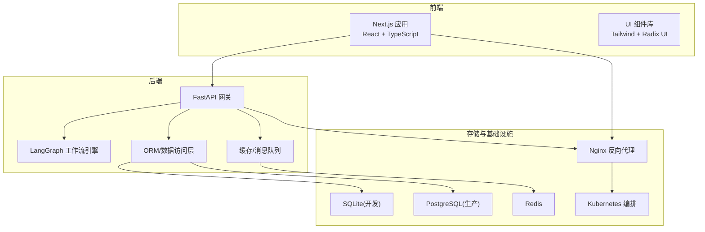
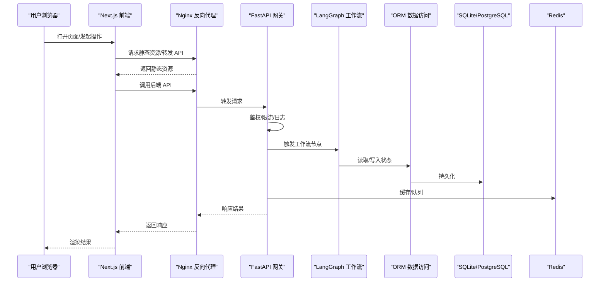
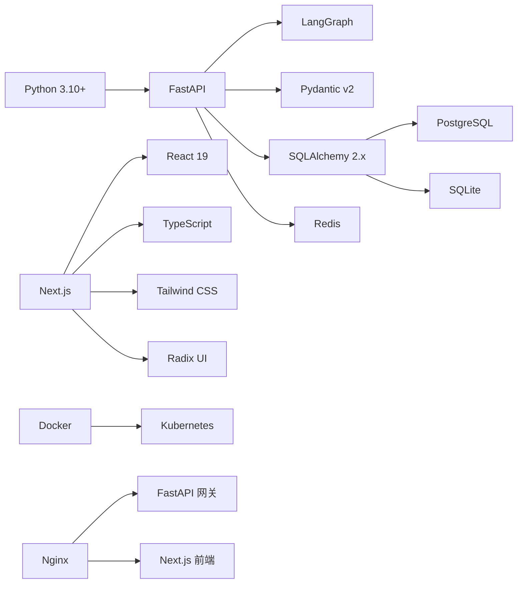

# 技术栈选型

<cite>
**本文引用的文件**   
- [backend/pyproject.toml](file://backend/pyproject.toml)
- [backend/app/gateway/app.py](file://backend/app/gateway/app.py)
- [backend/langgraph.json](file://backend/langgraph.json)
- [backend/app/gateway/config.py](file://backend/app/gateway/config.py)
- [docker/docker-compose.yaml](file://docker/docker-compose.yaml)
- [docker/nginx/nginx.conf](file://docker/nginx/nginx.conf)
- [frontend/package.json](file://frontend/package.json)
- [frontend/next.config.js](file://frontend/next.config.js)
- [frontend/components.json](file://frontend/components.json)
- [backend/Dockerfile](file://backend/Dockerfile)
- [frontend/Dockerfile](file://frontend/Dockerfile)
</cite>

## 目录
1. [简介](#简介)
2. [项目结构](#项目结构)
3. [核心组件](#核心组件)
4. [架构总览](#架构总览)
5. [详细组件分析](#详细组件分析)
6. [依赖分析](#依赖分析)
7. [性能考量](#性能考量)
8. [故障排查指南](#故障排查指南)
9. [结论](#结论)
10. [附录](#附录)

## 简介
本文件聚焦 DeerFlow 项目的技术栈选型与版本约束，覆盖后端（Python、FastAPI、LangGraph、Pydantic、SQLAlchemy）、前端（Next.js、React、TypeScript、Tailwind CSS、Radix UI）、数据库（SQLite/PostgreSQL、Redis）、容器化与编排（Docker、Kubernetes）等。文档同时给出各选型的优势、适用场景、兼容性要求，以及升级策略与迁移指南，帮助团队在演进过程中保持稳定性与可维护性。

## 项目结构
DeerFlow 采用前后端分离与多语言工程组织：
- 后端位于 backend/，基于 Python 生态，提供 FastAPI 网关、LangGraph 工作流、工具与技能管理、沙箱执行、MCP 集成等能力。
- 前端位于 frontend/，基于 Next.js 应用路由与 React 组件体系，使用 TypeScript 与 Tailwind/Radix UI 构建交互界面。
- docker/ 提供开发/生产编排与 Nginx 反向代理配置；根级 Dockerfile 用于镜像构建。

图表来源
- [backend/app/gateway/app.py](file://backend/app/gateway/app.py)
- [backend/langgraph.json](file://backend/langgraph.json)
- [docker/docker-compose.yaml](file://docker/docker-compose.yaml)
- [docker/nginx/nginx.conf](file://docker/nginx/nginx.conf)
- [frontend/next.config.js](file://frontend/next.config.js)

章节来源
- [backend/pyproject.toml](file://backend/pyproject.toml)
- [frontend/package.json](file://frontend/package.json)
- [docker/docker-compose.yaml](file://docker/docker-compose.yaml)

## 核心组件
本节从“技术栈维度”梳理关键组件及其职责与关系。

- 后端运行时与框架
  - Python 3.10+：作为统一运行时，确保类型系统与异步生态稳定。
  - FastAPI：高性能异步 Web 框架，提供自动文档、依赖注入与中间件扩展点。
  - LangGraph：以图形式编排 Agent 工作流，支持状态持久化、检查点与可视化调试。
  - Pydantic：强类型数据校验与序列化，贯穿请求/响应与配置模型。
  - SQLAlchemy：对象关系映射，抽象数据库访问，便于切换 SQLite/PostgreSQL。

- 前端运行时与生态
  - Next.js：服务端渲染/静态生成与应用路由，提升首屏性能与 SEO。
  - React 19：最新组件模型与并发特性，配合 Hooks 与 Server Components。
  - TypeScript：全链路类型安全，降低前后端契约漂移风险。
  - Tailwind CSS：原子化样式方案，提高样式一致性与可维护性。
  - Radix UI：无样式可组合基础组件，保障可访问性与主题定制。

- 数据存储与缓存
  - SQLite：零配置、单文件，适合开发与演示环境。
  - PostgreSQL：生产级关系型数据库，支持高可用与复杂查询。
  - Redis：内存键值存储，用作缓存与轻量消息通道。

- 容器化与编排
  - Docker：标准化镜像构建与运行环境隔离。
  - Kubernetes：弹性扩缩容、滚动更新与服务治理。
  - Nginx：反向代理、静态资源服务与负载均衡。

章节来源
- [backend/pyproject.toml](file://backend/pyproject.toml)
- [backend/app/gateway/app.py](file://backend/app/gateway/app.py)
- [backend/langgraph.json](file://backend/langgraph.json)
- [backend/app/gateway/config.py](file://backend/app/gateway/config.py)
- [frontend/package.json](file://frontend/package.json)
- [frontend/next.config.js](file://frontend/next.config.js)
- [frontend/components.json](file://frontend/components.json)
- [docker/docker-compose.yaml](file://docker/docker-compose.yaml)
- [docker/nginx/nginx.conf](file://docker/nginx/nginx.conf)

## 架构总览
下图展示从浏览器到后端工作流与数据层的端到端调用路径，并标注关键组件与协议。

图表来源
- [backend/app/gateway/app.py](file://backend/app/gateway/app.py)
- [backend/langgraph.json](file://backend/langgraph.json)
- [docker/nginx/nginx.conf](file://docker/nginx/nginx.conf)
- [docker/docker-compose.yaml](file://docker/docker-compose.yaml)

## 详细组件分析

### 后端技术栈
- Python 3.10+
  - 优势：类型提示完善、异步生态成熟、AI/ML 生态首选。
  - 适用场景：LLM 驱动的后端、Agent 工作流、数据处理管道。
  - 兼容性：需与 C 扩展和第三方包 ABI 兼容，建议锁定小版本。
- FastAPI
  - 优势：异步高性能、自动生成 OpenAPI/Swagger、依赖注入与中间件。
  - 适用场景：REST/WS/SSE 接口、微服务网关。
  - 兼容性：与 ASGI 服务器（如 uvicorn）协同，注意事件循环与超时配置。
- LangGraph
  - 优势：图式编排、状态机语义、检查点与回放、可视化调试。
  - 适用场景：多步推理、条件分支、子任务并行与重试。
  - 兼容性：与 Pydantic v2 深度集成，注意状态序列化策略。
- Pydantic
  - 优势：强类型校验、默认值与嵌套模型、OpenAPI 集成。
  - 适用场景：请求/响应模型、配置加载、跨进程传输。
  - 兼容性：v2 为当前主流，迁移需注意字段行为变更。
- SQLAlchemy
  - 优势：声明式模型、连接池、迁移工具链。
  - 适用场景：结构化数据持久化、复杂查询与事务。
  - 兼容性：2.x 风格推荐，注意方言与驱动选择。

章节来源
- [backend/pyproject.toml](file://backend/pyproject.toml)
- [backend/app/gateway/app.py](file://backend/app/gateway/app.py)
- [backend/langgraph.json](file://backend/langgraph.json)
- [backend/app/gateway/config.py](file://backend/app/gateway/config.py)

### 前端技术栈
- Next.js
  - 优势：应用路由、SSR/ISR、API Routes、构建优化。
  - 适用场景：内容型站点、控制台、文档站与 SPA 混合。
  - 兼容性：关注 Node 版本与插件生态。
- React 19
  - 优势：并发特性、Server Components、更优的调度。
  - 适用场景：大型交互式应用、复杂状态与副作用管理。
  - 兼容性：注意第三方库对新版 API 的支持。
- TypeScript
  - 优势：编译期类型检查、重构友好、IDE 体验佳。
  - 适用场景：中大型前端工程、前后端契约共享。
  - 兼容性：严格模式与模块解析策略需统一。
- Tailwind CSS
  - 优势：原子类、设计系统落地、构建时裁剪。
  - 适用场景：快速迭代、一致性 UI。
  - 兼容性：与 PostCSS 插件链协作。
- Radix UI
  - 优势：无样式、可组合、可访问性优先。
  - 适用场景：高质量基础控件、主题定制。
  - 兼容性：与 React 版本绑定，关注发布节奏。

章节来源
- [frontend/package.json](file://frontend/package.json)
- [frontend/next.config.js](file://frontend/next.config.js)
- [frontend/components.json](file://frontend/components.json)

### 数据库与缓存
- SQLite（开发）
  - 优势：零配置、便携、适合本地调试。
  - 限制：并发写入弱、不适合高负载生产。
- PostgreSQL（生产）
  - 优势：ACID、JSONB、索引与分区、高可用生态。
  - 注意：连接池、慢查询与备份策略。
- Redis
  - 优势：低延迟、数据结构丰富、发布订阅。
  - 用途：缓存、会话、轻量消息队列。

章节来源
- [backend/app/gateway/config.py](file://backend/app/gateway/config.py)
- [docker/docker-compose.yaml](file://docker/docker-compose.yaml)

### 容器化与编排
- Docker
  - 优势：环境一致性、可移植、CI/CD 友好。
  - 实践：多阶段构建、非 root 用户、最小镜像。
- Kubernetes
  - 优势：弹性伸缩、滚动更新、服务发现与配置中心。
  - 注意：资源配额、探针、存储卷与网络策略。
- Nginx
  - 作用：反向代理、静态资源、Gzip/Brotli、HTTPS 终止。

章节来源
- [backend/Dockerfile](file://backend/Dockerfile)
- [frontend/Dockerfile](file://frontend/Dockerfile)
- [docker/docker-compose.yaml](file://docker/docker-compose.yaml)
- [docker/nginx/nginx.conf](file://docker/nginx/nginx.conf)

## 依赖分析
下图展示关键依赖关系与边界：

图表来源
- [backend/pyproject.toml](file://backend/pyproject.toml)
- [frontend/package.json](file://frontend/package.json)
- [docker/docker-compose.yaml](file://docker/docker-compose.yaml)
- [docker/nginx/nginx.conf](file://docker/nginx/nginx.conf)

章节来源
- [backend/pyproject.toml](file://backend/pyproject.toml)
- [frontend/package.json](file://frontend/package.json)

## 性能考量
- 后端
  - 使用异步 I/O 与连接池，避免阻塞调用。
  - 合理设置 LangGraph 检查点粒度，减少不必要的持久化。
  - 利用 Redis 缓存热点数据与幂等键，降低数据库压力。
- 前端
  - 启用 SSR/ISR 与代码分割，按需加载大组件。
  - 使用 Tailwind 构建裁剪与图片优化，减小包体。
- 部署
  - 通过 HPA 实现水平扩容，结合 Readiness/Liveness 探针。
  - 使用 Nginx 开启 gzip/brotli 与 HTTP/2。

[本节为通用指导，不直接分析具体文件]

## 故障排查指南
- 启动与端口
  - 确认 Nginx 与后端端口未冲突，环境变量正确挂载。
- 数据库连接
  - 检查 DSN、用户名/密码、SSL 与连接池参数。
- 缓存与队列
  - 验证 Redis 可达性与 key 命名空间，避免脏读。
- 工作流与状态
  - 查看 LangGraph 检查点与日志，定位卡点与异常分支。
- 前端构建
  - 清理 .next 与 node_modules，核对 Node 版本与 pnpm 锁文件。

章节来源
- [docker/docker-compose.yaml](file://docker/docker-compose.yaml)
- [docker/nginx/nginx.conf](file://docker/nginx/nginx.conf)
- [backend/app/gateway/config.py](file://backend/app/gateway/config.py)

## 结论
DeerFlow 的技术栈围绕“高性能异步后端 + 图式工作流 + 现代前端 + 云原生部署”展开。通过 FastAPI 与 LangGraph 的组合，既能满足复杂业务编排，又能保持接口的高吞吐与低延迟；前端以 Next.js 为核心，结合 React 19 与 TypeScript，兼顾体验与可维护性；数据库与缓存分层清晰，容器化与编排方案完备。建议在演进中遵循“渐进升级、灰度发布、回归测试”的策略，确保系统稳定。

[本节为总结性内容，不直接分析具体文件]

## 附录

### 版本与兼容性要点
- Python 3.10+：与 C 扩展及 AI 生态对齐，建议固定至次版本。
- FastAPI：与 ASGI 服务器与 Pydantic v2 协同，关注中间件兼容性。
- LangGraph：与 Pydantic v2 深度集成，注意状态序列化与迁移。
- SQLAlchemy 2.x：推荐使用新式 API，关注方言与驱动版本。
- Next.js：关注 Node LTS 与插件生态，谨慎升级主版本。
- React 19：评估第三方库适配情况，逐步引入新特性。
- TypeScript：统一严格模式与模块解析策略。
- Tailwind/Radix：跟随官方发布节奏，关注破坏性变更。

章节来源
- [backend/pyproject.toml](file://backend/pyproject.toml)
- [frontend/package.json](file://frontend/package.json)

### 升级策略与迁移指南
- 后端
  - 先升级 Pydantic 至 v2，再升级 FastAPI 与 LangGraph，最后考虑 Python 小版本升级。
  - 使用自动化脚本与单元测试覆盖，逐步替换旧式 API。
  - 数据库方言与驱动升级前进行压测与回滚演练。
- 前端
  - 按 Next.js -> React -> TypeScript -> UI 库顺序升级，每步保留独立提交。
  - 使用依赖扫描与类型检查工具，修复潜在不兼容。
- 容器与编排
  - 镜像多阶段构建优化，定期更新基础镜像与安全补丁。
  - 在预发环境先行验证，再进行生产滚动更新。

章节来源
- [backend/Dockerfile](file://backend/Dockerfile)
- [frontend/Dockerfile](file://frontend/Dockerfile)
- [docker/docker-compose.yaml](file://docker/docker-compose.yaml)