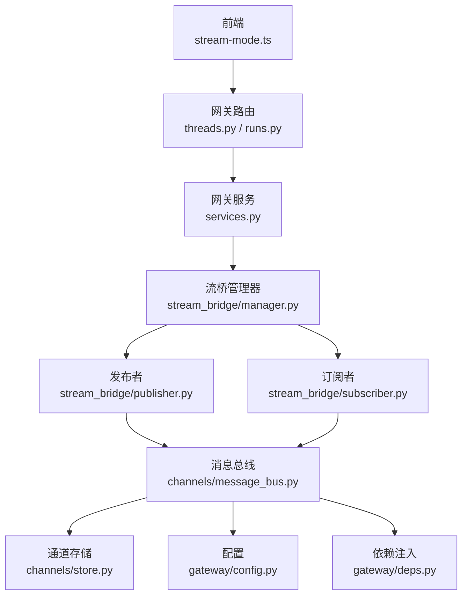
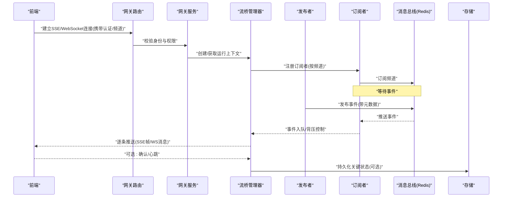
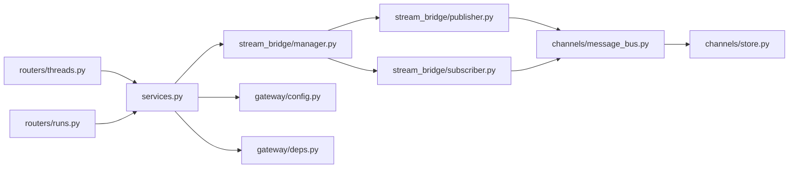

# 实时通信机制

<cite>
**本文引用的文件**   
- [backend/app/gateway/routers/threads.py](file://backend/app/gateway/routers/threads.py)
- [backend/app/gateway/routers/runs.py](file://backend/app/gateway/routers/runs.py)
- [backend/app/gateway/services.py](file://backend/app/gateway/services.py)
- [backend/app/gateway/deps.py](file://backend/app/gateway/deps.py)
- [backend/app/gateway/config.py](file://backend/app/gateway/config.py)
- [backend/app/runtime/stream_bridge/__init__.py](file://backend/app/runtime/stream_bridge/__init__.py)
- [backend/app/runtime/stream_bridge/manager.py](file://backend/app/runtime/stream_bridge/manager.py)
- [backend/app/runtime/stream_bridge/publisher.py](file://backend/app/runtime/stream_bridge/publisher.py)
- [backend/app/runtime/stream_bridge/subscriber.py](file://backend/app/runtime/stream_bridge/subscriber.py)
- [backend/app/channels/message_bus.py](file://backend/app/channels/message_bus.py)
- [backend/app/channels/store.py](file://backend/app/channels/store.py)
- [backend/app/channels/service.py](file://backend/app/channels/service.py)
- [backend/docs/STREAMING.md](file://backend/docs/STREAMING.md)
- [frontend/src/core/api/stream-mode.ts](file://frontend/src/core/api/stream-mode.ts)
- [frontend/src/components/workspace/messages/streaming-indicator.tsx](file://frontend/src/components/workspace/messages/streaming-indicator.tsx)
</cite>

## 目录
1. [简介](#简介)
2. [项目结构](#项目结构)
3. [核心组件](#核心组件)
4. [架构总览](#架构总览)
5. [详细组件分析](#详细组件分析)
6. [依赖关系分析](#依赖关系分析)
7. [性能考虑](#性能考虑)
8. [故障排查指南](#故障排查指南)
9. [结论](#结论)
10. [附录：协议规范与集成示例](#附录协议规范与集成示例)

## 简介
本文件面向 DeerFlow 的实时通信机制，聚焦于服务端与前端之间的流式事件推送。内容覆盖连接建立（握手、鉴权、频道订阅）、事件数据结构、客户端状态同步（断线重连、消息确认、一致性保证）、Redis 作为消息中间件的发布订阅模式与扩展性、以及批量推送、压缩传输、连接池管理等优化策略。同时提供协议规范与前后端集成要点，帮助读者快速理解并正确接入。

## 项目结构
DeerFlow 的实时通信由网关路由层、运行时流桥接层、通道消息总线与存储层共同组成；前端通过统一的流式 API 客户端进行连接与消费。

图表来源
- [backend/app/gateway/routers/threads.py](file://backend/app/gateway/routers/threads.py)
- [backend/app/gateway/routers/runs.py](file://backend/app/gateway/routers/runs.py)
- [backend/app/gateway/services.py](file://backend/app/gateway/services.py)
- [backend/app/runtime/stream_bridge/manager.py](file://backend/app/runtime/stream_bridge/manager.py)
- [backend/app/runtime/stream_bridge/publisher.py](file://backend/app/runtime/stream_bridge/publisher.py)
- [backend/app/runtime/stream_bridge/subscriber.py](file://backend/app/runtime/stream_bridge/subscriber.py)
- [backend/app/channels/message_bus.py](file://backend/app/channels/message_bus.py)
- [backend/app/channels/store.py](file://backend/app/channels/store.py)
- [backend/app/gateway/config.py](file://backend/app/gateway/config.py)
- [backend/app/gateway/deps.py](file://backend/app/gateway/deps.py)

章节来源
- [backend/app/gateway/routers/threads.py](file://backend/app/gateway/routers/threads.py)
- [backend/app/gateway/routers/runs.py](file://backend/app/gateway/routers/runs.py)
- [backend/app/gateway/services.py](file://backend/app/gateway/services.py)
- [backend/app/runtime/stream_bridge/manager.py](file://backend/app/runtime/stream_bridge/manager.py)
- [backend/app/channels/message_bus.py](file://backend/app/channels/message_bus.py)
- [backend/app/channels/store.py](file://backend/app/channels/store.py)
- [backend/app/gateway/config.py](file://backend/app/gateway/config.py)
- [backend/app/gateway/deps.py](file://backend/app/gateway/deps.py)
- [frontend/src/core/api/stream-mode.ts](file://frontend/src/core/api/stream-mode.ts)

## 核心组件
- 网关路由层
  - 负责暴露 SSE/WebSocket 端点，解析请求参数，校验身份，创建或复用运行上下文，并将连接注册到流桥管理器。
  - 关键入口：线程与运行相关的流式路由。
- 网关服务层
  - 编排运行生命周期、权限校验、资源准备，协调流桥管理器完成订阅与事件转发。
- 流桥管理器
  - 维护运行实例与订阅者的映射，统一调度发布与订阅，处理背压与错误传播。
- 发布者/订阅者
  - 发布者将内部事件写入消息总线；订阅者从消息总线拉取并按需投递给具体连接。
- 消息总线与存储
  - 基于 Redis 的发布订阅实现，提供跨进程/跨节点的事件分发；存储层用于持久化关键状态以便恢复。
- 前端流式客户端
  - 封装连接建立、心跳、断线重连、事件解析与状态同步。

章节来源
- [backend/app/gateway/routers/threads.py](file://backend/app/gateway/routers/threads.py)
- [backend/app/gateway/routers/runs.py](file://backend/app/gateway/routers/runs.py)
- [backend/app/gateway/services.py](file://backend/app/gateway/services.py)
- [backend/app/runtime/stream_bridge/manager.py](file://backend/app/runtime/stream_bridge/manager.py)
- [backend/app/runtime/stream_bridge/publisher.py](file://backend/app/runtime/stream_bridge/publisher.py)
- [backend/app/runtime/stream_bridge/subscriber.py](file://backend/app/runtime/stream_bridge/subscriber.py)
- [backend/app/channels/message_bus.py](file://backend/app/channels/message_bus.py)
- [backend/app/channels/store.py](file://backend/app/channels/store.py)
- [frontend/src/core/api/stream-mode.ts](file://frontend/src/core/api/stream-mode.ts)

## 架构总览
下图展示了从前端发起流式连接到后端事件分发的端到端流程，涵盖握手、鉴权、订阅、事件推送与状态同步的关键路径。

图表来源
- [backend/app/gateway/routers/threads.py](file://backend/app/gateway/routers/threads.py)
- [backend/app/gateway/routers/runs.py](file://backend/app/gateway/routers/runs.py)
- [backend/app/gateway/services.py](file://backend/app/gateway/services.py)
- [backend/app/runtime/stream_bridge/manager.py](file://backend/app/runtime/stream_bridge/manager.py)
- [backend/app/runtime/stream_bridge/publisher.py](file://backend/app/runtime/stream_bridge/publisher.py)
- [backend/app/runtime/stream_bridge/subscriber.py](file://backend/app/runtime/stream_bridge/subscriber.py)
- [backend/app/channels/message_bus.py](file://backend/app/channels/message_bus.py)
- [backend/app/channels/store.py](file://backend/app/channels/store.py)

## 详细组件分析

### 连接建立与鉴权（握手、鉴权、频道订阅）
- 握手阶段
  - 前端发起长连接（SSE 或 WebSocket），在 URL 查询参数或首条消息中携带会话令牌、线程/运行标识、频道列表等。
  - 网关路由解析参数，调用鉴权中间件或服务层校验令牌有效性及访问权限。
- 鉴权与授权
  - 校验用户身份、租户隔离、资源可见性（如线程/运行 ID 归属）。
  - 失败则立即关闭连接并返回明确错误码。
- 频道订阅
  - 鉴权通过后，网关服务向流桥管理器注册订阅者，指定目标频道（如线程事件、运行事件、系统通知等）。
  - 订阅者向消息总线订阅对应频道，等待发布者推送事件。

章节来源
- [backend/app/gateway/routers/threads.py](file://backend/app/gateway/routers/threads.py)
- [backend/app/gateway/routers/runs.py](file://backend/app/gateway/routers/runs.py)
- [backend/app/gateway/services.py](file://backend/app/gateway/services.py)
- [backend/app/runtime/stream_bridge/manager.py](file://backend/app/runtime/stream_bridge/manager.py)
- [backend/app/channels/message_bus.py](file://backend/app/channels/message_bus.py)

### 事件推送的数据结构（类型、格式、元数据）
- 事件类型定义
  - 业务事件：如“任务开始/结束”、“工具调用”、“模型输出片段”、“结果汇总”。
  - 系统事件：如“连接建立/断开”、“心跳”、“错误告警”。
- 消息格式规范
  - 每条事件包含：事件类型、时间戳、关联ID（线程/运行/子任务）、负载体、版本字段。
  - 支持增量更新（diff）与完整快照两种模式，便于前端高效渲染。
- 元数据传递
  - 包含来源组件、优先级、是否可重试、压缩标记、批次号等，辅助前端排序、去重与展示。

章节来源
- [backend/docs/STREAMING.md](file://backend/docs/STREAMING.md)
- [backend/app/runtime/stream_bridge/publisher.py](file://backend/app/runtime/stream_bridge/publisher.py)
- [backend/app/runtime/stream_bridge/subscriber.py](file://backend/app/runtime/stream_bridge/subscriber.py)

### 客户端状态同步（断线重连、消息确认、一致性保证）
- 断线重连
  - 前端检测连接异常后，采用指数退避策略重连，携带上次成功消费的游标或最后事件ID，以恢复增量状态。
- 消息确认
  - 对关键事件（如状态变更）支持客户端确认；服务端记录已确认位置，避免重复推送。
- 一致性保证
  - 使用有序事件序列与幂等键，确保乱序到达时仍可重建一致视图；必要时提供快照拉取接口。

章节来源
- [frontend/src/core/api/stream-mode.ts](file://frontend/src/core/api/stream-mode.ts)
- [backend/app/runtime/stream_bridge/manager.py](file://backend/app/runtime/stream_bridge/manager.py)
- [backend/app/channels/store.py](file://backend/app/channels/store.py)

### Redis 作为消息中间件的架构（发布订阅、持久化、集群扩展）
- 发布订阅模式
  - 发布者将事件写入 Redis 频道；订阅者监听频道并转发至各连接。
- 消息持久化
  - 结合存储层对关键事件落盘，支持断线后的回溯与回放。
- 集群扩展
  - 多实例部署共享同一 Redis 集群，天然实现水平扩展；注意分区键设计以保证同频事件顺序性。

章节来源
- [backend/app/channels/message_bus.py](file://backend/app/channels/message_bus.py)
- [backend/app/channels/store.py](file://backend/app/channels/store.py)
- [backend/app/gateway/config.py](file://backend/app/gateway/config.py)

### 性能优化策略（批量推送、压缩传输、连接池管理）
- 批量推送
  - 将短时间窗口内的小事件合并为批，减少网络往返与序列化开销。
- 压缩传输
  - 对大负载启用 gzip/deflate 或二进制编码，降低带宽占用。
- 连接池管理
  - 限制单进程最大连接数，按频道维度分配队列容量，防止热点频道拥塞。
- 背压与限流
  - 当消费者慢时，触发背压（丢弃低优先级事件或延迟发送），保障整体稳定性。

章节来源
- [backend/app/runtime/stream_bridge/manager.py](file://backend/app/runtime/stream_bridge/manager.py)
- [backend/app/gateway/config.py](file://backend/app/gateway/config.py)
- [backend/app/gateway/deps.py](file://backend/app/gateway/deps.py)

## 依赖关系分析
- 耦合与内聚
  - 网关路由与服务层解耦，通过依赖注入获取配置与组件实例；流桥管理器集中管理订阅/发布逻辑，提升内聚性。
- 外部依赖
  - Redis 作为唯一外部消息通道；存储层可能对接对象存储或数据库以持久化状态。
- 潜在循环依赖
  - 通过接口抽象与依赖注入避免循环引用；发布者与订阅者仅依赖消息总线接口。

图表来源
- [backend/app/gateway/routers/threads.py](file://backend/app/gateway/routers/threads.py)
- [backend/app/gateway/routers/runs.py](file://backend/app/gateway/routers/runs.py)
- [backend/app/gateway/services.py](file://backend/app/gateway/services.py)
- [backend/app/runtime/stream_bridge/manager.py](file://backend/app/runtime/stream_bridge/manager.py)
- [backend/app/runtime/stream_bridge/publisher.py](file://backend/app/runtime/stream_bridge/publisher.py)
- [backend/app/runtime/stream_bridge/subscriber.py](file://backend/app/runtime/stream_bridge/subscriber.py)
- [backend/app/channels/message_bus.py](file://backend/app/channels/message_bus.py)
- [backend/app/channels/store.py](file://backend/app/channels/store.py)
- [backend/app/gateway/config.py](file://backend/app/gateway/config.py)
- [backend/app/gateway/deps.py](file://backend/app/gateway/deps.py)

章节来源
- [backend/app/gateway/routers/threads.py](file://backend/app/gateway/routers/threads.py)
- [backend/app/gateway/routers/runs.py](file://backend/app/gateway/routers/runs.py)
- [backend/app/gateway/services.py](file://backend/app/gateway/services.py)
- [backend/app/runtime/stream_bridge/manager.py](file://backend/app/runtime/stream_bridge/manager.py)
- [backend/app/channels/message_bus.py](file://backend/app/channels/message_bus.py)
- [backend/app/channels/store.py](file://backend/app/channels/store.py)
- [backend/app/gateway/config.py](file://backend/app/gateway/config.py)
- [backend/app/gateway/deps.py](file://backend/app/gateway/deps.py)

## 性能考虑
- 事件批量化与节流
  - 在高吞吐场景下，将多个小事件合并为批次，配合前端增量渲染，显著降低 CPU 与网络压力。
- 压缩与编码
  - 对文本型事件启用压缩；对结构化数据可采用更紧凑的编码格式。
- 连接与队列容量
  - 根据机器资源设置最大并发连接与每频道队列长度，避免内存膨胀。
- 背压与降级
  - 当消费者慢或下游不可用时，主动丢弃非关键事件或切换为轮询模式，保障核心链路可用。
- 缓存与快照
  - 对热点频道提供最近快照，缩短重连恢复时间。

[本节为通用指导，不直接分析具体文件]

## 故障排查指南
- 连接问题
  - 检查鉴权令牌是否过期、URL 参数是否正确、防火墙是否放行长连接端口。
- 事件丢失或重复
  - 核对事件序列号与幂等键；确认客户端确认机制是否生效；检查 Redis 订阅是否稳定。
- 性能抖动
  - 观察队列深度与背压指标；评估批量大小与压缩开关；检查热点频道是否过载。
- 日志与追踪
  - 开启网关与流桥层的调试日志，定位握手失败、订阅异常与推送阻塞点。

章节来源
- [backend/app/gateway/routers/threads.py](file://backend/app/gateway/routers/threads.py)
- [backend/app/gateway/routers/runs.py](file://backend/app/gateway/routers/runs.py)
- [backend/app/runtime/stream_bridge/manager.py](file://backend/app/runtime/stream_bridge/manager.py)
- [backend/app/channels/message_bus.py](file://backend/app/channels/message_bus.py)

## 结论
DeerFlow 的实时通信以网关路由为入口，通过流桥管理器统一调度发布与订阅，借助 Redis 实现跨进程/跨节点的事件分发，并结合存储层保障状态一致性。前端通过统一的流式客户端实现断线重连与状态同步。通过批量推送、压缩传输与连接池管理等优化策略，可在高并发场景下保持低延迟与高吞吐。

[本节为总结性内容，不直接分析具体文件]

## 附录：协议规范与集成示例

### 协议规范
- 传输协议
  - 优先使用 SSE 用于单向推送；需要双向交互时使用 WebSocket。
- 连接参数
  - 必需：认证令牌、线程/运行标识、频道列表。
  - 可选：心跳间隔、最大重连次数、压缩开关。
- 事件载荷
  - 字段：类型、时间戳、关联ID、负载体、版本、元数据。
  - 语义：增量更新优先，必要时提供完整快照。
- 确认与心跳
  - 客户端对关键事件发送确认；服务端周期性下发心跳，客户端超时自动重连。

章节来源
- [backend/docs/STREAMING.md](file://backend/docs/STREAMING.md)
- [frontend/src/core/api/stream-mode.ts](file://frontend/src/core/api/stream-mode.ts)

### 集成示例（前端）
- 初始化连接
  - 构造 URL 并附加认证与频道参数，建立 SSE/WebSocket 连接。
- 事件处理
  - 解析事件类型与负载，应用增量更新逻辑，维护本地状态。
- 断线重连
  - 捕获连接错误，指数退避重连，携带最后事件ID恢复增量。
- 状态同步
  - 对关键事件发送确认；收到心跳维持连接活跃。

章节来源
- [frontend/src/core/api/stream-mode.ts](file://frontend/src/core/api/stream-mode.ts)
- [frontend/src/components/workspace/messages/streaming-indicator.tsx](file://frontend/src/components/workspace/messages/streaming-indicator.tsx)

### 集成示例（后端）
- 路由注册
  - 在网关路由中暴露流式端点，解析参数并委派服务层处理。
- 服务编排
  - 校验权限、创建运行上下文、注册订阅者、启动事件转发。
- 发布事件
  - 业务模块通过发布者接口将事件写入消息总线，附带元数据与幂等键。
- 存储与恢复
  - 关键状态落盘，支持断线后回放与一致性恢复。

章节来源
- [backend/app/gateway/routers/threads.py](file://backend/app/gateway/routers/threads.py)
- [backend/app/gateway/routers/runs.py](file://backend/app/gateway/routers/runs.py)
- [backend/app/gateway/services.py](file://backend/app/gateway/services.py)
- [backend/app/runtime/stream_bridge/publisher.py](file://backend/app/runtime/stream_bridge/publisher.py)
- [backend/app/channels/store.py](file://backend/app/channels/store.py)