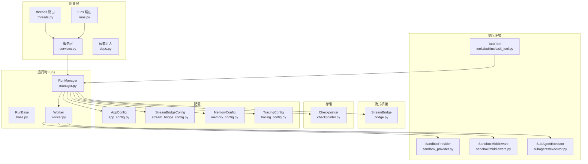
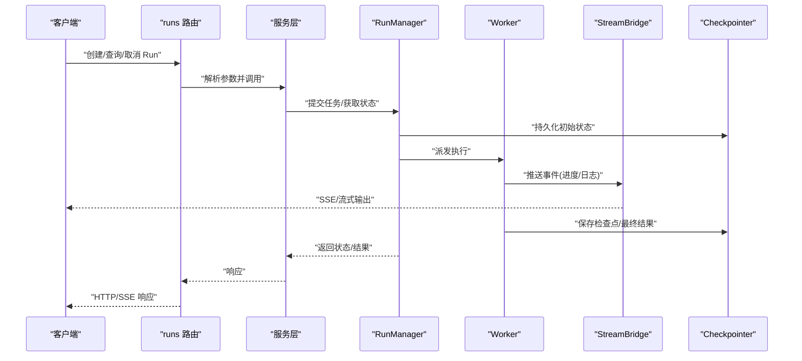
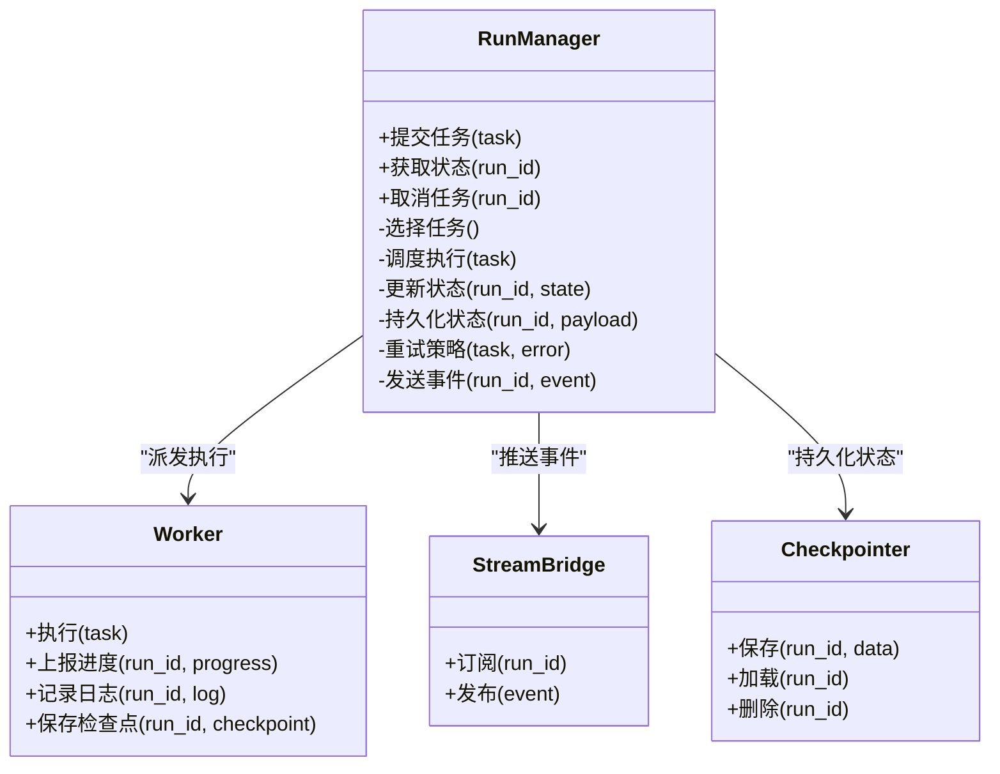
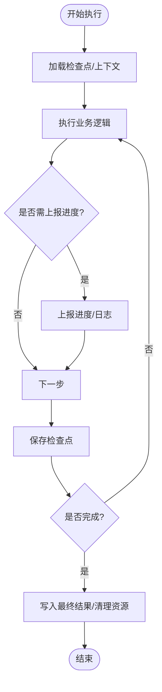
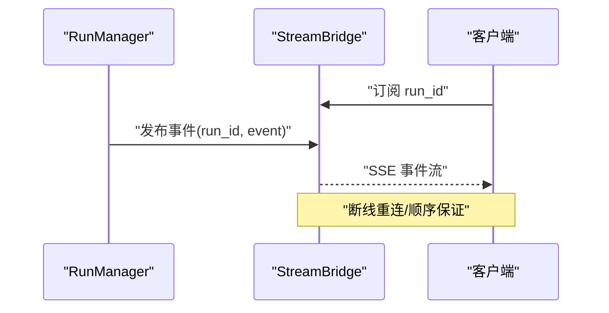
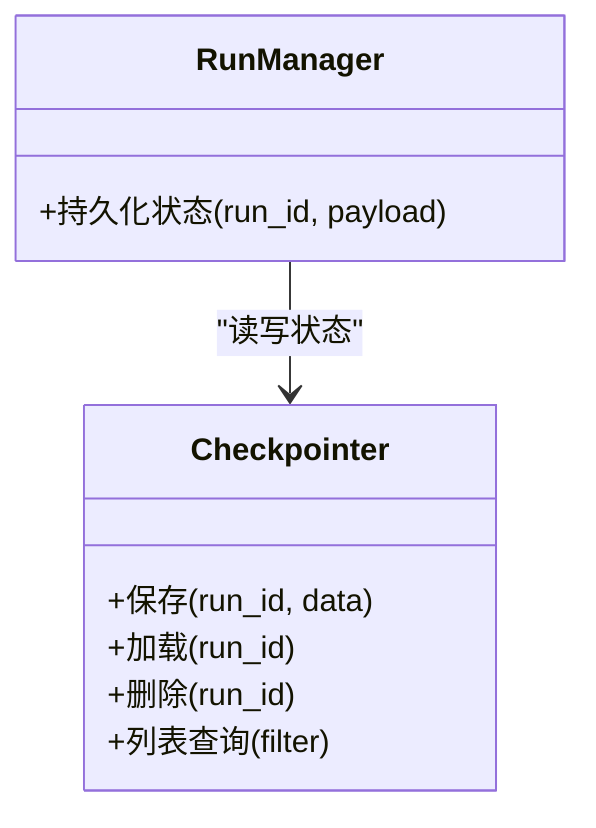
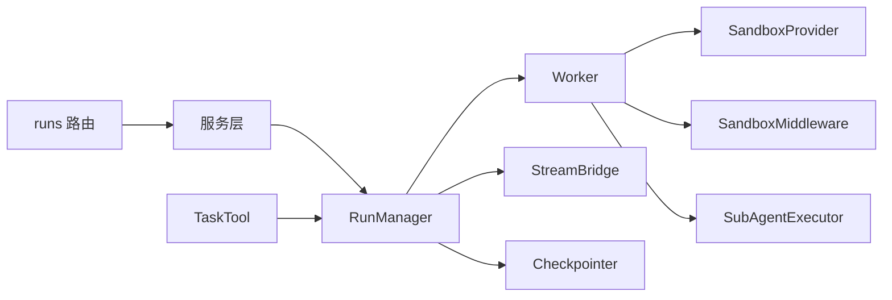
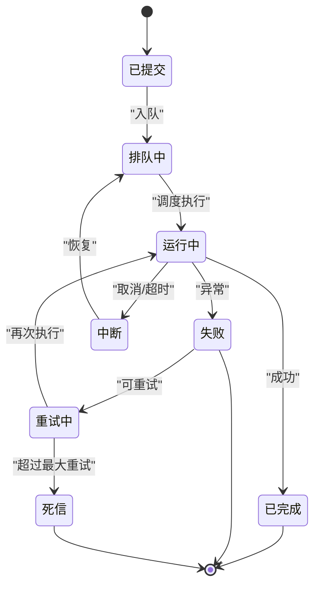

# 异步任务流水线

<cite>
**本文引用的文件**   
- [backend/app/gateway/routers/runs.py](file://backend/app/gateway/routers/runs.py)
- [backend/app/gateway/routers/threads.py](file://backend/app/gateway/routers/threads.py)
- [backend/app/gateway/services.py](file://backend/app/gateway/services.py)
- [backend/app/gateway/deps.py](file://backend/app/gateway/deps.py)
- [backend/packages/harness/deerflow/runtime/runs/__init__.py](file://backend/packages/harness/deerflow/runtime/runs/__init__.py)
- [backend/packages/harness/deerflow/runtime/runs/base.py](file://backend/packages/harness/deerflow/runtime/runs/base.py)
- [backend/packages/harness/deerflow/runtime/runs/manager.py](file://backend/packages/harness/deerflow/runtime/runs/manager.py)
- [backend/packages/harness/deerflow/runtime/runs/worker.py](file://backend/packages/harness/deerflow/runtime/runs/worker.py)
- [backend/packages/harness/deerflow/runtime/stream_bridge/__init__.py](file://backend/packages/harness/deerflow/runtime/stream_bridge/__init__.py)
- [backend/packages/harness/deerflow/runtime/stream_bridge/bridge.py](file://backend/packages/harness/deerflow/runtime/stream_bridge/bridge.py)
- [backend/packages/harness/deerflow/runtime/store/__init__.py](file://backend/packages/harness/deerflow/runtime/store/__init__.py)
- [backend/packages/harness/deerflow/runtime/store/checkpointer.py](file://backend/packages/harness/deerflow/runtime/store/checkpointer.py)
- [backend/packages/harness/deerflow/config/app_config.py](file://backend/packages/harness/deerflow/config/app_config.py)
- [backend/packages/harness/deerflow/config/stream_bridge_config.py](file://backend/packages/harness/deerflow/config/stream_bridge_config.py)
- [backend/packages/harness/deerflow/config/memory_config.py](file://backend/packages/harness/deerflow/config/memory_config.py)
- [backend/packages/harness/deerflow/config/tracing_config.py](file://backend/packages/harness/deerflow/config/tracing_config.py)
- [backend/packages/harness/deerflow/sandbox/middleware.py](file://backend/packages/harness/deerflow/sandbox/middleware.py)
- [backend/packages/harness/deerflow/sandbox/sandbox_provider.py](file://backend/packages/harness/deerflow/sandbox/sandbox_provider.py)
- [backend/packages/harness/deerflow/subagents/executor.py](file://backend/packages/harness/deerflow/subagents/executor.py)
- [backend/packages/harness/deerflow/tools/builtins/task_tool.py](file://backend/packages/harness/deerflow/tools/builtins/task_tool.py)
- [backend/tests/test_run_manager.py](file://backend/tests/test_run_manager.py)
- [backend/tests/test_run_worker_rollback.py](file://backend/tests/test_run_worker_rollback.py)
- [backend/tests/test_subagent_executor.py](file://backend/tests/test_subagent_executor.py)
</cite>

## 目录
1. [简介](#简介)
2. [项目结构](#项目结构)
3. [核心组件](#核心组件)
4. [架构总览](#架构总览)
5. [详细组件分析](#详细组件分析)
6. [依赖关系分析](#依赖关系分析)
7. [性能考量](#性能考量)
8. [故障排查指南](#故障排查指南)
9. [结论](#结论)
10. [附录](#附录)

## 简介
本文件聚焦 DeerFlow 的“异步任务流水线”，围绕以下目标展开：
- 任务调度机制：队列管理、优先级排序、资源分配
- 任务执行流程：工作进程管理、任务分发、执行监控、异常处理
- 任务状态跟踪：状态机设计、进度上报、持久化存储
- 长时任务特殊处理：心跳机制、中断恢复、资源清理
- 重试策略：失败重试、死信队列、告警通知
- 监控接口与调试工具使用指南

说明：DeerFlow 在网关层暴露运行（Run）相关 API，并在 harness 运行时中实现 Run 生命周期管理、工作进程、流式桥接、检查点存储等。本文基于后端源码进行系统化梳理，并以图示呈现关键调用链与数据流。

## 项目结构
与异步任务流水线相关的代码主要分布在：
- 网关路由与服务：负责接收请求、编排调用、返回结果或流式事件
- 运行时（runs）：定义 Run 抽象、管理器与工作进程
- 流式桥接（stream_bridge）：将内部事件转换为前端可消费的 SSE/流式输出
- 存储（store）：检查点与状态持久化
- 配置（config）：运行参数、流式桥接、内存与追踪配置
- 沙箱与子代理：隔离执行环境与并行子任务执行器
- 内置工具：任务工具用于在 Agent 内发起异步任务
- 测试：覆盖运行管理器、工作进程回滚、子代理执行器等

图表来源
- [backend/app/gateway/routers/runs.py](file://backend/app/gateway/routers/runs.py)
- [backend/app/gateway/routers/threads.py](file://backend/app/gateway/routers/threads.py)
- [backend/app/gateway/services.py](file://backend/app/gateway/services.py)
- [backend/app/gateway/deps.py](file://backend/app/gateway/deps.py)
- [backend/packages/harness/deerflow/runtime/runs/manager.py](file://backend/packages/harness/deerflow/runtime/runs/manager.py)
- [backend/packages/harness/deerflow/runtime/runs/base.py](file://backend/packages/harness/deerflow/runtime/runs/base.py)
- [backend/packages/harness/deerflow/runtime/runs/worker.py](file://backend/packages/harness/deerflow/runtime/runs/worker.py)
- [backend/packages/harness/deerflow/runtime/stream_bridge/bridge.py](file://backend/packages/harness/deerflow/runtime/stream_bridge/bridge.py)
- [backend/packages/harness/deerflow/runtime/store/checkpointer.py](file://backend/packages/harness/deerflow/runtime/store/checkpointer.py)
- [backend/packages/harness/deerflow/config/app_config.py](file://backend/packages/harness/deerflow/config/app_config.py)
- [backend/packages/harness/deerflow/config/stream_bridge_config.py](file://backend/packages/harness/deerflow/config/stream_bridge_config.py)
- [backend/packages/harness/deerflow/config/memory_config.py](file://backend/packages/harness/deerflow/config/memory_config.py)
- [backend/packages/harness/deerflow/config/tracing_config.py](file://backend/packages/harness/deerflow/config/tracing_config.py)
- [backend/packages/harness/deerflow/sandbox/sandbox_provider.py](file://backend/packages/harness/deerflow/sandbox/sandbox_provider.py)
- [backend/packages/harness/deerflow/sandbox/middleware.py](file://backend/packages/harness/deerflow/sandbox/middleware.py)
- [backend/packages/harness/deerflow/subagents/executor.py](file://backend/packages/harness/deerflow/subagents/executor.py)
- [backend/packages/harness/deerflow/tools/builtins/task_tool.py](file://backend/packages/harness/deerflow/tools/builtins/task_tool.py)

章节来源
- [backend/app/gateway/routers/runs.py](file://backend/app/gateway/routers/runs.py)
- [backend/app/gateway/routers/threads.py](file://backend/app/gateway/routers/threads.py)
- [backend/app/gateway/services.py](file://backend/app/gateway/services.py)
- [backend/app/gateway/deps.py](file://backend/app/gateway/deps.py)
- [backend/packages/harness/deerflow/runtime/runs/manager.py](file://backend/packages/harness/deerflow/runtime/runs/manager.py)
- [backend/packages/harness/deerflow/runtime/runs/base.py](file://backend/packages/harness/deerflow/runtime/runs/base.py)
- [backend/packages/harness/deerflow/runtime/runs/worker.py](file://backend/packages/harness/deerflow/runtime/runs/worker.py)
- [backend/packages/harness/deerflow/runtime/stream_bridge/bridge.py](file://backend/packages/harness/deerflow/runtime/stream_bridge/bridge.py)
- [backend/packages/harness/deerflow/runtime/store/checkpointer.py](file://backend/packages/harness/deerflow/runtime/store/checkpointer.py)
- [backend/packages/harness/deerflow/config/app_config.py](file://backend/packages/harness/deerflow/config/app_config.py)
- [backend/packages/harness/deerflow/config/stream_bridge_config.py](file://backend/packages/harness/deerflow/config/stream_bridge_config.py)
- [backend/packages/harness/deerflow/config/memory_config.py](file://backend/packages/harness/deerflow/config/memory_config.py)
- [backend/packages/harness/deerflow/config/tracing_config.py](file://backend/packages/harness/deerflow/config/tracing_config.py)
- [backend/packages/harness/deerflow/sandbox/sandbox_provider.py](file://backend/packages/harness/deerflow/sandbox/sandbox_provider.py)
- [backend/packages/harness/deerflow/sandbox/middleware.py](file://backend/packages/harness/deerflow/sandbox/middleware.py)
- [backend/packages/harness/deerflow/subagents/executor.py](file://backend/packages/harness/deerflow/subagents/executor.py)
- [backend/packages/harness/deerflow/tools/builtins/task_tool.py](file://backend/packages/harness/deerflow/tools/builtins/task_tool.py)

## 核心组件
- 运行管理器（RunManager）：负责任务生命周期、调度、并发控制、状态同步与持久化
- 运行基类（RunBase）：定义任务模型、状态机、事件与通用行为
- 工作进程（Worker）：执行具体任务逻辑，支持隔离与资源回收
- 流式桥接（StreamBridge）：将内部事件转为 SSE/流式输出，供前端实时消费
- 检查点存储（Checkpointer）：持久化任务状态与中间结果，支持断点续跑
- 配置模块：应用、流式桥接、内存、追踪等配置项
- 沙箱与子代理：提供隔离执行环境与并行子任务能力
- 任务工具（TaskTool）：在 Agent 内触发异步任务的入口

章节来源
- [backend/packages/harness/deerflow/runtime/runs/manager.py](file://backend/packages/harness/deerflow/runtime/runs/manager.py)
- [backend/packages/harness/deerflow/runtime/runs/base.py](file://backend/packages/harness/deerflow/runtime/runs/base.py)
- [backend/packages/harness/deerflow/runtime/runs/worker.py](file://backend/packages/harness/deerflow/runtime/runs/worker.py)
- [backend/packages/harness/deerflow/runtime/stream_bridge/bridge.py](file://backend/packages/harness/deerflow/runtime/stream_bridge/bridge.py)
- [backend/packages/harness/deerflow/runtime/store/checkpointer.py](file://backend/packages/harness/deerflow/runtime/store/checkpointer.py)
- [backend/packages/harness/deerflow/config/app_config.py](file://backend/packages/harness/deerflow/config/app_config.py)
- [backend/packages/harness/deerflow/config/stream_bridge_config.py](file://backend/packages/harness/deerflow/config/stream_bridge_config.py)
- [backend/packages/harness/deerflow/config/memory_config.py](file://backend/packages/harness/deerflow/config/memory_config.py)
- [backend/packages/harness/deerflow/config/tracing_config.py](file://backend/packages/harness/deerflow/config/tracing_config.py)
- [backend/packages/harness/deerflow/sandbox/sandbox_provider.py](file://backend/packages/harness/deerflow/sandbox/sandbox_provider.py)
- [backend/packages/harness/deerflow/sandbox/middleware.py](file://backend/packages/harness/deerflow/sandbox/middleware.py)
- [backend/packages/harness/deerflow/subagents/executor.py](file://backend/packages/harness/deerflow/subagents/executor.py)
- [backend/packages/harness/deerflow/tools/builtins/task_tool.py](file://backend/packages/harness/deerflow/tools/builtins/task_tool.py)

## 架构总览
下图展示了从 HTTP 请求到任务执行、状态更新与流式输出的整体链路。

图表来源
- [backend/app/gateway/routers/runs.py](file://backend/app/gateway/routers/runs.py)
- [backend/app/gateway/services.py](file://backend/app/gateway/services.py)
- [backend/packages/harness/deerflow/runtime/runs/manager.py](file://backend/packages/harness/deerflow/runtime/runs/manager.py)
- [backend/packages/harness/deerflow/runtime/runs/worker.py](file://backend/packages/harness/deerflow/runtime/runs/worker.py)
- [backend/packages/harness/deerflow/runtime/stream_bridge/bridge.py](file://backend/packages/harness/deerflow/runtime/stream_bridge/bridge.py)
- [backend/packages/harness/deerflow/runtime/store/checkpointer.py](file://backend/packages/harness/deerflow/runtime/store/checkpointer.py)

## 详细组件分析

### 运行管理器（RunManager）
职责
- 任务入队与出队：维护任务队列，支持优先级与资源配额
- 并发控制：限制同时运行的任务数，避免过载
- 状态机驱动：根据执行阶段推进状态（如排队、运行中、完成、失败）
- 事件广播：通过 StreamBridge 推送进度与日志
- 持久化：借助 Checkpointer 保存状态与中间产物
- 重试与补偿：对可重试错误进行指数退避重试；不可重试进入死信队列
- 监控与追踪：结合 Tracing 与 Metrics 采集指标

关键交互
- 与 Worker 协作：按策略挑选任务并启动执行
- 与 Store 协作：读写状态与检查点
- 与 Bridge 协作：实时事件转发
- 与 Config 协作：读取并发度、超时、重试策略等

图表来源
- [backend/packages/harness/deerflow/runtime/runs/manager.py](file://backend/packages/harness/deerflow/runtime/runs/manager.py)
- [backend/packages/harness/deerflow/runtime/runs/worker.py](file://backend/packages/harness/deerflow/runtime/runs/worker.py)
- [backend/packages/harness/deerflow/runtime/stream_bridge/bridge.py](file://backend/packages/harness/deerflow/runtime/stream_bridge/bridge.py)
- [backend/packages/harness/deerflow/runtime/store/checkpointer.py](file://backend/packages/harness/deerflow/runtime/store/checkpointer.py)

章节来源
- [backend/packages/harness/deerflow/runtime/runs/manager.py](file://backend/packages/harness/deerflow/runtime/runs/manager.py)
- [backend/packages/harness/deerflow/runtime/runs/base.py](file://backend/packages/harness/deerflow/runtime/runs/base.py)

### 工作进程（Worker）
职责
- 执行任务主体逻辑，支持沙箱隔离
- 周期性上报进度与日志
- 保存检查点，支持中断恢复
- 捕获异常并分类（可重试/不可重试），交由管理器决策

图表来源
- [backend/packages/harness/deerflow/runtime/runs/worker.py](file://backend/packages/harness/deerflow/runtime/runs/worker.py)
- [backend/packages/harness/deerflow/runtime/store/checkpointer.py](file://backend/packages/harness/deerflow/runtime/store/checkpointer.py)

章节来源
- [backend/packages/harness/deerflow/runtime/runs/worker.py](file://backend/packages/harness/deerflow/runtime/runs/worker.py)

### 流式桥接（StreamBridge）
职责
- 订阅特定 Run 的事件通道
- 将内部事件转换为 SSE/流式格式
- 支持客户端断开重连与去抖

图表来源
- [backend/packages/harness/deerflow/runtime/stream_bridge/bridge.py](file://backend/packages/harness/deerflow/runtime/stream_bridge/bridge.py)

章节来源
- [backend/packages/harness/deerflow/runtime/stream_bridge/bridge.py](file://backend/packages/harness/deerflow/runtime/stream_bridge/bridge.py)
- [backend/packages/harness/deerflow/config/stream_bridge_config.py](file://backend/packages/harness/deerflow/config/stream_bridge_config.py)

### 检查点存储（Checkpointer）
职责
- 持久化任务状态、中间结果与检查点
- 支持按 run_id 存取与删除
- 为中断恢复提供基础

图表来源
- [backend/packages/harness/deerflow/runtime/store/checkpointer.py](file://backend/packages/harness/deerflow/runtime/store/checkpointer.py)
- [backend/packages/harness/deerflow/runtime/runs/manager.py](file://backend/packages/harness/deerflow/runtime/runs/manager.py)

章节来源
- [backend/packages/harness/deerflow/runtime/store/checkpointer.py](file://backend/packages/harness/deerflow/runtime/store/checkpointer.py)

### 配置（App/StreamBridge/Memory/Tracing）
- AppConfig：全局运行参数（并发度、超时、队列大小等）
- StreamBridgeConfig：SSE 连接池、缓冲、重连策略
- MemoryConfig：内存队列与缓存策略
- TracingConfig：分布式追踪与指标采集开关

章节来源
- [backend/packages/harness/deerflow/config/app_config.py](file://backend/packages/harness/deerflow/config/app_config.py)
- [backend/packages/harness/deerflow/config/stream_bridge_config.py](file://backend/packages/harness/deerflow/config/stream_bridge_config.py)
- [backend/packages/harness/deerflow/config/memory_config.py](file://backend/packages/harness/deerflow/config/memory_config.py)
- [backend/packages/harness/deerflow/config/tracing_config.py](file://backend/packages/harness/deerflow/config/tracing_config.py)

### 沙箱与子代理
- SandboxProvider：提供隔离的执行环境（本地/容器）
- SandboxMiddleware：在执行前后注入安全与审计逻辑
- SubAgentExecutor：并行子任务执行器，提升吞吐

章节来源
- [backend/packages/harness/deerflow/sandbox/sandbox_provider.py](file://backend/packages/harness/deerflow/sandbox/sandbox_provider.py)
- [backend/packages/harness/deerflow/sandbox/middleware.py](file://backend/packages/harness/deerflow/sandbox/middleware.py)
- [backend/packages/harness/deerflow/subagents/executor.py](file://backend/packages/harness/deerflow/subagents/executor.py)

### 任务工具（TaskTool）
- 在 Agent 内部以工具形式触发异步任务
- 与 RunManager 集成，统一纳入调度与监控

章节来源
- [backend/packages/harness/deerflow/tools/builtins/task_tool.py](file://backend/packages/harness/deerflow/tools/builtins/task_tool.py)

## 依赖关系分析
- 网关路由依赖服务层，服务层依赖 RunManager
- RunManager 依赖 Worker、StreamBridge、Checkpointer 与各类配置
- Worker 依赖沙箱提供者与中间件，以及子代理执行器
- TaskTool 作为 Agent 工具，间接依赖 RunManager

图表来源
- [backend/app/gateway/routers/runs.py](file://backend/app/gateway/routers/runs.py)
- [backend/app/gateway/services.py](file://backend/app/gateway/services.py)
- [backend/packages/harness/deerflow/runtime/runs/manager.py](file://backend/packages/harness/deerflow/runtime/runs/manager.py)
- [backend/packages/harness/deerflow/runtime/runs/worker.py](file://backend/packages/harness/deerflow/runtime/runs/worker.py)
- [backend/packages/harness/deerflow/runtime/stream_bridge/bridge.py](file://backend/packages/harness/deerflow/runtime/stream_bridge/bridge.py)
- [backend/packages/harness/deerflow/runtime/store/checkpointer.py](file://backend/packages/harness/deerflow/runtime/store/checkpointer.py)
- [backend/packages/harness/deerflow/sandbox/sandbox_provider.py](file://backend/packages/harness/deerflow/sandbox/sandbox_provider.py)
- [backend/packages/harness/deerflow/sandbox/middleware.py](file://backend/packages/harness/deerflow/sandbox/middleware.py)
- [backend/packages/harness/deerflow/subagents/executor.py](file://backend/packages/harness/deerflow/subagents/executor.py)
- [backend/packages/harness/deerflow/tools/builtins/task_tool.py](file://backend/packages/harness/deerflow/tools/builtins/task_tool.py)

章节来源
- [backend/app/gateway/routers/runs.py](file://backend/app/gateway/routers/runs.py)
- [backend/app/gateway/services.py](file://backend/app/gateway/services.py)
- [backend/packages/harness/deerflow/runtime/runs/manager.py](file://backend/packages/harness/deerflow/runtime/runs/manager.py)
- [backend/packages/harness/deerflow/runtime/runs/worker.py](file://backend/packages/harness/deerflow/runtime/runs/worker.py)
- [backend/packages/harness/deerflow/runtime/stream_bridge/bridge.py](file://backend/packages/harness/deerflow/runtime/stream_bridge/bridge.py)
- [backend/packages/harness/deerflow/runtime/store/checkpointer.py](file://backend/packages/harness/deerflow/runtime/store/checkpointer.py)
- [backend/packages/harness/deerflow/sandbox/sandbox_provider.py](file://backend/packages/harness/deerflow/sandbox/sandbox_provider.py)
- [backend/packages/harness/deerflow/sandbox/middleware.py](file://backend/packages/harness/deerflow/sandbox/middleware.py)
- [backend/packages/harness/deerflow/subagents/executor.py](file://backend/packages/harness/deerflow/subagents/executor.py)
- [backend/packages/harness/deerflow/tools/builtins/task_tool.py](file://backend/packages/harness/deerflow/tools/builtins/task_tool.py)

## 性能考量
- 并发度与队列容量：依据 CPU/IO 特性与外部依赖 QPS 调整，避免背压
- 检查点粒度：平衡持久化开销与恢复成本，建议按阶段落盘
- 流式事件批处理：合并小事件，降低网络与序列化开销
- 资源隔离：沙箱隔离避免互相影响，合理设置超时与内存上限
- 重试策略：指数退避+抖动，限制最大重试次数，避免雪崩
- 追踪与指标：开启必要追踪，避免过度采样导致额外负载

[本节为通用指导，不直接分析具体文件]

## 故障排查指南
常见问题与定位要点
- 任务卡住或无进展
  - 检查 Worker 是否持续上报进度与日志
  - 确认检查点是否正常保存
  - 查看沙箱资源是否耗尽或超时
- 任务频繁失败
  - 区分可重试与不可重试错误
  - 检查重试策略与死信队列是否生效
  - 关注外部依赖限流与鉴权问题
- 流式输出丢失或乱序
  - 校验 StreamBridge 订阅是否正确
  - 检查客户端重连与去抖逻辑
- 状态不一致
  - 核对持久化与内存状态一致性
  - 验证事务边界与幂等性

参考测试用例
- 运行管理器行为与边界条件
- 工作进程回滚与检查点恢复
- 子代理执行器的并发与错误传播

章节来源
- [backend/tests/test_run_manager.py](file://backend/tests/test_run_manager.py)
- [backend/tests/test_run_worker_rollback.py](file://backend/tests/test_run_worker_rollback.py)
- [backend/tests/test_subagent_executor.py](file://backend/tests/test_subagent_executor.py)

## 结论
DeerFlow 的异步任务流水线以 RunManager 为核心，结合 Worker、StreamBridge 与 Checkpointer 形成完整的“调度-执行-监控-持久化”闭环。通过沙箱隔离与子代理并行，系统具备高可用与可扩展性。合理的配置与重试策略、完善的检查点与流式输出，使其能够稳定支撑长时与高并发任务场景。

[本节为总结性内容，不直接分析具体文件]

## 附录

### 任务状态机（概念图）

[此图为概念示意，未映射到具体源文件]

### 监控接口与调试工具使用指南
- 运行状态查询：通过网关 runs 路由提供的接口查询任务状态与结果
- 线程/会话关联：通过 threads 路由关联任务与对话上下文
- 流式输出：订阅 SSE 事件，实时观察进度与日志
- 检查点与恢复：利用检查点接口查看与恢复历史状态
- 追踪与指标：启用追踪配置，结合外部观测平台进行分析

章节来源
- [backend/app/gateway/routers/runs.py](file://backend/app/gateway/routers/runs.py)
- [backend/app/gateway/routers/threads.py](file://backend/app/gateway/routers/threads.py)
- [backend/packages/harness/deerflow/config/tracing_config.py](file://backend/packages/harness/deerflow/config/tracing_config.py)