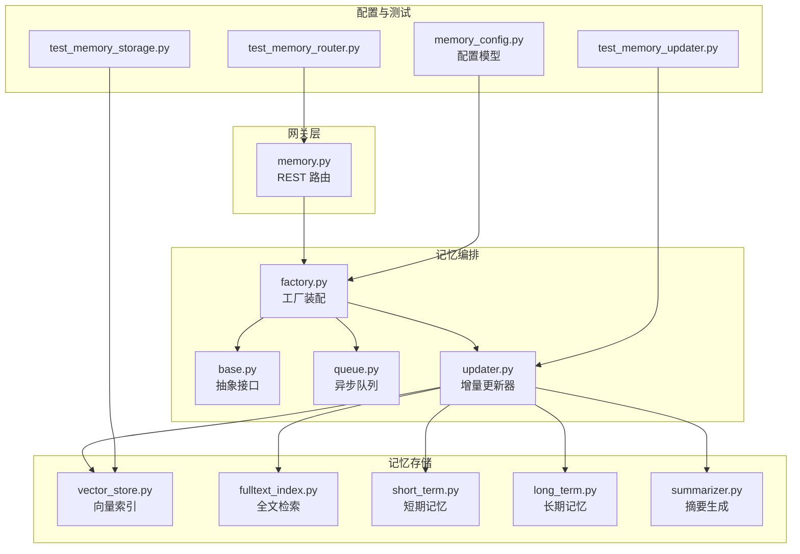
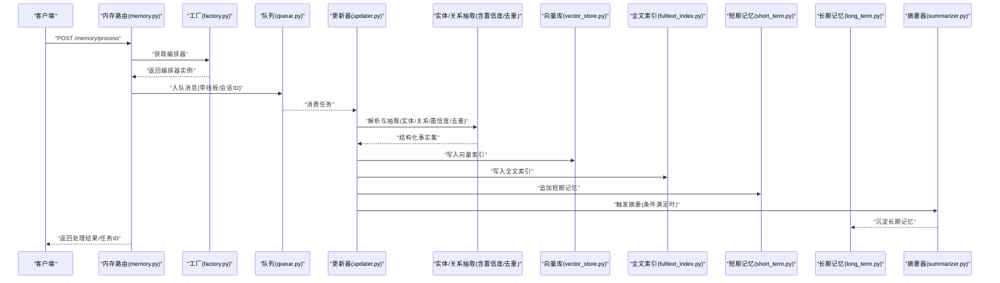
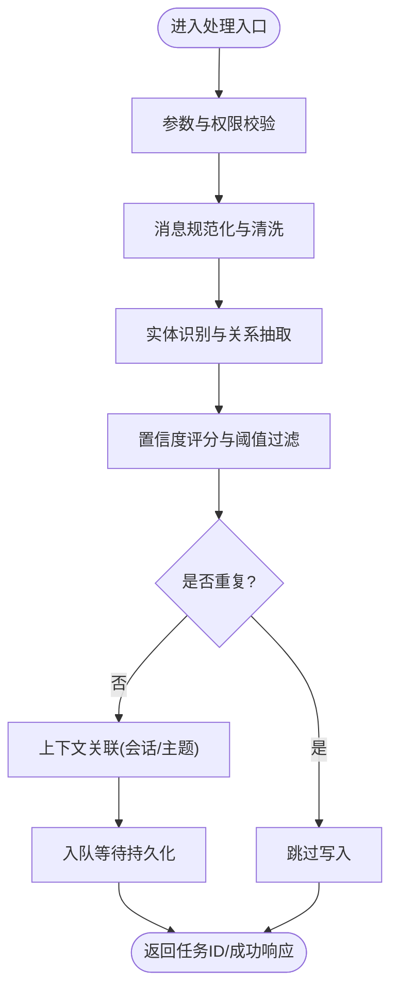
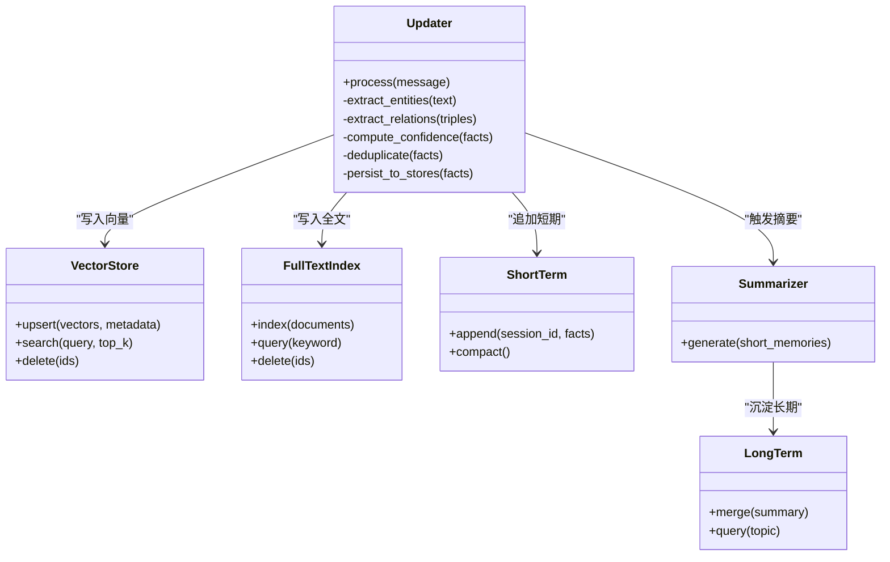
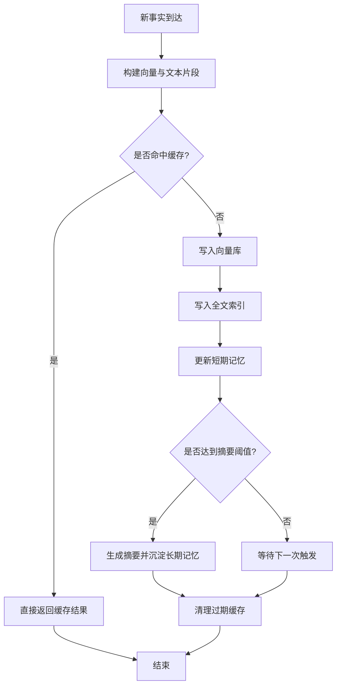
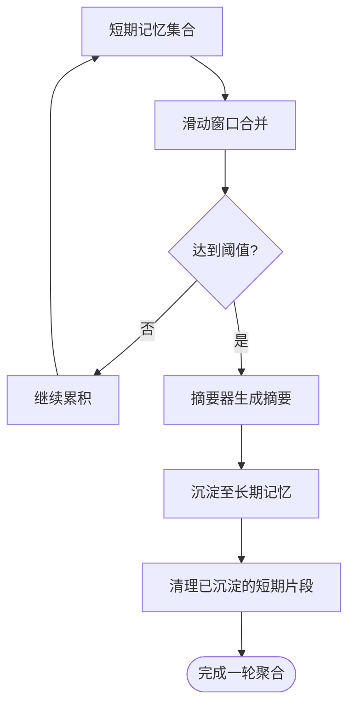
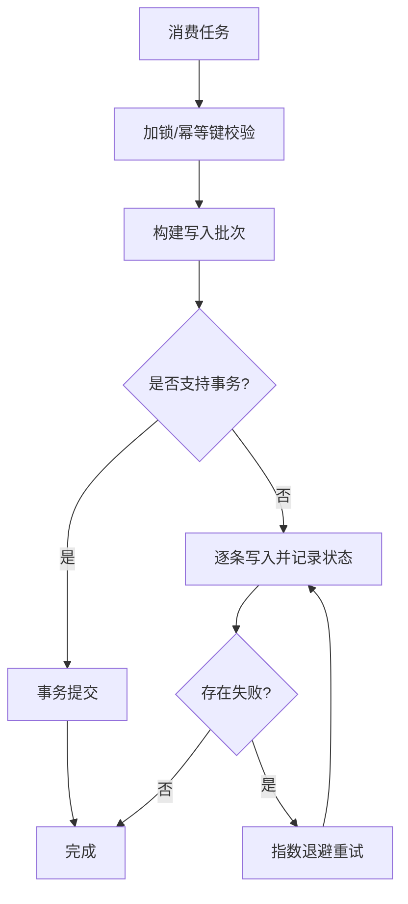
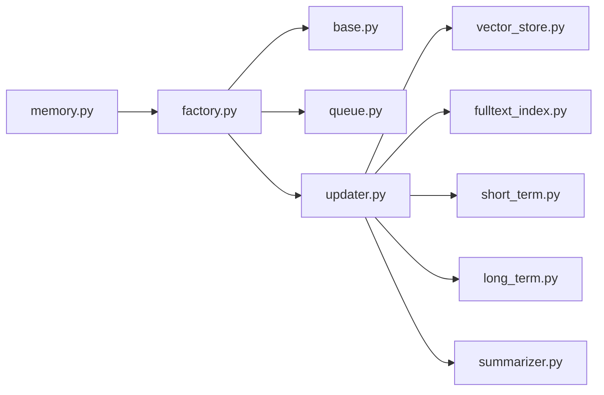

# 记忆数据处理流

<cite>
**本文引用的文件**   
- [backend/app/gateway/routers/memory.py](file://backend/app/gateway/routers/memory.py)
- [backend/packages/harness/deerflow/agents/memory/__init__.py](file://backend/packages/harness/deerflow/agents/memory/__init__.py)
- [backend/packages/harness/deerflow/agents/memory/factory.py](file://backend/packages/harness/deerflow/agents/memory/factory.py)
- [backend/packages/harness/deerflow/agents/memory/base.py](file://backend/packages/harness/deerflow/agents/memory/base.py)
- [backend/packages/harness/deerflow/agents/memory/vector_store.py](file://backend/packages/harness/deerflow/agents/memory/vector_store.py)
- [backend/packages/harness/deerflow/agents/memory/fulltext_index.py](file://backend/packages/harness/deerflow/agents/memory/fulltext_index.py)
- [backend/packages/harness/deerflow/agents/memory/updater.py](file://backend/packages/harness/deerflow/agents/memory/updater.py)
- [backend/packages/harness/deerflow/agents/memory/queue.py](file://backend/packages/harness/deerflow/agents/memory/queue.py)
- [backend/packages/harness/deerflow/agents/memory/short_term.py](file://backend/packages/harness/deerflow/agents/memory/short_term.py)
- [backend/packages/harness/deerflow/agents/memory/long_term.py](file://backend/packages/harness/deerflow/agents/memory/long_term.py)
- [backend/packages/harness/deerflow/agents/memory/summarizer.py](file://backend/packages/harness/deerflow/agents/memory/summarizer.py)
- [backend/packages/harness/deerflow/config/memory_config.py](file://backend/packages/harness/deerflow/config/memory_config.py)
- [backend/tests/test_memory_router.py](file://backend/tests/test_memory_router.py)
- [backend/tests/test_memory_storage.py](file://backend/tests/test_memory_storage.py)
- [backend/tests/test_memory_updater.py](file://backend/tests/test_memory_updater.py)
- [backend/docs/MEMORY_IMPROVEMENTS.md](file://backend/docs/MEMORY_IMPROVEMENTS.md)
- [backend/docs/MEMORY_SETTINGS_REVIEW.md](file://backend/docs/MEMORY_SETTINGS_REVIEW.md)
</cite>

## 目录
1. [简介](#简介)
2. [项目结构](#项目结构)
3. [核心组件](#核心组件)
4. [架构总览](#架构总览)
5. [详细组件分析](#详细组件分析)
6. [依赖关系分析](#依赖关系分析)
7. [性能考虑](#性能考虑)
8. [故障排查指南](#故障排查指南)
9. [结论](#结论)
10. [附录](#附录)

## 简介
本文件聚焦 DeerFlow 的记忆数据处理流，围绕“消息处理、事实提取、索引更新、记忆聚合、一致性保障、查询API与性能调优”展开。目标读者包括后端工程师、算法工程师与系统运维人员，力求在保持技术深度的同时提供可操作的实践建议。

## 项目结构
记忆子系统位于后端 harness 的 agents.memory 包中，并通过网关路由对外暴露 API；配置集中于 memory_config；测试覆盖路由、存储与更新流程；文档包含改进说明与设置审查要点。

图表来源
- [backend/app/gateway/routers/memory.py](file://backend/app/gateway/routers/memory.py)
- [backend/packages/harness/deerflow/agents/memory/factory.py](file://backend/packages/harness/deerflow/agents/memory/factory.py)
- [backend/packages/harness/deerflow/agents/memory/base.py](file://backend/packages/harness/deerflow/agents/memory/base.py)
- [backend/packages/harness/deerflow/agents/memory/queue.py](file://backend/packages/harness/deerflow/agents/memory/queue.py)
- [backend/packages/harness/deerflow/agents/memory/updater.py](file://backend/packages/harness/deerflow/agents/memory/updater.py)
- [backend/packages/harness/deerflow/agents/memory/vector_store.py](file://backend/packages/harness/deerflow/agents/memory/vector_store.py)
- [backend/packages/harness/deerflow/agents/memory/fulltext_index.py](file://backend/packages/harness/deerflow/agents/memory/fulltext_index.py)
- [backend/packages/harness/deerflow/agents/memory/short_term.py](file://backend/packages/harness/deerflow/agents/memory/short_term.py)
- [backend/packages/harness/deerflow/agents/memory/long_term.py](file://backend/packages/harness/deerflow/agents/memory/long_term.py)
- [backend/packages/harness/deerflow/agents/memory/summarizer.py](file://backend/packages/harness/deerflow/agents/memory/summarizer.py)
- [backend/packages/harness/deerflow/config/memory_config.py](file://backend/packages/harness/deerflow/config/memory_config.py)
- [backend/tests/test_memory_router.py](file://backend/tests/test_memory_router.py)
- [backend/tests/test_memory_storage.py](file://backend/tests/test_memory_storage.py)
- [backend/tests/test_memory_updater.py](file://backend/tests/test_memory_updater.py)

章节来源
- [backend/app/gateway/routers/memory.py](file://backend/app/gateway/routers/memory.py)
- [backend/packages/harness/deerflow/agents/memory/factory.py](file://backend/packages/harness/deerflow/agents/memory/factory.py)
- [backend/packages/harness/deerflow/agents/memory/base.py](file://backend/packages/harness/deerflow/agents/memory/base.py)
- [backend/packages/harness/deerflow/agents/memory/queue.py](file://backend/packages/harness/deerflow/agents/memory/queue.py)
- [backend/packages/harness/deerflow/agents/memory/updater.py](file://backend/packages/harness/deerflow/agents/memory/updater.py)
- [backend/packages/harness/deerflow/agents/memory/vector_store.py](file://backend/packages/harness/deerflow/agents/memory/vector_store.py)
- [backend/packages/harness/deerflow/agents/memory/fulltext_index.py](file://backend/packages/harness/deerflow/agents/memory/fulltext_index.py)
- [backend/packages/harness/deerflow/agents/memory/short_term.py](file://backend/packages/harness/deerflow/agents/memory/short_term.py)
- [backend/packages/harness/deerflow/agents/memory/long_term.py](file://backend/packages/harness/deerflow/agents/memory/long_term.py)
- [backend/packages/harness/deerflow/agents/memory/summarizer.py](file://backend/packages/harness/deerflow/agents/memory/summarizer.py)
- [backend/packages/harness/deerflow/config/memory_config.py](file://backend/packages/harness/deerflow/config/memory_config.py)
- [backend/tests/test_memory_router.py](file://backend/tests/test_memory_router.py)
- [backend/tests/test_memory_storage.py](file://backend/tests/test_memory_storage.py)
- [backend/tests/test_memory_updater.py](file://backend/tests/test_memory_updater.py)

## 核心组件
- 路由与入口：REST 路由负责接收请求、参数校验、调用编排器并返回结果。
- 工厂与抽象：统一装配各记忆组件（短期、长期、向量、全文、摘要），并提供一致的接口契约。
- 异步队列：解耦写入与持久化，支持背压与重试。
- 增量更新器：协调实体识别、关系抽取、置信度计算、去重与索引落盘。
- 存储层：向量数据库用于语义检索，全文索引用于关键词匹配，短期/长期记忆分别承载会话级与跨会话知识。
- 摘要器：对短期记忆进行压缩沉淀为长期记忆。
- 配置：集中管理阈值、批大小、超时、并发等关键参数。

章节来源
- [backend/app/gateway/routers/memory.py](file://backend/app/gateway/routers/memory.py)
- [backend/packages/harness/deerflow/agents/memory/factory.py](file://backend/packages/harness/deerflow/agents/memory/factory.py)
- [backend/packages/harness/deerflow/agents/memory/base.py](file://backend/packages/harness/deerflow/agents/memory/base.py)
- [backend/packages/harness/deerflow/agents/memory/queue.py](file://backend/packages/harness/deerflow/agents/memory/queue.py)
- [backend/packages/harness/deerflow/agents/memory/updater.py](file://backend/packages/harness/deerflow/agents/memory/updater.py)
- [backend/packages/harness/deerflow/agents/memory/vector_store.py](file://backend/packages/harness/deerflow/agents/memory/vector_store.py)
- [backend/packages/harness/deerflow/agents/memory/fulltext_index.py](file://backend/packages/harness/deerflow/agents/memory/fulltext_index.py)
- [backend/packages/harness/deerflow/agents/memory/short_term.py](file://backend/packages/harness/deerflow/agents/memory/short_term.py)
- [backend/packages/harness/deerflow/agents/memory/long_term.py](file://backend/packages/harness/deerflow/agents/memory/long_term.py)
- [backend/packages/harness/deerflow/agents/memory/summarizer.py](file://backend/packages/harness/deerflow/agents/memory/summarizer.py)
- [backend/packages/harness/deerflow/config/memory_config.py](file://backend/packages/harness/deerflow/config/memory_config.py)

## 架构总览
下图展示从消息接收到记忆沉淀的全链路数据流，以及查询时的召回路径。

图表来源
- [backend/app/gateway/routers/memory.py](file://backend/app/gateway/routers/memory.py)
- [backend/packages/harness/deerflow/agents/memory/factory.py](file://backend/packages/harness/deerflow/agents/memory/factory.py)
- [backend/packages/harness/deerflow/agents/memory/queue.py](file://backend/packages/harness/deerflow/agents/memory/queue.py)
- [backend/packages/harness/deerflow/agents/memory/updater.py](file://backend/packages/harness/deerflow/agents/memory/updater.py)
- [backend/packages/harness/deerflow/agents/memory/vector_store.py](file://backend/packages/harness/deerflow/agents/memory/vector_store.py)
- [backend/packages/harness/deerflow/agents/memory/fulltext_index.py](file://backend/packages/harness/deerflow/agents/memory/fulltext_index.py)
- [backend/packages/harness/deerflow/agents/memory/short_term.py](file://backend/packages/harness/deerflow/agents/memory/short_term.py)
- [backend/packages/harness/deerflow/agents/memory/long_term.py](file://backend/packages/harness/deerflow/agents/memory/long_term.py)
- [backend/packages/harness/deerflow/agents/memory/summarizer.py](file://backend/packages/harness/deerflow/agents/memory/summarizer.py)

## 详细组件分析

### 消息处理流程（接收、解析、提取、关联）
- 接收与校验：路由层对请求体进行字段校验与权限检查，确保携带必要的上下文标识（如 thread_id、user_id）。
- 格式解析：将多模态或富文本消息标准化为内部消息结构，剥离无关元数据，保留时间戳、来源、内容片段。
- 内容提取：基于 NLP 管线完成实体识别、关系抽取，输出三元组与属性键值对。
- 上下文关联：依据会话/主题标签将事实与当前上下文绑定，便于后续检索与推理。

图表来源
- [backend/app/gateway/routers/memory.py](file://backend/app/gateway/routers/memory.py)
- [backend/packages/harness/deerflow/agents/memory/updater.py](file://backend/packages/harness/deerflow/agents/memory/updater.py)
- [backend/packages/harness/deerflow/agents/memory/queue.py](file://backend/packages/harness/deerflow/agents/memory/queue.py)

章节来源
- [backend/app/gateway/routers/memory.py](file://backend/app/gateway/routers/memory.py)
- [backend/packages/harness/deerflow/agents/memory/updater.py](file://backend/packages/harness/deerflow/agents/memory/updater.py)
- [backend/packages/harness/deerflow/agents/memory/queue.py](file://backend/packages/harness/deerflow/agents/memory/queue.py)

### 事实提取算法（实体、关系、置信度、去重）
- 实体识别：采用命名实体识别与类型归一化，合并同义实体（别名映射）。
- 关系抽取：基于依存句法与模板规则抽取主谓宾三元组，扩展为有向图节点与边。
- 置信度计算：融合模型概率、证据强度、上下文一致性，得到综合分数。
- 去重策略：基于实体指纹与相似度阈值进行近似去重，结合时间衰减避免陈旧信息干扰。

图表来源
- [backend/packages/harness/deerflow/agents/memory/updater.py](file://backend/packages/harness/deerflow/agents/memory/updater.py)
- [backend/packages/harness/deerflow/agents/memory/vector_store.py](file://backend/packages/harness/deerflow/agents/memory/vector_store.py)
- [backend/packages/harness/deerflow/agents/memory/fulltext_index.py](file://backend/packages/harness/deerflow/agents/memory/fulltext_index.py)
- [backend/packages/harness/deerflow/agents/memory/short_term.py](file://backend/packages/harness/deerflow/agents/memory/short_term.py)
- [backend/packages/harness/deerflow/agents/memory/long_term.py](file://backend/packages/harness/deerflow/agents/memory/long_term.py)
- [backend/packages/harness/deerflow/agents/memory/summarizer.py](file://backend/packages/harness/deerflow/agents/memory/summarizer.py)

章节来源
- [backend/packages/harness/deerflow/agents/memory/updater.py](file://backend/packages/harness/deerflow/agents/memory/updater.py)
- [backend/packages/harness/deerflow/agents/memory/vector_store.py](file://backend/packages/harness/deerflow/agents/memory/vector_store.py)
- [backend/packages/harness/deerflow/agents/memory/fulltext_index.py](file://backend/packages/harness/deerflow/agents/memory/fulltext_index.py)
- [backend/packages/harness/deerflow/agents/memory/short_term.py](file://backend/packages/harness/deerflow/agents/memory/short_term.py)
- [backend/packages/harness/deerflow/agents/memory/long_term.py](file://backend/packages/harness/deerflow/agents/memory/long_term.py)
- [backend/packages/harness/deerflow/agents/memory/summarizer.py](file://backend/packages/harness/deerflow/agents/memory/summarizer.py)

### 索引更新机制（向量库、全文索引、缓存）
- 向量数据库操作：批量 upsert、按相似度检索、按 ID 删除；支持元数据过滤（会话、主题、时间窗）。
- 全文检索索引：对原始内容与摘要建立倒排索引，支持关键词与短语匹配，提升精确召回。
- 缓存策略：热点查询结果缓存（TTL）、写放大控制（合并写入）、失败回退（降级到本地缓存或延迟重试）。

图表来源
- [backend/packages/harness/deerflow/agents/memory/vector_store.py](file://backend/packages/harness/deerflow/agents/memory/vector_store.py)
- [backend/packages/harness/deerflow/agents/memory/fulltext_index.py](file://backend/packages/harness/deerflow/agents/memory/fulltext_index.py)
- [backend/packages/harness/deerflow/agents/memory/short_term.py](file://backend/packages/harness/deerflow/agents/memory/short_term.py)
- [backend/packages/harness/deerflow/agents/memory/long_term.py](file://backend/packages/harness/deerflow/agents/memory/long_term.py)
- [backend/packages/harness/deerflow/agents/memory/summarizer.py](file://backend/packages/harness/deerflow/agents/memory/summarizer.py)

章节来源
- [backend/packages/harness/deerflow/agents/memory/vector_store.py](file://backend/packages/harness/deerflow/agents/memory/vector_store.py)
- [backend/packages/harness/deerflow/agents/memory/fulltext_index.py](file://backend/packages/harness/deerflow/agents/memory/fulltext_index.py)
- [backend/packages/harness/deerflow/agents/memory/short_term.py](file://backend/packages/harness/deerflow/agents/memory/short_term.py)
- [backend/packages/harness/deerflow/agents/memory/long_term.py](file://backend/packages/harness/deerflow/agents/memory/long_term.py)
- [backend/packages/harness/deerflow/agents/memory/summarizer.py](file://backend/packages/harness/deerflow/agents/memory/summarizer.py)

### 记忆聚合过程（短期合并、长期沉淀、摘要生成）
- 短期记忆合并：按会话窗口滑动合并，剔除低置信度条目，压缩冗余。
- 长期记忆沉淀：当短期记忆规模或时间跨度达到阈值，触发摘要器生成精炼知识块。
- 摘要生成：基于主题聚类与重要性排序，生成可检索的摘要片段，写入长期记忆。

图表来源
- [backend/packages/harness/deerflow/agents/memory/short_term.py](file://backend/packages/harness/deerflow/agents/memory/short_term.py)
- [backend/packages/harness/deerflow/agents/memory/summarizer.py](file://backend/packages/harness/deerflow/agents/memory/summarizer.py)
- [backend/packages/harness/deerflow/agents/memory/long_term.py](file://backend/packages/harness/deerflow/agents/memory/long_term.py)

章节来源
- [backend/packages/harness/deerflow/agents/memory/short_term.py](file://backend/packages/harness/deerflow/agents/memory/short_term.py)
- [backend/packages/harness/deerflow/agents/memory/summarizer.py](file://backend/packages/harness/deerflow/agents/memory/summarizer.py)
- [backend/packages/harness/deerflow/agents/memory/long_term.py](file://backend/packages/harness/deerflow/agents/memory/long_term.py)

### 数据一致性保证（并发、事务、冲突解决）
- 并发控制：队列消费者使用锁或幂等键避免重复处理；向量/全文索引写入采用幂等 upsert。
- 事务处理：若底层存储支持事务，则同一批次的事实写入应原子提交；否则通过补偿任务与重试保证最终一致。
- 冲突解决：以时间戳与版本号为序，高版本覆盖低版本；对冲突实体采用合并策略（属性并集+权重投票）。

图表来源
- [backend/packages/harness/deerflow/agents/memory/queue.py](file://backend/packages/harness/deerflow/agents/memory/queue.py)
- [backend/packages/harness/deerflow/agents/memory/updater.py](file://backend/packages/harness/deerflow/agents/memory/updater.py)
- [backend/packages/harness/deerflow/agents/memory/vector_store.py](file://backend/packages/harness/deerflow/agents/memory/vector_store.py)
- [backend/packages/harness/deerflow/agents/memory/fulltext_index.py](file://backend/packages/harness/deerflow/agents/memory/fulltext_index.py)

章节来源
- [backend/packages/harness/deerflow/agents/memory/queue.py](file://backend/packages/harness/deerflow/agents/memory/queue.py)
- [backend/packages/harness/deerflow/agents/memory/updater.py](file://backend/packages/harness/deerflow/agents/memory/updater.py)
- [backend/packages/harness/deerflow/agents/memory/vector_store.py](file://backend/packages/harness/deerflow/agents/memory/vector_store.py)
- [backend/packages/harness/deerflow/agents/memory/fulltext_index.py](file://backend/packages/harness/deerflow/agents/memory/fulltext_index.py)

### 记忆查询API与用法
- 典型端点
  - POST /memory/process：提交待处理消息，返回任务ID或处理结果。
  - GET /memory/search：语义+关键词混合检索，支持分页与过滤。
  - GET /memory/summary/{thread_id}：获取会话摘要与长期知识快照。
- 请求/响应要点
  - 请求需携带 thread_id、user_id、content 等必要字段。
  - 响应包含 status、task_id、result 或 error 信息。
- 错误码与重试
  - 4xx：参数错误或权限不足。
  - 5xx：下游服务异常，客户端应实施指数退避重试。

章节来源
- [backend/app/gateway/routers/memory.py](file://backend/app/gateway/routers/memory.py)
- [backend/tests/test_memory_router.py](file://backend/tests/test_memory_router.py)

## 依赖关系分析
- 组件耦合
  - 路由仅依赖工厂与队列，降低对外部实现的感知。
  - 更新器作为编排中心，依赖向量、全文、短/长期记忆与摘要器。
- 外部依赖
  - 向量数据库与全文检索引擎通过抽象接口接入，便于替换实现。
- 循环依赖
  - 通过工厂与接口隔离，避免模块间直接循环引用。

图表来源
- [backend/app/gateway/routers/memory.py](file://backend/app/gateway/routers/memory.py)
- [backend/packages/harness/deerflow/agents/memory/factory.py](file://backend/packages/harness/deerflow/agents/memory/factory.py)
- [backend/packages/harness/deerflow/agents/memory/base.py](file://backend/packages/harness/deerflow/agents/memory/base.py)
- [backend/packages/harness/deerflow/agents/memory/queue.py](file://backend/packages/harness/deerflow/agents/memory/queue.py)
- [backend/packages/harness/deerflow/agents/memory/updater.py](file://backend/packages/harness/deerflow/agents/memory/updater.py)
- [backend/packages/harness/deerflow/agents/memory/vector_store.py](file://backend/packages/harness/deerflow/agents/memory/vector_store.py)
- [backend/packages/harness/deerflow/agents/memory/fulltext_index.py](file://backend/packages/harness/deerflow/agents/memory/fulltext_index.py)
- [backend/packages/harness/deerflow/agents/memory/short_term.py](file://backend/packages/harness/deerflow/agents/memory/short_term.py)
- [backend/packages/harness/deerflow/agents/memory/long_term.py](file://backend/packages/harness/deerflow/agents/memory/long_term.py)
- [backend/packages/harness/deerflow/agents/memory/summarizer.py](file://backend/packages/harness/deerflow/agents/memory/summarizer.py)

章节来源
- [backend/packages/harness/deerflow/agents/memory/factory.py](file://backend/packages/harness/deerflow/agents/memory/factory.py)
- [backend/packages/harness/deerflow/agents/memory/base.py](file://backend/packages/harness/deerflow/agents/memory/base.py)

## 性能考虑
- 写入吞吐
  - 增大队列批大小与消费者并行度，配合向量/全文索引的批量写入接口。
  - 启用写合并与延迟刷新，减少小批量频繁落盘。
- 读取延迟
  - 开启热点缓存（TTL 可调），优先返回缓存结果。
  - 混合检索：先关键词粗筛，再向量精排，降低全量相似度计算开销。
- 资源控制
  - 限制并发消费者数量，防止下游存储过载。
  - 对大消息进行分片与截断，避免单次处理占用过多内存。
- 监控与告警
  - 跟踪队列积压、写入失败率、索引构建耗时与缓存命中率。
  - 对慢查询与长尾延迟设置阈值告警。

[本节为通用指导，不直接分析具体文件]

## 故障排查指南
- 常见问题
  - 消息未入库：检查队列消费日志与幂等键冲突；确认向量/全文索引写入是否成功。
  - 检索不到结果：验证索引是否刷新；检查过滤条件与时间窗是否过严。
  - 摘要未生成：核对短期记忆规模与阈值配置；查看摘要器执行日志。
- 定位手段
  - 查看路由与更新器的错误堆栈与重试次数。
  - 对比短期/长期记忆的时间线，确认沉淀逻辑是否触发。
  - 使用测试用例复现问题，逐步缩小范围。

章节来源
- [backend/tests/test_memory_updater.py](file://backend/tests/test_memory_updater.py)
- [backend/tests/test_memory_storage.py](file://backend/tests/test_memory_storage.py)
- [backend/tests/test_memory_router.py](file://backend/tests/test_memory_router.py)

## 结论
DeerFlow 的记忆数据处理流以“异步队列+增量更新器”为核心，串联实体/关系抽取、置信度与去重、双索引（向量+全文）与短/长期记忆聚合。通过工厂装配与接口抽象，系统具备良好的可扩展性与稳定性。在生产环境中，建议重点关注写入吞吐、检索延迟与一致性保障，并结合监控指标持续优化。

[本节为总结性内容，不直接分析具体文件]

## 附录
- 配置项参考：阈值、批大小、超时、并发、缓存 TTL 等详见配置模型与文档。
- 改进与回顾：历史改进与设置审查要点有助于理解演进方向与最佳实践。

章节来源
- [backend/packages/harness/deerflow/config/memory_config.py](file://backend/packages/harness/deerflow/config/memory_config.py)
- [backend/docs/MEMORY_IMPROVEMENTS.md](file://backend/docs/MEMORY_IMPROVEMENTS.md)
- [backend/docs/MEMORY_SETTINGS_REVIEW.md](file://backend/docs/MEMORY_SETTINGS_REVIEW.md)