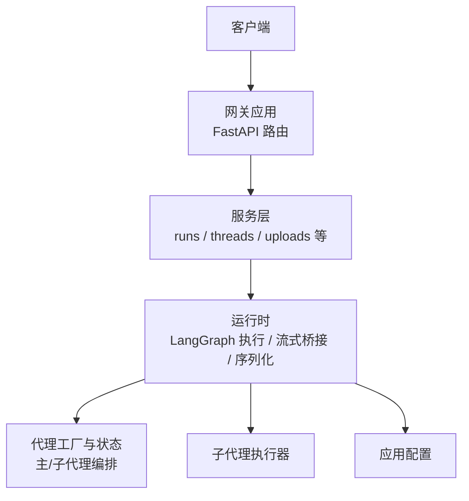
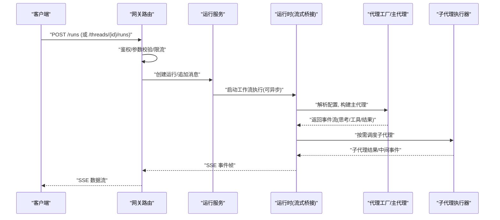
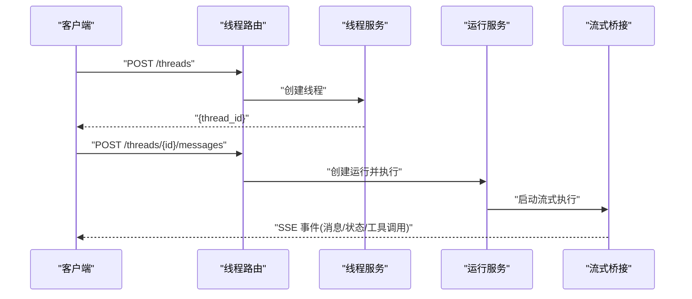
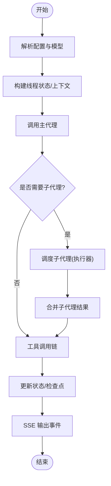
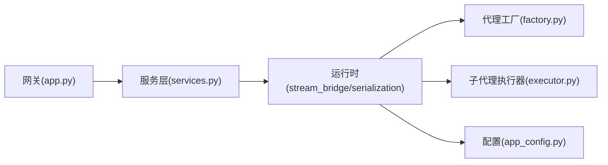

# 请求处理流程

<cite>
**本文引用的文件**   
- [backend/app/gateway/app.py](file://backend/app/gateway/app.py)
- [backend/app/gateway/routers/agents.py](file://backend/app/gateway/routers/agents.py)
- [backend/app/gateway/routers/runs.py](file://backend/app/gateway/routers/runs.py)
- [backend/app/gateway/routers/thread_runs.py](file://backend/app/gateway/routers/thread_runs.py)
- [backend/app/gateway/routers/threads.py](file://backend/app/gateway/routers/threads.py)
- [backend/app/gateway/services.py](file://backend/app/gateway/services.py)
- [backend/app/gateway/deps.py](file://backend/app/gateway/deps.py)
- [backend/packages/harness/deerflow/runtime/stream_bridge/__init__.py](file://backend/packages/harness/deerflow/runtime/stream_bridge/__init__.py)
- [backend/packages/harness/deerflow/runtime/stream_bridge/sse.py](file://backend/packages/harness/deerflow/runtime/stream_bridge/sse.py)
- [backend/packages/harness/deerflow/runtime/serialization.py](file://backend/packages/harness/deerflow/runtime/serialization.py)
- [backend/packages/harness/deerflow/agents/factory.py](file://backend/packages/harness/deerflow/agents/factory.py)
- [backend/packages/harness/deerflow/agents/thread_state.py](file://backend/packages/harness/deerflow/agents/thread_state.py)
- [backend/packages/harness/deerflow/subagents/executor.py](file://backend/packages/harness/deerflow/subagents/executor.py)
- [backend/packages/harness/deerflow/config/app_config.py](file://backend/packages/harness/deerflow/config/app_config.py)
</cite>

## 目录
1. [简介](#简介)
2. [项目结构](#项目结构)
3. [核心组件](#核心组件)
4. [架构总览](#架构总览)
5. [详细组件分析](#详细组件分析)
6. [依赖关系分析](#依赖关系分析)
7. [性能考虑](#性能考虑)
8. [故障排查指南](#故障排查指南)
9. [结论](#结论)
10. [附录](#附录)

## 简介
本文面向 DeerFlow 后端，系统化梳理 HTTP 请求从网关到代理执行的完整生命周期：请求接收、路由分发、认证授权、参数校验、业务逻辑处理、结果序列化与流式输出；并深入说明线程管理的请求流（创建新线程、发送消息、获取历史、状态更新）以及代理调用链（主代理协调、子代理调度、工具调用链）。文档同时覆盖超时处理、错误传播与响应格式标准化，并提供时序图与关键代码路径定位。

## 项目结构
DeerFlow 后端采用“网关 + 服务 + 运行时”的分层组织方式：
- 网关层：基于 FastAPI 的 HTTP 入口，负责路由、鉴权、参数校验、异常统一处理与 SSE 流式桥接。
- 服务层：封装领域能力（如运行管理、线程管理、上传等），对上层提供稳定的接口契约。
- 运行时层：承载 LangGraph 工作流执行、流式桥接、序列化、子代理执行器、配置加载等核心能力。

图表来源
- [backend/app/gateway/app.py](file://backend/app/gateway/app.py)
- [backend/app/gateway/services.py](file://backend/app/gateway/services.py)
- [backend/packages/harness/deerflow/runtime/stream_bridge/__init__.py](file://backend/packages/harness/deerflow/runtime/stream_bridge/__init__.py)
- [backend/packages/harness/deerflow/agents/factory.py](file://backend/packages/harness/deerflow/agents/factory.py)
- [backend/packages/harness/deerflow/subagents/executor.py](file://backend/packages/harness/deerflow/subagents/executor.py)
- [backend/packages/harness/deerflow/config/app_config.py](file://backend/packages/harness/deerflow/config/app_config.py)

章节来源
- [backend/app/gateway/app.py](file://backend/app/gateway/app.py)
- [backend/app/gateway/services.py](file://backend/app/gateway/services.py)
- [backend/packages/harness/deerflow/runtime/stream_bridge/__init__.py](file://backend/packages/harness/deerflow/runtime/stream_bridge/__init__.py)

## 核心组件
- 网关应用与路由：集中注册路由、挂载中间件、统一异常与 CORS、SSE 支持。
- 服务层：将 HTTP 语义映射为领域操作（如创建运行、追加消息、查询历史、提交任务等）。
- 运行时：
  - 流式桥接：将 LangGraph 事件转换为 SSE 帧，供前端增量消费。
  - 序列化：统一输入/输出模型与字段规范。
  - 代理编排：根据配置选择主代理，协调子代理与工具调用。
  - 子代理执行器：并发/限流地调度子代理任务。
  - 配置加载：读取应用级配置（包括超时、限流、安全策略等）。

章节来源
- [backend/app/gateway/app.py](file://backend/app/gateway/app.py)
- [backend/app/gateway/services.py](file://backend/app/gateway/services.py)
- [backend/packages/harness/deerflow/runtime/stream_bridge/__init__.py](file://backend/packages/harness/deerflow/runtime/stream_bridge/__init__.py)
- [backend/packages/harness/deerflow/runtime/serialization.py](file://backend/packages/harness/deerflow/runtime/serialization.py)
- [backend/packages/harness/deerflow/agents/factory.py](file://backend/packages/harness/deerflow/agents/factory.py)
- [backend/packages/harness/deerflow/subagents/executor.py](file://backend/packages/harness/deerflow/subagents/executor.py)
- [backend/packages/harness/deerflow/config/app_config.py](file://backend/packages/harness/deerflow/config/app_config.py)

## 架构总览
下图展示一次典型“创建运行并流式返回”的请求链路：客户端通过网关进入，路由到运行服务，服务调用运行时执行 LangGraph 工作流，运行时通过流式桥接将事件以 SSE 推送回客户端。

图表来源
- [backend/app/gateway/routers/runs.py](file://backend/app/gateway/routers/runs.py)
- [backend/app/gateway/routers/thread_runs.py](file://backend/app/gateway/routers/thread_runs.py)
- [backend/app/gateway/services.py](file://backend/app/gateway/services.py)
- [backend/packages/harness/deerflow/runtime/stream_bridge/__init__.py](file://backend/packages/harness/deerflow/runtime/stream_bridge/__init__.py)
- [backend/packages/harness/deerflow/agents/factory.py](file://backend/packages/harness/deerflow/agents/factory.py)
- [backend/packages/harness/deerflow/subagents/executor.py](file://backend/packages/harness/deerflow/subagents/executor.py)

## 详细组件分析

### 网关层：请求接收、路由分发、认证授权、参数校验
- 应用初始化：注册路由、挂载中间件（CORS、日志、限流等）、统一异常处理器。
- 路由分发：按资源划分路由模块（runs、thread_runs、threads、artifacts、uploads 等），每个路由聚焦单一职责。
- 认证授权：通过依赖注入在路由函数中获取当前用户上下文，结合权限策略进行访问控制。
- 参数校验：使用 Pydantic 模型对请求体/路径/查询参数进行强类型校验，失败时返回标准错误响应。
- 流式响应：对需要增量输出的接口，返回 SSE 流；非流式接口返回 JSON。

章节来源
- [backend/app/gateway/app.py](file://backend/app/gateway/app.py)
- [backend/app/gateway/routers/runs.py](file://backend/app/gateway/routers/runs.py)
- [backend/app/gateway/routers/thread_runs.py](file://backend/app/gateway/routers/thread_runs.py)
- [backend/app/gateway/routers/threads.py](file://backend/app/gateway/routers/threads.py)
- [backend/app/gateway/deps.py](file://backend/app/gateway/deps.py)

### 服务层：业务编排与事务边界
- 运行服务：负责创建运行、追加消息、查询运行状态、取消运行等。
- 线程服务：负责线程的创建、历史消息获取、状态同步、标题生成触发等。
- 上传服务：负责文件上传、存储、元数据记录与安全扫描。
- 服务间解耦：对外暴露稳定 API，内部可组合多个运行时能力（如流式桥接、检查点、记忆等）。

章节来源
- [backend/app/gateway/services.py](file://backend/app/gateway/services.py)
- [backend/app/gateway/routers/runs.py](file://backend/app/gateway/routers/runs.py)
- [backend/app/gateway/routers/thread_runs.py](file://backend/app/gateway/routers/thread_runs.py)
- [backend/app/gateway/routers/threads.py](file://backend/app/gateway/routers/threads.py)

### 运行时：流式桥接、序列化、代理编排
- 流式桥接：将 LangGraph 的事件流转换为 SSE 帧，包含事件类型、时间戳、负载等字段，保证前端可增量渲染。
- 序列化：统一输入/输出模型，确保跨模块一致的数据结构；对大对象进行截断/压缩策略。
- 代理编排：
  - 主代理：根据配置选择模型与提示模板，协调工具调用与子代理。
  - 子代理：由执行器调度，支持并发与限流，避免资源耗尽。
  - 工具链：在代理执行过程中按需调用内置/外部工具，并将结果写回状态。
- 状态管理：基于线程状态持久化，支持断点续跑与历史回溯。

章节来源
- [backend/packages/harness/deerflow/runtime/stream_bridge/__init__.py](file://backend/packages/harness/deerflow/runtime/stream_bridge/__init__.py)
- [backend/packages/harness/deerflow/runtime/stream_bridge/sse.py](file://backend/packages/harness/deerflow/runtime/stream_bridge/sse.py)
- [backend/packages/harness/deerflow/runtime/serialization.py](file://backend/packages/harness/deerflow/runtime/serialization.py)
- [backend/packages/harness/deerflow/agents/factory.py](file://backend/packages/harness/deerflow/agents/factory.py)
- [backend/packages/harness/deerflow/agents/thread_state.py](file://backend/packages/harness/deerflow/agents/thread_state.py)
- [backend/packages/harness/deerflow/subagents/executor.py](file://backend/packages/harness/deerflow/subagents/executor.py)

### 线程管理请求流：创建、发送、历史、状态更新
- 创建线程：客户端发起创建请求，网关校验后交由线程服务创建，返回线程 ID。
- 发送消息：在指定线程下追加用户消息，服务层触发运行创建与执行。
- 获取历史：按页/游标拉取历史消息，支持过滤与排序。
- 状态更新：运行过程中持续写入检查点，前端可通过 SSE 实时感知进度。

图表来源
- [backend/app/gateway/routers/threads.py](file://backend/app/gateway/routers/threads.py)
- [backend/app/gateway/routers/thread_runs.py](file://backend/app/gateway/routers/thread_runs.py)
- [backend/app/gateway/services.py](file://backend/app/gateway/services.py)
- [backend/packages/harness/deerflow/runtime/stream_bridge/__init__.py](file://backend/packages/harness/deerflow/runtime/stream_bridge/__init__.py)

### 代理调用请求流：主代理协调、子代理调度、工具调用链
- 主代理协调：根据配置解析模型、系统提示、工具集，构建初始状态。
- 子代理调度：当任务复杂时，主代理将子任务下发给执行器，执行器按策略并发/限流调度。
- 工具调用链：在代理执行过程中，按需调用搜索、代码执行、文件读写等工具，结果回填至状态。

图表来源
- [backend/packages/harness/deerflow/agents/factory.py](file://backend/packages/harness/deerflow/agents/factory.py)
- [backend/packages/harness/deerflow/subagents/executor.py](file://backend/packages/harness/deerflow/subagents/executor.py)
- [backend/packages/harness/deerflow/runtime/stream_bridge/__init__.py](file://backend/packages/harness/deerflow/runtime/stream_bridge/__init__.py)

### 超时处理、错误传播与响应标准化
- 超时处理：
  - 网关层：对长耗时接口设置连接/读超时，防止资源泄漏。
  - 运行时：为 LLM 调用与工具执行设置独立超时，避免单点阻塞。
- 错误传播：
  - 网关统一捕获异常，转换为标准错误响应（含错误码、消息、追踪 ID）。
  - 运行时将底层错误包装为领域错误，向上抛出以便服务层做降级或重试。
- 响应标准化：
  - 成功响应：统一数据结构（如 data/meta/errors），便于前端解析。
  - 流式响应：SSE 事件包含类型、时间戳、负载，支持幂等重放。

章节来源
- [backend/app/gateway/app.py](file://backend/app/gateway/app.py)
- [backend/packages/harness/deerflow/runtime/stream_bridge/sse.py](file://backend/packages/harness/deerflow/runtime/stream_bridge/sse.py)
- [backend/packages/harness/deerflow/runtime/serialization.py](file://backend/packages/harness/deerflow/runtime/serialization.py)
- [backend/packages/harness/deerflow/config/app_config.py](file://backend/packages/harness/deerflow/config/app_config.py)

## 依赖关系分析
- 网关依赖服务层：路由仅做协议适配与校验，业务编排下沉至服务层。
- 服务层依赖运行时：通过服务方法调用运行时能力（流式桥接、序列化、代理编排）。
- 运行时内部耦合：
  - 流式桥接与序列化紧密配合，确保事件一致性。
  - 代理工厂与子代理执行器协作，实现可扩展的编排模式。
  - 配置模块贯穿各层，决定行为开关与阈值。

图表来源
- [backend/app/gateway/app.py](file://backend/app/gateway/app.py)
- [backend/app/gateway/services.py](file://backend/app/gateway/services.py)
- [backend/packages/harness/deerflow/runtime/stream_bridge/__init__.py](file://backend/packages/harness/deerflow/runtime/stream_bridge/__init__.py)
- [backend/packages/harness/deerflow/runtime/serialization.py](file://backend/packages/harness/deerflow/runtime/serialization.py)
- [backend/packages/harness/deerflow/agents/factory.py](file://backend/packages/harness/deerflow/agents/factory.py)
- [backend/packages/harness/deerflow/subagents/executor.py](file://backend/packages/harness/deerflow/subagents/executor.py)
- [backend/packages/harness/deerflow/config/app_config.py](file://backend/packages/harness/deerflow/config/app_config.py)

章节来源
- [backend/app/gateway/app.py](file://backend/app/gateway/app.py)
- [backend/app/gateway/services.py](file://backend/app/gateway/services.py)
- [backend/packages/harness/deerflow/runtime/stream_bridge/__init__.py](file://backend/packages/harness/deerflow/runtime/stream_bridge/__init__.py)
- [backend/packages/harness/deerflow/runtime/serialization.py](file://backend/packages/harness/deerflow/runtime/serialization.py)
- [backend/packages/harness/deerflow/agents/factory.py](file://backend/packages/harness/deerflow/agents/factory.py)
- [backend/packages/harness/deerflow/subagents/executor.py](file://backend/packages/harness/deerflow/subagents/executor.py)
- [backend/packages/harness/deerflow/config/app_config.py](file://backend/packages/harness/deerflow/config/app_config.py)

## 性能考虑
- 流式优先：对长耗时任务启用 SSE，降低首字节延迟，提升用户体验。
- 并发与限流：子代理执行器应限制并发度，避免下游服务过载。
- 缓存与去重：对重复查询与工具结果进行缓存，减少冗余计算。
- 序列化优化：对大对象进行分块/压缩，避免单次传输过大。
- 超时与熔断：为外部依赖设置合理超时与熔断策略，保障整体可用性。

[本节为通用指导，不直接分析具体文件]

## 故障排查指南
- 常见问题定位：
  - 鉴权失败：检查依赖注入的用户上下文与权限策略。
  - 参数校验错误：核对 Pydantic 模型定义与客户端传参。
  - 流式中断：确认 SSE 事件是否连续，服务端是否发生异常或超时。
  - 子代理卡死：查看执行器日志与并发队列长度，调整限流与超时。
- 建议的排障步骤：
  - 开启调试日志，记录请求 ID 与关键节点耗时。
  - 复现最小用例，逐步隔离问题域（网关/服务/运行时）。
  - 检查配置项（超时、限流、模型端点可达性）。

章节来源
- [backend/app/gateway/app.py](file://backend/app/gateway/app.py)
- [backend/packages/harness/deerflow/runtime/stream_bridge/sse.py](file://backend/packages/harness/deerflow/runtime/stream_bridge/sse.py)
- [backend/packages/harness/deerflow/config/app_config.py](file://backend/packages/harness/deerflow/config/app_config.py)

## 结论
DeerFlow 的请求处理流程以网关为入口，服务层进行业务编排，运行时承载核心执行与流式输出。通过清晰的层次划分与标准化响应，系统在可扩展性与稳定性之间取得平衡。针对复杂任务，主/子代理协同与工具链机制提供了强大的编排能力。合理的超时、限流与错误处理策略进一步提升了系统的健壮性。

[本节为总结性内容，不直接分析具体文件]

## 附录
- 关键代码路径参考：
  - 网关应用与路由：[backend/app/gateway/app.py](file://backend/app/gateway/app.py)、[backend/app/gateway/routers/runs.py](file://backend/app/gateway/routers/runs.py)、[backend/app/gateway/routers/thread_runs.py](file://backend/app/gateway/routers/thread_runs.py)、[backend/app/gateway/routers/threads.py](file://backend/app/gateway/routers/threads.py)
  - 服务层：[backend/app/gateway/services.py](file://backend/app/gateway/services.py)
  - 运行时：[backend/packages/harness/deerflow/runtime/stream_bridge/__init__.py](file://backend/packages/harness/deerflow/runtime/stream_bridge/__init__.py)、[backend/packages/harness/deerflow/runtime/stream_bridge/sse.py](file://backend/packages/harness/deerflow/runtime/stream_bridge/sse.py)、[backend/packages/harness/deerflow/runtime/serialization.py](file://backend/packages/harness/deerflow/runtime/serialization.py)
  - 代理与子代理：[backend/packages/harness/deerflow/agents/factory.py](file://backend/packages/harness/deerflow/agents/factory.py)、[backend/packages/harness/deerflow/subagents/executor.py](file://backend/packages/harness/deerflow/subagents/executor.py)
  - 配置：[backend/packages/harness/deerflow/config/app_config.py](file://backend/packages/harness/deerflow/config/app_config.py)