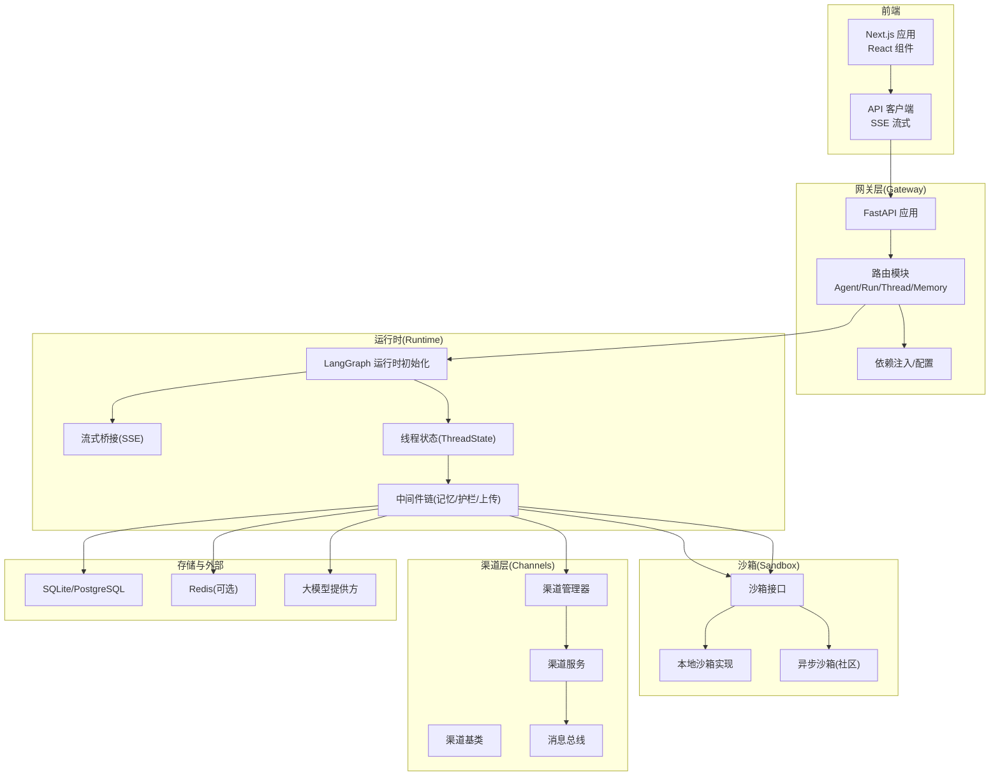
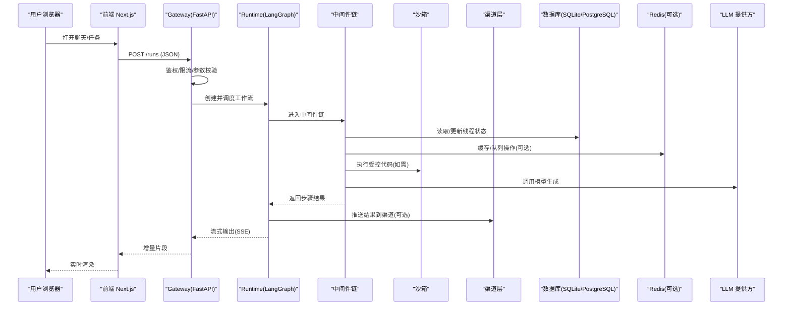
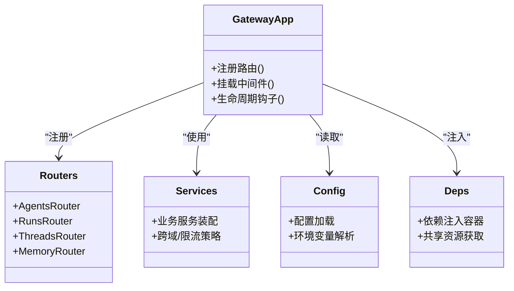
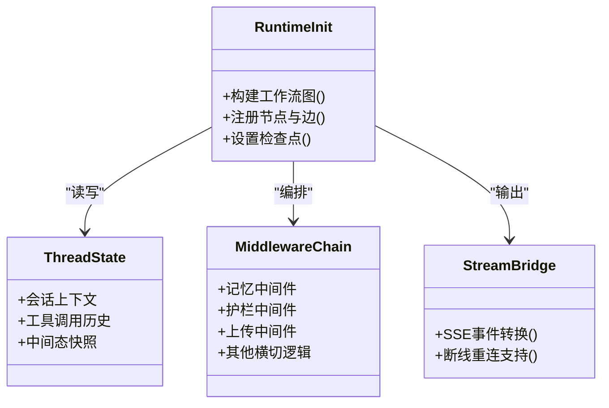
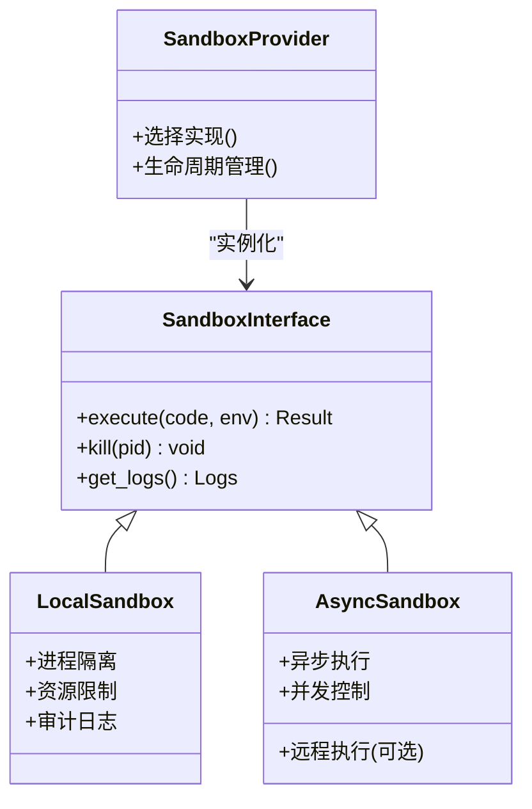
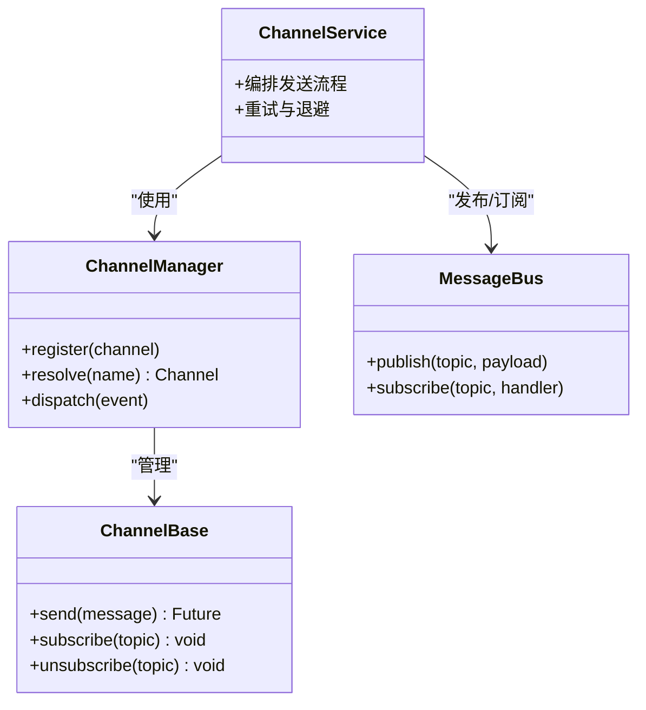
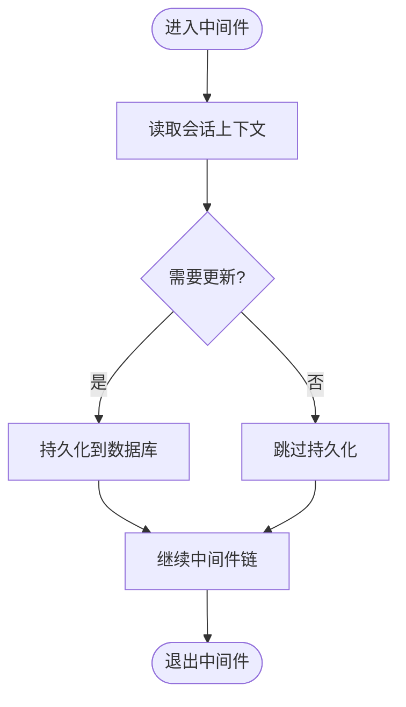
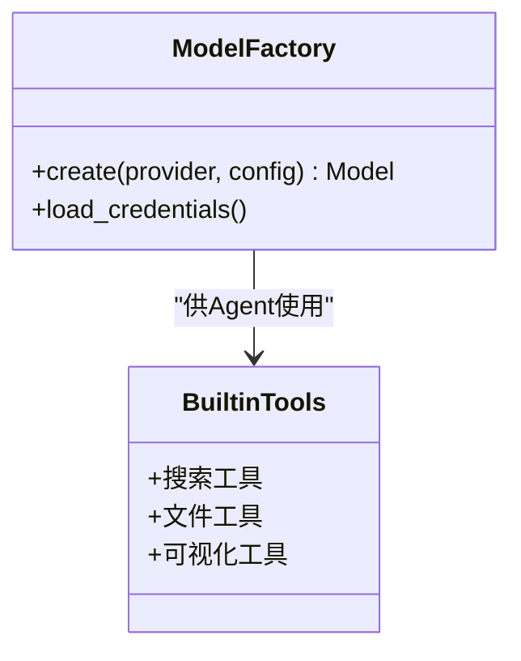
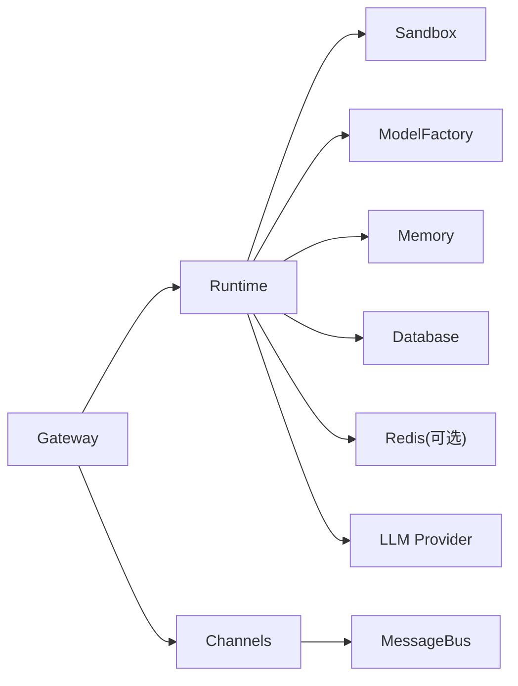
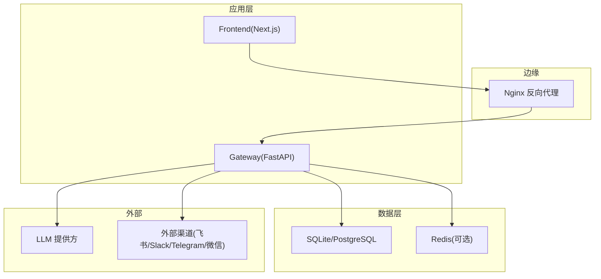

# 架构概览

<cite>
**本文引用的文件**   
- [backend/app/gateway/app.py](file://backend/app/gateway/app.py)
- [backend/app/gateway/config.py](file://backend/app/gateway/config.py)
- [backend/app/gateway/deps.py](file://backend/app/gateway/deps.py)
- [backend/app/gateway/services.py](file://backend/app/gateway/services.py)
- [backend/app/gateway/routers/agents.py](file://backend/app/gateway/routers/agents.py)
- [backend/app/gateway/routers/runs.py](file://backend/app/gateway/routers/runs.py)
- [backend/app/gateway/routers/threads.py](file://backend/app/gateway/routers/threads.py)
- [backend/app/gateway/routers/memory.py](file://backend/app/gateway/routers/memory.py)
- [backend/app/channels/base.py](file://backend/app/channels/base.py)
- [backend/app/channels/manager.py](file://backend/app/channels/manager.py)
- [backend/app/channels/service.py](file://backend/app/channels/service.py)
- [backend/app/channels/message_bus.py](file://backend/app/channels/message_bus.py)
- [backend/packages/harness/deerflow/runtime/__init__.py](file://backend/packages/harness/deerflow/runtime/__init__.py)
- [backend/packages/harness/deerflow/runtime/stream_bridge/__init__.py](file://backend/packages/harness/deerflow/runtime/stream_bridge/__init__.py)
- [backend/packages/harness/deerflow/sandbox/sandbox.py](file://backend/packages/harness/deerflow/sandbox/sandbox.py)
- [backend/packages/harness/deerflow/sandbox/sandbox_provider.py](file://backend/packages/harness/deerflow/sandbox/sandbox_provider.py)
- [backend/packages/harness/deerflow/sandbox/local/__init__.py](file://backend/packages/harness/deerflow/sandbox/local/__init__.py)
- [backend/packages/harness/deerflow/agents/thread_state.py](file://backend/packages/harness/deerflow/agents/thread_state.py)
- [backend/packages/harness/deerflow/agents/middlewares/__init__.py](file://backend/packages/harness/deerflow/agents/middlewares/__init__.py)
- [backend/packages/harness/deerflow/models/factory.py](file://backend/packages/harness/deerflow/models/factory.py)
- [backend/packages/harness/deerflow/tools/builtins/__init__.py](file://backend/packages/harness/deerflow/tools/builtins/__init__.py)
- [backend/packages/harness/deerflow/community/aio_sandbox/__init__.py](file://backend/packages/harness/deerflow/community/aio_sandbox/__init__.py)
- [docker/docker-compose.yaml](file://docker/docker-compose.yaml)
- [docker/nginx/nginx.conf](file://docker/nginx/nginx.conf)
- [frontend/src/core/api/api-client.ts](file://frontend/src/core/api/api-client.ts)
- [frontend/src/core/api/stream-mode.ts](file://frontend/src/core/api/stream-mode.ts)
- [config.example.yaml](file://config.example.yaml)
</cite>

## 目录
1. [简介](#简介)
2. [项目结构](#项目结构)
3. [核心组件](#核心组件)
4. [架构总览](#架构总览)
5. [详细组件分析](#详细组件分析)
6. [依赖关系分析](#依赖关系分析)
7. [性能考量](#性能考量)
8. [故障排查指南](#故障排查指南)
9. [结论](#结论)
10. [附录](#附录)

## 简介
本文件为 DeerFlow 项目的架构概览文档，聚焦前后端分离的微服务式分层架构与多组件协作模式。系统以 Gateway 网关层作为统一入口，承载 HTTP API、鉴权、限流与路由；后端运行时 Runtime 基于 LangGraph 编排 Agent 工作流，结合中间件实现可插拔能力（记忆、安全护栏、上传处理等）；Sandbox 沙箱提供安全的代码执行环境；Channels 渠道层将消息分发至多种外部平台；Memory 记忆系统负责会话上下文与持久化。前端采用 Next.js + React，通过 API 客户端与网关交互，支持 SSE 流式输出以提升用户体验。

## 项目结构
- 前端：Next.js 应用，包含页面、组件、状态管理与 API 客户端封装。
- 后端：FastAPI 网关 + LangGraph 运行时 + 多渠道适配 + 沙箱执行器 + 工具与模型工厂。
- 部署：Docker Compose 编排 Nginx、后端、数据库与可选缓存/队列组件。

图表来源
- [backend/app/gateway/app.py](file://backend/app/gateway/app.py)
- [backend/app/gateway/routers/agents.py](file://backend/app/gateway/routers/agents.py)
- [backend/app/gateway/routers/runs.py](file://backend/app/gateway/routers/runs.py)
- [backend/app/gateway/routers/threads.py](file://backend/app/gateway/routers/threads.py)
- [backend/app/gateway/routers/memory.py](file://backend/app/gateway/routers/memory.py)
- [backend/packages/harness/deerflow/runtime/__init__.py](file://backend/packages/harness/deerflow/runtime/__init__.py)
- [backend/packages/harness/deerflow/runtime/stream_bridge/__init__.py](file://backend/packages/harness/deerflow/runtime/stream_bridge/__init__.py)
- [backend/packages/harness/deerflow/agents/thread_state.py](file://backend/packages/harness/deerflow/agents/thread_state.py)
- [backend/packages/harness/deerflow/agents/middlewares/__init__.py](file://backend/packages/harness/deerflow/agents/middlewares/__init__.py)
- [backend/packages/harness/deerflow/sandbox/sandbox.py](file://backend/packages/harness/deerflow/sandbox/sandbox.py)
- [backend/packages/harness/deerflow/sandbox/sandbox_provider.py](file://backend/packages/harness/deerflow/sandbox/sandbox_provider.py)
- [backend/packages/harness/deerflow/sandbox/local/__init__.py](file://backend/packages/harness/deerflow/sandbox/local/__init__.py)
- [backend/packages/harness/deerflow/community/aio_sandbox/__init__.py](file://backend/packages/harness/deerflow/community/aio_sandbox/__init__.py)
- [backend/app/channels/base.py](file://backend/app/channels/base.py)
- [backend/app/channels/manager.py](file://backend/app/channels/manager.py)
- [backend/app/channels/service.py](file://backend/app/channels/service.py)
- [backend/app/channels/message_bus.py](file://backend/app/channels/message_bus.py)
- [docker/docker-compose.yaml](file://docker/docker-compose.yaml)
- [docker/nginx/nginx.conf](file://docker/nginx/nginx.conf)
- [frontend/src/core/api/api-client.ts](file://frontend/src/core/api/api-client.ts)
- [frontend/src/core/api/stream-mode.ts](file://frontend/src/core/api/stream-mode.ts)

章节来源
- [backend/app/gateway/app.py](file://backend/app/gateway/app.py)
- [backend/app/gateway/config.py](file://backend/app/gateway/config.py)
- [backend/app/gateway/deps.py](file://backend/app/gateway/deps.py)
- [backend/app/gateway/services.py](file://backend/app/gateway/services.py)
- [backend/app/gateway/routers/agents.py](file://backend/app/gateway/routers/agents.py)
- [backend/app/gateway/routers/runs.py](file://backend/app/gateway/routers/runs.py)
- [backend/app/gateway/routers/threads.py](file://backend/app/gateway/routers/threads.py)
- [backend/app/gateway/routers/memory.py](file://backend/app/gateway/routers/memory.py)
- [backend/packages/harness/deerflow/runtime/__init__.py](file://backend/packages/harness/deerflow/runtime/__init__.py)
- [backend/packages/harness/deerflow/runtime/stream_bridge/__init__.py](file://backend/packages/harness/deerflow/runtime/stream_bridge/__init__.py)
- [backend/packages/harness/deerflow/agents/thread_state.py](file://backend/packages/harness/deerflow/agents/thread_state.py)
- [backend/packages/harness/deerflow/agents/middlewares/__init__.py](file://backend/packages/harness/deerflow/agents/middlewares/__init__.py)
- [backend/packages/harness/deerflow/sandbox/sandbox.py](file://backend/packages/harness/deerflow/sandbox/sandbox.py)
- [backend/packages/harness/deerflow/sandbox/sandbox_provider.py](file://backend/packages/harness/deerflow/sandbox/sandbox_provider.py)
- [backend/packages/harness/deerflow/sandbox/local/__init__.py](file://backend/packages/harness/deerflow/sandbox/local/__init__.py)
- [backend/packages/harness/deerflow/community/aio_sandbox/__init__.py](file://backend/packages/harness/deerflow/community/aio_sandbox/__init__.py)
- [backend/app/channels/base.py](file://backend/app/channels/base.py)
- [backend/app/channels/manager.py](file://backend/app/channels/manager.py)
- [backend/app/channels/service.py](file://backend/app/channels/service.py)
- [backend/app/channels/message_bus.py](file://backend/app/channels/message_bus.py)
- [docker/docker-compose.yaml](file://docker/docker-compose.yaml)
- [docker/nginx/nginx.conf](file://docker/nginx/nginx.conf)
- [frontend/src/core/api/api-client.ts](file://frontend/src/core/api/api-client.ts)
- [frontend/src/core/api/stream-mode.ts](file://frontend/src/core/api/stream-mode.ts)

## 核心组件
- Gateway 网关层
  - 职责：统一对外暴露 REST/SSE 接口，负责请求校验、鉴权、限流、路由转发与响应格式化。
  - 关键文件：应用启动、配置加载、依赖注入、服务装配与各业务路由。
- Runtime 运行时
  - 职责：基于 LangGraph 的 Agent 工作流编排，管理线程状态、中间件链、流式输出桥接。
  - 关键文件：运行时初始化、流式桥接、线程状态、中间件注册。
- Sandbox 沙箱
  - 职责：隔离执行用户或工具产生的代码，提供本地与异步两种实现，保障安全性与可扩展性。
  - 关键文件：沙箱抽象、提供者、本地实现、异步社区实现。
- Channels 渠道层
  - 职责：将运行结果与事件推送至不同外部平台（如飞书、Slack、Telegram、微信等），并通过消息总线解耦。
  - 关键文件：渠道基类、管理器、服务、消息总线。
- Memory 记忆系统
  - 职责：维护会话上下文、历史摘要与检索增强，支撑多轮对话与长期记忆。
  - 关键文件：记忆路由与相关中间件（在网关路由与运行时中间件中体现）。
- 模型与工具
  - 职责：模型工厂统一接入多家 LLM 提供商；内置工具集提供搜索、文件处理、可视化等能力。
  - 关键文件：模型工厂、内置工具集合。

章节来源
- [backend/app/gateway/app.py](file://backend/app/gateway/app.py)
- [backend/app/gateway/config.py](file://backend/app/gateway/config.py)
- [backend/app/gateway/deps.py](file://backend/app/gateway/deps.py)
- [backend/app/gateway/services.py](file://backend/app/gateway/services.py)
- [backend/app/gateway/routers/agents.py](file://backend/app/gateway/routers/agents.py)
- [backend/app/gateway/routers/runs.py](file://backend/app/gateway/routers/runs.py)
- [backend/app/gateway/routers/threads.py](file://backend/app/gateway/routers/threads.py)
- [backend/app/gateway/routers/memory.py](file://backend/app/gateway/routers/memory.py)
- [backend/packages/harness/deerflow/runtime/__init__.py](file://backend/packages/harness/deerflow/runtime/__init__.py)
- [backend/packages/harness/deerflow/runtime/stream_bridge/__init__.py](file://backend/packages/harness/deerflow/runtime/stream_bridge/__init__.py)
- [backend/packages/harness/deerflow/agents/thread_state.py](file://backend/packages/harness/deerflow/agents/thread_state.py)
- [backend/packages/harness/deerflow/agents/middlewares/__init__.py](file://backend/packages/harness/deerflow/agents/middlewares/__init__.py)
- [backend/packages/harness/deerflow/sandbox/sandbox.py](file://backend/packages/harness/deerflow/sandbox/sandbox.py)
- [backend/packages/harness/deerflow/sandbox/sandbox_provider.py](file://backend/packages/harness/deerflow/sandbox/sandbox_provider.py)
- [backend/packages/harness/deerflow/sandbox/local/__init__.py](file://backend/packages/harness/deerflow/sandbox/local/__init__.py)
- [backend/packages/harness/deerflow/community/aio_sandbox/__init__.py](file://backend/packages/harness/deerflow/community/aio_sandbox/__init__.py)
- [backend/app/channels/base.py](file://backend/app/channels/base.py)
- [backend/app/channels/manager.py](file://backend/app/channels/manager.py)
- [backend/app/channels/service.py](file://backend/app/channels/service.py)
- [backend/app/channels/message_bus.py](file://backend/app/channels/message_bus.py)
- [backend/packages/harness/deerflow/models/factory.py](file://backend/packages/harness/deerflow/models/factory.py)
- [backend/packages/harness/deerflow/tools/builtins/__init__.py](file://backend/packages/harness/deerflow/tools/builtins/__init__.py)

## 架构总览
整体采用“前端 + 网关 + 运行时 + 沙箱 + 渠道 + 存储”的分层微服务模式。前端通过 API 客户端发起请求，网关进行鉴权与路由后交由运行时编排 Agent 工作流；运行时通过中间件链完成记忆、安全、上传等横切关注点；必要时调用沙箱执行代码，或通过渠道发送结果；数据持久化到 SQLite/PostgreSQL，可选 Redis 用于缓存与消息队列。

图表来源
- [backend/app/gateway/routers/runs.py](file://backend/app/gateway/routers/runs.py)
- [backend/packages/harness/deerflow/runtime/stream_bridge/__init__.py](file://backend/packages/harness/deerflow/runtime/stream_bridge/__init__.py)
- [backend/packages/harness/deerflow/agents/middlewares/__init__.py](file://backend/packages/harness/deerflow/agents/middlewares/__init__.py)
- [backend/packages/harness/deerflow/sandbox/sandbox.py](file://backend/packages/harness/deerflow/sandbox/sandbox.py)
- [backend/app/channels/service.py](file://backend/app/channels/service.py)
- [frontend/src/core/api/api-client.ts](file://frontend/src/core/api/api-client.ts)
- [frontend/src/core/api/stream-mode.ts](file://frontend/src/core/api/stream-mode.ts)

## 详细组件分析

### Gateway 网关层
- 职责与边界
  - 统一入口：聚合所有业务路由，屏蔽内部复杂度。
  - 非功能能力：鉴权、限流、日志、错误码标准化、CORS 与静态资源代理。
- 关键实现要点
  - 应用装配：集中注册路由、中间件、生命周期钩子。
  - 配置与依赖：从配置文件与环境变量加载，使用依赖注入贯穿各路由与服务。
  - 路由组织：按领域划分（Agent、Run、Thread、Memory、Artifacts、Uploads 等）。
- 扩展点
  - 新增路由：在对应路由文件中定义端点，并在应用装配中注册。
  - 中间件：在全局或路由级挂载，实现横切逻辑。

图表来源
- [backend/app/gateway/app.py](file://backend/app/gateway/app.py)
- [backend/app/gateway/config.py](file://backend/app/gateway/config.py)
- [backend/app/gateway/deps.py](file://backend/app/gateway/deps.py)
- [backend/app/gateway/services.py](file://backend/app/gateway/services.py)
- [backend/app/gateway/routers/agents.py](file://backend/app/gateway/routers/agents.py)
- [backend/app/gateway/routers/runs.py](file://backend/app/gateway/routers/runs.py)
- [backend/app/gateway/routers/threads.py](file://backend/app/gateway/routers/threads.py)
- [backend/app/gateway/routers/memory.py](file://backend/app/gateway/routers/memory.py)

章节来源
- [backend/app/gateway/app.py](file://backend/app/gateway/app.py)
- [backend/app/gateway/config.py](file://backend/app/gateway/config.py)
- [backend/app/gateway/deps.py](file://backend/app/gateway/deps.py)
- [backend/app/gateway/services.py](file://backend/app/gateway/services.py)
- [backend/app/gateway/routers/agents.py](file://backend/app/gateway/routers/agents.py)
- [backend/app/gateway/routers/runs.py](file://backend/app/gateway/routers/runs.py)
- [backend/app/gateway/routers/threads.py](file://backend/app/gateway/routers/threads.py)
- [backend/app/gateway/routers/memory.py](file://backend/app/gateway/routers/memory.py)

### Runtime 运行时
- 职责与边界
  - 编排 Agent 工作流：基于 LangGraph 的状态机驱动，支持多步推理与工具调用。
  - 中间件链：记忆、安全护栏、上传处理、标题生成、循环检测等。
  - 流式输出：通过 SSE 将逐步结果推送到前端。
- 关键实现要点
  - 运行时初始化：构建图、注册节点与边、设置检查点。
  - 线程状态：维护会话上下文、工具调用历史、中间态快照。
  - 流式桥接：将后端事件转换为前端可读的流式片段。
- 扩展点
  - 新增中间件：遵循中间件契约，插入到链中。
  - 自定义节点：在工作流图中添加新节点，实现特定业务逻辑。

图表来源
- [backend/packages/harness/deerflow/runtime/__init__.py](file://backend/packages/harness/deerflow/runtime/__init__.py)
- [backend/packages/harness/deerflow/runtime/stream_bridge/__init__.py](file://backend/packages/harness/deerflow/runtime/stream_bridge/__init__.py)
- [backend/packages/harness/deerflow/agents/thread_state.py](file://backend/packages/harness/deerflow/agents/thread_state.py)
- [backend/packages/harness/deerflow/agents/middlewares/__init__.py](file://backend/packages/harness/deerflow/agents/middlewares/__init__.py)

章节来源
- [backend/packages/harness/deerflow/runtime/__init__.py](file://backend/packages/harness/deerflow/runtime/__init__.py)
- [backend/packages/harness/deerflow/runtime/stream_bridge/__init__.py](file://backend/packages/harness/deerflow/runtime/stream_bridge/__init__.py)
- [backend/packages/harness/deerflow/agents/thread_state.py](file://backend/packages/harness/deerflow/agents/thread_state.py)
- [backend/packages/harness/deerflow/agents/middlewares/__init__.py](file://backend/packages/harness/deerflow/agents/middlewares/__init__.py)

### Sandbox 沙箱
- 职责与边界
  - 安全执行：隔离用户或工具生成的代码，限制系统调用与网络访问。
  - 多实现：本地沙箱与异步沙箱（社区）并存，通过提供者选择具体实现。
- 关键实现要点
  - 抽象接口：统一的执行接口与结果协议。
  - 提供者模式：根据配置动态选择本地或异步实现。
  - 资源控制：超时、内存、CPU 限制与审计日志。
- 扩展点
  - 新增沙箱实现：实现抽象接口并注册到提供者。
  - 安全策略：调整资源限制与白名单规则。

图表来源
- [backend/packages/harness/deerflow/sandbox/sandbox.py](file://backend/packages/harness/deerflow/sandbox/sandbox.py)
- [backend/packages/harness/deerflow/sandbox/sandbox_provider.py](file://backend/packages/harness/deerflow/sandbox/sandbox_provider.py)
- [backend/packages/harness/deerflow/sandbox/local/__init__.py](file://backend/packages/harness/deerflow/sandbox/local/__init__.py)
- [backend/packages/harness/deerflow/community/aio_sandbox/__init__.py](file://backend/packages/harness/deerflow/community/aio_sandbox/__init__.py)

章节来源
- [backend/packages/harness/deerflow/sandbox/sandbox.py](file://backend/packages/harness/deerflow/sandbox/sandbox.py)
- [backend/packages/harness/deerflow/sandbox/sandbox_provider.py](file://backend/packages/harness/deerflow/sandbox/sandbox_provider.py)
- [backend/packages/harness/deerflow/sandbox/local/__init__.py](file://backend/packages/harness/deerflow/sandbox/local/__init__.py)
- [backend/packages/harness/deerflow/community/aio_sandbox/__init__.py](file://backend/packages/harness/deerflow/community/aio_sandbox/__init__.py)

### Channels 渠道层
- 职责与边界
  - 多平台推送：将运行结果与事件发送到飞书、Slack、Telegram、微信等平台。
  - 解耦设计：通过消息总线与渠道管理器协调，避免强耦合。
- 关键实现要点
  - 渠道基类：统一消息格式与生命周期。
  - 管理器：注册、发现与调度渠道实例。
  - 服务：编排发送流程与重试策略。
  - 消息总线：异步解耦生产与消费。
- 扩展点
  - 新增渠道：实现基类并注册到管理器。
  - 自定义总线：替换底层消息队列实现。

图表来源
- [backend/app/channels/base.py](file://backend/app/channels/base.py)
- [backend/app/channels/manager.py](file://backend/app/channels/manager.py)
- [backend/app/channels/service.py](file://backend/app/channels/service.py)
- [backend/app/channels/message_bus.py](file://backend/app/channels/message_bus.py)

章节来源
- [backend/app/channels/base.py](file://backend/app/channels/base.py)
- [backend/app/channels/manager.py](file://backend/app/channels/manager.py)
- [backend/app/channels/service.py](file://backend/app/channels/service.py)
- [backend/app/channels/message_bus.py](file://backend/app/channels/message_bus.py)

### Memory 记忆系统
- 职责与边界
  - 会话上下文：维护多轮对话的历史、摘要与检索增强。
  - 持久化：将关键状态写入数据库，支持查询与回溯。
- 关键实现要点
  - 记忆路由：提供增删改查接口。
  - 中间件集成：在运行时中间件链中读写上下文。
- 扩展点
  - 自定义存储：替换底层存储实现。
  - 检索策略：引入向量检索或知识图谱。

图表来源
- [backend/app/gateway/routers/memory.py](file://backend/app/gateway/routers/memory.py)
- [backend/packages/harness/deerflow/agents/middlewares/__init__.py](file://backend/packages/harness/deerflow/agents/middlewares/__init__.py)

章节来源
- [backend/app/gateway/routers/memory.py](file://backend/app/gateway/routers/memory.py)
- [backend/packages/harness/deerflow/agents/middlewares/__init__.py](file://backend/packages/harness/deerflow/agents/middlewares/__init__.py)

### 模型与工具
- 模型工厂
  - 统一接入多家 LLM 提供商，支持凭据加载与 OAuth。
- 内置工具
  - 提供搜索、文件处理、可视化等常用能力，便于 Agent 调用。

图表来源
- [backend/packages/harness/deerflow/models/factory.py](file://backend/packages/harness/deerflow/models/factory.py)
- [backend/packages/harness/deerflow/tools/builtins/__init__.py](file://backend/packages/harness/deerflow/tools/builtins/__init__.py)

章节来源
- [backend/packages/harness/deerflow/models/factory.py](file://backend/packages/harness/deerflow/models/factory.py)
- [backend/packages/harness/deerflow/tools/builtins/__init__.py](file://backend/packages/harness/deerflow/tools/builtins/__init__.py)

## 依赖关系分析
- 组件耦合
  - Gateway 对运行时与渠道层存在弱耦合，通过依赖注入与接口抽象降低内聚度。
  - 运行时对沙箱与模型工厂依赖明确，中间件链进一步解耦横切逻辑。
- 外部依赖
  - 数据库：SQLite/PostgreSQL 用于持久化。
  - Redis：可选，用于缓存与消息队列。
  - LLM 提供方：通过工厂按需接入。
- 潜在循环依赖
  - 通过依赖注入与接口抽象避免直接循环引用。

图表来源
- [backend/app/gateway/app.py](file://backend/app/gateway/app.py)
- [backend/packages/harness/deerflow/runtime/__init__.py](file://backend/packages/harness/deerflow/runtime/__init__.py)
- [backend/app/channels/message_bus.py](file://backend/app/channels/message_bus.py)
- [backend/packages/harness/deerflow/models/factory.py](file://backend/packages/harness/deerflow/models/factory.py)

章节来源
- [backend/app/gateway/app.py](file://backend/app/gateway/app.py)
- [backend/packages/harness/deerflow/runtime/__init__.py](file://backend/packages/harness/deerflow/runtime/__init__.py)
- [backend/app/channels/message_bus.py](file://backend/app/channels/message_bus.py)
- [backend/packages/harness/deerflow/models/factory.py](file://backend/packages/harness/deerflow/models/factory.py)

## 性能考量
- 流式输出：SSE 提升首字节延迟与用户体验，适合长时任务。
- 异步执行：沙箱与渠道层支持异步，提高吞吐。
- 缓存与队列：Redis 用于热点数据缓存与任务削峰。
- 资源限制：沙箱对 CPU/内存/超时进行限制，防止资源耗尽。
- 水平扩展：网关与运行时无状态化，可通过副本扩容；数据库与缓存独立扩展。

## 故障排查指南
- 常见问题定位
  - 网关层：检查路由注册、鉴权失败、限流触发。
  - 运行时：查看中间件日志、工作流节点执行顺序、检查点一致性。
  - 沙箱：确认资源限制、进程存活、审计日志。
  - 渠道：验证凭据、网络连通、重试策略。
  - 存储：连接池、索引、慢查询。
- 建议手段
  - 启用结构化日志与追踪（如 OpenTelemetry/Langfuse）。
  - 增加健康检查端点与指标上报。
  - 针对关键路径编写端到端测试与混沌演练。

## 结论
DeerFlow 采用清晰的分层与模块化设计，通过 Gateway 统一入口、Runtime 编排工作流、Sandbox 安全执行、Channels 多平台推送与 Memory 上下文管理，形成高内聚、低耦合的可扩展架构。技术选型兼顾开发效率与运行性能，配合 Docker Compose 简化部署，具备良好演进空间。

## 附录

### 部署拓扑图

图表来源
- [docker/docker-compose.yaml](file://docker/docker-compose.yaml)
- [docker/nginx/nginx.conf](file://docker/nginx/nginx.conf)

### 技术栈选型与权衡
- Python FastAPI + LangGraph
  - 优势：高性能异步框架、生态丰富、LangGraph 提供强大的工作流编排能力。
  - 权衡：需关注 GIL 与并发模型，合理拆分 I/O 密集与 CPU 密集任务。
- Next.js + React
  - 优势：SSR/CSR 灵活、组件生态完善、前端工程化成熟。
  - 权衡：构建产物体积与首屏优化需持续关注。
- SQLite/PostgreSQL
  - 优势：SQLite 轻量易部署，PostgreSQL 企业级特性完备。
  - 权衡：根据规模选择合适引擎，注意迁移与备份策略。
- Redis
  - 优势：高性能缓存与消息队列，支持复杂数据结构。
  - 权衡：引入额外运维成本，需监控内存与持久化。

### 配置示例与扩展点
- 全局配置
  - 参考配置样例，涵盖数据库、缓存、模型、沙箱、渠道等选项。
- 扩展点
  - 新增渠道：实现基类并注册。
  - 新增沙箱：实现接口并选择提供者。
  - 新增中间件：遵循契约并插入链中。
  - 新增模型：在工厂中注册提供商。

章节来源
- [config.example.yaml](file://config.example.yaml)
- [backend/app/channels/base.py](file://backend/app/channels/base.py)
- [backend/packages/harness/deerflow/sandbox/sandbox.py](file://backend/packages/harness/deerflow/sandbox/sandbox.py)
- [backend/packages/harness/deerflow/agents/middlewares/__init__.py](file://backend/packages/harness/deerflow/agents/middlewares/__init__.py)
- [backend/packages/harness/deerflow/models/factory.py](file://backend/packages/harness/deerflow/models/factory.py)