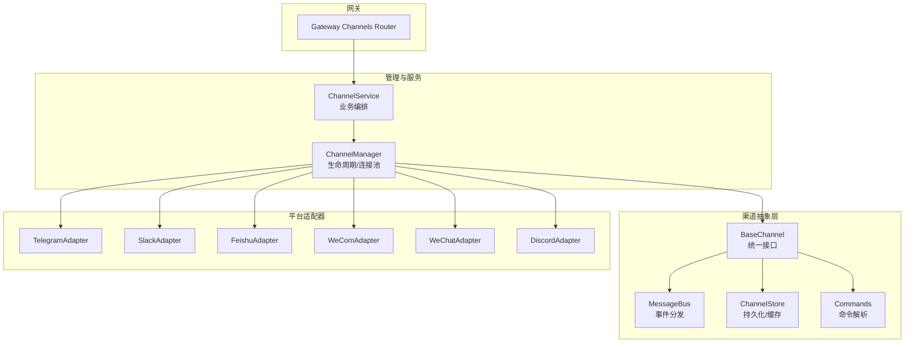
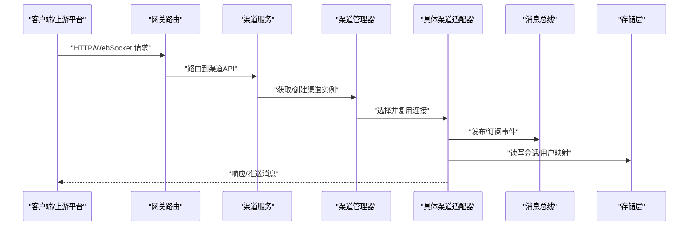
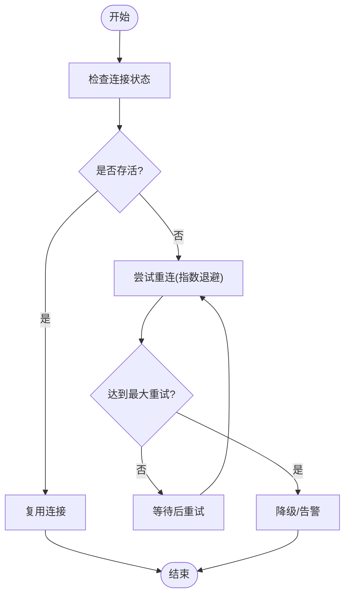
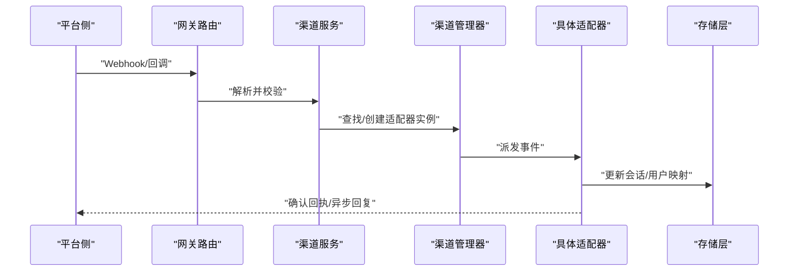
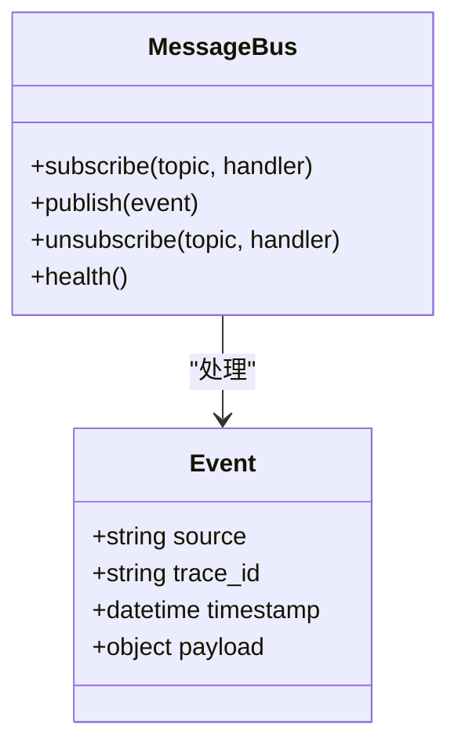
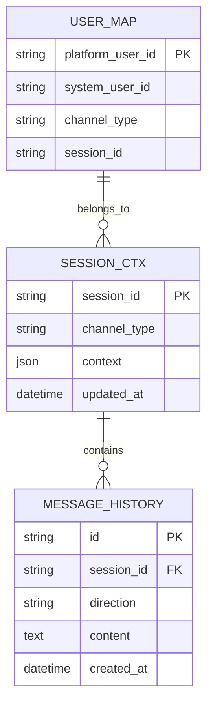
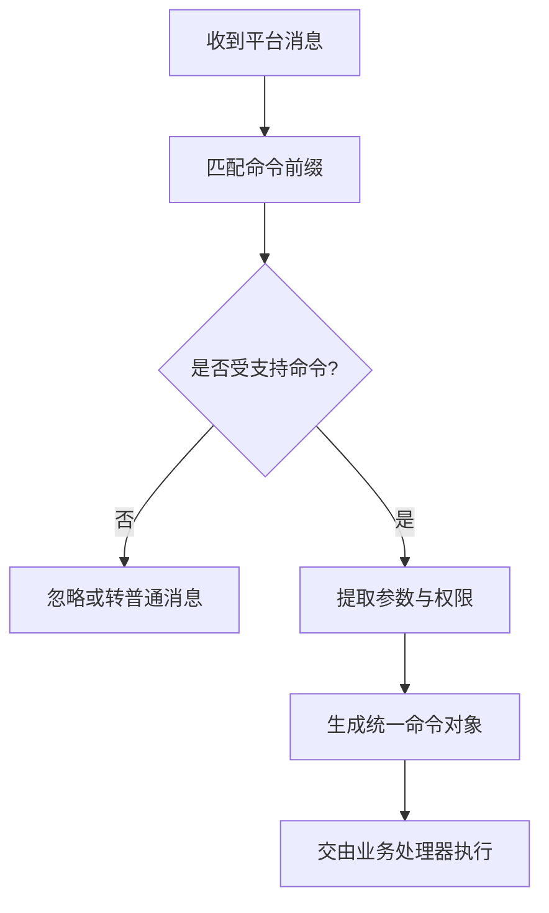
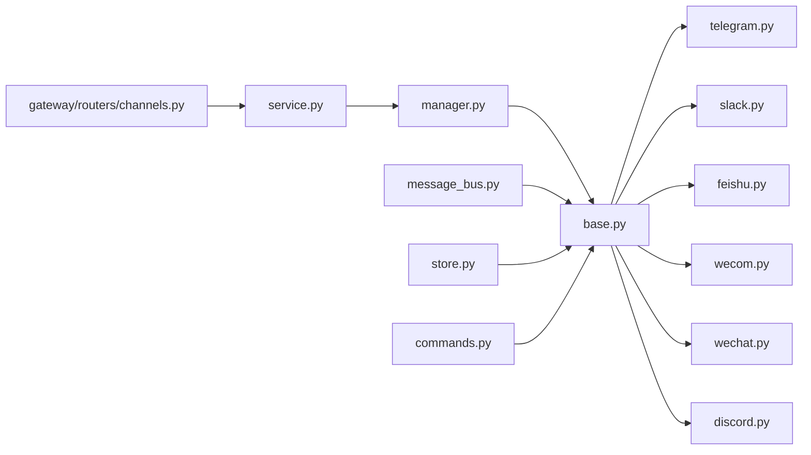

# 渠道组件

<cite>
**本文引用的文件**   
- [backend/app/channels/base.py](file://backend/app/channels/base.py)
- [backend/app/channels/manager.py](file://backend/app/channels/manager.py)
- [backend/app/channels/service.py](file://backend/app/channels/service.py)
- [backend/app/channels/message_bus.py](file://backend/app/channels/message_bus.py)
- [backend/app/channels/store.py](file://backend/app/channels/store.py)
- [backend/app/channels/commands.py](file://backend/app/channels/commands.py)
- [backend/app/channels/telegram.py](file://backend/app/channels/telegram.py)
- [backend/app/channels/slack.py](file://backend/app/channels/slack.py)
- [backend/app/channels/feishu.py](file://backend/app/channels/feishu.py)
- [backend/app/channels/wecom.py](file://backend/app/channels/wecom.py)
- [backend/app/channels/wechat.py](file://backend/app/channels/wechat.py)
- [backend/app/channels/discord.py](file://backend/app/channels/discord.py)
- [backend/app/gateway/routers/channels.py](file://backend/app/gateway/routers/channels.py)
- [backend/tests/test_channels.py](file://backend/tests/test_channels.py)
- [backend/tests/test_discord_channel.py](file://backend/tests/test_discord_channel.py)
- [backend/tests/test_wechat_channel.py](file://backend/tests/test_wechat_channel.py)
</cite>

## 目录
1. [简介](#简介)
2. [项目结构](#项目结构)
3. [核心组件](#核心组件)
4. [架构总览](#架构总览)
5. [详细组件分析](#详细组件分析)
6. [依赖关系分析](#依赖关系分析)
7. [性能考量](#性能考量)
8. [故障排查指南](#故障排查指南)
9. [结论](#结论)
10. [附录](#附录)

## 简介
本文件面向 DeerFlow 的“多渠道集成”子系统，聚焦于 channels 模块的设计与实现。文档围绕以下目标展开：
- 渠道抽象层设计：统一消息协议、连接管理、事件分发机制
- 平台适配：Telegram Bot、Slack App、飞书机器人、微信企业号（WeCom）的具体实现要点
- 连接池管理：连接复用、心跳检测、自动重连策略
- 消息路由：用户识别、会话绑定、消息转发规则
- 新渠道开发指南、配置示例与调试方法
- 性能监控与故障排查建议

## 项目结构
channels 子系统的代码位于 backend/app/channels 目录下，采用“抽象基类 + 具体适配器 + 管理器 + 服务层 + 消息总线 + 存储”的分层组织方式；同时提供网关路由以暴露对外 API。

图表来源
- [backend/app/channels/base.py](file://backend/app/channels/base.py)
- [backend/app/channels/manager.py](file://backend/app/channels/manager.py)
- [backend/app/channels/service.py](file://backend/app/channels/service.py)
- [backend/app/channels/message_bus.py](file://backend/app/channels/message_bus.py)
- [backend/app/channels/store.py](file://backend/app/channels/store.py)
- [backend/app/channels/commands.py](file://backend/app/channels/commands.py)
- [backend/app/channels/telegram.py](file://backend/app/channels/telegram.py)
- [backend/app/channels/slack.py](file://backend/app/channels/slack.py)
- [backend/app/channels/feishu.py](file://backend/app/channels/feishu.py)
- [backend/app/channels/wecom.py](file://backend/app/channels/wecom.py)
- [backend/app/channels/wechat.py](file://backend/app/channels/wechat.py)
- [backend/app/channels/discord.py](file://backend/app/channels/discord.py)
- [backend/app/gateway/routers/channels.py](file://backend/app/gateway/routers/channels.py)

章节来源
- [backend/app/channels/base.py](file://backend/app/channels/base.py)
- [backend/app/channels/manager.py](file://backend/app/channels/manager.py)
- [backend/app/channels/service.py](file://backend/app/channels/service.py)
- [backend/app/channels/message_bus.py](file://backend/app/channels/message_bus.py)
- [backend/app/channels/store.py](file://backend/app/channels/store.py)
- [backend/app/channels/commands.py](file://backend/app/channels/commands.py)
- [backend/app/channels/telegram.py](file://backend/app/channels/telegram.py)
- [backend/app/channels/slack.py](file://backend/app/channels/slack.py)
- [backend/app/channels/feishu.py](file://backend/app/channels/feishu.py)
- [backend/app/channels/wecom.py](file://backend/app/channels/wecom.py)
- [backend/app/channels/wechat.py](file://backend/app/channels/wechat.py)
- [backend/app/channels/discord.py](file://backend/app/channels/discord.py)
- [backend/app/gateway/routers/channels.py](file://backend/app/gateway/routers/channels.py)

## 核心组件
- 统一接口与抽象基类：定义所有渠道必须实现的发送、接收、鉴权、健康检查等能力，屏蔽底层差异。
- 通道管理器：负责渠道实例的注册、启动、停止、连接池维护、心跳与重连策略。
- 服务层：编排上层业务逻辑，将来自网关的请求转换为渠道可理解的消息并调度到对应适配器。
- 消息总线：在渠道内部或跨渠道进行事件分发，解耦消息生产与消费。
- 存储层：用于会话状态、用户映射、消息历史等数据的持久化与缓存。
- 命令解析：对平台特定命令进行标准化解析，便于统一处理。

章节来源
- [backend/app/channels/base.py](file://backend/app/channels/base.py)
- [backend/app/channels/manager.py](file://backend/app/channels/manager.py)
- [backend/app/channels/service.py](file://backend/app/channels/service.py)
- [backend/app/channels/message_bus.py](file://backend/app/channels/message_bus.py)
- [backend/app/channels/store.py](file://backend/app/channels/store.py)
- [backend/app/channels/commands.py](file://backend/app/channels/commands.py)

## 架构总览
下图展示了从网关到渠道适配器的整体调用链路与数据流。

图表来源
- [backend/app/gateway/routers/channels.py](file://backend/app/gateway/routers/channels.py)
- [backend/app/channels/service.py](file://backend/app/channels/service.py)
- [backend/app/channels/manager.py](file://backend/app/channels/manager.py)
- [backend/app/channels/base.py](file://backend/app/channels/base.py)
- [backend/app/channels/message_bus.py](file://backend/app/channels/message_bus.py)
- [backend/app/channels/store.py](file://backend/app/channels/store.py)

## 详细组件分析

### 抽象基类与统一协议
- 职责
  - 定义统一的发送/接收接口、鉴权与配置加载、健康检查、错误码规范。
  - 提供通用工具：消息格式转换、附件处理、重试封装。
- 关键设计点
  - 统一消息模型：包含发送者标识、会话ID、内容类型、时间戳、扩展字段等。
  - 连接抽象：支持长连接/短轮询两种模式，由具体适配器决定。
  - 事件模型：定义标准事件类型（如 on_message、on_error、on_heartbeat）。
- 复杂度与扩展性
  - 新增渠道只需实现最小接口集，复用基类能力，降低重复代码。

章节来源
- [backend/app/channels/base.py](file://backend/app/channels/base.py)

### 渠道管理器与连接池
- 职责
  - 渠道实例的注册、发现、生命周期管理。
  - 连接池：按渠道类型+租户/应用维度复用连接，避免频繁握手。
  - 心跳检测：周期性探测连接存活，触发告警与恢复流程。
  - 自动重连：指数退避、最大重试次数、熔断降级。
- 关键设计点
  - 连接键：channel_type + app_id + user_scope 作为唯一键。
  - 健康探针：基于 ping/pong 或平台心跳回调。
  - 资源回收：空闲超时、内存上限、优雅关闭。
- 流程图（自动重连）

图表来源
- [backend/app/channels/manager.py](file://backend/app/channels/manager.py)

章节来源
- [backend/app/channels/manager.py](file://backend/app/channels/manager.py)

### 服务层与消息路由
- 职责
  - 将网关请求转换为渠道消息，完成鉴权、限流、审计。
  - 用户识别与会话绑定：根据平台用户ID映射到系统用户，维持会话上下文。
  - 消息转发规则：按渠道能力选择文本、富文本、卡片、附件等输出格式。
- 关键设计点
  - 路由表：platform -> adapter_class，支持动态注册。
  - 会话绑定：thread_id 与 platform_session_id 的映射关系。
  - 幂等与去重：基于消息指纹避免重复处理。
- 序列图（消息入站）

图表来源
- [backend/app/gateway/routers/channels.py](file://backend/app/gateway/routers/channels.py)
- [backend/app/channels/service.py](file://backend/app/channels/service.py)
- [backend/app/channels/manager.py](file://backend/app/channels/manager.py)
- [backend/app/channels/base.py](file://backend/app/channels/base.py)
- [backend/app/channels/store.py](file://backend/app/channels/store.py)

章节来源
- [backend/app/channels/service.py](file://backend/app/channels/service.py)
- [backend/app/channels/manager.py](file://backend/app/channels/manager.py)
- [backend/app/channels/base.py](file://backend/app/channels/base.py)
- [backend/app/channels/store.py](file://backend/app/channels/store.py)

### 消息总线与事件分发
- 职责
  - 在适配器内部或跨适配器之间传递事件，解耦消息生产与消费。
  - 支持同步/异步订阅、优先级队列、失败重试。
- 关键设计点
  - 主题命名空间：按 channel_type 隔离。
  - 事件模型：统一事件头（source、trace_id、timestamp、payload）。
  - 背压控制：当消费者慢时进行缓冲与丢弃策略。
- 类图（事件模型）

图表来源
- [backend/app/channels/message_bus.py](file://backend/app/channels/message_bus.py)

章节来源
- [backend/app/channels/message_bus.py](file://backend/app/channels/message_bus.py)

### 存储层与会话/用户映射
- 职责
  - 持久化会话上下文、用户映射、消息历史、配置快照。
  - 提供缓存加速读取，支持一致性保障。
- 关键设计点
  - 键空间：user_map、session_ctx、message_history、channel_config。
  - TTL 与清理：会话过期、历史归档。
  - 事务与锁：并发写入保护。
- ER 图（概念）

图表来源
- [backend/app/channels/store.py](file://backend/app/channels/store.py)

章节来源
- [backend/app/channels/store.py](file://backend/app/channels/store.py)

### 命令解析
- 职责
  - 将平台特定的命令语法（如 /help、/status）解析为统一命令对象。
  - 提供权限校验与参数提取。
- 关键设计点
  - 命令注册表：按渠道扩展命令集合。
  - 安全边界：白名单命令、敏感操作二次确认。
- 流程图（命令解析）

图表来源
- [backend/app/channels/commands.py](file://backend/app/channels/commands.py)

章节来源
- [backend/app/channels/commands.py](file://backend/app/channels/commands.py)

### 平台适配器实现要点

#### Telegram Bot
- 接入方式：Bot Token、Webhook 或 Long Polling。
- 特性：支持 Markdown/HTML 渲染、内联键盘、文件上传。
- 注意事项：速率限制、群组/私聊区分、命令与回调查询处理。

章节来源
- [backend/app/channels/telegram.py](file://backend/app/channels/telegram.py)

#### Slack App
- 接入方式：OAuth、App Manifest、Event Subscriptions。
- 特性：Block Kit 富文本、Slash Commands、Actions。
- 注意事项：事件签名验证、线程消息、图片/文件上传配额。

章节来源
- [backend/app/channels/slack.py](file://backend/app/channels/slack.py)

#### 飞书机器人
- 接入方式：事件订阅、机器人 Token。
- 特性：富文本卡片、消息卡片交互、群聊/单聊。
- 注意事项：事件去重、消息版本兼容、附件大小限制。

章节来源
- [backend/app/channels/feishu.py](file://backend/app/channels/feishu.py)

#### 微信企业号（WeCom）
- 接入方式：企业自建应用、Token/AESKey 配置。
- 特性：文本/图片/文件/模板消息、部门/成员映射。
- 注意事项：回调解密、消息去重、频率限制。

章节来源
- [backend/app/channels/wecom.py](file://backend/app/channels/wecom.py)

#### 微信（WeChat）
- 接入方式：公众号/小程序/开放平台（视具体实现）。
- 特性：模板消息、客服消息、素材管理。
- 注意事项：签名校验、消息加密、灰度发布。

章节来源
- [backend/app/channels/wechat.py](file://backend/app/channels/wechat.py)

#### Discord（参考实现）
- 接入方式：Bot Token、Gateway 事件。
- 特性：Embed、组件、文件附件。
- 注意事项：Gateway 重连、大群消息节流。

章节来源
- [backend/app/channels/discord.py](file://backend/app/channels/discord.py)

## 依赖关系分析
- 耦合与内聚
  - 适配器仅依赖抽象基类与公共工具，保持高内聚低耦合。
  - 管理器集中管理连接与生命周期，服务层编排业务。
- 外部依赖
  - 各平台 SDK/HTTP 客户端、消息队列/存储后端（由 store 抽象）。
- 潜在循环依赖
  - 通过消息总线与服务层解耦，避免适配器直接反向依赖服务。

图表来源
- [backend/app/channels/base.py](file://backend/app/channels/base.py)
- [backend/app/channels/manager.py](file://backend/app/channels/manager.py)
- [backend/app/channels/service.py](file://backend/app/channels/service.py)
- [backend/app/channels/message_bus.py](file://backend/app/channels/message_bus.py)
- [backend/app/channels/store.py](file://backend/app/channels/store.py)
- [backend/app/channels/commands.py](file://backend/app/channels/commands.py)
- [backend/app/channels/telegram.py](file://backend/app/channels/telegram.py)
- [backend/app/channels/slack.py](file://backend/app/channels/slack.py)
- [backend/app/channels/feishu.py](file://backend/app/channels/feishu.py)
- [backend/app/channels/wecom.py](file://backend/app/channels/wecom.py)
- [backend/app/channels/wechat.py](file://backend/app/channels/wechat.py)
- [backend/app/channels/discord.py](file://backend/app/channels/discord.py)
- [backend/app/gateway/routers/channels.py](file://backend/app/gateway/routers/channels.py)

章节来源
- [backend/app/channels/base.py](file://backend/app/channels/base.py)
- [backend/app/channels/manager.py](file://backend/app/channels/manager.py)
- [backend/app/channels/service.py](file://backend/app/channels/service.py)
- [backend/app/channels/message_bus.py](file://backend/app/channels/message_bus.py)
- [backend/app/channels/store.py](file://backend/app/channels/store.py)
- [backend/app/channels/commands.py](file://backend/app/channels/commands.py)
- [backend/app/channels/telegram.py](file://backend/app/channels/telegram.py)
- [backend/app/channels/slack.py](file://backend/app/channels/slack.py)
- [backend/app/channels/feishu.py](file://backend/app/channels/feishu.py)
- [backend/app/channels/wecom.py](file://backend/app/channels/wecom.py)
- [backend/app/channels/wechat.py](file://backend/app/channels/wechat.py)
- [backend/app/channels/discord.py](file://backend/app/channels/discord.py)
- [backend/app/gateway/routers/channels.py](file://backend/app/gateway/routers/channels.py)

## 性能考量
- 连接复用
  - 按 channel_type + app_id + scope 复用连接，减少握手开销。
- 心跳与保活
  - 定期心跳探测，结合平台侧 keepalive，降低僵尸连接。
- 自动重连
  - 指数退避 + 抖动，避免雪崩；设置最大重试与熔断阈值。
- 背压与限流
  - 消息总线队列容量限制，消费者慢时主动丢弃或延迟。
- I/O 优化
  - 批量发送、压缩传输、异步非阻塞处理。
- 存储层
  - 热点会话缓存、历史消息分页与归档。

[本节为通用指导，不直接分析具体文件]

## 故障排查指南
- 常见问题定位
  - 连接异常：查看心跳日志、重连计数、平台侧限流提示。
  - 消息丢失：核对消息总线消费位点、存储写入成功标志。
  - 鉴权失败：检查 Token/AESKey、签名校验、回调 URL 可达性。
  - 会话错乱：确认用户映射键空间与 thread_id 绑定是否正确。
- 诊断手段
  - 启用调试日志与追踪 ID，关联上下游请求。
  - 使用单元测试覆盖关键路径（见测试用例）。
- 相关测试
  - 渠道通用行为、Discord 渠道、微信渠道等。

章节来源
- [backend/tests/test_channels.py](file://backend/tests/test_channels.py)
- [backend/tests/test_discord_channel.py](file://backend/tests/test_discord_channel.py)
- [backend/tests/test_wechat_channel.py](file://backend/tests/test_wechat_channel.py)

## 结论
DeerFlow 的渠道子系统通过清晰的抽象层、稳定的连接管理与灵活的事件分发，实现了多平台的高效集成。遵循统一协议与最佳实践，开发者可以快速扩展新的渠道并保持系统稳定与高性能。

[本节为总结，不直接分析具体文件]

## 附录

### 新渠道开发指南
- 步骤
  1. 继承抽象基类，实现必要接口（发送、接收、鉴权、健康检查）。
  2. 在管理器中注册新渠道类型，配置连接池参数。
  3. 如需命令支持，扩展命令解析器。
  4. 编写单元测试，覆盖正常与异常路径。
- 关键点
  - 严格遵循统一消息模型与事件模型。
  - 注意平台速率限制与错误码映射。
  - 做好连接保活与重连策略。

[本节为通用指导，不直接分析具体文件]

### 配置示例（说明性）
- 渠道基础配置
  - channel_type、app_id、scope、token/密钥、webhook_url、reconnect_policy、heartbeat_interval。
- 连接池配置
  - max_connections、idle_timeout、retry_max、backoff_base、circuit_breaker_threshold。
- 存储配置
  - backend_type、connection_string、ttl、archive_policy。

[本节为通用指导，不直接分析具体文件]

### 调试方法
- 本地调试
  - 开启调试日志、打印消息体摘要（脱敏）、模拟平台回调。
- 线上排障
  - 基于 trace_id 拉取全链路日志，关注重连与健康探针指标。
  - 使用网关路由日志定位入口问题。

[本节为通用指导，不直接分析具体文件]