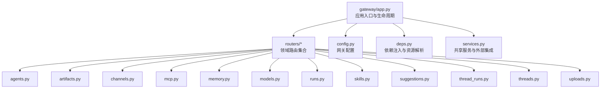
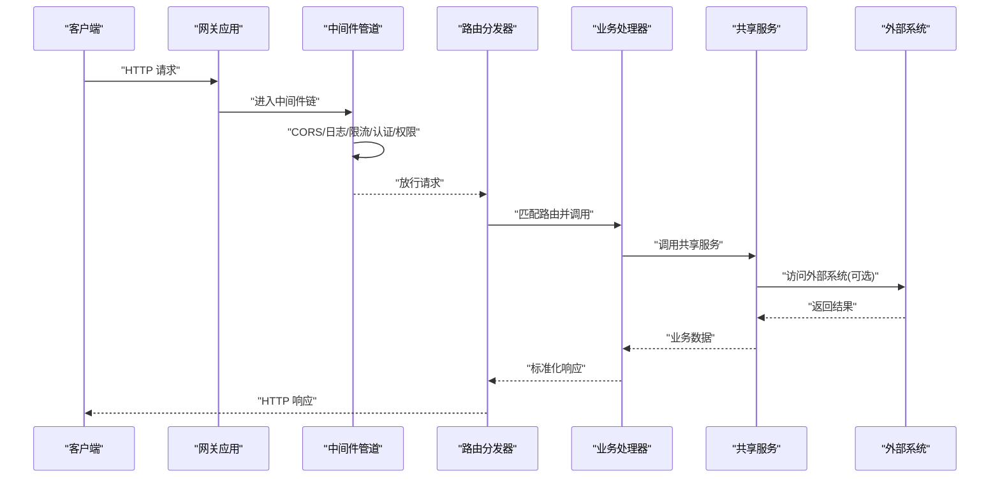
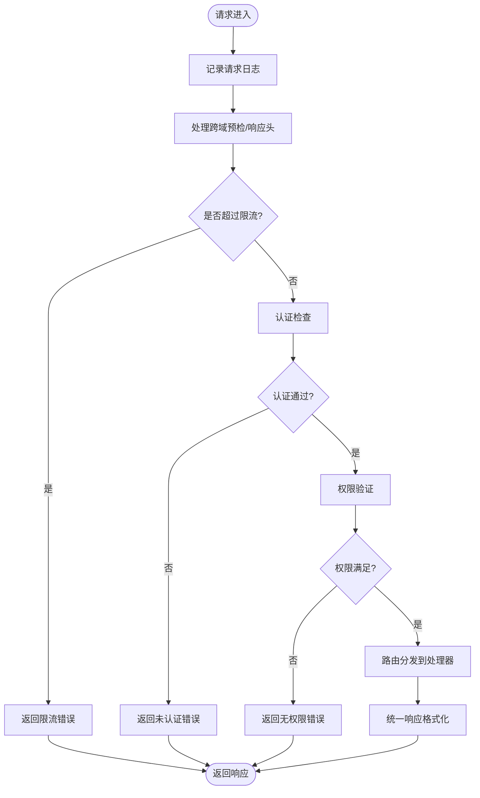
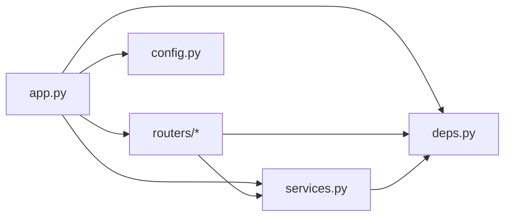

# Gateway网关组件

<cite>
**本文引用的文件**   
- [backend/app/gateway/app.py](file://backend/app/gateway/app.py)
- [backend/app/gateway/config.py](file://backend/app/gateway/config.py)
- [backend/app/gateway/deps.py](file://backend/app/gateway/deps.py)
- [backend/app/gateway/services.py](file://backend/app/gateway/services.py)
- [backend/app/gateway/routers/agents.py](file://backend/app/gateway/routers/agents.py)
- [backend/app/gateway/routers/artifacts.py](file://backend/app/gateway/routers/artifacts.py)
- [backend/app/gateway/routers/channels.py](file://backend/app/gateway/routers/channels.py)
- [backend/app/gateway/routers/mcp.py](file://backend/app/gateway/routers/mcp.py)
- [backend/app/gateway/routers/memory.py](file://backend/app/gateway/routers/memory.py)
- [backend/app/gateway/routers/models.py](file://backend/app/gateway/routers/models.py)
- [backend/app/gateway/routers/runs.py](file://backend/app/gateway/routers/runs.py)
- [backend/app/gateway/routers/skills.py](file://backend/app/gateway/routers/skills.py)
- [backend/app/gateway/routers/suggestions.py](file://backend/app/gateway/routers/suggestions.py)
- [backend/app/gateway/routers/thread_runs.py](file://backend/app/gateway/routers/thread_runs.py)
- [backend/app/gateway/routers/threads.py](file://backend/app/gateway/routers/threads.py)
- [backend/app/gateway/routers/uploads.py](file://backend/app/gateway/routers/uploads.py)
- [backend/docs/API.md](file://backend/docs/API.md)
- [backend/docs/middleware-execution-flow.md](file://backend/docs/middleware-execution-flow.md)
</cite>

## 目录
1. [简介](#简介)
2. [项目结构](#项目结构)
3. [核心组件](#核心组件)
4. [架构总览](#架构总览)
5. [详细组件分析](#详细组件分析)
6. [依赖分析](#依赖分析)
7. [性能考虑](#性能考虑)
8. [故障排查指南](#故障排查指南)
9. [结论](#结论)
10. [附录](#附录)

## 简介
本章节面向DeerFlow的Gateway网关组件，聚焦HTTP网关的核心职责与实现要点：请求路由管理、认证授权中间件、跨域处理、请求验证与响应格式化；并阐述路由注册机制、API版本控制策略、统一错误处理框架；解释中间件管道设计（认证检查、权限验证、日志记录、限流控制）；说明依赖注入系统与服务发现机制。文档同时提供配置示例、接口定义和使用模式，以及最佳实践指导，帮助读者快速理解与扩展Gateway能力。

## 项目结构
Gateway位于后端应用模块下，采用“按功能域划分”的路由组织方式，配合统一的App入口、配置、依赖注入与共享服务。

图表来源
- [backend/app/gateway/app.py](file://backend/app/gateway/app.py)
- [backend/app/gateway/config.py](file://backend/app/gateway/config.py)
- [backend/app/gateway/deps.py](file://backend/app/gateway/deps.py)
- [backend/app/gateway/services.py](file://backend/app/gateway/services.py)
- [backend/app/gateway/routers/agents.py](file://backend/app/gateway/routers/agents.py)
- [backend/app/gateway/routers/artifacts.py](file://backend/app/gateway/routers/artifacts.py)
- [backend/app/gateway/routers/channels.py](file://backend/app/gateway/routers/channels.py)
- [backend/app/gateway/routers/mcp.py](file://backend/app/gateway/routers/mcp.py)
- [backend/app/gateway/routers/memory.py](file://backend/app/gateway/routers/memory.py)
- [backend/app/gateway/routers/models.py](file://backend/app/gateway/routers/models.py)
- [backend/app/gateway/routers/runs.py](file://backend/app/gateway/routers/runs.py)
- [backend/app/gateway/routers/skills.py](file://backend/app/gateway/routers/skills.py)
- [backend/app/gateway/routers/suggestions.py](file://backend/app/gateway/routers/suggestions.py)
- [backend/app/gateway/routers/thread_runs.py](file://backend/app/gateway/routers/thread_runs.py)
- [backend/app/gateway/routers/threads.py](file://backend/app/gateway/routers/threads.py)
- [backend/app/gateway/routers/uploads.py](file://backend/app/gateway/routers/uploads.py)

章节来源
- [backend/app/gateway/app.py](file://backend/app/gateway/app.py)
- [backend/app/gateway/config.py](file://backend/app/gateway/config.py)
- [backend/app/gateway/deps.py](file://backend/app/gateway/deps.py)
- [backend/app/gateway/services.py](file://backend/app/gateway/services.py)
- [backend/app/gateway/routers/agents.py](file://backend/app/gateway/routers/agents.py)
- [backend/app/gateway/routers/artifacts.py](file://backend/app/gateway/routers/artifacts.py)
- [backend/app/gateway/routers/channels.py](file://backend/app/gateway/routers/channels.py)
- [backend/app/gateway/routers/mcp.py](file://backend/app/gateway/routers/mcp.py)
- [backend/app/gateway/routers/memory.py](file://backend/app/gateway/routers/memory.py)
- [backend/app/gateway/routers/models.py](file://backend/app/gateway/routers/models.py)
- [backend/app/gateway/routers/runs.py](file://backend/app/gateway/routers/runs.py)
- [backend/app/gateway/routers/skills.py](file://backend/app/gateway/routers/skills.py)
- [backend/app/gateway/routers/suggestions.py](file://backend/app/gateway/routers/suggestions.py)
- [backend/app/gateway/routers/thread_runs.py](file://backend/app/gateway/routers/thread_runs.py)
- [backend/app/gateway/routers/threads.py](file://backend/app/gateway/routers/threads.py)
- [backend/app/gateway/routers/uploads.py](file://backend/app/gateway/routers/uploads.py)

## 核心组件
- 应用入口与生命周期管理：负责创建Web应用实例、挂载中间件、注册路由、启动/关闭钩子、健康检查等。
- 配置中心：集中管理网关运行参数（如端口、跨域、鉴权开关、限流阈值、日志级别等）。
- 依赖注入：提供可插拔的服务实例（数据库连接、缓存、消息总线、外部服务客户端等），在路由层按需获取。
- 共享服务：封装对外部系统的调用与内部业务能力的复用（如模型服务、存储、MCP桥接等）。
- 路由集合：按业务域拆分，每个路由文件维护一组相关端点，便于独立演进与维护。

章节来源
- [backend/app/gateway/app.py](file://backend/app/gateway/app.py)
- [backend/app/gateway/config.py](file://backend/app/gateway/config.py)
- [backend/app/gateway/deps.py](file://backend/app/gateway/deps.py)
- [backend/app/gateway/services.py](file://backend/app/gateway/services.py)

## 架构总览
Gateway作为HTTP入口，承担以下职责：
- 请求路由管理：将URL路径映射到具体处理器函数或类方法。
- 认证授权中间件：校验身份令牌、会话状态与访问权限。
- 跨域处理：统一CORS策略，支持多前端来源。
- 请求验证：基于Pydantic等工具对入参进行强类型校验与默认值填充。
- 响应格式化：统一返回结构、错误码与序列化策略。
- 中间件管道：认证、权限、日志、限流、审计等横切关注点。
- 依赖注入与服务发现：通过容器化服务实例，解耦路由与底层实现。

图表来源
- [backend/app/gateway/app.py](file://backend/app/gateway/app.py)
- [backend/app/gateway/deps.py](file://backend/app/gateway/deps.py)
- [backend/app/gateway/services.py](file://backend/app/gateway/services.py)
- [backend/app/gateway/routers/agents.py](file://backend/app/gateway/routers/agents.py)
- [backend/app/gateway/routers/threads.py](file://backend/app/gateway/routers/threads.py)

## 详细组件分析

### 应用入口与生命周期
- 职责
  - 初始化Web框架实例与全局配置。
  - 注册全局中间件（CORS、日志、限流、异常捕获等）。
  - 挂载各业务路由前缀，支持版本化路径。
  - 暴露健康检查与调试端点。
  - 启动/关闭钩子用于资源初始化与清理。
- 关键点
  - 中间件顺序决定执行优先级，认证应在日志之后、限流之前。
  - 路由注册建议以“/api/vX/”为前缀，便于版本控制与灰度发布。
  - 健康检查应轻量且幂等，避免触发副作用。

章节来源
- [backend/app/gateway/app.py](file://backend/app/gateway/app.py)

### 配置管理
- 职责
  - 集中加载环境变量与配置文件。
  - 提供类型安全的配置对象供其他模块使用。
  - 支持运行时重载与热更新（可选）。
- 关键项
  - 网络与监听：端口、主机、工作进程数。
  - 安全与鉴权：JWT密钥、OAuth提供者、白名单。
  - CORS：允许的来源、方法与头。
  - 限流：窗口大小、最大请求数、键策略（IP/用户）。
  - 日志：级别、输出格式、采样率。
  - 外部服务：超时、重试、熔断策略。

章节来源
- [backend/app/gateway/config.py](file://backend/app/gateway/config.py)

### 依赖注入系统
- 职责
  - 统一管理服务实例的生命周期与作用域（请求级/应用级）。
  - 在路由函数中声明式地获取所需服务。
  - 提供测试友好的Mock替换能力。
- 典型用法
  - 在路由函数中通过参数注解引入服务实例。
  - 在中间件中读取当前请求上下文（用户、租户、追踪ID）。
  - 在启动钩子中初始化连接池、缓存客户端等。

章节来源
- [backend/app/gateway/deps.py](file://backend/app/gateway/deps.py)

### 共享服务与外部集成
- 职责
  - 封装对Agent、线程、记忆、上传、技能、模型、MCP等子系统的能力。
  - 统一错误转换与重试逻辑。
  - 提供事务/补偿边界（如需要）。
- 设计原则
  - 单一职责：每个服务对应一个清晰的业务域。
  - 可组合：通过依赖注入组合多个服务完成复杂流程。
  - 可观测：埋点、指标、链路追踪贯穿服务调用。

章节来源
- [backend/app/gateway/services.py](file://backend/app/gateway/services.py)

### 路由注册与API版本控制
- 路由组织
  - 按领域拆分为多个路由文件，便于独立开发与测试。
  - 统一前缀与命名规范，提高可读性与可维护性。
- 版本控制策略
  - URL前缀版本：/api/v1/...、/api/v2/...
  - 兼容期：旧版本保留一段时间，逐步迁移。
  - 变更通知：通过文档与变更日志同步升级计划。
- 常见端点
  - Agent管理、线程与任务、记忆与上传、模型与技能、MCP集成等。

章节来源
- [backend/app/gateway/routers/agents.py](file://backend/app/gateway/routers/agents.py)
- [backend/app/gateway/routers/artifacts.py](file://backend/app/gateway/routers/artifacts.py)
- [backend/app/gateway/routers/channels.py](file://backend/app/gateway/routers/channels.py)
- [backend/app/gateway/routers/mcp.py](file://backend/app/gateway/routers/mcp.py)
- [backend/app/gateway/routers/memory.py](file://backend/app/gateway/routers/memory.py)
- [backend/app/gateway/routers/models.py](file://backend/app/gateway/routers/models.py)
- [backend/app/gateway/routers/runs.py](file://backend/app/gateway/routers/runs.py)
- [backend/app/gateway/routers/skills.py](file://backend/app/gateway/routers/skills.py)
- [backend/app/gateway/routers/suggestions.py](file://backend/app/gateway/routers/suggestions.py)
- [backend/app/gateway/routers/thread_runs.py](file://backend/app/gateway/routers/thread_runs.py)
- [backend/app/gateway/routers/threads.py](file://backend/app/gateway/routers/threads.py)
- [backend/app/gateway/routers/uploads.py](file://backend/app/gateway/routers/uploads.py)

### 中间件管道设计
- 通用中间件
  - 日志记录：请求/响应摘要、耗时、追踪ID。
  - 跨域处理：预检请求、允许的源与方法。
  - 限流控制：基于IP/用户/路由维度的速率限制。
  - 异常捕获：统一错误码、错误信息与堆栈脱敏。
- 安全中间件
  - 认证检查：校验Token/Session，解析用户上下文。
  - 权限验证：基于角色/资源的访问控制。
- 执行顺序建议
  - 日志 → CORS → 限流 → 认证 → 权限 → 路由处理 → 响应格式化

图表来源
- [backend/app/gateway/app.py](file://backend/app/gateway/app.py)
- [backend/docs/middleware-execution-flow.md](file://backend/docs/middleware-execution-flow.md)

章节来源
- [backend/docs/middleware-execution-flow.md](file://backend/docs/middleware-execution-flow.md)

### 请求验证与响应格式化
- 请求验证
  - 使用强类型模型对JSON表单、查询参数、路径参数进行校验。
  - 提供默认值、必填约束与自定义校验规则。
  - 失败时返回标准错误结构，包含字段级错误信息。
- 响应格式化
  - 统一成功响应体结构（数据、分页、元信息）。
  - 统一错误响应体结构（错误码、消息、详情）。
  - 针对流式响应（SSE/WebSocket）提供专用包装。

章节来源
- [backend/app/gateway/routers/agents.py](file://backend/app/gateway/routers/agents.py)
- [backend/app/gateway/routers/threads.py](file://backend/app/gateway/routers/threads.py)
- [backend/app/gateway/routers/uploads.py](file://backend/app/gateway/routers/uploads.py)

### 错误处理统一框架
- 目标
  - 保证所有异常都能被捕获并转换为一致的HTTP响应。
  - 区分业务异常与系统异常，提供不同错误码与提示。
  - 保护敏感信息，避免泄露堆栈与内部细节。
- 策略
  - 全局异常处理器：捕获未处理异常，记录日志并返回友好错误。
  - 业务异常基类：携带错误码与用户可见消息。
  - 第三方异常适配：将外部库异常转换为内部错误模型。

章节来源
- [backend/app/gateway/app.py](file://backend/app/gateway/app.py)

### 服务发现与外部集成
- 服务发现
  - 通过配置中心或服务注册表动态解析下游服务地址。
  - 支持健康检查与自动剔除不可用实例。
- 外部集成
  - 模型服务：统一抽象不同提供商的调用接口。
  - MCP桥接：将MCP协议能力暴露为REST/SSE接口。
  - 存储与缓存：持久化与热点数据加速。

章节来源
- [backend/app/gateway/services.py](file://backend/app/gateway/services.py)
- [backend/app/gateway/routers/mcp.py](file://backend/app/gateway/routers/mcp.py)

## 依赖分析
Gateway内部模块之间的依赖关系如下：

图表来源
- [backend/app/gateway/app.py](file://backend/app/gateway/app.py)
- [backend/app/gateway/config.py](file://backend/app/gateway/config.py)
- [backend/app/gateway/deps.py](file://backend/app/gateway/deps.py)
- [backend/app/gateway/services.py](file://backend/app/gateway/services.py)
- [backend/app/gateway/routers/agents.py](file://backend/app/gateway/routers/agents.py)
- [backend/app/gateway/routers/threads.py](file://backend/app/gateway/routers/threads.py)

章节来源
- [backend/app/gateway/app.py](file://backend/app/gateway/app.py)
- [backend/app/gateway/config.py](file://backend/app/gateway/config.py)
- [backend/app/gateway/deps.py](file://backend/app/gateway/deps.py)
- [backend/app/gateway/services.py](file://backend/app/gateway/services.py)
- [backend/app/gateway/routers/agents.py](file://backend/app/gateway/routers/agents.py)
- [backend/app/gateway/routers/threads.py](file://backend/app/gateway/routers/threads.py)

## 性能考虑
- 中间件开销
  - 将高频判断（如限流、CORS）前置，减少不必要的CPU消耗。
  - 日志采样与异步写入，降低I/O阻塞。
- 连接与并发
  - 合理设置工作进程/线程数与连接池大小。
  - 对长耗时操作启用异步与背压控制。
- 缓存与去重
  - 对读多写少的接口增加缓存层，注意失效策略。
  - 对幂等请求进行去重，避免重复计算。
- 流式传输
  - 对大文件或长对话采用分块传输与增量渲染。
  - 监控带宽与内存占用，防止OOM。

[本节为通用性能建议，不直接分析具体文件]

## 故障排查指南
- 常见问题定位
  - 认证失败：检查Token签发方、过期时间、签名算法与白名单。
  - 权限拒绝：核对角色/资源映射与策略配置。
  - 限流触发：确认限流键维度与阈值，必要时扩容或优化客户端重试。
  - 跨域错误：核对允许的源、方法与头，确保预检请求正确返回。
  - 请求校验失败：查看字段级错误信息，修正客户端输入。
  - 外部服务异常：检查超时、重试与熔断配置，观察下游健康状态。
- 诊断手段
  - 开启详细日志与链路追踪，收集请求ID与上下文。
  - 使用健康检查端点验证服务可用性。
  - 对关键路径添加指标埋点（QPS、延迟、错误率）。

章节来源
- [backend/app/gateway/app.py](file://backend/app/gateway/app.py)
- [backend/docs/middleware-execution-flow.md](file://backend/docs/middleware-execution-flow.md)

## 结论
Gateway作为DeerFlow的统一HTTP入口，通过清晰的中间件管道、模块化路由与依赖注入体系，实现了高内聚、低耦合的可扩展架构。结合统一的配置管理、错误处理与响应格式化，能够稳定支撑认证授权、跨域、限流、请求验证与流式响应等关键能力。遵循本文的最佳实践与排障建议，有助于在生产环境中获得更高的可靠性与可维护性。

[本节为总结性内容，不直接分析具体文件]

## 附录

### 配置示例（节选）
- 网络与监听
  - 端口、主机、工作进程数
- 安全与鉴权
  - JWT密钥、OAuth提供者、白名单
- CORS
  - 允许的来源、方法与头
- 限流
  - 窗口大小、最大请求数、键策略
- 日志
  - 级别、输出格式、采样率
- 外部服务
  - 超时、重试、熔断策略

章节来源
- [backend/app/gateway/config.py](file://backend/app/gateway/config.py)

### 接口定义参考
- 官方API文档位置与使用说明
- 版本化路径约定与兼容性策略

章节来源
- [backend/docs/API.md](file://backend/docs/API.md)

### 使用模式与最佳实践
- 新增路由
  - 在对应路由文件中定义端点，使用依赖注入获取服务。
  - 为端点编写单元测试与集成测试。
- 新增中间件
  - 明确中间件职责与执行顺序，避免相互干扰。
  - 提供可配置的开关与阈值。
- 版本演进
  - 保持向后兼容，逐步废弃旧版本。
  - 通过变更日志与文档同步升级计划。

章节来源
- [backend/app/gateway/routers/agents.py](file://backend/app/gateway/routers/agents.py)
- [backend/app/gateway/routers/threads.py](file://backend/app/gateway/routers/threads.py)
- [backend/app/gateway/routers/uploads.py](file://backend/app/gateway/routers/uploads.py)
- [backend/docs/API.md](file://backend/docs/API.md)