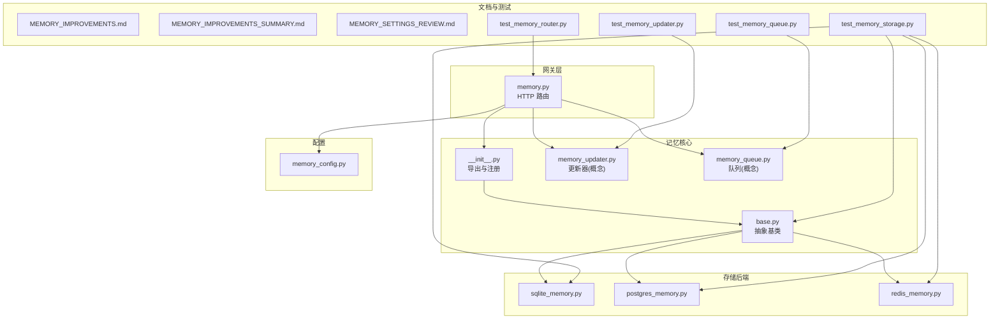
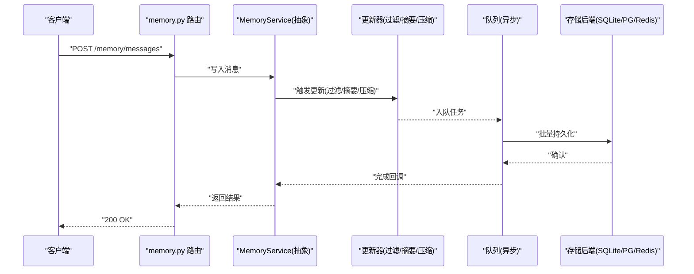
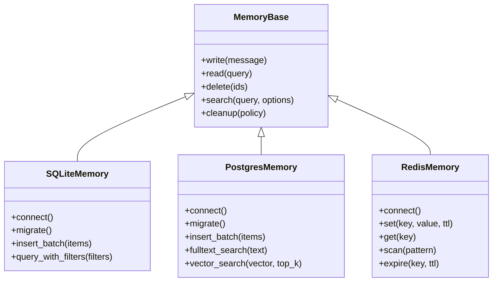
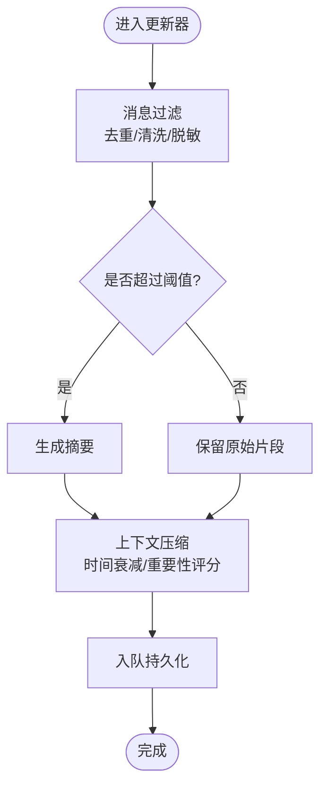
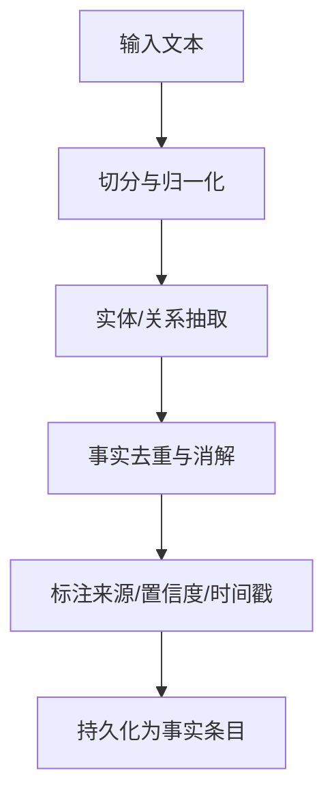
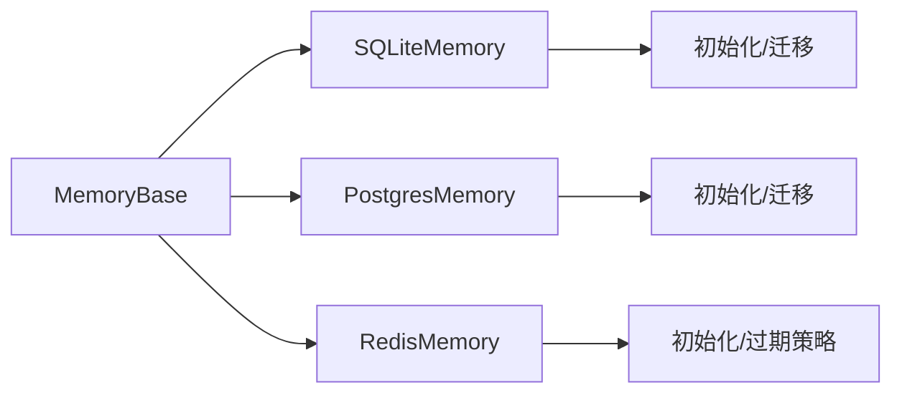
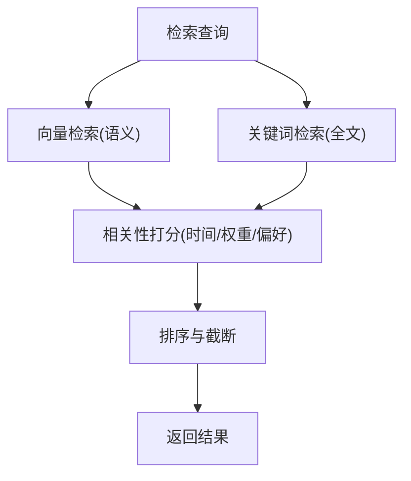
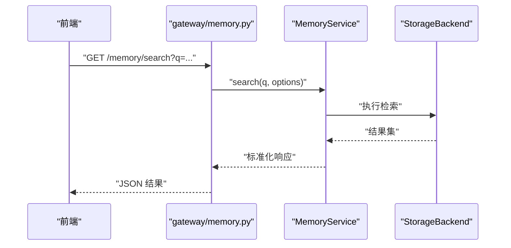
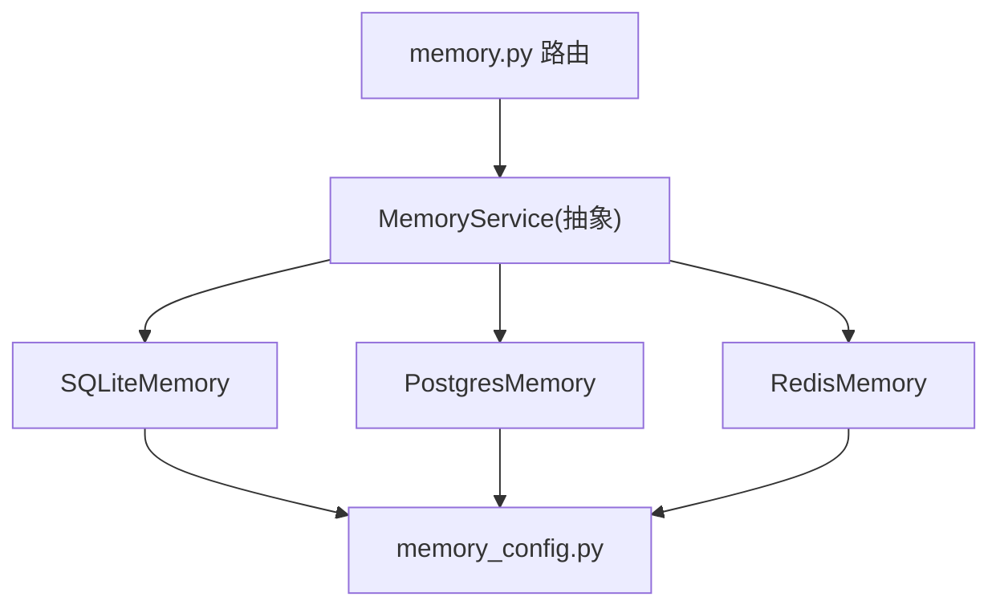

# 记忆组件

<cite>
**本文引用的文件**   
- [backend/app/gateway/routers/memory.py](file://backend/app/gateway/routers/memory.py)
- [backend/packages/harness/deerflow/agents/memory/__init__.py](file://backend/packages/harness/deerflow/agents/memory/__init__.py)
- [backend/packages/harness/deerflow/agents/memory/base.py](file://backend/packages/harness/deerflow/agents/memory/base.py)
- [backend/packages/harness/deerflow/agents/memory/sqlite_memory.py](file://backend/packages/harness/deerflow/agents/memory/sqlite_memory.py)
- [backend/packages/harness/deerflow/agents/memory/postgres_memory.py](file://backend/packages/harness/deerflow/agents/memory/postgres_memory.py)
- [backend/packages/harness/deerflow/agents/memory/redis_memory.py](file://backend/packages/harness/deerflow/agents/memory/redis_memory.py)
- [backend/packages/harness/deerflow/config/memory_config.py](file://backend/packages/harness/deerflow/config/memory_config.py)
- [backend/docs/MEMORY_IMPROVEMENTS.md](file://backend/docs/MEMORY_IMPROVEMENTS.md)
- [backend/docs/MEMORY_IMPROVEMENTS_SUMMARY.md](file://backend/docs/MEMORY_IMPROVEMENTS_SUMMARY.md)
- [backend/docs/MEMORY_SETTINGS_REVIEW.md](file://backend/docs/MEMORY_SETTINGS_REVIEW.md)
- [backend/tests/test_memory_storage.py](file://backend/tests/test_memory_storage.py)
- [backend/tests/test_memory_router.py](file://backend/tests/test_memory_router.py)
- [backend/tests/test_memory_queue.py](file://backend/tests/test_memory_queue.py)
- [backend/tests/test_memory_updater.py](file://backend/tests/test_memory_updater.py)
</cite>

## 目录
1. [简介](#简介)
2. [项目结构](#项目结构)
3. [核心组件](#核心组件)
4. [架构总览](#架构总览)
5. [详细组件分析](#详细组件分析)
6. [依赖关系分析](#依赖关系分析)
7. [性能考虑](#性能考虑)
8. [故障排查指南](#故障排查指南)
9. [结论](#结论)
10. [附录](#附录)

## 简介
本文件面向 DeerFlow 的记忆系统，系统性阐述其架构与实现：短期记忆缓存、长期记忆存储、事实提取算法、消息处理流程（过滤、摘要生成、上下文压缩）、存储后端抽象（SQLite、PostgreSQL、Redis）、检索机制（语义搜索、关键词匹配、相关性排序），以及配置优化、数据迁移与性能调优实践。文档同时提供可视化图示与测试用例参考，帮助读者快速理解并高效使用记忆组件。

## 项目结构
记忆系统位于后端 harness 的 agents/memory 模块中，并通过网关路由对外暴露接口；配置集中在 memory_config 中；相关设计与改进说明在 docs 目录下；测试覆盖路由、存储、队列与更新器。

图表来源
- [backend/app/gateway/routers/memory.py](file://backend/app/gateway/routers/memory.py)
- [backend/packages/harness/deerflow/agents/memory/__init__.py](file://backend/packages/harness/deerflow/agents/memory/__init__.py)
- [backend/packages/harness/deerflow/agents/memory/base.py](file://backend/packages/harness/deerflow/agents/memory/base.py)
- [backend/packages/harness/deerflow/agents/memory/sqlite_memory.py](file://backend/packages/harness/deerflow/agents/memory/sqlite_memory.py)
- [backend/packages/harness/deerflow/agents/memory/postgres_memory.py](file://backend/packages/harness/deerflow/agents/memory/postgres_memory.py)
- [backend/packages/harness/deerflow/agents/memory/redis_memory.py](file://backend/packages/harness/deerflow/agents/memory/redis_memory.py)
- [backend/packages/harness/deerflow/config/memory_config.py](file://backend/packages/harness/deerflow/config/memory_config.py)
- [backend/docs/MEMORY_IMPROVEMENTS.md](file://backend/docs/MEMORY_IMPROVEMENTS.md)
- [backend/docs/MEMORY_IMPROVEMENTS_SUMMARY.md](file://backend/docs/MEMORY_IMPROVEMENTS_SUMMARY.md)
- [backend/docs/MEMORY_SETTINGS_REVIEW.md](file://backend/docs/MEMORY_SETTINGS_REVIEW.md)
- [backend/tests/test_memory_storage.py](file://backend/tests/test_memory_storage.py)
- [backend/tests/test_memory_router.py](file://backend/tests/test_memory_router.py)
- [backend/tests/test_memory_queue.py](file://backend/tests/test_memory_queue.py)
- [backend/tests/test_memory_updater.py](file://backend/tests/test_memory_updater.py)

章节来源
- [backend/app/gateway/routers/memory.py](file://backend/app/gateway/routers/memory.py)
- [backend/packages/harness/deerflow/agents/memory/__init__.py](file://backend/packages/harness/deerflow/agents/memory/__init__.py)
- [backend/packages/harness/deerflow/agents/memory/base.py](file://backend/packages/harness/deerflow/agents/memory/base.py)
- [backend/packages/harness/deerflow/config/memory_config.py](file://backend/packages/harness/deerflow/config/memory_config.py)
- [backend/docs/MEMORY_IMPROVEMENTS.md](file://backend/docs/MEMORY_IMPROVEMENTS.md)
- [backend/docs/MEMORY_IMPROVEMENTS_SUMMARY.md](file://backend/docs/MEMORY_IMPROVEMENTS_SUMMARY.md)
- [backend/docs/MEMORY_SETTINGS_REVIEW.md](file://backend/docs/MEMORY_SETTINGS_REVIEW.md)
- [backend/tests/test_memory_storage.py](file://backend/tests/test_memory_storage.py)
- [backend/tests/test_memory_router.py](file://backend/tests/test_memory_router.py)
- [backend/tests/test_memory_queue.py](file://backend/tests/test_memory_queue.py)
- [backend/tests/test_memory_updater.py](file://backend/tests/test_memory_updater.py)

## 核心组件
- 抽象基类与统一接口
  - 定义统一的记忆读写、查询、删除、清理等接口，屏蔽底层存储差异。
  - 支持按会话/线程维度组织记忆条目，并提供元数据字段用于检索与排序。
- 存储后端实现
  - SQLite：轻量本地持久化，适合单机与开发环境。
  - PostgreSQL：生产级关系型数据库，支持复杂查询与扩展索引。
  - Redis：高性能内存缓存，适合短期记忆与热点数据。
- 配置中心
  - 集中管理各后端的连接参数、容量上限、过期策略、分片与副本等。
- 网关路由
  - 将 HTTP 请求映射到记忆服务方法，负责鉴权、限流与错误码转换。
- 更新器与队列（概念）
  - 更新器负责消息过滤、摘要生成、上下文压缩与事实提取。
  - 队列用于异步写入与批处理，降低主路径延迟。

章节来源
- [backend/packages/harness/deerflow/agents/memory/base.py](file://backend/packages/harness/deerflow/agents/memory/base.py)
- [backend/packages/harness/deerflow/agents/memory/sqlite_memory.py](file://backend/packages/harness/deerflow/agents/memory/sqlite_memory.py)
- [backend/packages/harness/deerflow/agents/memory/postgres_memory.py](file://backend/packages/harness/deerflow/agents/memory/postgres_memory.py)
- [backend/packages/harness/deerflow/agents/memory/redis_memory.py](file://backend/packages/harness/deerflow/agents/memory/redis_memory.py)
- [backend/packages/harness/deerflow/config/memory_config.py](file://backend/packages/harness/deerflow/config/memory_config.py)
- [backend/app/gateway/routers/memory.py](file://backend/app/gateway/routers/memory.py)

## 架构总览
记忆系统采用“网关 + 抽象基类 + 多后端实现”的分层设计。上层通过路由调用记忆服务，服务根据配置选择具体后端；更新器与队列在后台对消息进行预处理与持久化，保证高吞吐与低延迟。

图表来源
- [backend/app/gateway/routers/memory.py](file://backend/app/gateway/routers/memory.py)
- [backend/packages/harness/deerflow/agents/memory/base.py](file://backend/packages/harness/deerflow/agents/memory/base.py)
- [backend/packages/harness/deerflow/agents/memory/sqlite_memory.py](file://backend/packages/harness/deerflow/agents/memory/sqlite_memory.py)
- [backend/packages/harness/deerflow/agents/memory/postgres_memory.py](file://backend/packages/harness/deerflow/agents/memory/postgres_memory.py)
- [backend/packages/harness/deerflow/agents/memory/redis_memory.py](file://backend/packages/harness/deerflow/agents/memory/redis_memory.py)

## 详细组件分析

### 抽象基类与后端实现
- 统一接口
  - 提供一致的增删改查、分页、过滤、排序与聚合能力。
  - 支持按时间窗口、主题标签、来源类型等多维筛选。
- 后端适配
  - SQLite：单文件存储，适合本地调试与小规模数据。
  - PostgreSQL：支持全文检索与向量扩展，适合大规模检索与复杂条件查询。
  - Redis：基于键空间与过期策略，适合短期记忆与高频访问。

图表来源
- [backend/packages/harness/deerflow/agents/memory/base.py](file://backend/packages/harness/deerflow/agents/memory/base.py)
- [backend/packages/harness/deerflow/agents/memory/sqlite_memory.py](file://backend/packages/harness/deerflow/agents/memory/sqlite_memory.py)
- [backend/packages/harness/deerflow/agents/memory/postgres_memory.py](file://backend/packages/harness/deerflow/agents/memory/postgres_memory.py)
- [backend/packages/harness/deerflow/agents/memory/redis_memory.py](file://backend/packages/harness/deerflow/agents/memory/redis_memory.py)

章节来源
- [backend/packages/harness/deerflow/agents/memory/base.py](file://backend/packages/harness/deerflow/agents/memory/base.py)
- [backend/packages/harness/deerflow/agents/memory/sqlite_memory.py](file://backend/packages/harness/deerflow/agents/memory/sqlite_memory.py)
- [backend/packages/harness/deerflow/agents/memory/postgres_memory.py](file://backend/packages/harness/deerflow/agents/memory/postgres_memory.py)
- [backend/packages/harness/deerflow/agents/memory/redis_memory.py](file://backend/packages/harness/deerflow/agents/memory/redis_memory.py)

### 消息处理流程（过滤、摘要、压缩）
- 过滤
  - 去除重复、噪声与敏感信息，保留关键对话片段。
- 摘要生成
  - 对长对话或长文档进行分段摘要，合并为可检索的知识单元。
- 上下文压缩
  - 基于时间衰减与重要性评分，裁剪历史上下文，控制提示词长度。

图表来源
- [backend/tests/test_memory_updater.py](file://backend/tests/test_memory_updater.py)
- [backend/tests/test_memory_queue.py](file://backend/tests/test_memory_queue.py)

章节来源
- [backend/tests/test_memory_updater.py](file://backend/tests/test_memory_updater.py)
- [backend/tests/test_memory_queue.py](file://backend/tests/test_memory_queue.py)

### 事实提取算法
- 目标
  - 从对话或文档中提取结构化事实（实体、关系、属性），形成可检索的知识图谱片段。
- 步骤
  - 文本切分与归一化
  - 命名实体识别与关系抽取
  - 事实去重与冲突消解
  - 关联到对应会话与时间戳
- 输出
  - 结构化事实条目，附带来源、置信度与时间戳，便于后续检索与排序。

图表来源
- [backend/docs/MEMORY_IMPROVEMENTS.md](file://backend/docs/MEMORY_IMPROVEMENTS.md)
- [backend/docs/MEMORY_IMPROVEMENTS_SUMMARY.md](file://backend/docs/MEMORY_IMPROVEMENTS_SUMMARY.md)

章节来源
- [backend/docs/MEMORY_IMPROVEMENTS.md](file://backend/docs/MEMORY_IMPROVEMENTS.md)
- [backend/docs/MEMORY_IMPROVEMENTS_SUMMARY.md](file://backend/docs/MEMORY_IMPROVEMENTS_SUMMARY.md)

### 存储后端抽象与适配
- 设计原则
  - 以抽象基类统一接口，后端按需实现。
  - 迁移脚本与初始化逻辑在后端内部封装，避免上层感知差异。
- 特性对比
  - SQLite：零配置、易部署，适合开发与演示。
  - PostgreSQL：强一致、可扩展，适合生产与复杂检索。
  - Redis：极低延迟、高吞吐，适合短期记忆与缓存。

图表来源
- [backend/packages/harness/deerflow/agents/memory/base.py](file://backend/packages/harness/deerflow/agents/memory/base.py)
- [backend/packages/harness/deerflow/agents/memory/sqlite_memory.py](file://backend/packages/harness/deerflow/agents/memory/sqlite_memory.py)
- [backend/packages/harness/deerflow/agents/memory/postgres_memory.py](file://backend/packages/harness/deerflow/agents/memory/postgres_memory.py)
- [backend/packages/harness/deerflow/agents/memory/redis_memory.py](file://backend/packages/harness/deerflow/agents/memory/redis_memory.py)

章节来源
- [backend/packages/harness/deerflow/agents/memory/base.py](file://backend/packages/harness/deerflow/agents/memory/base.py)
- [backend/packages/harness/deerflow/agents/memory/sqlite_memory.py](file://backend/packages/harness/deerflow/agents/memory/sqlite_memory.py)
- [backend/packages/harness/deerflow/agents/memory/postgres_memory.py](file://backend/packages/harness/deerflow/agents/memory/postgres_memory.py)
- [backend/packages/harness/deerflow/agents/memory/redis_memory.py](file://backend/packages/harness/deerflow/agents/memory/redis_memory.py)

### 记忆检索机制（语义搜索、关键词匹配、相关性排序）
- 语义搜索
  - 基于向量嵌入与相似度计算，支持跨语言与跨模态检索。
- 关键词匹配
  - 基于倒排索引或全文检索引擎，精确命中术语与短语。
- 相关性排序
  - 融合时间衰减、来源权重、用户偏好与业务规则，综合打分排序。

图表来源
- [backend/packages/harness/deerflow/agents/memory/postgres_memory.py](file://backend/packages/harness/deerflow/agents/memory/postgres_memory.py)
- [backend/packages/harness/deerflow/agents/memory/sqlite_memory.py](file://backend/packages/harness/deerflow/agents/memory/sqlite_memory.py)
- [backend/packages/harness/deerflow/agents/memory/redis_memory.py](file://backend/packages/harness/deerflow/agents/memory/redis_memory.py)

章节来源
- [backend/packages/harness/deerflow/agents/memory/postgres_memory.py](file://backend/packages/harness/deerflow/agents/memory/postgres_memory.py)
- [backend/packages/harness/deerflow/agents/memory/sqlite_memory.py](file://backend/packages/harness/deerflow/agents/memory/sqlite_memory.py)
- [backend/packages/harness/deerflow/agents/memory/redis_memory.py](file://backend/packages/harness/deerflow/agents/memory/redis_memory.py)

### 网关路由与服务集成
- 路由职责
  - 接收 HTTP 请求，校验参数，委派至记忆服务，返回标准响应。
- 错误处理
  - 统一异常捕获与错误码映射，便于前端展示与监控告警。
- 限流与鉴权
  - 结合网关中间件实现速率限制与身份认证。

图表来源
- [backend/app/gateway/routers/memory.py](file://backend/app/gateway/routers/memory.py)
- [backend/packages/harness/deerflow/agents/memory/base.py](file://backend/packages/harness/deerflow/agents/memory/base.py)

章节来源
- [backend/app/gateway/routers/memory.py](file://backend/app/gateway/routers/memory.py)
- [backend/tests/test_memory_router.py](file://backend/tests/test_memory_router.py)

### 配置与优化
- 配置项要点
  - 后端选择与连接参数
  - 短期记忆 TTL 与最大容量
  - 长期记忆索引与分片策略
  - 检索阈值与 Top-K 数量
- 优化建议
  - 合理设置 TTL，避免冷数据堆积
  - 对高频字段建立索引，提升查询性能
  - 使用批量写入与事务，减少 I/O 开销

章节来源
- [backend/packages/harness/deerflow/config/memory_config.py](file://backend/packages/harness/deerflow/config/memory_config.py)
- [backend/docs/MEMORY_SETTINGS_REVIEW.md](file://backend/docs/MEMORY_SETTINGS_REVIEW.md)

### 数据迁移方案
- 版本化迁移
  - 每个后端维护独立迁移脚本，确保表结构与索引演进。
- 回滚策略
  - 迁移前备份关键数据，失败时自动回滚。
- 灰度发布
  - 双写过渡期并行新旧结构，逐步切换读路径。

章节来源
- [backend/packages/harness/deerflow/agents/memory/sqlite_memory.py](file://backend/packages/harness/deerflow/agents/memory/sqlite_memory.py)
- [backend/packages/harness/deerflow/agents/memory/postgres_memory.py](file://backend/packages/harness/deerflow/agents/memory/postgres_memory.py)

## 依赖关系分析
- 组件耦合
  - 路由仅依赖抽象服务接口，不感知具体后端。
  - 后端实现仅依赖各自驱动与配置。
- 外部依赖
  - SQLite/PostgreSQL/Redis 驱动库
  - 可选向量检索扩展（如 pgvector）
- 循环依赖
  - 通过抽象基类与依赖注入避免循环引用。

图表来源
- [backend/app/gateway/routers/memory.py](file://backend/app/gateway/routers/memory.py)
- [backend/packages/harness/deerflow/agents/memory/base.py](file://backend/packages/harness/deerflow/agents/memory/base.py)
- [backend/packages/harness/deerflow/agents/memory/sqlite_memory.py](file://backend/packages/harness/deerflow/agents/memory/sqlite_memory.py)
- [backend/packages/harness/deerflow/agents/memory/postgres_memory.py](file://backend/packages/harness/deerflow/agents/memory/postgres_memory.py)
- [backend/packages/harness/deerflow/agents/memory/redis_memory.py](file://backend/packages/harness/deerflow/agents/memory/redis_memory.py)
- [backend/packages/harness/deerflow/config/memory_config.py](file://backend/packages/harness/deerflow/config/memory_config.py)

章节来源
- [backend/app/gateway/routers/memory.py](file://backend/app/gateway/routers/memory.py)
- [backend/packages/harness/deerflow/agents/memory/base.py](file://backend/packages/harness/deerflow/agents/memory/base.py)
- [backend/packages/harness/deerflow/config/memory_config.py](file://backend/packages/harness/deerflow/config/memory_config.py)

## 性能考虑
- 写入路径
  - 使用队列批量写入，降低单次 I/O 成本。
  - 开启事务与 WAL 模式（SQLite）以提升并发写入。
- 读取路径
  - 合理使用索引与分页，避免全表扫描。
  - 对热点数据启用 Redis 缓存，缩短首字节延迟。
- 资源控制
  - 限制并发连接数与队列深度，防止雪崩。
  - 设置合理的超时与重试退避策略。

[本节为通用性能指导，无需特定文件来源]

## 故障排查指南
- 常见问题
  - 连接失败：检查后端地址、端口、凭据与网络连通性。
  - 迁移失败：查看迁移日志，确认表结构与索引一致性。
  - 检索无结果：核对索引状态与分词器配置。
- 定位手段
  - 启用详细日志与追踪 ID，串联请求链路。
  - 使用测试套件验证基本读写与检索路径。

章节来源
- [backend/tests/test_memory_storage.py](file://backend/tests/test_memory_storage.py)
- [backend/tests/test_memory_router.py](file://backend/tests/test_memory_router.py)
- [backend/tests/test_memory_queue.py](file://backend/tests/test_memory_queue.py)
- [backend/tests/test_memory_updater.py](file://backend/tests/test_memory_updater.py)

## 结论
DeerFlow 记忆系统通过抽象基类与多后端实现，提供了灵活、可扩展的记忆能力。结合消息处理流水线与检索机制，可在不同场景下平衡延迟、吞吐与准确性。配合完善的配置与迁移策略，能够支撑从开发到生产的平滑演进。

[本节为总结性内容，无需特定文件来源]

## 附录
- 最佳实践
  - 短期记忆优先使用 Redis，长期记忆使用 PostgreSQL，开发阶段可用 SQLite。
  - 对高频检索字段建立索引，定期清理过期数据。
  - 使用批量写入与异步更新，降低主路径延迟。
- 参考文档
  - 记忆改进与设置审查文档有助于理解设计取舍与演进方向。

章节来源
- [backend/docs/MEMORY_IMPROVEMENTS.md](file://backend/docs/MEMORY_IMPROVEMENTS.md)
- [backend/docs/MEMORY_IMPROVEMENTS_SUMMARY.md](file://backend/docs/MEMORY_IMPROVEMENTS_SUMMARY.md)
- [backend/docs/MEMORY_SETTINGS_REVIEW.md](file://backend/docs/MEMORY_SETTINGS_REVIEW.md)