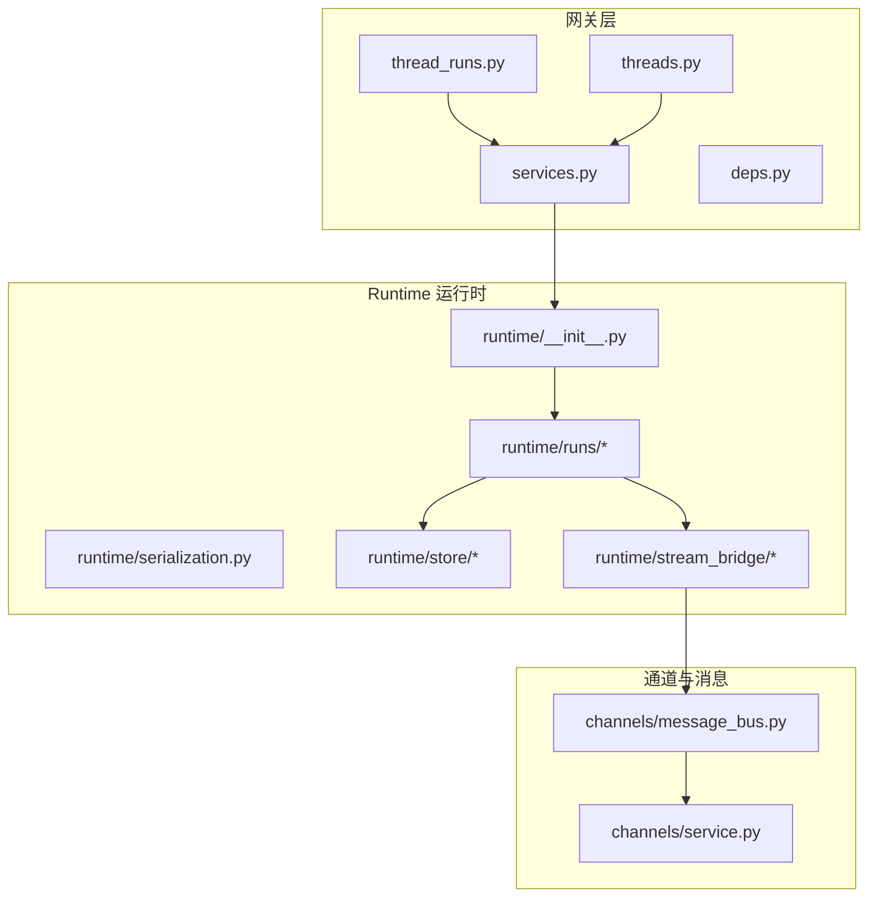
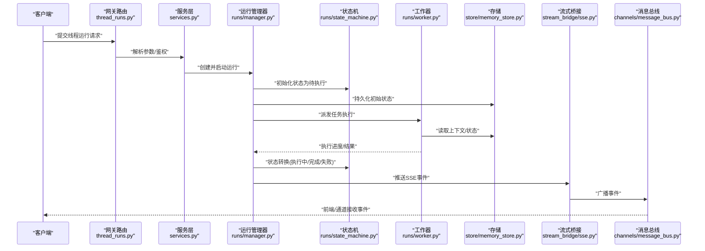
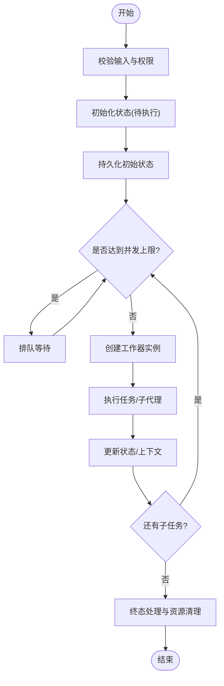
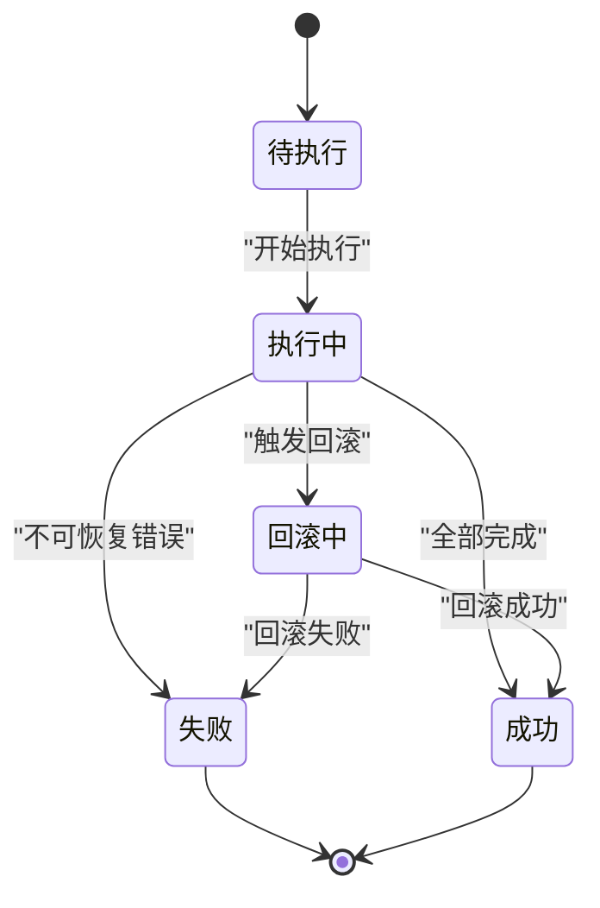
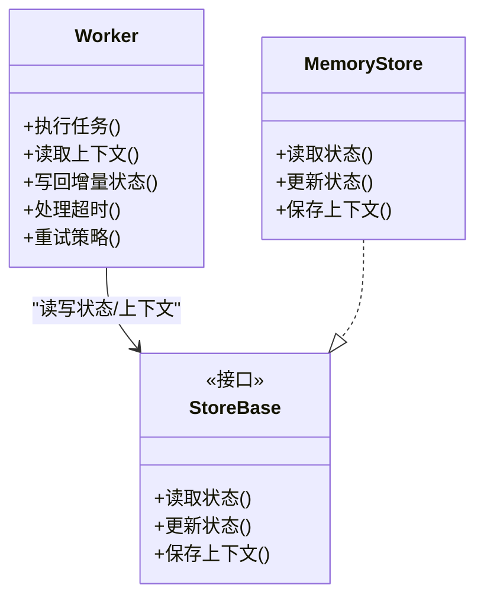
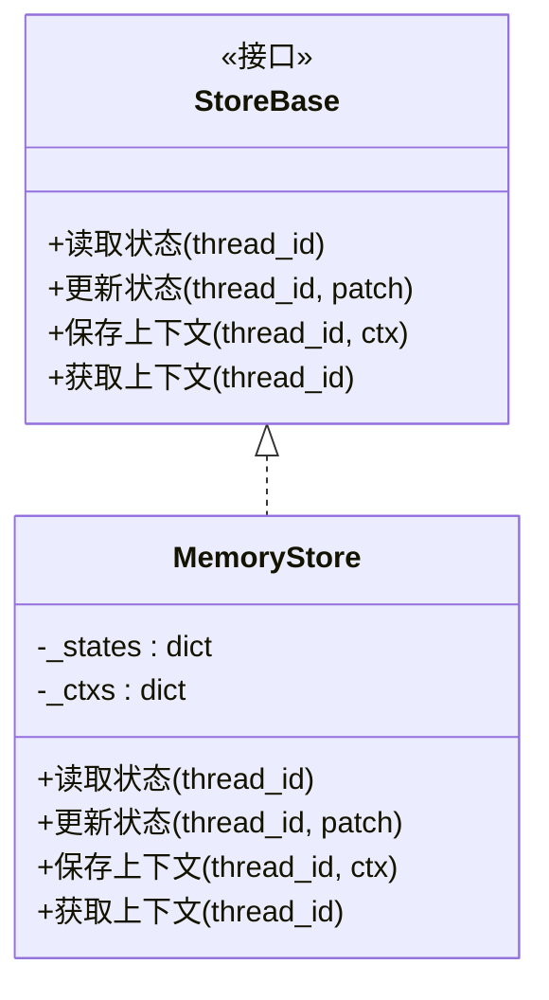
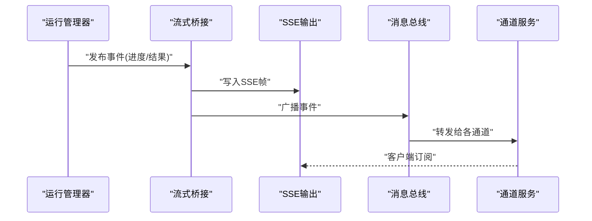
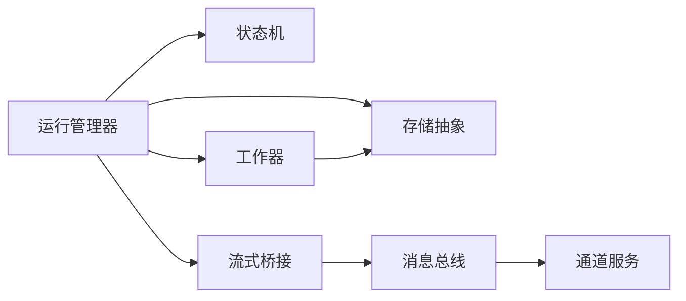

# Runtime运行时组件

<cite>
**本文引用的文件**   
- [backend/packages/harness/deerflow/runtime/__init__.py](file://backend/packages/harness/deerflow/runtime/__init__.py)
- [backend/packages/harness/deerflow/runtime/serialization.py](file://backend/packages/harness/deerflow/runtime/serialization.py)
- [backend/packages/harness/deerflow/runtime/runs/__init__.py](file://backend/packages/harness/deerflow/runtime/runs/__init__.py)
- [backend/packages/harness/deerflow/runtime/runs/manager.py](file://backend/packages/harness/deerflow/runtime/runs/manager.py)
- [backend/packages/harness/deerflow/runtime/runs/state_machine.py](file://backend/packages/harness/deerflow/runtime/runs/state_machine.py)
- [backend/packages/harness/deerflow/runtime/runs/worker.py](file://backend/packages/harness/deerflow/runtime/runs/worker.py)
- [backend/packages/harness/deerflow/runtime/store/__init__.py](file://backend/packages/harness/deerflow/runtime/store/__init__.py)
- [backend/packages/harness/deerflow/runtime/store/base.py](file://backend/packages/harness/deerflow/runtime/store/base.py)
- [backend/packages/harness/deerflow/runtime/store/memory_store.py](file://backend/packages/harness/deerflow/runtime/store/memory_store.py)
- [backend/packages/harness/deerflow/runtime/stream_bridge/__init__.py](file://backend/packages/harness/deerflow/runtime/stream_bridge/__init__.py)
- [backend/packages/harness/deerflow/runtime/stream_bridge/sse.py](file://backend/packages/harness/deerflow/runtime/stream_bridge/sse.py)
- [backend/packages/harness/deerflow/runtime/stream_bridge/message_bus.py](file://backend/packages/harness/deerflow/runtime/stream_bridge/message_bus.py)
- [backend/app/gateway/routers/thread_runs.py](file://backend/app/gateway/routers/thread_runs.py)
- [backend/app/gateway/routers/threads.py](file://backend/app/gateway/routers/threads.py)
- [backend/app/channels/message_bus.py](file://backend/app/channels/message_bus.py)
- [backend/app/channels/service.py](file://backend/app/channels/service.py)
- [backend/app/gateway/services.py](file://backend/app/gateway/services.py)
- [backend/app/gateway/deps.py](file://backend/app/gateway/deps.py)
</cite>

## 目录
1. [简介](#简介)
2. [项目结构](#项目结构)
3. [核心组件](#核心组件)
4. [架构总览](#架构总览)
5. [详细组件分析](#详细组件分析)
6. [依赖关系分析](#依赖关系分析)
7. [性能考虑](#性能考虑)
8. [故障排查指南](#故障排查指南)
9. [结论](#结论)
10. [附录](#附录)

## 简介
本文件面向 DeerFlow 的 Runtime 运行时组件，聚焦以下目标：
- 代理编排引擎：主代理协调、子代理调度、任务分解执行
- 状态管理系统：线程状态持久化、上下文传递、状态转换规则
- 生命周期控制：代理实例管理、资源清理、异常恢复机制
- 事件驱动架构：消息队列集成、异步处理、事件订阅发布
- 状态机设计、并发控制策略与性能优化方案
- 实际使用示例与故障排查指南

## 项目结构
Runtime 模块位于后端包内，围绕“运行期（runs）”、“存储（store）”、“流式桥接（stream_bridge）”三大子系统组织。Gateway 层通过路由与服务将外部请求接入 Runtime；Channels 提供消息总线与通道能力。

图表来源
- [backend/app/gateway/routers/thread_runs.py](file://backend/app/gateway/routers/thread_runs.py)
- [backend/app/gateway/routers/threads.py](file://backend/app/gateway/routers/threads.py)
- [backend/app/gateway/services.py](file://backend/app/gateway/services.py)
- [backend/app/gateway/deps.py](file://backend/app/gateway/deps.py)
- [backend/packages/harness/deerflow/runtime/__init__.py](file://backend/packages/harness/deerflow/runtime/__init__.py)
- [backend/packages/harness/deerflow/runtime/runs/__init__.py](file://backend/packages/harness/deerflow/runtime/runs/__init__.py)
- [backend/packages/harness/deerflow/runtime/store/__init__.py](file://backend/packages/harness/deerflow/runtime/store/__init__.py)
- [backend/packages/harness/deerflow/runtime/stream_bridge/__init__.py](file://backend/packages/harness/deerflow/runtime/stream_bridge/__init__.py)
- [backend/app/channels/message_bus.py](file://backend/app/channels/message_bus.py)
- [backend/app/channels/service.py](file://backend/app/channels/service.py)

章节来源
- [backend/packages/harness/deerflow/runtime/__init__.py](file://backend/packages/harness/deerflow/runtime/__init__.py)
- [backend/packages/harness/deerflow/runtime/runs/__init__.py](file://backend/packages/harness/deerflow/runtime/runs/__init__.py)
- [backend/packages/harness/deerflow/runtime/store/__init__.py](file://backend/packages/harness/deerflow/runtime/store/__init__.py)
- [backend/packages/harness/deerflow/runtime/stream_bridge/__init__.py](file://backend/packages/harness/deerflow/runtime/stream_bridge/__init__.py)
- [backend/app/gateway/routers/thread_runs.py](file://backend/app/gateway/routers/thread_runs.py)
- [backend/app/gateway/routers/threads.py](file://backend/app/gateway/routers/threads.py)
- [backend/app/gateway/services.py](file://backend/app/gateway/services.py)
- [backend/app/gateway/deps.py](file://backend/app/gateway/deps.py)
- [backend/app/channels/message_bus.py](file://backend/app/channels/message_bus.py)
- [backend/app/channels/service.py](file://backend/app/channels/service.py)

## 核心组件
- 运行管理器（Runs Manager）：负责创建、调度、监控与回收运行实例，维护运行生命周期与并发度。
- 状态机（State Machine）：定义运行状态的合法转换与约束，确保一致性。
- 工作器（Worker）：承载具体任务的执行单元，支持重试、超时与异常恢复。
- 存储抽象（Store Base + Memory Store）：统一线程状态与上下文的持久化接口，内存实现用于本地与测试。
- 序列化（Serialization）：跨进程/跨节点的状态与消息序列化保障。
- 流式桥接（Stream Bridge + SSE + Message Bus）：将内部事件以 SSE 或消息总线形式推送至客户端或通道。

章节来源
- [backend/packages/harness/deerflow/runtime/runs/manager.py](file://backend/packages/harness/deerflow/runtime/runs/manager.py)
- [backend/packages/harness/deerflow/runtime/runs/state_machine.py](file://backend/packages/harness/deerflow/runtime/runs/state_machine.py)
- [backend/packages/harness/deerflow/runtime/runs/worker.py](file://backend/packages/harness/deerflow/runtime/runs/worker.py)
- [backend/packages/harness/deerflow/runtime/store/base.py](file://backend/packages/harness/deerflow/runtime/store/base.py)
- [backend/packages/harness/deerflow/runtime/store/memory_store.py](file://backend/packages/harness/deerflow/runtime/store/memory_store.py)
- [backend/packages/harness/deerflow/runtime/serialization.py](file://backend/packages/harness/deerflow/runtime/serialization.py)
- [backend/packages/harness/deerflow/runtime/stream_bridge/sse.py](file://backend/packages/harness/deerflow/runtime/stream_bridge/sse.py)
- [backend/packages/harness/deerflow/runtime/stream_bridge/message_bus.py](file://backend/packages/harness/deerflow/runtime/stream_bridge/message_bus.py)

## 架构总览
下图展示从网关到运行时的端到端调用链，以及事件如何经由流式桥接与消息总线分发。

图表来源
- [backend/app/gateway/routers/thread_runs.py](file://backend/app/gateway/routers/thread_runs.py)
- [backend/app/gateway/services.py](file://backend/app/gateway/services.py)
- [backend/packages/harness/deerflow/runtime/runs/manager.py](file://backend/packages/harness/deerflow/runtime/runs/manager.py)
- [backend/packages/harness/deerflow/runtime/runs/state_machine.py](file://backend/packages/harness/deerflow/runtime/runs/state_machine.py)
- [backend/packages/harness/deerflow/runtime/runs/worker.py](file://backend/packages/harness/deerflow/runtime/runs/worker.py)
- [backend/packages/harness/deerflow/runtime/store/memory_store.py](file://backend/packages/harness/deerflow/runtime/store/memory_store.py)
- [backend/packages/harness/deerflow/runtime/stream_bridge/sse.py](file://backend/packages/harness/deerflow/runtime/stream_bridge/sse.py)
- [backend/app/channels/message_bus.py](file://backend/app/channels/message_bus.py)

## 详细组件分析

### 运行管理器（Runs Manager）
职责
- 创建运行实例，分配唯一标识，绑定线程上下文
- 根据配置限制并发度，避免过载
- 调度工作器执行任务，跟踪进度与结果
- 在异常时触发回滚/补偿逻辑，保证最终一致

关键流程
- 启动阶段：校验输入、加载上下文、写入初始状态
- 执行阶段：按策略分派子任务，聚合中间结果
- 收尾阶段：更新终态、释放资源、发送完成事件

并发控制
- 基于令牌桶或信号量限制同时运行的工作器数量
- 对长耗时任务采用可中断的执行模型

异常恢复
- 捕获不可恢复错误，记录诊断信息
- 对可重试错误进行退避重试，超过阈值转入失败态

图表来源
- [backend/packages/harness/deerflow/runtime/runs/manager.py](file://backend/packages/harness/deerflow/runtime/runs/manager.py)
- [backend/packages/harness/deerflow/runtime/runs/worker.py](file://backend/packages/harness/deerflow/runtime/runs/worker.py)
- [backend/packages/harness/deerflow/runtime/store/memory_store.py](file://backend/packages/harness/deerflow/runtime/store/memory_store.py)

章节来源
- [backend/packages/harness/deerflow/runtime/runs/manager.py](file://backend/packages/harness/deerflow/runtime/runs/manager.py)

### 状态机（State Machine）
职责
- 定义运行状态集合与合法转换
- 提供原子化的状态变更接口
- 在非法转换时抛出明确错误，便于上层处理

典型状态
- 待执行、执行中、成功、失败、取消、回滚中

转换规则
- 仅允许符合业务语义的边迁移
- 每次转换附带元数据（时间戳、原因、操作者）

图表来源
- [backend/packages/harness/deerflow/runtime/runs/state_machine.py](file://backend/packages/harness/deerflow/runtime/runs/state_machine.py)

章节来源
- [backend/packages/harness/deerflow/runtime/runs/state_machine.py](file://backend/packages/harness/deerflow/runtime/runs/state_machine.py)

### 工作器（Worker）
职责
- 封装单条任务的执行上下文与生命周期
- 负责工具/子代理调用、结果收集与错误上报
- 支持超时控制与可中断执行

执行要点
- 读取共享上下文（如线程ID、用户会话、工具清单）
- 执行过程中持续写回增量状态，便于断点续跑
- 遇到可重试错误按策略重试，否则标记失败

图表来源
- [backend/packages/harness/deerflow/runtime/runs/worker.py](file://backend/packages/harness/deerflow/runtime/runs/worker.py)
- [backend/packages/harness/deerflow/runtime/store/base.py](file://backend/packages/harness/deerflow/runtime/store/base.py)
- [backend/packages/harness/deerflow/runtime/store/memory_store.py](file://backend/packages/harness/deerflow/runtime/store/memory_store.py)

章节来源
- [backend/packages/harness/deerflow/runtime/runs/worker.py](file://backend/packages/harness/deerflow/runtime/runs/worker.py)
- [backend/packages/harness/deerflow/runtime/store/base.py](file://backend/packages/harness/deerflow/runtime/store/base.py)
- [backend/packages/harness/deerflow/runtime/store/memory_store.py](file://backend/packages/harness/deerflow/runtime/store/memory_store.py)

### 存储抽象与内存实现（Store）
职责
- 抽象线程状态与上下文的存取接口
- 提供幂等更新与快照能力，支撑断点续跑
- 内存实现用于单机与测试场景

设计要点
- 读写分离：读路径尽量无锁，写路径带版本控制
- 批量更新：合并多次小写为大写，降低竞争
- 一致性：同一键的更新顺序严格有序

图表来源
- [backend/packages/harness/deerflow/runtime/store/base.py](file://backend/packages/harness/deerflow/runtime/store/base.py)
- [backend/packages/harness/deerflow/runtime/store/memory_store.py](file://backend/packages/harness/deerflow/runtime/store/memory_store.py)

章节来源
- [backend/packages/harness/deerflow/runtime/store/base.py](file://backend/packages/harness/deerflow/runtime/store/base.py)
- [backend/packages/harness/deerflow/runtime/store/memory_store.py](file://backend/packages/harness/deerflow/runtime/store/memory_store.py)

### 序列化（Serialization）
职责
- 将复杂对象（状态、上下文、事件）序列化为可传输格式
- 保证跨进程/跨语言的一致性与兼容性
- 提供反序列化容错与降级策略

章节来源
- [backend/packages/harness/deerflow/runtime/serialization.py](file://backend/packages/harness/deerflow/runtime/serialization.py)

### 流式桥接（Stream Bridge）
职责
- 将内部事件转换为 SSE 帧或消息总线事件
- 管理连接生命周期、重连与背压
- 与通道服务对接，实现多端推送

图表来源
- [backend/packages/harness/deerflow/runtime/stream_bridge/sse.py](file://backend/packages/harness/deerflow/runtime/stream_bridge/sse.py)
- [backend/packages/harness/deerflow/runtime/stream_bridge/message_bus.py](file://backend/packages/harness/deerflow/runtime/stream_bridge/message_bus.py)
- [backend/app/channels/service.py](file://backend/app/channels/service.py)

章节来源
- [backend/packages/harness/deerflow/runtime/stream_bridge/sse.py](file://backend/packages/harness/deerflow/runtime/stream_bridge/sse.py)
- [backend/packages/harness/deerflow/runtime/stream_bridge/message_bus.py](file://backend/packages/harness/deerflow/runtime/stream_bridge/message_bus.py)
- [backend/app/channels/service.py](file://backend/app/channels/service.py)

### 网关与服务层集成
职责
- 暴露 REST 接口，接收线程运行请求
- 注入运行时依赖（运行管理器、存储、流式桥接）
- 将外部事件映射为运行时事件

章节来源
- [backend/app/gateway/routers/thread_runs.py](file://backend/app/gateway/routers/thread_runs.py)
- [backend/app/gateway/routers/threads.py](file://backend/app/gateway/routers/threads.py)
- [backend/app/gateway/services.py](file://backend/app/gateway/services.py)
- [backend/app/gateway/deps.py](file://backend/app/gateway/deps.py)

## 依赖关系分析
- 低耦合高内聚：运行管理器依赖状态机与存储抽象，不关心具体存储实现
- 事件解耦：通过流式桥接与消息总线将执行事件与消费端解耦
- 外部依赖最小化：仅通过接口与通道/存储交互，便于替换与扩展

图表来源
- [backend/packages/harness/deerflow/runtime/runs/manager.py](file://backend/packages/harness/deerflow/runtime/runs/manager.py)
- [backend/packages/harness/deerflow/runtime/runs/state_machine.py](file://backend/packages/harness/deerflow/runtime/runs/state_machine.py)
- [backend/packages/harness/deerflow/runtime/runs/worker.py](file://backend/packages/harness/deerflow/runtime/runs/worker.py)
- [backend/packages/harness/deerflow/runtime/store/base.py](file://backend/packages/harness/deerflow/runtime/store/base.py)
- [backend/packages/harness/deerflow/runtime/stream_bridge/message_bus.py](file://backend/packages/harness/deerflow/runtime/stream_bridge/message_bus.py)
- [backend/app/channels/service.py](file://backend/app/channels/service.py)

章节来源
- [backend/packages/harness/deerflow/runtime/runs/manager.py](file://backend/packages/harness/deerflow/runtime/runs/manager.py)
- [backend/packages/harness/deerflow/runtime/runs/state_machine.py](file://backend/packages/harness/deerflow/runtime/runs/state_machine.py)
- [backend/packages/harness/deerflow/runtime/runs/worker.py](file://backend/packages/harness/deerflow/runtime/runs/worker.py)
- [backend/packages/harness/deerflow/runtime/store/base.py](file://backend/packages/harness/deerflow/runtime/store/base.py)
- [backend/packages/harness/deerflow/runtime/stream_bridge/message_bus.py](file://backend/packages/harness/deerflow/runtime/stream_bridge/message_bus.py)
- [backend/app/channels/service.py](file://backend/app/channels/service.py)

## 性能考虑
- 并发控制
  - 限制工作器并发数，避免下游系统过载
  - 对 I/O 密集型任务采用异步执行模型
- 状态写入
  - 合并频繁的小写为大写，减少锁竞争
  - 使用版本号/时间戳避免覆盖冲突
- 事件推送
  - 背压控制：当消费者慢时，缓冲与丢弃策略可配
  - 批量发送：合并相邻事件，降低网络开销
- 序列化
  - 选择紧凑格式，避免大对象频繁拷贝
  - 对热点字段做增量序列化
- 资源清理
  - 及时释放临时文件、句柄与缓存条目
  - 对长时间运行的任务设置超时与心跳检测

[本节为通用指导，无需特定文件引用]

## 故障排查指南
常见问题与定位步骤
- 运行卡住或无进展
  - 检查状态机当前状态是否为“执行中”，是否存在非法转换
  - 查看工作器日志，确认是否被阻塞或超时
- 状态不一致
  - 核对存储层的更新顺序与版本控制
  - 确认是否有并发写导致覆盖
- 事件未到达客户端
  - 检查流式桥接连接是否存活，是否触发重连
  - 验证消息总线是否正常转发，通道服务是否在线
- 资源泄漏
  - 观察工作器退出后是否完成清理
  - 检查临时文件与句柄是否释放

建议的诊断手段
- 启用更详细的运行日志与追踪 ID
- 导出运行快照（状态+上下文）进行分析
- 回放事件流，复现问题路径

章节来源
- [backend/packages/harness/deerflow/runtime/runs/state_machine.py](file://backend/packages/harness/deerflow/runtime/runs/state_machine.py)
- [backend/packages/harness/deerflow/runtime/runs/worker.py](file://backend/packages/harness/deerflow/runtime/runs/worker.py)
- [backend/packages/harness/deerflow/runtime/store/memory_store.py](file://backend/packages/harness/deerflow/runtime/store/memory_store.py)
- [backend/packages/harness/deerflow/runtime/stream_bridge/sse.py](file://backend/packages/harness/deerflow/runtime/stream_bridge/sse.py)
- [backend/app/channels/message_bus.py](file://backend/app/channels/message_bus.py)

## 结论
DeerFlow 的 Runtime 运行时组件通过清晰的分层与解耦设计，实现了可靠的代理编排、稳定的状态管理与高效的事件驱动架构。状态机与工作器的配合确保了执行的可观测性与可恢复性；存储抽象与流式桥接则提供了可扩展的持久化与推送能力。结合并发控制与性能优化策略，可在复杂场景中保持高吞吐与低延迟。

[本节为总结性内容，无需特定文件引用]

## 附录
- 使用示例（概念性）
  - 创建线程运行：通过网关接口提交任务，返回运行 ID
  - 查询运行状态：根据运行 ID 获取当前状态与进度
  - 订阅事件：建立 SSE 连接，实时接收执行事件
  - 取消运行：在“执行中”状态下发起取消，进入回滚或终止流程
- 最佳实践
  - 合理设置并发上限与超时时间
  - 对关键路径增加重试与熔断
  - 定期归档历史运行快照，便于审计与回溯

[本节为概念性说明，无需特定文件引用]