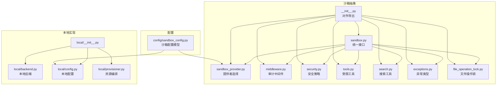
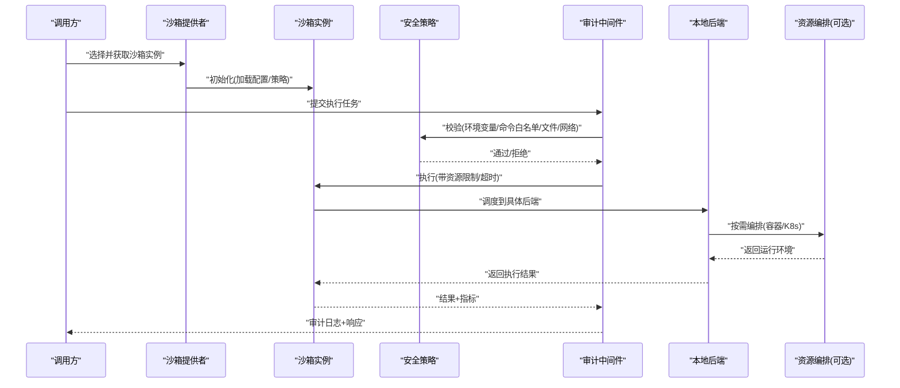
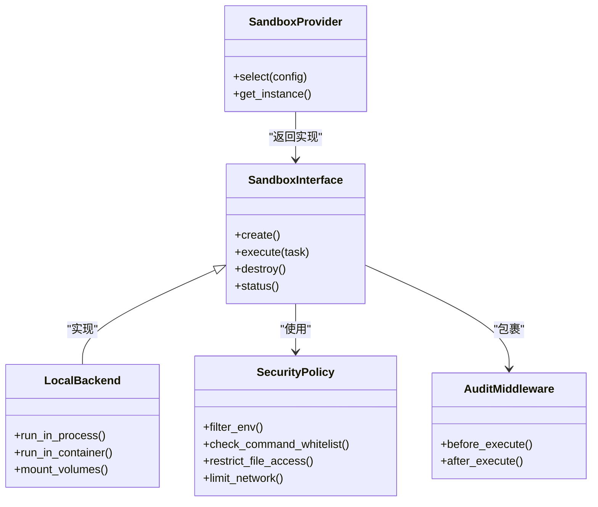
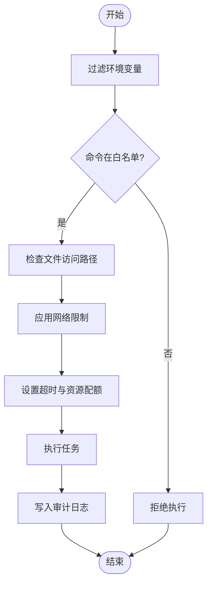
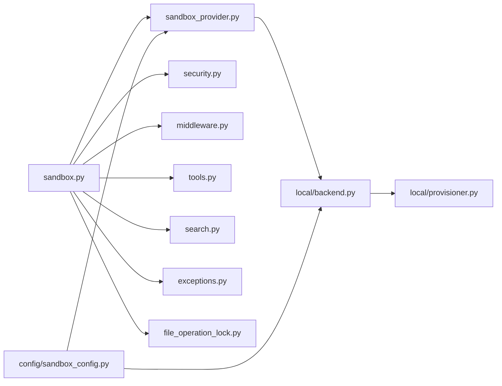
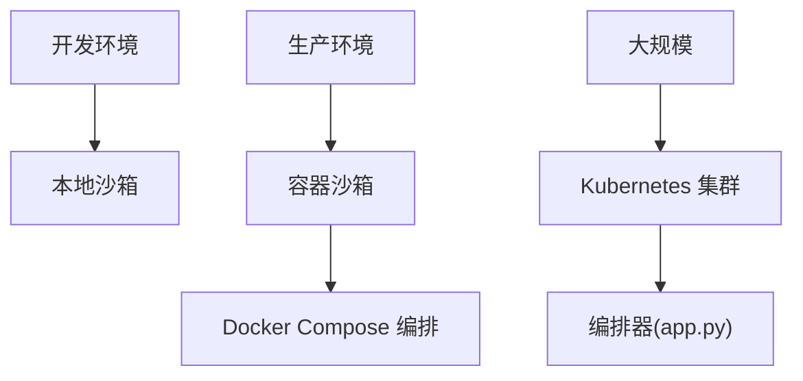

# 沙箱组件文档

<cite>
**本文引用的文件**   
- [sandbox.py](file://backend/packages/harness/deerflow/sandbox/sandbox.py)
- [sandbox_provider.py](file://backend/packages/harness/deerflow/sandbox/sandbox_provider.py)
- [security.py](file://backend/packages/harness/deerflow/sandbox/security.py)
- [middleware.py](file://backend/packages/harness/deerflow/sandbox/middleware.py)
- [tools.py](file://backend/packages/harness/deerflow/sandbox/tools.py)
- [exceptions.py](file://backend/packages/harness/deerflow/sandbox/exceptions.py)
- [search.py](file://backend/packages/harness/deerflow/sandbox/search.py)
- [file_operation_lock.py](file://backend/packages/harness/deerflow/sandbox/file_operation_lock.py)
- [__init__.py](file://backend/packages/harness/deerflow/sandbox/__init__.py)
- [local/__init__.py](file://backend/packages/harness/deerflow/sandbox/local/__init__.py)
- [local/backend.py](file://backend/packages/harness/deerflow/sandbox/local/backend.py)
- [local/config.py](file://backend/packages/harness/deerflow/sandbox/local/config.py)
- [local/provisioner.py](file://backend/packages/harness/deerflow/sandbox/local/provisioner.py)
- [config/sandbox_config.py](file://backend/packages/harness/deerflow/config/sandbox_config.py)
- [test_sandbox_audit_middleware.py](file://backend/tests/test_sandbox_audit_middleware.py)
- [test_aio_sandbox.py](file://backend/tests/test_aio_sandbox.py)
- [test_aio_sandbox_local_backend.py](file://backend/tests/test_aio_sandbox_local_backend.py)
- [test_aio_sandbox_provider.py](file://backend/tests/test_aio_sandbox_provider.py)
- [test_docker_sandbox_mode_detection.py](file://backend/tests/test_docker_sandbox_mode_detection.py)
- [test_local_sandbox_encoding.py](file://backend/tests/test_local_sandbox_encoding.py)
- [test_local_sandbox_provider_mounts.py](file://backend/tests/test_local_sandbox_provider_mounts.py)
- [test_provisioner_kubeconfig.py](file://backend/tests/test_provisioner_kubeconfig.py)
- [test_provisioner_pvc_volumes.py](file://backend/tests/test_provisioner_pvc_volumes.py)
- [docker-compose.yaml](file://docker/docker-compose.yaml)
- [provisioner/app.py](file://docker/provisioner/app.py)
- [provisioner/Dockerfile](file://docker/provisioner/Dockerfile)
</cite>

## 目录
1. [简介](#简介)
2. [项目结构](#项目结构)
3. [核心组件](#核心组件)
4. [架构总览](#架构总览)
5. [详细组件分析](#详细组件分析)
6. [依赖关系分析](#依赖关系分析)
7. [性能与资源限制](#性能与资源限制)
8. [安全策略与配置](#安全策略与配置)
9. [部署与运维](#部署与运维)
10. [故障诊断与排错](#故障诊断与排错)
11. [结论](#结论)

## 简介
本文件面向 DeerFlow 的沙箱执行环境组件，系统性阐述其安全隔离机制、执行环境管理（本地、容器、Kubernetes）、资源限制体系、安全策略配置以及对比分析与最佳实践。文档旨在帮助开发者与运维人员快速理解并正确部署沙箱能力，确保在可控、可观测、可审计的前提下运行不可信代码或工具。

## 项目结构
DeerFlow 的沙箱子系统位于后端 Python 包中，围绕“抽象接口 + 多实现”的架构组织：
- 抽象层：定义统一的沙箱接口、提供者选择、中间件与安全策略入口
- 本地实现：基于进程/容器的轻量隔离，提供本地后端与配置
- 配置层：集中式沙箱配置模型
- 测试层：覆盖关键路径、模式检测、挂载卷、编码处理等

图表来源
- [sandbox.py:1-200](file://backend/packages/harness/deerflow/sandbox/sandbox.py#L1-L200)
- [sandbox_provider.py:1-200](file://backend/packages/harness/deerflow/sandbox/sandbox_provider.py#L1-L200)
- [middleware.py:1-200](file://backend/packages/harness/deerflow/sandbox/middleware.py#L1-L200)
- [security.py:1-200](file://backend/packages/harness/deerflow/sandbox/security.py#L1-L200)
- [tools.py:1-200](file://backend/packages/harness/deerflow/sandbox/tools.py#L1-L200)
- [search.py:1-200](file://backend/packages/harness/deerflow/sandbox/search.py#L1-L200)
- [exceptions.py:1-200](file://backend/packages/harness/deerflow/sandbox/exceptions.py#L1-L200)
- [file_operation_lock.py:1-200](file://backend/packages/harness/deerflow/sandbox/file_operation_lock.py#L1-L200)
- [__init__.py:1-200](file://backend/packages/harness/deerflow/sandbox/__init__.py#L1-L200)
- [local/__init__.py:1-200](file://backend/packages/harness/deerflow/sandbox/local/__init__.py#L1-L200)
- [local/backend.py:1-200](file://backend/packages/harness/deerflow/sandbox/local/backend.py#L1-L200)
- [local/config.py:1-200](file://backend/packages/harness/deerflow/sandbox/local/config.py#L1-L200)
- [local/provisioner.py:1-200](file://backend/packages/harness/deerflow/sandbox/local/provisioner.py#L1-L200)
- [config/sandbox_config.py:1-200](file://backend/packages/harness/deerflow/config/sandbox_config.py#L1-L200)

章节来源
- [sandbox.py:1-200](file://backend/packages/harness/deerflow/sandbox/sandbox.py#L1-L200)
- [sandbox_provider.py:1-200](file://backend/packages/harness/deerflow/sandbox/sandbox_provider.py#L1-L200)
- [config/sandbox_config.py:1-200](file://backend/packages/harness/deerflow/config/sandbox_config.py#L1-L200)

## 核心组件
- 沙箱抽象接口：定义创建、销毁、执行任务、状态查询、资源清理等统一方法，屏蔽底层差异
- 提供者选择器：根据运行时环境与配置动态选择本地或远程实现
- 审计中间件：在执行前后记录调用上下文、输入输出摘要、耗时与结果码，便于追踪与合规
- 安全策略：环境变量过滤、命令白名单、文件系统访问控制、网络限制、超时与配额
- 受限工具集：对文件、搜索、网络等高危能力进行封装与约束
- 本地后端：提供进程级或容器级的本地执行环境，支持卷挂载、镜像拉取、资源限制
- 配置模型：集中描述沙箱类型、资源配额、超时、白名单、审计开关等

章节来源
- [sandbox.py:1-200](file://backend/packages/harness/deerflow/sandbox/sandbox.py#L1-L200)
- [sandbox_provider.py:1-200](file://backend/packages/harness/deerflow/sandbox/sandbox_provider.py#L1-L200)
- [middleware.py:1-200](file://backend/packages/harness/deerflow/sandbox/middleware.py#L1-L200)
- [security.py:1-200](file://backend/packages/harness/deerflow/sandbox/security.py#L1-L200)
- [tools.py:1-200](file://backend/packages/harness/deerflow/sandbox/tools.py#L1-L200)
- [config/sandbox_config.py:1-200](file://backend/packages/harness/deerflow/config/sandbox_config.py#L1-L200)

## 架构总览
下图展示沙箱从请求进入、策略校验、执行到审计记录的完整流程，以及不同后端（本地/容器/K8s）的选择与资源编排。

图表来源
- [sandbox_provider.py:1-200](file://backend/packages/harness/deerflow/sandbox/sandbox_provider.py#L1-L200)
- [sandbox.py:1-200](file://backend/packages/harness/deerflow/sandbox/sandbox.py#L1-L200)
- [middleware.py:1-200](file://backend/packages/harness/deerflow/sandbox/middleware.py#L1-L200)
- [security.py:1-200](file://backend/packages/harness/deerflow/sandbox/security.py#L1-L200)
- [local/backend.py:1-200](file://backend/packages/harness/deerflow/sandbox/local/backend.py#L1-L200)
- [local/provisioner.py:1-200](file://backend/packages/harness/deerflow/sandbox/local/provisioner.py#L1-L200)

## 详细组件分析

### 沙箱抽象与提供者
- 抽象接口：统一生命周期管理与执行语义，屏蔽本地/容器/K8s差异
- 提供者：依据配置与环境变量选择具体实现；支持热切换与降级
- 错误与异常：定义标准化异常类型，便于上层统一处理

图表来源
- [sandbox.py:1-200](file://backend/packages/harness/deerflow/sandbox/sandbox.py#L1-L200)
- [sandbox_provider.py:1-200](file://backend/packages/harness/deerflow/sandbox/sandbox_provider.py#L1-L200)
- [local/backend.py:1-200](file://backend/packages/harness/deerflow/sandbox/local/backend.py#L1-L200)
- [security.py:1-200](file://backend/packages/harness/deerflow/sandbox/security.py#L1-L200)
- [middleware.py:1-200](file://backend/packages/harness/deerflow/sandbox/middleware.py#L1-L200)

章节来源
- [sandbox.py:1-200](file://backend/packages/harness/deerflow/sandbox/sandbox.py#L1-L200)
- [sandbox_provider.py:1-200](file://backend/packages/harness/deerflow/sandbox/sandbox_provider.py#L1-L200)
- [exceptions.py:1-200](file://backend/packages/harness/deerflow/sandbox/exceptions.py#L1-L200)

### 安全策略与审计
- 环境变量过滤：仅允许白名单变量注入，防止敏感信息泄露
- 命令白名单：限制可执行命令集合，拦截危险系统调用
- 文件访问控制：限定读写路径范围，禁止越权访问
- 网络限制：默认阻断外网，仅允许受控域名/端口
- 审计中间件：记录执行上下文、输入摘要、输出摘要、耗时、状态码与错误码

图表来源
- [security.py:1-200](file://backend/packages/harness/deerflow/sandbox/security.py#L1-L200)
- [middleware.py:1-200](file://backend/packages/harness/deerflow/sandbox/middleware.py#L1-L200)

章节来源
- [security.py:1-200](file://backend/packages/harness/deerflow/sandbox/security.py#L1-L200)
- [middleware.py:1-200](file://backend/packages/harness/deerflow/sandbox/middleware.py#L1-L200)

### 受限工具与搜索
- 受限工具：对文件、搜索、网络等能力进行封装，强制走沙箱策略
- 搜索工具：在沙箱内执行受限搜索，避免直接暴露外部 API 密钥

章节来源
- [tools.py:1-200](file://backend/packages/harness/deerflow/sandbox/tools.py#L1-L200)
- [search.py:1-200](file://backend/packages/harness/deerflow/sandbox/search.py#L1-L200)

### 本地后端与资源编排
- 本地后端：支持进程级与容器级执行，提供卷挂载、镜像管理、资源限制
- 资源编排：在需要时拉起容器或 Pod，分配 CPU/内存/磁盘配额，设置超时与隔离策略

章节来源
- [local/backend.py:1-200](file://backend/packages/harness/deerflow/sandbox/local/backend.py#L1-L200)
- [local/provisioner.py:1-200](file://backend/packages/harness/deerflow/sandbox/local/provisioner.py#L1-L200)
- [local/config.py:1-200](file://backend/packages/harness/deerflow/sandbox/local/config.py#L1-L200)

## 依赖关系分析
- 模块耦合：沙箱抽象与提供者低耦合，本地后端作为具体实现；安全策略与审计中间件为横切关注点
- 外部依赖：容器运行时（Docker）、Kubernetes 客户端（可选）、文件系统锁
- 潜在循环：通过分层与接口解耦避免循环依赖

图表来源
- [sandbox.py:1-200](file://backend/packages/harness/deerflow/sandbox/sandbox.py#L1-L200)
- [sandbox_provider.py:1-200](file://backend/packages/harness/deerflow/sandbox/sandbox_provider.py#L1-L200)
- [local/backend.py:1-200](file://backend/packages/harness/deerflow/sandbox/local/backend.py#L1-L200)
- [local/provisioner.py:1-200](file://backend/packages/harness/deerflow/sandbox/local/provisioner.py#L1-L200)
- [config/sandbox_config.py:1-200](file://backend/packages/harness/deerflow/config/sandbox_config.py#L1-L200)

章节来源
- [sandbox.py:1-200](file://backend/packages/harness/deerflow/sandbox/sandbox.py#L1-L200)
- [sandbox_provider.py:1-200](file://backend/packages/harness/deerflow/sandbox/sandbox_provider.py#L1-L200)
- [config/sandbox_config.py:1-200](file://backend/packages/harness/deerflow/config/sandbox_config.py#L1-L200)

## 性能与资源限制
- CPU/内存配额：通过本地后端与编排器在进程或容器层面施加限制，避免资源争用
- 磁盘空间控制：限制工作目录大小与临时文件增长，配合卷挂载策略
- 超时管理：为单次执行设置硬超时，防止长时间占用资源
- 并发与队列：结合中间件与提供者实现限流与排队，保障稳定性
- 缓存与复用：对只读镜像与公共依赖进行缓存，缩短冷启动时间

[本节为通用指导，不直接分析具体文件]

## 安全策略与配置
- 环境变量过滤：仅注入必要变量，严格白名单校验
- 命令白名单：限制可执行命令集合，拦截危险系统调用
- 文件操作审计：记录所有文件读写路径与操作类型，支持告警
- 网络限制：默认拒绝出站连接，按域名/端口放行受控服务
- 配置模型：集中化沙箱配置，支持按租户/任务维度差异化策略

章节来源
- [security.py:1-200](file://backend/packages/harness/deerflow/sandbox/security.py#L1-L200)
- [config/sandbox_config.py:1-200](file://backend/packages/harness/deerflow/config/sandbox_config.py#L1-L200)

## 部署与运维
- 本地沙箱：适用于开发调试，启用最小权限与基础审计
- 容器沙箱：生产推荐，利用容器隔离与镜像缓存提升安全性与性能
- Kubernetes 集群：大规模场景下使用 Pod 隔离与 PVC 持久化存储，结合编排器自动扩缩容
- Docker Compose：快速搭建包含沙箱编排服务的集成环境

图表来源
- [docker-compose.yaml:1-200](file://docker/docker-compose.yaml#L1-L200)
- [provisioner/app.py:1-200](file://docker/provisioner/app.py#L1-L200)
- [provisioner/Dockerfile:1-200](file://docker/provisioner/Dockerfile#L1-L200)

章节来源
- [docker-compose.yaml:1-200](file://docker/docker-compose.yaml#L1-L200)
- [provisioner/app.py:1-200](file://docker/provisioner/app.py#L1-L200)
- [provisioner/Dockerfile:1-200](file://docker/provisioner/Dockerfile#L1-L200)

## 故障诊断与排错
- 审计日志：通过中间件输出的审计记录定位失败原因与瓶颈
- 模式检测：验证是否处于容器/本地模式，确认策略生效
- 编码问题：排查本地沙箱编码导致的乱码或解析失败
- 挂载卷：确认卷挂载路径与权限是否正确
- K8s 配置：校验 kubeconfig 与 PVC 卷绑定状态

章节来源
- [test_sandbox_audit_middleware.py:1-200](file://backend/tests/test_sandbox_audit_middleware.py#L1-L200)
- [test_docker_sandbox_mode_detection.py:1-200](file://backend/tests/test_docker_sandbox_mode_detection.py#L1-L200)
- [test_local_sandbox_encoding.py:1-200](file://backend/tests/test_local_sandbox_encoding.py#L1-L200)
- [test_local_sandbox_provider_mounts.py:1-200](file://backend/tests/test_local_sandbox_provider_mounts.py#L1-L200)
- [test_provisioner_kubeconfig.py:1-200](file://backend/tests/test_provisioner_kubeconfig.py#L1-L200)
- [test_provisioner_pvc_volumes.py:1-200](file://backend/tests/test_provisioner_pvc_volumes.py#L1-L200)

## 结论
DeerFlow 的沙箱组件以抽象接口为核心，结合本地后端与编排器，实现了灵活且安全的执行环境管理。通过环境变量过滤、命令白名单、文件与网络限制、审计中间件与资源配额，能够在开发与生产环境中提供一致的安全基线。建议在生产优先采用容器或 Kubernetes 方案，并结合审计与监控完善可观测性，持续优化性能与稳定性。