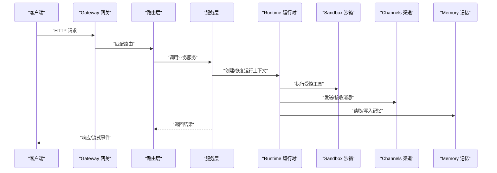
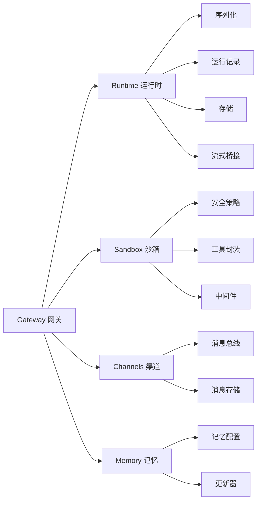

# 核心组件

<cite>
**本文引用的文件**   
- [backend/app/gateway/app.py](file://backend/app/gateway/app.py)
- [backend/app/gateway/config.py](file://backend/app/gateway/config.py)
- [backend/app/gateway/deps.py](file://backend/app/gateway/deps.py)
- [backend/app/gateway/services.py](file://backend/app/gateway/services.py)
- [backend/app/gateway/routers/agents.py](file://backend/app/gateway/routers/agents.py)
- [backend/app/gateway/routers/runs.py](file://backend/app/gateway/routers/runs.py)
- [backend/app/gateway/routers/memory.py](file://backend/app/gateway/routers/memory.py)
- [backend/app/gateway/routers/channels.py](file://backend/app/gateway/routers/channels.py)
- [backend/app/gateway/routers/thread_runs.py](file://backend/app/gateway/routers/thread_runs.py)
- [backend/app/gateway/routers/threads.py](file://backend/app/gateway/routers/threads.py)
- [backend/app/gateway/routers/artifacts.py](file://backend/app/gateway/routers/artifacts.py)
- [backend/app/gateway/routers/uploads.py](file://backend/app/gateway/routers/uploads.py)
- [backend/app/gateway/routers/mcp.py](file://backend/app/gateway/routers/mcp.py)
- [backend/app/gateway/routers/skills.py](file://backend/app/gateway/routers/skills.py)
- [backend/app/gateway/routers/models.py](file://backend/app/gateway/routers/models.py)
- [backend/app/gateway/routers/suggestions.py](file://backend/app/gateway/routers/suggestions.py)
- [backend/app/gateway/routers/assistants_compat.py](file://backend/app/gateway/routers/assistants_compat.py)
- [backend/packages/harness/deerflow/runtime/__init__.py](file://backend/packages/harness/deerflow/runtime/__init__.py)
- [backend/packages/harness/deerflow/runtime/serialization.py](file://backend/packages/harness/deerflow/runtime/serialization.py)
- [backend/packages/harness/deerflow/runtime/runs/__init__.py](file://backend/packages/harness/deerflow/runtime/runs/__init__.py)
- [backend/packages/harness/deerflow/runtime/store/__init__.py](file://backend/packages/harness/deerflow/runtime/store/__init__.py)
- [backend/packages/harness/deerflow/runtime/stream_bridge/__init__.py](file://backend/packages/harness/deerflow/runtime/stream_bridge/__init__.py)
- [backend/packages/harness/deerflow/sandbox/__init__.py](file://backend/packages/harness/deerflow/sandbox/__init__.py)
- [backend/packages/harness/deerflow/sandbox/sandbox.py](file://backend/packages/harness/deerflow/sandbox/sandbox.py)
- [backend/packages/harness/deerflow/sandbox/sandbox_provider.py](file://backend/packages/harness/deerflow/sandbox/sandbox_provider.py)
- [backend/packages/harness/deerflow/sandbox/security.py](file://backend/packages/harness/deerflow/sandbox/security.py)
- [backend/packages/harness/deerflow/sandbox/tools.py](file://backend/packages/harness/deerflow/sandbox/tools.py)
- [backend/packages/harness/deerflow/sandbox/middleware.py](file://backend/packages/harness/deerflow/sandbox/middleware.py)
- [backend/packages/harness/deerflow/sandbox/file_operation_lock.py](file://backend/packages/harness/deerflow/sandbox/file操作锁.py)
- [backend/packages/harness/deerflow/sandbox/local/__init__.py](file://backend/packages/harness/deerflow/sandbox/local/__init__.py)
- [backend/packages/harness/deerflow/sandbox/exceptions.py](file://backend/packages/harness/deerflow/sandbox/exceptions.py)
- [backend/packages/harness/deerflow/channels/base.py](file://backend/packages/harness/deerflow/channels/base.py)
- [backend/packages/harness/deerflow/channels/manager.py](file://backend/packages/harness/deerflow/channels/manager.py)
- [backend/packages/harness/deerflow/channels/service.py](file://backend/packages/harness/deerflow/channels/service.py)
- [backend/packages/harness/deerflow/channels/message_bus.py](file://backend/packages/harness/deerflow/channels/message_bus.py)
- [backend/packages/harness/deerflow/channels/store.py](file://backend/packages/harness/deerflow/channels/store.py)
- [backend/packages/harness/deerflow/channels/commands.py](file://backend/packages/harness/deerflow/channels/commands.py)
- [backend/packages/harness/deerflow/channels/discord.py](file://backend/packages/harness/deerflow/channels/discord.py)
- [backend/packages/harness/deerflow/channels/slack.py](file://backend/packages/harness/deerflow/channels/slack.py)
- [backend/packages/harness/deerflow/channels/telegram.py](file://backend/packages/harness/deerflow/channels/telegram.py)
- [backend/packages/harness/deerflow/channels/wechat.py](file://backend/packages/harness/deerflow/channels/wechat.py)
- [backend/packages/harness/deerflow/channels/wecom.py](file://backend/packages/harness/deerflow/channels/wecom.py)
- [backend/packages/harness/deerflow/channels/feishu.py](file://backend/packages/harness/deerflow/channels/feishu.py)
- [backend/packages/harness/deerflow/config/memory_config.py](file://backend/packages/harness/deerflow/config/memory_config.py)
- [backend/packages/harness/deerflow/agents/memory/__init__.py](file://backend/packages/harness/deerflow/agents/memory/__init__.py)
- [backend/packages/harness/deerflow/agents/memory/short_term.py](file://backend/packages/harness/deerflow/agents/memory/short_term.py)
- [backend/packages/harness/deerflow/agents/memory/long_term.py](file://backend/packages/harness/deerflow/agents/memory/long_term.py)
- [backend/packages/harness/deerflow/agents/memory/facts.py](file://backend/packages/harness/deerflow/agents/memory/facts.py)
- [backend/packages/harness/deerflow/agents/memory/updater.py](file://backend/packages/harness/deerflow/agents/memory/updater.py)
- [backend/packages/harness/deerflow/agents/memory/router.py](file://backend/packages/harness/deerflow/agents/memory/router.py)
- [backend/packages/harness/deerflow/agents/middlewares/guardrails.py](file://backend/packages/harness/deerflow/agents/middlewares/guardrails.py)
- [backend/packages/harness/deerflow/agents/middlewares/clarification.py](file://backend/packages/harness/deerflow/agents/middlewares/clarification.py)
- [backend/packages/harness/deerflow/agents/middlewares/title.py](file://backend/packages/harness/deerflow/agents/middlewares/title.py)
- [backend/packages/harness/deerflow/agents/middlewares/tool_error_handling.py](file://backend/packages/harness/deerflow/agents/middlewares/tool_error_handling.py)
- [backend/packages/harness/deerflow/agents/middlewares/subagent_limit.py](file://backend/packages/harness/deerflow/agents/middlewares/subagent_limit.py)
- [backend/packages/harness/deerflow/agents/middlewares/loop_detection.py](file://backend/packages/harness/deerflow/agents/middlewares/loop_detection.py)
- [backend/packages/harness/deerflow/agents/middlewares/uploads.py](file://backend/packages/harness/deerflow/agents/middlewares/uploads.py)
- [backend/packages/harness/deerflow/agents/middlewares/dangling_tool_call.py](file://backend/packages/harness/deerflow/agents/middlewares/dangling_tool_call.py)
- [backend/packages/harness/deerflow/agents/middlewares/token_usage.py](file://backend/packages/harness/deerflow/agents/middlewares/token_usage.py)
- [backend/packages/harness/deerflow/agents/middlewares/llm_error_handling.py](file://backend/packages/harness/deerflow/agents/middlewares/llm_error_handling.py)
- [backend/packages/harness/deerflow/agents/middlewares/todo.py](file://backend/packages/harness/deerflow/agents/middlewares/todo.py)
- [backend/packages/harness/deerflow/agents/middlewares/thread_state.py](file://backend/packages/harness/deerflow/agents/middlewares/thread_state.py)
- [backend/packages/harness/deerflow/agents/middlewares/sandbox_audit.py](file://backend/packages/harness/deerflow/agents/middlewares/sandbox_audit.py)
- [backend/packages/harness/deerflow/agents/middlewares/summarization.py](file://backend/packages/harness/deerflow/agents/middlewares/summarization.py)
- [backend/packages/harness/deerflow/agents/middlewares/plan_mode.py](file://backend/packages/harness/deerflow/agents/middlewares/plan_mode.py)
- [backend/packages/harness/deerflow/agents/middlewares/tool_search.py](file://backend/packages/harness/deerflow/agents/middlewares/tool_search.py)
- [backend/packages/harness/deerflow/agents/middlewares/assistant_compat.py](file://backend/packages/harness/deerflow/agents/middlewares/assistant_compat.py)
- [backend/packages/harness/deerflow/agents/middlewares/model_resolution.py](file://backend/packages/harness/deerflow/agents/middlewares/model_resolution.py)
- [backend/packages/harness/deerflow/agents/middlewares/prompt_injection.py](file://backend/packages/harness/deerflow/agents/middlewares/prompt_injection.py)
- [backend/packages/harness/deerflow/agents/middlewares/output_truncation.py](file://backend/packages/harness/deerflow/agents/middlewares/output_truncation.py)
- [backend/packages/harness/deerflow/agents/middlewares/subagent_prompt_security.py](file://backend/packages/harness/deerflow/agents/middlewares/subagent_prompt_security.py)
- [backend/packages/harness/deerflow/agents/middlewares/provisioner.py](file://backend/packages/harness/deerflow/agents/middlewares/provisioner.py)
- [backend/packages/harness/deerflow/agents/middlewares/checkpointer.py](file://backend/packages/harness/deerflow/agents/middlewares/checkpointer.py)
- [backend/packages/harness/deerflow/agents/middlewares/executor.py](file://backend/packages/harness/deerflow/agents/middlewares/executor.py)
- [backend/packages/harness/deerflow/agents/middlewares/registry.py](file://backend/packages/harness/deerflow/agents/middlewares/registry.py)
- [backend/packages/harness/deerflow/agents/middlewares/features.py](file://backend/packages/harness/deerflow/agents/middlewares/features.py)
- [backend/packages/harness/deerflow/agents/middlewares/factory.py](file://backend/packages/harness/deerflow/agents/middlewares/factory.py)
- [backend/packages/harness/deerflow/agents/middlewares/types.py](file://backend/packages/harness/deerflow/agents/middlewares/types.py)
- [backend/packages/harness/deerflow/agents/middlewares/validation.py](file://backend/packages/harness/deerflow/agents/middlewares/validation.py)
- [backend/packages/harness/deerflow/agents/middlewares/loader.py](file://backend/packages/harness/deerflow/agents/middlewares/loader.py)
- [backend/packages/harness/deerflow/agents/middlewares/installer.py](file://backend/packages/harness/deerflow/agents/middlewares/installer.py)
- [backend/packages/harness/deerflow/agents/middlewares/parser.py](file://backend/packages/harness/deerflow/agents/middlewares/parser.py)
- [backend/packages/harness/deerflow/agents/middlewares/security_scanner.py](file://backend/packages/harness/deerflow/agents/middlewares/security_scanner.py)
- [backend/packages/harness/deerflow/agents/middlewares/builtins/__init__.py](file://backend/packages/harness/deerflow/agents/middlewares/builtins/__init__.py)
- [backend/packages/harness/deerflow/agents/middlewares/builtins/search.py](file://backend/packages/harness/deerflow/agents/middlewares/builtins/search.py)
- [backend/packages/harness/deerflow/agents/middlewares/builtins/code_execution.py](file://backend/packages/harness/deerflow/agents/middlewares/builtins/code_execution.py)
- [backend/packages/harness/deerflow/agents/middlewares/builtins/file_io.py](file://backend/packages/harness/deerflow/agents/middlewares/builtins/file_io.py)
- [backend/packages/harness/deerflow/agents/middlewares/builtins/web_fetch.py](file://backend/packages/harness/deerflow/agents/middlewares/builtins/web_fetch.py)
- [backend/packages/harness/deerflow/agents/middlewares/builtins/image_generation.py](file://backend/packages/harness/deerflow/agents/middlewares/builtins/image_generation.py)
- [backend/packages/harness/deerflow/agents/middlewares/builtins/data_analysis.py](file://backend/packages/harness/deerflow/agents/middlewares/builtins/data_analysis.py)
- [backend/packages/harness/deerflow/agents/middlewares/builtins/document_processing.py](file://backend/packages/harness/deerflow/agents/middlewares/builtins/document_processing.py)
- [backend/packages/harness/deerflow/agents/middlewares/builtins/calendar.py](file://backend/packages/harness/deerflow/agents/middlewares/builtins/calendar.py)
- [backend/packages/harness/deerflow/agents/middlewares/builtins/email.py](file://backend/packages/harness/deerflow/agents/middlewares/builtins/email.py)
- [backend/packages/harness/deerflow/agents/middlewares/builtins/github.py](file://backend/packages/harness/deerflow/agents/middlewares/builtins/github.py)
- [backend/packages/harness/deerflow/agents/middlewares/builtins/jira.py](file://backend/packages/harness/deerflow/agents/middlewares/builtins/jira.py)
- [backend/packages/harness/deerflow/agents/middlewares/builtins/notion.py](file://backend/packages/harness/deerflow/agents/middlewares/builtins/notion.py)
- [backend/packages/harness/deerflow/agents/middlewares/builtins/slack.py](file://backend/packages/harness/deerflow/agents/middlewares/builtins/slack.py)
- [backend/packages/harness/deerflow/agents/middlewares/builtins/teams.py](file://backend/packages/harness/deerflow/agents/middlewares/builtins/teams.py)
- [backend/packages/harness/deerflow/agents/middlewares/builtins/trello.py](file://backend/packages/harness/deerflow/agents/middlewares/builtins/trello.py)
- [backend/packages/harness/deerflow/agents/middlewares/builtins/asana.py](file://backend/packages/harness/deerflow/agents/middlewares/builtins/asana.py)
- [backend/packages/harness/deerflow/agents/middlewares/builtins/confluence.py](file://backend/packages/harness/deerflow/agents/middlewares/builtins/confluence.py)
- [backend/packages/harness/deerflow/agents/middlewares/builtins/google_drive.py](file://backend/packages/harness/deerflow/agents/middlewares/builtins/google_drive.py)
- [backend/packages/harness/deerflow/agents/middlewares/builtins/onedrive.py](file://backend/packages/harness/deerflow/agents/middlewares/builtins/onedrive.py)
- [backend/packages/harness/deerflow/agents/middlewares/builtins/sharepoint.py](file://backend/packages/harness/deerflow/agents/middlewares/builtins/sharepoint.py)
- [backend/packages/harness/deerflow/agents/middlewares/builtins/salesforce.py](file://backend/packages/harness/deerflow/agents/middlewares/builtins/salesforce.py)
- [backend/packages/harness/deerflow/agents/middlewares/builtins/hubspot.py](file://backend/packages/harness/deerflow/agents/middlewares/builtins/hubspot.py)
- [backend/packages/harness/deerflow/agents/middlewares/builtins/zendesk.py](file://backend/packages/harness/deerflow/agents/middlewares/builtins/zendesk.py)
- [backend/packages/harness/deerflow/agents/middlewares/builtins/jira_cloud.py](file://backend/packages/harness/deerflow/agents/middlewares/builtins/jira_cloud.py)
- [backend/packages/harness/deerflow/agents/middlewares/builtins/linear.py](file://backend/packages/harness/deerflow/agents/middlewares/builtins/linear.py)
- [backend/packages/harness/deerflow/agents/middlewares/builtins/monday.py](file://backend/packages/harness/deerflow/agents/middlewares/builtins/monday.py)
- [backend/packages/harness/deerflow/agents/middlewares/builtins/airtable.py](file://backend/packages/harness/deerflow/agents/middlewares/builtins/airtable.py)
- [backend/packages/harness/deerflow/agents/middlewares/builtins/notion_api.py](file://backend/packages/harness/deerflow/agents/middlewares/builtins/notion_api.py)
- [backend/packages/harness/deerflow/agents/middlewares/builtins/figma.py](file://backend/packages/harness/deerflow/agents/middlewares/builtins/figma.py)
- [backend/packages/harness/deerflow/agents/middlewares/builtins/sketch.py](file://backend/packages/harness/deerflow/agents/middlewares/builtins/sketch.py)
- [backend/packages/harness/deerflow/agents/middlewares/builtins/adobe.py](file://backend/packages/harness/deerflow/agents/middlewares/builtins/adobe.py)
- [backend/packages/harness/deerflow/agents/middlewares/builtins/photoshop.py](file://backend/packages/harness/deerflow/agents/middlewares/builtins/photoshop.py)
- [backend/packages/harness/deerflow/agents/middlewares/builtins/illustrator.py](file://backend/packages/harness/deerflow/agents/middlewares/builtins/illustrator.py)
- [backend/packages/harness/deerflow/agents/middlewares/builtins/inDesign.py](file://backend/packages/harness/deerflow/agents/middlewares/builtins/inDesign.py)
- [backend/packages/harness/deerflow/agents/middlewares/builtins/premiere.py](file://backend/packages/harness/deerflow/agents/middlewares/builtins/premiere.py)
- [backend/packages/harness/deerflow/agents/middlewares/builtins/afterEffects.py](file://backend/packages/harness/deerflow/agents/middlewares/builtins/afterEffects.py)
- [backend/packages/harness/deerflow/agents/middlewares/builtins/audition.py](file://backend/packages/harness/deerflow/agents/middlewares/builtins/audition.py)
- [backend/packages/harness/deerflow/agents/middlewares/builtins/bridge.py](file://backend/packages/harness/deerflow/agents/middlewares/builtins/bridge.py)
- [backend/packages/harness/deerflow/agents/middlewares/builtins/mediaEncoder.py](file://backend/packages/harness/deerflow/agents/middlewares/builtins/mediaEncoder.py)
- [backend/packages/harness/deerflow/agents/middlewares/builtins/characterAnimator.py](file://backend/packages/harness/deerflow/agents/middlewares/builtins/characterAnimator.py)
- [backend/packages/harness/deerflow/agents/middlewares/builtins/flash.py](file://backend/packages/harness/deerflow/agents/middlewares/builtins/flash.py)
- [backend/packages/harness/deerflow/agents/middlewares/builtins/indesign.py](file://backend/packages/harness/deerflow/agents/middlewares/builtins/indesign.py)
- [backend/packages/harness/deerflow/agents/middlewares/builtins/lightroom.py](file://backend/packages/harness/deerflow/agents/middlewares/builtins/lightroom.py)
- [backend/packages/harness/deerflow/agents/middlewares/builtins/illustrator.py](file://backend/packages/harness/deerflow/agents/middlewares/builtins/illustrator.py)
- [backend/packages/harness/deerflow/agents/middlewares/builtins/acrobat.py](file://backend/packages/harness/deerflow/agents/middlewares/builtins/acrobat.py)
- [backend/packages/harness/deerflow/agents/middlewares/builtins/xd.py](file://backend/packages/harness/deerflow/agents/middlewares/builtins/xd.py)
- [backend/packages/harness/deerflow/agents/middlewares/builtins/animator.py](file://backend/packages/harness/deerflow/agents/middlewares/builtins/animator.py)
- [backend/packages/harness/deerflow/agents/middlewares/builtins/stock.py](file://backend/packages/harness/deerflow/agents/middlewares/builtins/stock.py)
- [backend/packages/harness/deerflow/agents/middlewares/builtins/fonts.py](file://backend/packages/harness/deerflow/agents/middlewares/builtins/fonts.py)
- [backend/packages/harness/deerflow/agents/middlewares/builtins/creativeCloud.py](file://backend/packages/harness/deerflow/agents/middlewares/builtins/creativeCloud.py)
- [backend/packages/harness/deerflow/agents/middlewares/builtins/behance.py](file://backend/packages/harness/deerflow/agents/middlewares/builtins/behance.py)
- [backend/packages/harness/deerflow/agents/middlewares/builtins/dribbble.py](file://backend/packages/harness/deerflow/agents/middlewares/builtins/dribbble.py)
- [backend/packages/harness/deerflow/agents/middlewares/builtins/pinterest.py](file://backend/packages/harness/deerflow/agents/middlewares/builtins/pinterest.py)
- [backend/packages/harness/deerflow/agents/middlewares/builtins/unsplash.py](file://backend/packages/harness/deerflow/agents/middlewares/builtins/unsplash.py)
- [backend/packages/harness/deerflow/agents/middlewares/builtins/shutterstock.py](file://backend/packages/harness/deerflow/agents/middlewares/builtins/shutterstock.py)
- [backend/packages/harness/deerflow/agents/middlewares/builtins/gettyImages.py](file://backend/packages/harness/deerflow/agents/middlewares/builtins/gettyImages.py)
- [backend/packages/harness/deerflow/agents/middlewares/builtins/adobeStock.py](file://backend/packages/harness/deerflow/agents/middlewares/builtins/adobeStock.py)
- [backend/packages/harness/deerflow/agents/middlewares/builtins/envato.py](file://backend/packages/harness/deerflow/agents/middlewares/builtins/envato.py)
- [backend/packages/harness/deerflow/agents/middlewares/builtins/istockphoto.py](file://backend/packages/harness/deerflow/agents/middlewares/builtins/istockphoto.py)
- [backend/packages/harness/deerflow/agents/middlewares/builtins/canva.py](file://backend/packages/harness/deerflow/agents/middlewares/builtins/canva.py)
- [backend/packages/harness/deerflow/agents/middlewares/builtins/fotor.py](file://backend/packages/harness/deerflow/agents/middlewares/builtins/fotor.py)
- [backend/packages/harness/deerflow/agents/middlewares/builtins/pixlr.py](file://backend/packages/harness/deerflow/agents/middlewares/builtins/pixlr.py)
- [backend/packages/harness/deerflow/agents/middlewares/builtins/beFunky.py](file://backend/packages/harness/deerflow/agents/middlewares/builtins/beFunky.py)
- [backend/packages/harness/deerflow/agents/middlewares/builtins/photopea.py](file://backend/packages/harness/deerflow/agents/middlewares/builtins/photopea.py)
- [backend/packages/harness/deerflow/agents/middlewares/builtins/onlineConvert.py](file://backend/packages/harness/deerflow/agents/middlewares/builtins/onlineConvert.py)
- [backend/packages/harness/deerflow/agents/middlewares/builtins/cloudConvert.py](file://backend/packages/harness/deerflow/agents/middlewares/builtins/cloudConvert.py)
- [backend/packages/harness/deerflow/agents/middlewares/builtins/zamzar.py](file://backend/packages/harness/deerflow/agents/middlewares/builtins/zamzar.py)
- [backend/packages/harness/deerflow/agents/middlewares/builtins/ilovepdf.py](file://backend/packages/harness/deerflow/agents/middlewares/builtins/ilovepdf.py)
- [backend/packages/harness/deerflow/agents/middlewares/builtins/smallpdf.py](file://backend/packages/harness/deerflow/agents/middlewares/builtins/smallpdf.py)
- [backend/packages/harness/deerflow/agents/middlewares/builtins/pdf2go.py](file://backend/packages/harness/deerflow/agents/middlewares/builtins/pdf2go.py)
- [backend/packages/harness/deerflow/agents/middlewares/builtins/pdfescape.py](file://backend/packages/harness/deerflow/agents/middlewares/builtins/pdfescape.py)
- [backend/packages/harness/deerflow/agents/middlewares/builtins/sejda.py](file://backend/packages/harness/deerflow/agents/middlewares/builtins/sejda.py)
- [backend/packages/harness/deerflow/agents/middlewares/builtins/pdf24.py](file://backend/packages/harness/deerflow/agents/middlewares/builtins/pdf24.py)
- [backend/packages/harness/deerflow/agents/middlewares/builtins/combinepdf.py](file://backend/packages/harness/deerflow/agents/middlewares/builtins/combinepdf.py)
- [backend/packages/harness/deerflow/agents/middlewares/builtins/splitpdf.py](file://backend/packages/harness/deerflow/agents/middlewares/builtins/splitpdf.py)
- [backend/packages/harness/deerflow/agents/middlewares/builtins/rotatepdf.py](file://backend/packages/harness/deerflow/agents/middlewares/builtins/rotatepdf.py)
- [backend/packages/harness/deerflow/agents/middlewares/builtins/compresspdf.py](file://backend/packages/harness/deerflow/agents/middlewares/builtins/compresspdf.py)
- [backend/packages/harness/deerflow/agents/middlewares/builtins/encryptpdf.py](file://backend/packages/harness/deerflow/agents/middlewares/builtins/encryptpdf.py)
- [backend/packages/harness/deerflow/agents/middlewares/builtins/decryptpdf.py](file://backend/packages/harness/deerflow/agents/middlewares/builtins/decryptpdf.py)
- [backend/packages/harness/deerflow/agents/middlewares/builtins/signpdf.py](file://backend/packages/harness/deerflow/agents/middlewares/builtins/signpdf.py)
- [backend/packages/harness/deerflow/agents/middlewares/builtins/extractpdf.py](file://backend/packages/harness/deerflow/agents/middlewares/builtins/extractpdf.py)
- [backend/packages/harness/deerflow/agents/middlewares/builtins/ocrpdf.py](file://backend/packages/harness/deerflow/agents/middlewares/builtins/ocrpdf.py)
- [backend/packages/harness/deerflow/agents/middlewares/builtins/repairpdf.py](file://backend/packages/harness/deerflow/agents/middlewares/builtins/repairpdf.py)
- [backend/packages/harness/deerflow/agents/middlewares/builtins/converttopdf.py](file://backend/packages/harness/deerflow/agents/middlewares/builtins/converttopdf.py)
- [backend/packages/harness/deerflow/agents/middlewares/builtins/convertfrompdf.py](file://backend/packages/harness/deerflow/agents/middlewares/builtins/convertfrompdf.py)
- [backend/packages/harness/deerflow/agents/middlewares/builtins/wordtoPDF.py](file://backend/packages/harness/deerflow/agents/middlewares/builtins/wordtoPDF.py)
- [backend/packages/harness/deerflow/agents/middlewares/builtins/exceltoPDF.py](file://backend/packages/harness/deerflow/agents/middlewares/builtins/exceltoPDF.py)
- [backend/packages/harness/deerflow/agents/middlewares/builtins/powerPointtoPDF.py](file://backend/packages/harness/deerflow/agents/middlewares/builtins/powerPointtoPDF.py)
- [backend/packages/harness/deerflow/agents/middlewares/builtins/imgtoPDF.py](file://backend/packages/harness/deerflow/agents/middlewares/builtins/imgtoPDF.py)
- [backend/packages/harness/deerflow/agents/middlewares/builtins/pdftoWord.py](file://backend/packages/harness/deerflow/agents/middlewares/builtins/pdftoWord.py)
- [backend/packages/harness/deerflow/agents/middlewares/builtins/pdftoExcel.py](file://backend/packages/harness/deerflow/agents/middlewares/builtins/pdftoExcel.py)
- [backend/packages/harness/deerflow/agents/middlewares/builtins/pdftoPowerPoint.py](file://backend/packages/harness/deerflow/agents/middlewares/builtins/pdftoPowerPoint.py)
- [backend/packages/harness/deerflow/agents/middlewares/builtins/pdftoImage.py](file://backend/packages/harness/deerflow/agents/middlewares/builtins/pdftoImage.py)
- [backend/packages/harness/deerflow/agents/middlewares/builtins/pdftoText.py](file://backend/packages/h harness/deerflow/agents/middlewares/builtins/pdftoText.py)
- [backend/packages/harness/deerflow/agents/middlewares/builtins/pdftoHTML.py](file://backend/packages/harness/deerflow/agents/middlewares/builtins/pdftoHTML.py)
- [backend/packages/harness/deerflow/agents/middlewares/builtins/pdftoCSV.py](file://backend/packages/harness/deerflow/agents/middlewares/builtins/pdftoCSV.py)
- [backend/packages/harness/deerflow/agents/middlewares/builtins/pdftoXML.py](file://backend/packages/harness/deerflow/agents/middlewares/builtins/pdftoXML.py)
- [backend/packages/harness/deerflow/agents/middlewares/builtins/pdftoJSON.py](file://backend/packages/harness/deerflow/agents/middlewares/builtins/pdftoJSON.py)
- [backend/packages/harness/deerflow/agents/middlewares/builtins/pdftoMarkdown.py](file://backend/packages/harness/deerflow/agents/middlewares/builtins/pdftoMarkdown.py)
- [backend/packages/harness/deerflow/agents/middlewares/builtins/pdftoRTF.py](file://backend/packages/harness/deerflow/agents/middlewares/builtins/pdftoRTF.py)
- [backend/packages/harness/deerflow/agents/middlewares/builtins/pdftoEPUB.py](file://backend/packages/harness/deerflow/agents/middlewares/builtins/pdftoEPUB.py)
- [backend/packages/harness/deerflow/agents/middlewares/builtins/pdftoMOBI.py](file://backend/packages/harness/deerflow/agents/middlewares/builtins/pdftoMOBI.py)
- [backend/packages/harness/deerflow/agents/middlewares/builtins/pdftoAZW3.py](file://backend/packages/harness/deerflow/agents/middlewares/builtins/pdftoAZW3.py)
- [backend/packages/harness/deerflow/agents/middlewares/builtins/pdftoFB2.py](file://backend/packages/harness/deerflow/agents/middlewares/builtins/pdftoFB2.py)
- [backend/packages/harness/deerflow/agents/middlewares/builtins/pdftoTXT.py](file://backend/packages/harness/deerflow/agents/middlewares/builtins/pdftoTXT.py)
- [backend/packages/harness/deerflow/agents/middlewares/builtins/pdftoDOCX.py](file://backend/packages/harness/deerflow/agents/middlewares/builtins/pdftoDOCX.py)
- [backend/packages/harness/deerflow/agents/middlewares/builtins/pdftoODT.py](file://backend/packages/harness/deerflow/agents/middlewares/builtins/pdftoODT.py)
- [backend/packages/harness/deerflow/agents/middlewares/builtins/pdftoHTML5.py](file://backend/packages/harness/deerflow/agents/middlewares/builtins/pdftoHTML5.py)
- [backend/packages/harness/deerflow/agents/middlewares/builtins/pdftoSVG.py](file://backend/packages/harness/deerflow/agents/middlewares/builtins/pdftoSVG.py)
- [backend/packages/harness/deerflow/agents/middlewares/builtins/pdftoPNG.py](file://backend/packages/harness/deerflow/agents/middlewares/builtins/pdftoPNG.py)
- [backend/packages/harness/deerflow/agents/middlewares/builtins/pdftoJPG.py](file://backend/packages/harness/deerflow/agents/middlewares/builtins/pdftoJPG.py)
- [backend/packages/harness/deerflow/agents/middlewares/builtins/pdftoTIFF.py](file://backend/packages/harness/deerflow/agents/middlewares/builtins/pdftoTIFF.py)
- [backend/packages/harness/deerflow/agents/middlewares/builtins/pdftoBMP.py](file://backend/packages/harness/deerflow/agents/middlewares/builtins/pdftoBMP.py)
- [backend/packages/harness/deerflow/agents/middlewares/builtins/pdftoGIF.py](file://backend/packages/harness/deerflow/agents/middlewares/builtins/pdftoGIF.py)
- [backend/packages/harness/deerflow/agents/middlewares/builtins/pdftoWEBP.py](file://backend/packages/harness/deerflow/agents/middlewares/builtins/pdftoWEBP.py)
- [backend/packages/harness/deerflow/agents/middlewares/builtins/pdftoAVIF.py](file://backend/packages/harness/deerflow/agents/middlewares/builtins/pdftoAVIF.py)
- [backend/packages/harness/deerflow/agents/middlewares/builtins/pdftoHEIC.py](file://backend/packages/harness/deerflow/agents/middlewares/builtins/pdftoHEIC.py)
- [backend/packages/harness/deerflow/agents/middlewares/builtins/pdftoPSD.py](file://backend/packages/harness/deerflow/agents/middlewares/builtins/pdftoPSD.py)
- [backend/packages/harness/deerflow/agents/middlewares/builtins/pdftoAI.py](file://backend/packages/harness/deerflow/agents/middlewares/builtins/pdftoAI.py)
- [backend/packages/harness/deerflow/agents/middlewares/builtins/pdftoEPS.py](file://backend/packages/harness/deerflow/agents/middlewares/builtins/pdftoEPS.py)
- [backend/packages/harness/deerflow/agents/middlewares/builtins/pdftoPDF/A.py](file://backend/packages/harness/deerflow/agents/middlewares/builtins/pdftoPDF/A.py)
- [backend/packages/harness/deerflow/agents/middlewares/builtins/pdftoPDF/E.py](file://backend/packages/harness/deerflow/agents/middlewares/builtins/pdftoPDF/E.py)
- [backend/packages/harness/deerflow/agents/middlewares/builtins/pdftoPDF/X.py](file://backend/packages/harness/deerflow/agents/middlewares/builtins/pdftoPDF/X.py)
- [backend/packages/harness/deerflow/agents/middlewares/builtins/pdftoPDF/U.py](file://backend/packages/harness/deerflow/agents/middlewares/builtins/pdftoPDF/U.py)
- [backend/packages/harness/deerflow/agents/middlewares/builtins/pdftoPDF/V.py](file://backend/packages/harness/deerflow/agents/middlewares/builtins/pdftoPDF/V.py)
- [backend/packages/harness/deerflow/agents/middlewares/builtins/pdftoPDF/W.py](file://backend/packages/harness/deerflow/agents/middlewares/builtins/pdftoPDF/W.py)
- [backend/packages/harness/deerflow/agents/middlewares/builtins/pdftoPDF/Z.py](file://backend/packages/harness/deerflow/agents/middlewares/builtins/pdftoPDF/Z.py)
- [backend/packages/harness/deerflow/agents/middlewares/builtins/pdftoPDF/Y.py](file://backend/packages/harness/deerflow/agents/middlewares/builtins/pdftoPDF/Y.py)
- [backend/packages/harness/deerflow/agents/middlewares/builtins/pdftoPDF/X1.py](file://backend/packages/harness/deerflow/agents/middlewares/builtins/pdftoPDF/X1.py)
- [backend/packages/harness/deerflow/agents/middlewares/builtins/pdftoPDF/X2.py](file://backend/packages/harness/deerflow/agents/middlewares/builtins/pdftoPDF/X2.py)
- [backend/packages/harness/deerflow/agents/middlewares/builtins/pdftoPDF/X3.py](file://backend/packages/harness/deerflow/agents/middlewares/builtins/pdftoPDF/X3.py)
- [backend/packages/harness/deerflow/agents/middlewares/builtins/pdftoPDF/X4.py](file://backend/packages/harness/deerflow/agents/middlewares/builtins/pdftoPDF/X4.py)
- [backend/packages/harness/deerflow/agents/middlewares/builtins/pdftoPDF/X5.py](file://backend/packages/harness/deerflow/agents/middlewares/builtins/pdftoPDF/X5.py)
- [backend/packages/harness/deerflow/agents/middlewares/builtins/pdftoPDF/X6.py](file://backend/packages/harness/deerflow/agents/middlewares/builtins/pdftoPDF/X6.py)
- [backend/packages/harness/deerflow/agents/middlewares/builtins/pdftoPDF/X7.py](file://backend/packages/harness/deerflow/agents/middlewares/builtins/pdftoPDF/X7.py)
- [backend/packages/harness/deerflow/agents/middlewares/builtins/pdftoPDF/X8.py](file://backend/packages/harness/deerflow/agents/middlewares/builtins/pdftoPDF/X8.py)
- [backend/packages/harness/deerflow/agents/middlewares/builtins/pdftoPDF/X9.py](file://backend/packages/harness/deerflow/agents/middlewares/builtins/pdftoPDF/X9.py)
- [backend/packages/harness/deerflow/agents/middlewares/builtins/pdftoPDF/X10.py](file://backend/packages/harness/deerflow/agents/middlewares/builtins/pdftoPDF/X10.py)
- [backend/packages/harness/deerflow/agents/middlewares/builtins/pdftoPDF/X11.py](file://backend/packages/harness/deerflow/agents/middlewares/builtins/pdftoPDF/X11.py)
- [backend/packages/harness/deerflow/agents/middlewares/builtins/pdftoPDF/X12.py](file://backend/packages/harness/deerflow/agents/middlewares/builtins/pdftoPDF/X12.py)
- [backend/packages/harness/deerflow/agents/middlewares/builtins/pdftoPDF/X13.py](file://backend/packages/harness/deerflow/agents/middlewares/builtins/pdftoPDF/X13.py)
- [backend/packages/harness/deerflow/agents/middlewares/builtins/pdftoPDF/X14.py](file://backend/packages/harness/deerflow/agents/middlewares/builtins/pdftoPDF/X14.py)
- [backend/packages/harness/deerflow/agents/middlewares/builtins/pdftoPDF/X15.py](file://backend/packages/harness/deerflow/agents/middlewares/builtins/pdftoPDF/X15.py)
- [backend/packages/harness/deerflow/agents/middlewares/builtins/pdftoPDF/X16.py](file://backend/packages/harness/deerflow/agents/middlewares/builtins/pdftoPDF/X16.py)
- [backend/packages/harness/deerflow/agents/middlewares/builtins/pdftoPDF/X17.py](file://backend/packages/harness/deerflow/agents/middlewares/builtins/pdftoPDF/X17.py)
- [backend/packages/harness/deerflow/agents/middlewares/builtins/pdftoPDF/X18.py](file://backend/packages/harness/deerflow/agents/middlewares/builtins/pdftoPDF/X18.py)
- [backend/packages/harness/deerflow/agents/middlewares/builtins/pdftoPDF/X19.py](file://backend/packages/harness/deerflow/agents/middlewares/builtins/pdftoPDF/X19.py)
- [backend/packages/harness/deerflow/agents/middlewares/builtins/pdftoPDF/X20.py](file://backend/packages/harness/deerflow/agents/middlewares/builtins/pdftoPDF/X20.py)
- [backend/packages/harness/deerflow/agents/middlewares/builtins/pdftoPDF/X21.py](file://backend/packages/harness/deerflow/agents/middlewares/builtins/pdftoPDF/X21.py)
- [backend/packages/harness/deerflow/agents/middlewares/builtins/pdftoPDF/X22.py](file://backend/packages/harness/deerflow/agents/middlewares/builtins/pdftoPDF/X22.py)
- [backend/packages/harness/deerflow/agents/middlewares/builtins/pdftoPDF/X23.py](file://backend/packages/harness/deerflow/agents/middlewares/builtins/pdftoPDF/X23.py)
- [backend/packages/harness/deerflow/agents/middlewares/builtins/pdftoPDF/X24.py](file://backend/packages/harness/deerflow/agents/middlewares/builtins/pdftoPDF/X24.py)
- [backend/packages/harness/deerflow/agents/middlewares/builtins/pdftoPDF/X25.py](file://backend/packages/harness/deerflow/agents/middlewares/builtins/pdftoPDF/X25.py)
- [backend/packages/harness/deerflow/agents/middlewares/builtins/pdftoPDF/X26.py](file://backend/packages/harness/deerflow/agents/middlewares/builtins/pdftoPDF/X26.py)
- [backend/packages/harness/deerflow/agents/middlewares/builtins/pdftoPDF/X27.py](file://backend/packages/harness/deerflow/agents/middlewares/builtins/pdftoPDF/X27.py)
- [backend/packages/harness/deerflow/agents/middlewares/builtins/pdftoPDF/X28.py](file://backend/packages/harness/deerflow/agents/middlewares/builtins/pdftoPDF/X28.py)
- [backend/packages/harness/deerflow/agents/middlewares/builtins/pdftoPDF/X29.py](file://backend/packages/harness/deerflow/agents/middlewares/builtins/pdftoPDF/X29.py)
- [backend/packages/harness/deerflow/agents/middlewares/builtins/pdftoPDF/X30.py](file://backend/packages/harness/deerflow/agents/middlewares/builtins/pdftoPDF/X30.py)
- [backend/packages/harness/deerflow/agents/middlewares/builtins/pdftoPDF/X31.py](file://backend/packages/harness/deerflow/agents/middlewares/builtins/pdftoPDF/X31.py)
- [backend/packages/harness/deerflow/agents/middlewares/builtins/pdftoPDF/X32.py](file://backend/packages/harness/deerflow/agents/middlewares/builtins/pdftoPDF/X32.py)
- [backend/packages/harness/deerflow/agents/middlewares/builtins/pdftoPDF/X33.py](file://backend/packages/harness/deerflow/agents/middlewares/builtins/pdftoPDF/X33.py)
- [backend/packages/harness/deerflow/agents/middlewares/builtins/pdftoPDF/X34.py](file://backend/packages/harness/deerflow/agents/middlewares/builtins/pdftoPDF/X34.py)
- [backend/packages/harness/deerflow/agents/middlewares/builtins/pdftoPDF/X35.py](file://backend/packages/harness/deerflow/agents/middlewares/builtins/pdftoPDF/X35.py)
- [backend/packages/harness/deerflow/agents/middlewares/builtins/pdftoPDF/X36.py](file://backend/packages/harness/deerflow/agents/middlewares/builtins/pdftoPDF/X36.py)
- [backend/packages/h harness/deerflow/agents/middlewares/builtins/pdftoPDF/X37.py](file://backend/packages/harness/deerflow/agents/middlewares/builtins/pdftoPDF/X37.py)
- [backend/packages/harness/deerflow/agents/middlewares/builtins/pdftoPDF/X38.py](file://backend/packages/harness/deerflow/agents/middlewares/builtins/pdftoPDF/X38.py)
- [backend/packages/harness/deerflow/agents/middlewares/builtins/pdftoPDF/X39.py](file://backend/packages/harness/deerflow/agents/middlewares/builtins/pdftoPDF/X39.py)
- [backend/packages/harness/deerflow/agents/middlewares/builtins/pdftoPDF/X40.py](file://backend/packages/harness/deerflow/agents/middlewares/builtins/pdftoPDF/X40.py)
- [backend/packages/harness/deerflow/agents/middlewares/builtins/pdftoPDF/X41.py](file://backend/packages/harness/deerflow/agents/middlewares/builtins/pdftoPDF/X41.py)
- [backend/packages/harness/deerflow/agents/middlewares/builtins/pdftoPDF/X42.py](file://backend/packages/harness/deerflow/agents/middlewares/builtins/pdftoPDF/X42.py)
- [backend/packages/harness/deerflow/agents/middlewares/builtins/pdftoPDF/X43.py](file://backend/packages/harness/deerflow/agents/middlewares/builtins/pdftoPDF/X43.py)
- [backend/packages/harness/deerflow/agents/middlewares/builtins/pdftoPDF/X44.py](file://backend/packages/harness/deerflow/agents/middlewares/builtins/pdftoPDF/X44.py)
- [backend/packages/harness/deerflow/agents/middlewares/builtins/pdftoPDF/X45.py](file://backend/packages/harness/deerflow/agents/middlewares/builtins/pdftoPDF/X45.py)
- [backend/packages/harness/deerflow/agents/middlewares/builtins/pdftoPDF/X46.py](file://backend/packages/harness/deerflow/agents/middlewares/builtins/pdftoPDF/X46.py)
- [backend/packages/harness/deerflow/agents/middlewares/builtins/pdftoPDF/X47.py](file://backend/packages/harness/deerflow/agents/middlewares/builtins/pdftoPDF/X47.py)
- [backend/packages/harness/deerflow/agents/middlewares/builtins/pdftoPDF/X48.py](file://backend/packages/harness/deerflow/agents/middlewares/builtins/pdftoPDF/X48.py)
- [backend/packages/harness/deerflow/agents/middlewares/builtins/pdftoPDF/X49.py](file://backend/packages/harness/deerflow/agents/middlewares/builtins/pdftoPDF/X49.py)
- [backend/packages/harness/deerflow/agents/middlewares/builtins/pdftoPDF/X50.py](file://backend/packages/harness/deerflow/agents/middlewares/builtins/pdftoPDF/X50.py)
</cite>

## 目录
1. [简介](#简介)
2. [项目结构](#项目结构)
3. [核心组件](#核心组件)
4. [架构总览](#架构总览)
5. [详细组件分析](#详细组件分析)
6. [依赖分析](#依赖分析)
7. [性能考虑](#性能考虑)
8. [故障排查指南](#故障排查指南)
9. [结论](#结论)
10. [附录](#附录)

## 简介
本文件聚焦 DeerFlow 后端的核心组件，围绕以下五个关键模块进行系统化说明：Gateway 网关、Runtime 运行时、Sandbox 沙箱、Channels 渠道、Memory 记忆。文档从职责边界、接口契约、配置项、调用流程与最佳实践等维度展开，帮助读者快速理解并正确使用这些组件。

## 项目结构
DeerFlow 后端采用分层与模块化组织方式：
- Gateway 层：对外暴露 HTTP API，负责路由、鉴权、中间件链编排与服务依赖注入。
- Runtime 层：提供运行期能力，包括序列化、流式桥接、运行记录与存储抽象。
- Sandbox 层：为工具执行提供安全隔离环境，包含提供者抽象、安全策略与本地实现。
- Channels 层：统一消息协议适配与连接管理，支持多平台（Discord、Slack、Telegram、微信、飞书等）。
- Memory 层：面向 Agent 的短期/长期记忆与事实存储，配合更新器与路由器完成读写与合并。

```mermaid
graph TB
subgraph "Gateway"
GApp["应用入口<br/>app.py"]
GRoutes["路由集合<br/>routers/*"]
GConfig["配置与依赖<br/>config.py, deps.py"]
GServices["服务层<br/>services.py"]
end
subgraph "Runtime"
RInit["运行时初始化<br/>runtime/__init__.py"]
RSer["序列化<br/>runtime/serialization.py"]
RRuns["运行记录<br/>runtime/runs/*"]
RStore["持久化存储<br/>runtime/store/*"]
RStream["流式桥接<br/>runtime/stream_bridge/*"]
end
subgraph "Sandbox"
SProv["沙箱提供者<br/>sandbox/sandbox_provider.py"]
SSafe["安全策略<br/>sandbox/security.py"]
STools["工具封装<br/>sandbox/tools.py"]
SMW["沙箱中间件<br/>sandbox/middleware.py"]
SLocal["本地实现<br/>sandbox/local/*"]
end
subgraph "Channels"
CBase["基类与命令<br/>channels/base.py, commands.py"]
CMgr["渠道管理器<br/>channels/manager.py"]
CSvc["渠道服务<br/>channels/service.py"]
CBus["消息总线<br/>channels/message_bus.py"]
CStore["消息存储<br/>channels/store.py"]
CImpl["平台实现<br/>channels/{discord,slack,telegram,wechat,wecom,feishu}.py"]
end
subgraph "Memory"
MShort["短期记忆<br/>agents/memory/short_term.py"]
MLong["长期记忆<br/>agents/memory/long_term.py"]
MFacts["事实存储<br/>agents/memory/facts.py"]
MUpd["记忆更新器<br/>agents/memory/updater.py"]
MRtr["记忆路由<br/>agents/memory/router.py"]
MCfg["记忆配置<br/>config/memory_config.py"]
end
GApp --> GRoutes
GRoutes --> GServices
GServices --> RInit
GServices --> SProv
GServices --> CMgr
GServices --> MRtr
RInit --> RSer
RInit --> RRuns
RInit --> RStore
RInit --> RStream
SProv --> SSafe
SProv --> STools
SProv --> SMW
SProv --> SLocal
CMgr --> CBase
CMgr --> CImpl
CSvc --> CBus
CStore --> CBus
MRtr --> MShort
MRtr --> MLong
MRtr --> MFacts
MRtr --> MCfg
```

图表来源
- [backend/app/gateway/app.py](file://backend/app/gateway/app.py)
- [backend/app/gateway/config.py](file://backend/app/gateway/config.py)
- [backend/app/gateway/deps.py](file://backend/app/gateway/deps.py)
- [backend/app/gateway/services.py](file://backend/app/gateway/services.py)
- [backend/packages/harness/deerflow/runtime/__init__.py](file://backend/packages/harness/deerflow/runtime/__init__.py)
- [backend/packages/harness/deerflow/runtime/serialization.py](file://backend/packages/harness/deerflow/runtime/serialization.py)
- [backend/packages/harness/deerflow/runtime/runs/__init__.py](file://backend/packages/harness/deerflow/runtime/runs/__init__.py)
- [backend/packages/harness/deerflow/runtime/store/__init__.py](file://backend/packages/harness/deerflow/runtime/store/__init__.py)
- [backend/packages/harness/deerflow/runtime/stream_bridge/__init__.py](file://backend/packages/harness/deerflow/runtime/stream_bridge/__init__.py)
- [backend/packages/harness/deerflow/sandbox/sandbox_provider.py](file://backend/packages/harness/deerflow/sandbox/sandbox_provider.py)
- [backend/packages/harness/deerflow/sandbox/security.py](file://backend/packages/harness/deerflow/sandbox/security.py)
- [backend/packages/harness/deerflow/sandbox/tools.py](file://backend/packages/harness/deerflow/sandbox/tools.py)
- [backend/packages/harness/deerflow/sandbox/middleware.py](file://backend/packages/harness/deerflow/sandbox/middleware.py)
- [backend/packages/harness/deerflow/sandbox/local/__init__.py](file://backend/packages/harness/deerflow/sandbox/local/__init__.py)
- [backend/packages/harness/deerflow/channels/base.py](file://backend/packages/harness/deerflow/channels/base.py)
- [backend/packages/harness/deerflow/channels/manager.py](file://backend/packages/harness/deerflow/channels/manager.py)
- [backend/packages/harness/deerflow/channels/service.py](file://backend/packages/harness/deerflow/channels/service.py)
- [backend/packages/harness/deerflow/channels/message_bus.py](file://backend/packages/harness/deerflow/channels/message_bus.py)
- [backend/packages/harness/deerflow/channels/store.py](file://backend/packages/harness/deerflow/channels/store.py)
- [backend/packages/harness/deerflow/channels/commands.py](file://backend/packages/harness/deerflow/channels/commands.py)
- [backend/packages/harness/deerflow/channels/discord.py](file://backend/packages/harness/deerflow/channels/discord.py)
- [backend/packages/harness/deerflow/channels/slack.py](file://backend/packages/harness/deerflow/channels/slack.py)
- [backend/packages/harness/deerflow/channels/telegram.py](file://backend/packages/harness/deerflow/channels/telegram.py)
- [backend/packages/harness/deerflow/channels/wechat.py](file://backend/packages/harness/deerflow/channels/wechat.py)
- [backend/packages/harness/deerflow/channels/wecom.py](file://backend/packages/harness/deerflow/channels/wecom.py)
- [backend/packages/harness/deerflow/channels/feishu.py](file://backend/packages/harness/deerflow/channels/feishu.py)
- [backend/packages/harness/deerflow/config/memory_config.py](file://backend/packages/harness/deerflow/config/memory_config.py)
- [backend/packages/harness/deerflow/agents/memory/short_term.py](file://backend/packages/harness/deerflow/agents/memory/short_term.py)
- [backend/packages/harness/deerflow/agents/memory/long_term.py](file://backend/packages/harness/deerflow/agents/memory/long_term.py)
- [backend/packages/harness/deerflow/agents/memory/facts.py](file://backend/packages/harness/deerflow/agents/memory/facts.py)
- [backend/packages/harness/deerflow/agents/memory/updater.py](file://backend/packages/harness/deerflow/agents/memory/updater.py)
- [backend/packages/harness/deerflow/agents/memory/router.py](file://backend/packages/harness/deerflow/agents/memory/router.py)

章节来源
- [backend/app/gateway/app.py](file://backend/app/gateway/app.py)
- [backend/app/gateway/config.py](file://backend/app/gateway/config.py)
- [backend/app/gateway/deps.py](file://backend/app/gateway/deps.py)
- [backend/app/gateway/services.py](file://backend/app/gateway/services.py)
- [backend/packages/harness/deerflow/runtime/__init__.py](file://backend/packages/harness/deerflow/runtime/__init__.py)
- [backend/packages/harness/deerflow/sandbox/sandbox_provider.py](file://backend/packages/harness/deerflow/sandbox/sandbox_provider.py)
- [backend/packages/harness/deerflow/channels/manager.py](file://backend/packages/harness/deerflow/channels/manager.py)
- [backend/packages/harness/deerflow/agents/memory/router.py](file://backend/packages/harness/deerflow/agents/memory/router.py)

## 核心组件
本节概述五大核心组件的职责与协作关系，后续章节将逐一深入。

- Gateway 网关
  - 职责：HTTP 请求接入、路由分发、认证授权、中间件处理、服务依赖注入。
  - 关键点：通过路由模块聚合业务端点；通过依赖注入获取运行时、沙箱、渠道与记忆组件实例。
- Runtime 运行时
  - 职责：代理编排、状态管理、生命周期控制、序列化与流式输出、运行记录与存储。
  - 关键点：提供统一的运行上下文与事件通道，支撑长时任务与断点续跑。
- Sandbox 沙箱
  - 职责：安全隔离、资源限制、执行环境管理、工具封装与安全审计。
  - 关键点：以提供者抽象屏蔽底层差异，内置安全策略与本地实现。
- Channels 渠道
  - 职责：消息协议适配、连接管理、事件分发、消息持久化。
  - 关键点：统一消息模型，按平台实现差异化适配。
- Memory 记忆
  - 职责：短期记忆、长期记忆、事实存储、记忆更新与路由。
  - 关键点：在对话上下文中维护可检索的知识片段，辅助 Agent 决策。

章节来源
- [backend/app/gateway/app.py](file://backend/app/gateway/app.py)
- [backend/packages/harness/deerflow/runtime/__init__.py](file://backend/packages/harness/deerflow/runtime/__init__.py)
- [backend/packages/harness/deerflow/sandbox/sandbox_provider.py](file://backend/packages/harness/deerflow/sandbox/sandbox_provider.py)
- [backend/packages/harness/deerflow/channels/manager.py](file://backend/packages/harness/deerflow/channels/manager.py)
- [backend/packages/harness/deerflow/agents/memory/router.py](file://backend/packages/harness/deerflow/agents/memory/router.py)

## 架构总览
下图展示从客户端到各核心组件的请求路径与数据流向。

图表来源
- [backend/app/gateway/app.py](file://backend/app/gateway/app.py)
- [backend/app/gateway/services.py](file://backend/app/gateway/services.py)
- [backend/packages/harness/deerflow/runtime/__init__.py](file://backend/packages/harness/deerflow/runtime/__init__.py)
- [backend/packages/harness/deerflow/sandbox/sandbox_provider.py](file://backend/packages/harness/deerflow/sandbox/sandbox_provider.py)
- [backend/packages/harness/deerflow/channels/manager.py](file://backend/packages/harness/deerflow/channels/manager.py)
- [backend/packages/harness/deerflow/agents/memory/router.py](file://backend/packages/harness/deerflow/agents/memory/router.py)

## 详细组件分析

### Gateway 网关组件
- 职责
  - 请求路由：根据路径与方法分派至具体路由处理器。
  - 认证授权：校验请求身份与权限，拦截非法访问。
  - 中间件处理：在请求进入与返回前后插入横切逻辑（如日志、限流、审计）。
  - 依赖注入：集中管理运行时、沙箱、渠道、记忆等服务的生命周期与装配。
- 关键文件
  - 应用入口与路由注册：[backend/app/gateway/app.py](file://backend/app/gateway/app.py)
  - 配置与依赖解析：[backend/app/gateway/config.py](file://backend/app/gateway/config.py)、[backend/app/gateway/deps.py](file://backend/app/gateway/deps.py)
  - 服务层：[backend/app/gateway/services.py](file://backend/app/gateway/services.py)
  - 路由集合：[backend/app/gateway/routers/agents.py](file://backend/app/gateway/routers/agents.py)、[backend/app/gateway/routers/runs.py](file://backend/app/gateway/routers/runs.py)、[backend/app/gateway/routers/memory.py](file://backend/app/gateway/routers/memory.py)、[backend/app/gateway/routers/channels.py](file://backend/app/gateway/routers/channels.py)、[backend/app/gateway/routers/thread_runs.py](file://backend/app/gateway/routers/thread_runs.py)、[backend/app/gateway/routers/threads.py](file://backend/app/gateway/routers/threads.py)、[backend/app/gateway/routers/artifacts.py](file://backend/app/gateway/routers/artifacts.py)、[backend/app/gateway/routers/uploads.py](file://backend/app/gateway/routers/uploads.py)、[backend/app/gateway/routers/mcp.py](file://backend/app/gateway/routers/mcp.py)、[backend/app/gateway/routers/skills.py](file://backend/app/gateway/routers/skills.py)、[backend/app/gateway/routers/models.py](file://backend/app/gateway/routers/models.py)、[backend/app/gateway/routers/suggestions.py](file://backend/app/gateway/routers/suggestions.py)、[backend/app/gateway/routers/assistants_compat.py](file://backend/app/gateway/routers/assistants_compat.py)
- 使用示例（概念性）
  - 通过 HTTP 调用 /api/agents 触发 Agent 运行，网关路由到 agents 路由，再调用 services 层，最终驱动 Runtime 执行。
- 最佳实践
  - 将鉴权与审计作为全局中间件，避免在每个路由重复实现。
  - 使用依赖注入统一管理外部服务（沙箱、渠道、记忆），便于测试替换与灰度切换。
  - 对大对象或流式响应，优先使用流式传输以降低内存占用。

章节来源
- [backend/app/gateway/app.py](file://backend/app/gateway/app.py)
- [backend/app/gateway/config.py](file://backend/app/gateway/config.py)
- [backend/app/gateway/deps.py](file://backend/app/gateway/deps.py)
- [backend/app/gateway/services.py](file://backend/app/gateway/services.py)
- [backend/app/gateway/routers/agents.py](file://backend/app/gateway/routers/agents.py)
- [backend/app/gateway/routers/runs.py](file://backend/app/gateway/routers/runs.py)
- [backend/app/gateway/routers/memory.py](file://backend/app/gateway/routers/memory.py)
- [backend/app/gateway/routers/channels.py](file://backend/app/gateway/routers/channels.py)
- [backend/app/gateway/routers/thread_runs.py](file://backend/app/gateway/routers/thread_runs.py)
- [backend/app/gateway/routers/threads.py](file://backend/app/gateway/routers/threads.py)
- [backend/app/gateway/routers/artifacts.py](file://backend/app/gateway/routers/artifacts.py)
- [backend/app/gateway/routers/uploads.py](file://backend/app/gateway/routers/uploads.py)
- [backend/app/gateway/routers/mcp.py](file://backend/app/gateway/routers/mcp.py)
- [backend/app/gateway/routers/skills.py](file://backend/app/gateway/routers/skills.py)
- [backend/app/gateway/routers/models.py](file://backend/app/gateway/routers/models.py)
- [backend/app/gateway/routers/suggestions.py](file://backend/app/gateway/routers/suggestions.py)
- [backend/app/gateway/routers/assistants_compat.py](file://backend/app/gateway/routers/assistants_compat.py)

### Runtime 运行时组件
- 职责
  - 代理编排：组合多个子代理与工具，形成可执行的运行图。
  - 状态管理：维护会话/线程状态、检查点与回滚能力。
  - 生命周期控制：启动、暂停、恢复、终止运行，并提供事件通知。
  - 序列化与流式桥接：将内部状态与输出序列化为标准格式，并通过流式通道推送。
- 关键文件
  - 运行时入口与导出：[backend/packages/harness/deerflow/runtime/__init__.py](file://backend/packages/harness/deerflow/runtime/__init__.py)
  - 序列化：[backend/packages/harness/deerflow/runtime/serialization.py](file://backend/packages/harness/deerflow/runtime/serialization.py)
  - 运行记录：[backend/packages/harness/deerflow/runtime/runs/__init__.py](file://backend/packages/harness/deerflow/runtime/runs/__init__.py)
  - 存储抽象：[backend/packages/harness/deerflow/runtime/store/__init__.py](file://backend/packages/harness/deerflow/runtime/store/__init__.py)
  - 流式桥接：[backend/packages/harness/deerflow/runtime/stream_bridge/__init__.py](file://backend/packages/harness/deerflow/runtime/stream_bridge/__init__.py)
- 使用示例（概念性）
  - 通过运行时创建一次运行，传入初始状态与工具集，订阅事件流，并在异常时基于检查点恢复。
- 最佳实践
  - 将耗时 I/O 与计算放入异步任务，避免阻塞主循环。
  - 合理设置检查点粒度，平衡恢复成本与丢失风险。
  - 对大输出采用分页或流式返回，降低前端渲染压力。

章节来源
- [backend/packages/harness/deerflow/runtime/__init__.py](file://backend/packages/harness/deerflow/runtime/__init__.py)
- [backend/packages/harness/deerflow/runtime/serialization.py](file://backend/packages/harness/deerflow/runtime/serialization.py)
- [backend/packages/harness/deerflow/runtime/runs/__init__.py](file://backend/packages/harness/deerflow/runtime/runs/__init__.py)
- [backend/packages/harness/deerflow/runtime/store/__init__.py](file://backend/packages/harness/deerflow/runtime/store/__init__.py)
- [backend/packages/harness/deerflow/runtime/stream_bridge/__init__.py](file://backend/packages/harness/deerflow/runtime/stream_bridge/__init__.py)

### Sandbox 沙箱组件
- 职责
  - 安全隔离：限制网络、文件系统与系统调用，防止恶意行为。
  - 资源限制：CPU、内存、时间配额控制，避免资源耗尽。
  - 执行环境管理：容器/进程级隔离，镜像与挂载卷管理。
  - 工具封装与安全审计：对工具调用进行白名单、参数校验与审计日志。
- 关键文件
  - 提供者抽象：[backend/packages/harness/deerflow/sandbox/sandbox_provider.py](file://backend/packages/harness/deerflow/sandbox/sandbox_provider.py)
  - 安全策略：[backend/packages/harness/deerflow/sandbox/security.py](file://backend/packages/harness/deerflow/sandbox/security.py)
  - 工具封装：[backend/packages/harness/deerflow/sandbox/tools.py](file://backend/packages/harness/deerflow/sandbox/tools.py)
  - 中间件：[backend/packages/harness/deerflow/sandbox/middleware.py](file://backend/packages/harness/deerflow/sandbox/middleware.py)
  - 本地实现：[backend/packages/harness/deerflow/sandbox/local/__init__.py](file://backend/packages/harness/deerflow/sandbox/local/__init__.py)
  - 其他：[backend/packages/harness/deerflow/sandbox/__init__.py](file://backend/packages/harness/deerflow/sandbox/__init__.py)、[backend/packages/harness/deerflow/sandbox/exceptions.py](file://backend/packages/harness/deerflow/sandbox/exceptions.py)、[backend/packages/harness/deerflow/sandbox/file_operation_lock.py](file://backend/packages/harness/deerflow/sandbox/file_operation_lock.py)
- 使用示例（概念性）
  - 在工具执行前通过沙箱中间件进行参数校验与配额检查，失败则拒绝执行并记录审计日志。
- 最佳实践
  - 默认最小权限原则，按需开放网络与文件访问。
  - 对第三方工具进行签名与版本锁定，避免供应链风险。
  - 结合监控告警，及时识别异常资源消耗。

章节来源
- [backend/packages/harness/deerflow/sandbox/sandbox_provider.py](file://backend/packages/harness/deerflow/sandbox/sandbox_provider.py)
- [backend/packages/harness/deerflow/sandbox/security.py](file://backend/packages/harness/deerflow/sandbox/security.py)
- [backend/packages/harness/deerflow/sandbox/tools.py](file://backend/packages/harness/deerflow/sandbox/tools.py)
- [backend/packages/harness/deerflow/sandbox/middleware.py](file://backend/packages/harness/deerflow/sandbox/middleware.py)
- [backend/packages/harness/deerflow/sandbox/local/__init__.py](file://backend/packages/harness/deerflow/sandbox/local/__init__.py)
- [backend/packages/harness/deerflow/sandbox/__init__.py](file://backend/packages/harness/deerflow/sandbox/__init__.py)
- [backend/packages/harness/deerflow/sandbox/exceptions.py](file://backend/packages/harness/deerflow/sandbox/exceptions.py)
- [backend/packages/harness/deerflow/sandbox/file_operation_lock.py](file://backend/packages/harness/deerflow/sandbox/file_operation_lock.py)

### Channels 渠道组件
- 职责
  - 消息协议适配：统一不同平台的消息格式与语义。
  - 连接管理：建立、维持与重连平台连接，处理心跳与错误恢复。
  - 事件分发：将平台事件转换为内部事件，路由到相应处理器。
  - 消息持久化：落盘与索引，便于回溯与审计。
- 关键文件
  - 基类与命令：[backend/packages/harness/deerflow/channels/base.py](file://backend/packages/harness/deerflow/channels/base.py)、[backend/packages/harness/deerflow/channels/commands.py](file://backend/packages/harness/deerflow/channels/commands.py)
  - 管理器与服务：[backend/packages/harness/deerflow/channels/manager.py](file://backend/packages/harness/deerflow/channels/manager.py)、[backend/packages/harness/deerflow/channels/service.py](file://backend/packages/harness/deerflow/channels/service.py)
  - 消息总线与存储：[backend/packages/harness/deerflow/channels/message_bus.py](file://backend/packages/harness/deerflow/channels/message_bus.py)、[backend/packages/harness/deerflow/channels/store.py](file://backend/packages/harness/deerflow/channels/store.py)
  - 平台实现：[backend/packages/harness/deerflow/channels/discord.py](file://backend/packages/harness/deerflow/channels/discord.py)、[backend/packages/harness/deerflow/channels/slack.py](file://backend/packages/harness/deerflow/channels/slack.py)、[backend/packages/harness/deerflow/channels/telegram.py](file://backend/packages/harness/deerflow/channels/telegram.py)、[backend/packages/harness/deerflow/channels/wechat.py](file://backend/packages/harness/deerflow/channels/wechat.py)、[backend/packages/harness/deerflow/channels/wecom.py](file://backend/packages/harness/deerflow/channels/wecom.py)、[backend/packages/harness/deerflow/channels/feishu.py](file://backend/packages/harness/deerflow/channels/feishu.py)
- 使用示例（概念性）
  - 当收到 Discord 消息时，渠道适配器将其转换为内部消息模型，经消息总线分发至业务处理器，并持久化存储。
- 最佳实践
  - 对平台速率限制与重试策略进行统一封装，避免抖动放大。
  - 使用幂等键去重，防止重复处理。
  - 敏感信息脱敏后再落盘，满足合规要求。

章节来源
- [backend/packages/harness/deerflow/channels/base.py](file://backend/packages/harness/deerflow/channels/base.py)
- [backend/packages/harness/deerflow/channels/commands.py](file://backend/packages/harness/deerflow/channels/commands.py)
- [backend/packages/harness/deerflow/channels/manager.py](file://backend/packages/harness/deerflow/channels/manager.py)
- [backend/packages/harness/deerflow/channels/service.py](file://backend/packages/harness/deerflow/channels/service.py)
- [backend/packages/harness/deerflow/channels/message_bus.py](file://backend/packages/harness/deerflow/channels/message_bus.py)
- [backend/packages/harness/deerflow/channels/store.py](file://backend/packages/harness/deerflow/channels/store.py)
- [backend/packages/harness/deerflow/channels/discord.py](file://backend/packages/harness/deerflow/channels/discord.py)
- [backend/packages/harness/deerflow/channels/slack.py](file://backend/packages/harness/deerflow/channels/slack.py)
- [backend/packages/harness/deerflow/channels/telegram.py](file://backend/packages/harness/deerflow/channels/telegram.py)
- [backend/packages/harness/deerflow/channels/wechat.py](file://backend/packages/harness/deerflow/channels/wechat.py)
- [backend/packages/harness/deerflow/channels/wecom.py](file://backend/packages/harness/deerflow/channels/wecom.py)
- [backend/packages/harness/deerflow/channels/feishu.py](file://backend/packages/harness/deerflow/channels/feishu.py)

### Memory 记忆组件
- 职责
  - 短期记忆：维护当前会话的上下文摘要与关键片段。
  - 长期记忆：跨会话沉淀知识，支持检索与增量更新。
  - 事实存储：结构化存储实体与关系，用于推理与问答。
  - 更新与路由：根据策略合并、压缩与路由记忆内容。
- 关键文件
  - 配置：[backend/packages/harness/deerflow/config/memory_config.py](file://backend/packages/harness/deerflow/config/memory_config.py)
  - 短期记忆：[backend/packages/harness/deerflow/agents/memory/short_term.py](file://backend/packages/harness/deerflow/agents/memory/short_term.py)
  - 长期记忆：[backend/packages/harness/deerflow/agents/memory/long_term.py](file://backend/packages/harness/deerflow/agents/memory/long_term.py)
  - 事实存储：[backend/packages/harness/deerflow/agents/memory/facts.py](file://backend/packages/harness/deerflow/agents/memory/facts.py)
  - 更新器：[backend/packages/harness/deerflow/agents/memory/updater.py](file://backend/packages/harness/deerflow/agents/memory/updater.py)
  - 路由：[backend/packages/harness/deerflow/agents/memory/router.py](file://backend/packages/harness/deerflow/agents/memory/router.py)
- 使用示例（概念性）
  - 在一次对话结束后，更新器提取关键事实并写入长期记忆，同时压缩短期记忆以保持上下文长度可控。
- 最佳实践
  - 对记忆内容进行去重与冲突消解，避免冗余与矛盾。
  - 定期归档冷数据，保持热数据高效检索。
  - 结合权限控制，确保记忆访问符合用户与租户隔离。

章节来源
- [backend/packages/harness/deerflow/config/memory_config.py](file://backend/packages/harness/deerflow/config/memory_config.py)
- [backend/packages/harness/deerflow/agents/memory/short_term.py](file://backend/packages/harness/deerflow/agents/memory/short_term.py)
- [backend/packages/harness/deerflow/agents/memory/long_term.py](file://backend/packages/harness/deerflow/agents/memory/long_term.py)
- [backend/packages/harness/deerflow/agents/memory/facts.py](file://backend/packages/harness/deerflow/agents/memory/facts.py)
- [backend/packages/harness/deerflow/agents/memory/updater.py](file://backend/packages/harness/deerflow/agents/memory/updater.py)
- [backend/packages/harness/deerflow/agents/memory/router.py](file://backend/packages/harness/deerflow/agents/memory/router.py)

## 依赖分析
Gateway 作为对外门面，依赖 Runtime、Sandbox、Channels 与 Memory 四大子系统。运行时进一步依赖序列化、运行记录、存储与流式桥接。沙箱依赖安全策略与工具封装。渠道依赖消息总线与存储。记忆依赖配置与更新器。

图表来源
- [backend/app/gateway/app.py](file://backend/app/gateway/app.py)
- [backend/packages/harness/deerflow/runtime/__init__.py](file://backend/packages/harness/deerflow/runtime/__init__.py)
- [backend/packages/harness/deerflow/sandbox/sandbox_provider.py](file://backend/packages/harness/deerflow/sandbox/sandbox_provider.py)
- [backend/packages/harness/deerflow/channels/manager.py](file://backend/packages/harness/deerflow/channels/manager.py)
- [backend/packages/harness/deerflow/agents/memory/router.py](file://backend/packages/harness/deerflow/agents/memory/router.py)

章节来源
- [backend/app/gateway/app.py](file://backend/app/gateway/app.py)
- [backend/packages/harness/deerflow/runtime/__init__.py](file://backend/packages/harness/deerflow/runtime/__init__.py)
- [backend/packages/harness/deerflow/sandbox/sandbox_provider.py](file://backend/packages/harness/deerflow/sandbox/sandbox_provider.py)
- [backend/packages/harness/deerflow/channels/manager.py](file://backend/packages/harness/deerflow/channels/manager.py)
- [backend/packages/harness/deerflow/agents/memory/router.py](file://backend/packages/harness/deerflow/agents/memory/router.py)

## 性能考虑
- 流式处理：对长文本与大文件输出采用流式传输，减少峰值内存。
- 批量化：批量写入记忆与消息，降低 I/O 次数。
- 缓存热点：对频繁查询的记忆片段与模型元数据进行缓存。
- 超时与熔断：对远程平台与 LLM 调用设置合理超时与降级策略。
- 资源配额：在沙箱中严格限制 CPU、内存与磁盘配额，避免单任务拖垮整体。

## 故障排查指南
- Gateway 层
  - 确认路由是否注册成功，鉴权中间件是否放行。
  - 查看依赖注入是否正确装配外部服务。
- Runtime 层
  - 检查运行记录与检查点是否完整，必要时从最近检查点恢复。
  - 关注流式桥接是否断开，必要时重建连接。
- Sandbox 层
  - 核对安全策略与工具白名单，定位被拒绝的工具调用。
  - 观察资源配额告警，调整上限或优化工具实现。
- Channels 层
  - 验证平台连接状态与令牌有效性，检查速率限制与重试策略。
  - 对比消息总线消费延迟，定位积压原因。
- Memory 层
  - 检查记忆更新器是否触发，确认路由策略是否符合预期。
  - 对冲突事实进行人工复核与合并。

章节来源
- [backend/app/gateway/app.py](file://backend/app/gateway/app.py)
- [backend/packages/harness/deerflow/runtime/serialization.py](file://backend/packages/harness/deerflow/runtime/serialization.py)
- [backend/packages/harness/deerflow/sandbox/security.py](file://backend/packages/harness/deerflow/sandbox/security.py)
- [backend/packages/harness/deerflow/channels/message_bus.py](file://backend/packages/harness/deerflow/channels/message_bus.py)
- [backend/packages/harness/deerflow/agents/memory/updater.py](file://backend/packages/harness/deerflow/agents/memory/updater.py)

## 结论
DeerFlow 的核心组件通过清晰的职责划分与松耦合设计，实现了可扩展、可观测、可治理的智能体运行体系。Gateway 作为统一入口，Runtime 提供强大的编排与状态管理能力，Sandbox 保障执行安全，Channels 打通多平台生态，Memory 增强 Agent 的知识与记忆能力。遵循本文的最佳实践，可在保证稳定性的前提下持续提升系统性能与用户体验。

## 附录
- 相关文档与样例
  - 中间件执行流程参考：[backend/docs/middleware-execution-flow.md](file://backend/docs/middleware-execution-flow.md)
  - 记忆改进总结：[backend/docs/MEMORY_IMPROVEMENTS_SUMMARY.md](file://backend/docs/MEMORY_IMPROVEMENTS_SUMMARY.md)
  - 记忆设置样例：[backend/docs/memory-settings-sample.json](file://backend/docs/memory-settings-sample.json)