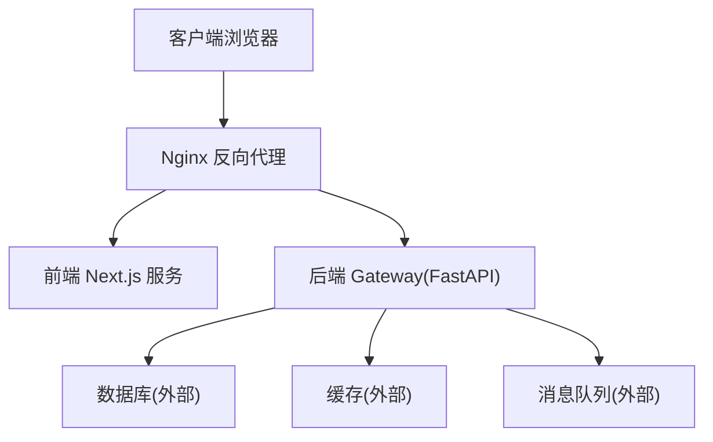
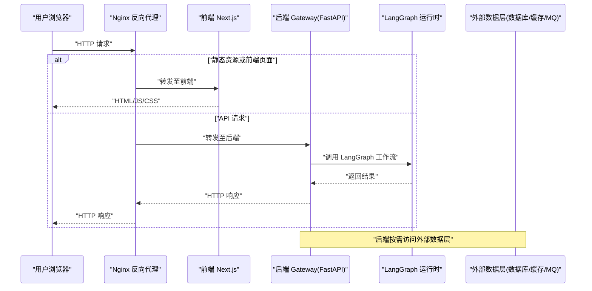
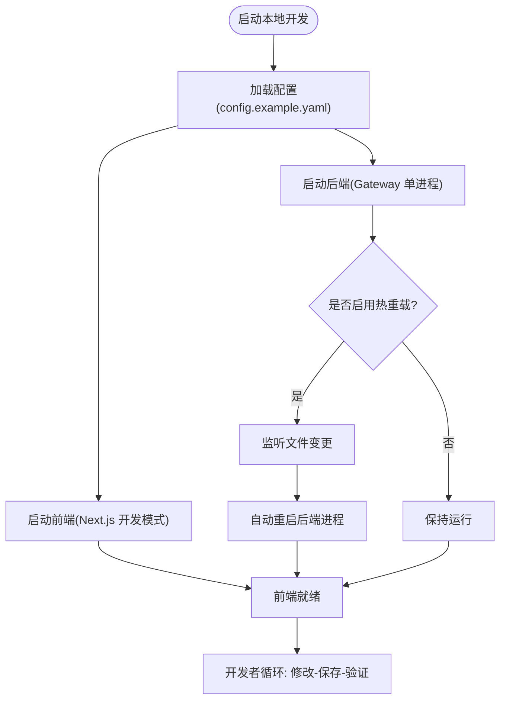
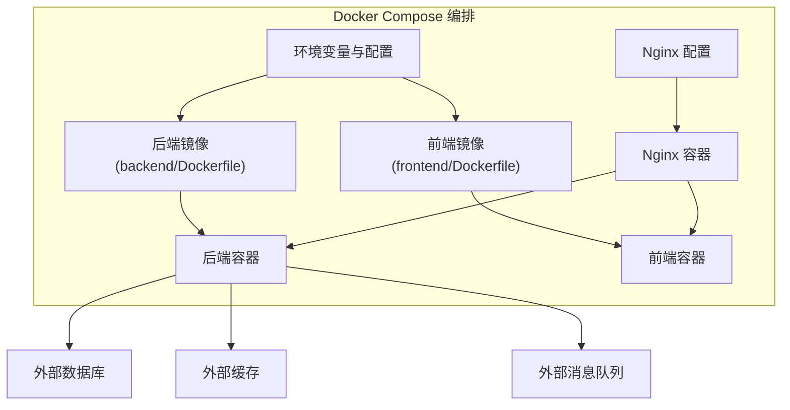
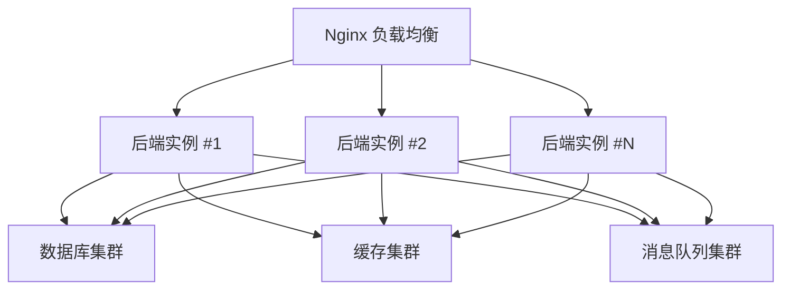
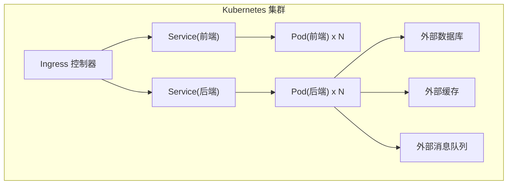
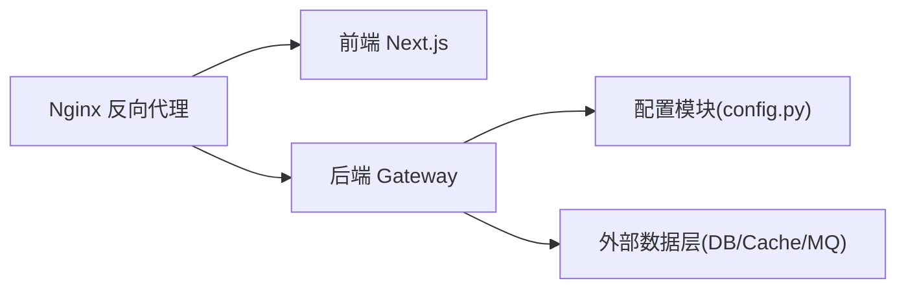

# 部署拓扑

<cite>
**本文引用的文件**   
- [backend/Dockerfile](file://backend/Dockerfile)
- [backend/app/gateway/app.py](file://backend/app/gateway/app.py)
- [backend/app/gateway/config.py](file://backend/app/gateway/config.py)
- [backend/langgraph.json](file://backend/langgraph.json)
- [docker/docker-compose.yaml](file://docker/docker-compose.yaml)
- [docker/docker-compose-dev.yaml](file://docker/docker-compose-dev.yaml)
- [docker/nginx/nginx.conf](file://docker/nginx/nginx.conf)
- [docker/nginx/nginx.local.conf](file://docker/nginx/nginx.local.conf)
- [scripts/deploy.sh](file://scripts/deploy.sh)
- [scripts/serve.sh](file://scripts/serve.sh)
- [scripts/start-daemon.sh](file://scripts/start-daemon.sh)
- [scripts/wait-for-port.sh](file://scripts/wait-for-port.sh)
- [.agent/skills/smoke-test/scripts/deploy_docker.sh](file://.agent/skills/smoke-test/scripts/deploy_docker.sh)
- [.agent/skills/smoke-test/scripts/deploy_local.sh](file://.agent/skills/smoke-test/scripts/deploy_local.sh)
- [.agent/skills/smoke-test/scripts/health_check.sh](file://.agent/skills/smoke-test/scripts/health_check.sh)
- [config.example.yaml](file://config.example.yaml)
- [extensions_config.example.json](file://extensions_config.example.json)
- [backend/docs/ARCHITECTURE.md](file://backend/docs/ARCHITECTURE.md)
- [backend/docs/SETUP.md](file://backend/docs/SETUP.md)
- [backend/docs/CONFIGURATION.md](file://backend/docs/CONFIGURATION.md)
- [frontend/Dockerfile](file://frontend/Dockerfile)
</cite>

## 目录
1. [简介](#简介)
2. [项目结构](#项目结构)
3. [核心组件](#核心组件)
4. [架构总览](#架构总览)
5. [详细组件分析](#详细组件分析)
6. [依赖关系分析](#依赖关系分析)
7. [性能考虑](#性能考虑)
8. [故障排查指南](#故障排查指南)
9. [结论](#结论)
10. [附录](#附录)

## 简介
本文件面向 DeerFlow 项目的部署与运维，聚焦于不同环境的部署拓扑与落地方案：本地开发（单进程、热重载、调试）、Docker 容器化（镜像构建、编排、环境变量）、生产环境（多实例负载均衡、数据库/缓存/消息队列集群），以及 Kubernetes 部署（Pod、Service、Ingress、HPA）。文档同时提供健康检查、日志收集与监控告警的配置方法，并给出配置文件模板与部署脚本的参考路径。

## 项目结构
DeerFlow 采用前后端分离与可插拔网关架构：
- 后端服务：基于 FastAPI 的网关应用，位于 backend/app/gateway；配置集中在 backend/app/gateway/config.py；入口在 app.py。
- 前端应用：Next.js 静态站点，位于 frontend。
- 容器化：后端与前端各自提供 Dockerfile；compose 编排位于 docker/ 目录；Nginx 反向代理配置位于 docker/nginx。
- 脚本与工具：根目录 scripts 下提供部署、启动、等待端口等通用脚本；.agent/skills/smoke-test 下提供本地与 Docker 的一键部署与健康检查脚本。
- 配置示例：根目录提供 config.example.yaml 与 extensions_config.example.json。

图表来源
- [docker/nginx/nginx.conf](file://docker/nginx/nginx.conf)
- [backend/app/gateway/app.py](file://backend/app/gateway/app.py)
- [frontend/Dockerfile](file://frontend/Dockerfile)

章节来源
- [backend/app/gateway/app.py](file://backend/app/gateway/app.py)
- [backend/app/gateway/config.py](file://backend/app/gateway/config.py)
- [docker/docker-compose.yaml](file://docker/docker-compose.yaml)
- [docker/docker-compose-dev.yaml](file://docker/docker-compose-dev.yaml)
- [docker/nginx/nginx.conf](file://docker/nginx/nginx.conf)
- [docker/nginx/nginx.local.conf](file://docker/nginx/nginx.local.conf)
- [config.example.yaml](file://config.example.yaml)
- [extensions_config.example.json](file://extensions_config.example.json)

## 核心组件
- 后端网关应用
  - 入口与路由挂载：backend/app/gateway/app.py
  - 配置加载与环境变量解析：backend/app/gateway/config.py
  - LangGraph 运行时集成：backend/langgraph.json
- 前端应用
  - 构建与运行：frontend/Dockerfile
- 反向代理
  - 生产与本地两套 Nginx 配置：docker/nginx/nginx.conf、docker/nginx/nginx.local.conf
- 容器编排
  - 生产编排：docker/docker-compose.yaml
  - 开发编排：docker/docker-compose-dev.yaml
- 部署与运维脚本
  - 通用脚本：scripts/deploy.sh、scripts/serve.sh、scripts/start-daemon.sh、scripts/wait-for-port.sh
  - 一键部署与健康检查：.agent/skills/smoke-test/scripts/deploy_docker.sh、deploy_local.sh、health_check.sh

章节来源
- [backend/app/gateway/app.py](file://backend/app/gateway/app.py)
- [backend/app/gateway/config.py](file://backend/app/gateway/config.py)
- [backend/langgraph.json](file://backend/langgraph.json)
- [frontend/Dockerfile](file://frontend/Dockerfile)
- [docker/docker-compose.yaml](file://docker/docker-compose.yaml)
- [docker/docker-compose-dev.yaml](file://docker/docker-compose-dev.yaml)
- [docker/nginx/nginx.conf](file://docker/nginx/nginx.conf)
- [docker/nginx/nginx.local.conf](file://docker/nginx/nginx.local.conf)
- [scripts/deploy.sh](file://scripts/deploy.sh)
- [scripts/serve.sh](file://scripts/serve.sh)
- [scripts/start-daemon.sh](file://scripts/start-daemon.sh)
- [scripts/wait-for-port.sh](file://scripts/wait-for-port.sh)
- [.agent/skills/smoke-test/scripts/deploy_docker.sh](file://.agent/skills/smoke-test/scripts/deploy_docker.sh)
- [.agent/skills/smoke-test/scripts/deploy_local.sh](file://.agent/skills/smoke-test/scripts/deploy_local.sh)
- [.agent/skills/smoke-test/scripts/health_check.sh](file://.agent/skills/smoke-test/scripts/health_check.sh)

## 架构总览
下图展示从浏览器到后端服务的请求链路，以及反向代理对前后端的分流策略。

图表来源
- [docker/nginx/nginx.conf](file://docker/nginx/nginx.conf)
- [backend/app/gateway/app.py](file://backend/app/gateway/app.py)
- [backend/langgraph.json](file://backend/langgraph.json)

## 详细组件分析

### 本地开发环境部署拓扑
- 单进程模式
  - 通过开发脚本直接启动后端与前端，便于快速迭代与断点调试。
  - 参考脚本：scripts/serve.sh、scripts/start-daemon.sh、.agent/skills/smoke-test/scripts/deploy_local.sh
- 文件热重载
  - 使用开发型 Web 服务器支持热重载，修改代码后自动重启或热更新。
  - 参考脚本：scripts/serve.sh、.agent/skills/smoke-test/scripts/deploy_local.sh
- 调试配置
  - 结合 IDE 远程调试或 Python 内置调试器，配合环境变量控制日志级别与调试开关。
  - 参考配置入口：backend/app/gateway/config.py、config.example.yaml

图表来源
- [scripts/serve.sh](file://scripts/serve.sh)
- [scripts/start-daemon.sh](file://scripts/start-daemon.sh)
- [.agent/skills/smoke-test/scripts/deploy_local.sh](file://.agent/skills/smoke-test/scripts/deploy_local.sh)
- [backend/app/gateway/config.py](file://backend/app/gateway/config.py)
- [config.example.yaml](file://config.example.yaml)

章节来源
- [scripts/serve.sh](file://scripts/serve.sh)
- [scripts/start-daemon.sh](file://scripts/start-daemon.sh)
- [.agent/skills/smoke-test/scripts/deploy_local.sh](file://.agent/skills/smoke-test/scripts/deploy_local.sh)
- [backend/app/gateway/config.py](file://backend/app/gateway/config.py)
- [config.example.yaml](file://config.example.yaml)

### Docker 容器化部署
- 镜像构建
  - 后端镜像：backend/Dockerfile
  - 前端镜像：frontend/Dockerfile
- 容器编排
  - 生产编排：docker/docker-compose.yaml
  - 开发编排：docker/docker-compose-dev.yaml
- 环境变量配置
  - 通过 compose 的环境变量注入后端配置，覆盖默认值。
  - 参考入口：backend/app/gateway/config.py、docker/docker-compose.yaml、config.example.yaml
- 反向代理
  - 生产与本地分别使用 nginx.conf 与 nginx.local.conf，实现 API 与静态资源的统一入口。
  - 参考：docker/nginx/nginx.conf、docker/nginx/nginx.local.conf

图表来源
- [backend/Dockerfile](file://backend/Dockerfile)
- [frontend/Dockerfile](file://frontend/Dockerfile)
- [docker/docker-compose.yaml](file://docker/docker-compose.yaml)
- [docker/docker-compose-dev.yaml](file://docker/docker-compose-dev.yaml)
- [docker/nginx/nginx.conf](file://docker/nginx/nginx.conf)
- [docker/nginx/nginx.local.conf](file://docker/nginx/nginx.local.conf)
- [backend/app/gateway/config.py](file://backend/app/gateway/config.py)

章节来源
- [backend/Dockerfile](file://backend/Dockerfile)
- [frontend/Dockerfile](file://frontend/Dockerfile)
- [docker/docker-compose.yaml](file://docker/docker-compose.yaml)
- [docker/docker-compose-dev.yaml](file://docker/docker-compose-dev.yaml)
- [docker/nginx/nginx.conf](file://docker/nginx/nginx.conf)
- [docker/nginx/nginx.local.conf](file://docker/nginx/nginx.local.conf)
- [backend/app/gateway/config.py](file://backend/app/gateway/config.py)

### 生产环境部署拓扑
- 多实例负载均衡
  - 通过 Nginx 将流量分发到多个后端实例，提升吞吐与可用性。
  - 参考：docker/nginx/nginx.conf
- 数据库集群
  - 后端连接外部数据库集群，建议主从或分片，确保高可用与读写分离。
- 缓存集群
  - 使用分布式缓存提升热点数据读取性能，降低数据库压力。
- 消息队列集群
  - 异步任务与事件驱动处理，解耦业务逻辑，提高系统弹性。

图表来源
- [docker/nginx/nginx.conf](file://docker/nginx/nginx.conf)
- [backend/app/gateway/app.py](file://backend/app/gateway/app.py)

章节来源
- [docker/nginx/nginx.conf](file://docker/nginx/nginx.conf)
- [backend/app/gateway/app.py](file://backend/app/gateway/app.py)

### Kubernetes 部署方案
- Pod 配置
  - 为后端与前端分别定义 Deployment，设置副本数、资源限制与探针。
- Service 暴露
  - 使用 ClusterIP 暴露内部服务，对外通过 Ingress 暴露 HTTP/HTTPS。
- Ingress 路由
  - 根据路径前缀将 /api 路由到后端 Service，其余路由到前端 Service。
- HPA 自动扩缩容
  - 基于 CPU/内存或自定义指标进行水平扩展，保障高峰期的稳定性。

[本节为概念性说明，未直接映射具体源码文件，故不附“图表来源”]

### 健康检查、日志收集与监控告警
- 健康检查
  - 使用 .agent/skills/smoke-test/scripts/health_check.sh 进行服务可达性与关键依赖校验。
  - 参考：.agent/skills/smoke-test/scripts/health_check.sh
- 日志收集
  - 容器标准输出由编排平台采集；生产建议集中式日志系统（如 ELK/Loki）聚合。
- 监控告警
  - 结合 Prometheus/Grafana 或云厂商监控，对 QPS、延迟、错误率、资源使用进行监控与告警。

章节来源
- [.agent/skills/smoke-test/scripts/health_check.sh](file://.agent/skills/smoke-test/scripts/health_check.sh)

## 依赖关系分析
- 组件耦合
  - 前端与后端通过 Nginx 反向代理解耦，减少跨域与直连风险。
  - 后端通过配置模块集中管理环境变量与默认值，降低硬编码耦合。
- 外部依赖
  - 数据库、缓存、消息队列均为外部服务，通过环境变量注入连接信息。
- 潜在循环依赖
  - 当前架构无循环依赖；网关与应用模块职责清晰。

图表来源
- [docker/nginx/nginx.conf](file://docker/nginx/nginx.conf)
- [backend/app/gateway/config.py](file://backend/app/gateway/config.py)
- [backend/app/gateway/app.py](file://backend/app/gateway/app.py)

章节来源
- [docker/nginx/nginx.conf](file://docker/nginx/nginx.conf)
- [backend/app/gateway/config.py](file://backend/app/gateway/config.py)
- [backend/app/gateway/app.py](file://backend/app/gateway/app.py)

## 性能考虑
- 反向代理优化
  - 合理设置 Nginx 的 keepalive、gzip、缓存策略，提升静态资源与 API 响应速度。
- 后端并发与线程池
  - 调整 WSGI/ASGI 工作进程与线程数，匹配 CPU 核数与 I/O 模型。
- 数据库与缓存
  - 使用连接池与查询优化；热点数据优先走缓存，降低数据库压力。
- 消息队列削峰
  - 利用队列缓冲突发流量，避免后端过载。
- 前端静态资源
  - 启用 CDN 与浏览器缓存，减少首屏加载时间。

[本节为通用指导，不直接分析具体文件]

## 故障排查指南
- 端口占用与服务不可达
  - 使用 scripts/wait-for-port.sh 等待端口就绪，定位网络连通性问题。
- 一键部署失败
  - 参考 .agent/skills/smoke-test/scripts/deploy_docker.sh 与 deploy_local.sh 的输出日志，检查镜像构建与容器启动状态。
- 健康检查异常
  - 执行 .agent/skills/smoke-test/scripts/health_check.sh，逐项检查后端、前端与外部依赖。
- 配置问题
  - 核对 config.example.yaml 与 backend/app/gateway/config.py 中的环境变量映射，确认 compose 注入是否正确。

章节来源
- [scripts/wait-for-port.sh](file://scripts/wait-for-port.sh)
- [.agent/skills/smoke-test/scripts/deploy_docker.sh](file://.agent/skills/smoke-test/scripts/deploy_docker.sh)
- [.agent/skills/smoke-test/scripts/deploy_local.sh](file://.agent/skills/smoke-test/scripts/deploy_local.sh)
- [.agent/skills/smoke-test/scripts/health_check.sh](file://.agent/skills/smoke-test/scripts/health_check.sh)
- [config.example.yaml](file://config.example.yaml)
- [backend/app/gateway/config.py](file://backend/app/gateway/config.py)

## 结论
DeerFlow 的部署拓扑以 Nginx 作为统一入口，前后端解耦并通过环境变量与配置中心化管理。本地开发强调单进程与热重载，Docker 与 Compose 提供一致的容器化体验，生产环境通过多实例与外部集群支撑高可用与可扩展性。Kubernetes 方案进一步抽象了资源管理与弹性伸缩能力。配合健康检查、日志与监控体系，可实现端到端的可观测性与稳定性保障。

## 附录

### 配置文件模板与部署脚本清单
- 配置模板
  - 全局配置示例：config.example.yaml
  - 扩展配置示例：extensions_config.example.json
- 部署脚本
  - 通用部署：scripts/deploy.sh
  - 启动服务：scripts/serve.sh、scripts/start-daemon.sh
  - 端口等待：scripts/wait-for-port.sh
  - Docker 一键部署：.agent/skills/smoke-test/scripts/deploy_docker.sh
  - 本地一键部署：.agent/skills/smoke-test/scripts/deploy_local.sh
  - 健康检查：.agent/skills/smoke-test/scripts/health_check.sh

章节来源
- [config.example.yaml](file://config.example.yaml)
- [extensions_config.example.json](file://extensions_config.example.json)
- [scripts/deploy.sh](file://scripts/deploy.sh)
- [scripts/serve.sh](file://scripts/serve.sh)
- [scripts/start-daemon.sh](file://scripts/start-daemon.sh)
- [scripts/wait-for-port.sh](file://scripts/wait-for-port.sh)
- [.agent/skills/smoke-test/scripts/deploy_docker.sh](file://.agent/skills/smoke-test/scripts/deploy_docker.sh)
- [.agent/skills/smoke-test/scripts/deploy_local.sh](file://.agent/skills/smoke-test/scripts/deploy_local.sh)
- [.agent/skills/smoke-test/scripts/health_check.sh](file://.agent/skills/smoke-test/scripts/health_check.sh)

### 相关文档参考
- 架构概览：backend/docs/ARCHITECTURE.md
- 安装与设置：backend/docs/SETUP.md
- 配置说明：backend/docs/CONFIGURATION.md

章节来源
- [backend/docs/ARCHITECTURE.md](file://backend/docs/ARCHITECTURE.md)
- [backend/docs/SETUP.md](file://backend/docs/SETUP.md)
- [backend/docs/CONFIGURATION.md](file://backend/docs/CONFIGURATION.md)