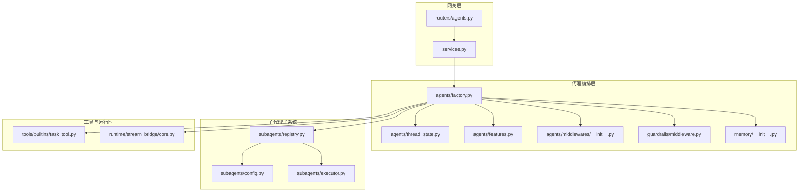
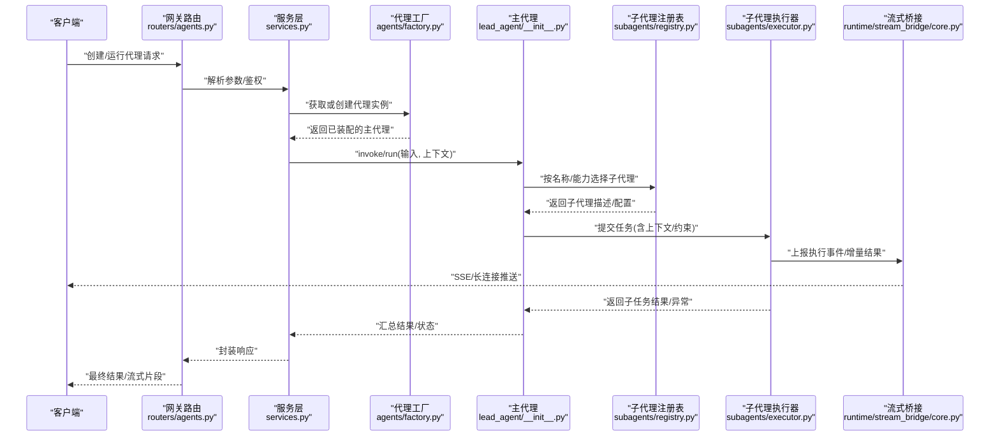
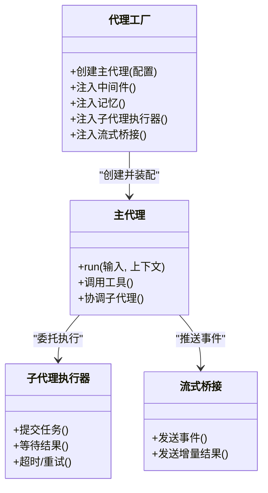
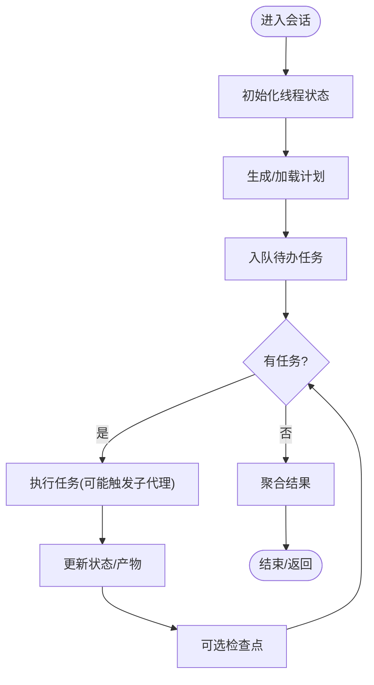
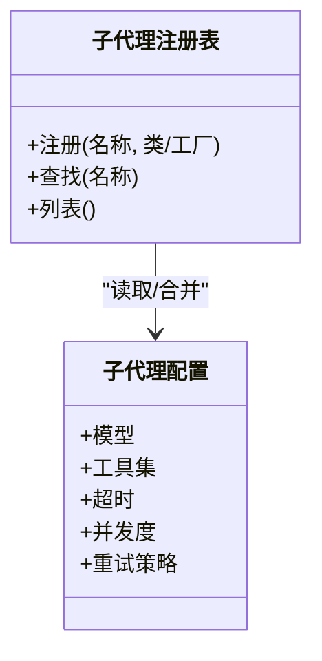
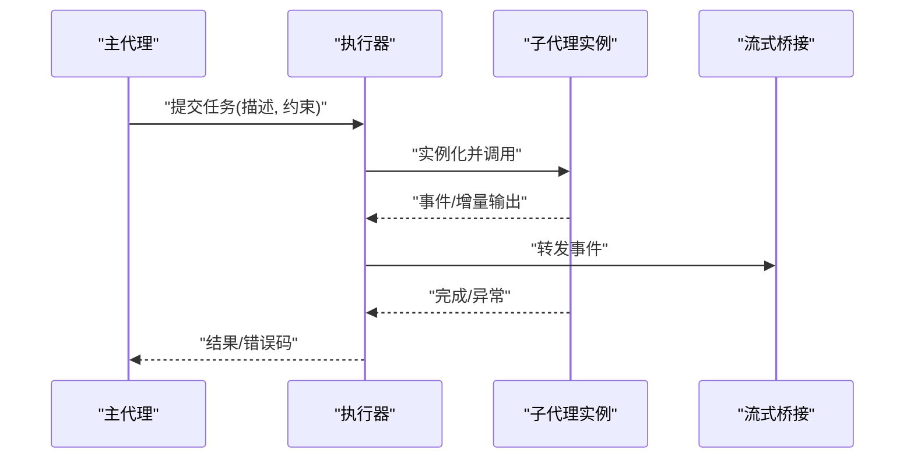
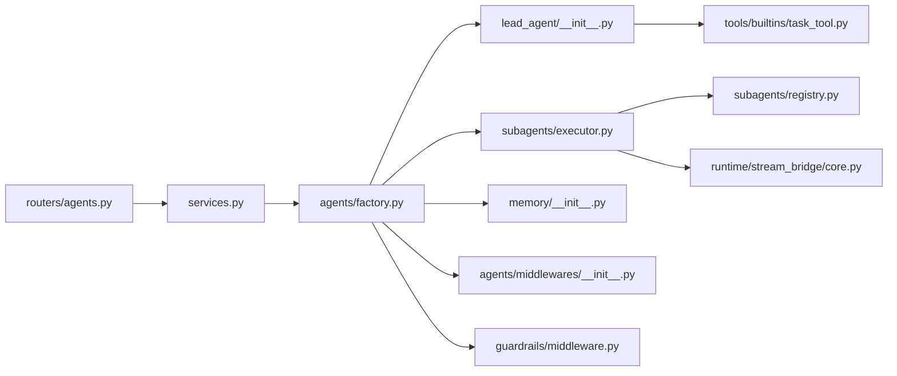

# 代理编排系统

<cite>
**本文引用的文件**   
- [backend/packages/harness/deerflow/agents/factory.py](file://backend/packages/harness/deerflow/agents/factory.py)
- [backend/packages/harness/deerflow/agents/thread_state.py](file://backend/packages/harness/deerflow/agents/thread_state.py)
- [backend/packages/harness/deerflow/agents/features.py](file://backend/packages/harness/deerflow/agents/features.py)
- [backend/packages/harness/deerflow/subagents/config.py](file://backend/packages/harness/deerflow/subagents/config.py)
- [backend/packages/harness/deerflow/subagents/executor.py](file://backend/packages/harness/deerflow/subagents/executor.py)
- [backend/packages/harness/deerflow/subagents/registry.py](file://backend/packages/harness/deerflow/subagents/registry.py)
- [backend/packages/harness/deerflow/agents/lead_agent/__init__.py](file://backend/packages/harness/deerflow/agents/lead_agent/__init__.py)
- [backend/packages/harness/deerflow/agents/middlewares/__init__.py](file://backend/packages/harness/deerflow/agents/middlewares/__init__.py)
- [backend/packages/harness/deerflow/guardrails/middleware.py](file://backend/packages/harness/deerflow/guardrails/middleware.py)
- [backend/packages/harness/deerflow/memory/__init__.py](file://backend/packages/harness/deerflow/memory/__init__.py)
- [backend/packages/harness/deerflow/tools/builtins/task_tool.py](file://backend/packages/harness/deerflow/tools/builtins/task_tool.py)
- [backend/packages/harness/deerflow/runtime/stream_bridge/core.py](file://backend/packages/harness/deerflow/runtime/stream_bridge/core.py)
- [backend/app/gateway/routers/agents.py](file://backend/app/gateway/routers/agents.py)
- [backend/app/gateway/services.py](file://backend/app/gateway/services.py)
- [backend/tests/test_subagent_executor.py](file://backend/tests/test_subagent_executor.py)
- [backend/tests/test_create_deerflow_agent.py](file://backend/tests/test_create_deerflow_agent.py)
- [backend/tests/test_custom_agent.py](file://backend/tests/test_custom_agent.py)
</cite>

## 目录
1. [简介](#简介)
2. [项目结构](#项目结构)
3. [核心组件](#核心组件)
4. [架构总览](#架构总览)
5. [详细组件分析](#详细组件分析)
6. [依赖关系分析](#依赖关系分析)
7. [性能考量](#性能考量)
8. [故障排查指南](#故障排查指南)
9. [结论](#结论)
10. [附录](#附录)

## 简介
本文件面向DeerFlow的“代理编排系统”，聚焦主代理（Lead Agent）与子代理（Subagents）的协作机制，涵盖：
- 代理生命周期管理、任务分解与调度
- 状态同步与错误处理
- 代理工厂模式、线程状态管理与代理间通信协议
- 配置示例、自定义代理开发指南与调试方法
- 性能优化策略与最佳实践

目标读者包括后端开发者、集成工程师与平台运维人员。

## 项目结构
围绕代理编排的核心代码位于后端包中，关键目录与职责如下：
- agents：主代理与通用能力（工厂、特性开关、线程状态、中间件等）
- subagents：子代理注册表、执行器与配置
- tools/builtins：内置工具（如任务工具）
- guardrails：安全护栏中间件
- memory：记忆模块
- runtime/stream_bridge：流式桥接，用于事件与结果回传
- app/gateway：网关路由与服务层，暴露HTTP接口并驱动运行

图表来源
- [backend/app/gateway/routers/agents.py](file://backend/app/gateway/routers/agents.py)
- [backend/app/gateway/services.py](file://backend/app/gateway/services.py)
- [backend/packages/harness/deerflow/agents/factory.py](file://backend/packages/harness/deerflow/agents/factory.py)
- [backend/packages/harness/deerflow/agents/thread_state.py](file://backend/packages/harness/deerflow/agents/thread_state.py)
- [backend/packages/harness/deerflow/agents/features.py](file://backend/packages/harness/deerflow/agents/features.py)
- [backend/packages/harness/deerflow/agents/middlewares/__init__.py](file://backend/packages/harness/deerflow/agents/middlewares/__init__.py)
- [backend/packages/harness/deerflow/guardrails/middleware.py](file://backend/packages/harness/deerflow/guardrails/middleware.py)
- [backend/packages/harness/deerflow/memory/__init__.py](file://backend/packages/harness/deerflow/memory/__init__.py)
- [backend/packages/harness/deerflow/subagents/registry.py](file://backend/packages/harness/deerflow/subagents/registry.py)
- [backend/packages/harness/deerflow/subagents/config.py](file://backend/packages/harness/deerflow/subagents/config.py)
- [backend/packages/harness/deerflow/subagents/executor.py](file://backend/packages/harness/deerflow/subagents/executor.py)
- [backend/packages/harness/deerflow/tools/builtins/task_tool.py](file://backend/packages/harness/deerflow/tools/builtins/task_tool.py)
- [backend/packages/harness/deerflow/runtime/stream_bridge/core.py](file://backend/packages/harness/deerflow/runtime/stream_bridge/core.py)

章节来源
- [backend/app/gateway/routers/agents.py](file://backend/app/gateway/routers/agents.py)
- [backend/app/gateway/services.py](file://backend/app/gateway/services.py)
- [backend/packages/harness/deerflow/agents/factory.py](file://backend/packages/harness/deerflow/agents/factory.py)
- [backend/packages/harness/deerflow/subagents/executor.py](file://backend/packages/harness/deerflow/subagents/executor.py)
- [backend/packages/harness/deerflow/subagents/registry.py](file://backend/packages/harness/deerflow/subagents/registry.py)
- [backend/packages/harness/deerflow/subagents/config.py](file://backend/packages/harness/deerflow/subagents/config.py)
- [backend/packages/harness/deerflow/agents/thread_state.py](file://backend/packages/harness/deerflow/agents/thread_state.py)
- [backend/packages/harness/deerflow/agents/features.py](file://backend/packages/harness/deerflow/agents/features.py)
- [backend/packages/harness/deerflow/agents/middlewares/__init__.py](file://backend/packages/harness/deerflow/agents/middlewares/__init__.py)
- [backend/packages/harness/deerflow/guardrails/middleware.py](file://backend/packages/harness/deerflow/guardrails/middleware.py)
- [backend/packages/harness/deerflow/memory/__init__.py](file://backend/packages/harness/deerflow/memory/__init__.py)
- [backend/packages/harness/deerflow/tools/builtins/task_tool.py](file://backend/packages/harness/deerflow/tools/builtins/task_tool.py)
- [backend/packages/harness/deerflow/runtime/stream_bridge/core.py](file://backend/packages/harness/deerflow/runtime/stream_bridge/core.py)

## 核心组件
- 代理工厂（Factory）：负责创建、装配主代理实例，注入中间件、记忆、子代理执行器、流式桥接等依赖。
- 线程状态（Thread State）：维护会话级上下文、任务队列、进度与结果聚合。
- 子代理注册表（Registry）：集中管理子代理类型、配置与实例化策略。
- 子代理执行器（Executor）：负责并发调度、超时控制、重试与错误降级。
- 中间件链（Middleware Chain）：在调用前后插入横切逻辑（限流、审计、护栏等）。
- 流式桥接（Stream Bridge）：将子代理执行过程中的事件与增量结果推送给上层。
- 内置任务工具（Task Tool）：供主代理在推理过程中动态发起子任务。

章节来源
- [backend/packages/harness/deerflow/agents/factory.py](file://backend/packages/harness/deerflow/agents/factory.py)
- [backend/packages/harness/deerflow/agents/thread_state.py](file://backend/packages/harness/deerflow/agents/thread_state.py)
- [backend/packages/harness/deerflow/subagents/registry.py](file://backend/packages/harness/deerflow/subagents/registry.py)
- [backend/packages/harness/deerflow/subagents/executor.py](file://backend/packages/harness/deerflow/subagents/executor.py)
- [backend/packages/harness/deerflow/agents/middlewares/__init__.py](file://backend/packages/harness/deerflow/agents/middlewares/__init__.py)
- [backend/packages/harness/deerflow/runtime/stream_bridge/core.py](file://backend/packages/harness/deerflow/runtime/stream_bridge/core.py)
- [backend/packages/harness/deerflow/tools/builtins/task_tool.py](file://backend/packages/harness/deerflow/tools/builtins/task_tool.py)

## 架构总览
从请求入口到子代理执行的端到端流程：

图表来源
- [backend/app/gateway/routers/agents.py](file://backend/app/gateway/routers/agents.py)
- [backend/app/gateway/services.py](file://backend/app/gateway/services.py)
- [backend/packages/harness/deerflow/agents/factory.py](file://backend/packages/harness/deerflow/agents/factory.py)
- [backend/packages/harness/deerflow/agents/lead_agent/__init__.py](file://backend/packages/harness/deerflow/agents/lead_agent/__init__.py)
- [backend/packages/harness/deerflow/subagents/registry.py](file://backend/packages/harness/deerflow/subagents/registry.py)
- [backend/packages/harness/deerflow/subagents/executor.py](file://backend/packages/harness/deerflow/subagents/executor.py)
- [backend/packages/harness/deerflow/runtime/stream_bridge/core.py](file://backend/packages/harness/deerflow/runtime/stream_bridge/core.py)

## 详细组件分析

### 代理工厂模式（Factory）
- 职责
  - 根据配置构建主代理实例
  - 注入中间件链、记忆、子代理执行器、流式桥接
  - 提供统一的创建入口，屏蔽内部依赖细节
- 关键点
  - 支持多环境/多模型切换
  - 可插拔中间件顺序可控
  - 与线程状态绑定，确保会话一致性

图表来源
- [backend/packages/harness/deerflow/agents/factory.py](file://backend/packages/harness/deerflow/agents/factory.py)
- [backend/packages/harness/deerflow/agents/lead_agent/__init__.py](file://backend/packages/harness/deerflow/agents/lead_agent/__init__.py)
- [backend/packages/harness/deerflow/subagents/executor.py](file://backend/packages/harness/deerflow/subagents/executor.py)
- [backend/packages/harness/deerflow/runtime/stream_bridge/core.py](file://backend/packages/harness/deerflow/runtime/stream_bridge/core.py)

章节来源
- [backend/packages/harness/deerflow/agents/factory.py](file://backend/packages/harness/deerflow/agents/factory.py)
- [backend/packages/harness/deerflow/agents/lead_agent/__init__.py](file://backend/packages/harness/deerflow/agents/lead_agent/__init__.py)

### 线程状态管理（Thread State）
- 职责
  - 维护会话级上下文（用户输入、历史消息、计划、产物等）
  - 记录任务队列、执行进度、结果聚合
  - 为中间件与子代理提供一致的读写视图
- 设计要点
  - 原子更新与快照能力，便于恢复与回放
  - 与检查点/持久化对接，支持中断续跑

图表来源
- [backend/packages/harness/deerflow/agents/thread_state.py](file://backend/packages/harness/deerflow/agents/thread_state.py)

章节来源
- [backend/packages/harness/deerflow/agents/thread_state.py](file://backend/packages/harness/deerflow/agents/thread_state.py)

### 子代理注册表与配置（Registry & Config）
- 注册表
  - 集中声明可用子代理类型、别名与默认配置
  - 提供按名称/能力检索与校验
- 配置
  - 定义子代理的模型、工具集、超时、并发度、重试策略等
  - 支持覆盖与继承，便于多租户/多场景

图表来源
- [backend/packages/harness/deerflow/subagents/registry.py](file://backend/packages/harness/deerflow/subagents/registry.py)
- [backend/packages/harness/deerflow/subagents/config.py](file://backend/packages/harness/deerflow/subagents/config.py)

章节来源
- [backend/packages/harness/deerflow/subagents/registry.py](file://backend/packages/harness/deerflow/subagents/registry.py)
- [backend/packages/harness/deerflow/subagents/config.py](file://backend/packages/harness/deerflow/subagents/config.py)

### 子代理执行器（Executor）
- 职责
  - 接收主代理的任务描述，实例化对应子代理
  - 管理并发、超时、重试、熔断与降级
  - 收集执行事件与结果，通过流式桥接推送
- 关键路径
  - 任务入队 -> 分配执行槽位 -> 启动子代理 -> 监听事件 -> 聚合结果 -> 返回

图表来源
- [backend/packages/harness/deerflow/subagents/executor.py](file://backend/packages/harness/deerflow/subagents/executor.py)
- [backend/packages/harness/deerflow/runtime/stream_bridge/core.py](file://backend/packages/harness/deerflow/runtime/stream_bridge/core.py)

章节来源
- [backend/packages/harness/deerflow/subagents/executor.py](file://backend/packages/harness/deerflow/subagents/executor.py)

### 中间件链与安全护栏（Middleware & Guardrails）
- 中间件链
  - 统一拦截主代理调用前后逻辑（限流、审计、日志、指标）
  - 支持短路返回与异常转换
- 安全护栏
  - 对输入/输出进行合规校验与过滤
  - 阻断高风险操作或敏感内容

图表来源
- [backend/packages/harness/deerflow/agents/middlewares/__init__.py](file://backend/packages/harness/deerflow/agents/middlewares/__init__.py)
- [backend/packages/harness/deerflow/guardrails/middleware.py](file://backend/packages/harness/deerflow/guardrails/middleware.py)

章节来源
- [backend/packages/harness/deerflow/agents/middlewares/__init__.py](file://backend/packages/harness/deerflow/agents/middlewares/__init__.py)
- [backend/packages/harness/deerflow/guardrails/middleware.py](file://backend/packages/harness/deerflow/guardrails/middleware.py)

### 记忆模块（Memory）
- 职责
  - 提供短期/长期记忆存取
  - 与主代理交互，辅助上下文压缩与摘要
- 集成点
  - 由工厂注入主代理
  - 中间件可在需要时访问记忆以做决策

章节来源
- [backend/packages/harness/deerflow/memory/__init__.py](file://backend/packages/harness/deerflow/memory/__init__.py)

### 内置任务工具（Task Tool）
- 职责
  - 在主代理推理过程中，动态创建子任务并交由执行器处理
  - 支持参数校验、权限检查与资源配额
- 使用方式
  - 作为主代理的工具之一被调用
  - 返回任务ID与状态查询接口

章节来源
- [backend/packages/harness/deerflow/tools/builtins/task_tool.py](file://backend/packages/harness/deerflow/tools/builtins/task_tool.py)

### 流式桥接（Stream Bridge）
- 职责
  - 将子代理执行过程中的事件与增量结果推送到网关层
  - 支持SSE/长连接，保证低延迟与高吞吐
- 事件类型
  - 开始、步骤、产出、完成、错误等

章节来源
- [backend/packages/harness/deerflow/runtime/stream_bridge/core.py](file://backend/packages/harness/deerflow/runtime/stream_bridge/core.py)

## 依赖关系分析
- 耦合与内聚
  - 工厂对内聚了所有装配逻辑，降低外部耦合
  - 子代理子系统通过注册表解耦具体实现
  - 中间件与护栏横向切入，保持核心逻辑纯净
- 外部依赖
  - 网关路由与服务层对外暴露API
  - 流式桥接与前端/客户端交互
- 潜在循环依赖
  - 避免主代理直接依赖执行器之外的子代理实现，应通过注册表与配置抽象

图表来源
- [backend/app/gateway/routers/agents.py](file://backend/app/gateway/routers/agents.py)
- [backend/app/gateway/services.py](file://backend/app/gateway/services.py)
- [backend/packages/harness/deerflow/agents/factory.py](file://backend/packages/harness/deerflow/agents/factory.py)
- [backend/packages/harness/deerflow/agents/lead_agent/__init__.py](file://backend/packages/harness/deerflow/agents/lead_agent/__init__.py)
- [backend/packages/harness/deerflow/subagents/executor.py](file://backend/packages/harness/deerflow/subagents/executor.py)
- [backend/packages/harness/deerflow/subagents/registry.py](file://backend/packages/harness/deerflow/subagents/registry.py)
- [backend/packages/harness/deerflow/agents/middlewares/__init__.py](file://backend/packages/harness/deerflow/agents/middlewares/__init__.py)
- [backend/packages/harness/deerflow/guardrails/middleware.py](file://backend/packages/harness/deerflow/guardrails/middleware.py)
- [backend/packages/harness/deerflow/memory/__init__.py](file://backend/packages/harness/deerflow/memory/__init__.py)
- [backend/packages/harness/deerflow/tools/builtins/task_tool.py](file://backend/packages/harness/deerflow/tools/builtins/task_tool.py)
- [backend/packages/harness/deerflow/runtime/stream_bridge/core.py](file://backend/packages/harness/deerflow/runtime/stream_bridge/core.py)

章节来源
- [backend/app/gateway/routers/agents.py](file://backend/app/gateway/routers/agents.py)
- [backend/app/gateway/services.py](file://backend/app/gateway/services.py)
- [backend/packages/harness/deerflow/agents/factory.py](file://backend/packages/harness/deerflow/agents/factory.py)
- [backend/packages/harness/deerflow/subagents/executor.py](file://backend/packages/harness/deerflow/subagents/executor.py)
- [backend/packages/harness/deerflow/subagents/registry.py](file://backend/packages/harness/deerflow/subagents/registry.py)
- [backend/packages/harness/deerflow/agents/middlewares/__init__.py](file://backend/packages/harness/deerflow/agents/middlewares/__init__.py)
- [backend/packages/harness/deerflow/guardrails/middleware.py](file://backend/packages/harness/deerflow/guardrails/middleware.py)
- [backend/packages/harness/deerflow/memory/__init__.py](file://backend/packages/harness/deerflow/memory/__init__.py)
- [backend/packages/harness/deerflow/tools/builtins/task_tool.py](file://backend/packages/harness/deerflow/tools/builtins/task_tool.py)
- [backend/packages/harness/deerflow/runtime/stream_bridge/core.py](file://backend/packages/harness/deerflow/runtime/stream_bridge/core.py)

## 性能考量
- 并发与限流
  - 合理设置子代理并发度与全局限流，避免资源争用
  - 对耗时工具调用增加超时与重试上限
- 流式传输
  - 优先使用增量推送，减少大对象一次性传输
  - 对高频事件进行批处理与去抖
- 记忆与上下文
  - 定期压缩历史，控制上下文长度
  - 按需加载长记忆，避免全量拉取
- 缓存与复用
  - 对相同子代理配置的实例进行复用
  - 对只读工具结果进行缓存
- 监控与观测
  - 埋点关键路径耗时、错误率与吞吐
  - 结合链路追踪定位瓶颈

[本节为通用指导，不直接分析具体文件]

## 故障排查指南
- 常见问题
  - 子代理未找到：检查注册表是否注册、名称是否一致
  - 超时/重试风暴：调整超时阈值与退避策略
  - 流式断连：检查网络与桥接通道健康
  - 内存泄漏：关注上下文大小与记忆清理
- 定位手段
  - 启用中间件日志与护栏告警
  - 查看执行器的事件日志与错误码
  - 使用测试用例复现问题（见下方测试文件）

章节来源
- [backend/tests/test_subagent_executor.py](file://backend/tests/test_subagent_executor.py)
- [backend/tests/test_create_deerflow_agent.py](file://backend/tests/test_create_deerflow_agent.py)
- [backend/tests/test_custom_agent.py](file://backend/tests/test_custom_agent.py)

## 结论
DeerFlow的代理编排系统通过工厂模式、注册表与执行器实现了主代理与子代理的松耦合协作；借助中间件链与安全护栏保障稳定性与安全性；通过流式桥接提升用户体验；配合线程状态与记忆模块实现会话级的一致性与可恢复性。遵循本文的最佳实践与性能建议，可在复杂场景中稳定高效地扩展与定制代理能力。

[本节为总结，不直接分析具体文件]

## 附录

### 代理配置示例（说明性）
- 子代理配置项
  - 模型：指定底层模型或提供商
  - 工具集：允许使用的工具白名单
  - 超时：最大执行时间
  - 并发度：并行任务数
  - 重试策略：次数与退避
- 主代理装配
  - 中间件顺序：限流、审计、护栏等
  - 记忆策略：短期/长期、压缩阈值
  - 流式桥接：事件粒度与缓冲大小

[本节为概念性说明，不直接分析具体文件]

### 自定义代理开发指南（说明性）
- 步骤
  - 实现子代理接口（输入/输出/事件）
  - 在注册表中登记名称与默认配置
  - 编写单元测试验证行为与边界条件
  - 在主代理中通过任务工具或显式调用接入
- 注意事项
  - 遵守安全护栏规则
  - 合理设置超时与重试
  - 输出结构化事件以便流式展示

[本节为概念性说明，不直接分析具体文件]

### 调试方法（说明性）
- 开启详细日志与中间件跟踪
- 使用最小复现用例与固定种子
- 逐步隔离：禁用部分中间件/工具，定位根因
- 观察流式事件序列，确认时序与幂等性

[本节为概念性说明，不直接分析具体文件]