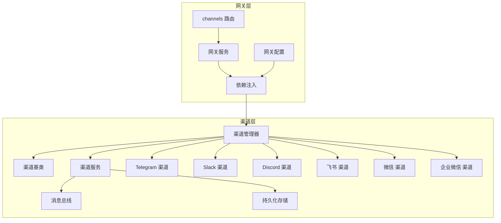
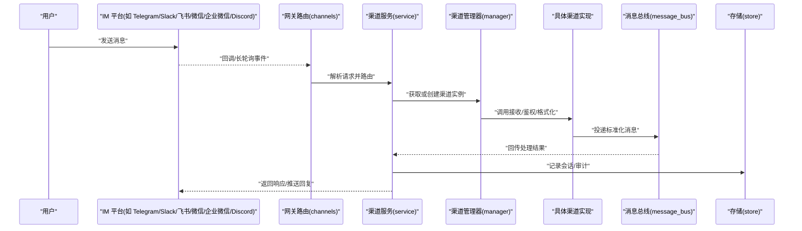
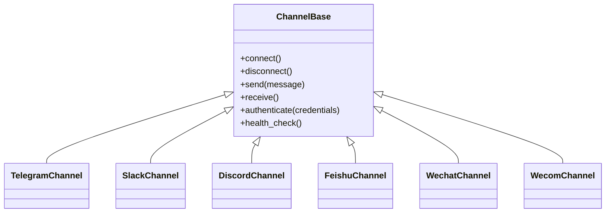
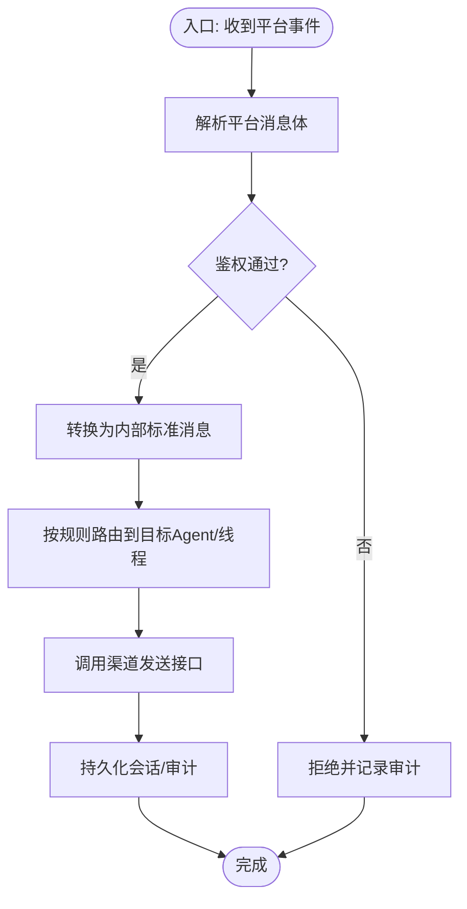
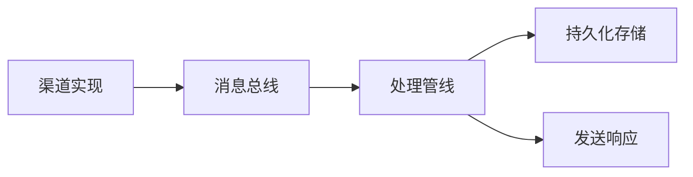
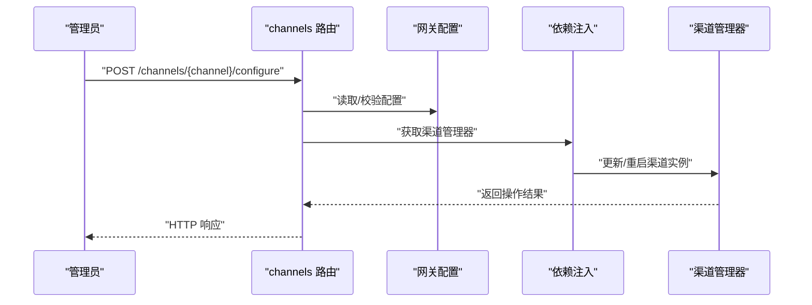
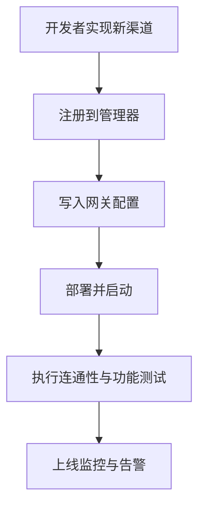
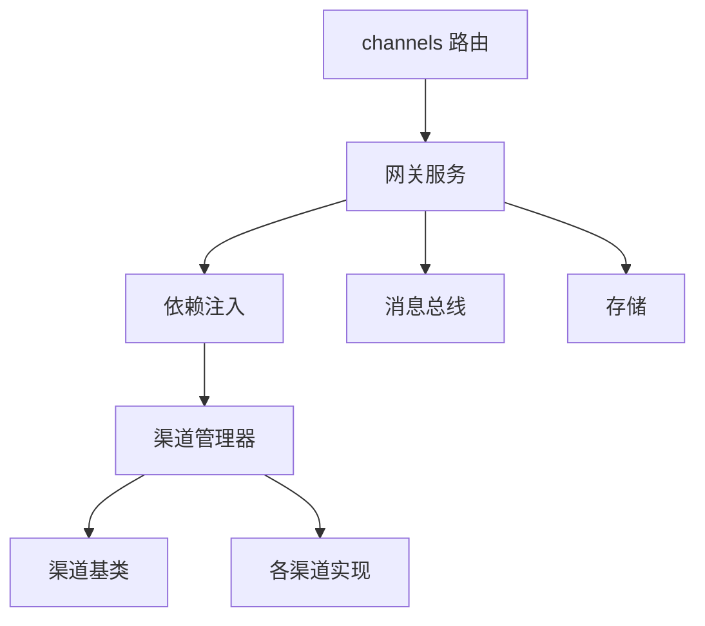

# 多渠道集成

<cite>
**本文引用的文件**   
- [backend/app/channels/base.py](file://backend/app/channels/base.py)
- [backend/app/channels/manager.py](file://backend/app/channels/manager.py)
- [backend/app/channels/service.py](file://backend/app/channels/service.py)
- [backend/app/channels/message_bus.py](file://backend/app/channels/message_bus.py)
- [backend/app/channels/store.py](file://backend/app/channels/store.py)
- [backend/app/channels/telegram.py](file://backend/app/channels/telegram.py)
- [backend/app/channels/slack.py](file://backend/app/channels/slack.py)
- [backend/app/channels/discord.py](file://backend/app/channels/discord.py)
- [backend/app/channels/feishu.py](file://backend/app/channels/feishu.py)
- [backend/app/channels/wechat.py](file://backend/app/channels/wechat.py)
- [backend/app/channels/wecom.py](file://backend/app/channels/wecom.py)
- [backend/app/gateway/routers/channels.py](file://backend/app/gateway/routers/channels.py)
- [backend/app/gateway/config.py](file://backend/app/gateway/config.py)
- [backend/app/gateway/deps.py](file://backend/app/gateway/deps.py)
- [backend/app/gateway/services.py](file://backend/app/gateway/services.py)
- [backend/tests/test_discord_channel.py](file://backend/tests/test_discord_channel.py)
- [backend/tests/test_wechat_channel.py](file://backend/tests/test_wechat_channel.py)
</cite>

## 目录
1. [简介](#简介)
2. [项目结构](#项目结构)
3. [核心组件](#核心组件)
4. [架构总览](#架构总览)
5. [详细组件分析](#详细组件分析)
6. [依赖关系分析](#依赖关系分析)
7. [性能与扩展性](#性能与扩展性)
8. [故障排查指南](#故障排查指南)
9. [结论](#结论)
10. [附录：配置与部署要点](#附录配置与部署要点)

## 简介
本文件面向 DeerFlow 的多渠道集成系统，聚焦于 IM 平台（Telegram、Slack、飞书、微信、企业微信、Discord 等）的接入方式。文档涵盖：
- 渠道连接配置与生命周期管理
- 消息格式转换与统一抽象
- 身份认证与权限控制
- 各渠道的配置示例与部署注意事项
- 自定义渠道开发接口与扩展机制

## 项目结构
多渠道能力集中在后端 channels 模块，并通过网关路由对外暴露管理能力。关键目录与职责如下：
- backend/app/channels：渠道抽象、实现与管理器
- backend/app/gateway/routers/channels.py：渠道管理的 HTTP API
- backend/app/gateway/config.py：网关配置加载
- backend/app/gateway/deps.py：依赖注入（含渠道服务）
- backend/app/gateway/services.py：网关层服务编排

图表来源
- [backend/app/gateway/routers/channels.py](file://backend/app/gateway/routers/channels.py)
- [backend/app/gateway/config.py](file://backend/app/gateway/config.py)
- [backend/app/gateway/deps.py](file://backend/app/gateway/deps.py)
- [backend/app/gateway/services.py](file://backend/app/gateway/services.py)
- [backend/app/channels/manager.py](file://backend/app/channels/manager.py)
- [backend/app/channels/base.py](file://backend/app/channels/base.py)
- [backend/app/channels/service.py](file://backend/app/channels/service.py)
- [backend/app/channels/message_bus.py](file://backend/app/channels/message_bus.py)
- [backend/app/channels/store.py](file://backend/app/channels/store.py)
- [backend/app/channels/telegram.py](file://backend/app/channels/telegram.py)
- [backend/app/channels/slack.py](file://backend/app/channels/slack.py)
- [backend/app/channels/discord.py](file://backend/app/channels/discord.py)
- [backend/app/channels/feishu.py](file://backend/app/channels/feishu.py)
- [backend/app/channels/wechat.py](file://backend/app/channels/wechat.py)
- [backend/app/channels/wecom.py](file://backend/app/channels/wecom.py)

章节来源
- [backend/app/channels/base.py](file://backend/app/channels/base.py)
- [backend/app/channels/manager.py](file://backend/app/channels/manager.py)
- [backend/app/channels/service.py](file://backend/app/channels/service.py)
- [backend/app/channels/message_bus.py](file://backend/app/channels/message_bus.py)
- [backend/app/channels/store.py](file://backend/app/channels/store.py)
- [backend/app/gateway/routers/channels.py](file://backend/app/gateway/routers/channels.py)
- [backend/app/gateway/config.py](file://backend/app/gateway/config.py)
- [backend/app/gateway/deps.py](file://backend/app/gateway/deps.py)
- [backend/app/gateway/services.py](file://backend/app/gateway/services.py)

## 核心组件
- 渠道基类：定义统一的连接、发送、接收、鉴权、健康检查等接口契约，屏蔽不同 IM 平台的差异。
- 渠道管理器：负责渠道实例的注册、发现、启停、状态管理与错误恢复。
- 渠道服务：编排消息入站/出站流程，处理格式转换、权限校验、会话上下文与持久化。
- 消息总线：解耦消息生产与消费，支持异步投递与重试。
- 持久化存储：保存渠道连接信息、用户映射、会话元数据与审计日志。
- 网关路由与服务：提供 REST API 用于渠道配置、启停、查询与运维。

章节来源
- [backend/app/channels/base.py](file://backend/app/channels/base.py)
- [backend/app/channels/manager.py](file://backend/app/channels/manager.py)
- [backend/app/channels/service.py](file://backend/app/channels/service.py)
- [backend/app/channels/message_bus.py](file://backend/app/channels/message_bus.py)
- [backend/app/channels/store.py](file://backend/app/channels/store.py)
- [backend/app/gateway/routers/channels.py](file://backend/app/gateway/routers/channels.py)
- [backend/app/gateway/services.py](file://backend/app/gateway/services.py)

## 架构总览
下图展示从外部 IM 平台到 DeerFlow 内部处理链路的关键交互。

图表来源
- [backend/app/gateway/routers/channels.py](file://backend/app/gateway/routers/channels.py)
- [backend/app/channels/service.py](file://backend/app/channels/service.py)
- [backend/app/channels/manager.py](file://backend/app/channels/manager.py)
- [backend/app/channels/message_bus.py](file://backend/app/channels/message_bus.py)
- [backend/app/channels/store.py](file://backend/app/channels/store.py)

## 详细组件分析

### 渠道抽象与实现
- 统一接口：所有渠道需实现连接建立、消息收发、鉴权、健康检查、重连策略等。
- 平台差异：各平台在认证方式、消息体结构、附件类型、速率限制等方面存在差异，由各自实现适配。
- 典型实现：Telegram、Slack、Discord、飞书、微信、企业微信。

图表来源
- [backend/app/channels/base.py](file://backend/app/channels/base.py)
- [backend/app/channels/telegram.py](file://backend/app/channels/telegram.py)
- [backend/app/channels/slack.py](file://backend/app/channels/slack.py)
- [backend/app/channels/discord.py](file://backend/app/channels/discord.py)
- [backend/app/channels/feishu.py](file://backend/app/channels/feishu.py)
- [backend/app/channels/wechat.py](file://backend/app/channels/wechat.py)
- [backend/app/channels/wecom.py](file://backend/app/channels/wecom.py)

章节来源
- [backend/app/channels/base.py](file://backend/app/channels/base.py)
- [backend/app/channels/telegram.py](file://backend/app/channels/telegram.py)
- [backend/app/channels/slack.py](file://backend/app/channels/slack.py)
- [backend/app/channels/discord.py](file://backend/app/channels/discord.py)
- [backend/app/channels/feishu.py](file://backend/app/channels/feishu.py)
- [backend/app/channels/wechat.py](file://backend/app/channels/wechat.py)
- [backend/app/channels/wecom.py](file://backend/app/channels/wecom.py)

### 渠道管理器与服务编排
- 管理器职责：集中维护渠道实例、生命周期、状态机、错误恢复与并发访问控制。
- 服务编排：将“接收→鉴权→格式化→路由→发送”串成可插拔流水线，便于中间件扩展。

图表来源
- [backend/app/channels/manager.py](file://backend/app/channels/manager.py)
- [backend/app/channels/service.py](file://backend/app/channels/service.py)

章节来源
- [backend/app/channels/manager.py](file://backend/app/channels/manager.py)
- [backend/app/channels/service.py](file://backend/app/channels/service.py)

### 消息总线与存储
- 消息总线：解耦消息生产者与消费者，支持异步、重试、幂等与顺序保证（视实现而定）。
- 存储：保存渠道凭证、用户映射、会话上下文、审计日志与运行态快照。

图表来源
- [backend/app/channels/message_bus.py](file://backend/app/channels/message_bus.py)
- [backend/app/channels/store.py](file://backend/app/channels/store.py)

章节来源
- [backend/app/channels/message_bus.py](file://backend/app/channels/message_bus.py)
- [backend/app/channels/store.py](file://backend/app/channels/store.py)

### 网关路由与配置
- 路由：提供渠道配置、启停、状态查询、测试连通性等管理接口。
- 配置：从配置文件或环境变量加载渠道参数，并在启动时注入到依赖容器。
- 依赖注入：为路由和服务提供渠道管理器、存储服务与配置对象。

图表来源
- [backend/app/gateway/routers/channels.py](file://backend/app/gateway/routers/channels.py)
- [backend/app/gateway/config.py](file://backend/app/gateway/config.py)
- [backend/app/gateway/deps.py](file://backend/app/gateway/deps.py)
- [backend/app/channels/manager.py](file://backend/app/channels/manager.py)

章节来源
- [backend/app/gateway/routers/channels.py](file://backend/app/gateway/routers/channels.py)
- [backend/app/gateway/config.py](file://backend/app/gateway/config.py)
- [backend/app/gateway/deps.py](file://backend/app/gateway/deps.py)
- [backend/app/gateway/services.py](file://backend/app/gateway/services.py)

### 各渠道配置与部署要点
以下为常见渠道的典型配置项与部署注意事项（字段名以实际实现为准，建议参考对应实现文件的常量与配置读取逻辑）：

- Telegram
  - 关键配置：Bot Token、Webhook URL（可选）、代理设置
  - 部署要点：确保公网可达的 Webhook 地址；注意速率限制与重试策略
  - 参考路径：[backend/app/channels/telegram.py](file://backend/app/channels/telegram.py)

- Slack
  - 关键配置：Bot Token、Signing Secret、App ID、Workspace ID
  - 部署要点：启用 Socket Mode 或 HTTP Events；配置签名验证
  - 参考路径：[backend/app/channels/slack.py](file://backend/app/channels/slack.py)

- Discord
  - 关键配置：Bot Token、Gateway Intents、应用 ID
  - 部署要点：开启必要 Intents；处理大群聊与附件大小限制
  - 参考路径：[backend/app/channels/discord.py](file://backend/app/channels/discord.py)
  - 测试参考：[backend/tests/test_discord_channel.py](file://backend/tests/test_discord_channel.py)

- 飞书
  - 关键配置：App ID、App Secret、事件订阅 URL、加密密钥
  - 部署要点：事件回调需校验签名；注意消息卡片与富文本格式
  - 参考路径：[backend/app/channels/feishu.py](file://backend/app/channels/feishu.py)

- 微信（公众号/小程序）
  - 关键配置：AppID、AppSecret、Token、EncodingAESKey
  - 部署要点：URL 校验与消息加解密；关注模板消息与素材上传限制
  - 参考路径：[backend/app/channels/wechat.py](file://backend/app/channels/wechat.py)
  - 测试参考：[backend/tests/test_wechat_channel.py](file://backend/tests/test_wechat_channel.py)

- 企业微信
  - 关键配置：CorpID、AgentId、Secret、Token、EncodingAESKey
  - 部署要点：回调 URL 校验；通讯录同步与权限范围
  - 参考路径：[backend/app/channels/wecom.py](file://backend/app/channels/wecom.py)

说明：以上配置键仅为常见命名约定，请以各渠道实现中读取配置的具体键名为准。

章节来源
- [backend/app/channels/telegram.py](file://backend/app/channels/telegram.py)
- [backend/app/channels/slack.py](file://backend/app/channels/slack.py)
- [backend/app/channels/discord.py](file://backend/app/channels/discord.py)
- [backend/app/channels/feishu.py](file://backend/app/channels/feishu.py)
- [backend/app/channels/wechat.py](file://backend/app/channels/wechat.py)
- [backend/app/channels/wecom.py](file://backend/app/channels/wecom.py)
- [backend/tests/test_discord_channel.py](file://backend/tests/test_discord_channel.py)
- [backend/tests/test_wechat_channel.py](file://backend/tests/test_wechat_channel.py)

### 身份认证与权限管理
- 渠道级认证：使用平台提供的 Token/Secret 进行连接认证，支持动态刷新与失效重试。
- 用户级鉴权：在消息进入处理管线前，基于用户标识与角色/白名单进行授权判断。
- 会话隔离：按渠道+群组/频道维度隔离会话上下文，避免跨域泄露。
- 审计与合规：记录鉴权失败、越权访问与敏感操作，便于追踪与合规审计。

章节来源
- [backend/app/channels/service.py](file://backend/app/channels/service.py)
- [backend/app/channels/store.py](file://backend/app/channels/store.py)

### 自定义渠道开发与扩展机制
- 继承基类：新建渠道类继承统一基类，实现连接、收发、鉴权与健康检查等方法。
- 注册与发现：通过管理器注册新渠道，或在配置中声明新增渠道类型。
- 配置注入：在网关配置中增加新渠道的键值对，并由依赖注入装配。
- 消息格式：遵循内部标准消息模型，必要时在适配器中进行双向转换。
- 测试覆盖：编写单元测试与端到端用例，覆盖正常流、异常流与边界条件。

图表来源
- [backend/app/channels/base.py](file://backend/app/channels/base.py)
- [backend/app/channels/manager.py](file://backend/app/channels/manager.py)
- [backend/app/gateway/config.py](file://backend/app/gateway/config.py)
- [backend/app/gateway/deps.py](file://backend/app/gateway/deps.py)

章节来源
- [backend/app/channels/base.py](file://backend/app/channels/base.py)
- [backend/app/channels/manager.py](file://backend/app/channels/manager.py)
- [backend/app/gateway/config.py](file://backend/app/gateway/config.py)
- [backend/app/gateway/deps.py](file://backend/app/gateway/deps.py)

## 依赖关系分析
- 低耦合高内聚：渠道实现仅依赖基类契约，通过管理器与服务编排组合。
- 明确边界：网关层只关心路由与配置，不感知具体平台细节。
- 可扩展点：消息总线与存储作为横向扩展点，便于引入缓存、队列与多后端存储。

图表来源
- [backend/app/gateway/routers/channels.py](file://backend/app/gateway/routers/channels.py)
- [backend/app/gateway/services.py](file://backend/app/gateway/services.py)
- [backend/app/gateway/deps.py](file://backend/app/gateway/deps.py)
- [backend/app/channels/manager.py](file://backend/app/channels/manager.py)
- [backend/app/channels/base.py](file://backend/app/channels/base.py)
- [backend/app/channels/message_bus.py](file://backend/app/channels/message_bus.py)
- [backend/app/channels/store.py](file://backend/app/channels/store.py)

章节来源
- [backend/app/gateway/routers/channels.py](file://backend/app/gateway/routers/channels.py)
- [backend/app/gateway/services.py](file://backend/app/gateway/services.py)
- [backend/app/gateway/deps.py](file://backend/app/gateway/deps.py)
- [backend/app/channels/manager.py](file://backend/app/channels/manager.py)
- [backend/app/channels/base.py](file://backend/app/channels/base.py)
- [backend/app/channels/message_bus.py](file://backend/app/channels/message_bus.py)
- [backend/app/channels/store.py](file://backend/app/channels/store.py)

## 性能与扩展性
- 异步处理：利用消息总线与异步 I/O 提升吞吐，降低阻塞。
- 连接复用：保持长连接与会话池，减少握手开销。
- 限流与退避：针对平台速率限制实施令牌桶/滑动窗口与指数退避。
- 水平扩展：无状态化处理节点配合外部存储与消息队列，实现弹性扩容。
- 资源隔离：按渠道/租户隔离资源配额，防止热点通道影响全局。

## 故障排查指南
- 连通性问题
  - 检查 Webhook/回调 URL 可达性与证书
  - 核对平台侧 App/Bot 权限与回调域名白名单
  - 参考：[backend/app/channels/telegram.py](file://backend/app/channels/telegram.py)、[backend/app/channels/slack.py](file://backend/app/channels/slack.py)、[backend/app/channels/discord.py](file://backend/app/channels/discord.py)、[backend/app/channels/feishu.py](file://backend/app/channels/feishu.py)、[backend/app/channels/wechat.py](file://backend/app/channels/wechat.py)、[backend/app/channels/wecom.py](file://backend/app/channels/wecom.py)

- 鉴权失败
  - 确认 Token/Secret 正确且未过期
  - 检查签名校验与时间戳漂移
  - 参考：[backend/app/channels/service.py](file://backend/app/channels/service.py)、[backend/app/channels/store.py](file://backend/app/channels/store.py)

- 消息丢失或重复
  - 查看消息总线重试与幂等策略
  - 核对存储写入是否成功
  - 参考：[backend/app/channels/message_bus.py](file://backend/app/channels/message_bus.py)、[backend/app/channels/store.py](file://backend/app/channels/store.py)

- 性能瓶颈
  - 观察连接池与队列积压
  - 评估平台限速与本地并发度
  - 参考：[backend/app/channels/manager.py](file://backend/app/channels/manager.py)、[backend/app/channels/service.py](file://backend/app/channels/service.py)

- 回归与验证
  - 使用现有测试用例快速验证改动
  - 参考：[backend/tests/test_discord_channel.py](file://backend/tests/test_discord_channel.py)、[backend/tests/test_wechat_channel.py](file://backend/tests/test_wechat_channel.py)

章节来源
- [backend/app/channels/service.py](file://backend/app/channels/service.py)
- [backend/app/channels/store.py](file://backend/app/channels/store.py)
- [backend/app/channels/message_bus.py](file://backend/app/channels/message_bus.py)
- [backend/app/channels/manager.py](file://backend/app/channels/manager.py)
- [backend/tests/test_discord_channel.py](file://backend/tests/test_discord_channel.py)
- [backend/tests/test_wechat_channel.py](file://backend/tests/test_wechat_channel.py)

## 结论
DeerFlow 的多渠道集成通过统一的渠道抽象、清晰的服务编排与可扩展的消息总线，实现了多 IM 平台的稳定接入与高效流转。借助网关路由与配置注入，系统具备良好的可观测性与可运维性。对于新增渠道，只需遵循基类契约并完成配置与测试，即可快速融入整体生态。

## 附录：配置与部署要点
- 配置来源
  - 网关配置加载与依赖注入位置：[backend/app/gateway/config.py](file://backend/app/gateway/config.py)、[backend/app/gateway/deps.py](file://backend/app/gateway/deps.py)
- 管理接口
  - 渠道管理路由：[backend/app/gateway/routers/channels.py](file://backend/app/gateway/routers/channels.py)
- 运行时服务
  - 网关服务编排：[backend/app/gateway/services.py](file://backend/app/gateway/services.py)
- 渠道实现参考
  - Telegram：[backend/app/channels/telegram.py](file://backend/app/channels/telegram.py)
  - Slack：[backend/app/channels/slack.py](file://backend/app/channels/slack.py)
  - Discord：[backend/app/channels/discord.py](file://backend/app/channels/discord.py)
  - 飞书：[backend/app/channels/feishu.py](file://backend/app/channels/feishu.py)
  - 微信：[backend/app/channels/wechat.py](file://backend/app/channels/wechat.py)
  - 企业微信：[backend/app/channels/wecom.py](file://backend/app/channels/wecom.py)