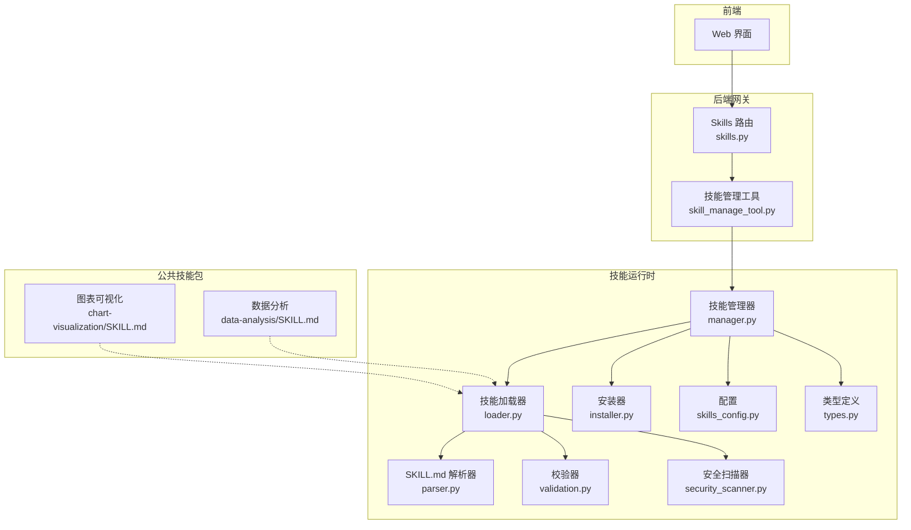
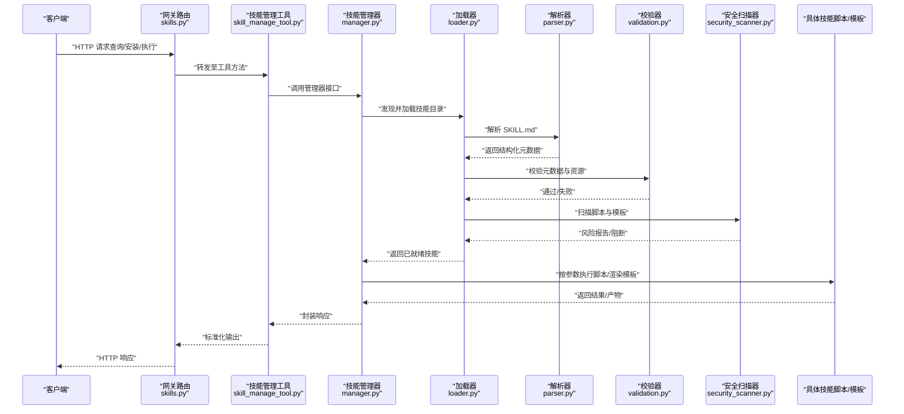
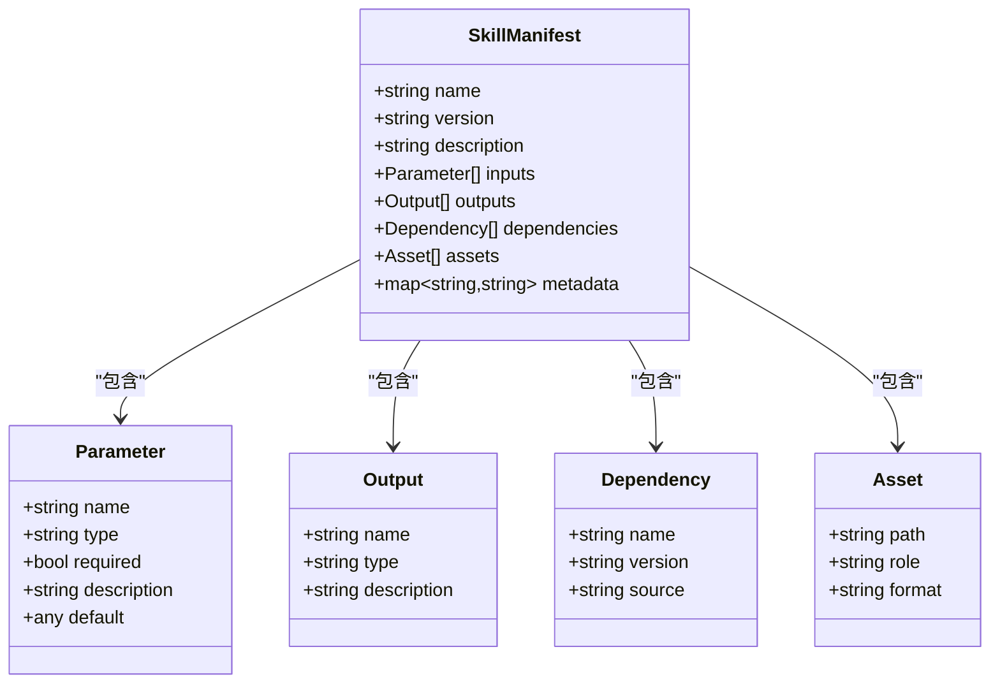
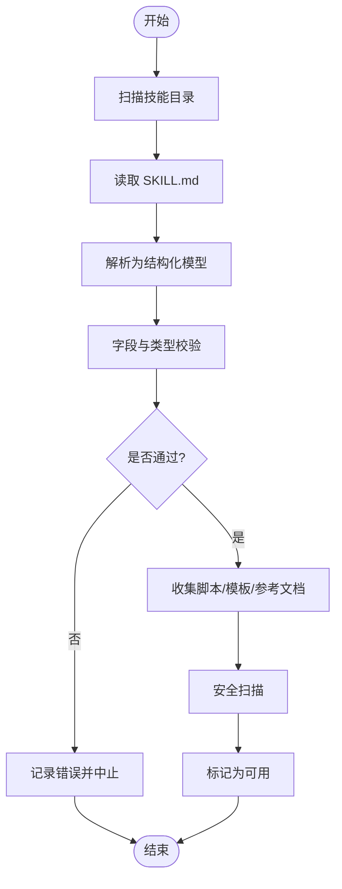
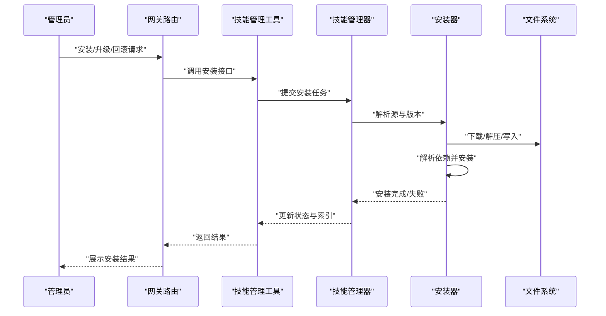
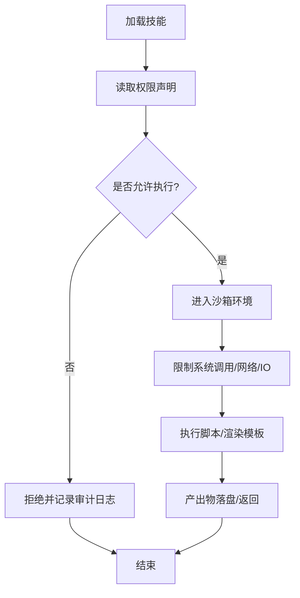
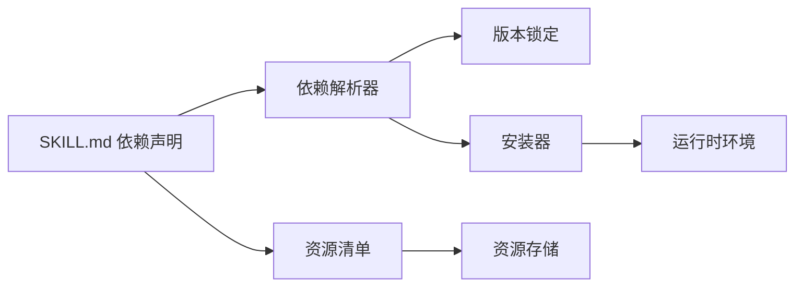

# 技能生态系统

<cite>
**本文引用的文件**   
- [skills_config.py](file://backend/packages/harness/deerflow/config/skills_config.py)
- [installer.py](file://backend/packages/harness/deerflow/skills/installer.py)
- [loader.py](file://backend/packages/harness/deerflow/skills/loader.py)
- [manager.py](file://backend/packages/harness/deerflow/skills/manager.py)
- [parser.py](file://backend/packages/harness/deerflow/skills/parser.py)
- [security_scanner.py](file://backend/packages/harness/deerflow/skills/security_scanner.py)
- [types.py](file://backend/packages/harness/deerflow/skills/types.py)
- [validation.py](file://backend/packages/harness/deerflow/skills/validation.py)
- [skill_manage_tool.py](file://backend/packages/harness/deerflow/tools/skill_manage_tool.py)
- [skills.py](file://backend/app/gateway/routers/skills.py)
- [SKILL.md](file://skills/public/chart-visualization/SKILL.md)
- [analyze.py](file://skills/public/data-analysis/scripts/analyze.py)
- [generate.js](file://skills/public/chart-visualization/scripts/generate.js)
</cite>

## 目录
1. [简介](#简介)
2. [项目结构](#项目结构)
3. [核心组件](#核心组件)
4. [架构总览](#架构总览)
5. [详细组件分析](#详细组件分析)
6. [依赖关系分析](#依赖关系分析)
7. [性能考虑](#性能考虑)
8. [故障排查指南](#故障排查指南)
9. [结论](#结论)
10. [附录](#附录)

## 简介
本文件系统化阐述 DeerFlow 的技能生态系统，覆盖技能架构设计、SKILL.md 规范、安装与管理机制、内置技能功能与用法、自定义技能开发（脚本编写、工具集成、安全扫描）、版本管理、依赖解析与权限控制。目标是帮助开发者快速理解并扩展 DeerFlow 的技能能力，同时为运维与使用者提供清晰的治理与安全策略。

## 项目结构
DeerFlow 的技能系统由“后端运行时 + 前端网关 + 公共技能包”三部分构成：
- 后端运行时负责技能的加载、解析、验证、安装、执行与安全扫描；
- 前端网关暴露 REST API，供 UI 或外部系统集成；
- 公共技能包位于 skills/public，包含多个示例技能，每个技能以 SKILL.md 为核心描述文件，可附带 scripts、templates、references 等资产。

图示来源
- [skills.py](file://backend/app/gateway/routers/skills.py)
- [skill_manage_tool.py](file://backend/packages/harness/deerflow/tools/skill_manage_tool.py)
- [manager.py](file://backend/packages/harness/deerflow/skills/manager.py)
- [loader.py](file://backend/packages/harness/deerflow/skills/loader.py)
- [parser.py](file://backend/packages/harness/deerflow/skills/parser.py)
- [validation.py](file://backend/packages/harness/deerflow/skills/validation.py)
- [security_scanner.py](file://backend/packages/harness/deerflow/skills/security_scanner.py)
- [installer.py](file://backend/packages/harness/deerflow/skills/installer.py)
- [types.py](file://backend/packages/harness/deerflow/skills/types.py)
- [skills_config.py](file://backend/packages/harness/deerflow/config/skills_config.py)
- [SKILL.md](file://skills/public/chart-visualization/SKILL.md)

章节来源
- [skills.py](file://backend/app/gateway/routers/skills.py)
- [skill_manage_tool.py](file://backend/packages/harness/deerflow/tools/skill_manage_tool.py)
- [manager.py](file://backend/packages/harness/deerflow/skills/manager.py)
- [loader.py](file://backend/packages/harness/deerflow/skills/loader.py)
- [parser.py](file://backend/packages/harness/deerflow/skills/parser.py)
- [validation.py](file://backend/packages/harness/deerflow/skills/validation.py)
- [security_scanner.py](file://backend/packages/harness/deerflow/skills/security_scanner.py)
- [installer.py](file://backend/packages/harness/deerflow/skills/installer.py)
- [types.py](file://backend/packages/harness/deerflow/skills/types.py)
- [skills_config.py](file://backend/packages/harness/deerflow/config/skills_config.py)
- [SKILL.md](file://skills/public/chart-visualization/SKILL.md)

## 核心组件
- 技能管理器（Manager）：统一协调技能的发现、注册、生命周期管理与调用分发。
- 技能加载器（Loader）：从文件系统读取技能目录，聚合元数据与资源。
- SKILL.md 解析器（Parser）：解析 SKILL.md 的结构化字段，生成统一的技能模型。
- 校验器（Validator）：对解析结果进行完整性与一致性校验。
- 安全扫描器（Scanner）：对脚本与模板进行静态安全检查，阻断高风险操作。
- 安装器（Installer）：处理技能包的下载、解压、依赖安装与版本切换。
- 类型定义（Types）：定义技能元数据、参数、输出、权限等数据结构。
- 配置（Config）：集中管理技能路径、启用开关、沙箱策略等。
- 网关路由（Routers）：对外暴露技能查询、安装、卸载、升级等接口。
- 工具封装（Tool）：将技能管理能力封装为 Agent 可调用的工具。

章节来源
- [manager.py](file://backend/packages/harness/deerflow/skills/manager.py)
- [loader.py](file://backend/packages/harness/deerflow/skills/loader.py)
- [parser.py](file://backend/packages/harness/deerflow/skills/parser.py)
- [validation.py](file://backend/packages/harness/deerflow/skills/validation.py)
- [security_scanner.py](file://backend/packages/harness/deerflow/skills/security_scanner.py)
- [installer.py](file://backend/packages/harness/deerflow/skills/installer.py)
- [types.py](file://backend/packages/harness/deerflow/skills/types.py)
- [skills_config.py](file://backend/packages/harness/deerflow/config/skills_config.py)
- [skills.py](file://backend/app/gateway/routers/skills.py)
- [skill_manage_tool.py](file://backend/packages/harness/deerflow/tools/skill_manage_tool.py)

## 架构总览
下图展示了从请求到技能执行的端到端流程，包括解析、校验、安全扫描与执行。

图示来源
- [skills.py](file://backend/app/gateway/routers/skills.py)
- [skill_manage_tool.py](file://backend/packages/harness/deerflow/tools/skill_manage_tool.py)
- [manager.py](file://backend/packages/harness/deerflow/skills/manager.py)
- [loader.py](file://backend/packages/harness/deerflow/skills/loader.py)
- [parser.py](file://backend/packages/harness/deerflow/skills/parser.py)
- [validation.py](file://backend/packages/harness/deerflow/skills/validation.py)
- [security_scanner.py](file://backend/packages/harness/deerflow/skills/security_scanner.py)

## 详细组件分析

### 组件一：SKILL.md 规范与解析
SKILL.md 是技能的契约文件，用于声明技能名称、版本、描述、输入参数、输出格式、依赖与环境要求、模板与脚本清单等。解析器将其转换为内部类型模型，供后续校验与执行使用。

图示来源
- [parser.py](file://backend/packages/harness/deerflow/skills/parser.py)
- [types.py](file://backend/packages/harness/deerflow/skills/types.py)

章节来源
- [parser.py](file://backend/packages/harness/deerflow/skills/parser.py)
- [types.py](file://backend/packages/harness/deerflow/skills/types.py)

### 组件二：加载与校验流程
加载器负责遍历技能目录、收集 SKILL.md 与资源文件，随后交由校验器检查必填字段、类型约束与引用完整性。

图示来源
- [loader.py](file://backend/packages/harness/deerflow/skills/loader.py)
- [validation.py](file://backend/packages/harness/deerflow/skills/validation.py)
- [security_scanner.py](file://backend/packages/harness/deerflow/skills/security_scanner.py)

章节来源
- [loader.py](file://backend/packages/harness/deerflow/skills/loader.py)
- [validation.py](file://backend/packages/harness/deerflow/skills/validation.py)
- [security_scanner.py](file://backend/packages/harness/deerflow/skills/security_scanner.py)

### 组件三：安装与版本管理
安装器支持从本地或远程源安装技能包，解析依赖并进行版本选择与切换。管理器维护已安装技能列表与当前激活版本。

图示来源
- [installer.py](file://backend/packages/harness/deerflow/skills/installer.py)
- [manager.py](file://backend/packages/harness/deerflow/skills/manager.py)
- [skills.py](file://backend/app/gateway/routers/skills.py)
- [skill_manage_tool.py](file://backend/packages/harness/deerflow/tools/skill_manage_tool.py)

章节来源
- [installer.py](file://backend/packages/harness/deerflow/skills/installer.py)
- [manager.py](file://backend/packages/harness/deerflow/skills/manager.py)
- [skills.py](file://backend/app/gateway/routers/skills.py)
- [skill_manage_tool.py](file://backend/packages/harness/deerflow/tools/skill_manage_tool.py)

### 组件四：权限控制与沙箱隔离
权限控制基于 SKILL.md 的权限声明与配置策略，结合沙箱环境限制脚本的系统调用、网络访问与文件读写范围。安全扫描器在加载阶段进行静态检查，拦截高危模式。

图示来源
- [security_scanner.py](file://backend/packages/harness/deerflow/skills/security_scanner.py)
- [skills_config.py](file://backend/packages/harness/deerflow/config/skills_config.py)
- [types.py](file://backend/packages/harness/deerflow/skills/types.py)

章节来源
- [security_scanner.py](file://backend/packages/harness/deerflow/skills/security_scanner.py)
- [skills_config.py](file://backend/packages/harness/deerflow/config/skills_config.py)
- [types.py](file://backend/packages/harness/deerflow/skills/types.py)

### 组件五：内置技能功能与使用方法
- 数据分析（data-analysis）：提供数据清洗、统计分析与结果导出能力，通常通过 Python 脚本实现。
- 图表可视化（chart-visualization）：支持多种图表生成（如饼图、柱状图、桑基图等），通过脚本与模板组合输出可视化产物。
- 内容生成（newsletter-generation、novel-generation、podcast-generation、video-generation、image-generation、ppt-generation）：围绕不同媒体形态的内容生产流水线，结合模板与脚本完成批量生成。
- 研究类（deep-research、github-deep-research、systematic-literature-review）：整合搜索与检索工具，产出研究报告或综述。
- 工程与部署（vercel-deploy-claimable、bootstrap、smoke-test）：辅助部署、初始化与冒烟测试。

使用方法要点：
- 通过网关路由或工具接口查询可用技能与参数；
- 根据 SKILL.md 提供的输入参数与输出格式组织请求；
- 指定版本与依赖后执行，产物可通过工件接口获取。

章节来源
- [SKILL.md](file://skills/public/chart-visualization/SKILL.md)
- [analyze.py](file://skills/public/data-analysis/scripts/analyze.py)
- [generate.js](file://skills/public/chart-visualization/scripts/generate.js)

## 依赖关系分析
技能依赖分为两类：
- 运行时依赖：脚本语言解释器、第三方库、外部服务；
- 资源依赖：模板、参考文档、数据集等。

安装器负责解析 SKILL.md 中的依赖声明，并按需拉取与安装。管理器维护依赖树与版本锁定，避免冲突。

图示来源
- [installer.py](file://backend/packages/harness/deerflow/skills/installer.py)
- [types.py](file://backend/packages/harness/deerflow/skills/types.py)
- [skills_config.py](file://backend/packages/harness/deerflow/config/skills_config.py)

章节来源
- [installer.py](file://backend/packages/harness/deerflow/skills/installer.py)
- [types.py](file://backend/packages/harness/deerflow/skills/types.py)
- [skills_config.py](file://backend/packages/harness/deerflow/config/skills_config.py)

## 性能考虑
- 懒加载与缓存：对 SKILL.md 解析结果与资源索引进行缓存，减少重复 IO。
- 并行扫描：对多技能目录并发扫描与解析，提升发现速度。
- 增量安装：仅拉取变更的依赖与资源，降低带宽与时间开销。
- 沙箱隔离：通过轻量级容器或进程隔离，避免相互干扰。
- 产物复用：对相同参数的执行结果进行缓存，加速重复任务。

[本节为通用指导，不直接分析具体文件]

## 故障排查指南
常见问题与定位步骤：
- 解析失败：检查 SKILL.md 字段是否符合类型定义与必填项；查看解析器与校验器的错误信息。
- 安全扫描阻断：确认脚本是否存在高危模式（如任意命令执行、敏感路径访问），调整权限声明与白名单。
- 依赖安装失败：核对源地址、版本兼容性与网络连通性；查看安装器日志。
- 权限不足：检查配置中的权限策略与沙箱限制，确保必要资源挂载与访问许可。
- 版本冲突：使用管理器查看依赖树，必要时降级或锁定版本。

章节来源
- [validation.py](file://backend/packages/harness/deerflow/skills/validation.py)
- [security_scanner.py](file://backend/packages/harness/deerflow/skills/security_scanner.py)
- [installer.py](file://backend/packages/harness/deerflow/skills/installer.py)
- [skills_config.py](file://backend/packages/harness/deerflow/config/skills_config.py)

## 结论
DeerFlow 的技能生态以 SKILL.md 为契约，配合解析、校验、安全扫描与安装管理，形成可扩展、可治理、可审计的技能体系。通过网关与工具封装，技能可被前端与 Agent 无缝调用。建议在生产环境中严格遵循权限与沙箱策略，完善依赖锁定与版本管理，保障稳定与安全。

[本节为总结，不直接分析具体文件]

## 附录

### 自定义技能开发指南
- 目录结构建议：
  - SKILL.md：技能契约与参数说明；
  - scripts：可执行脚本（Python/JS 等）；
  - templates：渲染模板（Markdown/HTML 等）；
  - references：参考文档与 SOP；
  - assets：其他资源（图片、数据集）。
- 脚本编写：
  - 明确输入参数与输出产物；
  - 避免危险系统调用，尽量使用受控 API；
  - 做好日志与错误码，便于追踪。
- 工具集成：
  - 通过环境变量或配置文件注入密钥与端点；
  - 使用 HTTP/SDK 方式调用外部服务，注意超时与重试。
- 安全扫描：
  - 提前运行静态检查，修复高危模式；
  - 最小权限原则，按需开放网络与文件访问。
- 版本管理：
  - 在 SKILL.md 中声明版本号；
  - 使用安装器进行安装与升级，保留回滚能力。

章节来源
- [SKILL.md](file://skills/public/chart-visualization/SKILL.md)
- [analyze.py](file://skills/public/data-analysis/scripts/analyze.py)
- [generate.js](file://skills/public/chart-visualization/scripts/generate.js)
- [security_scanner.py](file://backend/packages/harness/deerflow/skills/security_scanner.py)
- [installer.py](file://backend/packages/harness/deerflow/skills/installer.py)
- [types.py](file://backend/packages/harness/deerflow/skills/types.py)