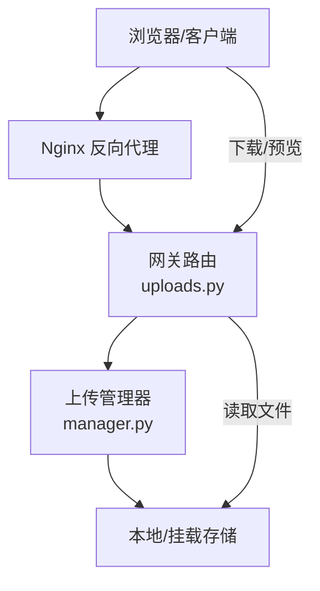
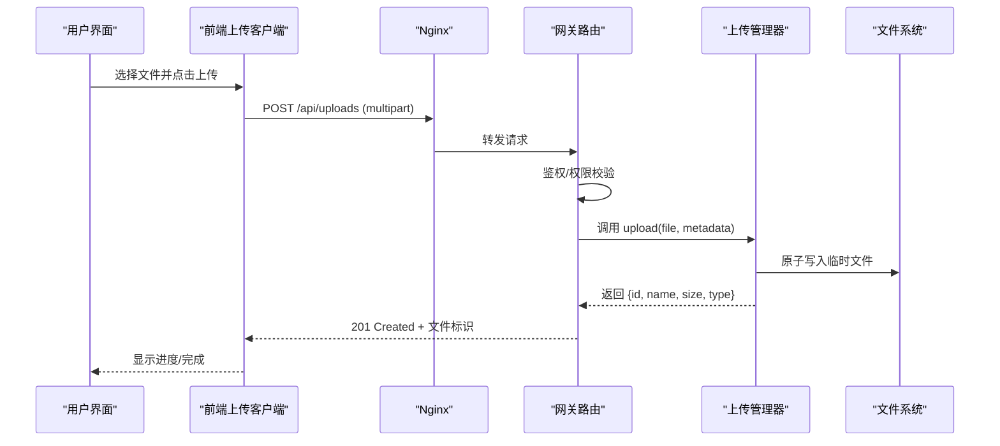
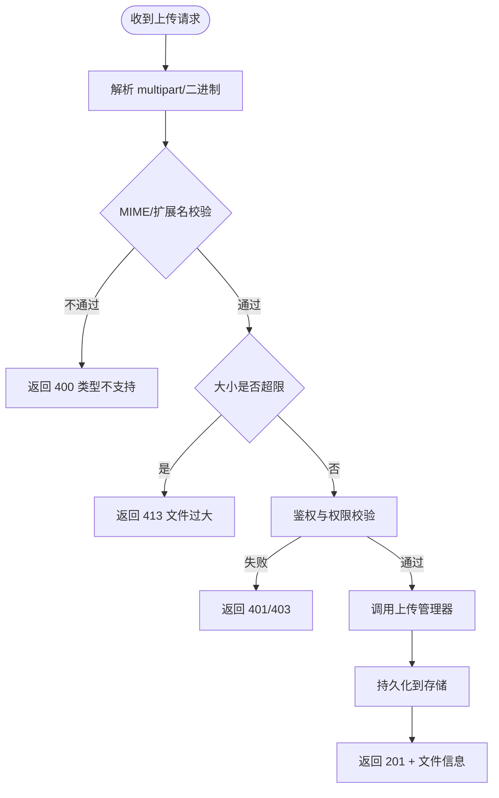
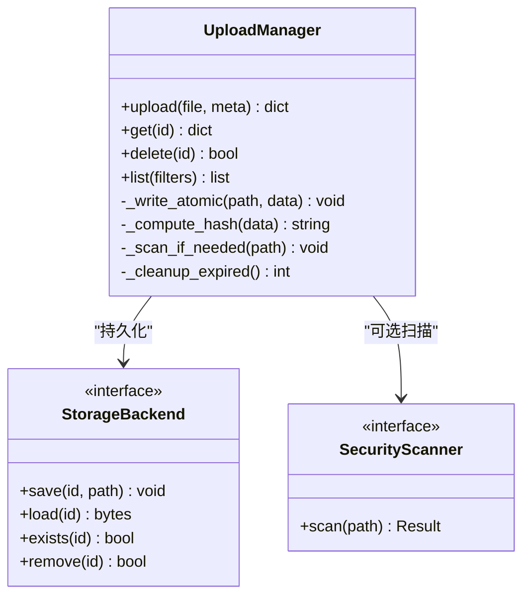
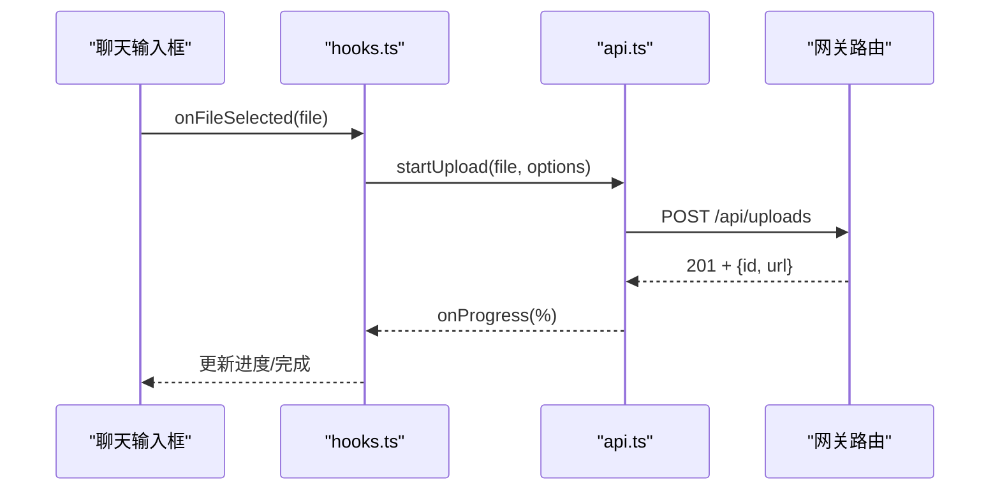
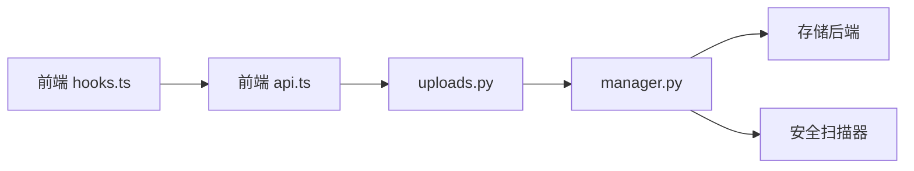
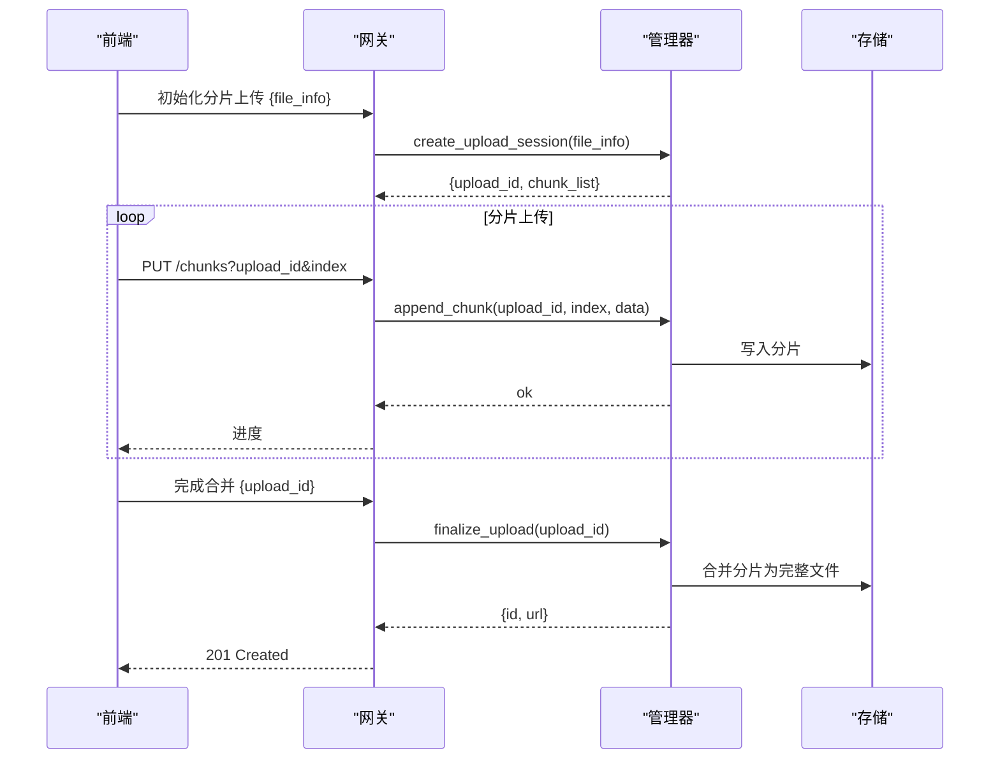

# 文件处理系统

<cite>
**本文引用的文件**   
- [backend/app/gateway/routers/uploads.py](file://backend/app/gateway/routers/uploads.py)
- [backend/packages/harness/deerflow/uploads/manager.py](file://backend/packages/harness/deerflow/uploads/manager.py)
- [backend/docs/FILE_UPLOAD.md](file://backend/docs/FILE_UPLOAD.md)
- [backend/tests/test_uploads_router.py](file://backend/tests/test_uploads_router.py)
- [backend/tests/test_uploads_manager.py](file://backend/tests/test_uploads_manager.py)
- [frontend/src/core/uploads/index.ts](file://frontend/src/core/uploads/index.ts)
- [frontend/src/core/uploads/api.ts](file://frontend/src/core/uploads/api.ts)
- [frontend/src/core/uploads/hooks.ts](file://frontend/src/core/uploads/hooks.ts)
- [frontend/src/components/workspace/chats/input-box.tsx](file://frontend/src/components/workspace/chats/input-box.tsx)
- [docker/nginx/nginx.conf](file://docker/nginx/nginx.conf)
</cite>

## 目录
1. [简介](#简介)
2. [项目结构](#项目结构)
3. [核心组件](#核心组件)
4. [架构总览](#架构总览)
5. [详细组件分析](#详细组件分析)
6. [依赖关系分析](#依赖关系分析)
7. [性能考虑](#性能考虑)
8. [故障排查指南](#故障排查指南)
9. [结论](#结论)
10. [附录](#附录)

## 简介
本文件为 DeerFlow 的文件处理系统提供系统化文档，覆盖上传机制、支持格式与大小限制、病毒扫描能力、存储策略、访问控制与生命周期管理；同时给出文件处理 API 接口说明、错误处理与性能优化建议，并针对大文件、并发上传与断点续传提出实现方案。

## 项目结构
DeerFlow 的文件处理涉及后端网关路由、上传管理器、前端上传客户端与 Nginx 代理配置等模块：
- 后端网关路由：定义上传相关 HTTP 端点，负责参数校验、调用上传管理器、返回结果。
- 上传管理器：封装文件落盘、元数据记录、清理与查询等核心逻辑。
- 前端上传客户端：封装上传请求、进度回调、错误重试与状态同步。
- Nginx 配置：调整上传大小限制、超时与缓冲策略。

图表来源
- [backend/app/gateway/routers/uploads.py](file://backend/app/gateway/routers/uploads.py)
- [backend/packages/harness/deerflow/uploads/manager.py](file://backend/packages/harness/deerflow/uploads/manager.py)
- [docker/nginx/nginx.conf](file://docker/nginx/nginx.conf)

章节来源
- [backend/app/gateway/routers/uploads.py](file://backend/app/gateway/routers/uploads.py)
- [backend/packages/harness/deerflow/uploads/manager.py](file://backend/packages/harness/deerflow/uploads/manager.py)
- [docker/nginx/nginx.conf](file://docker/nginx/nginx.conf)

## 核心组件
- 上传路由层（Gateway）
  - 职责：接收 multipart/form-data 或二进制流，进行基础校验（类型、大小），转发至上传管理器，返回统一响应。
  - 关键点：路径白名单、MIME 校验、大小阈值、并发限流、鉴权上下文透传。
- 上传管理器（Manager）
  - 职责：生成唯一文件名/ID、写入磁盘、记录元数据（名称、类型、大小、哈希、创建时间、归属会话/用户）、过期清理、安全扫描触发。
  - 关键点：原子写入、幂等性（基于 ID）、并发安全锁、异常回滚。
- 前端上传客户端
  - 职责：构造请求、分片/进度上报、失败重试、取消上传、错误提示。
  - 关键点：AbortController 取消、重试退避、进度事件、错误分类。
- Nginx 代理
  - 职责：前置拦截超大请求、设置 client_max_body_size、超时与缓冲。
  - 关键点：与后端大小限制一致化、避免中间层提前拒绝。

章节来源
- [backend/app/gateway/routers/uploads.py](file://backend/app/gateway/routers/uploads.py)
- [backend/packages/harness/deerflow/uploads/manager.py](file://backend/packages/harness/deerflow/uploads/manager.py)
- [frontend/src/core/uploads/index.ts](file://frontend/src/core/uploads/index.ts)
- [frontend/src/core/uploads/api.ts](file://frontend/src/core/uploads/api.ts)
- [frontend/src/core/uploads/hooks.ts](file://frontend/src/core/uploads/hooks.ts)
- [docker/nginx/nginx.conf](file://docker/nginx/nginx.conf)

## 架构总览
下图展示一次典型上传流程的端到端交互：

图表来源
- [backend/app/gateway/routers/uploads.py](file://backend/app/gateway/routers/uploads.py)
- [backend/packages/harness/deerflow/uploads/manager.py](file://backend/packages/harness/deerflow/uploads/manager.py)
- [docker/nginx/nginx.conf](file://docker/nginx/nginx.conf)

## 详细组件分析

### 上传路由层（Gateway）
- 功能要点
  - 接收 multipart/form-data 或二进制流，解析文件与表单字段。
  - 执行 MIME 白名单校验、扩展名校验、文件大小上限检查。
  - 将当前会话/用户上下文注入到上传元数据中。
  - 调用上传管理器完成持久化，返回标准化响应。
- 错误处理
  - 非法类型/过大文件：返回明确错误码与消息。
  - 服务内部错误：统一包装为 5xx，附带可追踪的请求 ID。
- 并发与安全
  - 对同一用户的并发上传数进行限流。
  - 防止路径穿越与危险扩展名。

图表来源
- [backend/app/gateway/routers/uploads.py](file://backend/app/gateway/routers/uploads.py)

章节来源
- [backend/app/gateway/routers/uploads.py](file://backend/app/gateway/routers/uploads.py)
- [backend/tests/test_uploads_router.py](file://backend/tests/test_uploads_router.py)

### 上传管理器（Manager）
- 功能要点
  - 生成稳定且唯一的文件标识（如 UUID），用于幂等与去重。
  - 原子写入：先写临时文件，再移动至最终位置，确保一致性。
  - 元数据记录：文件名、类型、大小、哈希、创建时间、所属会话/用户、过期时间。
  - 可选安全扫描：在落盘后触发扫描任务，标记“待扫描/已扫描/风险”状态。
  - 生命周期：按策略定时清理过期或孤立文件。
- 并发与一致性
  - 使用文件级或对象级锁避免重复写入。
  - 失败时回滚临时文件，保证无脏数据。
- 可扩展点
  - 存储后端抽象（本地磁盘、S3/OSS 等）。
  - 扫描器插件（ClamAV、自定义脚本）。

图表来源
- [backend/packages/harness/deerflow/uploads/manager.py](file://backend/packages/harness/deerflow/uploads/manager.py)

章节来源
- [backend/packages/harness/deerflow/uploads/manager.py](file://backend/packages/harness/deerflow/uploads/manager.py)
- [backend/tests/test_uploads_manager.py](file://backend/tests/test_uploads_manager.py)

### 前端上传客户端
- 功能要点
  - 封装上传 API：初始化、分片上传、进度上报、取消、重试。
  - 错误分类：网络错误、服务端校验错误、超时、取消。
  - 用户体验：进度条、失败重试提示、自动恢复。
- 关键实现
  - 使用 AbortController 支持取消。
  - 指数退避重试与最大重试次数限制。
  - 进度事件节流更新 UI。

图表来源
- [frontend/src/core/uploads/api.ts](file://frontend/src/core/uploads/api.ts)
- [frontend/src/core/uploads/hooks.ts](file://frontend/src/core/uploads/hooks.ts)
- [frontend/src/components/workspace/chats/input-box.tsx](file://frontend/src/components/workspace/chats/input-box.tsx)

章节来源
- [frontend/src/core/uploads/index.ts](file://frontend/src/core/uploads/index.ts)
- [frontend/src/core/uploads/api.ts](file://frontend/src/core/uploads/api.ts)
- [frontend/src/core/uploads/hooks.ts](file://frontend/src/core/uploads/hooks.ts)
- [frontend/src/components/workspace/chats/input-box.tsx](file://frontend/src/components/workspace/chats/input-box.tsx)

### Nginx 代理与大小限制
- 关键配置项
  - client_max_body_size：与后端大小限制保持一致，避免被代理层拒绝。
  - proxy_read_timeout/proxy_send_timeout：适配大文件上传耗时。
  - proxy_buffering：根据场景开启/关闭，平衡内存与吞吐。
- 建议
  - 生产环境结合 WAF/速率限制，防滥用。
  - 对静态资源与上传路径分别调优。

章节来源
- [docker/nginx/nginx.conf](file://docker/nginx/nginx.conf)

## 依赖关系分析
- 组件耦合
  - 路由层仅依赖上传管理器接口，保持低耦合。
  - 前端上传客户端与服务端路由解耦，通过 RESTful 接口通信。
- 外部依赖
  - 存储后端（本地/对象存储）可插拔。
  - 安全扫描器（ClamAV 或自定义）可插拔。
- 潜在循环依赖
  - 路由层不应直接依赖具体存储实现，避免循环。

图表来源
- [backend/app/gateway/routers/uploads.py](file://backend/app/gateway/routers/uploads.py)
- [backend/packages/harness/deerflow/uploads/manager.py](file://backend/packages/harness/deerflow/uploads/manager.py)
- [frontend/src/core/uploads/api.ts](file://frontend/src/core/uploads/api.ts)
- [frontend/src/core/uploads/hooks.ts](file://frontend/src/core/uploads/hooks.ts)

章节来源
- [backend/app/gateway/routers/uploads.py](file://backend/app/gateway/routers/uploads.py)
- [backend/packages/harness/deerflow/uploads/manager.py](file://backend/packages/harness/deerflow/uploads/manager.py)
- [frontend/src/core/uploads/api.ts](file://frontend/src/core/uploads/api.ts)
- [frontend/src/core/uploads/hooks.ts](file://frontend/src/core/uploads/hooks.ts)

## 性能考虑
- 传输层
  - 合理设置 Nginx 与后端超时，避免大文件中断。
  - 启用 gzip 仅对文本类响应，上传本身不压缩。
- 服务端
  - 流式写入，避免一次性加载到内存。
  - 并发上传限流与队列化，保护存储 IO。
  - 计算哈希采用增量方式，减少 CPU 峰值。
- 前端
  - 分片上传与并行度可控，避免阻塞主线程。
  - 进度上报节流，降低渲染压力。
- 存储
  - 优先写入 SSD/NVMe，或使用高性能对象存储。
  - 定期清理过期文件，释放空间。

[本节为通用指导，无需代码引用]

## 故障排查指南
- 常见问题
  - 413 Payload Too Large：检查 Nginx client_max_body_size 与后端大小限制是否一致。
  - 400 Unsupported Media Type：确认 MIME 白名单与扩展名映射。
  - 401/403：检查鉴权与权限策略。
  - 上传中断：查看网络稳定性与超时配置。
- 定位方法
  - 查看网关日志中的请求 ID 与错误堆栈。
  - 核对上传管理器落盘与元数据记录是否成对成功。
  - 前端控制台捕获错误分类与重试次数。
- 参考测试用例
  - 路由层行为与边界条件验证。
  - 管理器幂等、并发与清理逻辑验证。

章节来源
- [backend/tests/test_uploads_router.py](file://backend/tests/test_uploads_router.py)
- [backend/tests/test_uploads_manager.py](file://backend/tests/test_uploads_manager.py)

## 结论
DeerFlow 的文件处理系统以清晰的网关路由与上传管理器分层为核心，配合前端上传客户端与 Nginx 前置控制，形成完整的上传链路。通过白名单校验、大小限制、原子写入与可选安全扫描，兼顾安全性与可靠性。面向大文件与高并发场景，可通过分片上传、限流与存储优化进一步提升体验与吞吐。

[本节为总结，无需代码引用]

## 附录

### 支持的格式与大小限制
- 支持格式
  - 文本类：txt、md、csv、json、xml、log 等。
  - 办公文档：pdf、doc/docx、xls/xlsx、ppt/pptx。
  - 图片：jpg/jpeg、png、gif、webp、svg。
  - 压缩包：zip、tar.gz（建议在后台解压后再处理）。
- 大小限制
  - 默认单文件大小建议不超过 50MB（可按业务调整）。
  - 全局限流与并发上传数需结合部署环境评估。
- 配置位置
  - 后端路由与管理器中的白名单与阈值。
  - Nginx 的 client_max_body_size。

章节来源
- [backend/docs/FILE_UPLOAD.md](file://backend/docs/FILE_UPLOAD.md)
- [backend/app/gateway/routers/uploads.py](file://backend/app/gateway/routers/uploads.py)
- [docker/nginx/nginx.conf](file://docker/nginx/nginx.conf)

### 病毒扫描功能
- 扫描时机
  - 文件落盘成功后异步触发扫描，避免阻塞上传主流程。
- 扫描结果
  - 安全：允许后续处理。
  - 风险：阻断访问并告警，保留证据文件。
  - 未知：延迟处理或人工复核。
- 集成方式
  - 通过扫描器接口接入 ClamAV 或自研扫描服务。
  - 扫描任务失败应降级为“待复核”，不影响整体可用性。

章节来源
- [backend/packages/harness/deerflow/uploads/manager.py](file://backend/packages/harness/deerflow/uploads/manager.py)

### 存储策略与访问控制
- 存储策略
  - 命名规范：{会话ID}/{用户ID}/{时间戳}_{随机串}.{扩展名}。
  - 分区策略：按日期或租户分目录，便于清理与配额。
  - 副本与备份：重要附件可开启跨可用区复制。
- 访问控制
  - 基于会话/用户维度的访问令牌或签名 URL。
  - 短时效直链下载，禁止未授权遍历。
- 生命周期管理
  - 过期策略：会话结束或固定天数后自动清理。
  - 冷数据归档：长期不访问文件迁移至低成本存储。

章节来源
- [backend/packages/harness/deerflow/uploads/manager.py](file://backend/packages/harness/deerflow/uploads/manager.py)

### 文件处理 API 接口
- 上传文件
  - 方法：POST
  - 路径：/api/uploads
  - 内容类型：multipart/form-data
  - 请求体：file（必填）、metadata（可选）
  - 响应：201 Created，包含 id、name、size、type、url
  - 错误：400/413/401/403/5xx
- 获取文件信息
  - 方法：GET
  - 路径：/api/uploads/{id}
  - 响应：200 OK，包含元数据
- 删除文件
  - 方法：DELETE
  - 路径：/api/uploads/{id}
  - 响应：204 No Content
- 列表文件
  - 方法：GET
  - 路径：/api/uploads
  - 查询参数：session_id、user_id、limit、offset
  - 响应：200 OK，包含分页结果

章节来源
- [backend/app/gateway/routers/uploads.py](file://backend/app/gateway/routers/uploads.py)
- [backend/tests/test_uploads_router.py](file://backend/tests/test_uploads_router.py)

### 大文件处理、并发上传与断点续传方案
- 大文件处理
  - 服务端：流式写入、分块校验、失败重试、断点续传元数据。
  - 前端：分片切分、并发度可调、进度上报、取消与恢复。
- 并发上传
  - 服务端：基于用户/会话的并发上限与队列化。
  - 前端：限制同文件并发分片数，避免拥塞。
- 断点续传
  - 首次上传返回 upload_id 与分片清单。
  - 后续请求携带 upload_id 与分片偏移，服务端合并分片。
  - 合并完成后生成最终文件 ID 并返回。

[该图为概念流程示意，不直接对应具体源码文件]