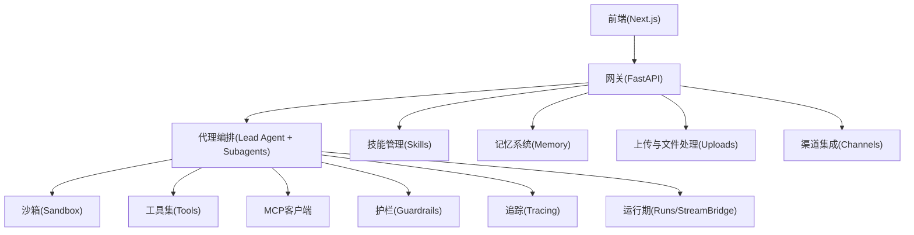
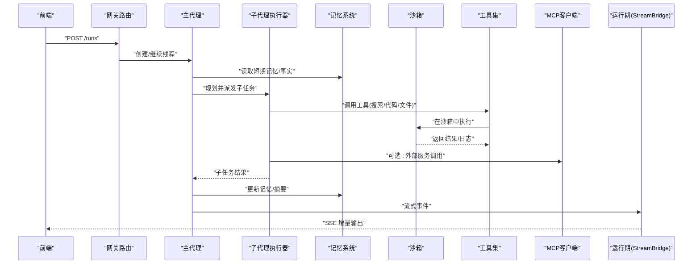
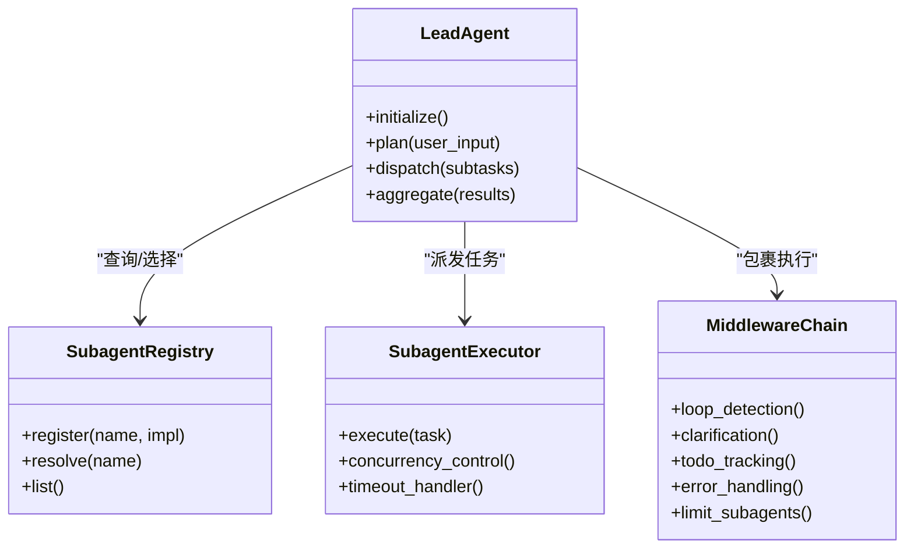
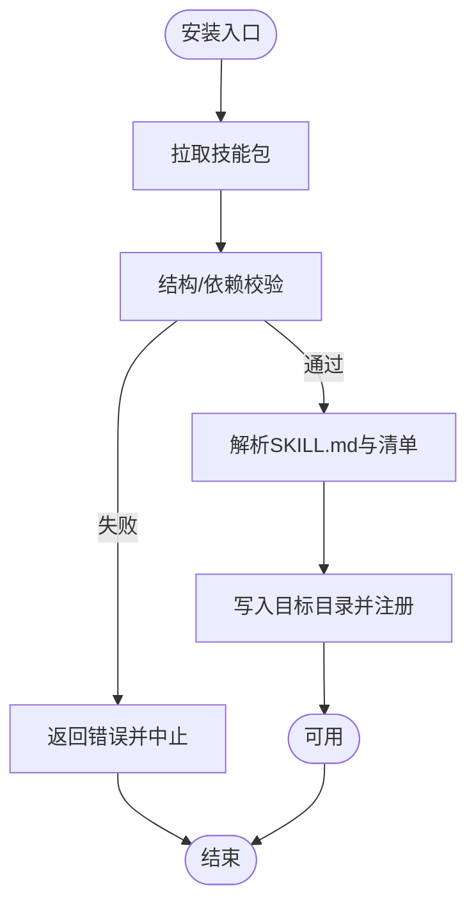
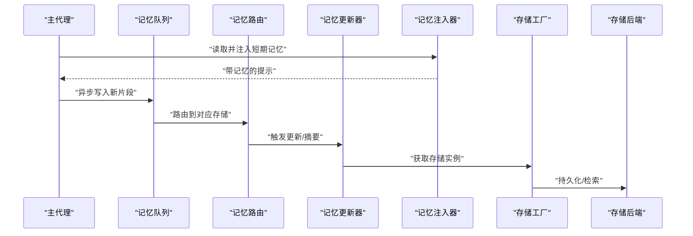
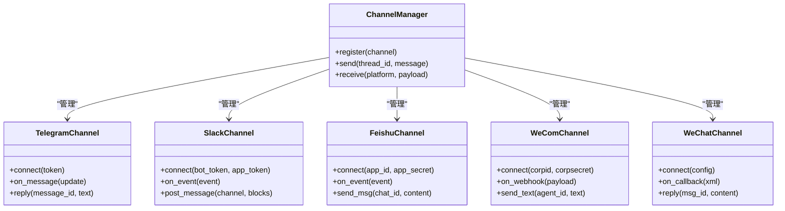
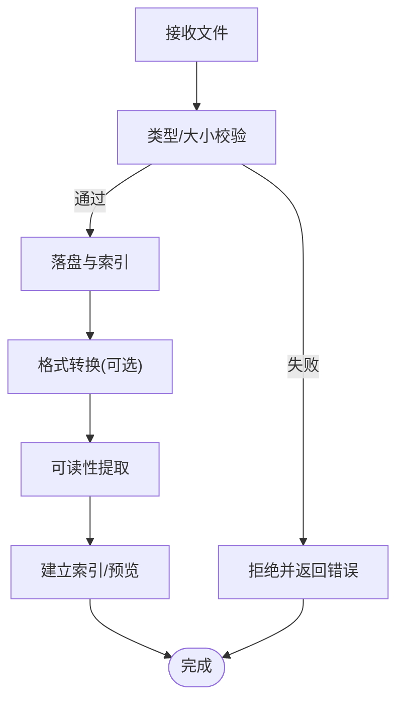
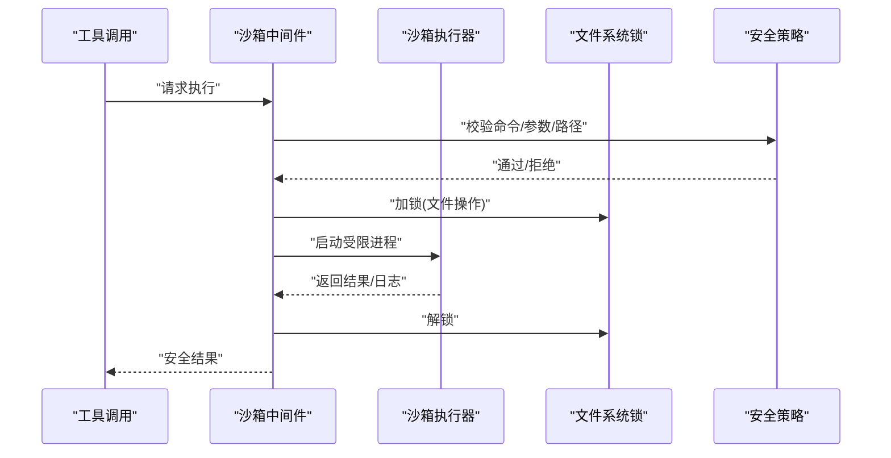
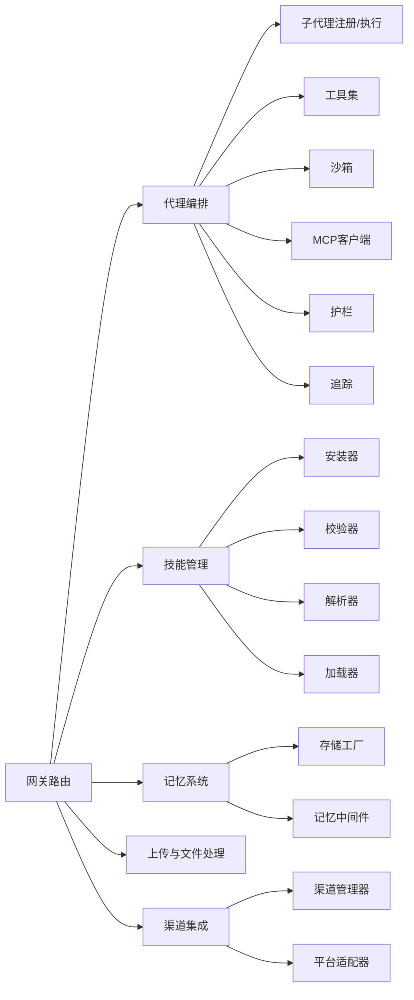

# 核心功能

<cite>
**本文引用的文件**   
- [backend/app/gateway/routers/agents.py](file://backend/app/gateway/routers/agents.py)
- [backend/app/gateway/routers/skills.py](file://backend/app/gateway/routers/skills.py)
- [backend/app/gateway/routers/memory.py](file://backend/app/gateway/routers/memory.py)
- [backend/app/gateway/routers/uploads.py](file://backend/app/gateway/routers/uploads.py)
- [backend/app/channels/manager.py](file://backend/app/channels/manager.py)
- [backend/app/channels/telegram.py](file://backend/app/channels/telegram.py)
- [backend/app/channels/slack.py](file://backend/app/channels/slack.py)
- [backend/app/channels/feishu.py](file://backend/app/channels/feishu.py)
- [backend/app/channels/wechat.py](file://backend/app/channels/wechat.py)
- [backend/app/channels/wecom.py](file://backend/app/channels/wecom.py)
- [backend/packages/harness/deerflow/subagents/executor.py](file://backend/packages/harness/deerflow/subagents/executor.py)
- [backend/packages/harness/deerflow/subagents/registry.py](file://backend/packages/harness/deerflow/subagents/registry.py)
- [backend/packages/harness/deerflow/lead_agent/__init__.py](file://backend/packages/harness/deerflow/lead_agent/__init__.py)
- [backend/packages/harness/deerflow/skills/manager.py](file://backend/packages/harness/deerflow/skills/manager.py)
- [backend/packages/harness/deerflow/skills/installer.py](file://backend/packages/harness/deerflow/skills/installer.py)
- [backend/packages/harness/deerflow/skills/loader.py](file://backend/packages/harness/deerflow/skills/loader.py)
- [backend/packages/harness/deerflow/skills/parser.py](file://backend/packages/harness/deerflow/skills/parser.py)
- [backend/packages/harness/deerflow/skills/validation.py](file://backend/packages/harness/deerflow/skills/validation.py)
- [backend/packages/harness/deerflow/sandbox/sandbox.py](file://backend/packages/harness/deerflow/sandbox/sandbox.py)
- [backend/packages/harness/deerflow/sandbox/middleware.py](file://backend/packages/harness/deerflow/sandbox/middleware.py)
- [backend/packages/harness/deerflow/sandbox/security.py](file://backend/packages/harness/deerflow/sandbox/security.py)
- [backend/packages/harness/deerflow/sandbox/tools.py](file://backend/packages/harness/deerflow/sandbox/tools.py)
- [backend/packages/harness/deerflow/runtime/store/base.py](file://backend/packages/harness/deerflow/runtime/store/base.py)
- [backend/packages/harness/deerflow/runtime/store/factory.py](file://backend/packages/harness/deerflow/runtime/store/factory.py)
- [backend/packages/harness/deerflow/config/memory_config.py](file://backend/packages/harness/deerflow/config/memory_config.py)
- [backend/packages/harness/deerflow/config/sandbox_config.py](file://backend/packages/harness/deerflow/config/sandbox_config.py)
- [backend/packages/harness/deerflow/config/tool_config.py](file://backend/packages/harness/deerflow/config/tool_config.py)
- [backend/packages/harness/deerflow/config/stream_bridge_config.py](file://backend/packages/harness/deerflow/config/stream_bridge_config.py)
- [backend/packages/harness/deerflow/config/teams_config.py](file://backend/packages/harness/deerflow/config/teams_config.py)
- [backend/packages/harness/deerflow/config/subagents_config.py](file://backend/packages/harness/deerflow/config/subagents_config.py)
- [backend/packages/harness/deerflow/config/skills_config.py](file://backend/packages/harness/deerflow/config/skills_config.py)
- [backend/packages/harness/deerflow/config/model_config.py](file://backend/packages/harness/deerflow/config/model_config.py)
- [backend/packages/harness/deerflow/config/tracing_config.py](file://backend/packages/harness/deerflow/config/tracing_config.py)
- [backend/packages/harness/deerflow/config/guardrails_config.py](file://backend/packages/harness/deerflow/config/guardrails_config.py)
- [backend/packages/harness/deerflow/config/tool_search_config.py](file://backend/packages/harness/deerflow/config/tool_search_config.py)
- [backend/packages/harness/deerflow/config/title_config.py](file://backend/packages/harness/deerflow/config/title_config.py)
- [backend/packages/harness/deerflow/config/token_usage_config.py](file://backend/packages/harness/deerflow/config/token_usage_config.py)
- [backend/packages/harness/deerflow/config/checkpointer_config.py](file://backend/packages/harness/deerflow/config/checkpointer_config.py)
- [backend/packages/harness/deerflow/config/acp_config.py](file://backend/packages/harness/deerflow/config/acp_config.py)
- [backend/packages/harness/deerflow/config/extensions_config.py](file://backend/packages/harness/deerflow/config/extensions_config.py)
- [backend/packages/harness/deerflow/config/paths.py](file://backend/packages/harness/deerflow/config/paths.py)
- [backend/packages/harness/deerflow/config/app_config.py](file://backend/packages/harness/deerflow/config/app_config.py)
- [backend/packages/harness/deerflow/config/summarization_config.py](file://backend/packages/harness/deerflow/config/summarization_config.py)
- [backend/packages/harness/deerflow/config/skill_evolution_config.py](file://backend/packages/harness/deerflow/config/skill_evolution_config.py)
- [backend/packages/harness/deerflow/models/factory.py](file://backend/packages/harness/deerflow/models/factory.py)
- [backend/packages/harness/deerflow/models/credential_loader.py](file://backend/packages/harness/deerflow/models/credential_loader.py)
- [backend/packages/harness/deerflow/mcp/client.py](file://backend/packages/harness/deerflow/mcp/client.py)
- [backend/packages/harness/deerflow/mcp/tools.py](file://backend/packages/harness/deerflow/mcp/tools.py)
- [backend/packages/harness/deerflow/guardrails/middleware.py](file://backend/packages/harness/deerflow/guardrails/middleware.py)
- [backend/packages/harness/deerflow/guardrails/provider.py](file://backend/packages/harness/deerflow/guardrails/provider.py)
- [backend/packages/harness/deerflow/guardrails/builtin.py](file://backend/packages/harness/deerflow/guardrails/builtin.py)
- [backend/packages/harness/deerflow/reflection/resolvers.py](file://backend/packages/harness/deerflow/reflection/resolvers.py)
- [backend/packages/harness/deerflow/utils/file_conversion.py](file://backend/packages/harness/deerflow/utils/file_conversion.py)
- [backend/packages/harness/deerflow/utils/readability.py](file://backend/packages/harness/deerflow/utils/readability.py)
- [backend/packages/harness/deerflow/community/ddg_search/search.py](file://backend/packages/harness/deerflow/community/ddg_search/search.py)
- [backend/packages/harness/deerflow/community/firecrawl/crawler.py](file://backend/packages/harness/deerflow/community/firecrawl/crawler.py)
- [backend/packages/harness/deerflow/community/jina_ai/client.py](file://backend/packages/harness/deerflow/community/jina_ai/client.py)
- [backend/packages/harness/deerflow/community/tavily/client.py](file://backend/packages/harness/deerflow/community/tavily/client.py)
- [backend/packages/harness/deerflow/community/image_search/search.py](file://backend/packages/harness/deerflow/community/image_search/search.py)
- [backend/packages/harness/deerflow/community/infoquest/client.py](file://backend/packages/harness/deerflow/community/infoquest/client.py)
- [backend/packages/harness/deerflow/community/exa/client.py](file://backend/packages/harness/deerflow/community/exa/client.py)
- [backend/packages/harness/deerflow/tools/builtins/code_interpreter.py](file://backend/packages/harness/deerflow/tools/builtins/code_interpreter.py)
- [backend/packages/harness/deerflow/tools/builtins/web_search.py](file://backend/packages/harness/deerflow/tools/builtins/web_search.py)
- [backend/packages/harness/deerflow/tools/builtins/file_ops.py](file://backend/packages/harness/deerflow/tools/builtins/file_ops.py)
- [backend/packages/harness/deerflow/tools/builtins/present_file.py](file://backend/packages/harness/deerflow/tools/builtins/present_file.py)
- [backend/packages/harness/deerflow/tools/builtins/task_tool.py](file://backend/packages/harness/deerflow/tools/builtins/task_tool.py)
- [backend/packages/harness/deerflow/tools/builtins/local_bash.py](file://backend/packages/harness/deerflow/tools/builtins/local_bash.py)
- [backend/packages/harness/deerflow/tools/builtins/browser.py](file://backend/packages/harness/deerflow/tools/builtins/browser.py)
- [backend/packages/harness/deerflow/tools/builtins/github.py](file://backend/packages/harness/deerflow/tools/builtins/github.py)
- [backend/packages/harness/deerflow/tools/skill_manage_tool.py](file://backend/packages/harness/deerflow/tools/skill_manage_tool.py)
- [backend/packages/harness/deerflow/tools/tools.py](file://backend/packages/harness/deerflow/tools/tools.py)
- [backend/packages/harness/deerflow/agents/thread_state.py](file://backend/packages/harness/deerflow/agents/thread_state.py)
- [backend/packages/harness/deerflow/agents/factory.py](file://backend/packages/harness/deerflow/agents/factory.py)
- [backend/packages/harness/deerflow/agents/features.py](file://backend/packages/harness/deerflow/agents/features.py)
- [backend/packages/harness/deerflow/agents/middlewares/loop_detection.py](file://backend/packages/harness/deerflow/agents/middlewares/loop_detection.py)
- [backend/packages/harness/deerflow/agents/middlewares/clarification.py](file://backend/packages/harness/deerflow/agents/middlewares/clarification.py)
- [backend/packages/harness/deerflow/agents/middlewares/todo.py](file://backend/packages/harness/deerflow/agents/middlewares/todo.py)
- [backend/packages/harness/deerflow/agents/middlewares/title_middleware.py](file://backend/packages/harness/deerflow/agents/middlewares/title_middleware.py)
- [backend/packages/harness/deerflow/agents/middlewares/tool_error_handling.py](file://backend/packages/harness/deerflow/agents/middlewares/tool_error_handling.py)
- [backend/packages/harness/deerflow/agents/middlewares/dangling_tool_call.py](file://backend/packages/harness/deerflow/agents/middlewares/dangling_tool_call.py)
- [backend/packages/harness/deerflow/agents/middlewares/thread_data.py](file://backend/packages/harness/deerflow/agents/middlewares/thread_data.py)
- [backend/packages/harness/deerflow/agents/middlewares/llm_error_handling.py](file://backend/packages/harness/deerflow/agents/middlewares/llm_error_handling.py)
- [backend/packages/harness/deerflow/agents/middlewares/subagent_limit.py](file://backend/packages/harness/deerflow/agents/middlewares/subagent_limit.py)
- [backend/packages/harness/deerflow/agents/middlewares/upload_filtering.py](file://backend/packages/harness/deerflow/agents/middlewares/upload_filtering.py)
- [backend/packages/harness/deerflow/agents/middlewares/memory_queue.py](file://backend/packages/harness/deerflow/agents/middlewares/memory_queue.py)
- [backend/packages/harness/deerflow/agents/middlewares/memory_router.py](file://backend/packages/harness/deerflow/agents/middlewares/memory_router.py)
- [backend/packages/harness/deerflow/agents/middlewares/memory_updater.py](file://backend/packages/harness/deerflow/agents/middlewares/memory_updater.py)
- [backend/packages/harness/deerflow/agents/middlewares/memory_prompt_injection.py](file://backend/packages/harness/deerflow/agents/middlewares/memory_prompt_injection.py)
- [backend/packages/harness/deerflow/agents/checkpointer/base.py](file://backend/packages/harness/deerflow/agents/checkpointer/base.py)
- [backend/packages/harness/deerflow/agents/checkpointer/factory.py](file://backend/packages/harness/deerflow/agents/agents/checkpointer/factory.py)
- [backend/packages/harness/deerflow/runtime/runs/manager.py](file://backend/packages/harness/deerflow/runtime/runs/manager.py)
- [backend/packages/harness/deerflow/runtime/stream_bridge/bridge.py](file://backend/packages/harness/deerflow/runtime/stream_bridge/bridge.py)
- [backend/packages/harness/deerflow/runtime/serialization.py](file://backend/packages/harness/deerflow/runtime/serialization.py)
- [backend/packages/harness/deerflow/tracing/factory.py](file://backend/packages/harness/deerflow/tracing/factory.py)
- [backend/packages/harness/deerflow/uploads/manager.py](file://backend/packages/harness/deerflow/uploads/manager.py)
</cite>

## 目录
1. [简介](#简介)
2. [项目结构](#项目结构)
3. [核心组件](#核心组件)
4. [架构总览](#架构总览)
5. [详细组件分析](#详细组件分析)
6. [依赖关系分析](#依赖关系分析)
7. [性能考量](#性能考量)
8. [故障排查指南](#故障排查指南)
9. [结论](#结论)
10. [附录](#附录)

## 简介
本文件聚焦 DeerFlow 的核心能力，围绕以下模块进行系统化说明：
- 超级代理编排系统（主代理与子代理协作）
- 技能生态系统（安装、管理与执行）
- 长期记忆系统（短期记忆与事实存储）
- 多渠道集成（Telegram、Slack、飞书、微信等）
- 文件处理系统
- 安全沙箱环境

文档将阐述各模块的设计理念、实现机制、使用场景、配置示例、协作关系与数据流转，并给出性能特点与适用场景分析。

## 项目结构
DeerFlow 采用前后端分离与模块化后端架构：
- 前端 Next.js 应用提供对话、工作区、设置、技能管理等交互界面
- 后端 FastAPI Gateway 暴露 REST/SSE 接口，负责路由、鉴权、流式传输与编排
- 核心能力位于 packages/harness/deerflow 下，按领域划分：agents、subagents、skills、sandbox、memory、tools、channels、config、runtime、tracing、guardrails、mcp、community、uploads、utils 等

图表来源
- [backend/app/gateway/routers/agents.py](file://backend/app/gateway/routers/agents.py)
- [backend/app/gateway/routers/skills.py](file://backend/app/gateway/routers/skills.py)
- [backend/app/gateway/routers/memory.py](file://backend/app/gateway/routers/memory.py)
- [backend/app/gateway/routers/uploads.py](file://backend/app/gateway/routers/uploads.py)
- [backend/app/channels/manager.py](file://backend/app/channels/manager.py)
- [backend/packages/harness/deerflow/subagents/executor.py](file://backend/packages/harness/deerflow/subagents/executor.py)
- [backend/packages/harness/deerflow/skills/manager.py](file://backend/packages/harness/deerflow/skills/manager.py)
- [backend/packages/harness/deerflow/sandbox/sandbox.py](file://backend/packages/harness/deerflow/sandbox/sandbox.py)
- [backend/packages/harness/deerflow/tools/tools.py](file://backend/packages/harness/deerflow/tools/tools.py)
- [backend/packages/harness/deerflow/mcp/client.py](file://backend/packages/harness/deerflow/mcp/client.py)
- [backend/packages/harness/deerflow/guardrails/middleware.py](file://backend/packages/harness/deerflow/guardrails/middleware.py)
- [backend/packages/harness/deerflow/tracing/factory.py](file://backend/packages/harness/deerflow/tracing/factory.py)
- [backend/packages/harness/deerflow/runtime/runs/manager.py](file://backend/packages/harness/deerflow/runtime/runs/manager.py)
- [backend/packages/harness/deerflow/runtime/stream_bridge/bridge.py](file://backend/packages/harness/deerflow/runtime/stream_bridge/bridge.py)

章节来源
- [backend/app/gateway/routers/agents.py](file://backend/app/gateway/routers/agents.py)
- [backend/app/gateway/routers/skills.py](file://backend/app/gateway/routers/skills.py)
- [backend/app/gateway/routers/memory.py](file://backend/app/gateway/routers/memory.py)
- [backend/app/gateway/routers/uploads.py](file://backend/app/gateway/routers/uploads.py)
- [backend/app/channels/manager.py](file://backend/app/channels/manager.py)

## 核心组件
- 超级代理编排系统
  - 主代理负责意图识别、任务分解、计划生成与结果汇总；子代理负责专项执行（搜索、代码、绘图、报告等）。
  - 通过注册表与执行器动态调度，支持并发与限流。
- 技能生态系统
  - 以 SKILL.md 为契约，包含脚本、模板、参考文档；提供安装、校验、加载、解析与管理工具。
- 长期记忆系统
  - 短期记忆用于会话上下文压缩与注入；事实存储持久化关键信息，支持检索与更新。
- 多渠道集成
  - 统一消息总线抽象，适配 Telegram、Slack、飞书、企业微信、微信等，支持双向消息与附件。
- 文件处理系统
  - 上传、类型校验、转换、可读性提取、预览与产物输出管理。
- 安全沙箱环境
  - 隔离执行、资源限制、操作审计、危险命令拦截、文件系统白名单与锁。

章节来源
- [backend/packages/harness/deerflow/subagents/executor.py](file://backend/packages/harness/deerflow/subagents/executor.py)
- [backend/packages/harness/deerflow/subagents/registry.py](file://backend/packages/harness/deerflow/subagents/registry.py)
- [backend/packages/harness/deerflow/lead_agent/__init__.py](file://backend/packages/harness/deerflow/lead_agent/__init__.py)
- [backend/packages/harness/deerflow/skills/manager.py](file://backend/packages/harness/deerflow/skills/manager.py)
- [backend/packages/harness/deerflow/skills/installer.py](file://backend/packages/harness/deerflow/skills/installer.py)
- [backend/packages/harness/deerflow/skills/loader.py](file://backend/packages/harness/deerflow/skills/loader.py)
- [backend/packages/harness/deerflow/skills/parser.py](file://backend/packages/harness/deerflow/skills/parser.py)
- [backend/packages/harness/deerflow/skills/validation.py](file://backend/packages/harness/deerflow/skills/validation.py)
- [backend/packages/harness/deerflow/runtime/store/base.py](file://backend/packages/harness/deerflow/runtime/store/base.py)
- [backend/packages/harness/deerflow/runtime/store/factory.py](file://backend/packages/harness/deerflow/runtime/store/factory.py)
- [backend/packages/harness/deerflow/config/memory_config.py](file://backend/packages/harness/deerflow/config/memory_config.py)
- [backend/app/channels/manager.py](file://backend/app/channels/manager.py)
- [backend/app/channels/telegram.py](file://backend/app/channels/telegram.py)
- [backend/app/channels/slack.py](file://backend/app/channels/slack.py)
- [backend/app/channels/feishu.py](file://backend/app/channels/feishu.py)
- [backend/app/channels/wechat.py](file://backend/app/channels/wechat.py)
- [backend/app/channels/wecom.py](file://backend/app/channels/wecom.py)
- [backend/packages/harness/deerflow/uploads/manager.py](file://backend/packages/harness/deerflow/uploads/manager.py)
- [backend/packages/harness/deerflow/utils/file_conversion.py](file://backend/packages/harness/deerflow/utils/file_conversion.py)
- [backend/packages/harness/deerflow/utils/readability.py](file://backend/packages/harness/deerflow/utils/readability.py)
- [backend/packages/harness/deerflow/sandbox/sandbox.py](file://backend/packages/harness/deerflow/sandbox/sandbox.py)
- [backend/packages/harness/deerflow/sandbox/middleware.py](file://backend/packages/harness/deerflow/sandbox/middleware.py)
- [backend/packages/harness/deerflow/sandbox/security.py](file://backend/packages/harness/deerflow/sandbox/security.py)
- [backend/packages/harness/deerflow/sandbox/tools.py](file://backend/packages/harness/deerflow/sandbox/tools.py)

## 架构总览
从请求到响应的端到端流程如下：
- 前端发起请求至网关
- 网关根据路径分发到 agents、skills、memory、uploads、channels 等路由
- 代理编排层组合中间件、工具、记忆、沙箱、MCP、护栏与追踪
- 子代理按需执行，结果回传主代理聚合
- 流式响应通过 StreamBridge 推送前端或渠道

图表来源
- [backend/app/gateway/routers/agents.py](file://backend/app/gateway/routers/agents.py)
- [backend/packages/harness/deerflow/lead_agent/__init__.py](file://backend/packages/harness/deerflow/lead_agent/__init__.py)
- [backend/packages/harness/deerflow/subagents/executor.py](file://backend/packages/harness/deerflow/subagents/executor.py)
- [backend/packages/harness/deerflow/runtime/stream_bridge/bridge.py](file://backend/packages/harness/deerflow/runtime/stream_bridge/bridge.py)
- [backend/packages/harness/deerflow/mcp/client.py](file://backend/packages/harness/deerflow/mcp/client.py)
- [backend/packages/harness/deerflow/sandbox/sandbox.py](file://backend/packages/harness/deerflow/sandbox/sandbox.py)
- [backend/packages/harness/deerflow/tools/tools.py](file://backend/packages/harness/deerflow/tools/tools.py)
- [backend/packages/harness/deerflow/runtime/store/base.py](file://backend/packages/harness/deerflow/runtime/store/base.py)

## 详细组件分析

### 超级代理编排系统（主代理与子代理协作）
设计理念
- 主代理作为“团队长”，负责理解用户意图、制定计划、分配任务、协调资源与汇总结果
- 子代理作为“专家”，专注特定领域（搜索、代码、可视化、报告等），可并行执行
- 通过中间件链增强健壮性（循环检测、澄清、待办、错误降级、限流等）

实现机制
- 主代理初始化与特性开关由工厂与配置驱动
- 子代理注册表维护可用能力，执行器负责生命周期与并发控制
- 中间件贯穿请求链路，完成状态注入、记忆读写、安全防护与追踪埋点

图表来源
- [backend/packages/harness/deerflow/lead_agent/__init__.py](file://backend/packages/harness/deerflow/lead_agent/__init__.py)
- [backend/packages/harness/deerflow/subagents/registry.py](file://backend/packages/harness/deerflow/subagents/registry.py)
- [backend/packages/harness/deerflow/subagents/executor.py](file://backend/packages/harness/deerflow/subagents/executor.py)
- [backend/packages/harness/deerflow/agents/middlewares/loop_detection.py](file://backend/packages/harness/deerflow/agents/middlewares/loop_detection.py)
- [backend/packages/harness/deerflow/agents/middlewares/clarification.py](file://backend/packages/harness/deerflow/agents/middlewares/clarification.py)
- [backend/packages/harness/deerflow/agents/middlewares/todo.py](file://backend/packages/harness/deerflow/agents/middlewares/todo.py)
- [backend/packages/harness/deerflow/agents/middlewares/tool_error_handling.py](file://backend/packages/harness/deerflow/agents/middlewares/tool_error_handling.py)
- [backend/packages/harness/deerflow/agents/middlewares/subagent_limit.py](file://backend/packages/harness/deerflow/agents/middlewares/subagent_limit.py)

章节来源
- [backend/packages/harness/deerflow/lead_agent/__init__.py](file://backend/packages/harness/deerflow/lead_agent/__init__.py)
- [backend/packages/harness/deerflow/subagents/executor.py](file://backend/packages/harness/deerflow/subagents/executor.py)
- [backend/packages/harness/deerflow/subagents/registry.py](file://backend/packages/harness/deerflow/subagents/registry.py)
- [backend/packages/harness/deerflow/agents/middlewares/loop_detection.py](file://backend/packages/harness/deerflow/agents/middlewares/loop_detection.py)
- [backend/packages/harness/deerflow/agents/middlewares/clarification.py](file://backend/packages/harness/deerflow/agents/middlewares/clarification.py)
- [backend/packages/harness/deerflow/agents/middlewares/todo.py](file://backend/packages/harness/deerflow/agents/middlewares/todo.py)
- [backend/packages/harness/deerflow/agents/middlewares/tool_error_handling.py](file://backend/packages/harness/deerflow/agents/middlewares/tool_error_handling.py)
- [backend/packages/harness/deerflow/agents/middlewares/subagent_limit.py](file://backend/packages/harness/deerflow/agents/middlewares/subagent_limit.py)

### 技能生态系统（安装、管理与执行）
设计理念
- 以 SKILL.md 为核心契约，描述技能元数据、触发条件、输入输出、脚本与模板
- 提供安装器、校验器、加载器与解析器，确保技能安全、可发现、可复用
- 通过工具暴露管理能力，便于在对话中直接安装/升级/卸载技能

实现机制
- 安装器负责拉取、解压、校验与部署
- 校验器检查结构与依赖，解析器提取元数据与脚本清单
- 管理器维护技能集合、版本与运行时参数，供主代理与子代理调用

图表来源
- [backend/packages/harness/deerflow/skills/installer.py](file://backend/packages/harness/deerflow/skills/installer.py)
- [backend/packages/harness/deerflow/skills/validation.py](file://backend/packages/harness/deerflow/skills/validation.py)
- [backend/packages/harness/deerflow/skills/parser.py](file://backend/packages/harness/deerflow/skills/parser.py)
- [backend/packages/harness/deerflow/skills/loader.py](file://backend/packages/harness/deerflow/skills/loader.py)
- [backend/packages/harness/deerflow/skills/manager.py](file://backend/packages/harness/deerflow/skills/manager.py)

章节来源
- [backend/packages/harness/deerflow/skills/installer.py](file://backend/packages/harness/deerflow/skills/installer.py)
- [backend/packages/harness/deerflow/skills/validation.py](file://backend/packages/harness/deerflow/skills/validation.py)
- [backend/packages/harness/deerflow/skills/parser.py](file://backend/packages/harness/deerflow/skills/parser.py)
- [backend/packages/harness/deerflow/skills/loader.py](file://backend/packages/harness/deerflow/skills/loader.py)
- [backend/packages/harness/deerflow/skills/manager.py](file://backend/packages/harness/deerflow/skills/manager.py)
- [backend/app/gateway/routers/skills.py](file://backend/app/gateway/routers/skills.py)

### 长期记忆系统（短期记忆与事实存储）
设计理念
- 短期记忆：对历史消息进行压缩、摘要与注入，保持上下文相关性与长度可控
- 事实存储：持久化关键实体与关系，支持检索、去重与增量更新
- 通过中间件在推理前注入记忆，在推理后异步更新，降低主路径延迟

实现机制
- 记忆配置定义窗口大小、压缩策略、相似度阈值与存储后端
- 存储工厂根据配置选择具体实现（内存/持久化）
- 中间件链包括队列、路由、更新与提示注入，保证一致性与幂等

图表来源
- [backend/packages/harness/deerflow/config/memory_config.py](file://backend/packages/harness/deerflow/config/memory_config.py)
- [backend/packages/harness/deerflow/runtime/store/base.py](file://backend/packages/harness/deerflow/runtime/store/base.py)
- [backend/packages/harness/deerflow/runtime/store/factory.py](file://backend/packages/harness/deerflow/runtime/store/factory.py)
- [backend/packages/harness/deerflow/agents/middlewares/memory_queue.py](file://backend/packages/harness/deerflow/agents/middlewares/memory_queue.py)
- [backend/packages/harness/deerflow/agents/middlewares/memory_router.py](file://backend/packages/harness/deerflow/agents/middlewares/memory_router.py)
- [backend/packages/harness/deerflow/agents/middlewares/memory_updater.py](file://backend/packages/harness/deerflow/agents/middlewares/memory_updater.py)
- [backend/packages/harness/deerflow/agents/middlewares/memory_prompt_injection.py](file://backend/packages/harness/deerflow/agents/middlewares/memory_prompt_injection.py)
- [backend/app/gateway/routers/memory.py](file://backend/app/gateway/routers/memory.py)

章节来源
- [backend/packages/harness/deerflow/config/memory_config.py](file://backend/packages/harness/deerflow/config/memory_config.py)
- [backend/packages/harness/deerflow/runtime/store/base.py](file://backend/packages/harness/deerflow/runtime/store/base.py)
- [backend/packages/harness/deerflow/runtime/store/factory.py](file://backend/packages/harness/deerflow/runtime/store/factory.py)
- [backend/packages/harness/deerflow/agents/middlewares/memory_queue.py](file://backend/packages/harness/deerflow/agents/middlewares/memory_queue.py)
- [backend/packages/harness/deerflow/agents/middlewares/memory_router.py](file://backend/packages/harness/deerflow/agents/middlewares/memory_router.py)
- [backend/packages/harness/deerflow/agents/middlewares/memory_updater.py](file://backend/packages/harness/deerflow/agents/middlewares/memory_updater.py)
- [backend/packages/harness/deerflow/agents/middlewares/memory_prompt_injection.py](file://backend/packages/harness/deerflow/agents/middlewares/memory_prompt_injection.py)
- [backend/app/gateway/routers/memory.py](file://backend/app/gateway/routers/memory.py)

### 多渠道集成（Telegram、Slack、飞书、微信等）
设计理念
- 统一抽象：所有渠道遵循相同消息模型与生命周期
- 可扩展：新增渠道只需实现适配器并注册到管理器
- 双向通信：支持文本、富文本、图片、文件与命令

实现机制
- 渠道管理器维护连接池、认证与会话映射
- 各渠道适配器封装平台 API 差异，标准化入站/出站消息
- 网关提供渠道路由，将消息转发至代理编排并回写结果

图表来源
- [backend/app/channels/manager.py](file://backend/app/channels/manager.py)
- [backend/app/channels/telegram.py](file://backend/app/channels/telegram.py)
- [backend/app/channels/slack.py](file://backend/app/channels/slack.py)
- [backend/app/channels/feishu.py](file://backend/app/channels/feishu.py)
- [backend/app/channels/wecom.py](file://backend/app/channels/wecom.py)
- [backend/app/channels/wechat.py](file://backend/app/channels/wechat.py)

章节来源
- [backend/app/channels/manager.py](file://backend/app/channels/manager.py)
- [backend/app/channels/telegram.py](file://backend/app/channels/telegram.py)
- [backend/app/channels/slack.py](file://backend/app/channels/slack.py)
- [backend/app/channels/feishu.py](file://backend/app/channels/feishu.py)
- [backend/app/channels/wecom.py](file://backend/app/channels/wecom.py)
- [backend/app/channels/wechat.py](file://backend/app/channels/wechat.py)

### 文件处理系统
设计理念
- 安全上传：类型白名单、大小限制、病毒扫描（可选）
- 多格式转换：PDF/Office/Markdown/图片等互转
- 可读性提取：正文抽取、结构化字段、链接与媒体资源整理
- 产物管理：输出归档、预览与下载

实现机制
- 上传管理器负责接收、校验、落盘与元数据记录
- 转换工具链基于第三方库与脚本，支持批量与异步
- 可读性模块过滤噪声，保留语义内容，便于记忆与展示

图表来源
- [backend/packages/harness/deerflow/uploads/manager.py](file://backend/packages/harness/deerflow/uploads/manager.py)
- [backend/packages/harness/deerflow/utils/file_conversion.py](file://backend/packages/harness/deerflow/utils/file_conversion.py)
- [backend/packages/harness/deerflow/utils/readability.py](file://backend/packages/harness/deerflow/utils/readability.py)
- [backend/app/gateway/routers/uploads.py](file://backend/app/gateway/routers/uploads.py)

章节来源
- [backend/packages/harness/deerflow/uploads/manager.py](file://backend/packages/harness/deerflow/uploads/manager.py)
- [backend/packages/harness/deerflow/utils/file_conversion.py](file://backend/packages/harness/deerflow/utils/file_conversion.py)
- [backend/packages/harness/deerflow/utils/readability.py](file://backend/packages/harness/deerflow/utils/readability.py)
- [backend/app/gateway/routers/uploads.py](file://backend/app/gateway/routers/uploads.py)

### 安全沙箱环境
设计理念
- 隔离执行：进程/容器级隔离，限制 CPU/内存/网络/文件系统访问
- 最小权限：仅允许白名单命令与路径，禁止危险操作
- 审计追踪：记录调用栈、标准输出/错误、退出码与资源消耗
- 弹性恢复：异常捕获、超时中断、孤儿进程清理

实现机制
- 沙箱提供者根据配置选择本地或远程执行器
- 中间件在执行前后注入审计与安全策略
- 工具层封装受控 API，屏蔽底层细节

图表来源
- [backend/packages/harness/deerflow/sandbox/sandbox.py](file://backend/packages/harness/deerflow/sandbox/sandbox.py)
- [backend/packages/harness/deerflow/sandbox/middleware.py](file://backend/packages/harness/deerflow/sandbox/middleware.py)
- [backend/packages/harness/deerflow/sandbox/security.py](file://backend/packages/harness/deerflow/sandbox/security.py)
- [backend/packages/harness/deerflow/sandbox/tools.py](file://backend/packages/harness/deerflow/sandbox/tools.py)

章节来源
- [backend/packages/harness/deerflow/sandbox/sandbox.py](file://backend/packages/harness/deerflow/sandbox/sandbox.py)
- [backend/packages/harness/deerflow/sandbox/middleware.py](file://backend/packages/harness/deerflow/sandbox/middleware.py)
- [backend/packages/harness/deerflow/sandbox/security.py](file://backend/packages/harness/deerflow/sandbox/security.py)
- [backend/packages/harness/deerflow/sandbox/tools.py](file://backend/packages/harness/deerflow/sandbox/tools.py)

## 依赖关系分析
- 网关层依赖路由模块，路由再依赖编排、技能、记忆、上传与渠道
- 编排层依赖子代理注册表与执行器、工具集、记忆、沙箱、MCP、护栏与追踪
- 技能层依赖安装器、校验器、解析器与加载器
- 记忆层依赖配置、存储工厂与中间件链
- 渠道层依赖管理器与各平台适配器
- 沙箱层依赖安全策略、中间件与工具封装

图表来源
- [backend/app/gateway/routers/agents.py](file://backend/app/gateway/routers/agents.py)
- [backend/app/gateway/routers/skills.py](file://backend/app/gateway/routers/skills.py)
- [backend/app/gateway/routers/memory.py](file://backend/app/gateway/routers/memory.py)
- [backend/app/gateway/routers/uploads.py](file://backend/app/gateway/routers/uploads.py)
- [backend/app/channels/manager.py](file://backend/app/channels/manager.py)
- [backend/packages/harness/deerflow/subagents/registry.py](file://backend/packages/harness/deerflow/subagents/registry.py)
- [backend/packages/harness/deerflow/subagents/executor.py](file://backend/packages/harness/deerflow/subagents/executor.py)
- [backend/packages/harness/deerflow/tools/tools.py](file://backend/packages/harness/deerflow/tools/tools.py)
- [backend/packages/harness/deerflow/sandbox/sandbox.py](file://backend/packages/harness/deerflow/sandbox/sandbox.py)
- [backend/packages/harness/deerflow/mcp/client.py](file://backend/packages/harness/deerflow/mcp/client.py)
- [backend/packages/harness/deerflow/guardrails/middleware.py](file://backend/packages/harness/deerflow/guardrails/middleware.py)
- [backend/packages/harness/deerflow/tracing/factory.py](file://backend/packages/harness/deerflow/tracing/factory.py)
- [backend/packages/harness/deerflow/skills/installer.py](file://backend/packages/harness/deerflow/skills/installer.py)
- [backend/packages/harness/deerflow/skills/validation.py](file://backend/packages/harness/deerflow/skills/validation.py)
- [backend/packages/harness/deerflow/skills/parser.py](file://backend/packages/harness/deerflow/skills/parser.py)
- [backend/packages/harness/deerflow/skills/loader.py](file://backend/packages/harness/deerflow/skills/loader.py)
- [backend/packages/harness/deerflow/runtime/store/factory.py](file://backend/packages/harness/deerflow/runtime/store/factory.py)
- [backend/packages/harness/deerflow/agents/middlewares/memory_queue.py](file://backend/packages/harness/deerflow/agents/middlewares/memory_queue.py)
- [backend/packages/harness/deerflow/agents/middlewares/memory_router.py](file://backend/packages/harness/deerflow/agents/middlewares/memory_router.py)
- [backend/packages/harness/deerflow/agents/middlewares/memory_updater.py](file://backend/packages/harness/deerflow/agents/middlewares/memory_updater.py)
- [backend/packages/harness/deerflow/agents/middlewares/memory_prompt_injection.py](file://backend/packages/harness/deerflow/agents/middlewares/memory_prompt_injection.py)

章节来源
- [backend/app/gateway/routers/agents.py](file://backend/app/gateway/routers/agents.py)
- [backend/app/gateway/routers/skills.py](file://backend/app/gateway/routers/skills.py)
- [backend/app/gateway/routers/memory.py](file://backend/app/gateway/routers/memory.py)
- [backend/app/gateway/routers/uploads.py](file://backend/app/gateway/routers/uploads.py)
- [backend/app/channels/manager.py](file://backend/app/channels/manager.py)
- [backend/packages/harness/deerflow/subagents/registry.py](file://backend/packages/harness/deerflow/subagents/registry.py)
- [backend/packages/harness/deerflow/subagents/executor.py](file://backend/packages/harness/deerflow/subagents/executor.py)
- [backend/packages/harness/deerflow/tools/tools.py](file://backend/packages/harness/deerflow/tools/tools.py)
- [backend/packages/harness/deerflow/sandbox/sandbox.py](file://backend/packages/harness/deerflow/sandbox/sandbox.py)
- [backend/packages/harness/deerflow/mcp/client.py](file://backend/packages/harness/deerflow/mcp/client.py)
- [backend/packages/harness/deerflow/guardrails/middleware.py](file://backend/packages/harness/deerflow/guardrails/middleware.py)
- [backend/packages/harness/deerflow/tracing/factory.py](file://backend/packages/harness/deerflow/tracing/factory.py)
- [backend/packages/harness/deerflow/skills/installer.py](file://backend/packages/harness/deerflow/skills/installer.py)
- [backend/packages/harness/deerflow/skills/validation.py](file://backend/packages/harness/deerflow/skills/validation.py)
- [backend/packages/harness/deerflow/skills/parser.py](file://backend/packages/harness/deerflow/skills/parser.py)
- [backend/packages/harness/deerflow/skills/loader.py](file://backend/packages/harness/deerflow/skills/loader.py)
- [backend/packages/harness/deerflow/runtime/store/factory.py](file://backend/packages/harness/deerflow/runtime/store/factory.py)
- [backend/packages/harness/deerflow/agents/middlewares/memory_queue.py](file://backend/packages/harness/deerflow/agents/middlewares/memory_queue.py)
- [backend/packages/harness/deerflow/agents/middlewares/memory_router.py](file://backend/packages/harness/deerflow/agents/middlewares/memory_router.py)
- [backend/packages/harness/deerflow/agents/middlewares/memory_updater.py](file://backend/packages/harness/deerflow/agents/middlewares/memory_updater.py)
- [backend/packages/harness/deerflow/agents/middlewares/memory_prompt_injection.py](file://backend/packages/harness/deerflow/agents/middlewares/memory_prompt_injection.py)

## 性能考量
- 并发与限流
  - 子代理执行器支持并发控制与超时保护，避免资源耗尽
  - 建议根据硬件与 LLM 配额调整并发度与重试次数
- 流式输出
  - 通过 StreamBridge 增量推送，显著降低首字节延迟
  - 前端需正确处理 SSE 断连与重连
- 记忆压缩
  - 合理设置窗口大小与压缩阈值，平衡上下文质量与成本
  - 异步更新避免阻塞主路径
- 沙箱开销
  - 进程/容器启动有冷启动成本，建议复用执行器或预热
  - 文件 I/O 与网络访问应走缓存与连接池
- 工具与外部服务
  - 搜索、爬虫、浏览器等工具存在外部依赖，需设置超时与降级策略
  - 使用 MCP 时注意鉴权与令牌刷新

[本节为通用指导，不直接分析具体文件]

## 故障排查指南
- 网关与路由
  - 检查路由是否注册、鉴权是否通过、SSE 是否正确发送
- 代理编排
  - 查看中间件日志（循环检测、澄清、错误降级、限流）
  - 确认子代理注册表是否包含所需能力
- 技能管理
  - 校验 SKILL.md 结构、脚本权限与依赖是否满足
  - 查看安装器与校验器的错误详情
- 记忆系统
  - 确认存储工厂选择正确、数据库连通性正常
  - 检查中间件顺序与幂等性
- 渠道集成
  - 核对平台 Token/Secret、回调地址与签名验证
  - 检查消息格式与附件大小限制
- 沙箱
  - 审查安全策略与白名单，确认命令未被拦截
  - 查看审计日志与资源使用，定位超时或 OOM
- 工具与外部服务
  - 检查网络可达性、速率限制与错误码
  - 启用降级与重试策略，避免雪崩

章节来源
- [backend/packages/harness/deerflow/agents/middlewares/loop_detection.py](file://backend/packages/harness/deerflow/agents/middlewares/loop_detection.py)
- [backend/packages/harness/deerflow/agents/middlewares/clarification.py](file://backend/packages/harness/deerflow/agents/middlewares/clarification.py)
- [backend/packages/harness/deerflow/agents/middlewares/tool_error_handling.py](file://backend/packages/harness/deerflow/agents/middlewares/tool_error_handling.py)
- [backend/packages/harness/deerflow/agents/middlewares/subagent_limit.py](file://backend/packages/harness/deerflow/agents/middlewares/subagent_limit.py)
- [backend/packages/harness/deerflow/skills/validation.py](file://backend/packages/harness/deerflow/skills/validation.py)
- [backend/packages/harness/deerflow/skills/installer.py](file://backend/packages/harness/deerflow/skills/installer.py)
- [backend/packages/harness/deerflow/runtime/store/factory.py](file://backend/packages/harness/deerflow/runtime/store/factory.py)
- [backend/packages/harness/deerflow/agents/middlewares/memory_queue.py](file://backend/packages/harness/deerflow/agents/middlewares/memory_queue.py)
- [backend/packages/harness/deerflow/agents/middlewares/memory_router.py](file://backend/packages/harness/deerflow/agents/middlewares/memory_router.py)
- [backend/packages/harness/deerflow/agents/middlewares/memory_updater.py](file://backend/packages/harness/deerflow/agents/middlewares/memory_updater.py)
- [backend/packages/harness/deerflow/agents/middlewares/memory_prompt_injection.py](file://backend/packages/harness/deerflow/agents/middlewares/memory_prompt_injection.py)
- [backend/app/channels/manager.py](file://backend/app/channels/manager.py)
- [backend/packages/harness/deerflow/sandbox/middleware.py](file://backend/packages/harness/deerflow/sandbox/middleware.py)
- [backend/packages/harness/deerflow/sandbox/security.py](file://backend/packages/harness/deerflow/sandbox/security.py)

## 结论
DeerFlow 通过“主代理+子代理”的编排模式，结合技能生态、记忆系统与多渠道集成，形成高扩展、可观测、可治理的智能体平台。安全沙箱与护栏保障执行安全，流式输出与异步更新提升用户体验与吞吐。生产部署建议关注并发与限流、记忆压缩策略、沙箱资源与外部服务稳定性，并结合业务场景选择合适的工具与技能组合。

[本节为总结，不直接分析具体文件]

## 附录

### 配置要点与示例路径
- 模型与凭据
  - 模型工厂与凭据加载：[models/factory.py](file://backend/packages/harness/deerflow/models/factory.py)、[models/credential_loader.py](file://backend/packages/harness/deerflow/models/credential_loader.py)
- 运行与追踪
  - 运行期与流桥：[runtime/runs/manager.py](file://backend/packages/harness/deerflow/runtime/runs/manager.py)、[runtime/stream_bridge/bridge.py](file://backend/packages/harness/deerflow/runtime/stream_bridge/bridge.py)
  - 追踪工厂：[tracing/factory.py](file://backend/packages/harness/deerflow/tracing/factory.py)
- 护栏与反射
  - 护栏中间件与提供者：[guardrails/middleware.py](file://backend/packages/harness/deerflow/guardrails/middleware.py)、[guardrails/provider.py](file://backend/packages/harness/deerflow/guardrails/provider.py)
  - 内置规则：[guardrails/builtin.py](file://backend/packages/harness/deerflow/guardrails/builtin.py)
  - 反射解析：[reflection/resolvers.py](file://backend/packages/harness/deerflow/reflection/resolvers.py)
- 工具与社区能力
  - 内置工具：[tools/builtins/*](file://backend/packages/harness/deerflow/tools/builtins/)
  - 社区搜索/爬取/图像/问答：[community/*](file://backend/packages/harness/deerflow/community/)
- 配置项
  - 记忆、沙箱、工具、流桥、团队、子代理、技能、模型、追踪、护栏、标题、Token 用量、检查点、ACP、扩展、路径、应用、摘要、技能进化等：[config/*](file://backend/packages/harness/deerflow/config/)

[本节为概览，不直接分析具体文件]