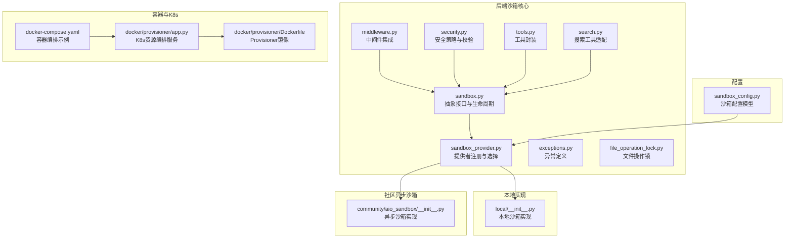
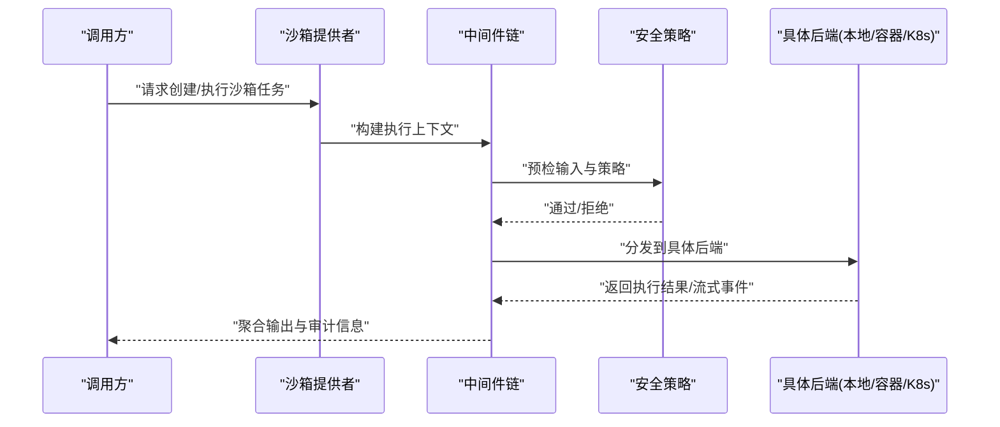
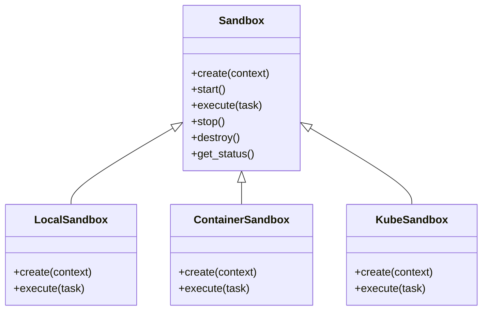
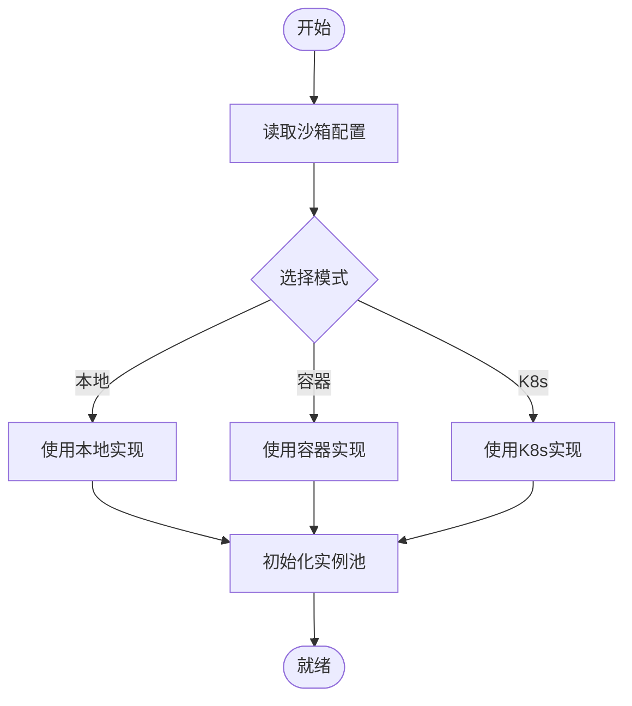
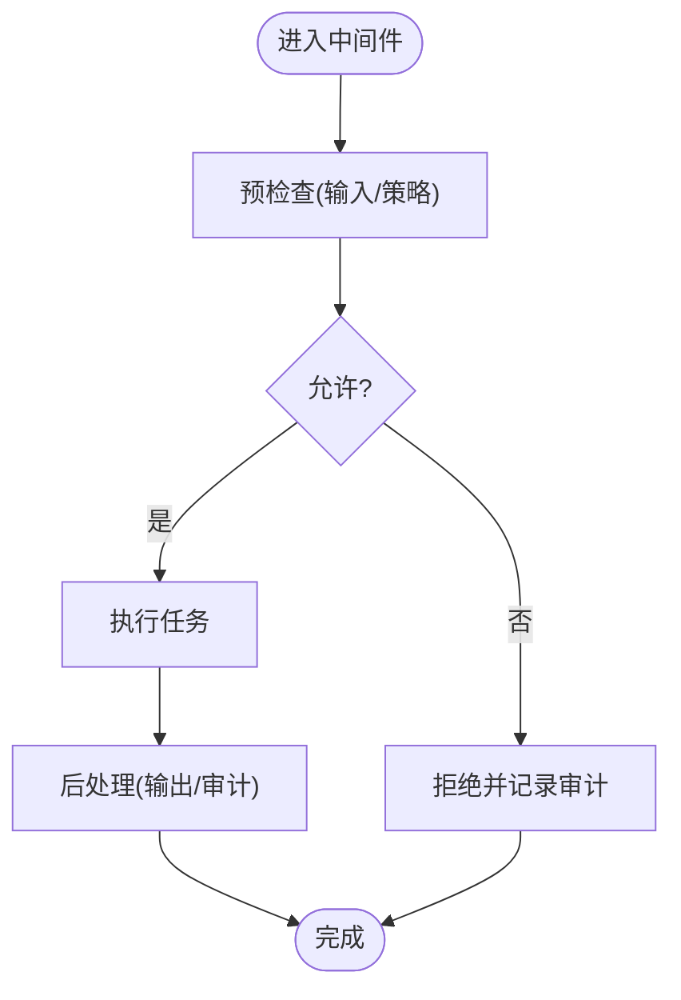
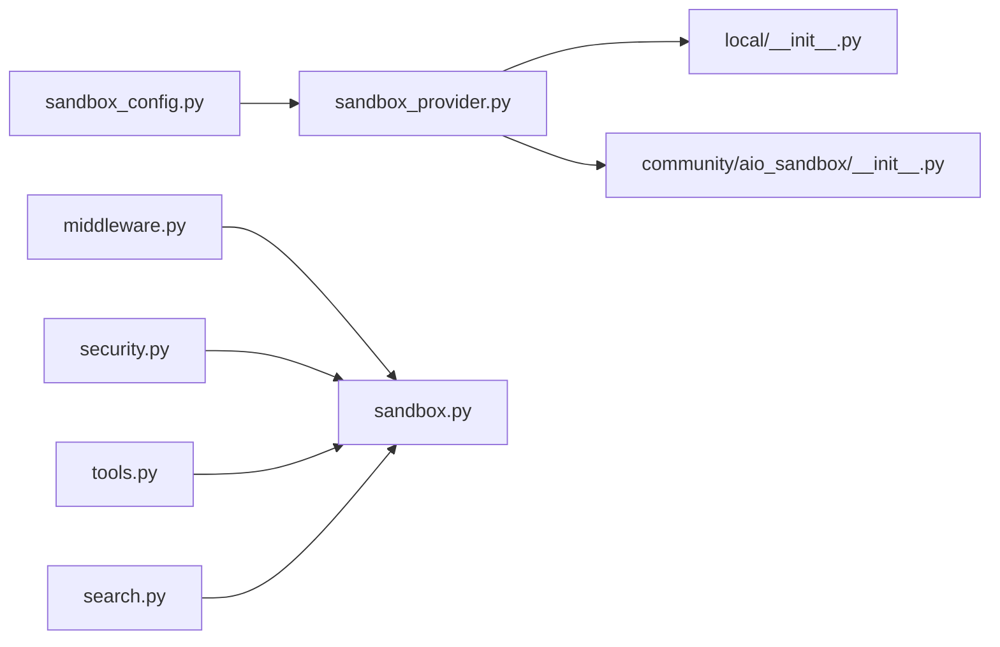

# 沙箱执行环境

<cite>
**本文引用的文件**   
- [sandbox.py](file://backend/packages/harness/deerflow/sandbox/sandbox.py)
- [sandbox_provider.py](file://backend/packages/harness/deerflow/sandbox/sandbox_provider.py)
- [middleware.py](file://backend/packages/harness/deerflow/sandbox/middleware.py)
- [security.py](file://backend/packages/harness/deerflow/sandbox/security.py)
- [tools.py](file://backend/packages/harness/deerflow/sandbox/tools.py)
- [search.py](file://backend/packages/harness/deerflow/sandbox/search.py)
- [exceptions.py](file://backend/packages/harness/deerflow/sandbox/exceptions.py)
- [file_operation_lock.py](file://backend/packages/harness/deerflow/sandbox/file_operation_lock.py)
- [sandbox_config.py](file://backend/packages/harness/deerflow/config/sandbox_config.py)
- [local/__init__.py](file://backend/packages/harness/deerflow/sandbox/local/__init__.py)
- [aio_sandbox/__init__.py](file://backend/packages/harness/deerflow/community/aio_sandbox/__init__.py)
- [test_aio_sandbox.py](file://backend/tests/test_aio_sandbox.py)
- [test_aio_sandbox_local_backend.py](file://backend/tests/test_aio_sandbox_local_backend.py)
- [test_aio_sandbox_provider.py](file://backend/tests/test_aio_sandbox_provider.py)
- [test_docker_sandbox_mode_detection.py](file://backend/tests/test_docker_sandbox_mode_detection.py)
- [test_provisioner_kubeconfig.py](file://backend/tests/test_provisioner_kubeconfig.py)
- [test_provisioner_pvc_volumes.py](file://backend/tests/test_provisioner_pvc_volumes.py)
- [docker-compose.yaml](file://docker/docker-compose.yaml)
- [provisioner/app.py](file://docker/provisioner/app.py)
- [provisioner/Dockerfile](file://docker/provisioner/Dockerfile)
</cite>

## 目录
1. [简介](#简介)
2. [项目结构](#项目结构)
3. [核心组件](#核心组件)
4. [架构总览](#架构总览)
5. [详细组件分析](#详细组件分析)
6. [依赖关系分析](#依赖关系分析)
7. [性能考虑](#性能考虑)
8. [故障排查指南](#故障排查指南)
9. [结论](#结论)
10. [附录](#附录)

## 简介
本文件面向 DeerFlow 的沙箱执行环境，系统性阐述本地沙箱、容器沙箱与 Kubernetes 沙箱的实现原理、配置方法与安全策略。文档覆盖隔离机制、资源限制、网络访问控制、配置示例、性能调优与故障排查，并提供自定义沙箱提供商的开发接口与最佳实践，帮助读者快速理解并扩展沙箱能力。

## 项目结构
DeerFlow 将沙箱相关代码集中在后端 harness 的 sandbox 模块中，并通过配置模块提供统一入口；同时提供社区 aio_sandbox 作为异步沙箱实现参考，以及 docker 目录下的 provisioner 用于在集群环境中进行资源编排。

图表来源
- [sandbox.py](file://backend/packages/harness/deerflow/sandbox/sandbox.py)
- [sandbox_provider.py](file://backend/packages/harness/deerflow/sandbox/sandbox_provider.py)
- [middleware.py](file://backend/packages/harness/deerflow/sandbox/middleware.py)
- [security.py](file://backend/packages/harness/deerflow/sandbox/security.py)
- [tools.py](file://backend/packages/harness/deerflow/sandbox/tools.py)
- [search.py](file://backend/packages/harness/deerflow/sandbox/search.py)
- [exceptions.py](file://backend/packages/harness/deerflow/sandbox/exceptions.py)
- [file_operation_lock.py](file://backend/packages/harness/deerflow/sandbox/file_operation_lock.py)
- [sandbox_config.py](file://backend/packages/harness/deerflow/config/sandbox_config.py)
- [local/__init__.py](file://backend/packages/harness/deerflow/sandbox/local/__init__.py)
- [aio_sandbox/__init__.py](file://backend/packages/harness/deerflow/community/aio_sandbox/__init__.py)
- [docker-compose.yaml](file://docker/docker-compose.yaml)
- [provisioner/app.py](file://docker/provisioner/app.py)
- [provisioner/Dockerfile](file://docker/provisioner/Dockerfile)

章节来源
- [sandbox.py](file://backend/packages/harness/deerflow/sandbox/sandbox.py)
- [sandbox_provider.py](file://backend/packages/harness/deerflow/sandbox/sandbox_provider.py)
- [sandbox_config.py](file://backend/packages/harness/deerflow/config/sandbox_config.py)
- [local/__init__.py](file://backend/packages/harness/deerflow/sandbox/local/__init__.py)
- [aio_sandbox/__init__.py](file://backend/packages/harness/deerflow/community/aio_sandbox/__init__.py)
- [docker-compose.yaml](file://docker/docker-compose.yaml)
- [provisioner/app.py](file://docker/provisioner/app.py)
- [provisioner/Dockerfile](file://docker/provisioner/Dockerfile)

## 核心组件
- 抽象沙箱接口：定义沙箱实例的生命周期（创建、启动、停止、销毁）、执行上下文、资源管理与结果返回等通用契约，供不同后端实现复用。
- 沙箱提供者：负责根据配置选择具体实现（本地、容器或K8s），管理实例池与状态，暴露统一的创建与调度接口。
- 中间件：在任务执行前后注入安全策略、审计日志、超时控制与错误降级逻辑。
- 安全策略：对输入输出进行白名单校验、命令与路径过滤、敏感信息检测与访问控制。
- 工具封装：为沙箱内可调用工具提供统一包装，确保工具调用受控且可观测。
- 搜索工具适配：将外部搜索能力纳入沙箱执行边界，避免越权访问。
- 异常体系：定义沙箱运行期异常类型，便于上层统一处理与恢复。
- 文件操作锁：在多并发场景下保护共享文件系统，避免竞态条件。
- 配置模型：集中描述沙箱模式、资源配额、网络策略、存储卷挂载等参数。

章节来源
- [sandbox.py](file://backend/packages/harness/deerflow/sandbox/sandbox.py)
- [sandbox_provider.py](file://backend/packages/harness/deerflow/sandbox/sandbox_provider.py)
- [middleware.py](file://backend/packages/harness/deerflow/sandbox/middleware.py)
- [security.py](file://backend/packages/harness/deerflow/sandbox/security.py)
- [tools.py](file://backend/packages/harness/deerflow/sandbox/tools.py)
- [search.py](file://backend/packages/harness/deerflow/sandbox/search.py)
- [exceptions.py](file://backend/packages/harness/deerflow/sandbox/exceptions.py)
- [file_operation_lock.py](file://backend/packages/harness/deerflow/sandbox/file_operation_lock.py)
- [sandbox_config.py](file://backend/packages/harness/deerflow/config/sandbox_config.py)

## 架构总览
下图展示从业务侧到沙箱执行的端到端流程，包括提供者选择、中间件链、安全策略与具体后端（本地/容器/K8s）的执行差异。

图表来源
- [sandbox_provider.py](file://backend/packages/harness/deerflow/sandbox/sandbox_provider.py)
- [middleware.py](file://backend/packages/harness/deerflow/sandbox/middleware.py)
- [security.py](file://backend/packages/harness/deerflow/sandbox/security.py)
- [local/__init__.py](file://backend/packages/harness/deerflow/sandbox/local/__init__.py)
- [aio_sandbox/__init__.py](file://backend/packages/harness/deerflow/community/aio_sandbox/__init__.py)

## 详细组件分析

### 抽象沙箱接口与生命周期
- 职责：定义统一的沙箱实例化、启动、执行、停止与清理流程；维护执行上下文（工作目录、环境变量、资源配额）。
- 关键点：
  - 支持同步与异步执行路径，便于在不同后端间切换。
  - 提供结果序列化与错误映射，保证上层一致性。
  - 暴露钩子点供中间件与安全策略接入。

图表来源
- [sandbox.py](file://backend/packages/harness/deerflow/sandbox/sandbox.py)
- [local/__init__.py](file://backend/packages/harness/deerflow/sandbox/local/__init__.py)
- [aio_sandbox/__init__.py](file://backend/packages/harness/deerflow/community/aio_sandbox/__init__.py)

章节来源
- [sandbox.py](file://backend/packages/harness/deerflow/sandbox/sandbox.py)
- [local/__init__.py](file://backend/packages/harness/deerflow/sandbox/local/__init__.py)
- [aio_sandbox/__init__.py](file://backend/packages/harness/deerflow/community/aio_sandbox/__init__.py)

### 沙箱提供者与实现选择
- 职责：根据配置动态选择本地、容器或K8s后端；管理实例池、健康检查与回收。
- 关键点：
  - 配置驱动的模式切换，支持运行时重载。
  - 失败回退与优雅降级（例如容器不可用时回退到本地）。
  - 提供测试桩以验证不同模式的兼容性。

图表来源
- [sandbox_provider.py](file://backend/packages/harness/deerflow/sandbox/sandbox_provider.py)
- [sandbox_config.py](file://backend/packages/harness/deerflow/config/sandbox_config.py)

章节来源
- [sandbox_provider.py](file://backend/packages/harness/deerflow/sandbox/sandbox_provider.py)
- [sandbox_config.py](file://backend/packages/harness/deerflow/config/sandbox_config.py)
- [test_aio_sandbox_provider.py](file://backend/tests/test_aio_sandbox_provider.py)

### 中间件与安全策略
- 中间件链：在执行前注入审计、限流、超时控制；在执行后收集指标与日志。
- 安全策略：
  - 输入校验：命令白名单、路径白名单、参数长度限制。
  - 输出过滤：敏感信息脱敏、大输出截断。
  - 访问控制：网络域名白名单、端口限制、外网访问开关。
- 文件操作锁：在多并发场景下对共享目录加锁，防止写入冲突。

图表来源
- [middleware.py](file://backend/packages/harness/deerflow/sandbox/middleware.py)
- [security.py](file://backend/packages/harness/deerflow/sandbox/security.py)
- [file_operation_lock.py](file://backend/packages/harness/deerflow/sandbox/file_operation_lock.py)

章节来源
- [middleware.py](file://backend/packages/harness/deerflow/sandbox/middleware.py)
- [security.py](file://backend/packages/harness/deerflow/sandbox/security.py)
- [file_operation_lock.py](file://backend/packages/harness/deerflow/sandbox/file_operation_lock.py)
- [test_sandbox_audit_middleware.py](file://backend/tests/test_sandbox_audit_middleware.py)

### 工具封装与搜索适配
- 工具封装：为沙箱内可调用工具提供统一包装，确保工具调用受控、可观测、可回滚。
- 搜索适配：将外部搜索能力纳入沙箱边界，限制访问范围与频率，避免滥用。

章节来源
- [tools.py](file://backend/packages/harness/deerflow/sandbox/tools.py)
- [search.py](file://backend/packages/harness/deerflow/sandbox/search.py)
- [test_sandbox_tools_security.py](file://backend/tests/test_sandbox_tools_security.py)

### 异常体系与错误处理
- 定义沙箱运行期异常类型（如超时、权限不足、资源不足、网络错误）。
- 提供统一错误码与消息格式，便于上层重试与降级。
- 结合中间件进行错误分类与告警。

章节来源
- [exceptions.py](file://backend/packages/harness/deerflow/sandbox/exceptions.py)
- [middleware.py](file://backend/packages/harness/deerflow/sandbox/middleware.py)

### 本地沙箱实现要点
- 特点：轻量、低延迟，适合开发与调试；通过进程隔离与文件系统命名空间限制影响面。
- 关键配置：工作目录隔离、环境变量注入、CPU/内存软限制、网络策略。
- 适用场景：单节点开发、小规模批量任务。

章节来源
- [local/__init__.py](file://backend/packages/harness/deerflow/sandbox/local/__init__.py)
- [test_local_sandbox_encoding.py](file://backend/tests/test_local_sandbox_encoding.py)
- [test_local_sandbox_provider_mounts.py](file://backend/tests/test_local_sandbox_provider_mounts.py)

### 容器沙箱实现要点
- 特点：强隔离、可移植，基于容器运行时（如 Docker）提供资源限制与网络隔离。
- 关键配置：镜像选择、卷挂载、端口映射、资源配额、网络策略。
- 适用场景：多租户、需要严格隔离的生产环境。

章节来源
- [test_docker_sandbox_mode_detection.py](file://backend/tests/test_docker_sandbox_mode_detection.py)
- [docker-compose.yaml](file://docker/docker-compose.yaml)

### Kubernetes 沙箱实现要点
- 特点：弹性伸缩、高可用，基于 Pod 与资源配额实现细粒度控制。
- 关键配置：kubeconfig、命名空间、资源配额、PVC 持久卷、网络策略。
- 适用场景：大规模生产、多云/混合云部署。

章节来源
- [test_provisioner_kubeconfig.py](file://backend/tests/test_provisioner_kubeconfig.py)
- [test_provisioner_pvc_volumes.py](file://backend/tests/test_provisioner_pvc_volumes.py)
- [provisioner/app.py](file://docker/provisioner/app.py)
- [provisioner/Dockerfile](file://docker/provisioner/Dockerfile)

### 自定义沙箱提供商开发接口与最佳实践
- 开发接口：
  - 实现抽象沙箱接口的生命周期方法（创建、启动、执行、停止、销毁）。
  - 遵循统一的上下文与结果模型，确保与中间件兼容。
  - 提供健康检查与状态上报，便于提供者管理。
- 最佳实践：
  - 幂等性：重复创建与销毁应安全。
  - 资源回收：确保异常路径也能释放资源。
  - 可观测性：输出结构化日志与指标。
  - 安全性：最小权限原则，输入输出严格校验。
  - 可测试性：提供测试桩与模拟后端。

章节来源
- [sandbox.py](file://backend/packages/harness/deerflow/sandbox/sandbox.py)
- [sandbox_provider.py](file://backend/packages/harness/deerflow/sandbox/sandbox_provider.py)
- [test_aio_sandbox.py](file://backend/tests/test_aio_sandbox.py)
- [test_aio_sandbox_local_backend.py](file://backend/tests/test_aio_sandbox_local_backend.py)

## 依赖关系分析
- 内部依赖：
  - 提供者依赖配置模型与具体后端实现。
  - 中间件与安全策略贯穿所有后端。
  - 工具与搜索适配被沙箱执行上下文引用。
- 外部依赖：
  - 容器运行时（Docker）与 Kubernetes API。
  - 文件系统与网络栈。
- 潜在循环依赖：
  - 通过抽象接口解耦，避免直接耦合。
  - 提供者仅依赖配置与接口，不反向依赖具体实现。

图表来源
- [sandbox_config.py](file://backend/packages/harness/deerflow/config/sandbox_config.py)
- [sandbox_provider.py](file://backend/packages/harness/deerflow/sandbox/sandbox_provider.py)
- [local/__init__.py](file://backend/packages/harness/deerflow/sandbox/local/__init__.py)
- [aio_sandbox/__init__.py](file://backend/packages/harness/deerflow/community/aio_sandbox/__init__.py)
- [middleware.py](file://backend/packages/harness/deerflow/sandbox/middleware.py)
- [security.py](file://backend/packages/harness/deerflow/sandbox/security.py)
- [tools.py](file://backend/packages/harness/deerflow/sandbox/tools.py)
- [search.py](file://backend/packages/harness/deerflow/sandbox/search.py)
- [sandbox.py](file://backend/packages/harness/deerflow/sandbox/sandbox.py)

章节来源
- [sandbox_config.py](file://backend/packages/harness/deerflow/config/sandbox_config.py)
- [sandbox_provider.py](file://backend/packages/harness/deerflow/sandbox/sandbox_provider.py)
- [sandbox.py](file://backend/packages/harness/deerflow/sandbox/sandbox.py)

## 性能考虑
- 实例池与复用：合理设置最大实例数与空闲回收时间，减少创建开销。
- 资源配额：按任务类型设定 CPU/内存上限，避免争用。
- 网络策略：启用域名白名单与连接池，降低 DNS 解析与握手成本。
- 文件I/O：使用本地 SSD 与合适的块大小，避免频繁小文件读写。
- 异步执行：在高并发场景优先使用异步后端，提升吞吐。
- 监控与告警：采集关键指标（创建耗时、执行时长、错误率），设置阈值告警。

[本节为通用指导，无需特定文件来源]

## 故障排查指南
- 常见问题定位：
  - 模式检测失败：检查容器运行时可用性、网络连通性与镜像拉取策略。
  - K8s 配置错误：验证 kubeconfig、命名空间权限与资源配额。
  - 文件挂载问题：确认卷路径存在、权限正确、容量充足。
  - 安全策略拦截：查看白名单与敏感信息过滤规则，调整策略或输入。
  - 中间件超时：适当延长超时或优化任务逻辑。
- 诊断步骤：
  - 启用详细日志与审计，定位失败阶段。
  - 使用测试用例复现问题，缩小范围。
  - 检查资源占用与系统负载，排除宿主机瓶颈。
  - 逐步关闭功能（如搜索、工具）验证是否由某模块引起。

章节来源
- [test_docker_sandbox_mode_detection.py](file://backend/tests/test_docker_sandbox_mode_detection.py)
- [test_provisioner_kubeconfig.py](file://backend/tests/test_provisioner_kubeconfig.py)
- [test_provisioner_pvc_volumes.py](file://backend/tests/test_provisioner_pvc_volumes.py)
- [test_sandbox_audit_middleware.py](file://backend/tests/test_sandbox_audit_middleware.py)

## 结论
DeerFlow 的沙箱执行环境通过抽象接口与提供者模式实现了本地、容器与 Kubernetes 的统一接入，配合中间件与安全策略保障执行过程的可控与可观测。在生产环境中建议采用容器或 K8s 后端，并结合资源配额、网络策略与监控告警实现稳定高效的执行体验。对于特殊需求，可通过自定义沙箱提供商扩展能力，遵循最小权限与可测试性原则。

[本节为总结，无需特定文件来源]

## 附录
- 配置示例要点：
  - 选择模式：local/container/kube。
  - 资源限制：CPU、内存、磁盘配额。
  - 网络策略：域名白名单、端口限制、外网开关。
  - 存储卷：挂载路径、只读/读写、容量。
  - 超时与重试：执行超时、重试次数、退避策略。
- 最佳实践清单：
  - 最小权限、输入输出校验、审计与日志、健康检查、优雅降级、可观测性、幂等与资源回收。

[本节为补充说明，无需特定文件来源]