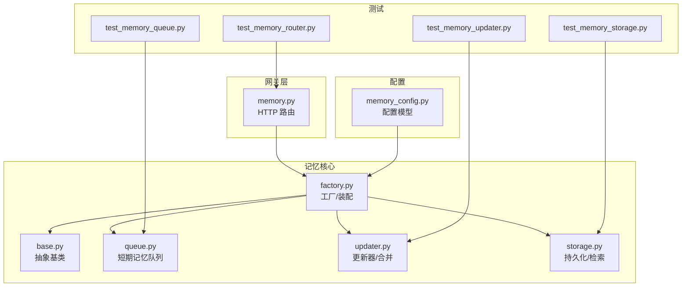
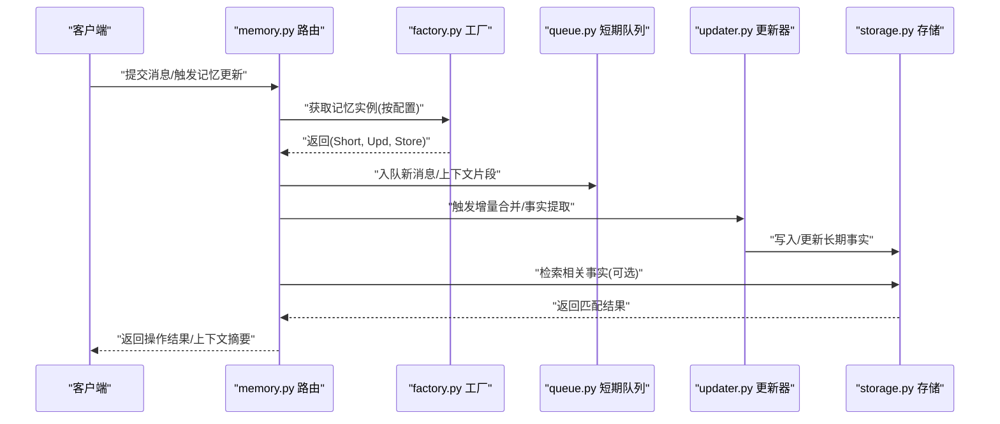
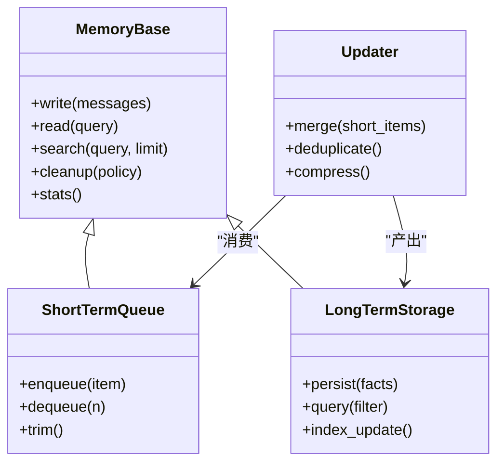
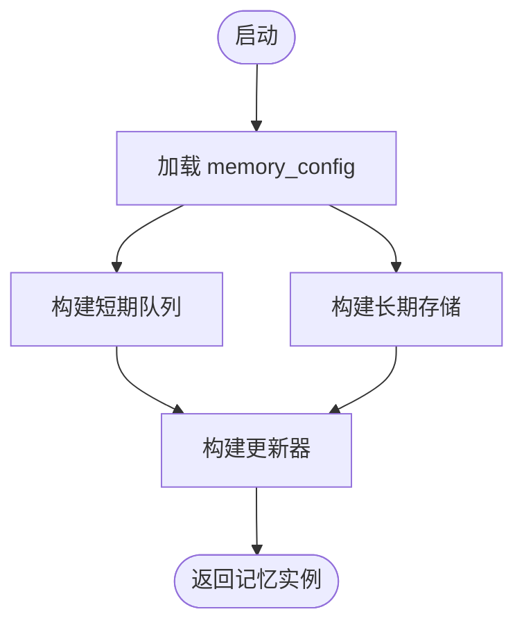
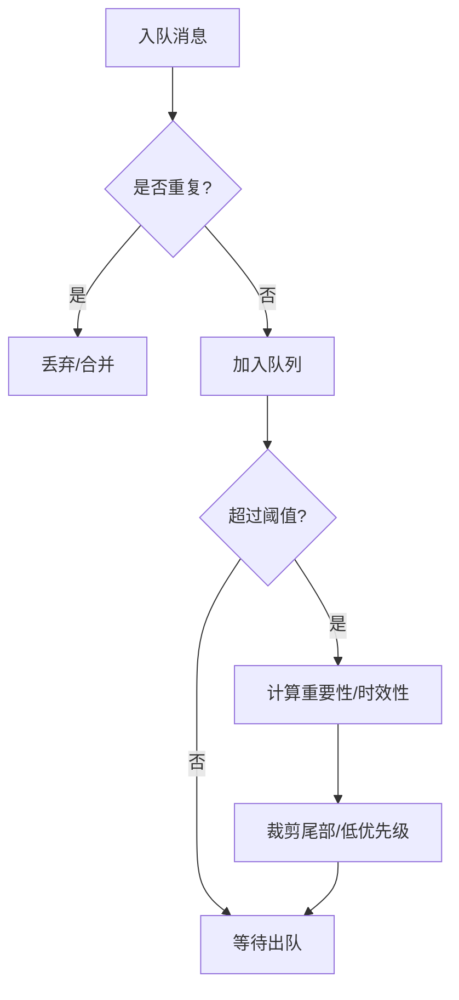
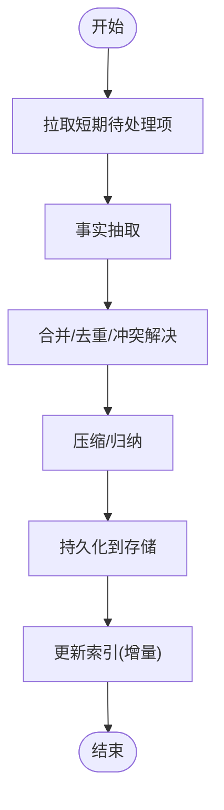
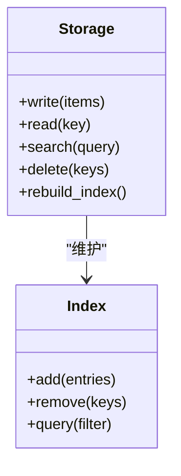
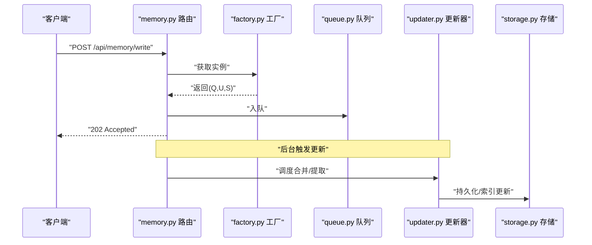
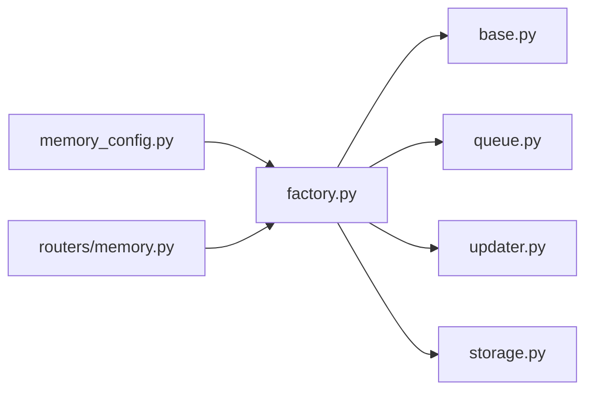

# 记忆系统

<cite>
**本文引用的文件**   
- [backend/app/gateway/routers/memory.py](file://backend/app/gateway/routers/memory.py)
- [backend/packages/harness/deerflow/agents/memory/__init__.py](file://backend/packages/harness/deerflow/agents/memory/__init__.py)
- [backend/packages/harness/deerflow/agents/memory/factory.py](file://backend/packages/harness/deerflow/agents/memory/factory.py)
- [backend/packages/harness/deerflow/agents/memory/base.py](file://backend/packages/harness/deerflow/agents/memory/base.py)
- [backend/packages/harness/deerflow/agents/memory/queue.py](file://backend/packages/harness/deerflow/agents/memory/queue.py)
- [backend/packages/harness/deerflow/agents/memory/updater.py](file://backend/packages/harness/deerflow/agents/memory/updater.py)
- [backend/packages/harness/deerflow/agents/memory/storage.py](file://backend/packages/harness/deerflow/agents/memory/storage.py)
- [backend/packages/harness/deerflow/config/memory_config.py](file://backend/packages/harness/deerflow/config/memory_config.py)
- [backend/docs/MEMORY_IMPROVEMENTS.md](file://backend/docs/MEMORY_IMPROVEMENTS.md)
- [backend/docs/MEMORY_SETTINGS_REVIEW.md](file://backend/docs/MEMORY_SETTINGS_REVIEW.md)
- [backend/tests/test_memory_queue.py](file://backend/tests/test_memory_queue.py)
- [backend/tests/test_memory_storage.py](file://backend/tests/test_memory_storage.py)
- [backend/tests/test_memory_updater.py](file://backend/tests/test_memory_updater.py)
- [backend/tests/test_memory_router.py](file://backend/tests/test_memory_router.py)
</cite>

## 目录
1. [简介](#简介)
2. [项目结构](#项目结构)
3. [核心组件](#核心组件)
4. [架构总览](#架构总览)
5. [详细组件分析](#详细组件分析)
6. [依赖关系分析](#依赖关系分析)
7. [性能考虑](#性能考虑)
8. [故障排查指南](#故障排查指南)
9. [结论](#结论)
10. [附录](#附录)

## 简介
本文件为 DeerFlow 记忆系统的权威技术文档，聚焦短期与长期记忆的架构设计、消息队列、事实提取算法、存储策略、持久化机制、检索与更新策略、配置项、性能调优与故障排查。文档同时提供数据模型、索引设计与查询接口的说明，帮助开发者快速理解并高效使用记忆子系统。

## 项目结构
记忆系统主要位于后端 harness 的 agents/memory 模块，并通过网关路由对外暴露接口；相关配置集中于 config/memory_config.py；测试覆盖队列、存储、更新器与路由等关键路径。

图表来源
- [backend/app/gateway/routers/memory.py](file://backend/app/gateway/routers/memory.py)
- [backend/packages/harness/deerflow/agents/memory/factory.py](file://backend/packages/harness/deerflow/agents/memory/factory.py)
- [backend/packages/harness/deerflow/agents/memory/base.py](file://backend/packages/harness/deerflow/agents/memory/base.py)
- [backend/packages/harness/deerflow/agents/memory/queue.py](file://backend/packages/harness/deerflow/agents/memory/queue.py)
- [backend/packages/harness/deerflow/agents/memory/updater.py](file://backend/packages/harness/deerflow/agents/memory/updater.py)
- [backend/packages/harness/deerflow/agents/memory/storage.py](file://backend/packages/harness/deerflow/agents/memory/storage.py)
- [backend/packages/harness/deerflow/config/memory_config.py](file://backend/packages/harness/deerflow/config/memory_config.py)
- [backend/tests/test_memory_queue.py](file://backend/tests/test_memory_queue.py)
- [backend/tests/test_memory_storage.py](file://backend/tests/test_memory_storage.py)
- [backend/tests/test_memory_updater.py](file://backend/tests/test_memory_updater.py)
- [backend/tests/test_memory_router.py](file://backend/tests/test_memory_router.py)

章节来源
- [backend/app/gateway/routers/memory.py](file://backend/app/gateway/routers/memory.py)
- [backend/packages/harness/deerflow/agents/memory/factory.py](file://backend/packages/harness/deerflow/agents/memory/factory.py)
- [backend/packages/harness/deerflow/agents/memory/base.py](file://backend/packages/harness/deerflow/agents/memory/base.py)
- [backend/packages/harness/deerflow/agents/memory/queue.py](file://backend/packages/harness/deerflow/agents/memory/queue.py)
- [backend/packages/harness/deerflow/agents/memory/updater.py](file://backend/packages/harness/deerflow/agents/memory/updater.py)
- [backend/packages/harness/deerflow/agents/memory/storage.py](file://backend/packages/harness/deerflow/agents/memory/storage.py)
- [backend/packages/harness/deerflow/config/memory_config.py](file://backend/packages/harness/deerflow/config/memory_config.py)
- [backend/tests/test_memory_queue.py](file://backend/tests/test_memory_queue.py)
- [backend/tests/test_memory_storage.py](file://backend/tests/test_memory_storage.py)
- [backend/tests/test_memory_updater.py](file://backend/tests/test_memory_updater.py)
- [backend/tests/test_memory_router.py](file://backend/tests/test_memory_router.py)

## 核心组件
- 抽象基类：定义短期/长期记忆的统一接口（写入、读取、检索、清理），屏蔽底层实现差异。
- 工厂：根据配置选择具体实现（如内存或外部存储），注入队列与更新器。
- 短期记忆队列：基于消息队列的滑动窗口式会话上下文缓存，支持高吞吐入队与按时间/重要性排序出队。
- 更新器：负责增量合并、去重、冲突解决与压缩，将短期记忆沉淀为长期事实。
- 存储：提供持久化读写、索引构建与检索接口，支持多种后端（内存、KV、向量库等）。
- 配置：集中管理阈值、批大小、过期策略、索引参数等。

章节来源
- [backend/packages/harness/deerflow/agents/memory/base.py](file://backend/packages/harness/deerflow/agents/memory/base.py)
- [backend/packages/harness/deerflow/agents/memory/factory.py](file://backend/packages/harness/deerflow/agents/memory/factory.py)
- [backend/packages/harness/deerflow/agents/memory/queue.py](file://backend/packages/harness/deerflow/agents/memory/queue.py)
- [backend/packages/harness/deerflow/agents/memory/updater.py](file://backend/packages/harness/deerflow/agents/memory/updater.py)
- [backend/packages/harness/deerflow/agents/memory/storage.py](file://backend/packages/harness/deerflow/agents/memory/storage.py)
- [backend/packages/harness/deerflow/config/memory_config.py](file://backend/packages/harness/deerflow/config/memory_config.py)

## 架构总览
整体采用“短-长双轨”记忆架构：短期记忆以队列承载高频、易变的对话片段；长期记忆以结构化事实为主，通过更新器定期从短期沉淀而来，并由存储层提供检索能力。

图表来源
- [backend/app/gateway/routers/memory.py](file://backend/app/gateway/routers/memory.py)
- [backend/packages/harness/deerflow/agents/memory/factory.py](file://backend/packages/harness/deerflow/agents/memory/factory.py)
- [backend/packages/harness/deerflow/agents/memory/queue.py](file://backend/packages/harness/deerflow/agents/memory/queue.py)
- [backend/packages/harness/deerflow/agents/memory/updater.py](file://backend/packages/harness/deerflow/agents/memory/updater.py)
- [backend/packages/harness/deerflow/agents/memory/storage.py](file://backend/packages/harness/deerflow/agents/memory/storage.py)

## 详细组件分析

### 抽象基类与统一接口
- 职责：定义统一的写入、读取、检索、清理与统计接口，确保不同短期/长期实现可互换。
- 关键点：
  - 明确输入输出契约（消息体、过滤条件、分页/限制参数）。
  - 错误边界与重试语义在基类中约定，便于上层一致处理。
  - 扩展点：新增存储后端只需实现接口方法。

图表来源
- [backend/packages/harness/deerflow/agents/memory/base.py](file://backend/packages/harness/deerflow/agents/memory/base.py)
- [backend/packages/harness/deerflow/agents/memory/queue.py](file://backend/packages/harness/deerflow/agents/memory/queue.py)
- [backend/packages/harness/deerflow/agents/memory/updater.py](file://backend/packages/harness/deerflow/agents/memory/updater.py)
- [backend/packages/harness/deerflow/agents/memory/storage.py](file://backend/packages/harness/deerflow/agents/memory/storage.py)

章节来源
- [backend/packages/harness/deerflow/agents/memory/base.py](file://backend/packages/harness/deerflow/agents/memory/base.py)

### 工厂与装配
- 职责：依据 memory_config 创建并组装 ShortTermQueue、Updater、LongTermStorage，并提供统一入口。
- 关键点：
  - 支持多后端切换（例如内存 vs 持久化）。
  - 注入配置项（批大小、超时、重试次数等）。
  - 生命周期管理（初始化、关闭、健康检查）。

图表来源
- [backend/packages/harness/deerflow/agents/memory/factory.py](file://backend/packages/harness/deerflow/agents/memory/factory.py)
- [backend/packages/harness/deerflow/config/memory_config.py](file://backend/packages/harness/deerflow/config/memory_config.py)

章节来源
- [backend/packages/harness/deerflow/agents/memory/factory.py](file://backend/packages/harness/deerflow/agents/memory/factory.py)
- [backend/packages/harness/deerflow/config/memory_config.py](file://backend/packages/harness/deerflow/config/memory_config.py)

### 短期记忆队列
- 设计要点：
  - 消息入队：支持批量入队、优先级/时间戳标记、去重键。
  - 出队策略：按时间衰减或重要性评分裁剪，保证窗口大小与延迟目标。
  - 并发安全：内部锁或无锁队列实现，避免竞争。
  - 背压与限流：当上游写入过快时进行节流或丢弃低优先级项。
- 复杂度：
  - 入队 O(log n) 或均摊 O(1)，出队/裁剪 O(k log n)（k 为裁剪数量）。
- 优化机会：
  - 分片队列降低热点。
  - 预分配缓冲减少 GC 压力。
  - 惰性计算评分，仅在出队时评估。

图表来源
- [backend/packages/harness/deerflow/agents/memory/queue.py](file://backend/packages/harness/deerflow/agents/memory/queue.py)

章节来源
- [backend/packages/harness/deerflow/agents/memory/queue.py](file://backend/packages/harness/deerflow/agents/memory/queue.py)
- [backend/tests/test_memory_queue.py](file://backend/tests/test_memory_queue.py)

### 事实提取与更新器
- 职责：从短期消息中提取可复用的事实，执行合并、去重、冲突解决与压缩，产出长期事实。
- 算法流程：
  - 增量扫描：按批次拉取短期未处理项。
  - 抽取：识别实体、属性、关系三元组或结构化片段。
  - 合并：与现有事实比对，处理同义、冲突与版本演进。
  - 压缩：对冗余事实进行归纳，控制长期记忆规模。
  - 落盘：批量写入存储层，必要时重建局部索引。
- 复杂度：
  - 抽取阶段近似线性于输入长度；合并/去重取决于相似度度量与索引结构。
- 优化机会：
  - 并行抽取与批合并。
  - 增量索引更新而非全量重建。
  - 相似度阈值自适应调整。

图表来源
- [backend/packages/harness/deerflow/agents/memory/updater.py](file://backend/packages/harness/deerflow/agents/memory/updater.py)

章节来源
- [backend/packages/harness/deerflow/agents/memory/updater.py](file://backend/packages/harness/deerflow/agents/memory/updater.py)
- [backend/tests/test_memory_updater.py](file://backend/tests/test_memory_updater.py)

### 存储与检索
- 职责：提供长期事实的持久化、索引与检索能力，支持多种后端。
- 功能特性：
  - 写入：批量插入、幂等键、事务/回滚语义。
  - 索引：关键词/倒排、向量相似度、时间/标签维度。
  - 检索：过滤、排序、分页、Top-K 相似匹配。
  - 维护：碎片整理、索引重建、冷热分层。
- 复杂度：
  - 写入 O(log n) 或 O(1) 取决于后端；检索 O(log n) 或 O(√n)/O(1) 视索引而定。
- 优化机会：
  - 写放大控制（WAL/LSM 风格）。
  - 读路径缓存与预取。
  - 分区/分片提升水平扩展。

图表来源
- [backend/packages/harness/deerflow/agents/memory/storage.py](file://backend/packages/harness/deerflow/agents/memory/storage.py)

章节来源
- [backend/packages/harness/deerflow/agents/memory/storage.py](file://backend/packages/harness/deerflow/agents/memory/storage.py)
- [backend/tests/test_memory_storage.py](file://backend/tests/test_memory_storage.py)

### 网关路由与外部接口
- 职责：暴露 HTTP 接口用于写入、触发更新、检索与状态查询。
- 典型端点：
  - 写入短期记忆：POST /api/memory/write
  - 触发更新：POST /api/memory/update
  - 检索长期记忆：GET /api/memory/search
  - 状态/统计：GET /api/memory/stats
- 行为：
  - 参数校验、鉴权、限流。
  - 异步任务编排（更新器）与同步响应分离。
  - 错误码与重试提示。

图表来源
- [backend/app/gateway/routers/memory.py](file://backend/app/gateway/routers/memory.py)
- [backend/packages/harness/deerflow/agents/memory/factory.py](file://backend/packages/harness/deerflow/agents/memory/factory.py)
- [backend/packages/harness/deerflow/agents/memory/queue.py](file://backend/packages/harness/deerflow/agents/memory/queue.py)
- [backend/packages/harness/deerflow/agents/memory/updater.py](file://backend/packages/harness/deerflow/agents/memory/updater.py)
- [backend/packages/harness/deerflow/agents/memory/storage.py](file://backend/packages/harness/deerflow/agents/memory/storage.py)

章节来源
- [backend/app/gateway/routers/memory.py](file://backend/app/gateway/routers/memory.py)
- [backend/tests/test_memory_router.py](file://backend/tests/test_memory_router.py)

## 依赖关系分析
- 耦合度：
  - factory 强依赖 memory_config；其他组件通过接口解耦。
  - updater 依赖 queue 与 storage，但通过抽象基类隔离。
- 循环依赖：
  - 当前分层清晰，未见循环导入风险。
- 外部依赖：
  - 存储后端可能依赖 KV/向量数据库；可通过配置替换。

图表来源
- [backend/packages/harness/deerflow/config/memory_config.py](file://backend/packages/harness/deerflow/config/memory_config.py)
- [backend/packages/harness/deerflow/agents/memory/factory.py](file://backend/packages/harness/deerflow/agents/memory/factory.py)
- [backend/packages/harness/deerflow/agents/memory/base.py](file://backend/packages/harness/deerflow/agents/memory/base.py)
- [backend/packages/harness/deerflow/agents/memory/queue.py](file://backend/packages/harness/deerflow/agents/memory/queue.py)
- [backend/packages/harness/deerflow/agents/memory/updater.py](file://backend/packages/harness/deerflow/agents/memory/updater.py)
- [backend/packages/harness/deerflow/agents/memory/storage.py](file://backend/packages/harness/deerflow/agents/memory/storage.py)
- [backend/app/gateway/routers/memory.py](file://backend/app/gateway/routers/memory.py)

章节来源
- [backend/packages/harness/deerflow/agents/memory/factory.py](file://backend/packages/harness/deerflow/agents/memory/factory.py)
- [backend/packages/harness/deerflow/config/memory_config.py](file://backend/packages/harness/deerflow/config/memory_config.py)

## 性能考虑
- 短期队列
  - 合理设置窗口大小与裁剪阈值，避免频繁 GC。
  - 批量入队与惰性评分降低 CPU 开销。
- 更新器
  - 批处理大小与并发度需平衡吞吐与内存占用。
  - 相似度阈值与压缩率可调，防止长期记忆膨胀。
- 存储
  - 索引增量更新优于全量重建。
  - 读写分离与缓存命中优化 Top-K 检索。
- 监控指标
  - 入队/出队延迟、队列深度、更新耗时、索引大小、命中率。

[本节为通用指导，不直接分析具体文件]

## 故障排查指南
- 常见问题
  - 写入堆积：检查队列容量与裁剪策略，确认消费者（更新器）是否正常。
  - 检索延迟：观察索引是否滞后，必要时触发增量重建。
  - 事实冲突：调整合并策略与相似度阈值，审查去重键。
- 定位步骤
  - 查看路由日志与错误码。
  - 检查更新器任务队列与失败重试。
  - 验证存储连接与权限。
- 回归验证
  - 使用单元测试覆盖关键路径（队列、存储、更新器、路由）。

章节来源
- [backend/tests/test_memory_queue.py](file://backend/tests/test_memory_queue.py)
- [backend/tests/test_memory_storage.py](file://backend/tests/test_memory_storage.py)
- [backend/tests/test_memory_updater.py](file://backend/tests/test_memory_updater.py)
- [backend/tests/test_memory_router.py](file://backend/tests/test_memory_router.py)

## 结论
DeerFlow 的记忆系统通过“短期队列 + 长期事实”的双轨设计，结合可插拔的存储与灵活的更新策略，实现了高吞吐、可扩展且可观测的记忆能力。通过合理的配置与性能调优，可在不同负载场景下保持稳定的延迟与吞吐表现。

[本节为总结性内容，不直接分析具体文件]

## 附录

### 配置选项参考
- 短期队列
  - 窗口大小、最大条目数、裁剪阈值、优先级权重、去重键策略。
- 更新器
  - 批大小、并发度、相似度阈值、压缩率、冲突解决策略。
- 存储
  - 后端类型、连接参数、索引类型（关键词/向量）、分区策略。
- 路由
  - 限流、超时、重试次数、鉴权开关。

章节来源
- [backend/packages/harness/deerflow/config/memory_config.py](file://backend/packages/harness/deerflow/config/memory_config.py)
- [backend/docs/MEMORY_SETTINGS_REVIEW.md](file://backend/docs/MEMORY_SETTINGS_REVIEW.md)

### 数据模型与索引设计
- 数据模型
  - 短期消息：文本/结构化片段、时间戳、来源、优先级、去重键。
  - 长期事实：实体/属性/关系三元组、置信度、版本、来源引用。
- 索引设计
  - 关键词倒排、时间/标签维度、向量相似度索引。
  - 增量更新与冷热分层。

章节来源
- [backend/packages/harness/deerflow/agents/memory/storage.py](file://backend/packages/harness/deerflow/agents/memory/storage.py)
- [backend/packages/harness/deerflow/agents/memory/updater.py](file://backend/packages/harness/deerflow/agents/memory/updater.py)

### 查询接口清单
- POST /api/memory/write：写入短期记忆
- POST /api/memory/update：触发更新/合并
- GET /api/memory/search：检索长期记忆
- GET /api/memory/stats：获取统计信息

章节来源
- [backend/app/gateway/routers/memory.py](file://backend/app/gateway/routers/memory.py)

### 改进与背景
- 历史改进与设定回顾有助于理解当前设计的取舍与演进方向。

章节来源
- [backend/docs/MEMORY_IMPROVEMENTS.md](file://backend/docs/MEMORY_IMPROVEMENTS.md)
- [backend/docs/MEMORY_SETTINGS_REVIEW.md](file://backend/docs/MEMORY_SETTINGS_REVIEW.md)