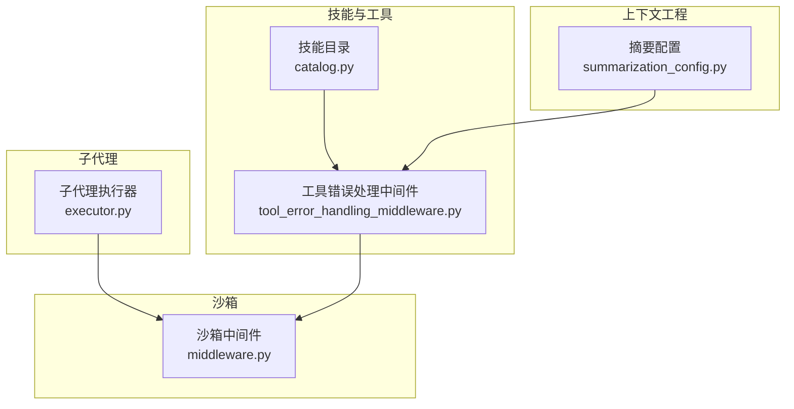
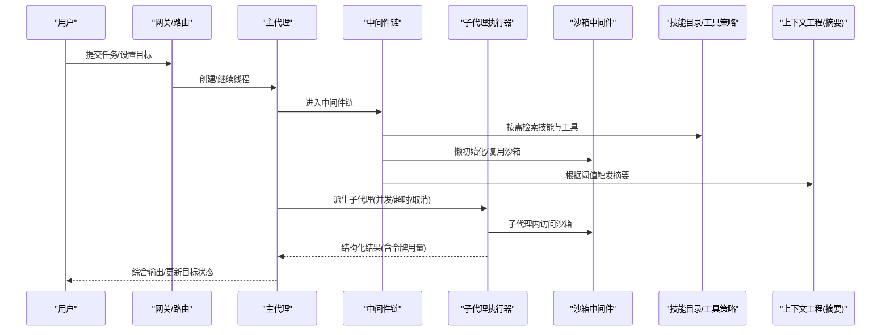
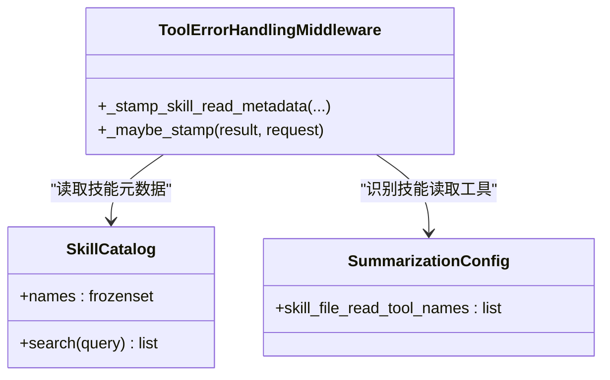
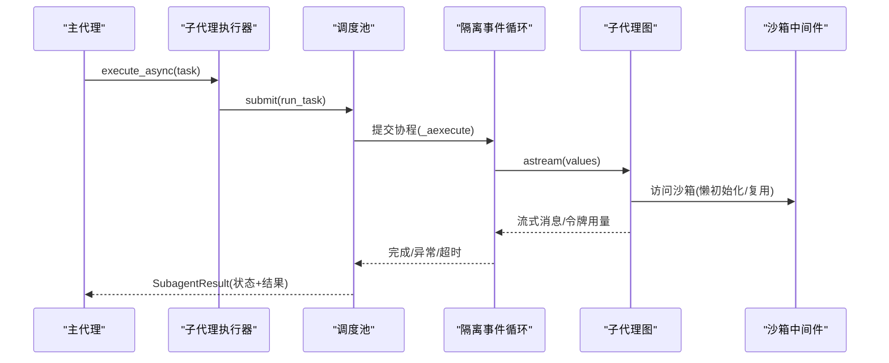
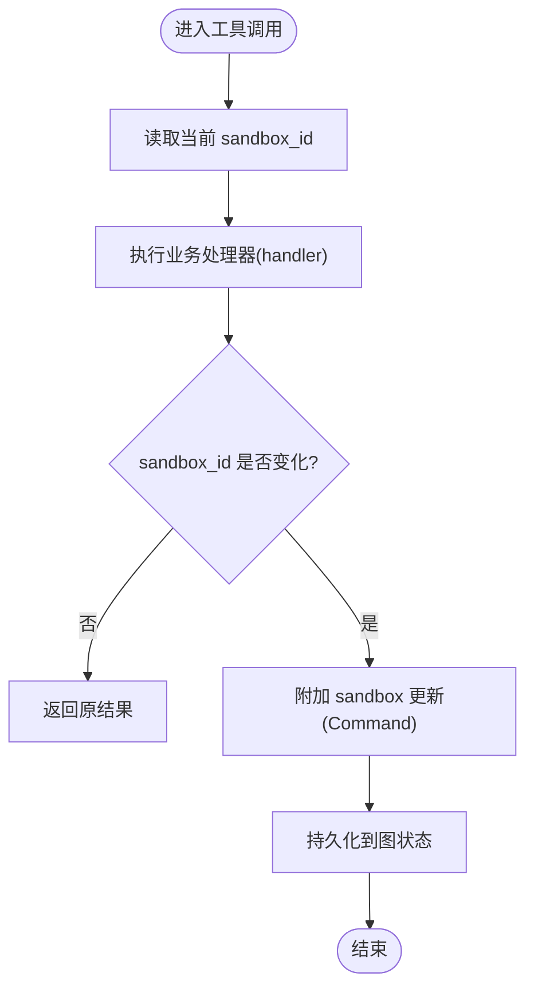
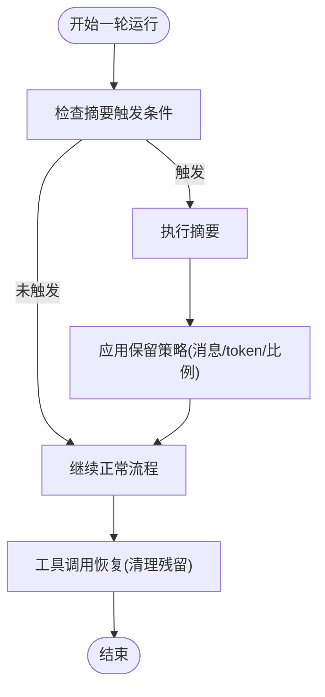
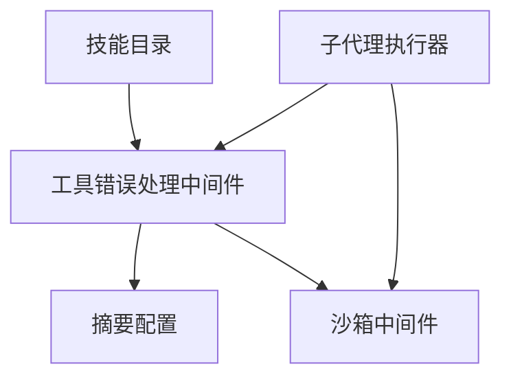

# 核心特性

<cite>
**本文引用的文件**   
- [README.md](file://README.md)
- [catalog.py](file://backend/packages/harness/deerflow/skills/catalog.py)
- [tool_error_handling_middleware.py](file://backend/packages/harness/deerflow/agents/middlewares/tool_error_handling_middleware.py)
- [executor.py](file://backend/packages/harness/deerflow/subagents/executor.py)
- [middleware.py](file://backend/packages/harness/deerflow/sandbox/middleware.py)
- [summarization_config.py](file://backend/packages/harness/deerflow/config/summarization_config.py)
</cite>

## 目录
1. [简介](#简介)
2. [项目结构](#项目结构)
3. [核心组件](#核心组件)
4. [架构总览](#架构总览)
5. [详细组件分析](#详细组件分析)
6. [依赖关系分析](#依赖关系分析)
7. [性能考量](#性能考量)
8. [故障排查指南](#故障排查指南)
9. [结论](#结论)
10. [附录](#附录)

## 简介
本章节面向不同技术水平的读者，系统梳理 DeerFlow 的五大核心特性：技能系统与工具生态、会话目标管理、子代理协作机制、安全沙箱执行环境、上下文工程优化。内容涵盖设计原理、实现方式与使用场景，并重点说明：
- 技能系统的渐进式加载机制（按需发现与延迟装载）
- 子代理的并行执行与结果聚合（并发调度、超时与取消、状态收敛）
- 沙箱的文件系统隔离与安全策略（生命周期、懒加载、审计与权限）
- 上下文工程优化（摘要触发、保留策略、工具调用恢复）

## 项目结构
DeerFlow 的核心能力由后端包“harness”中的若干模块协同实现：
- 技能与工具：skills 目录下的目录结构与 catalog 提供元数据索引与搜索；中间件将技能读取行为纳入可追踪上下文。
- 子代理：subagents 提供执行器、配置、事件与令牌统计等。
- 沙箱：sandbox 提供中间件、提供者抽象、安全策略与工具封装。
- 上下文工程：config.summarization_config 定义摘要触发与保留策略。

图表来源
- [catalog.py:1-103](file://backend/packages/harness/deerflow/skills/catalog.py#L1-L103)
- [tool_error_handling_middleware.py:149-305](file://backend/packages/harness/deerflow/agents/middlewares/tool_error_handling_middleware.py#L149-L305)
- [executor.py:327-435](file://backend/packages/harness/deerflow/subagents/executor.py#L327-L435)
- [middleware.py:28-134](file://backend/packages/harness/deerflow/sandbox/middleware.py#L28-L134)
- [summarization_config.py:22-58](file://backend/packages/harness/deerflow/config/summarization_config.py#L22-L58)

章节来源
- [README.md:613-735](file://README.md#L613-L735)

## 核心组件
本节聚焦五大特性的关键实现点与交互关系，帮助读者快速建立整体认知。

- 技能系统与工具生态
  - 渐进式加载：通过“技能目录”在运行时按需检索与描述，避免一次性注入全部技能文本，保持系统提示紧凑。
  - 工具策略：基于技能白名单过滤可用工具，结合延迟工具注册（如 tool_search），在不暴露完整 schema 的前提下支持动态发现。
  - 上下文标注：对技能文件读取类工具进行元数据标注，便于后续持久化与回溯。

- 会话目标管理
  - 线程级目标状态：用户可通过命令设置当前线程的目标条件，系统在每轮运行后评估是否达成，必要时注入隐藏续行以推进任务。
  - 安全上限：限制隐藏续行次数与重复无进展评估次数，确保可控推进。

- 子代理协作机制
  - 并发执行：后台调度池 + 持久化隔离事件循环，避免事件循环冲突，支持并发与超时控制。
  - 结果聚合：统一结果对象记录状态、消息片段、令牌用量与终止原因，主代理据此合成最终输出。
  - 安全边界：子代理继承父代理的沙箱与线程上下文，但拥有独立的模型与工具集（可按配置裁剪）。

- 安全沙箱执行环境
  - 生命周期：支持懒初始化与惰性获取，首次工具调用时分配，跨多轮复用，应用关闭时释放。
  - 文件系统隔离：每个线程拥有独立工作区与输出目录，上传与产物分离。
  - 安全策略：审计中间件、读写前置检查、安全终止原因拦截、沙箱审计日志。

- 上下文工程优化
  - 摘要触发：按消息数、token 或比例阈值触发摘要，减少上下文膨胀。
  - 保留策略：摘要后保留最近 N 条消息或 token 量，平衡历史与效率。
  - 工具调用恢复：强制中断时清理残留工具调用元数据，避免下游严格校验失败。

章节来源
- [catalog.py:1-103](file://backend/packages/harness/deerflow/skills/catalog.py#L1-L103)
- [tool_error_handling_middleware.py:149-305](file://backend/packages/harness/deerflow/agents/middlewares/tool_error_handling_middleware.py#L149-L305)
- [executor.py:327-435](file://backend/packages/harness/deerflow/subagents/executor.py#L327-L435)
- [middleware.py:28-134](file://backend/packages/harness/deerflow/sandbox/middleware.py#L28-L134)
- [summarization_config.py:22-58](file://backend/packages/harness/deerflow/config/summarization_config.py#L22-L58)
- [README.md:613-735](file://README.md#L613-L735)

## 架构总览
下图展示从用户请求到子代理执行、沙箱访问与上下文管理的端到端流程。

图表来源
- [tool_error_handling_middleware.py:149-305](file://backend/packages/harness/deerflow/agents/middlewares/tool_error_handling_middleware.py#L149-L305)
- [executor.py:327-435](file://backend/packages/harness/deerflow/subagents/executor.py#L327-L435)
- [middleware.py:28-134](file://backend/packages/harness/deerflow/sandbox/middleware.py#L28-L134)
- [catalog.py:1-103](file://backend/packages/harness/deerflow/skills/catalog.py#L1-L103)
- [summarization_config.py:22-58](file://backend/packages/harness/deerflow/config/summarization_config.py#L22-L58)

## 详细组件分析

### 技能系统与工具生态
- 设计原理
  - 渐进式加载：通过“技能目录”在运行时检索技能元数据，仅在需要时加载具体技能内容，降低系统提示体积，提升前缀缓存命中率。
  - 工具策略：基于技能的允许工具列表过滤工具集合，并结合延迟工具注册（如 tool_search）在不暴露完整 schema 的情况下支持动态发现。
  - 上下文标注：对技能文件读取类工具进行元数据标注，便于持久化与回溯。

- 关键实现
  - 技能目录：支持精确选择、必需前缀匹配与自由文本正则匹配，返回最多固定数量的相关技能。
  - 中间件集成：在工具错误处理中间件构建阶段注入技能上下文标注逻辑，并在摘要配置中声明“技能文件读取工具名”。

- 使用场景
  - 复杂研究任务：按需加载“深度研究”“代码文档生成”等技能，配合工具策略精准授权。
  - 长对话优化：通过延迟加载减少初始上下文压力，提高响应速度与稳定性。

图表来源
- [catalog.py:41-103](file://backend/packages/harness/deerflow/skills/catalog.py#L41-L103)
- [tool_error_handling_middleware.py:84-114](file://backend/packages/harness/deerflow/agents/middlewares/tool_error_handling_middleware.py#L84-L114)
- [summarization_config.py:55-58](file://backend/packages/harness/deerflow/config/summarization_config.py#L55-L58)

章节来源
- [catalog.py:1-103](file://backend/packages/harness/deerflow/skills/catalog.py#L1-L103)
- [tool_error_handling_middleware.py:149-305](file://backend/packages/harness/deerflow/agents/middlewares/tool_error_handling_middleware.py#L149-L305)
- [summarization_config.py:22-58](file://backend/packages/harness/deerflow/config/summarization_config.py#L22-L58)

### 会话目标管理
- 设计原理
  - 线程级目标：目标为线程作用域的状态，非技能激活，在多轮间持续有效直至满足或被清除。
  - 自动推进：每轮运行后由非思考型评估器判定目标完成度，必要时注入隐藏续行，受安全上限保护。

- 使用示例
  - 设置目标：在 Web UI 或 TUI 中使用命令设置目标，例如“完成实现并通过所有测试”。
  - 查看与清除：查询当前目标或清除目标，新输入会优先于排队续行。

- 最佳实践
  - 明确完成条件：尽量给出可验证的完成标准，避免模糊表述。
  - 合理设置上限：关注默认隐藏续行上限与重复无进展限制，防止无限推进。

章节来源
- [README.md:677-691](file://README.md#L677-L691)

### 子代理协作机制
- 设计原理
  - 并发执行：后台调度池 + 持久化隔离事件循环，避免事件循环冲突，支持并发与超时控制。
  - 结果聚合：统一结果对象记录状态、消息片段、令牌用量与终止原因，主代理据此合成最终输出。
  - 安全边界：子代理继承父代理的沙箱与线程上下文，但拥有独立的模型与工具集（可按配置裁剪）。

- 关键实现
  - 执行器：构造子代理实例，组装中间件链，注入追踪回调与 Langfuse 元数据，流式收集 AI 消息与令牌用量。
  - 异步路径：execute_async 提交至调度池，使用 Future 等待并支持超时与取消；内部通过隔离事件循环执行协程。
  - 状态收敛：try_set_terminal 保证终态唯一写入，避免竞争导致状态覆盖。

- 使用场景
  - 长时间任务分解：将复杂任务拆分为多个子代理并行探索，最后汇总报告或产物。
  - 资源受限环境：通过 max_turns 与 timeout_seconds 控制子代理预算，避免资源耗尽。

图表来源
- [executor.py:828-889](file://backend/packages/harness/deerflow/subagents/executor.py#L828-L889)
- [executor.py:562-746](file://backend/packages/harness/deerflow/subagents/executor.py#L562-L746)
- [middleware.py:28-134](file://backend/packages/harness/deerflow/sandbox/middleware.py#L28-L134)

章节来源
- [executor.py:327-435](file://backend/packages/harness/deerflow/subagents/executor.py#L327-L435)
- [executor.py:800-966](file://backend/packages/harness/deerflow/subagents/executor.py#L800-L966)

### 安全沙箱执行环境
- 设计原理
  - 生命周期：支持懒初始化与惰性获取，首次工具调用时分配，跨多轮复用，应用关闭时释放。
  - 文件系统隔离：每个线程拥有独立工作区与输出目录，上传与产物分离。
  - 安全策略：审计中间件、读写前置检查、安全终止原因拦截、沙箱审计日志。

- 关键实现
  - 中间件：before_agent/abefore_agent 支持懒初始化；wrap_tool_call/awrap_tool_call 检测懒初始化变更并将 sandbox_id 写回图状态。
  - 工具封装：ensure_sandbox_initialized* 在工具侧直接写入 runtime.state["sandbox"]，中间件捕获差异并持久化。

- 使用场景
  - 可信本地工作流：在完全信任环境下启用主机 bash（需显式开启），否则仅使用容器化沙箱。
  - 生产部署：推荐容器化沙箱模式，结合审计与安全检查保障执行安全。

图表来源
- [middleware.py:190-219](file://backend/packages/harness/deerflow/sandbox/middleware.py#L190-L219)
- [middleware.py:67-98](file://backend/packages/harness/deerflow/sandbox/middleware.py#L67-L98)

章节来源
- [middleware.py:28-134](file://backend/packages/harness/deerflow/sandbox/middleware.py#L28-L134)
- [README.md:701-712](file://README.md#L701-L712)

### 上下文工程优化
- 设计原理
  - 摘要触发：按消息数、token 或比例阈值触发摘要，减少上下文膨胀。
  - 保留策略：摘要后保留最近 N 条消息或 token 量，平衡历史与效率。
  - 工具调用恢复：强制中断时清理残留工具调用元数据，避免下游严格校验失败。

- 关键实现
  - 配置模型：SummarizationConfig 定义 enabled、trigger、keep、trim_tokens_to_summarize、summary_prompt 等参数。
  - 中间件集成：在工具错误处理中间件链中注入 LLM 错误处理、安全终止原因拦截等，保障稳定执行。

- 使用场景
  - 长对话与多步任务：通过摘要与保留策略维持上下文质量，避免超出模型窗口。
  - 不稳定网络/服务：在 provider 中断或截断时恢复工具调用序列，避免历史错误。

图表来源
- [summarization_config.py:22-58](file://backend/packages/harness/deerflow/config/summarization_config.py#L22-L58)
- [tool_error_handling_middleware.py:149-305](file://backend/packages/harness/deerflow/agents/middlewares/tool_error_handling_middleware.py#L149-L305)

章节来源
- [summarization_config.py:22-58](file://backend/packages/harness/deerflow/config/summarization_config.py#L22-L58)
- [README.md:721-728](file://README.md#L721-L728)

## 依赖关系分析
- 组件耦合与内聚
  - 技能目录与工具策略低耦合，通过中间件桥接，便于替换与扩展。
  - 子代理执行器依赖中间件链与沙箱中间件，形成清晰的职责分层。
  - 上下文工程配置被中间件消费，不侵入业务逻辑。

- 外部依赖与集成点
  - LangGraph/LangChain：作为图执行与工具框架基础。
  - 追踪系统：Langfuse/LangSmith 可选集成，用于观测与归因。
  - 沙箱提供者：支持本地与容器化模式，通过抽象接口解耦。

图表来源
- [catalog.py:1-103](file://backend/packages/harness/deerflow/skills/catalog.py#L1-L103)
- [tool_error_handling_middleware.py:149-305](file://backend/packages/harness/deerflow/agents/middlewares/tool_error_handling_middleware.py#L149-L305)
- [executor.py:327-435](file://backend/packages/harness/deerflow/subagents/executor.py#L327-L435)
- [middleware.py:28-134](file://backend/packages/harness/deerflow/sandbox/middleware.py#L28-L134)
- [summarization_config.py:22-58](file://backend/packages/harness/deerflow/config/summarization_config.py#L22-L58)

章节来源
- [catalog.py:1-103](file://backend/packages/harness/deerflow/skills/catalog.py#L1-L103)
- [tool_error_handling_middleware.py:149-305](file://backend/packages/harness/deerflow/agents/middlewares/tool_error_handling_middleware.py#L149-L305)
- [executor.py:327-435](file://backend/packages/harness/deerflow/subagents/executor.py#L327-L435)
- [middleware.py:28-134](file://backend/packages/harness/deerflow/sandbox/middleware.py#L28-L134)
- [summarization_config.py:22-58](file://backend/packages/harness/deerflow/config/summarization_config.py#L22-L58)

## 性能考量
- 技能目录检索复杂度
  - 名称与描述的正则匹配为线性扫描，结果数量上限固定，适合中等规模技能库。
- 子代理并发与资源
  - 调度池大小与隔离事件循环复用可降低开销；注意 max_turns 与 timeout_seconds 的配置以避免资源争用。
- 沙箱生命周期
  - 懒初始化减少冷启动成本；跨轮复用避免频繁创建/销毁。
- 上下文摘要
  - 合理设置 trigger 与 keep 阈值，避免频繁摘要带来的额外开销。

[本节为通用指导，无需特定文件引用]

## 故障排查指南
- 子代理执行失败
  - 检查是否达到 max_turns 或超时；查看 SubagentResult 的 status 与 error 字段定位原因。
  - 确认隔离事件循环是否正常启动与关闭。
- 沙箱访问异常
  - 确认懒初始化是否生效；检查 wrap_tool_call 是否正确将 sandbox_id 写回图状态。
  - 在生产环境优先使用容器化沙箱，避免主机 bash 的安全风险。
- 工具调用中断
  - 观察工具错误处理中间件是否清理了残留工具调用元数据；必要时调整安全终止原因策略。
- 技能加载问题
  - 检查技能目录检索是否命中；确认技能文件读取工具名是否在摘要配置中正确声明。

章节来源
- [executor.py:800-966](file://backend/packages/harness/deerflow/subagents/executor.py#L800-L966)
- [middleware.py:190-219](file://backend/packages/harness/deerflow/sandbox/middleware.py#L190-L219)
- [tool_error_handling_middleware.py:149-305](file://backend/packages/harness/deerflow/agents/middlewares/tool_error_handling_middleware.py#L149-L305)
- [summarization_config.py:55-58](file://backend/packages/harness/deerflow/config/summarization_config.py#L55-L58)

## 结论
DeerFlow 通过技能系统与工具生态的渐进式加载、会话目标的线程级管理与自动推进、子代理的并发执行与结果聚合、沙箱的文件系统隔离与安全策略、以及上下文工程的摘要与恢复机制，构建了可扩展、安全且高效的超级代理运行时。建议在实际使用中：
- 明确技能与工具的白名单策略，按需加载，控制上下文体积。
- 合理设置子代理的并发、超时与最大轮次，避免资源耗尽。
- 在生产环境采用容器化沙箱，结合审计与安全检查。
- 配置合适的摘要触发与保留策略，平衡历史与效率。

[本节为总结性内容，无需特定文件引用]

## 附录
- 快速上手参考
  - 安装与运行：参见 README 的快速开始与 Docker 部署指引。
  - 沙箱模式：本地执行、Docker 执行与 Kubernetes 执行三种模式。
  - IM 渠道：Telegram、Slack、飞书、微信、企业微信、钉钉等接入指南。

章节来源
- [README.md:95-337](file://README.md#L95-L337)
- [README.md:339-527](file://README.md#L339-L527)