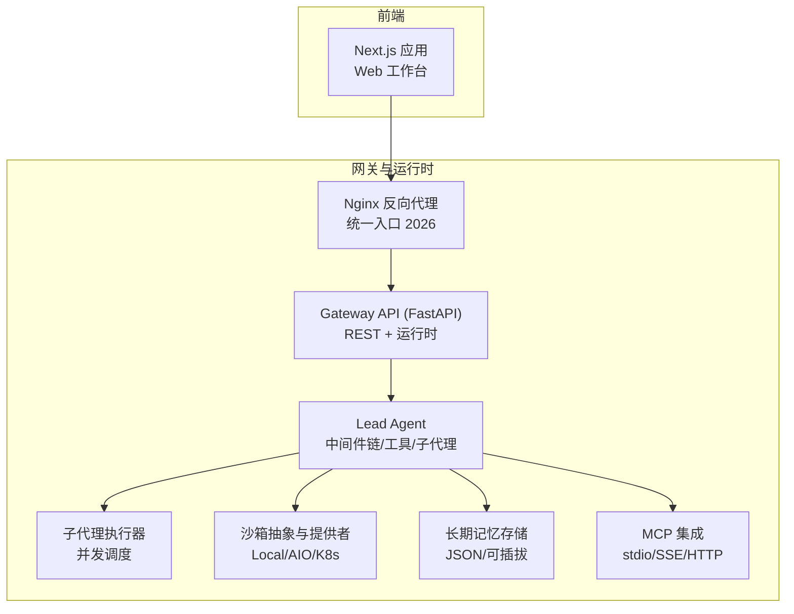
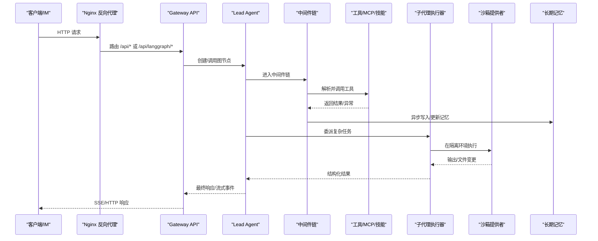
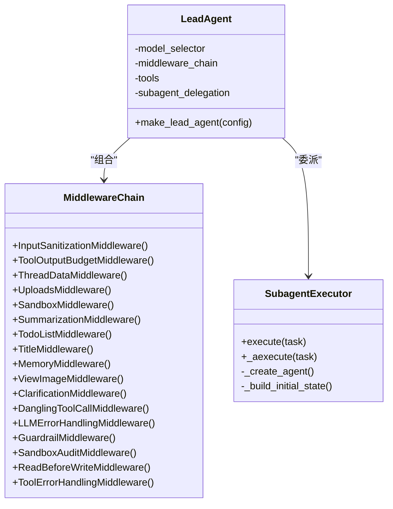
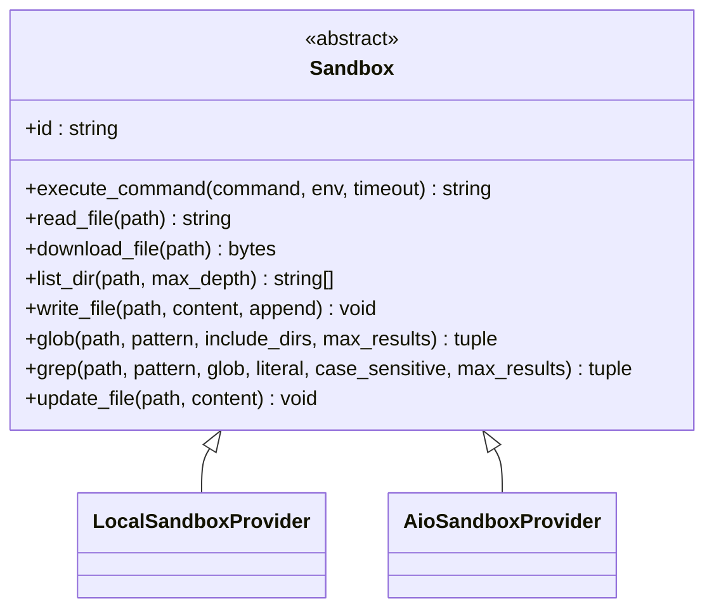
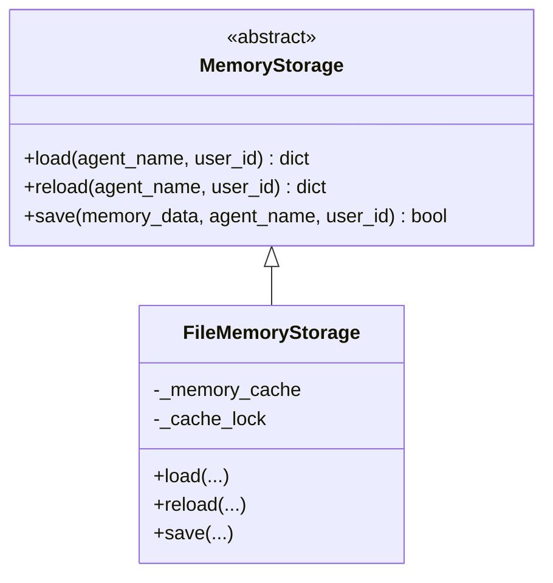
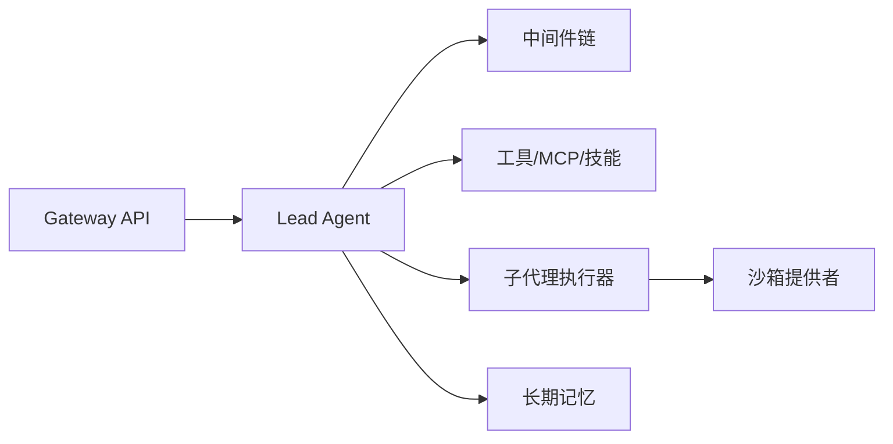

# 项目介绍

<cite>
**本文引用的文件列表**   
- [README.md](file://README.md)
- [backend/README.md](file://backend/README.md)
- [frontend/README.md](file://frontend/README.md)
- [tool_error_handling_middleware.py](file://backend/packages/harness/deerflow/agents/middlewares/tool_error_handling_middleware.py)
- [sandbox.py](file://backend/packages/harness/deerflow/sandbox/sandbox.py)
- [executor.py](file://backend/packages/harness/deerflow/subagents/executor.py)
- [storage.py](file://backend/packages/harness/deerflow/agents/memory/storage.py)
</cite>

## 目录
1. [引言](#引言)
2. [项目结构](#项目结构)
3. [核心组件](#核心组件)
4. [架构总览](#架构总览)
5. [详细组件分析](#详细组件分析)
6. [依赖关系分析](#依赖关系分析)
7. [性能与可扩展性](#性能与可扩展性)
8. [故障排查指南](#故障排查指南)
9. [结论](#结论)
10. [附录](#附录)

## 引言
DeerFlow 是一个开源的“超级代理编排框架”，从最初专注于深度研究的工具，演进为以 LangGraph 和 LangChain 为核心的可扩展 AI 代理运行时。2.0 版本进行了从零重构，不再只是“拼凑式”的框架，而是提供开箱即用的能力：文件系统、长期记忆、技能系统、沙箱执行、子代理协作、安全护栏、可观测性与多通道接入等。它既可作为单一研究工具使用，也可作为通用工作流编排平台，支撑复杂的多步骤任务与跨渠道交互。

本介绍面向初学者解释 AI 代理编排的基本概念（如会话、线程、中间件链、工具、子代理、记忆、沙箱），同时为有经验的开发者提供技术背景与关键实现要点。

## 项目结构
仓库采用前后端分离与模块化组织：
- 根目录包含文档、脚本、技能包与示例配置；
- backend 提供 Gateway API、LangGraph 运行时、中间件、沙箱、子代理、记忆、MCP、持久化、TUI 等；
- frontend 基于 Next.js 提供 Web 工作台与聊天界面；
- skills 提供内置与社区技能包；
- docker 提供容器化部署方案。



图表来源
- [backend/README.md:10-35](file://backend/README.md#L10-L35)
- [backend/README.md:220-265](file://backend/README.md#L220-L265)

章节来源
- [backend/README.md:1-40](file://backend/README.md#L1-L40)
- [backend/README.md:220-265](file://backend/README.md#L220-L265)
- [frontend/README.md:1-30](file://frontend/README.md#L1-L30)

## 核心组件
- 主代理（Lead Agent）：通过工厂方法创建，组合动态模型选择、中间件链、工具系统与子代理委派，是运行时的唯一入口。
- 中间件链：按严格顺序执行，负责输入清洗、上传注入、沙箱生命周期、上下文摘要、待办清单、标题生成、记忆异步提取、图像注入、澄清拦截、错误处理、护栏、审计、读前写保护等。
- 沙箱系统：抽象接口定义命令执行、文件读写、目录遍历、glob/grep、二进制更新等；支持本地与远程（Docker/Kubernetes）提供者，虚拟路径映射到线程隔离的工作区。
- 子代理系统：后台线程池与独立事件循环并行执行，具备状态机、超时控制、取消、最大轮次限制、结果聚合与追踪元数据注入。
- 长期记忆：LLM 驱动的对话摘要与事实抽取，结构化存储用户上下文与历史，支持去重与延迟合并，默认 JSON 文件存储并可插拔扩展。
- 技能系统：以 Markdown 描述工作流与参考资源，按需加载，支持斜杠激活、白名单与权限控制，结合工具策略过滤。
- 可观测性与安全：可选 LangSmith/Langfuse 追踪；Guardrail 护栏、Sandbox 审计、Loop 检测、Safety Finish Reason 清理等。

章节来源
- [backend/README.md:41-134](file://backend/README.md#L41-L134)
- [tool_error_handling_middleware.py:149-223](file://backend/packages/harness/deerflow/agents/middlewares/tool_error_handling_middleware.py#L149-L223)
- [sandbox.py:44-176](file://backend/packages/harness/deerflow/sandbox/sandbox.py#L44-L176)
- [executor.py:327-435](file://backend/packages/harness/deerflow/subagents/executor.py#L327-L435)
- [storage.py:43-190](file://backend/packages/harness/deerflow/agents/memory/storage.py#L43-L190)

## 架构总览
DeerFlow 2.0 的核心定位是“基于 LangGraph 和 LangChain 的可扩展 AI 代理运行时”。其请求路由由 Nginx 统一转发，Gateway 暴露 REST 与 LangGraph 兼容路径，内部通过 Lead Agent 驱动中间件链与工具生态，必要时委派子代理在隔离环境中执行，并将结果回传与持久化。



图表来源
- [backend/README.md:10-35](file://backend/README.md#L10-L35)
- [backend/README.md:41-134](file://backend/README.md#L41-L134)
- [executor.py:327-435](file://backend/packages/harness/deerflow/subagents/executor.py#L327-L435)
- [sandbox.py:44-176](file://backend/packages/harness/deerflow/sandbox/sandbox.py#L44-L176)
- [storage.py:43-190](file://backend/packages/harness/deerflow/agents/memory/storage.py#L43-L190)

## 详细组件分析

### 主代理与中间件链
- 主代理通过工厂方法构建，组合动态模型选择、中间件链、工具系统与子代理委派。
- 中间件链分层组织：外层包装（输入清洗、输出预算）、线程钩子（上传、沙箱生命周期）、尾部处理（悬挂工具调用修复、LLM 错误处理、护栏、审计、读前写保护、工具错误处理）。
- 子代理运行时复用共享中间件组装逻辑，并根据模型能力与配置选择性注入视觉、延迟工具过滤、环路检测与安全终止清理等。



图表来源
- [backend/README.md:41-66](file://backend/README.md#L41-L66)
- [tool_error_handling_middleware.py:149-223](file://backend/packages/harness/deerflow/agents/middlewares/tool_error_handling_middleware.py#L149-L223)
- [tool_error_handling_middleware.py:236-305](file://backend/packages/harness/deerflow/agents/middlewares/tool_error_handling_middleware.py#L236-L305)
- [executor.py:327-435](file://backend/packages/harness/deerflow/subagents/executor.py#L327-L435)

章节来源
- [backend/README.md:41-66](file://backend/README.md#L41-L66)
- [tool_error_handling_middleware.py:149-223](file://backend/packages/harness/deerflow/agents/middlewares/tool_error_handling_middleware.py#L149-L223)
- [tool_error_handling_middleware.py:236-305](file://backend/packages/harness/deerflow/agents/middlewares/tool_error_handling_middleware.py#L236-L305)

### 沙箱执行与环境隔离
- 抽象接口定义了命令执行、文件读写、目录遍历、glob/grep、二进制更新等方法，并提供环境变量键名校验，防止未来 shell 拼接导致的注入风险。
- 提供者包括本地文件系统与 AIO（Docker/Kubernetes）模式，虚拟路径映射到线程隔离的工作区与输出目录，确保每个任务拥有独立的执行环境。



图表来源
- [sandbox.py:44-176](file://backend/packages/harness/deerflow/sandbox/sandbox.py#L44-L176)

章节来源
- [sandbox.py:44-176](file://backend/packages/harness/deerflow/sandbox/sandbox.py#L44-L176)

### 子代理协作与并发执行
- 子代理执行器维护状态机（等待/运行/完成/失败/取消/超时/达到最大轮次），支持并发调度、超时与取消、消息捕获与去重、令牌用量收集与追踪元数据注入。
- 当父代理调用 task 工具时，执行器在后台线程池中启动子代理，流式收集中间状态并在完成后聚合结果回传给主代理。

```mermaid
sequenceDiagram
participant Lead as "主代理"
participant Exec as "子代理执行器"
participant Loop as "隔离事件循环"
participant Agent as "子代理实例"
participant Store as "结果存储"
Lead->>Exec : execute(task)
Exec->>Loop : 提交协程
Loop->>Agent : astream(values)
Agent-->>Loop : 分块状态
Loop->>Store : 追加AI消息/统计
Agent-->>Loop : 最终状态
Loop-->>Exec : 提取最终结果
Exec-->>Lead : 结构化结果
```

图表来源
- [executor.py:327-435](file://backend/packages/harness/deerflow/subagents/executor.py#L327-L435)
- [executor.py:562-746](file://backend/packages/harness/deerflow/subagents/executor.py#L562-L746)

章节来源
- [executor.py:327-435](file://backend/packages/harness/deerflow/subagents/executor.py#L327-L435)
- [executor.py:562-746](file://backend/packages/harness/deerflow/subagents/executor.py#L562-L746)

### 长期记忆与上下文工程
- 记忆存储抽象支持可插拔实现，默认基于 JSON 文件，带 mtime 缓存失效与原子替换写入，避免并发损坏。
- 支持按用户/代理维度隔离，自动抽取用户上下文、偏好与事实，并通过系统提示注入到代理上下文中，提升长会话质量。



图表来源
- [storage.py:43-190](file://backend/packages/harness/deerflow/agents/memory/storage.py#L43-L190)

章节来源
- [storage.py:43-190](file://backend/packages/harness/deerflow/agents/memory/storage.py#L43-L190)

### 技能系统与工具生态
- 技能以 Markdown 描述工作流与最佳实践，按需加载，支持斜杠激活、白名单与权限控制；工具遵循相同理念，支持内置、社区与 MCP 扩展。
- 子代理在执行前会加载已启用的技能并将其内容注入为对话项，配合工具策略过滤，确保最小必要上下文与最小工具暴露面。

章节来源
- [backend/README.md:98-107](file://backend/README.md#L98-L107)
- [executor.py:436-496](file://backend/packages/harness/deerflow/subagents/executor.py#L436-L496)

## 依赖关系分析
- 外部依赖：LangGraph（图与多代理编排）、LangChain（模型抽象与工具系统）、FastAPI（Gateway API）、langchain-mcp-adapters（MCP 协议）、agent-sandbox（沙箱执行）、markitdown（文档转换）、tavily-python/firecrawl-py（搜索与抓取）。
- 内部模块耦合：Gateway 依赖 Lead Agent 与中间件链；Lead Agent 依赖工具、子代理、记忆与沙箱；子代理复用中间件组装逻辑；记忆与沙箱均为可插拔抽象。



图表来源
- [backend/README.md:220-265](file://backend/README.md#L220-L265)
- [backend/README.md:445-454](file://backend/README.md#L445-L454)

章节来源
- [backend/README.md:220-265](file://backend/README.md#L220-L265)
- [backend/README.md:445-454](file://backend/README.md#L445-L454)

## 性能与可扩展性
- 并发与隔离：子代理通过线程池与独立事件循环并行执行，避免阻塞主循环；沙箱提供进程/容器级隔离，降低资源争用与安全风险。
- 上下文管理：中间件链中的摘要与上传注入、视图图片注入、读前写保护等，有助于控制上下文窗口与减少无效计算。
- 可观测性：可选 LangSmith/Langfuse 追踪，便于定位瓶颈与优化模型调用与工具执行路径。
- 扩展点：中间件链、沙箱提供者、记忆存储、工具与技能均可插拔，便于按场景定制。

[本节为通用指导，不直接分析具体文件]

## 故障排查指南
- 工具错误与悬挂调用：中间件会在强制停止后清理 provider 层原始工具调用元数据，并为悬挂调用注入占位结果，避免下游模型因工具调用 ID 序列不合法而失败。
- 环路检测与安全终止：子代理与主代理均启用环路检测与安全终止清理，防止无限循环与截断工具调用传播。
- 沙箱审计与读前写保护：对文件操作进行审计与保护，避免误写与越权访问。
- 记忆保存与缓存失效：文件保存采用临时文件原子替换，结合 mtime 缓存，避免并发写入导致的数据不一致。

章节来源
- [tool_error_handling_middleware.py:149-223](file://backend/packages/harness/deerflow/agents/middlewares/tool_error_handling_middleware.py#L149-L223)
- [tool_error_handling_middleware.py:236-305](file://backend/packages/harness/deerflow/agents/middlewares/tool_error_handling_middleware.py#L236-L305)
- [storage.py:160-190](file://backend/packages/harness/deerflow/agents/memory/storage.py#L160-L190)

## 结论
DeerFlow 2.0 将“深度研究工具”升级为“超级代理编排框架”，以 LangGraph 与 LangChain 为核心，提供技能系统、子代理协作、长期记忆、安全沙箱执行、可观测性与多通道接入等关键能力。其模块化与可插拔设计使得 DeerFlow 既能开箱即用，也能根据业务需求灵活扩展，成为通用的 AI 代理运行时与工作流编排平台。

[本节为总结，不直接分析具体文件]

## 附录
- 快速开始与部署建议请参考 README 与后端说明，涵盖 Docker 与本地开发、模型配置、IM 通道、追踪集成等。
- 前端基于 Next.js，提供现代化 Web 工作台与聊天界面，支持多语言与国际化。

章节来源
- [README.md:95-131](file://README.md#L95-L131)
- [backend/README.md:136-217](file://backend/README.md#L136-L217)
- [frontend/README.md:11-36](file://frontend/README.md#L11-L36)