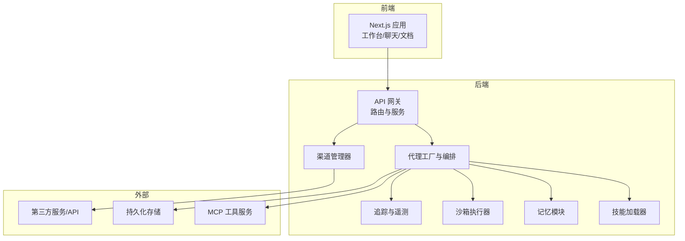
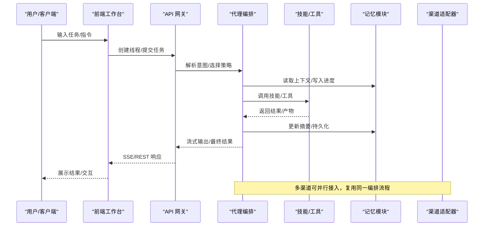
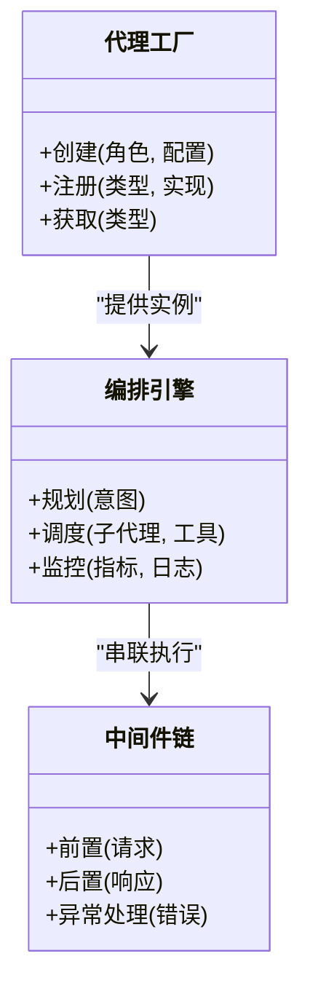
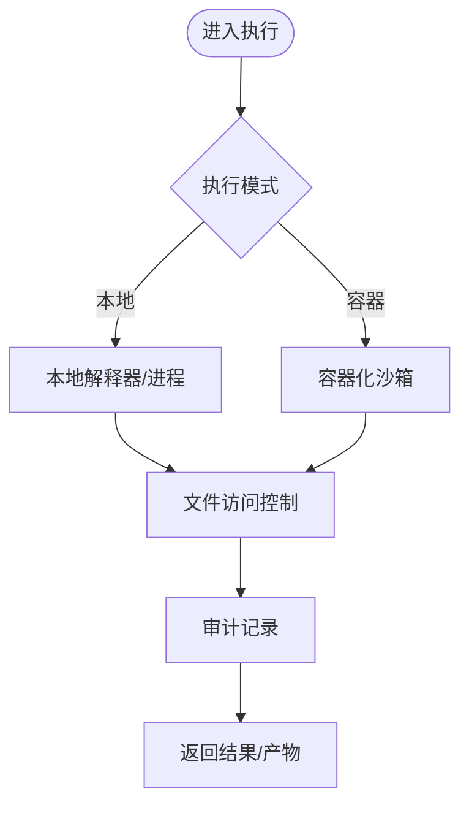
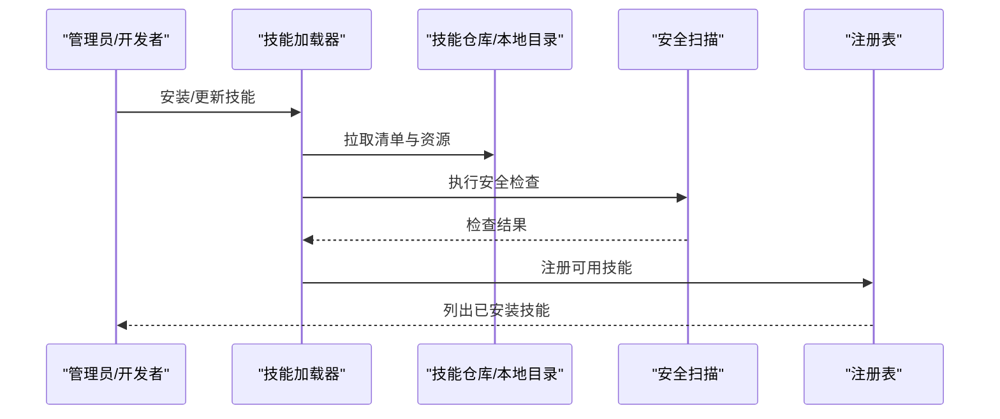
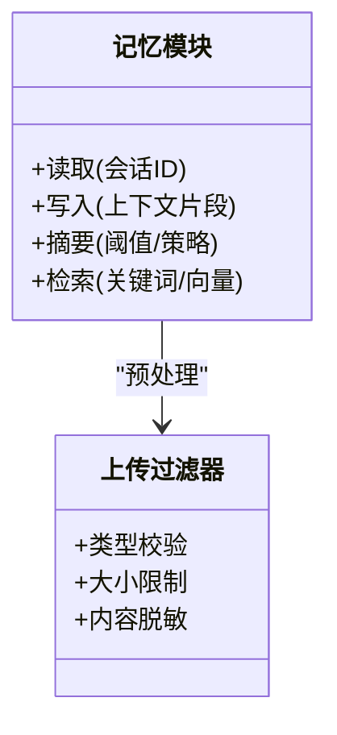
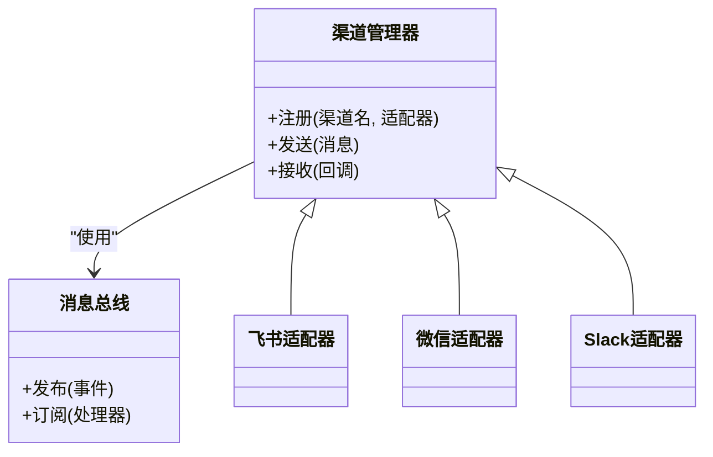
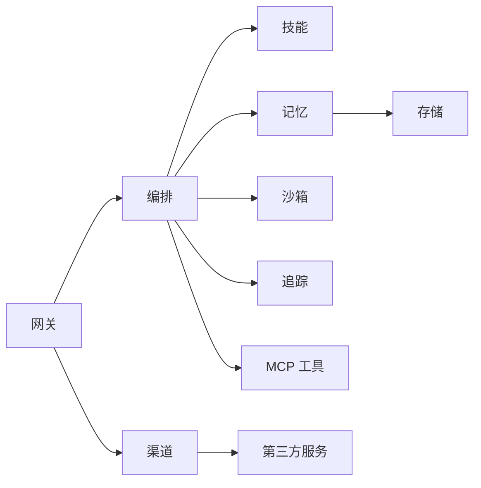

# 项目介绍

<cite>
**本文引用的文件**   
- [README.md](file://README.md)
- [backend/README.md](file://backend/README.md)
- [frontend/README.md](file://frontend/README.md)
- [backend/app/gateway/app.py](file://backend/app/gateway/app.py)
- [backend/packages/harness/deerflow/agents/factory.py](file://backend/packages/harness/deerflow/agents/factory.py)
- [backend/packages/harness/deerflow/skills/loader.py](file://backend/packages/harness/deerflow/skills/loader.py)
- [backend/packages/harness/deerflow/memory/__init__.py](file://backend/packages/harness/deerflow/memory/__init__.py)
- [backend/app/channels/manager.py](file://backend/app/channels/manager.py)
- [docker/docker-compose.yaml](file://docker/docker-compose.yaml)
- [config.example.yaml](file://config.example.yaml)
- [extensions_config.example.json](file://extensions_config.example.json)
</cite>

## 目录
1. [简介](#简介)
2. [项目结构](#项目结构)
3. [核心组件](#核心组件)
4. [架构总览](#架构总览)
5. [详细组件分析](#详细组件分析)
6. [依赖分析](#依赖分析)
7. [性能考量](#性能考量)
8. [故障排查指南](#故障排查指南)
9. [结论](#结论)
10. [附录](#附录)

## 简介
DeerFlow 是一个面向 AI 代理执行的基础设施与工具平台，旨在为多智能体协作、技能编排、长期记忆与多渠道集成提供统一运行时。它通过“超级代理编排系统”将复杂任务分解为可组合的子任务，借助“多模式执行环境”在本地或沙箱中安全运行代码与外部调用，并通过“可扩展的技能生态系统”让开发者以声明式方式快速装配能力；同时内置“长期记忆管理”和“多渠道集成”，使 AI 应用具备持续学习与跨端触达的能力。

核心价值主张：
- 降低构建复杂 AI 应用的门槛：从“单模型对话”走向“可编排、可观测、可治理”的代理工作流。
- 提升工程化水平：统一的网关、配置、运行时与前端工作台，覆盖开发、调试、部署全链路。
- 开放与可扩展：技能、工具、渠道、模型提供者均可插拔扩展，兼容主流生态。

适用场景：
- 企业级知识检索与报告生成
- 自动化研究与数据分析流水线
- 多模态内容创作（图文、图表、视频脚本等）
- 跨平台客服与运营助手（飞书、微信、Slack、Discord、Telegram 等）

开源协议与社区：
- 仓库根目录包含贡献与安全规范文档，表明项目采用开源协作模式并鼓励社区共建。具体许可证条款请参考仓库中的 LICENSE 文件（若存在）。
- 社区生态围绕“技能市场”“MCP 工具”“模型提供者”“渠道插件”展开，便于二次开发与集成。

[本节不直接分析具体源码文件]

## 项目结构
DeerFlow 采用前后端分离与模块化设计：
- 后端（Python）：提供 API 网关、代理编排、技能加载、记忆存储、渠道接入、沙箱执行、追踪与上传等能力。
- 前端（Next.js）：提供工作台、聊天界面、可视化编排、设置与文档站点。
- Docker 编排：一键启动开发/生产环境。
- 配置与示例：集中化的 YAML/JSON 配置与示例，支持灵活定制。

```mermaid
graph TB
subgraph "前端"
FE["Next.js 应用<br/>工作台/聊天/文档"]
end
subgraph "后端"
GW["API 网关<br/>路由与服务"]
AG["代理工厂与编排"]
SK["技能加载器"]
ME["记忆模块"]
CH["渠道管理器"]
SB["沙箱执行器"]
TR["追踪与遥测"]
end
subgraph "外部"
MCP["MCP 工具服务"]
EXT["第三方服务/API"]
DB["持久化存储"]
end
FE --> GW
GW --> AG
AG --> SK
AG --> ME
AG --> SB
AG --> TR
GW --> CH
CH --> EXT
AG --> MCP
AG --> DB
```

图示来源
- [backend/app/gateway/app.py](file://backend/app/gateway/app.py)
- [backend/packages/harness/deerflow/agents/factory.py](file://backend/packages/harness/deerflow/agents/factory.py)
- [backend/packages/harness/deerflow/skills/loader.py](file://backend/packages/harness/deerflow/skills/loader.py)
- [backend/packages/harness/deerflow/memory/__init__.py](file://backend/packages/harness/deerflow/memory/__init__.py)
- [backend/app/channels/manager.py](file://backend/app/channels/manager.py)

章节来源
- [README.md](file://README.md)
- [backend/README.md](file://backend/README.md)
- [frontend/README.md](file://frontend/README.md)

## 核心组件
- 超级代理编排系统
  - 负责将用户意图拆解为子任务，协调多个子代理与工具完成目标，支持计划模式、反思与重试机制。
  - 关键入口位于代理工厂与中间件体系，确保可插拔与可观测。
- 多模式执行环境
  - 支持本地与容器化沙箱执行，提供文件操作锁、审计与隔离，保障安全性与稳定性。
- 可扩展的技能生态系统
  - 基于声明式描述与模板，支持安装、校验、扫描与动态加载，形成“即插即用”的能力包。
- 长期记忆管理
  - 提供会话状态、上下文摘要与增量更新，支持上传过滤与提示注入，增强连续对话质量。
- 多渠道集成能力
  - 统一消息总线与通道抽象，对接飞书、微信、Slack、Discord、Telegram 等平台，实现一致体验。

章节来源
- [backend/packages/harness/deerflow/agents/factory.py](file://backend/packages/harness/deerflow/agents/factory.py)
- [backend/packages/harness/deerflow/skills/loader.py](file://backend/packages/harness/deerflow/skills/loader.py)
- [backend/packages/harness/deerflow/memory/__init__.py](file://backend/packages/harness/deerflow/memory/__init__.py)
- [backend/app/channels/manager.py](file://backend/app/channels/manager.py)

## 架构总览
DeerFlow 的整体架构围绕“网关—编排—执行—记忆—渠道”五层展开：
- 网关层：对外暴露 REST/SSE 接口，承载认证、鉴权、限流与请求路由。
- 编排层：根据意图选择策略、调度子代理与工具，维护线程状态与检查点。
- 执行层：在沙箱或本地环境中运行代码与外部调用，提供审计与资源控制。
- 记忆层：维护短期上下文与长期知识库，支持摘要与检索。
- 渠道层：统一消息格式与生命周期，适配多种 IM 平台。

```mermaid
sequenceDiagram
participant U as "用户/客户端"
participant FE as "前端工作台"
participant GW as "API 网关"
participant AG as "代理编排"
participant SK as "技能/工具"
participant ME as "记忆模块"
participant CH as "渠道适配器"
U->>FE : 输入任务/指令
FE->>GW : 创建线程/提交任务
GW->>AG : 解析意图/选择策略
AG->>ME : 读取上下文/写入进度
AG->>SK : 调用技能/工具
SK-->>AG : 返回结果/产物
AG->>ME : 更新摘要/持久化
AG-->>GW : 流式输出/最终结果
GW-->>FE : SSE/REST 响应
FE-->>U : 展示结果/交互
Note over CH,AG : 多渠道可并行接入，复用同一编排流程
```

图示来源
- [backend/app/gateway/app.py](file://backend/app/gateway/app.py)
- [backend/packages/harness/deerflow/agents/factory.py](file://backend/packages/harness/deerflow/agents/factory.py)
- [backend/packages/harness/deerflow/skills/loader.py](file://backend/packages/harness/deerflow/skills/loader.py)
- [backend/packages/harness/deerflow/memory/__init__.py](file://backend/packages/harness/deerflow/memory/__init__.py)
- [backend/app/channels/manager.py](file://backend/app/channels/manager.py)

## 详细组件分析

### 超级代理编排系统
- 职责
  - 意图识别与任务分解
  - 子代理选择与参数注入
  - 中间件链（澄清、限流、循环检测、错误降级等）
  - 计划模式与反思回路
- 关键点
  - 工厂模式注册与实例化不同角色代理
  - 线程状态机驱动执行流程
  - 与记忆、工具、沙箱解耦，便于替换与扩展

```mermaid
classDiagram
class 代理工厂 {
+创建(角色, 配置)
+注册(类型, 实现)
+获取(类型)
}
class 编排引擎 {
+规划(意图)
+调度(子代理, 工具)
+监控(指标, 日志)
}
class 中间件链 {
+前置(请求)
+后置(响应)
+异常处理(错误)
}
代理工厂 --> 编排引擎 : "提供实例"
编排引擎 --> 中间件链 : "串联执行"
```

图示来源
- [backend/packages/harness/deerflow/agents/factory.py](file://backend/packages/harness/deerflow/agents/factory.py)

章节来源
- [backend/packages/harness/deerflow/agents/factory.py](file://backend/packages/harness/deerflow/agents/factory.py)

### 多模式执行环境（沙箱）
- 职责
  - 代码执行隔离（本地/容器）
  - 文件系统访问控制与审计
  - 资源限制与超时保护
- 关键点
  - 文件操作锁避免并发冲突
  - 安全扫描与白名单策略
  - 与工具层解耦，统一暴露执行接口

```mermaid
flowchart TD
Start(["进入执行"]) --> Mode{"执行模式"}
Mode --> |本地| Local["本地解释器/进程"]
Mode --> |容器| Container["容器化沙箱"]
Local --> FS["文件访问控制"]
Container --> FS
FS --> Audit["审计记录"]
Audit --> Result["返回结果/产物"]
```

图示来源
- [backend/packages/harness/deerflow/sandbox/middleware.py](file://backend/packages/harness/deerflow/sandbox/middleware.py)
- [backend/packages/harness/deerflow/sandbox/file_operation_lock.py](file://backend/packages/harness/deerflow/sandbox/file_operation_lock.py)

章节来源
- [backend/packages/harness/deerflow/sandbox/middleware.py](file://backend/packages/harness/deerflow/sandbox/middleware.py)
- [backend/packages/harness/deerflow/sandbox/file_operation_lock.py](file://backend/packages/harness/deerflow/sandbox/file_operation_lock.py)

### 可扩展的技能生态系统
- 职责
  - 技能清单发现与版本管理
  - 元数据解析与模板渲染
  - 安装、校验与安全扫描
- 关键点
  - 声明式 SKILL.md 与脚本/模板组织
  - 动态加载与热更新
  - 与工具/模型/渠道解耦，按需启用

```mermaid
sequenceDiagram
participant Admin as "管理员/开发者"
participant Loader as "技能加载器"
participant Repo as "技能仓库/本地目录"
participant Scan as "安全扫描"
participant Registry as "注册表"
Admin->>Loader : 安装/更新技能
Loader->>Repo : 拉取清单与资源
Loader->>Scan : 执行安全检查
Scan-->>Loader : 检查结果
Loader->>Registry : 注册可用技能
Registry-->>Admin : 列出已安装技能
```

图示来源
- [backend/packages/harness/deerflow/skills/loader.py](file://backend/packages/harness/deerflow/skills/loader.py)

章节来源
- [backend/packages/harness/deerflow/skills/loader.py](file://backend/packages/harness/deerflow/skills/loader.py)

### 长期记忆管理
- 职责
  - 会话上下文维护与增量更新
  - 摘要生成与检索增强
  - 上传过滤与提示注入
- 关键点
  - 内存队列与持久化结合
  - 事件驱动的更新策略
  - 与编排层松耦合，支持替换存储后端

```mermaid
classDiagram
class 记忆模块 {
+读取(会话ID)
+写入(上下文片段)
+摘要(阈值/策略)
+检索(关键词/向量)
}
class 上传过滤器 {
+类型校验
+大小限制
+内容脱敏
}
记忆模块 --> 上传过滤器 : "预处理"
```

图示来源
- [backend/packages/harness/deerflow/memory/__init__.py](file://backend/packages/harness/deerflow/memory/__init__.py)

章节来源
- [backend/packages/harness/deerflow/memory/__init__.py](file://backend/packages/harness/deerflow/memory/__init__.py)

### 多渠道集成能力
- 职责
  - 统一消息模型与生命周期
  - 平台差异适配与鉴权
  - 事件分发与回写
- 关键点
  - 通道管理器集中注册与路由
  - 消息总线保证可靠投递
  - 与编排层通过标准接口交互

```mermaid
classDiagram
class 渠道管理器 {
+注册(渠道名, 适配器)
+发送(消息)
+接收(回调)
}
class 消息总线 {
+发布(事件)
+订阅(处理器)
}
class 飞书适配器
class 微信适配器
class Slack适配器
渠道管理器 --> 消息总线 : "使用"
渠道管理器 <|-- 飞书适配器
渠道管理器 <|-- 微信适配器
渠道管理器 <|-- Slack适配器
```

图示来源
- [backend/app/channels/manager.py](file://backend/app/channels/manager.py)

章节来源
- [backend/app/channels/manager.py](file://backend/app/channels/manager.py)

## 依赖分析
- 内部依赖
  - 网关依赖编排、记忆、渠道、沙箱与追踪模块
  - 编排依赖技能加载器与工具注册表
  - 记忆模块与上传、过滤、摘要组件协作
- 外部依赖
  - MCP 工具服务与第三方 API
  - 持久化存储（关系型/键值/对象存储）
  - 容器运行时（可选）

```mermaid
graph LR
GW["网关"] --> AG["编排"]
GW --> CH["渠道"]
AG --> SK["技能"]
AG --> ME["记忆"]
AG --> SB["沙箱"]
AG --> TR["追踪"]
CH --> EXT["第三方服务"]
AG --> MCP["MCP 工具"]
ME --> DB["存储"]
```

图示来源
- [backend/app/gateway/app.py](file://backend/app/gateway/app.py)
- [backend/app/channels/manager.py](file://backend/app/channels/manager.py)
- [backend/packages/harness/deerflow/agents/factory.py](file://backend/packages/harness/deerflow/agents/factory.py)
- [backend/packages/harness/deerflow/skills/loader.py](file://backend/packages/harness/deerflow/skills/loader.py)
- [backend/packages/harness/deerflow/memory/__init__.py](file://backend/packages/harness/deerflow/memory/__init__.py)

章节来源
- [backend/app/gateway/app.py](file://backend/app/gateway/app.py)
- [backend/app/channels/manager.py](file://backend/app/channels/manager.py)

## 性能考量
- 流式输出：网关与前端配合，减少首字节延迟，提升交互体验。
- 异步与批处理：记忆更新与上传处理采用异步队列，避免阻塞主流程。
- 缓存与索引：对频繁查询的记忆片段进行缓存，缩短检索时间。
- 资源隔离：沙箱执行限制 CPU/内存/IO，防止恶意或低效代码影响整体稳定性。
- 可观测性：追踪与指标上报帮助定位瓶颈与异常路径。

[本节提供通用指导，不直接分析具体源码文件]

## 故障排查指南
- 常见问题
  - 技能加载失败：检查 SKILL.md 语法、脚本权限与依赖是否满足。
  - 沙箱执行超时：调整超时阈值与资源配额，查看审计日志定位卡点。
  - 渠道连接异常：核对鉴权配置与网络连通性，确认回调地址可达。
  - 记忆写入失败：检查存储后端健康状态与磁盘空间。
- 建议步骤
  - 开启详细日志与追踪，复现问题后收集上下文快照。
  - 使用最小化用例验证各组件独立功能，逐步扩大范围。
  - 利用配置升级脚本与示例配置对比差异，排除配置漂移。

章节来源
- [backend/app/gateway/app.py](file://backend/app/gateway/app.py)
- [backend/packages/harness/deerflow/skills/loader.py](file://backend/packages/harness/deerflow/skills/loader.py)
- [backend/packages/harness/deerflow/memory/__init__.py](file://backend/packages/harness/deerflow/memory/__init__.py)
- [backend/app/channels/manager.py](file://backend/app/channels/manager.py)

## 结论
DeerFlow 以“编排+执行+记忆+渠道”的一体化架构，为 AI 应用提供了高内聚、低耦合的工程基座。其超级代理编排系统、多模式执行环境、可扩展技能生态、长期记忆管理与多渠道集成，共同构成了面向复杂任务的稳定底座。通过统一的网关与前端工作台，开发者可以快速搭建、调试与交付高质量的 AI 产品。随着社区生态的繁荣，DeerFlow 将持续演进，成为企业级 AI 代理基础设施的首选之一。

[本节为总结性内容，不直接分析具体源码文件]

## 附录
- 快速开始
  - 使用 Docker Compose 一键启动开发环境，参考编排文件。
  - 通过配置文件与扩展配置示例，完成模型、渠道与技能的初始化。
- 相关文档
  - 后端与前端 README 提供安装、配置与使用说明。
  - 网关与服务文档涵盖 API、流式传输与中间件流程。

章节来源
- [docker/docker-compose.yaml](file://docker/docker-compose.yaml)
- [config.example.yaml](file://config.example.yaml)
- [extensions_config.example.json](file://extensions_config.example.json)
- [backend/README.md](file://backend/README.md)
- [frontend/README.md](file://frontend/README.md)