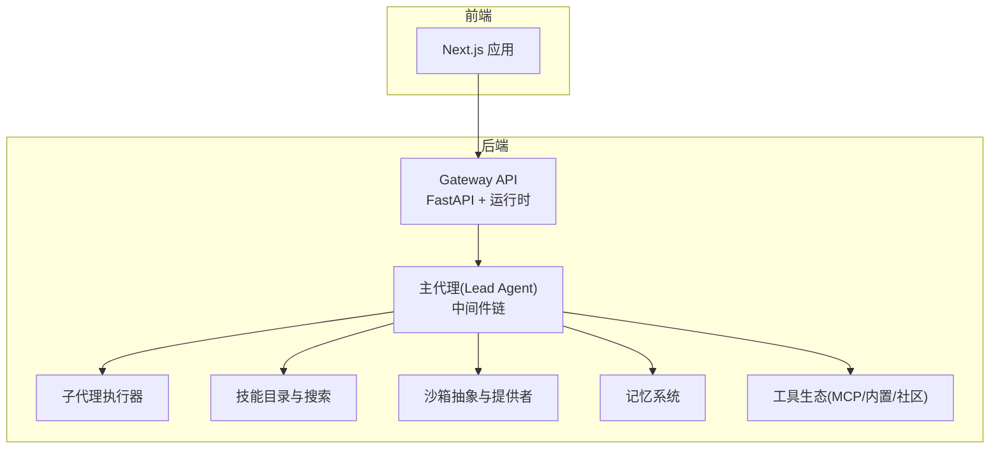
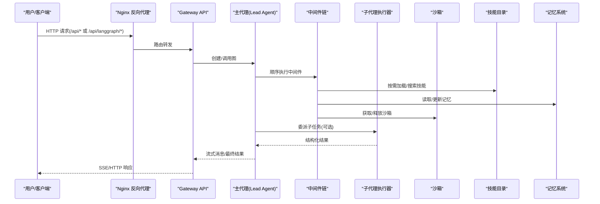
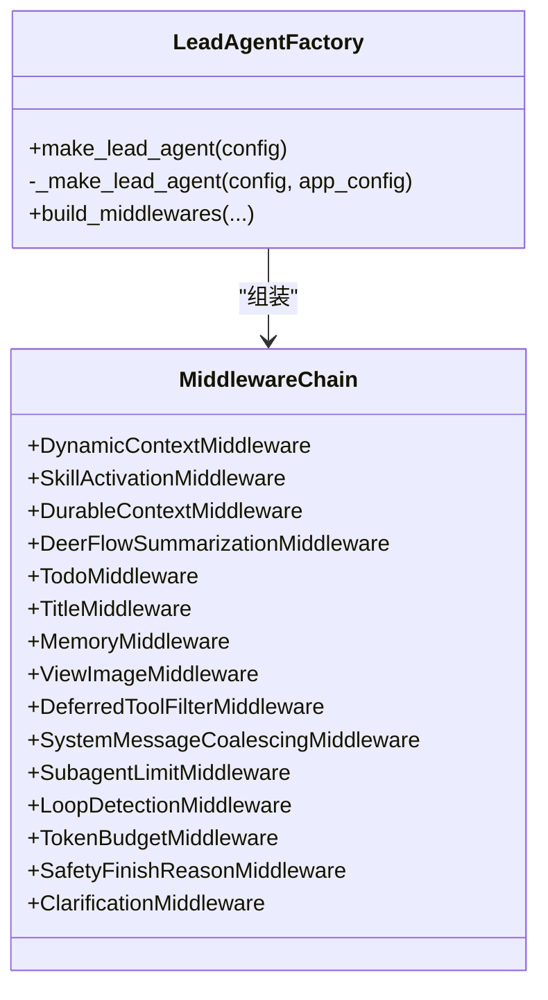
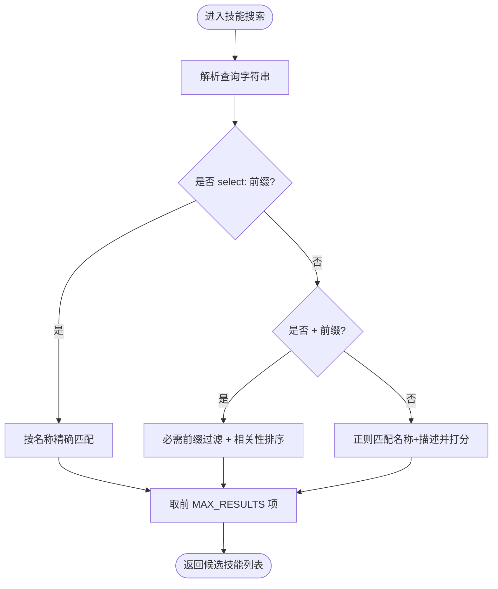
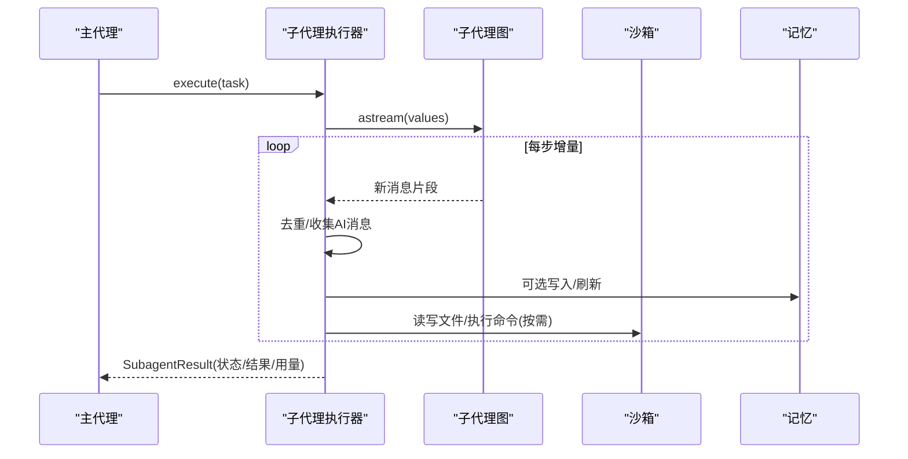
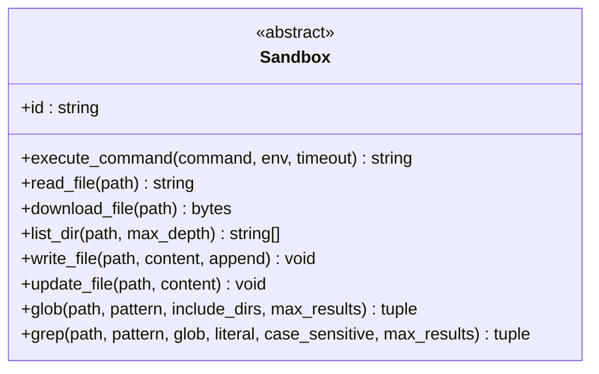
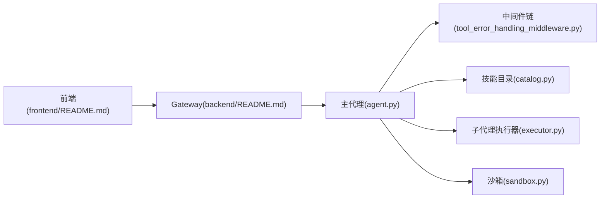

# 项目概述

<cite>
**本文引用的文件**   
- [README.md](file://README.md)
- [backend/README.md](file://backend/README.md)
- [frontend/README.md](file://frontend/README.md)
- [agent.py](file://backend/packages/harness/deerflow/agents/lead_agent/agent.py)
- [catalog.py](file://backend/packages/harness/deerflow/skills/catalog.py)
- [executor.py](file://backend/packages/harness/deerflow/subagents/executor.py)
- [sandbox.py](file://backend/packages/harness/deerflow/sandbox/sandbox.py)
</cite>

## 目录
1. [引言](#引言)
2. [项目结构](#项目结构)
3. [核心组件](#核心组件)
4. [架构总览](#架构总览)
5. [详细组件分析](#详细组件分析)
6. [依赖分析](#依赖分析)
7. [性能考量](#性能考量)
8. [故障排查指南](#故障排查指南)
9. [结论](#结论)
10. [附录：快速开始与最佳实践](#附录快速开始与最佳实践)

## 引言
DeerFlow 是一个开源的“超级代理编排框架”，从最初的深度研究工具演进为可编排子代理、记忆、沙箱与技能的通用执行基座。其核心价值主张是：以可扩展技能系统为核心，结合安全沙箱与长期记忆，提供面向复杂多步任务的“计划—委派—执行—收敛”的一体化能力；同时通过网关统一暴露 API，并配套 Web 前端与终端工作区（TUI），让开发者与最终用户都能高效使用。

DeerFlow 2.0 是一次从零重构，不再沿用 v1 代码，而是基于 LangGraph/LangChain 构建，内置文件系统、持久化记忆、技能加载、沙箱执行、子代理协作等能力，开箱即用且高度可定制。

## 项目结构
仓库采用前后端分离与模块化组织：
- 根目录 README 提供总体说明、快速开始、特性与部署建议
- backend 包含 Gateway API、LangGraph 运行时、中间件链、技能/工具/沙箱/子代理/记忆等核心实现
- frontend 为 Next.js 应用，提供聊天、工作区、设置、文档等界面
- skills 目录存放公共与自定义技能包
- docker 与脚本用于本地/生产环境编排与运维

图表来源
- [backend/README.md:1-40](file://backend/README.md#L1-L40)
- [frontend/README.md:1-40](file://frontend/README.md#L1-L40)

章节来源
- [README.md:1-120](file://README.md#L1-L120)
- [backend/README.md:1-120](file://backend/README.md#L1-L120)
- [frontend/README.md:1-60](file://frontend/README.md#L1-L60)

## 核心组件
- 主代理与中间件链：负责模型选择、上下文工程、任务规划、记忆注入、标题生成、澄清拦截等横切关注点
- 子代理系统：异步并发委派、状态追踪、结果聚合与超时控制
- 技能系统：延迟发现与按需加载，支持描述搜索与白名单策略
- 沙箱与文件系统：线程级隔离的执行环境与虚拟路径映射，支持本地/Docker/Kubernetes 多种模式
- 长期记忆：跨会话提取与结构化存储，自动去重与压缩
- 工具生态：内置工具、MCP 集成与社区工具，支持延迟绑定与权限过滤

章节来源
- [backend/README.md:39-134](file://backend/README.md#L39-L134)
- [README.md:601-735](file://README.md#L601-L735)

## 架构总览
请求经 Nginx 统一入口，按路径转发到 Gateway API；Gateway 内部创建或复用 LangGraph 图，组装主代理与中间件链，按需调用工具、子代理与沙箱，并将结果流式返回给前端或 IM 通道。

图表来源
- [backend/README.md:1-40](file://backend/README.md#L1-L40)
- [agent.py:430-627](file://backend/packages/harness/deerflow/agents/lead_agent/agent.py#L430-L627)
- [executor.py:327-435](file://backend/packages/harness/deerflow/subagents/executor.py#L327-L435)

## 详细组件分析

### 主代理与中间件链
- 工厂方法负责解析运行期配置、模型名称、思考/推理开关、计划模式、子代理开关与并发上限
- 中间件链包括：动态上下文、技能激活、持久化上下文、摘要、待办清单、标题、记忆、图像查看、延迟工具过滤、系统消息合并、子代理限制、循环检测、Token 预算、安全终止原因处理、澄清拦截等
- 在图根节点附加追踪回调，避免重复 span 并确保 session/user 元数据正确传播

图表来源
- [agent.py:269-405](file://backend/packages/harness/deerflow/agents/lead_agent/agent.py#L269-L405)
- [agent.py:430-627](file://backend/packages/harness/deerflow/agents/lead_agent/agent.py#L430-L627)

章节来源
- [agent.py:269-405](file://backend/packages/harness/deerflow/agents/lead_agent/agent.py#L269-L405)
- [agent.py:430-627](file://backend/packages/harness/deerflow/agents/lead_agent/agent.py#L430-L627)

### 技能系统与延迟发现
- 技能目录提供不可变、可搜索的技能索引，支持精确选择、前缀匹配与正则自由文本检索
- 通过 describe_skill 工具按需获取技能详情，保持系统提示紧凑并可被前缀缓存命中
- 技能加载受白名单与工具策略约束，确保最小权限原则

图表来源
- [catalog.py:42-103](file://backend/packages/harness/deerflow/skills/catalog.py#L42-L103)

章节来源
- [catalog.py:1-103](file://backend/packages/harness/deerflow/skills/catalog.py#L1-L103)

### 子代理执行器
- 支持异步并发执行，最大并行度与超时由配置控制
- 通过持久化的独立事件循环避免每次执行新建/关闭循环带来的资源开销
- 捕获 AI 消息增量、记录 Token 用量、处理递归限制导致的“达到最大轮次”情况，并恢复部分结果
- 继承父代理的沙箱状态与线程数据，保证上下文一致性

图表来源
- [executor.py:327-435](file://backend/packages/harness/deerflow/subagents/executor.py#L327-L435)
- [executor.py:562-746](file://backend/packages/harness/deerflow/subagents/executor.py#L562-L746)

章节来源
- [executor.py:327-435](file://backend/packages/harness/deerflow/subagents/executor.py#L327-L435)
- [executor.py:562-746](file://backend/packages/harness/deerflow/subagents/executor.py#L562-L746)

### 沙箱与文件系统
- 抽象接口定义命令执行、文件读/写/下载/更新、目录列举、glob/grep 等能力
- 对额外环境变量键名进行 POSIX 规则校验，防御未来可能的 shell 拼接注入风险
- 虚拟路径将容器内 /mnt/user-data/{workspace,uploads,outputs} 映射到线程级物理目录，技能挂载于 /mnt/skills

图表来源
- [sandbox.py:44-176](file://backend/packages/harness/deerflow/sandbox/sandbox.py#L44-L176)

章节来源
- [sandbox.py:1-176](file://backend/packages/harness/deerflow/sandbox/sandbox.py#L1-L176)

## 依赖分析
- 运行时依赖：LangGraph、LangChain、FastAPI、MCP 适配器等
- 前端依赖：Next.js、React、Tailwind/Shadcn UI、Vercel AI Elements、LangGraph SDK
- 关键耦合点：
  - 主代理与中间件链强耦合，中间件顺序影响行为
  - 子代理复用主代理的中间件组合与工具策略
  - 技能目录与工具策略共同决定可用工具集
  - 沙箱抽象解耦具体执行环境，便于替换提供者

图表来源
- [agent.py:269-405](file://backend/packages/harness/deerflow/agents/lead_agent/agent.py#L269-L405)
- [catalog.py:1-103](file://backend/packages/harness/deerflow/skills/catalog.py#L1-L103)
- [executor.py:327-435](file://backend/packages/harness/deerflow/subagents/executor.py#L327-L435)
- [sandbox.py:44-176](file://backend/packages/harness/deerflow/sandbox/sandbox.py#L44-L176)
- [backend/README.md:1-40](file://backend/README.md#L1-L40)
- [frontend/README.md:1-40](file://frontend/README.md#L1-L40)

章节来源
- [backend/README.md:445-477](file://backend/README.md#L445-L477)
- [frontend/README.md:1-40](file://frontend/README.md#L1-L40)

## 性能考量
- 中间件顺序与惰性加载：摘要、延迟工具过滤与系统消息合并可减少无效计算与上下文膨胀
- 子代理并发与超时：合理设置最大并发与轮次上限，避免长尾任务拖垮整体吞吐
- 事件循环复用：子代理使用持久化事件循环，减少循环创建/销毁成本
- 沙箱隔离与 IO：优先使用容器化沙箱；本地模式下禁用 host bash 默认开启，避免阻塞事件循环
- 追踪与日志：仅在需要时启用追踪，避免额外 I/O 压力

[本节为通用指导，不直接分析具体文件]

## 故障排查指南
- 启动与环境
  - 使用 make doctor 检查前置条件与常见错误提示
  - Docker 开发下若出现 socket 权限问题，参考贡献指南中的修复步骤
- 配置与模型
  - 未配置模型或模型名无效会回退至默认模型并告警；无可用模型时会抛出明确错误
  - 思考/推理能力不受支持的模型会自动降级为非思考模式
- 子代理与超时
  - 达到最大轮次会返回特定状态并保留部分结果，便于上层决策
  - 取消/超时会在迭代边界处检测，避免长时间阻塞
- 沙箱与安全
  - 非法环境变量键名会被拒绝，防止潜在注入
  - 本地沙箱默认禁用 host bash，如需启用需充分信任环境

章节来源
- [README.md:118-131](file://README.md#L118-L131)
- [agent.py:73-85](file://backend/packages/harness/deerflow/agents/lead_agent/agent.py#L73-L85)
- [agent.py:476-479](file://backend/packages/harness/deerflow/agents/lead_agent/agent.py#L476-L479)
- [executor.py:717-746](file://backend/packages/harness/deerflow/subagents/executor.py#L717-L746)
- [sandbox.py:17-41](file://backend/packages/harness/deerflow/sandbox/sandbox.py#L17-L41)

## 结论
DeerFlow 2.0 以“技能驱动、沙箱隔离、记忆持久、子代理协作”为核心，构建了从深度研究到通用超级代理编排的统一基座。通过中间件链与延迟发现机制，系统在灵活性与可控性之间取得平衡；配合统一的 Gateway API 与现代化前端，既适合初学者上手，也满足高级用户的扩展需求。

[本节为总结性内容，不直接分析具体文件]

## 附录：快速开始与最佳实践

- 环境要求
  - Python 3.12+、Node.js 22+、pnpm、uv、nginx（本地开发）
  - 推荐 Linux + Docker 作为持久化部署目标
- 安装与初始化
  - 克隆仓库后运行交互式向导生成最小配置与密钥
  - 也可手动复制模板并编辑 config.yaml
- 运行方式
  - Docker 开发：拉取镜像并启动服务，自动根据配置选择沙箱模式
  - 本地开发：安装依赖后一键启动 Gateway + 前端
  - 生产部署：构建镜像并拉起所有服务，访问统一端口
- 基本使用示例
  - 通过 Web 界面发起对话、上传文件、查看工作区变更
  - 使用 TUI 在无服务环境下进行一次性任务
  - 通过嵌入式 Python 客户端直接调用 Gateway 对齐的 API
- 最佳实践
  - 合理配置模型与思考/推理能力，必要时使用专用小模型做摘要
  - 启用技能延迟发现与工具策略，遵循最小权限原则
  - 使用容器化沙箱执行任意命令，本地模式谨慎启用 host bash
  - 利用长期记忆与上下文工程，降低长任务中的上下文爆炸风险
  - 在需要时启用 LangSmith/Langfuse 追踪，定位端到端链路问题

章节来源
- [README.md:95-337](file://README.md#L95-L337)
- [backend/README.md:136-217](file://backend/README.md#L136-L217)
- [frontend/README.md:11-67](file://frontend/README.md#L11-L67)