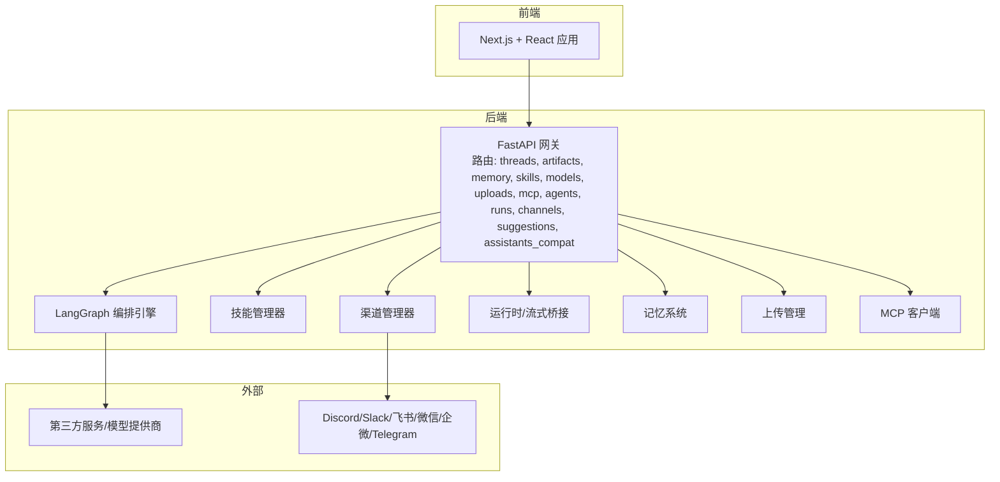
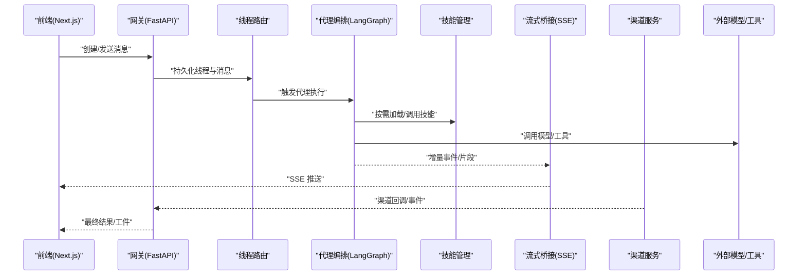
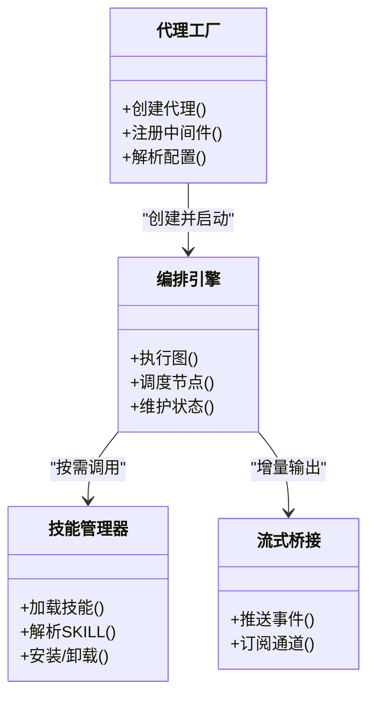
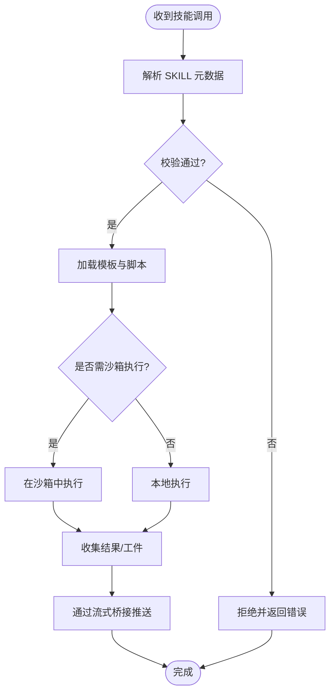
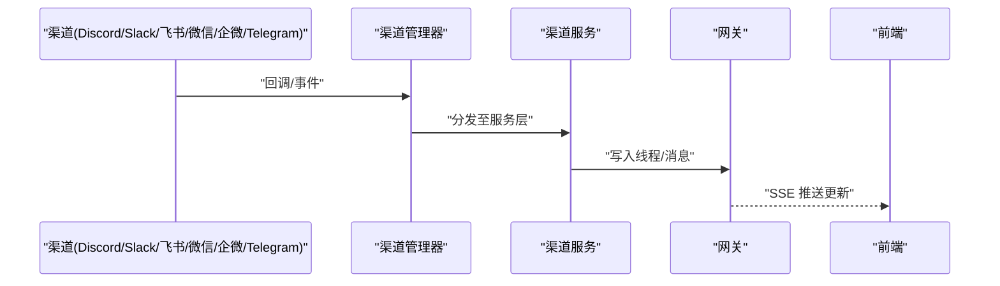
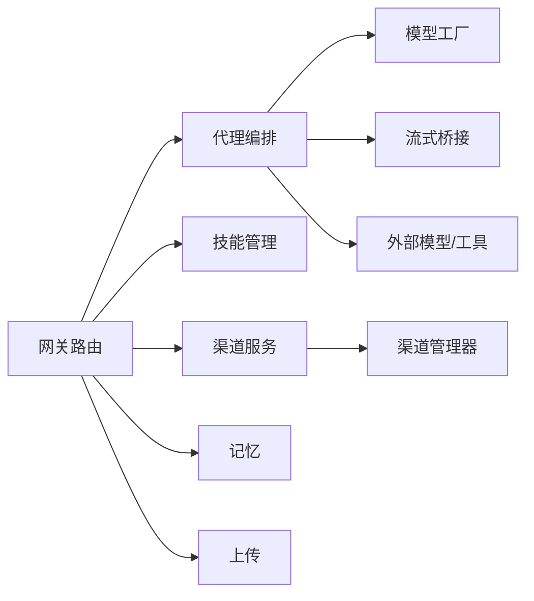

# 项目概述

<cite>
**本文引用的文件**   
- [README.md](file://README.md)
- [backend/README.md](file://backend/README.md)
- [frontend/README.md](file://frontend/README.md)
- [backend/app/gateway/app.py](file://backend/app/gateway/app.py)
- [backend/packages/harness/deerflow/agents/factory.py](file://backend/packages/harness/deerflow/agents/factory.py)
- [backend/packages/harness/deerflow/skills/manager.py](file://backend/packages/harness/deerflow/skills/manager.py)
- [backend/packages/harness/deerflow/runtime/stream_bridge/__init__.py](file://backend/packages/harness/deerflow/runtime/stream_bridge/__init__.py)
- [backend/app/channels/manager.py](file://backend/app/channels/manager.py)
- [backend/app/channels/service.py](file://backend/app/channels/service.py)
- [backend/app/gateway/routers/threads.py](file://backend/app/gateway/routers/threads.py)
- [backend/app/gateway/routers/artifacts.py](file://backend/app/gateway/routers/artifacts.py)
- [backend/app/gateway/routers/memory.py](file://backend/app/gateway/routers/memory.py)
- [backend/app/gateway/routers/skills.py](file://backend/app/gateway/routers/skills.py)
- [backend/app/gateway/routers/models.py](file://backend/app/gateway/routers/models.py)
- [backend/app/gateway/routers/uploads.py](file://backend/app/gateway/routers/uploads.py)
- [backend/app/gateway/routers/mcp.py](file://backend/app/gateway/routers/mcp.py)
- [backend/app/gateway/routers/agents.py](file://backend/app/gateway/routers/agents.py)
- [backend/app/gateway/routers/runs.py](file://backend/app/gateway/routers/runs.py)
- [backend/app/gateway/routers/thread_runs.py](file://backend/app/gateway/routers/thread_runs.py)
- [backend/app/gateway/routers/channels.py](file://backend/app/gateway/routers/channels.py)
- [backend/app/gateway/routers/suggestions.py](file://backend/app/gateway/routers/suggestions.py)
- [backend/app/gateway/routers/assistants_compat.py](file://backend/app/gateway/routers/assistants_compat.py)
- [backend/langgraph.json](file://backend/langgraph.json)
- [docker/docker-compose.yaml](file://docker/docker-compose.yaml)
- [scripts/setup_wizard.py](file://scripts/setup_wizard.py)
</cite>

## 目录
1. [简介](#简介)
2. [项目结构](#项目结构)
3. [核心组件](#核心组件)
4. [架构总览](#架构总览)
5. [详细组件分析](#详细组件分析)
6. [依赖关系分析](#依赖关系分析)
7. [性能考量](#性能考量)
8. [故障排查指南](#故障排查指南)
9. [结论](#结论)
10. [附录](#附录)

## 简介
DeerFlow 是一个面向 AI 代理执行的基础设施与工具平台，定位为“全栈应用框架”。它通过统一的网关 API、可编排的超级代理、多模式执行环境（本地/沙箱/容器）、可扩展的技能生态、长期记忆系统与多渠道集成能力，帮助开发者快速构建并交付具备复杂任务编排能力的智能体应用。

核心价值主张：
- 超级代理编排：以 LangGraph 为内核，提供可视化与可编程的 Agent 工作流编排能力。
- 多模式执行环境：支持本地、沙箱与容器化执行，兼顾安全隔离与灵活部署。
- 技能生态系统：标准化 SKILL 规范与安装器，便于社区共享与复用。
- 长期记忆系统：会话级与跨会话的记忆存储与检索，支撑持续对话与知识沉淀。
- 多渠道集成：统一接入 Discord、Slack、飞书、微信、企业微信、Telegram 等渠道。
- 全栈一体化：后端 FastAPI + LangGraph，前端 Next.js + React，开箱即用。

适用场景与目标用户：
- 需要构建复杂任务编排的智能体产品团队
- 希望将 LLM 能力工程化落地的研发与数据科学团队
- 需要多渠道发布与运营的智能客服、研究助手、内容生产流水线等

快速开始与在线演示：
- 快速开始：参见仓库根目录文档与脚本向导
- 在线演示：参见前端 README 中的演示入口说明

章节来源
- [README.md](file://README.md)
- [backend/README.md](file://backend/README.md)
- [frontend/README.md](file://frontend/README.md)

## 项目结构
DeerFlow 采用前后端分离的全栈结构：
- 后端 backend：基于 Python FastAPI 与 LangGraph，提供网关路由、Agent 编排、技能管理、记忆、上传、MCP 客户端、运行时桥接等能力。
- 前端 frontend：基于 Next.js + React，提供工作区、聊天、模型选择、设置、文档与博客等界面。
- docker：提供开发/生产编排与 Nginx 反向代理配置。
- scripts：包含初始化向导、部署脚本、诊断工具等。
- skills/public：官方公开技能集合，遵循 SKILL 规范。

```mermaid
graph TB
subgraph "前端"
FE["Next.js + React 应用"]
end
subgraph "后端"
GW["FastAPI 网关<br/>路由: threads, artifacts, memory, skills, models, uploads, mcp, agents, runs, channels, suggestions, assistants_compat"]
LG["LangGraph 编排引擎"]
SK["技能管理器"]
CH["渠道管理器"]
RT["运行时/流式桥接"]
MEM["记忆系统"]
UPL["上传管理"]
MCP["MCP 客户端"]
end
subgraph "外部"
EXT["第三方服务/模型提供商"]
CHS["Discord/Slack/飞书/微信/企微/Telegram"]
end
FE --> GW
GW --> LG
GW --> SK
GW --> CH
GW --> RT
GW --> MEM
GW --> UPL
GW --> MCP
LG --> EXT
CH --> CHS
```

图表来源
- [backend/app/gateway/app.py](file://backend/app/gateway/app.py)
- [backend/app/gateway/routers/threads.py](file://backend/app/gateway/routers/threads.py)
- [backend/app/gateway/routers/artifacts.py](file://backend/app/gateway/routers/artifacts.py)
- [backend/app/gateway/routers/memory.py](file://backend/app/gateway/routers/memory.py)
- [backend/app/gateway/routers/skills.py](file://backend/app/gateway/routers/skills.py)
- [backend/app/gateway/routers/models.py](file://backend/app/gateway/routers/models.py)
- [backend/app/gateway/routers/uploads.py](file://backend/app/gateway/routers/uploads.py)
- [backend/app/gateway/routers/mcp.py](file://backend/app/gateway/routers/mcp.py)
- [backend/app/gateway/routers/agents.py](file://backend/app/gateway/routers/agents.py)
- [backend/app/gateway/routers/runs.py](file://backend/app/gateway/routers/runs.py)
- [backend/app/gateway/routers/thread_runs.py](file://backend/app/gateway/routers/thread_runs.py)
- [backend/app/gateway/routers/channels.py](file://backend/app/gateway/routers/channels.py)
- [backend/app/gateway/routers/suggestions.py](file://backend/app/gateway/routers/suggestions.py)
- [backend/app/gateway/routers/assistants_compat.py](file://backend/app/gateway/routers/assistants_compat.py)
- [backend/packages/harness/deerflow/agents/factory.py](file://backend/packages/harness/deerflow/agents/factory.py)
- [backend/packages/harness/deerflow/skills/manager.py](file://backend/packages/harness/deerflow/skills/manager.py)
- [backend/app/channels/manager.py](file://backend/app/channels/manager.py)
- [backend/app/channels/service.py](file://backend/app/channels/service.py)
- [backend/packages/harness/deerflow/runtime/stream_bridge/__init__.py](file://backend/packages/harness/deerflow/runtime/stream_bridge/__init__.py)

章节来源
- [backend/app/gateway/app.py](file://backend/app/gateway/app.py)
- [docker/docker-compose.yaml](file://docker/docker-compose.yaml)

## 核心组件
- 网关与路由层：统一暴露 REST/SSE 接口，承载线程、运行、工件、记忆、技能、模型、上传、MCP、渠道、建议与兼容助手等能力。
- 超级代理编排：基于 LangGraph 的图状态机，负责节点调度、中间件链、子代理与工具调用。
- 技能生态：SKILL 定义、解析、校验、安装与生命周期管理，支持模板与脚本。
- 执行环境：本地、沙箱与容器化执行，提供安全边界与资源隔离。
- 记忆系统：会话上下文、长期记忆与检索，支持上传过滤与摘要。
- 渠道集成：消息总线与适配器，统一处理多平台消息收发与事件。
- 流式桥接：SSE 流式输出，保障实时交互体验。
- 模型工厂：多模型提供者抽象与凭据加载，屏蔽底层差异。

章节来源
- [backend/app/gateway/app.py](file://backend/app/gateway/app.py)
- [backend/packages/harness/deerflow/agents/factory.py](file://backend/packages/harness/deerflow/agents/factory.py)
- [backend/packages/harness/deerflow/skills/manager.py](file://backend/packages/harness/deerflow/skills/manager.py)
- [backend/packages/harness/deerflow/runtime/stream_bridge/__init__.py](file://backend/packages/harness/deerflow/runtime/stream_bridge/__init__.py)
- [backend/app/channels/manager.py](file://backend/app/channels/manager.py)
- [backend/app/channels/service.py](file://backend/app/channels/service.py)

## 架构总览
下图展示从前端到后端的端到端请求路径，以及关键子系统之间的协作关系。

```mermaid
sequenceDiagram
participant UI as "前端(Next.js)"
participant GW as "网关(FastAPI)"
participant TH as "线程路由"
participant AG as "代理编排(LangGraph)"
participant SK as "技能管理"
participant RT as "流式桥接(SSE)"
participant CH as "渠道服务"
participant EX as "外部模型/工具"
UI->>GW : "创建/发送消息"
GW->>TH : "持久化线程与消息"
TH->>AG : "触发代理执行"
AG->>SK : "按需加载/调用技能"
AG->>EX : "调用模型/工具"
AG-->>RT : "增量事件/片段"
RT-->>UI : "SSE 推送"
CH-->>GW : "渠道回调/事件"
GW-->>UI : "最终结果/工件"
```

图表来源
- [backend/app/gateway/routers/threads.py](file://backend/app/gateway/routers/threads.py)
- [backend/app/gateway/routers/artifacts.py](file://backend/app/gateway/routers/artifacts.py)
- [backend/packages/harness/deerflow/agents/factory.py](file://backend/packages/harness/deerflow/agents/factory.py)
- [backend/packages/harness/deerflow/skills/manager.py](file://backend/packages/harness/deerflow/skills/manager.py)
- [backend/packages/harness/deerflow/runtime/stream_bridge/__init__.py](file://backend/packages/harness/deerflow/runtime/stream_bridge/__init__.py)
- [backend/app/channels/service.py](file://backend/app/channels/service.py)

## 详细组件分析

### 网关与路由层
- 职责：统一对外暴露 API，组织业务路由，协调各子系统。
- 关键路由：
  - 线程与运行：threads、runs、thread_runs
  - 工件与记忆：artifacts、memory
  - 技能与模型：skills、models
  - 上传与 MCM：uploads、mcp
  - 渠道与建议：channels、suggestions
  - 兼容层：assistants_compat
- 设计要点：
  - 路由与依赖注入解耦，便于扩展与测试
  - SSE 流式响应贯穿执行链路，提升交互体验

章节来源
- [backend/app/gateway/app.py](file://backend/app/gateway/app.py)
- [backend/app/gateway/routers/threads.py](file://backend/app/gateway/routers/threads.py)
- [backend/app/gateway/routers/artifacts.py](file://backend/app/gateway/routers/artifacts.py)
- [backend/app/gateway/routers/memory.py](file://backend/app/gateway/routers/memory.py)
- [backend/app/gateway/routers/skills.py](file://backend/app/gateway/routers/skills.py)
- [backend/app/gateway/routers/models.py](file://backend/app/gateway/routers/models.py)
- [backend/app/gateway/routers/uploads.py](file://backend/app/gateway/routers/uploads.py)
- [backend/app/gateway/routers/mcp.py](file://backend/app/gateway/routers/mcp.py)
- [backend/app/gateway/routers/agents.py](file://backend/app/gateway/routers/agents.py)
- [backend/app/gateway/routers/runs.py](file://backend/app/gateway/routers/runs.py)
- [backend/app/gateway/routers/thread_runs.py](file://backend/app/gateway/routers/thread_runs.py)
- [backend/app/gateway/routers/channels.py](file://backend/app/gateway/routers/channels.py)
- [backend/app/gateway/routers/suggestions.py](file://backend/app/gateway/routers/suggestions.py)
- [backend/app/gateway/routers/assistants_compat.py](file://backend/app/gateway/routers/assistants_compat.py)

### 超级代理编排（LangGraph）
- 职责：定义与执行业务图，管理节点、边、状态与中间件。
- 关键点：
  - 使用 LangGraph 作为编排内核，支持条件分支、循环与重试
  - 通过工厂/注册表动态装配代理与中间件
  - 与技能、工具、子代理协同工作

```mermaid
classDiagram
class 代理工厂 {
+创建代理()
+注册中间件()
+解析配置()
}
class 编排引擎 {
+执行图()
+调度节点()
+维护状态()
}
class 技能管理器 {
+加载技能()
+解析SKILL()
+安装/卸载()
}
class 流式桥接 {
+推送事件()
+订阅通道()
}
代理工厂 --> 编排引擎 : "创建并启动"
编排引擎 --> 技能管理器 : "按需调用"
编排引擎 --> 流式桥接 : "增量输出"
```

图表来源
- [backend/packages/harness/deerflow/agents/factory.py](file://backend/packages/harness/deerflow/agents/factory.py)
- [backend/packages/harness/deerflow/skills/manager.py](file://backend/packages/harness/deerflow/skills/manager.py)
- [backend/packages/harness/deerflow/runtime/stream_bridge/__init__.py](file://backend/packages/harness/deerflow/runtime/stream_bridge/__init__.py)
- [backend/langgraph.json](file://backend/langgraph.json)

章节来源
- [backend/packages/harness/deerflow/agents/factory.py](file://backend/packages/harness/deerflow/agents/factory.py)
- [backend/langgraph.json](file://backend/langgraph.json)

### 技能生态系统
- 职责：定义、解析、校验、安装与管理 SKILL，提供模板与脚本执行能力。
- 关键点：
  - SKILL 元数据与模板驱动，支持多语言与多平台
  - 安装器与安全扫描，确保可插拔与可控风险
  - 与工具/子代理/沙箱联动，形成完整执行闭环

```mermaid
flowchart TD
Start(["收到技能调用"]) --> Parse["解析 SKILL 元数据"]
Parse --> Validate{"校验通过?"}
Validate -- "否" --> Reject["拒绝并返回错误"]
Validate -- "是" --> Load["加载模板与脚本"]
Load --> Sandbox{"是否需沙箱执行?"}
Sandbox -- "是" --> ExecInSandbox["在沙箱中执行"]
Sandbox -- "否" --> ExecLocal["本地执行"]
ExecInSandbox --> Result["收集结果/工件"]
ExecLocal --> Result
Result --> Stream["通过流式桥接推送"]
Stream --> End(["完成"])
Reject --> End
```

图表来源
- [backend/packages/harness/deerflow/skills/manager.py](file://backend/packages/harness/deerflow/skills/manager.py)

章节来源
- [backend/packages/harness/deerflow/skills/manager.py](file://backend/packages/harness/deerflow/skills/manager.py)

### 多渠道集成
- 职责：统一接入多种消息渠道，提供消息收发、事件回调与状态同步。
- 关键点：
  - 渠道管理器负责注册、发现与路由
  - 服务层封装通用逻辑，具体渠道实现差异化适配
  - 与网关路由对接，使前端与渠道侧一致体验

```mermaid
sequenceDiagram
participant C as "渠道(Discord/Slack/飞书/微信/企微/Telegram)"
participant CM as "渠道管理器"
participant CS as "渠道服务"
participant GW as "网关"
participant UI as "前端"
C->>CM : "回调/事件"
CM->>CS : "分发至服务层"
CS->>GW : "写入线程/消息"
GW-->>UI : "SSE 推送更新"
```

图表来源
- [backend/app/channels/manager.py](file://backend/app/channels/manager.py)
- [backend/app/channels/service.py](file://backend/app/channels/service.py)
- [backend/app/gateway/routers/channels.py](file://backend/app/gateway/routers/channels.py)

章节来源
- [backend/app/channels/manager.py](file://backend/app/channels/manager.py)
- [backend/app/channels/service.py](file://backend/app/channels/service.py)
- [backend/app/gateway/routers/channels.py](file://backend/app/gateway/routers/channels.py)

### 记忆系统与上传
- 记忆：会话上下文、长期记忆、检索与摘要，支撑连续对话与知识沉淀。
- 上传：文件/图片等多模态输入，提供格式转换、大小限制与安全检查。
- 路由：memory、uploads 提供统一接口，供前端与渠道侧调用。

章节来源
- [backend/app/gateway/routers/memory.py](file://backend/app/gateway/routers/memory.py)
- [backend/app/gateway/routers/uploads.py](file://backend/app/gateway/routers/uploads.py)

### 模型工厂与 MCP 客户端
- 模型工厂：抽象多模型提供者，集中管理凭据与计费策略。
- MCP 客户端：统一管理外部模型/工具协议，简化集成复杂度。

章节来源
- [backend/app/gateway/routers/models.py](file://backend/app/gateway/routers/models.py)
- [backend/app/gateway/routers/mcp.py](file://backend/app/gateway/routers/mcp.py)

## 依赖关系分析
- 内部依赖：
  - 网关路由依赖代理编排、技能管理、渠道服务、记忆与上传模块
  - 代理编排依赖模型工厂与流式桥接
  - 渠道服务依赖渠道管理器
- 外部依赖：
  - LangGraph 作为编排内核
  - 第三方模型与服务提供商
  - 各消息渠道平台

```mermaid
graph LR
GW["网关路由"] --> AG["代理编排"]
GW --> SK["技能管理"]
GW --> CH["渠道服务"]
GW --> MEM["记忆"]
GW --> UPL["上传"]
AG --> MF["模型工厂"]
AG --> SB["流式桥接"]
CH --> CM["渠道管理器"]
AG --> EXT["外部模型/工具"]
```

图表来源
- [backend/app/gateway/app.py](file://backend/app/gateway/app.py)
- [backend/packages/harness/deerflow/agents/factory.py](file://backend/packages/harness/deerflow/agents/factory.py)
- [backend/packages/harness/deerflow/skills/manager.py](file://backend/packages/harness/deerflow/skills/manager.py)
- [backend/app/channels/manager.py](file://backend/app/channels/manager.py)
- [backend/app/channels/service.py](file://backend/app/channels/service.py)
- [backend/packages/harness/deerflow/runtime/stream_bridge/__init__.py](file://backend/packages/harness/deerflow/runtime/stream_bridge/__init__.py)

章节来源
- [backend/app/gateway/app.py](file://backend/app/gateway/app.py)
- [backend/packages/harness/deerflow/agents/factory.py](file://backend/packages/harness/deerflow/agents/factory.py)
- [backend/packages/harness/deerflow/skills/manager.py](file://backend/packages/harness/deerflow/skills/manager.py)
- [backend/app/channels/manager.py](file://backend/app/channels/manager.py)
- [backend/app/channels/service.py](file://backend/app/channels/service.py)
- [backend/packages/harness/deerflow/runtime/stream_bridge/__init__.py](file://backend/packages/harness/deerflow/runtime/stream_bridge/__init__.py)

## 性能考量
- 流式输出：通过 SSE 减少首字节延迟，提升交互体验。
- 并发与异步：网关与渠道回调采用异步处理，提高吞吐。
- 资源隔离：沙箱/容器化执行避免相互干扰，增强稳定性。
- 缓存与索引：对频繁访问的记忆与工件进行缓存优化。
- 限流与降级：对上游模型与工具调用实施限流与容错策略。

[本节为通用指导，不直接分析具体文件]

## 故障排查指南
- 常见问题定位：
  - 网关路由异常：检查路由注册与依赖注入
  - 代理执行失败：查看 LangGraph 日志与中间件链
  - 渠道回调丢失：核对渠道签名与回调地址
  - 上传失败：确认文件大小、类型与安全扫描结果
- 诊断工具：
  - 使用脚本向导与诊断工具辅助环境检查与问题定位
  - 利用 Docker Compose 一键拉起依赖服务，复现问题

章节来源
- [scripts/setup_wizard.py](file://scripts/setup_wizard.py)
- [docker/docker-compose.yaml](file://docker/docker-compose.yaml)

## 结论
DeerFlow 以 LangGraph 为核心编排引擎，结合 FastAPI 网关与 Next.js 前端，构建了覆盖“编排—执行—记忆—技能—渠道—流式输出”的完整闭环。其模块化设计与开放生态，使得团队能够快速搭建高可用、可扩展的 AI 代理应用，并在多渠道环境中稳定交付价值。

[本节为总结性内容，不直接分析具体文件]

## 附录
- 快速开始：参考仓库根目录文档与脚本向导
- 在线演示：参考前端 README 中的演示入口说明
- 部署参考：参考 docker 编排与 Nginx 配置

章节来源
- [README.md](file://README.md)
- [frontend/README.md](file://frontend/README.md)
- [docker/docker-compose.yaml](file://docker/docker-compose.yaml)