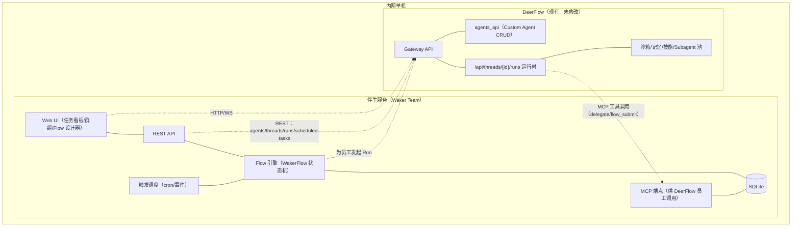
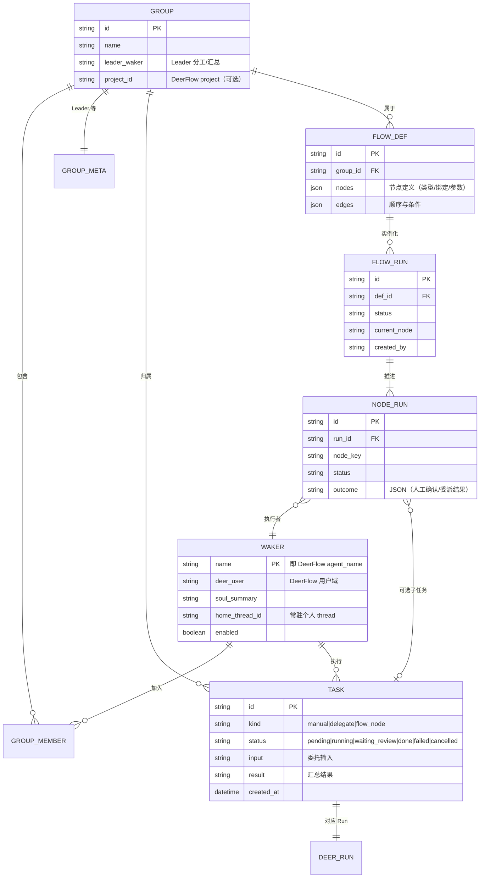
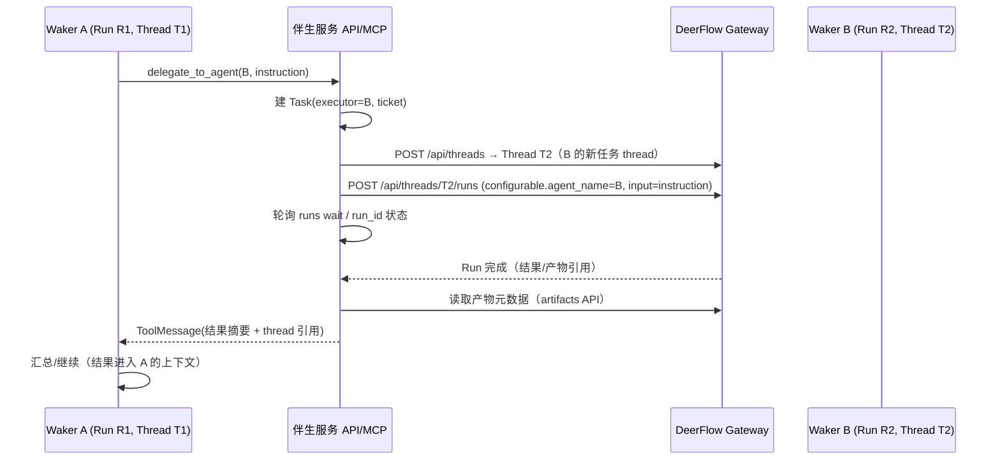

# DeerFlow 数字员工团队（Waker Team）伴生服务架构设计

> 状态：草稿 v0.2（评审修订：身份/隔离策略、async 委派自建、失控防护与超时语义）
> 日期：2026-09-09
> 范围：在 DeerFlow 之上构建"多个长期在线的平级数字员工像同事一样组队"能力的**独立伴生服务**设计。
> 关键词：数字员工 / Group / Leader 分工 / WakerFlow / 非侵入扩展

## 1. 背景与目标

### 1.1 业务目标

客户内网环境中，需要一组"数字员工"（Waker）长期在线、以平级同事方式组队协作：

- 每个 Waker 有独立岗位、人设（SOUL）、能力（工具/技能/模型）与记忆；
- 一个团队（Group）由多个 Waker 组成，可指定 **Leader 负责分工与汇总**；
- 支持把稳定协作流程固化为 **WakerFlow**（多阶段、可含人工确认节点、可重跑）；
- 所有操作通过 **Web UI** 完成，统一任务看板跟踪"谁在干什么、结果如何"。

### 1.2 设计约束

| 约束 | 说明 |
|------|------|
| 内网部署 | 客户环境为内网，**不接入任何外部 IM**（飞书/Slack 等均不可用） |
| 不侵入 DeerFlow | 不改 DeerFlow 主代码库一行代码；以"独立伴生服务 + 公开 API/MCP 契约"方式集成 |
| 复用现有运行时 | 员工执行复用 DeerFlow 的 Custom Agent + Lead Agent 运行时（沙箱/记忆/技能/子智能体池） |
| 部署形态 | 与 DeerFlow Gateway 同机（或同内网）独立进程/容器；单机 SQLite 起步 |

### 1.3 非目标（本期不做）

- 不实现员工间"自由聊天"会话（无 IM；员工间交互统一走**委派任务**语义）；
- 不实现 DeerFlow 内部改造（如给 Custom Agent 加互相调用工具）——如 MCP 方案验证不足，降级/插件化路径见 §4.7；
- 不实现员工 UI 皮肤/拟人化、语音等。

## 2. 概念模型与 DeerFlow 映射

| 伴生服务概念 | 含义 | DeerFlow 侧落点 | 依据 |
|-------------|------|----------------|------|
| **Waker（员工）** | 有岗位/人设/能力边界的长期角色 | Custom Agent（`agents/{name}/`：config.yaml + SOUL.md），经 agents_api CRUD 管理 | agents.py 路由集 |
| **Waker 工作空间** | 员工个人项目会话 | DeerFlow Thread（每员工 1 个常驻 thread + 按任务开新 thread） | threads.py `POST /api/threads` |
| **执行引擎** | 员工"想+做"的运行时 | `lead_agent` graph + `configurable.agent_name=<name>` 注入 | services.py:618-622, 806-809 |
| **Group（团队）** | 员工集合 + Leader + 共享项目目录 | 伴生服务自有表；共享文件落 DeerFlow Project（`project_id`） | threads.py:451 project_id |
| **Task（任务）** | 一次委派/一次执行的单元 | 一个 Run（`POST /api/threads/{tid}/runs`）或一个 WakerFlow 运行实例 | thread_runs.py:925 |
| **WakerFlow** | 多阶段协作流程（定义 + 运行实例） | 伴生服务 Flow 引擎；每个节点内部=一个员工 Run | 自研 |
| **员工间委派** | A 让 B 干活并回收结果 | 伴生服务暴露 **HTTP MCP server**，员工经 `delegate_to_agent`（sync）/`delegate_submit`（async）等 MCP 工具调用；async 由引擎盯 Run + 唤醒 run 投递 | extensions_config.json mcpServers（headers_from_context 请求级鉴权，§4.5） |
| **任务看板** | 跨员工/跨流程统一状态 | 伴生服务自研 Web UI（聚合 run/flow 状态） | 自研 |

> 关键语义：DeerFlow 侧**没有"员工"实体**，只有"Custom Agent（角色定义）"与"Run（一次执行）"。员工的"在线"体现为：伴生服务随时可以为其发起 Run（请求驱动）；"长期"体现为：员工拥有**常驻 thread**（个人工作台，跨任务保留上下文），而非常驻进程。是否引入主动心跳型"自主值守"见 §5.6。

## 3. 总体架构



**组件职责边界：**

- **伴生服务**：只做"编排与人"，不做"干活"。干活的模型调用、工具执行、文件操作全在 DeerFlow 侧完成；
- **DeerFlow**：只做"执行"。它不知道群组/流程的存在——员工在 Run 中通过 MCP 工具感知"团队"。

### 3.1 系统边界与信任模型

**1. 进程/部署边界**：伴生服务与 DeerFlow 栈是两个独立进程群，仅经 HTTP 通信（伴生服务→DeerFlow REST；员工 Run→伴生服务 MCP 端点）。无进程内调用、无共享数据库；DeerFlow 侧 DB/SQLite 不被触碰。

**2. 职责边界（编排 vs 执行，铁律）**：

| 面 | 伴生服务（决策与记账） | DeerFlow（干活） |
|---|---|---|
| 管 | 员工注册表/群组/任务生命周期/Flow 状态机/人工确认/看板/调度触发/委派记录 | — |
| 干 | **绝不替 agent 执行动作**（不发模型调用、不写 thread 状态） | 模型调用/工具执行/文件写/技能/记忆/沙箱 |

**3. 数据边界（数据主权）**：

| 数据 | 归属 | 规则 |
|---|---|---|
| 员工定义（name/model/skills/soul…） | DeerFlow agents 存储 | 运行时只认它；伴生服务经 agents_api 读写 |
| 员工附加属性（岗位/团队角色/状态） | 伴生服务 WAKER 表 | agents_api 无此语义，不入 DeerFlow |
| 对话/产物/记忆/run 历史 | DeerFlow（thread/artifacts） | 伴生服务**只存引用**（thread_id/run_id），不复制全文；记忆：per-agent facts 按 `agent_name` 独立，单域共享 user 下用户级全局摘要是组共享层（§4.6） |
| 任务/群组/Flow 定义与实例 | 伴生服务 DB | 编排事实源 |
| 任务结果 | 摘要进 TASK.result，全文留 thread 产物 | 引用 + 摘要，不膨胀 |
| 敏感凭据 | 模型 key 留 DeerFlow .env；伴生服务自持内部 token | 不交叉存放 |

**4. 信任/身份边界**：伴生服务 = DeerFlow 的可信调用方（内网服务账号/loopback）；员工 = 伴生服务的执行代理——员工调 MCP 工具时，伴生服务经 `config.context.secrets → context-headers` 原生机制确认"调用者=哪个员工+哪个 thread"，**信任来自伴生服务写入的载体而非模型自报**；Web UI 操作者只经伴生服务会话，不直接触 DeerFlow；文件安全边界归 DeerFlow 沙箱，伴生服务不持沙箱权限。**MCP 鉴权统一性**：所有协作工具均在 run 内调用并携带 `headers_from_context` 请求级身份（§4.5），无 run 外回调凭据；工具侧校验 `group_id` 归属，防跨组探测/越权委派（风险 #1）。

**5. 代码/扩展边界**：DeerFlow 侧零代码修改（唯一扩展面 = `extensions_config.json` 注册伴生服务 MCP server）；伴生服务为独立代码库，只依赖 DeerFlow 公开 API 契约（附录 A），不 import 任何 `deerflow.*` 内部包；DeerFlow 升级以契约复查 + 冒烟脚本兜底。

**6. 状态/一致性边界**：两个事实源——DeerFlow run（执行）与伴生服务 TASK/FLOW_RUN（编排）；对账 = 轮询 `GET /runs/{id}` + `Idempotency-Key` 幂等重发；遵守 DeerFlow"同 thread run 串行"约束（一任务一 thread）。

**7. 时间边界**：Web UI↔伴生服务即时；伴生服务→DeerFlow run 分钟级异步（wait/轮询）；员工间 delegate sync 阻塞受传输超时约束，超长转 Flow 异步节点；cron 由伴生服务统一管，不依赖 DeerFlow scheduler。

## 4. DeerFlow 集成契约（代码核查结论）

以下契约均已在当前代码库核实（详见附录 A），作为伴生服务开发依据：

### 4.1 员工生命周期（agents_api）

| 操作 | 接口 | 说明 |
|------|------|------|
| 检查可用名 | `GET /api/agents/{name}/availability` | create 冲突规则：file/db per-user |
| 创建/更新 | `POST/PUT /api/agents/{name}` | config（模型/工具/技能等）+ SOUL.md |
| 查询 | `GET /api/agents`、`GET /api/agents/{name}` | 列表/详情 |
| 删除 | `DELETE /api/agents/{name}` | — |

启用条件：`config.yaml -> agents_api.enabled: true`（本地已启用）。

#### 4.1.1 Waker 可视化创建（表单 → API 映射）

Waker-team 员工创建/编辑向导直接消费 agents_api，表单字段与 `AgentCreateRequest`（agents.py:60-72）一一映射：

| Waker 向导表单 | API 字段 | 说明 / 数据源 |
|---|---|---|
| 员工名 | `name` | 正则 `^[A-Za-z0-9-]+$`，小写存储；创建后不可改名（走删除重建） |
| 一句话岗位说明 | `description` | 列表页/看板展示 |
| 人设与行为边界 | `soul` | SOUL.md 内容（Markdown 编辑） |
| 模型 | `model` | 下拉，数据源 DeerFlow 模型清单（本地 MiMo v2.5 等） |
| 采样参数 | `model_settings` | temperature / max_tokens |
| 工具组白名单 | `tool_groups` | 多选，数据源 config tool_groups（web/file:read/…/browser/knowledge） |
| 技能白名单 | `skills` | None=全部启用、[]=禁用 |
| 可指挥的子智能体 | `allowed_subagents` | None=全部、[]=禁用（Leader 员工建议显式白名单） |
| 思考模式 | `thinking_enabled` / `reasoning_effort` | 默认跟随运行时 |

要点：
- **员工附加属性（岗位/团队角色/协作偏好/值班计划）不入 agents_api**——存伴生服务 WAKER 表，DeerFlow agent 目录只保留原生语义；
- 编辑走 PUT（全量重写）；删除前须在伴生服务侧检查无进行中 TASK/FLOW_RUN 引用；
- 枚举数据源（模型/工具组/技能清单）的实际端点 P0 用 curl 冒烟锁定。

#### 4.1.2 员工能力隔离机制（逐员工独立配置的依据）

每个 Waker 是独立的 Custom Agent 实例，能力画像各维度均 per-agent 独立存储于各自 config.yaml：

| 能力维度 | 配置位 | 隔离语义 |
|---|---|---|
| 模型 | `model` / `model_settings` | 独立 override |
| 工具 | `tool_groups` | 独立白名单 |
| 技能 | `skills` | 独立白名单（见下） |
| 子员工 | `allowed_subagents` | 独立"可指挥集" |
| 人设/边界 | `soul` | SOUL.md 独立 |

**技能独立配置的三层机制（代码证据）**：
1. **存储层**：技能本体在共享技能池（PUBLIC 全局 / per-user CUSTOM，`UserScopedSkillStorage`），无需 per-agent 复制；
2. **白名单层**：`agent_config.skills` 决定可用集（None=全局全部、[]=禁用、列表=精确子集）；装配时 `_available_skill_names` + `_load_enabled_available_skills` 只加载白名单内技能（lead_agent/agent.py:735-754）；
3. **强制层**：同一 allowlist 由运行时策略解析器强制——`describe_skill`/技能激活**不能暴露或启用**白名单外技能（agent.py:1106-1108），隔离在系统提示注入与工具策略两层执行，不依赖模型自觉。

**对 Waker-team 的落地含义**：
- "员工私有技能" = 技能入池 + 仅该员工白名单包含：其他员工在技能索引层即不可见，无泄露面、无需复制目录；
- **双重收窄**：技能自身声明的 allowed-tools（`filter_tools_by_skill_allowed_tools`）× 员工 `tool_groups` 白名单；
- 员工编辑页"技能"多选即写 `skills` 字段（PUT），技能池枚举来自技能 API——伴生服务无需另建权限模型；
- 注意：白名单是"激活/可见"边界而非物理拷贝——删除员工不影响技能池本身。

### 4.2 员工执行（runs API，核心）

```
POST /api/threads/{thread_id}/runs
body: { assistant_id, input, context?, configurable? , ... }
```

- **指派员工**：`configurable.agent_name=<waker_name>` 或 `context.agent_name=<waker_name>`（显式值时优先于 assistant 默认）；Custom Agent 实现为 `lead_agent` + `agent_name` 注入（services.py:618-622）；
- **输入**：`input.messages=[{role:"user",content:...}]`；
- **同步等待**：`POST /api/threads/{thread_id}/runs/wait`；
- **SSE 流式**：`POST /api/threads/{thread_id}/runs/stream`（前端对话型任务用）；
- **生命周期**：`GET/POST .../runs/{run_id}/cancel`、`GET .../runs/{run_id}/join`（断线重连）、`GET .../runs/{run_id}` 状态查询；
- **并发约束**：同一 Thread 的 Run 串行执行；**员工并行 = 分属不同 Thread**（伴生服务为每个任务建独立 Thread，任务间天然并行）。

### 4.3 会话与项目

- `POST /api/threads` 创建（可指定 `thread_id`/`assistant_id`/`project_id`/`metadata`）；
- `POST /api/threads/search`、`GET /api/threads/{id}`；
- Project（thread 归属/共享目录）由 DeerFlow 新项目功能支持，伴生服务 P1 起复用为"组共享空间"。

### 4.4 定时触发

`/api/scheduled-tasks` CRUD + `pause/resume/trigger`；任务体支持 `assistant_id`（scheduler service 已透传）。**选择：自主触发统一由伴生服务调度器实现**（避免依赖 DeerFlow scheduler 常开与权限面），但保留"直接调 DeerFlow scheduled-tasks"作为可选旁路（附录 B）。

### 4.5 员工感知团队（MCP 扩展通道，零侵入关键）

DeerFlow 通过 `extensions_config.json -> mcpServers` 支持 **HTTP MCP server**（type=http），并支持 `headers_from_context`：把 run 请求 `config.context.secrets` 携带的值映射为调用侧 HTTP header——这是伴生服务识别"调用者=哪个员工+哪个 thread"的原生通道，fail-closed（缺失即拒绝）。伴生服务以 MCP server 身份注册，向所有员工暴露团队协作工具：

```
mcpServers.waker-team:
  type: http
  url: http://127.0.0.1:PORT/mcp     # 伴生服务 MCP 端点
  headers_from_context:              # 请求级身份：每次 run 由伴生服务注入 secrets
    headers: { "X-Waker-Caller": "waker_identity" }
    on_missing: deny
  # 注：tool_call_timeout 仅对 stdio transport 生效（http 被忽略，tools.py:939 warning）；
  # HTTP 工具调用等待由 SDK/传输层默认决定，M0 S2 实测 ≥65s——sync 委派上限取 60s 安全（§5.4）
```

员工 Run 内即可调用（工具经 Guardrail/授权中间件管控，与内置工具同权）。

> **关于 `task_toolsets`（上游"提交式长任务"契约）**：本期 async 委派**不采用**该机制。代码已核实其硬性约束：配置了 `task_toolsets` 就必须 `mcp_tasks.enabled=true` + SQL 数据库后端（memory backend 直接拒绝），否则 Gateway **启动即失败**；task-enabled server 配置在 Gateway 启动时**冻结**（运行期改动必须重启）；且 status/cancel 轮询在 run 结束后以 server 静态凭据运行（与请求级鉴权不对称），唤醒行为为黑盒。async 委派由伴生服务自建实现（§5.4），`task_toolsets` 仅保留为将来对接**外部**长任务 MCP server 的可选机制（启用条件见附录 A）。

### 4.6 身份、隔离与认证（内网）

**身份映射策略（v1 既定）**：**单域 = 一个 DeerFlow 服务账号（user）**，所有 Waker 以 `agent_name` 为主隔离键。代码已核实该模型下各维度的隔离/共享边界：

| 维度 | DeerFlow 侧机制（代码依据） | v1 语义 |
|---|---|---|
| 记忆（per-agent facts） | `(user_id, agent_name)` 双键桶，facts 落 `agents/{name}/` | 每员工私有 ✓ |
| 记忆（用户级全局摘要） | user 桶根 `memory.json`，同 user 全 agent 共享 | 单域内定性为**组共享记忆层**（SOUL 协作规则模板与 UI 如实注明，§5.4.2 ①） |
| 技能 | per-user 技能池 + per-agent `skills` 白名单（§4.1.2 三层机制） | 池共享、可见性按白名单 ✓ |
| 工具/MCP | MCP 全局注册（无 per-agent 配置位）；`tool_groups` per-agent 白名单；内置授权按 `Principal(user_id, role)` 过滤、**不含 agent_name** | v1 协作工具组内可见 + 敏感工具 `tool_groups`/Guardrail 兜底（§5.9 机制①） |

`WAKER.deer_user` 字段保留（= 所属 DeerFlow 域/账号），当前固定为单域服务账号。**多域/多租户强隔离为升级路径**：每 Waker 独立 user/role，配合 DeerFlow internal-auth 通道与 RBAC 按 role 过滤 MCP 工具（风险 #10）。

**认证方案（已定：服务账号）**：伴生服务以**专属服务账号**（本地邮箱/密码账号）身份调用 Gateway：
- 程序化登录：首次/会话过期时以服务账号邮箱+密码换 session cookie，之后所有请求携带 cookie + CSRF 头（P0 冒烟锁定各路由对 CSRF 的要求与豁免面，风险 #4）；
- 服务账号凭据经环境变量注入伴生服务配置，不入库、不进日志；会话刷新/自动重登由 DeerFlow 客户端封装处理；
- 所有 Waker 的 agents/threads/runs 均落该账号名下——即上表"单域单账号"策略的用户侧落点（M0 S1 实测：普通 user 角色即可 agents/threads 全量 CRUD，服务账号无需 admin）；
- **DeerFlow `auth` 关闭模式仅作本地开发备选**（auth-off 下全部请求落单一 `AUTH_DISABLED_USER_ID`，无隔离、无审计，不进入交付形态）；
- 多租户/多域未来经每 Waker 独立账号 + RBAC 或 DeerFlow 管理 API token 扩展（升级路径）。

### 4.7 插件化/模块化扩展策略（非侵入承诺的落地方式）

若后续发现必须"改 DeerFlow"，按层优先（从零代码到社区贡献）：

| 层 | 载体 | 改动量 | 用途 |
|---|---|---|---|
| 层 0 | `extensions_config.json` 注册 HTTP MCP server（普通工具 + `headers_from_context`；`task_toolsets` 仅作外部长任务可选机制） | **0 行代码** | 协作工具注入（delegate/query_group/flow_submit）——P0-P2 全量依赖此层 |
| 层 1 | 技能系统（SKILL.md）+ config 工具/白名单 | 0 行代码 | 协作方法沉淀为 Skill，按员工白名单分发 |
| 层 2 | `deerflow-extension-api` 扩展包（config `plugins:` 列表加载，PEP 621） | 独立包 | 生命周期/模型调用观察（上游 #4684）；"注册新工具"能力面 P0 冒烟验证 |
| 层 3 | 向 bytedance/deer-flow 提交 PR | 社区贡献 | 核心能力缺口（如内建 A2A adapter）时走上游，随主版本升级 |

原则：**不 fork 主仓库**；"需要改 DeerFlow"的诉求先降级到层 0/1 重新评估；本地仅通过 `config.yaml plugins:` / `extensions_config.json` 装配。

## 5. 伴生服务设计

### 5.1 服务结构

```
waker-team/                      # 独立仓库/目录（Python 3.12 + FastAPI）
├── app/
│   ├── api/                     # REST：groups/wakers/tasks/flows/board
│   ├── mcp/                     # MCP 端点：delegate_to_agent / query_group / flow_submit / flow_status / flow_cancel
│   ├── engine/                  # WakerFlow 状态机、节点执行器、重试/恢复
│   ├── scheduler/               # cron/事件触发 → 建任务
│   ├── deerflow/                # DeerFlow 客户端封装（agents/threads/runs/artifacts 调用 + 认证）
│   ├── models/                  # SQLAlchemy：waker/group/task/flow_def/flow_run/node_run/artifact_ref
│   └── web/                     # 静态资源（前端构建产物）
├── frontend/                    # Web UI（React + Vite，内网可离线构建）
└── deploy/                      # docker-compose / systemd
```

### 5.2 数据模型



### 5.3 对外 REST API 概要（Web UI 消费）

| 域 | 端点 | 说明 |
|----|------|------|
| Waker | `GET/POST /api/wakers`、`GET/PUT/DELETE /api/wakers/{name}` | 底层映射 agents_api；同步 SOUL 摘要 |
| Group | `GET/POST /api/groups`、`GET/PUT/DELETE /api/groups/{id}` | 成员 + Leader 设置 |
| Task | `POST /api/groups/{id}/tasks`（派活：指定执行者/输入）、`GET /api/tasks?status=`、`POST /api/tasks/{id}/retry/cancel` | 看板数据源 |
| WakerFlow | `GET/POST /api/groups/{id}/flows`（定义）、`POST /api/groups/{id}/flows/{fid}/runs`（启动）、`GET /api/flow-runs/{id}`（实例+节点明细）、`POST /api/flow-runs/{id}/review`（人工确认通过/打回） | 定义与实例分离 |
| Board | `GET /api/board?group=&status=&waker=&type=` | 跨 run/flow 聚合（详设 §5.8） |

### 5.4 员工协作机制（核心设计：delegate 语义）

员工 A（Run 中）需要 B 协助时，调用 MCP 工具：

```
delegate_to_agent(
  group_id,          # 必须在同一 Group
  target_agent,      # 目标 Waker 名
  instruction,       # 委派指令（B 的输入）
  accept_criteria?,  # 期望交付标准（如文件路径/要点）
  sync=True,         # sync: 阻塞等 B 完成；async: 立即返回 ticket
) -> { ticket_id | result, run_id, thread_id }
```

**执行链（sync 示例）**：



要点：
- **每个委派 = 独立 Thread + 独立 Run**，天然隔离并行；B 的常驻 thread 用于"个人工作台"上下文；委派线程生命周期由引擎管理（async 发起线程需保留至唤醒 run，见下）；
- **sync 委派上限受 DeerFlow MCP `tool_call_timeout` 硬约束**（默认 60s）：sync 上限必须 ≤ 该 server 配置的 `tool_call_timeout`（§4.5 已调大），仅适合秒级协作；**分钟级任务默认 async + 唤醒 run**，不依赖 run 内长阻塞；超长流程走 **WakerFlow**（异步节点，见 5.5）；
- A 的上下文只见"结果摘要 + 引用"，不膨胀（结果全文放 thread 产物/文件，摘要进消息）；
- **async 委派（伴生服务自建，不依赖 `task_toolsets`）**：A 在 run 内调 `delegate_submit(target, instruction) → ticket` 后结束本次 run；伴生服务引擎经既有 10s run 轮询通道（与看板同步同通道）盯 B 的 run；B 完成后引擎在 A 的发起 thread 上**发起唤醒 run**（`configurable.agent_name=A`，结果摘要 + 引用注入 input），A 醒来汇总。唤醒 run 的输入由引擎构造、可审计；投递失败（串行排队超时/run 失败）→ TASK 置 `failed(delivery_failed)`，看板一键重试唤醒。`delegate_status/cancel` 供 run 内或唤醒 run 中查询/取消 ticket（普通 MCP 工具，非 DeerFlow 轮询器契约）。

#### 5.4.1 协作协议边界与 A2A 适配层（预留）

按协作对象选择协议：

| 协作对象 | 机制 | 说明 |
|---|---|---|
| 组内员工（同构） | 伴生服务内部委托（§5.4 MCP 工具面 + Flow 引擎） | MVP 唯一需要的路径 |
| 外部 ACP agent | DeerFlow 原生 `invoke_acp_agent_tool` | 已核实内置（tools/builtins/），零开发 |
| 异构外部 agent（未来） | **A2A 适配层（预留，实现在伴生服务侧）** | 见下 |

**关于 A2A 的判断**：
- A2A（Agent2Agent）是 agent↔agent 互操作开放标准（HTTP JSON-RPC + AgentCard 能力发现 + task 生命周期）；2026 年 v1.0 生产就绪，由 Linux Foundation AAIF 治理（与 MCP 同框架），150+ 组织采用，ACP 生态已宣布并入 A2A 方向；DeerFlow 代码库当前**无 A2A 引用**。
- **组内协作不引入 A2A**：同构系统无跨实现边界；A2A 只提供 task 级语义，承载不了 WakerFlow 的流程编排（human_review/重跑/分支）；内部委托协议更简单且全程可审计。
- **预留适配层设计**：伴生服务可选实现 A2A 网关——为每个 Waker 发布 AgentCard（能力=岗位描述），外部 A2A client 的 task.send → 内部 runs API（`configurable.agent_name`），结果/SSE 流回传；将来接入其他 DeerFlow 实例、异构"外部同事"或客户标准要求时启用，对员工透明（`delegate_to_agent` 目标解析增加 external 分支即可）。

#### 5.4.2 团队感知与执行分离（感知层设计）

纯 MCP pull 感知存在效率短板：员工不调 `query_group` 就不知道团队构成，导致"不知道该找谁/何时找"的盲调。改进为**感知/执行分离**：

**感知层（把"知道"前置，零新机制）**：
1. **SOUL 协作规则模板**：创建员工时注入静态协作规则（我是谁/组内同事与职责/何时应委派/如何写委派指令/何时回报/红线）——一次写入、长期生效（§4.1.1 A1 落地）；
2. **Team Briefing（run 级动态注入）**：伴生服务作为 run 发起方，在每次派活/委派的 input 首条消息附带任务上下文 + 当前团队快照（可协作成员、忙闲标记、本次协作要求）。代码依据：`apply_prompt_template` 无 run 级自由文本注入通道、`context` 仅承载结构化键（user_id/agent_name/secrets），**input 消息是现成且完全可控的动态注入位**；任务 thread 生命周期由引擎管理（async 委派线程需保留至唤醒 run，§5.4），被压缩裁剪的风险 P0 实测（异常则降级为快照写入 group 共享文件、员工按需读取）。

**执行层（把"动作"收敛为 MCP）**：
3. MCP 工具只承担执行：`delegate_to_agent` / `delegate_submit|status|cancel` / `notify_human`；`query_group` 降级为罕见深查，不再承担首次发现职能。

预期效果：委派触发从"模型碰运气"变为"开局即知"，`query_group` 调用量显著下降，协作质量由提示工程决定而非工具可用性。

### 5.4.3 委派失控防护（环路/深度/扇出）

平级多 agent 系统最经典的失效模式是委派失控（A→B→A 成环、委派风暴、并行扇出无度）。引擎与 MCP 层内置防护，默认值可配置（存 GROUP_META，FLOW_RUN 可覆盖）：
- **委派深度上限**：单次委派链默认 ≤ 3 层（同步链从入口 run 计，异步链按 ticket 血缘计）；
- **环路检测**：delegation ledger 记录每次委派路径，目标 Waker 已在该链上出现 → 拒绝并提示走 `notify_human` 或重新委派；
- **扇出/预算上限**：单 run 内委派调用默认 ≤ 5 次；单 Group 进行中委派默认 ≤ 10；
- **熔断可见**：超限时 MCP 工具返回明确错误（`blocked: reason`），看板同步显示，人工可调额后重试。

### 5.4.4 群会话协作现场（实时事件流，P0 已实现）

群会话（群任务）是人工与团队协作的主入口。设计目标：**对标 Qoder Waker 群组模式**——Leader 先拆分并公开任务清单、成员后台执行、结果实时回群、运行状态与员工详情全程可查。

**协作时序（P0，保持同步委派模型）**：

1. 用户下发群消息 → 伴生服务发起 Leader run（后台执行，`chat_reply`）；
2. Leader 先**发布任务清单**：调用新 MCP 工具 `post_group_message(conversation_id, content, mentions)`，把任务目标 + 分工 @对应成员写入群会话（校验 caller 属于该群）；
3. Leader 逐个委派（`delegate_to_agent`，group_id/conversation_id 由动态规程注入）；等待期 `chat_reply` **增量解析 thread state**，新出现的委派调用/结果分别在**发生时**写入群消息（不再等 run 终态批量补写）；
4. 成员执行在各自后台 thread 进行（过程不刷屏）；完成后 Leader 汇总结论写回群。

**动态协作规程**：`build_group_protocol(group_id, conversation_id, members)` 作为 system 消息注入 Leader run——携带群/会话 ID 与成员名单（名字+角色），四步流程：分析 → 发布清单 → 派活 → 汇总。此前规程为静态文本，Leader 无法获知群上下文（group_id 靠猜）。

**消息契约（`content_json.meta`）**：

| 消息 | meta | 说明 |
|---|---|---|
| Leader 清单 | `{kind: "leader_post", mentions: [...], partial: true}` | `post_group_message` 写入 |
| 派活卡（兜底） | `{kind: "dispatch", target, mode: "sync"\|"async", partial: true}` | 服务端从委派调用生成；**清单优先**——本 run 已发过 leader_post 则跳过，避免重复噪音 |
| 成员汇报 | `{kind: "report", target, status, partial: true}` | 同步委派结果返回时实时写入（【成员汇报 · xx】） |
| Leader 汇总 | 无 partial | run 终态写回；前端以「非 partial 的 waker 消息」判定回复结束 |

**运行状态聚合与详情下钻（前端体验层）**：
- `GET /api/groups/{id}/activity`（3s 轮询）：聚合群内 pending/running 的派活任务（manual/delegate/async_delegate/flow_node/schedule）+ Leader 回复 run（内存态快照）；
- `GET /api/tasks/{id}/progress`：成员任务实时进度快照（thread state → 步骤/当前动作/最近输出，复用 `run_progress` 共享模块）；
- 前端：输入框上方「运行状态条」展示正在运行/排队的 Waker 头像（多人并列，点击打开详情抽屉查看"她在做什么"）。

**停止运行（直聊/群聊通用，P0 已实现）**：等待回复期间发送按钮切换为「停止」态（实心正方形，与 DeerFlow 主 UI 一致）；点击 → `POST /api/conversations/{id}/stop` → `chat_reply` 取消 DeerFlow run（终态 `interrupted`）并写「⏹ 已停止本次回复。」系统提示；等待循环经停止标记静默退出（不写失败提示）。停止请求幂等：同会话串行化（独立停止锁），双击/重试不重复写提示；run 已终态时返回 `stopped=false`，由既有轮询自然收敛。

**澄清交互与多澄清聚合（直聊/群聊通用，P0 已实现）**：`chat_reply` 从 run 终态 thread state 提取澄清的结构化 `human_input` payload（`ToolMessage.artifact`，含 question/options/fields/input_mode）写入消息 `meta.clarification`，前端渲染交互卡片（选项按钮/表单/已答态）；回答以主 UI 同款文案（`For your clarification "…", my answer is: …`）+ `meta.clarification_response` 发送。**多澄清并存时（多轮 run 叠加）聚合处理**：前端判定除当前卡外仍有未答卡片 → 回答走 `defer_reply=true`（仅入库不调度 run）；最后一个回答才触发一次处理（模型一次拿到全部回答）；已答状态按 `request_id` 精确配对（不受回答顺序影响；普通输入框文本回复仍按 legacy 语义关闭最近一条未答澄清）。多卡待答期间输入框上方提示「还有 N 个澄清问题待回答，全部回答后将统一处理」。

**waker run 配置一致性（P0 已实现）**：所有由伴生服务发起的 run（会话回复/委派/唤醒）统一经 `build_run_configuration` 构造 config——`agent_name` + `waker_identity` 凭据 + `recursion_limit=1000`（与 DeerFlow Web UI 一致；Gateway 默认仅 100，长任务中模型多次重试工具易撞上限导致 run 报 Recursion limit reached，回复丢失）。DeerFlow 客户端内置连接层故障自愈（重试耗尽后自动重建 HTTP 客户端、保留会话 cookie），长时间运行的 API/MCP 进程遇连接池异常无需人工重启。

**异步委派成员汇报（P0 已实现）**：`delegate_submit` 支持可选 `conversation_id`（群协作规程引导 Leader 传入；任务表新增该列，启动时幂等迁移）；成员任务完成/失败时（sync_engine → `AsyncDelegateService.on_run_completed`）以【成员汇报】写回发起会话（`meta.kind=report`, partial）——异步委派与同步委派一致做到「成员在群里发声」；取消不写。成员结果摘要统一从成员 thread state 提取（`_extract_reply_from_state`）——run 响应本身不含正文，旧实现据此提取导致 `result_summary` 恒为空（已修复）。

### 5.5 WakerFlow 引擎

**节点类型（v1）**：

| 节点 | 行为 | 出参 |
|------|------|------|
| `waker_task` | 指定 Waker 执行一段任务（建 Thread+Run，等待或异步） | 结果摘要/产物引用 |
| `leader_plan` | Leader Waker 只做"拆解"，产出子任务清单（JSON）；**扇出**：引擎为每个子任务并行实例化 `waker_task` | 子任务数组 |
| `human_review` | 挂起等待人工确认（通过/打回+意见） | 确认结果 |
| `condition` | 按上一节点输出做分支 | 布尔/枚举 |
| `notify` | 看板通知/Webhook 内网回调 | — |

**执行语义**：
- 实例 `FLOW_RUN` 持当前节点指针 + 输出缓存（`NODE_RUN.outcome`）；**任何节点可重跑/打回**（打回目标节点后重新执行其下游）；
- 崩溃恢复：引擎启动时扫描 `running` 实例，对 `waker_task` 节点按 run_id 查 DeerFlow Run 状态（`GET /runs/{id}`），已完成的补记 outcome，未完成的重发或标记 failed（幂等：任务线程复用 + Run 幂等键）；
- 人工确认节点不产生 Run，纯引擎态。
- **扇入（fan-in）语义内建**：`leader_plan` 的 N 个子任务全部 done 后，引擎按子任务顺序合成"结果集 + 产物引用清单"作为下游节点输入（v1 不设独立 join 节点，以"依赖节点全部 done"为推进条件；N 个 `waker_task` 并行实例化、分属不同 thread，天然并行）；
- `leader_plan` 异常处理：返回非法 JSON / 0 子任务 / 引用未知 Waker → FLOW_RUN 置 `failed(plan_invalid)` 并在看板给出原因；UI 修改定义后可**单节点重跑** plan（不重跑已完成的兄弟节点）；
- **重跑副作用提示**：`waker_task` 单节点重跑默认在新 thread 执行（原 thread 保留归档）；若重跑将覆盖组共享产物，须先经人工确认节点放行，避免静默覆盖。

**WakerFlow 定义（JSON，Web UI 可视化编辑器生成）** 示例：

```json
{
  "id": "flow-weekly-report",
  "group_id": "g-astock",
  "nodes": [
    { "key": "plan",     "type": "leader_plan",  "waker": "report-leader",
      "instruction": "拆解本周 A 股研报任务为子任务清单" },
    { "key": "collect",  "type": "waker_task",   "waker": "data-collector",
      "depends_on": ["plan"], "input_from": "plan.subtasks[0]" },
    { "key": "analyze",  "type": "waker_task",   "waker": "market-analyst",
      "depends_on": ["collect"] },
    { "key": "write",    "type": "waker_task",   "waker": "report-writer",
      "depends_on": ["analyze"] },
    { "key": "review",   "type": "human_review", "depends_on": ["write"],
      "checklist": ["结论有数据支撑", "风险提示完整"] }
  ]
}
```

> 注：串行流水线（如上例）与 `leader_plan` 扇出两种拓扑均支持；扇出时各子任务 `waker_task` 并行执行，结果按子任务顺序合成结果集后喂给下游（§5.5 扇入语义）。

### 5.6 常驻与触发

- **员工"在线"语义**：请求驱动（Web UI 派活/Flow 触发）+ **自主触发**两类；
- **自主触发 v1**：伴生服务内置调度器（cron），可配置"每周一 9:00 由 Leader 启动 flow-weekly-report"，与 Qoder Wake 的"自主工作-定时"对齐；
- **主动值守 v2（可选）**：为特定 Waker 开启"watch"循环（轮询数据源/目录变化 → 自查 → 发起 Run），本期不实现，避免常驻成本与失控面。
- **团队级资源上限（防失控成本）**：Group/域级 `max_concurrent_runs`（默认 5）——并发达上限时新任务在 TASK `pending` 排队（§5.8），看板显示预计开始时间；上限由伴生服务调度器统一执行，不依赖 DeerFlow 侧限流。

### 5.7 前端（Web UI）

- 技术：React + Vite + TypeScript（与 DeerFlow 前端独立，避免跟随其升级）；内网部署产物静态托管于伴生服务；
- 页面：① 员工管理（对应 Custom Agent，创建/编辑 SOUL/能力）；② 群组管理（成员/Leader）；③ 任务看板（主页面，详设 §5.8）；④ WakerFlow 可视化（定义编辑器 + 运行实例时间线/节点详情/人工确认操作台）；⑤ 运行日志页（run/产物引用跳 DeerFlow UI 或内嵌预览）。

### 5.8 任务看板（Board）

**定位**：跨来源聚合"员工在干什么"的统一视图（对应 Qoder Wake 统一任务看板），Web UI 主页面。事实源 = 伴生服务 TASK / FLOW_RUN / NODE_RUN 表；DeerFlow run 状态经同步进入看板，不在 UI 侧做拼接。

**纳入范围**：

| 来源 | 落点 | 看板呈现 |
|---|---|---|
| 人工派活 | TASK(kind=manual) | 任务卡 |
| 员工间委派（delegate） | TASK(kind=delegate) | 任务卡 + 委托方/被委托方 |
| WakerFlow 节点 | NODE_RUN（挂 FLOW_RUN） | 任务卡 + flow 徽标（点击进 flow 实例视图） |
| 定时自主触发 | TASK(kind=schedule) | 任务卡 + 触发源 |

**状态模型与迁移**（TASK.status）：

```
pending -> running <-> waiting_review -> done
running -> failed | cancelled（可重试/打回）
```

- `pending` 语义扩展：受组/域级并发上限约束（§5.6，默认 `max_concurrent_runs=5`）时任务在 pending 排队，看板显示预计开始时间；
- `waiting_review`：human_review 节点或高权限操作待人工确认——看板直接操作通过/打回（**打回意见必填**，留痕）；可配超时（默认 24h），到期**不自动放行**，置 `escalated` 标记并触发 notify 内网渠道提醒（无 IM 约束下的触达路径，§7）；
- `failed` 细分来源（LLM 错误/超时/中断/acceptance 未过/唤醒投递失败），重试按钮仅对可重试源可见；
- **取消级联**：取消 TASK 时顺带取消其 delegate 子链——同步链取消目标 Waker 正在执行的 run，异步链将相关 ticket 置 cancelled（引擎不再发起唤醒 run）。
- **run 取消终态映射（M0 S4 实测）**：DeerFlow cancel 端点返回 202、run 终态为 `interrupted`（无 `cancelled` 终态）——引擎映射：run=interrupted 且取消系人工发起 → TASK=cancelled；其余 interrupted → failed(interrupted)。

**数据同步**：引擎轮询（默认 10s）拉取 DEER_RUN 状态（`GET /runs/{id}`）回写 TASK；`waiting_review` 由引擎在 run 完成后置位，纯引擎态无 run。不做强实时一致，看板以引擎同步结果为准。

**UI（主页面）**：
- 布局：顶部筛选（Group/员工/来源/日期）+ 状态计数条；主体泳道（待处理 | 执行中 | 待确认 | 已完成/失败折叠）；
- 任务卡：标题 / 执行者 / 来源徽标 / 时间 / 产物摘要；点击展开详情抽屉（输入输出摘要、关联 run/thread 链接、错误信息）；
- 行操作：重试（failed）、取消（running）、人工确认（waiting_review）、查看产物；
- 实时性：10s 轮询 + 变更轻提示（P3 可选升 SSE）；
- 与 DeerFlow UI 关系：看板展示编排视图；run/thread 深链跳 DeerFlow 查看完整对话，不复制其会话 UI。

**API**：`GET /api/board`（筛选 + counts 聚合 + 分页）承担列表；详情复用 `GET /api/tasks/{id}`。

### 5.9 功能点清单（功能规格总览）

与 §5.1-5.8 设计互补的功能规格视图；P0-P3 裁剪依据见 §9。

**A. 员工管理（详设 §4.1）**

| # | 功能点 | 说明 |
|---|--------|------|
| A1 | 员工创建向导 | 表单化创建 + 自动注入团队协作规则模板（感知层①，§5.4.2） |
| A2 | 编辑/启停/删除 | PUT 全量编辑；停用禁派活；删除前校验无进行中任务 |
| A3 | 能力画像视图 | 五维能力只读视图（组内"名片"数据源） |
| A4 | 试跑对话 | 一键发起测试 run，验证人设/工具可用性 |
| A5 | 员工模板 | 预定义研发角色模板（前端/后端/测试/DevOps/PM/技术负责人）；新建员工时选择模板预填身份与能力字段，可修改后创建；模板为静态定义文件 `waker-team/app/templates/waker_templates.json`，增删改直接编辑该文件 |

**A 域补充——Waker 详情页（Waker Profile，9-Tab 规格）**：对标 Qoder Wake Waker 详情页，员工管理以详情页为容器（列表仅作入口）：

| Tab | 内容 | DeerFlow/伴生落点 | 状态 |
|---|---|---|---|
| 总览 | 身份/启停状态/最近活动/五维能力摘要/统计（任务数、成功率、最近 run） | agents_api + TASK 聚合 | 纯聚合 |
| 档案 | 身份（name/description）+ SOUL Markdown 编辑 + 模型/采样 + 启停 | agents_api PUT（§4.1.1） | 已有 |
| 能力 | 技能白名单/工具组/可指挥子员工多选 | agents_api 字段 | 已有 |
| MCP 授权 | 员工可用 MCP 工具（机制①） | 见下 | 需设计 |
| 参与的 Flow | 该员工被编排进的 FLOW_DEF + 其 NODE_RUN 记录 | 伴生 DB 反查 | 小扩展 |
| 工作 | TA 的任务（看板 `waker=` 过滤视图）+ run 历史深链 | §5.8 | 已有 |
| 调度 | 该员工的自主任务（cron 绑定执行者=该员工） | F1 增 waker 维度 | 小扩展 |
| 知识与资料 | 记忆事实维护 + 项目资料文件清单（机制②） | DeerFlow memory API + project workspace | 需设计 |
| 协作 | 所属 Group/Leader/成员、可委派对象 | GROUP_MEMBER | 已有 |

**机制① MCP 授权**：DeerFlow agents 配置无 per-agent MCP 字段（AgentCreateRequest 无 mcp），且**内置授权按 user/role 过滤、Principal 不含 agent_name（已核实）——不支持按 agent 过滤 MCP 工具**。v1：MCP 为组内可见资源（同组员工 = 平级同事语义），详情页只读展示可用工具 + 组内约定；敏感工具（文件写/网络等）由 per-agent `tool_groups` 白名单 + Guardrail 工具授权兜底。per-agent MCP 白名单列为**升级路径**（每 Waker 独立 user/role 或层 2 extension-api 注册工具过滤器，见 §4.6/§4.7）。

**机制② 知识库**：v1"资料库" = 组/员工共享目录（project workspace 文件）+ 可视化文件清单管理；记忆 = DeerFlow memory API 事实查看/修正；向量检索（"可检索知识库"）P2 可选——先验证 LangGraph store semantic 能力是否可用。

**B. 群组管理**

| # | 功能点 | 说明 |
|---|--------|------|
| B1 | 群组 CRUD | 建组/成员增删/Leader 指定（Leader 仅影响分工提示与 leader_plan 节点） |
| B2 | 组共享项目 | 关联 DeerFlow project_id，共享文件落组级 workspace |
| B3 | 委派关系视图 | 同组互委派、跨组禁止（MCP 层校验 group_id） |

**C. 任务中心（详设 §5.8）**

| # | 功能点 | 说明 |
|---|--------|------|
| C1 | 人工派活 | 选组/执行者/输入/文件引用 → 创建 TASK + run，并组装 Team Briefing（§5.4.2） |
| C2 | 看板主视图 | 泳道/筛选/计数/详情抽屉/产物跳转 |
| C3 | 任务操作 | 重试（可重试源）/取消（先 cancel run，**级联 delegate 子链**，§5.8）/打回重做（意见必填） |
| C4 | 状态同步引擎 | 轮询 run 状态回写 TASK；幂等防重发（后台服务） |

**D. WakerFlow（详设 §5.5）**

| # | 功能点 | 说明 |
|---|--------|------|
| D1 | Flow 定义器 | 节点编排 + JSON 导入导出 + 版本回滚 |
| D2 | 运行控制 | 启动/暂停/单节点重跑/打回；崩溃恢复 |
| D3 | 人工确认操作台 | waiting_review 通过/打回+意见，留痕 |
| D4 | 实例时间线 | 节点状态/输入输出摘要/耗时/执行者 |

**E. 员工协作工具面（MCP，详设 §5.4）**

| # | 功能点 | 说明 |
|---|--------|------|
| E1 | delegate_to_agent | sync 委派（accept_criteria 可选），超时转 ticket |
| E2 | delegate_submit/status/cancel | async 委派（ticket + 引擎盯 Run + 唤醒 run 投递，§5.4；status/cancel 供 run 内/唤醒 run 查询） |
| E3 | query_group | 团队深查（低频） |
| E4 | notify_human | 员工上报需人工确认/进展 → waiting_review/看板通知 |

**F. 调度触发（详设 §5.6）**

| # | 功能点 | 说明 |
|---|--------|------|
| F1 | cron 任务 | 定时启动指定 Flow/任务（含最大运行次数/截止） |
| F2 | 手动触发/历史 | 立即执行、上次运行记录 |

**G. 系统管理**

| # | 功能点 | 说明 |
|---|--------|------|
| G1 | DeerFlow 连接管理 | base URL/认证配置 + 健康检查与契约冒烟 |
| G2 | 审计日志 | 管理操作全留痕（谁创建/修改/派活/确认） |
| G3 | 备份 | SQLite 定时备份 |

**H. Web UI 页面（详设 §5.7）**：员工管理 / 群组管理 / 任务看板（主页面 §5.8）/ Flow 设计器+实例 / 调度 / 系统设置。

## 6. 关键流程串讲

**创建并组队**：管理员 Web UI 创建 Waker（调 agents_api）→ 建 Group 设 Leader → Leader 可立即被"对话派活"。
**人工派活**：UI 选 Group → 选执行者 → 输入任务 → 伴生服务建 Thread（归属 project）→ Run → 状态回看板。
**Flow 跑批**：定义 Flow → 启动实例 → 引擎逐节点执行（waker_task 内部同"人工派活"路径）→ 遇 human_review 挂起 → 人工通过后继续 → 完成归档。
**员工协作**：执行中经 MCP delegate 找同事（§5.4），结果回上下文继续干。

## 7. 安全与部署

- 内网单机 docker-compose：伴生服务 + 现有 DeerFlow 栈；伴生服务仅监听内网/loopback；
- MCP 端点鉴权：所有协作工具均在 run 内调用，伴生服务经 `headers_from_context` 解析调用者身份（缺失即 deny，§4.5）；status 类查询校验 ticket 归属（task_id → TASK → group），防跨组探测——认证组合见 §4.6/风险 #4；
- 员工权限：DeerFlow 侧 Guardrail 工具授权 + 沙箱维持不变；伴生服务不新增提权路径；
- 数据：SQLite（开 WAL + busy_timeout）备份策略 + 日志留存；人工确认操作留痕；
- **跨 Waker 内容净化**：delegate 结果摘要、唤醒 run 输入、Team Briefing 快照均构成跨员工内容流——回传前对不可信来源内容做标记中和（对标 DeerFlow `neutralize_untrusted_tags`，见 `background_tasks_tool.py`），防单点注入经委派链放大（风险 #11）。

## 8. 风险与开放问题

| # | 风险/问题 | 影响 | 缓解/待确认 |
|---|----------|------|------------|
| 1 | MCP 工具可见性与授权：单域内所有员工默认可见团队工具，需防串岗 | 越权委派/读他人任务 | 工具侧校验 group_id 归属（§3.1.4）；敏感工具走 `tool_groups`/Guardrail 兜底（§4.6）；强隔离为升级路径 |
| 2 | 长 Run 与同步 delegate 超时（受 MCP `tool_call_timeout` 硬约束，默认 60s） | 委派断链 | sync 上限与 `tool_call_timeout` 对齐（§4.5 调大该 server 值）；分钟级任务默认 async + 唤醒 run（§5.4） |
| 3 | 同一 thread 串行限制 | 员工个人 thread 上并发任务排队 | 任务一律独立 thread；常驻 thread 仅作"工作台"汇总场景；唤醒 run 排队由引擎计为 pending（§5.8） |
| 4 | 服务账号程序化会话机制未验证（登录/cookie/CSRF 携带/过期重登） | P0 冒烟阻塞 | 方案已定：服务账号（§4.6）；P0 首日 curl 冒烟锁定登录与 CSRF 行为并固化进 DeerFlow 客户端封装；auth off 仅限本地开发 |
| 5 | DeerFlow 升级兼容 | 契约漂移 | 附录 A 契约表随 DeerFlow 升级复查（升级后跑集成冒烟脚本） |
| 6 | Flow 实例与 DeerFlow Run 的恢复窗口 | 崩溃后状态不一致 | 节点幂等键 + 启动扫描补记（§5.5）；human_review 纯引擎态天然安全 |
| 7 | 内置授权按 user/role 过滤、**不支持按 agent 过滤 MCP 工具**（已核实，机制①） | 员工级 MCP 可视化授权不可用 | v1 组内可见 + 敏感工具 `tool_groups`/Guardrail 兜底；per-agent 白名单列入升级路径（§4.6/§5.9） |
| 8 | 委派失控：环路（A→B→A）/深度无限/扇出风暴 | run 风暴与成本失控 | §5.4.3 深度上限（3）+ 环路检测 + 委派预算；看板可见 blocked 原因 |
| 9 | 无 IM 环境下 waiting_review 无人知晓 | flow 无限悬挂 | 看板待确认提示 + notify 内网渠道（邮件/webhook）+ 超时升级 escalated（§5.8/§7） |
| 10 | 单域共享 user 的记忆全局摘要/MCP 可见性边界（含 auth-off 单用户） | 隔离语义误解 | §4.6 显式声明边界 + SOUL 协作规则模板注明；升级路径：每 Waker 独立 user/role |
| 11 | 跨 Waker 提示注入经委派链放大 | 单点注入扩散 | §7 跨 Waker 内容净化 + 委派链审计留痕 |
| 12 | 团队级并发/成本失控（并行 Waker = 并行 LLM 计费） | 成本与排队失控 | §5.6 `max_concurrent_runs`（默认 5）+ pending 排队；token 预算 P3 评估 |

## 9. 分期计划

| 阶段 | 范围 | 验收标准 | 预估 |
|------|------|---------|------|
| **P0 最小闭环** | 伴生服务骨架 + Waker 管理（代理 agents_api）+ 人工派活 + 单 Thread Run + 简易看板；服务账号程序化登录冒烟（登录→cookie/CSRF→各路由可用性，§4.6/风险 #4）；delegate MCP 工具（sync）注册进 DeerFlow + `headers_from_context` 鉴权冒烟 + sync timeout 边界实测（≤ MCP `tool_call_timeout`，§4.5/§5.4） | Web UI 上：创建 2 个 Waker → 派活 → 看板看到 run 状态/结果；A 在 run 内 sync 委派 B 秒级任务并成功回收 | 1.5–2 周 |
| **P1 群组与协作** | Group（成员/Leader/共享 project）+ 多任务并行 thread + async delegate（ticket + 引擎盯 Run + **唤醒 run** 自建，§5.4）+ 委派失控防护（§5.4.3）+ 会话生命周期管理（自动重登/凭据轮换） | 组内 A 在 run 中 async 委派 B，B 完成后 A 的 thread 被唤醒并汇总；看板跨员工聚合 | 2 周 |
| **P2 WakerFlow** | Flow 定义器/引擎（含扇入合成与 `plan_invalid` 处理）/人工确认节点（含超时升级 escalated）/恢复 + 组级并发上限排队 + 定时自主触发 + 产物预览 | 跑通示例 flow（leader_plan 扇出 3 子任务 → 扇入 → human_review）；崩溃恢复演练通过 | 3 周 |
| **P3 打磨** | 看板增强、运行日志、部署文档、回归冒烟（含 DeerFlow 升级后契约检查） | 交付内网部署包 | 1 周 |

## 10. 附录 A：DeerFlow API 契约核查表（2026-09-09，commit 2ed72053）

| 能力 | 证据位置（backend/） | 说明 |
|------|--------------------|------|
| Custom Agent = lead_agent + agent_name 注入 | `app/gateway/services.py:618-622, 716-721, 799-809` | `configurable.agent_name`/`context.agent_name` 显式优先 |
| agents CRUD | `app/gateway/routers/agents.py`：GET /agents、GET availability、GET/{name}、POST（create）、PUT（update/重写）、DELETE | agents_api.enabled 门控；**M0 S7 实测：名单仅含 agents_api 存储的 Custom Agent，config.yaml subagents.custom_agents（委派池）不在其列** |
| 认证与 CSRF（实测 2026-09-09） | `POST /api/v1/auth/login/local`（OAuth2 表单，免 CSRF、无 Origin 头放行）；`GET /api/v1/auth/me`；state-changing 请求 double-submit：cookie `csrf_token` == header `X-CSRF-Token`（缺失 403）；会话 7 天（remember_me） | 伴生服务客户端封装依据（M0 S1，见 m0-smoke/m0-decisions.md） |
| Thread CRUD/project | `app/gateway/routers/threads.py:445-452`（ThreadCreateRequest：thread_id/assistant_id/metadata/project_id）；`POST /api/threads`(:806) | project_id 校验服务端 |
| Runs | `app/gateway/routers/thread_runs.py`：POST /{tid}/runs(:925)、/runs/stream(:943)、/runs/wait(:998)、GET runs 列表(:1067)/分页(:1077)、GET /runs/{id}(:1119)、cancel(:1131)、join(:1191) | 同一 thread 串行 |
| scheduled-tasks | `app/gateway/routers/scheduled_tasks.py`：CRUD + pause/resume/trigger；`app/scheduler/service.py:268` assistant_id 透传 | 旁路选项 |
| MCP http + headers_from_context + task_toolsets | `extensions_config.example.json`：`type: http`、`session_init_timeout/tool_call_timeout`（默认 60s）；`frontend/src/content/en/harness/mcp.mdx`：`headers_from_context{headers, on_missing:deny}`（请求级鉴权，§4.5）；`task_toolsets[{submit_tool,status_tool,cancel_tool}]`：**可选**——启用须 `mcp_tasks.enabled=true` + SQL 后端 + Gateway 重启（`deerflow/mcp/tasks/runtime.py` 启动校验） | 协作工具注册与鉴权；task_toolsets 仅对接外部长任务 |
| Channel 绑定 agent 先例 | `app/channels/manager.py:338-344`（assistant_id 校验含 custom agent name）、`:351-376`（agent_name 注入 run context） | 伴生服务复用同一注入模式（不经过 channel） |
| Guardrail/授权 | `packages/harness/deerflow/agents/middlewares/`、工具授权中间件 | 员工能力边界 |
| 新合并能力（可选用） | `subagent_batches`/`verification`（acceptance_criteria/receipts） | 委派可挂验收标准、judge 校验（P2 可选） |
| Agent 创建表单契约 | `app/gateway/routers/agents.py:60-72` AgentCreateRequest（name/description/model/tool_groups/skills/allowed_subagents/model_settings/thinking_enabled/reasoning_effort/soul） | Waker 可视化向导字段依据（§4.1.1） |
| ACP 外调（互操作先例） | `packages/harness/deerflow/tools/builtins/invoke_acp_agent_tool.py` | agent 可调用外部 ACP agent；每 thread 隔离 acp-workspace；代码库无 A2A 引用（§5.4.1） |

## 11. 附录 B：DeerFlow scheduler 旁路（备选，默认不启用）

若伴生服务不做 cron，可把"自主工作"映射为 DeerFlow `/api/scheduled-tasks`（支持 assistant_id），由其内置调度器触发；代价是依赖 DeerFlow scheduler.enabled 常开、任务管理散落两侧，故默认由伴生服务统一调度。

## 12. 待用户确认

1. 文档落点/命名是否合适（当前 `docs/companion/`，将来独立仓库可平移）；
2. ~~验收样例员工~~（已定，M0 S7 实测）：现有 4 名 A 股员工（config.yaml `subagents.custom_agents`）为 lead agent 委派角色池、不在 agents_api 视角；验收改用 M2 向导创建的 Custom Agent 版同名员工（data-collector/market-analyst/stock-researcher/report-writer，system_prompt 平移为 SOUL 雏形）；
3. WakerFlow 是否需要在 P0/P1 就出可视化编辑器（可先 JSON + 只读视图）。
4. 知识库 v1（共享目录资料库）是否满足初始需要；向量检索（P2）是否纳入范围。
5. 委派预算与并发上限默认值（§5.4.3：深度 3/扇出 5；§5.6：`max_concurrent_runs` 5）是否合适。
